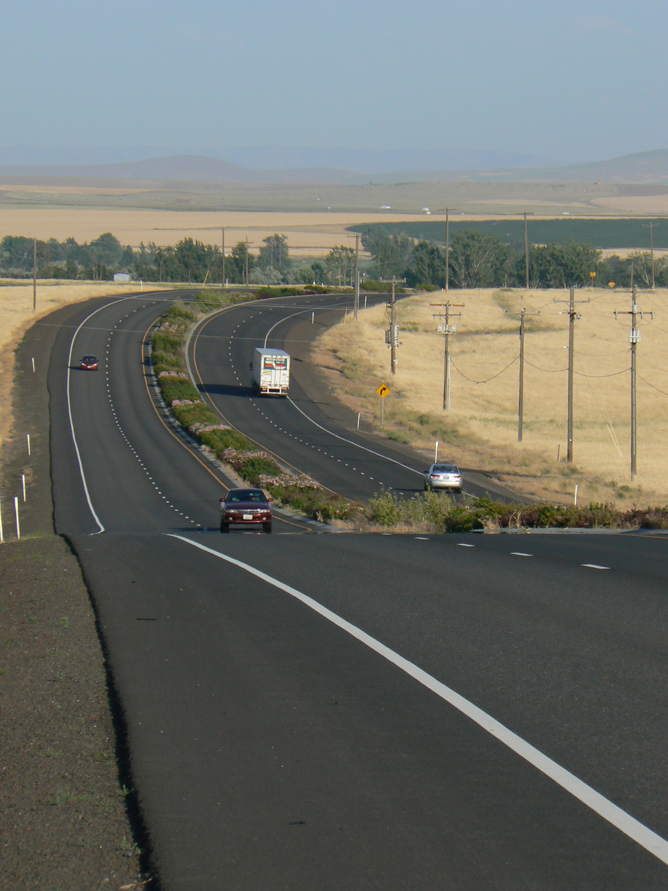
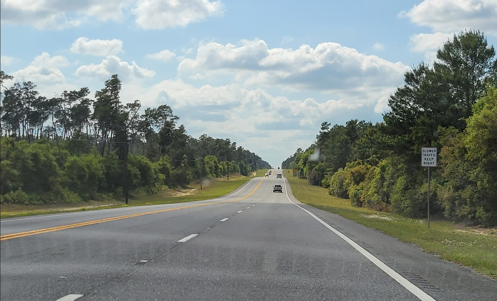
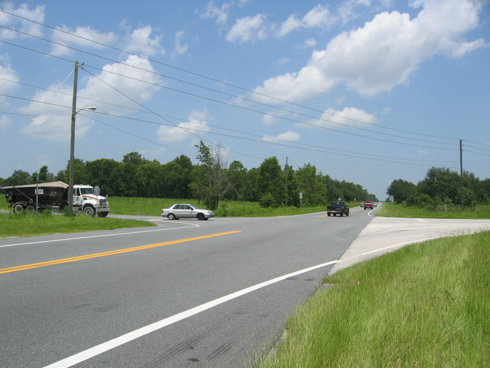

# (PART) Foundations {-}

# Introduction {#Chapter1Intro}

Rural highways account for a very significant portion of the national highway system and serve many vital mobility purposes, such as:

- connectivity between major urban areas,
- access to rural recreational areas (e.g., mountains, lakes, oceans),
- access to special events held in rural areas (e.g., concerts, regional festivals),
- evacuation route for extreme events (e.g., natural disasters), and
- diversion of traffic from another disrupted route.

Despite the importance of rural highways, infrastructure funding to improve operations is often more limited for them versus heavily-congested urban roadways. Thus, to ensure effective investment of such funding, it is essential for highway agencies to be able to identify locations of poor operations and consider appropriate mitigation measures. For this to be possible, an agency needs traffic analysis methods that allow them to examine short sections of highway (e.g., a passing zone, signalized intersection) not just individually, but also within the context of an extended length (many miles) of highway. 

Rural highways, which often span distances of 20-60 miles between urban areas, may consist of segments with a variety of cross-section elements (two-lane highway, multilane highway, passing lane sections) as well as intersections with different traffic controls (signal control, stop control, roundabouts with yield control). A sample of these component roadway configurations is shown in Figure \@ref(fig:RuralHwy3). These component roadway types are described in detail in [Chapter 2](#Chapter2LOS). These highways are usually more varied in horizontal and vertical alignment than urban roadways. The Highway Capacity Manual (HCM) [@HCM7], the standard reference for traffic analysis methodologies, contains analysis methods for all of the individual segments or intersections that may comprise a rural highway; however, it does not include a method, or guidance, for connecting the individual roadway segments into a connected, cohesive, facility-level analysis. It is important to continue to extend the capabilities of the HCM analysis methodologies, particularly at the facility-level, so that roadway design and traffic engineers have the analysis tools they need for performing accurate and comprehensive facility evaluations. Furthermore, analysis at the facility level is consistent with the fact that drivers typically evaluate the quality of their trip over its entire length, not just in separate segments.

## Purpose of Guidebook

This guidebook is intended to assist transportation agencies charged with monitoring, maintaining, and improving rural highways of regional or statewide importance. More specifically, it is intended to assist with the evaluation of rural highways in three areas:

- Motorized vehicle traffic operations per HCM analysis methods,
- Motorized vehicle traffic operations per probe vehicle data analysis methods, and
- Overview of alternative analysis methods, to the HCM, for bicycles and recommendations for future bicycle operations research needs.

With the heterogeneity of cross-section (i.e., roadway segment type) composition over such distances and the disparate HCM service measures (density, follower density, delay) across these segment types, the process for performing a HCM facility analysis across the variety of contiguous segments contained within a rural highway facility is not necessarily straightforward. This guidebook proposes an analysis framework for assessing the level of service (LOS) of automobiles on a long rural highway facility (20+ miles). In addition to level of service, several other facility-level performance measures are presented along with discussion about the analysis context in which such measures are useful for evaluating overall traffic operations along the route.

While simulation is always an option for analyzing a stretch of rural highways, the level of effort would be high for typical rural highway distances considered for analysis. In some situations, simulation may be warranted, but the methodology described in this Guidebook would still be a good first step and may even be completely sufficient. This methodology would also be much more efficient for performing 'what-if' scenario testing, where relative differences in results are the primary concern.

Reliability analyses on freeways and arterials are typically based on HCM guidance on scenario generation and predictive reliability. However, because of the typically limited data availability on rural highways, the reliability analysis in this report is focused on historical probe vehicle data and meant to be used in conjunction with the HCM automobile LOS methodology.

Demand for cycling in urban areas and on rural highways is on the increase; yet is not clear which analysis procedures are best suited to cover large rural highway facilities or statewide analyses. This guidebook summarizes existing HCM analysis methods used for the bicycle mode, as well as two popular alternatives, Level of Stress and Bicycle Compatibility Index. In addition, it proposes recommendations for future bicycle operations research needs based on two qualitative surveys.

This Guidebook is intended to serve as a companion to the HCM.

## Guidebook Scope and Limitations

The facility-level analysis is important in assessing current conditions along important corridors for people and goods movement. The analysis methodology is also useful for evaluating facility performance for situations where significant changes in traffic demand and/or capacity may occur, such as in the following scenarios:

- Evaluation of a rural highway route to handle potential evacuation traffic demand (e.g., forest fire, hurricane)
- Evaluation of a rural highway route to handle potential diversion traffic demand due to an alternative route being closed or restricted due to construction, an incident (e.g., truck rollover) or a natural disaster (e.g., landslide/avalanche, flooding)
- Evaluation of a rural highway route to handle short-term spikes in traffic demand due to recreational activities (e.g., weekend ski season, Labor Day weekend beach travel, concert/festival)
- Evaluation of a rural highway route to handle short-term spikes in traffic demand and/or heavy vehicles due to season-specific activities (e.g., crop harvesting in farming regions)
- Evaluation of a rural highway route to handle a large increase in traffic demand as projected to occur as part of construction of a large generator for the purpose of regional economic development (e.g., tribal casino, Amazon distribution warehouse).

The parameters of the scope for this project generally required that the developed LOS evaluation methodology make use of the existing analysis methodologies within the Highway Capacity Manual. However, to facilitate the development of a facility-level evaluation methodology, it was necessary to develop a few new computational procedures, largely for the purpose of connecting/stitching together component pieces of highway into a single facility for evaluation purposes. Furthermore, some planning-level simplifications, such as the classification of terrain and the treatment of signal progression along an arterial, were implemented. Such simplifications were included to 1) reduce the segmentation process effort and/or 2) reduce the complexity of the calculation process where the return on such precision is minimized for the relatively long lengths of rural highway.

This Guidebook also introduces a method for evaluating rural highway operations with the use of probe vehicle data. Over the last decade, the spatial and temporal coverage of probe vehicle data available from third-party vendors has improved immensely. Many state agencies now pay for subscriptions to providers of such data and are making use of the data to supplement their traditional data sources (e.g., fixed-point sensors) for assessing and managing traffic operations on their roadways.

These data generally consist of average travel times/speeds and correspond to a sample of the vehicles traveling along a given roadway segment; thus, an important limitation of this data source is that it does not include flow rate. To obtain flow rates, agencies may supplement the probe vehicle data with fixed-point sensors or by conducting field data collection using portable sensors on a regular basis. Another limitation of probe data is that their accuracy drops in low traffic conditions, such as late night or early morning, when fewer samples are available.

The spatial resolution of the probe data might also pose a challenge, particularly when analyzing very short segments. Probe data are typically reported for predefined segments of roadway--often referred to as traffic message channels (TMC). The TMCs' length usually ranges from approximately 0.6-2 miles, and the TMC boundaries do not necessarily match those used for other traffic analysis purposes, such as for segments as defined by the HCM. The temporal resolution of the measurements ranges from approximately 1-5 minutes. Currently, the quantity and quality of probe vehicle data are much greater for urban areas than for rural areas. This gap, however, will continue to narrow with time.

The automobile level of service methodology presented in this Guidebook is not intended to handle oversaturated traffic flow conditions. For multilane and two-lane highway segments, the HCM analysis methodologies do not include any mechanism to deal with traffic demand exceeding capacity. In some instances, short periods of demand exceeding capacity can be accounted for in the intersection analysis methodologies. The HCM should be consulted for further information on this topic. 

## Guidebook Organization

This guidebook is organized into three parts. 

***Part I***

The first part is focused on analysis methodology descriptions and consists of the following chapters:

- Chapter 1 - Introduction: This chapter provides an overview of the guidebook’s purpose, scope, and limitations. It also discusses the format of the guidebook and how the user community can contribute to the content. Further, the chapter provides a brief summary of the research behind this Guidebook.
- Chapter 2 - Rural Highway Level of Service for Automobiles: This chapter provides the methodology used to assess traffic operational quality and level of service for the automobile mode on rural highways.
- Chapter 3 - Automobile Travel Time Reliability: This chapter describes methods for quantifying travel time reliability, from a historical perspective, based on probe vehicle travel speed measurements.
- Chapter 4 - Bicycle Operations Analysis on Rural Highways: This chapter provides an overview of commonly used methods for assessing bicycle operations, recommendations for which methods are most appropriate for certain bicycle analysis situations, and recommendations for enhancements to the commonly used analysis methods.

***Part II***

The second part provides an overview of the component Highway Capacity Manual (HCM) analysis methodologies that are incorporated in the rural highway analysis methodology for automobiles. This chapter does not replicate the full content of the relevant HCM analysis methodologies, but rather summarizes the chapters and sections that are utilized within the rural highway analysis methodology. This material will be updated as necessary to reflect updates to the HCM.

***Part III***

The third part is focused on case studies using real-world routes to demonstrate the analysis methodologies in the Guidebook. This material is contained in a separate part of the document to facilitate the inclusion of additional case studies more easily in the future.

## Guidebook Format

This Guidebook was developed using Bookdown [@R-bookdown]. It is a robust and dynamic format that combines the advantages of HyperText Markup Language (HTML) and GitHub (https://github.com/). This publishing model has become possible due to relatively recent digital technology developments and is becoming increasingly popular.

This electronic format offers advantages over a printed format (e.g., search capabilities, ability to quickly move from location to another with hyperlinks), and furthermore, the HTML implementation provides advantages over a PDF electronic format. For example, the HTML format is not constrained to a linear presentation of the material, nor is it restricted to a conventional printed page size. Note that because content (text, figures, tables, etc.) is presented in a continuous format for a given table of contents entry (e.g., Chapter 1), page numbering is not applicable. 

Hosting the Guidebook on GitHub will facilitate more interaction with the user community (errata updates, potential additions, etc.) and the ability to revise the document quickly and easily. The Bookdown implementation does also provide the capability to create a PDF document. More information about Bookdown can be found at https://pkgs.rstudio.com/bookdown/ and https://github.com/rstudio/bookdown.

When updates to the Guidebook are made, the user can view a record of such updates through GitHub 'Actions' (include URL)

### Navigating the document

Several features are provided in the Guidebook to facilitate navigating the document. These features are primarily contained within the toolbar at the top of the page and the sidebar panel on the left side of the page.

***Top Toolbar***

The "hamburger" menu icon toggles the display of the sidebar (table of contents). The hourglass icon toggles a search textbook, which will appear in the upper-left corner of the page. This will locate the search term throughout the entire Guidebook. The standard CTRL+F function can be used to search for text within the active page; for example, a chapter or appendix page. The letter 'A' icon provides options for adjusting font size and style and changing the color theme.

Edit icon: This opens up the source for the page on Github. It is not currently active.

Download icon: This provides options for downloading a PDF or EPub version of the Guidebook. It is not currently active.

Information icon: Shows keyboard shortcuts that can be used to navigate the document.

***Sidebar***

The sidebar contains the table of contents.

From https://bookdown.org/yihui/bookdown/html.html
"The first- and second-level headings appear in the current chapter’s sidebar, which sticks to the top of the page as you scroll down. When a section is navigated to, third-level subheadings like “A subsection” will auto-expand."

If an item in the table of contents is truncated because the text is too wide, you can hover the cursor over it to see a tooltip showing the full text.

By default, only first- and second-level headings are displayed. If you click on a second-level heading with the cursor, it will expand and display any third-level headings if they are present. Clicking the second-level heading again will hide the third-level headings.

### How to provide feedback on this document {#ProvidingFeedback}

The preferred mechanism for submitting feedback is to submit an 'Issue' to the Guidebook source material site. From the [Issues Page](https://github.com/NCHRP-08-135/Guidebook/issues), press the 'New issue' button. This method does require that you have a GitHub account. If you do not have one, you can create one for free at [GitHub Signup](https://github.com/signup).

Alternatively, if you do not wish to create a GitHub account or are unable to, you can send an Email to [Dr. Scott Washburn](mailto:swash@ce.ufl.edu) and/or [Dr. Ana Moreno](mailto:ana.moreno@tum.de) to report the issue. 

With either method of providing feedback, please be as specific, yet concise, as possible in your description/discussion.


## Supporting Resources and Tools {#SupportingResources}

Several complimentary resources are provided with this Guidebook.

*LOS calculation software and case study input files*
The level of service calculation methodology described in this Guidebook is available in the software tool HCM-CALC. This program can be downloaded from https://github.com/swash17/HCM-CALC. [The Computational Engine chapter](#CompEngine) also provides an overview of the software tool. Input data files for the case studies for the HCM-CALC software are also available.

*Scripting code/tools for 'reliability' calculations/output*
Scripts, written in Python programming code^[https://www.python.org/about/], to process probe vehicle data and produce a variety of visualizations are provided. More information is provided in [Chapter 3](#Chapter3Reliability).

*KML files for case studies*  
For each of the case studies, supporting information for the segmentation process is included in a KML file^[A Keyhole Markup Language (KML) file contains geographic and supporting data for use with geographic software visualization tools. More information can be found at https://en.wikipedia.org/wiki/Keyhole_Markup_Language]. Detailed information about the KML files is provided in the introduction to [Part 3: Case Studies](#CaseStudyIntro). 


More information about these resources is contained in the [Introduction to Case Studies chapter](#CaseStudyIntro).

This guidebook was developed through NCHRP Project 08-135: Reliability and Quality of Service Evaluation Methods for Rural Highways. A final report was also produced for this project @NCHRP-Project-08-135. That report contains additional details about the development of the material contained in this Guidebook.


```{r RuralHwy1, echo=FALSE,out.width="40%", fig.show="hold"}


```

```{r RuralHwy2, echo=FALSE,out.width="40%", fig.show="hold"}
knitr::include_graphics("./Images/TwoLanePassZone.jpg")
knitr::include_graphics("./Images/TwoLanePassConstrained.jpg")
```

```{r RuralHwy3, echo=FALSE, fig.cap='A Sample of Rural Highway Component Roadway Configurations', out.width="40%", fig.show="hold"}
knitr::include_graphics("./Images/RuralHwySignal.jpg")

```
