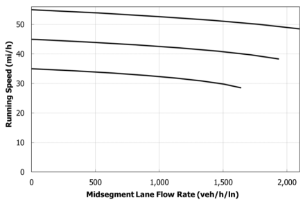
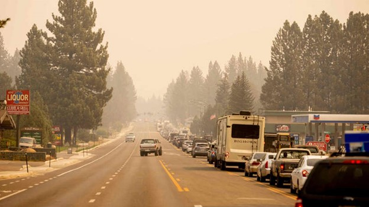
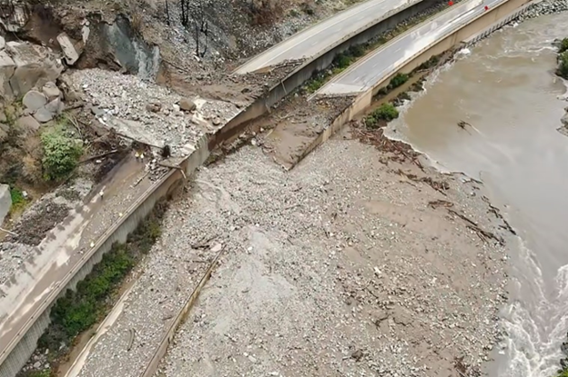

# Rural Highway Level of Service for Automobiles {#Chapter2LOS}

## Introduction {#LOSIntro}

This chapter describes the methodology to perform a traffic operations and level of service analysis, for the automobile mode on rural highways. This analysis methodology relies on the existing analysis methodologies in the Highway Capacity Manual (HCM). Specifically, it utilizes analysis methods for the following roadway types, all of which may be contained within a rural highway route:

- Multilane Highways
- Two-lane Highways
- Urban Streets
- Signalized Intersections
- All-way Stop Control (AWSC) Intersections
- Roundabout Intersections

Part 3 of the Guidebook provides an overview of these analysis methods. This appendix is not intended to duplicate in full the analysis methodology material provided in the HCM, but rather to provide a concise summary of the applicable equations, exhibits, and nomenclature for each analysis methodology utilized in the rural highway LOS methodology. 

Because of the relatively long distances involved in a rural highway analysis and the corresponding volume of calculations, it is necessary to implement some simplifying assumptions into the analysis methodology. If the HCM contains alternative calculation procedures, such as those intended for planning and preliminary engineering applications, they are utilized in this methodology as appropriate. There are a few additional situations for which analysis simplifications are proposed for this methodology that are not currently addressed by the HCM. These simplifications are discussed further in this chapter and are clearly identified in the material in [Part 3](#HCMmethodsIntro).

It should be noted that the analysis methodology is direction specific. That is, results are specific to a single direction. For some roadway configurations, information about other directions of travel (traffic, roadway, control) may be needed to determine the operational quality for the analysis direction of travel. For example, for a two-lane highway passing zone, it is necessary to know the traffic volume in the opposing direction. Likewise, for intersections, such as roundabouts and all-way stop controlled, traffic operations on a given approach are affected by traffic demands and lane configurations on other approaches.

The remainder of this chapter describes:

- the process used to divide a rural highway into its component segments
- the calculation of segment and facility performance measures and LOS
- alternative performance measures that can be used to assess facility operational quality

## Facility Segmentation {#Segmentation}

A critical step in a facility-level analysis framework is facility segmentation; that is, dividing the facility in question into its basic components of segments and junctions. First, a description of the applicable roadway types for a rural highway analysis is provided.

***Multilane Highway Segments***

HCM Page 12-4: "*Multilane highways generally have four to six lanes (in both directions) and posted speed limits between 40 and 55 mi/h. In some states, speed limits of 60 or 65 mi/h or higher are used on some multilane highways. These highways may be undivided (with only a centerline separating the directions of flow) or divided (with a physical median separating the directions of flow), or may have a two-way left-turn lane (TWLTL). They are typically located in suburban areas, leading into city centers, and along high-volume rural corridors, connecting two cities or activity centers that generate a substantial number of daily trips.*"

HCM Page 12-5: "*Uninterrupted flow on multilane highways is similar to that on basic freeway segments. However, there are several important differences. Because side frictions are present in varying degrees from uncontrolled driveways and intersections, as well as from opposing flows on undivided cross-sections, speeds on multilane highways tend to be lower than those on similar basic freeway segments. The basic geometry of multilane highways also tends to be more constrained than that of basic freeway segments, consistent with lower speed expectations. Finally, isolated signalized intersections can exist along multilane highways. The overall result is that speeds and capacities on multilane highways are lower than those on basic freeway segments with similar cross-sections.*"

***Two-Lane Highway Segments***

HCM Page 15-1: "*Two-lane highways have one lane for the use of traffic in each direction. The single lane in each direction may be supplemented with passing lanes, truck climbing lanes, turnouts, or pullouts. Two-lane highways with a continuous middle lane used for alternating passing lanes, referred to as a “2+1” configuration, is also addressed in Appendix A of this chapter.*"

"*The principal characteristic that distinguishes the analysis of motor vehicle traffic on two-lane highways from other uninterrupted-flow facilities is that passing maneuvers take place in the opposing lane of traffic. Passing maneuvers are limited by the availability of gaps in the opposing traffic stream and by the availability of sufficient sight distance for a driver to discern the approach of an opposing vehicle safely. As demand flows and geometric restrictions increase, opportunities to pass decrease. This creates platoons within the traffic stream, with trailing vehicles subject to additional delay because of the inability to pass the lead vehicles. Consequently, operating quality on two-lane highways can become “unacceptable” at relatively low volume-to-capacity ratios and/or high average travel speeds. For this reason, few two-lane highways ever operate at flow rates approaching capacity; in most cases, poor operating quality leads to improvements or reconstruction long before demand reaches capacity.*"

***Urban Streets***

HCM Page 16-6: "*For the purpose of analysis, the urban street is separated into individual elements that are physically adjacent and operate as a single entity for the purpose of serving travelers. Two elements are commonly found on an urban street system: points and links. A point represents the boundary between links and is usually represented by an intersection or ramp terminal. A link represents a length of roadway between two points. A link and its boundary intersections are referred to as a segment. An urban street facility is a length of roadway that is composed of contiguous urban street segments and is typically functionally classified as an urban arterial or collector street.*"

Thus, an urban street facility is the combination of contiguous urban street segments, and an urban street segment is the combination of a roadway link that connects to an intersection at its downstream boundary. Although the HCM uses the term 'urban street' to describe what is often referred to as an arterial, the corresponding analysis methodology may be applicable to sections of roadway in a rural setting. For the purposes of a rural highway analysis, a section of roadway that should be analyzed as an urban street facility is referred to as an 'arterial segment'.

***AWSC Intersections***

HCM Page 21-1: "*All-way STOP-controlled (AWSC)intersections are characterized by having all approaches controlled by STOP signs without any street having priority.*" 

***Roundabout Intersections***

HCM Page 22-1: "*Roundabouts are intersections with a generally circular shape, characterized by yield on entry and circulation around a central island (counterclockwise in the United States).*"

***Signalized Intersections***

A signalized intersection uses an electronic controller (signal controller) to communicate the right-of-way to vehicles on the approaches. This communication is implemented through a collection of light-emitting devices and lenses that are housed in cases of various configurations (referred to as signal heads) whose purpose is to display red, yellow, and green full circles and/or arrows. The signal controller may also make use of vehicle detection devices on one or more approaches to potentially factor into the utilized display patterns and durations. 


The process of partitioning a facility into its component segments considers the following factors:  

- cross-section – number of lanes 
- passing accommodations for two-lane highways – passing lanes, passing in the oncoming lane; because the analysis is direction specific, it is only the centerline marking applicable to the traffic stream moving in the analysis direction that is considered
- posted speed limit
- geometric alignment – grades and horizontal curves
- Intersections and their influence area – the distance upstream and downstream from the intersection where traffic operation is strongly influenced by intersection control (signalized, stop, or roundabout)
- Area context (rural versus rural town)

### Cross Section {#CrossSection}

For different segment types, the process is relatively straightforward. For example, the start (or end) of passing lane sections or multilane highway sections roughly coincide at the location of lane addition (or lane drop).

#### Two-lane highway passing lane segment versus multilane highway segment

In most situations, it should be clear to the analyst whether a section of highway with two directional lanes should be analyzed with the multilane highway analysis methodology or two-lane highway passing lane segment analysis methodology. However, the HCM does not provide explicit guidance on this issue. This section provides such guidance for selecting the appropriate analysis methodology as well as situations in which both analysis methodologies may provide similar LOS results.

A two-lane highway passing segment, referred to hereafter as a passing lane segment, is typically a short length (3 miles or less) of roadway with two directional lanes that is preceded and succeeded by relatively longer stretches of two-lane highway (1-lane per direction). Two-lane highway passing lane segments are intended to break up platoons of vehicles that have formed upstream due to extended stretches of two-lane highway with limited or no passing opportunities. Operations within the passing lane segment are typically marked by many lane changes at or near the beginning of the passing lane segment--slower or faster vehicles moving to the added lane, depending on signage--and many lane changes at or near the end of the passing lane segment due to the lane drop.

The two-lane highway passing lane segment analysis methodology is not intended for application to stretches of two-lane roadway (one direction) in the following situations/configurations:

- an intersection is at the point of transition from one lane to two lanes (same direction) for the highway
- a single lane stretch of highway that expands to two lanes (same direction) due to a lane addition from an interchange on-ramp or similar

To understand why it is important to apply the appropriate analysis methodology, a brief review of the key analysis components is first provided. Figure \@ref(fig:HCMMLHwySpeedFlowCurves) shows speed-flow curves for a multilane highway segment. Figure \@ref(fig:PassingLaneExample) shows an example speed-flow curve for a passing lane segment. There is a general similarity in the shape of the curves between the two segment types, as should be expected due to the multilane configuration of both segment types.


```{r HCMMLHwySpeedFlowCurves, echo=FALSE, fig.cap='Multilane Highway Segment Speed-Flow Curves Plot',out.width="45%", fig.align='center'}
knitr::include_graphics("./Images/LOS/HCMMLHwySpeedFlowCurves.png")
```

```{r PassingLaneExample, echo=FALSE, fig.cap='Passing Lane Segment Speed-Flow Curve Plot',out.width="45%", fig.align='center'}
knitr::include_graphics("./Images/LOS/PassingLaneSpeedFlowCurves.png")
```

Note: Upper curve (blue) is for vertical class 1, 5% HV, lower curve (orange) is for vertical class 5, HV% = 15%, BFFS = 55 mi/h, segment length = 1.5 mi


It should be noted that the flow rate units for the multilane highway speed-flow plot are pc/h; whereas the flow rate units for the passing lane segment are veh/h. The two-lane highway analysis methodology does not utilize the passenger car equivalence (PCE) concept. Increasing truck percentage in the traffic stream does not change the shape of the multilane highway speed-flow curve, rather, it just increases the analysis flow rate along the same curve (further to the right along the x axis). Because of limited passing opportunities along two-lane highways, heavy vehicles in the traffic stream can result in very significant speed reductions for the entire traffic stream, especially on upgrades. Thus, it is necessary to be able to change the shape of the speed-flow curve, such as shown with the lower curve in Figure \@ref(fig:PassingLaneExample). With this approach, the percentage of heavy vehicles is used directly, rather indirectly through the PCE concept. For more information about this topic, please see [@NCHRP-Project-17-65]. Additionally, the multilane highway performance measure results are considered to be 'segment-wide', whereas passing lane segment results apply to the midpoint of the segment.

Other significant differences in the analysis methodology are with respect to segment length and grade, as follows:

- Segment length
  - Multilane highway segment: Length is only a factor for the multilane highway analysis when there is a specific grade (i.e., not level or rolling general terrain);
  - Passing lane segment: Length is a factor for two-lane highway analysis, regardless of grade, up to the maximum practical length
- Segment grade
  - Multilane highway segment: Grades $\ge$ 6% give the same results due to the limits of the PCE values in HCM Exhibits 12-26 - 12-28
  - Passing lane segment: Grade incline and length translated to appropriate vertical alignment class (1-5)

An analysis of the differences in LOS results between multilane highway segments and passing lane segments is provided in the NCHRP 08-135 Project Final Report [@NCHRP-Project-08-135].

Based on these results, the following conclusions and guidance are provided:

**Multilane Highway Segment**

- The LOS results are generally insensitive to grade for 0% heavy vehicles.
- For level terrain, LOS will always be 'A' or very close, as the max flow rate that could enter a passing lane segment is around 1800 veh/h (900 veh/h/ln).
- For a specific grade analysis, the LOS results for grades of 6% and higher will be same because 6% is highest grade for which PCE values are provided.
- For a specific grade analysis, the LOS results will be the same for segment lengths of 1.5 miles for grades $\le$ 3.5% or 1.0 miles for grades $\ge$ 4.5%, due to the limits of the PCE values in HCM Exhibits 12-26 - 12-28.

**Passing Lane Segment**

- The LOS results will be the same for lengths of 3 miles and greater, as a function of the segment length limits in HCM Exhibit 15-10. This generally reflects the diminishing returns in platoon dispersion for passing lane segment lengths greater than 3 mi in length.

For the following conditions, the same LOS results can be expected from both the multilane highway and passing segment analysis methodologies. Note that these conditions are specific to resulting LOS values, not necessarily any specific performance measure results, such as average speed.

- Segment lengths $\ge$ 1.5 miles and flow rates $\le$ 300 veh/h.
- Segment lengths $\ge$ 2.5 miles and flow rates $\le$ 600 veh/h.

For other conditions, it is important to choose the appropriate analysis methodology.

### Passing Accommodations for Two-Lane Highways
The pavement centerline markings are used to delineate passing restricted sections and passing zones. Such pavement markings may also be accompanied by 'DO NOT PASS' and/or 'NO PASSING ZONE' signage. Such signs are designated in the Manual on Uniform Traffic Control Devices (@MUTCD2009) as 'R4-1' and 'W14-3', respectively.

### Posted Speed Limit Changes
Generally, a segment should have a consistent posted speed limit (PSL) across its length. If the length of roadway to which a specific PSL is applied is short, it may be reasonable to include this length of roadway with another segment. Such a scenario is described in the example in [Case Study 1: Oregon US-20].

### Geometric Alignment Considerations
Vertical and horizontal alignment along a rural highway route can be quite variable and introducing a new segment for each change in grade and/or horizontal curvature will likely result in a large number of segments for a route of 20 miles or more. For this analysis methodology it is proposed to only introduce segmentation changes for geometry that will likely result in significant speed reductions for heavy vehicles. Consequently, the following segmentation guidelines with respect to geometric alignment are proposed to account for such speed impacts on heavy vehicles:

- Two-lane highway segments
  - Only consider vertical curves that are class 2 or higher (per the HCM two-lane highway methodology)
  - Combine contiguous segments with the same vertical alignment classification
  - Only consider horizontal curves that are class 3 or higher (per the HCM two-lane highway methodology)
  - Combine contiguous segments with the same horizontal alignment classification

- Multilane highway segments
  - Current ‘level’ and ‘rolling’ terrain guidelines will apply; for steeper/longer grades, only the specific grade approach will be applied—the ‘mixed flow’ model will not be applied because of its complexity; when there are consecutive grades that should be analyzed with the specific grade approach, the following guidance applies: if the individual grades are less than or equal to 0.5 miles, they are combined into a single segment and the highest grade percentage is applied over the entire length. If a grade is longer than 0.5 miles, it is treated it as an individual segment.

### Intersections and their Influence Area {#IntxInfluenceArea}

Intersections that require the major street through movement to stop or yield should be treated as individual segments. A series of intersections may also be part of an urban street, also referred to as an arterial, segment. This distinction is discussed in the next section. Common intersection forms that apply stop or yield control to the major street through movement include signalized, roundabout, and all-way stop-controlled (AWSC) intersections. Intersection forms that do not apply control to the major street through movement, such as two-way stop-controlled (TWSC), restricted crossing U-turn (RCUT), and median U-turn (MUT) intersections should not be treated as separate segments. They could serve as a break-point between segments if the geometry changes from upstream to downstream of the intersection or if the turning movement volumes at the intersection result in a significant major street through movement volume difference from upstream to downstream of the intersection. Only a volume change of more than 5% is considered significant for the purposes of this analysis methodology. This same guidance applies to points along that highway that connect to an interchange (off-ramp and/or on-ramp connection).

The geometric characteristics of the roadway immediately upstream and downstream of an intersection often change to accommodate features such as turn bays. These geometric changes are often manifested through tapering to lanes upstream and/or drop lanes downstream. In the initial setup of the facility, the length of the intersection segment should correspond to the distance between where the geometric characteristics start and end to accommodate the intersection area. This distance is referred to as the 'geometric area'. By default, the methodology assumes a value of 660 ft for both the upstream and downstream geometric area distances, for a total length of 1320 ft (0.25 mi). The analyst can override these values as desired. While the geometric area essentially defines the physical spatial extent of the intersection, the traffic analysis methodology is dependent upon the operational influence area of the intersection.

On interrupted-flow facilities such as urban street networks and non-freeway rural facilities, the need for the major street through movement to slow down or stop at signalized, roundabout, or AWSC intersections impacts traffic operations along the connecting highway segments. In practice, intersections are represented as point locations in a link-node network configuration; however, its operational effects extend for some distance on the connecting upstream (entry) and downstream (exit) approaches, thus affecting the operational performance of highway segments in the proximity of intersections. Specifically, vehicles may need to stop or slow down as they approach the intersection and then accelerate to the downstream segment running speed as they exit the intersection. Understanding the spatial extent of intersection impacts on connecting approaches is important for an accurate evaluation of operational performance along facilities consisting of multiple segments and junctions. For facility-level analysis, the quality-of-service assessment should not only include the physical intersection area, but also the lengths along all approaches that are affected by the intersection, commonly known as the “influence area” or "effective length." An illustration of the influence area concept is shown in Figure \@ref(fig:InfluenceArea).  

```{r InfluenceArea, echo=FALSE, fig.cap='Illustration of Intersection Influence Areas',out.width="80%", fig.align='center'}
knitr::include_graphics("./Images/LOS/Influence Area.png")
```

Equations to calculate the upstream and downstream influence area (IA) for roadway approaches that are signal, roundabout, and stop controlled are as given by Eqs. \@ref(eq:InfluenceAreaEq1) - \@ref(eq:InfluenceAreaEq6). Again, the influence area calculations are direction specific.

\begin{equation}
\textit{IA-Signal}_{US} = -923.89 + 35.92 \times UpstreamAvgSpeed + \\ 1.23 \times PctHV - 374.05 \times I_{ML}
(\#eq:InfluenceAreaEq1)
\end{equation}

Where:  
$\textit{IA-Signal}_{US} =$ Influence area upstream of signalized intersection, ft  
$UpstreamAvgSpeed =$ Mean speed of traffic approaching intersection, mi/h  
$PctHV =$ Percentage of heavy vehicles in traffic stream approaching intersection, %  
$I_{ML} =$ Indicator variable for directional number of through lanes on approach to intersection (0 = one lane, 1 = multiple lanes)

\begin{equation}
\textit{IA-Signal}_{DS} = -1929.64 + 60.25 \times DownstreamAvgSpeed + \\ 7.23 \times PctHV - 154.15 \times I_{ML}
(\#eq:InfluenceAreaEq2)
\end{equation}

Where:  
$\textit{IA-Signal}_{DS} =$ Influence area downstream of signalized intersection, ft  
$DownstreamAvgSpeed =$ Mean speed of traffic downstream of intersection influence area, mi/h 
Other variables as previously defined

\begin{equation}
\textit{IA-Roundabout}_{US} = 402.15 + 10.21 \times UpstreamAvgSpeed - \\ 15.27 \times AvgCircSpeed
(\#eq:InfluenceAreaEq3)
\end{equation}

Where:  
$\textit{IA-Roundabout}_{US} =$ Influence area upstream of roundabout intersection, ft  
$AvgCircSpeed =$ Average speed of traffic within roundabout circular roadway, mi/h  
Other variables as previously defined

\begin{equation}
\textit{IA-Roundabout}_{DS} = -313.80 + 32.73 \times DownstreamAvgSpeed - \\ 27.01 \times AvgCircSpeed
(\#eq:InfluenceAreaEq4)
\end{equation}

Where:  
$\textit{IA-Roundabout}_{DS} =$ Influence area downstream of roundabout intersection, ft  
Other variables as previously defined

\begin{equation}
\textit{IA-StopControl}_{US} = -1147.62 + 38.82 \times UpstreamAvgSpeed
(\#eq:InfluenceAreaEq5)
\end{equation}

Where:  
$\textit{IA-StopControl}_{US} =$ Influence area upstream of stop control intersection approach, ft  
Other variables as previously defined

\begin{equation}
\textit{IA-StopControl}_{DS} = -1067.63 + 44.38 \times DownstreamAvgSpeed
(\#eq:InfluenceAreaEq6)
\end{equation}

Details on the development of these equations can be found in the NCHRP 08-135 Project Final Report [@NCHRP-Project-08-135]. However, it should be noted here that these equations were developed based on data from roadways with posted speed limits of 45 mi/h and higher. Consequently, Eqs. \@ref(eq:InfluenceAreaEq1) - \@ref(eq:InfluenceAreaEq6) may yield unreasonable results for roadways with lower posted speed limits. Both the upstream and downstream influence distances are compared against practical minimum influence distances, namely, practical stopping distance for the upstream influence area and practical acceleration distance for the downstream influence area. In both cases, for simplicity, the reference speed is the posted speed limit.

The calculated upstream influence area value should be compared to braking distance, per Eq. \@ref(eq:BrakingDistance), and the maximum value used.

\begin{equation}
BrakingDistance = \frac{V_{Init}^2}{2a}
(\#eq:BrakingDistance)
\end{equation}

Where:  
$BrakingDistance =$ distance for vehicle to decelerate from speed $V_{Init}$ to a stop, in feet  
$V_{Init} =$ initial speed, in ft/s; posted speed limit is recommended value  
$a =$ deceleration rate, 10.0 ft/s/s, based on Institute of Transportation Engineers (ITE) recommendations for slowing on an approach to a signalized intersection (@ITEtrafengr)

Likewise, the calculated downstream influence area value should be compared to practical acceleration distance, per Eq. \@ref(eq:AccelDistance), and the maximum value used. Note that this formula is simplified, by assuming level grade.

\begin{equation}
AccelDistance = 0.1655 \times {V_{Final}^{2.0917}}
(\#eq:AccelDistance)
\end{equation}

Where:  
$AccelDistance =$ distance for vehicle to accelerate from a stop to speed $V_{Final}$, in feet  
$V_{Final} =$ final speed, in ft/s; posted speed limit is recommended value


The adjusted length of an intersection segment is calculated by adding the difference between the upstream/downstream influence areas to the upstream/downstream geometric areas. This difference (delta) calculation is given by Eq. \@ref(eq:InfluenceAreaDeltaEq).

\begin{equation}
\Delta = InfluenceArea - GeometricArea (\#eq:InfluenceAreaDeltaEq)
\end{equation}


Note that if the upstream/downstream geometric area distance is greater than the upstream/downstream influence area distance, the delta value will be negative. While there are multiple distance calculations associated with this process, the intersection area is represented by a single segment within the facility with a length equal to the length resulting from this calculation process. 

There are two configurations for which an upstream or downstream influence area will not be calculated.

- Two closely-spaced intersections: This configuration applies to a situation where two intersections are relatively close to one another, such as for interchange ramp terminal intersections. In this situation, the two intersections would be represented in the facility as two consecutive intersection segments; that is, there would not be a two-lane or multilane highway segment in between the intersections). In a closely-spaced intersection configuration, the short distance between the upstream and downstream intersections largely controls acceleration and deceleration behavior. The guidelines for calculating the influence areas are as follows:
  - Upstream intersection: Calculate upstream influence area per Eq. \@ref(eq:InfluenceAreaEq1), \@ref(eq:InfluenceAreaEq3), or \@ref(eq:InfluenceAreaEq5). Set the downstream influence area to the downstream physical length.
  - Downstream intersection: Set the upstream influence area to the upstream physical length. Calculate downstream influence area per Eq. \@ref(eq:InfluenceAreaEq2), \@ref(eq:InfluenceAreaEq4), or \@ref(eq:InfluenceAreaEq6).
- Urban street: The traffic flow operations between the upstream and downstream bounding intersections are directly accounted for by the Urban Street Facility analysis methodology. The guidelines for calculating the influence areas are as follows:
  - First intersection of urban street: Calculate upstream influence area per Eq. \@ref(eq:InfluenceAreaEq1), \@ref(eq:InfluenceAreaEq3), or \@ref(eq:InfluenceAreaEq5). The downstream influence area is not calculated.
  - Last intersection of urban street: Calculate downstream influence area per Eq. \@ref(eq:InfluenceAreaEq2), \@ref(eq:InfluenceAreaEq4), or \@ref(eq:InfluenceAreaEq6). The upstream influence area is not calculated. 

It is also possible that the calculated adjusted length for a connecting upstream and/or downstream segment to an intersection segment may result in a negative value. This is likely to happen when such connecting segments are relatively short, on the order of a couple of hundred feet or less. In such a case, the connecting segment(s) with a negative adjusted length should be merged with the intersection segment. 

Examples of the segmentation process are provided in the case studies.


### Classification of Urban Street {#UrbanStreetClassification}

Rural highways often include short lengths of roadway (a few miles or less) that run through one or more small towns along the route. The first question to answer is whether such a stretch of roadway should be included in the rural highway facility analysis. In making this determination, the first consideration is to assess the context classification of the developed area that connects to a rural highway, per AASHTO’s *A Policy on Geometric Design of Highways and Streets* [@GreenBook7], hereafter referred to as the “Green Book”. 

The Green Book provides the following context classifications (from Section 1.5: Context Classification for Geometric Design):

* Rural
* Rural Town
* Suburban
* Urban
* Urban Core

Regarding the definitions for these context classifications, the Green Book states:

- These contexts are defined based on development density (existence of structures and structure types), land uses (primarily residential, commercial, industrial, and/or agricultural), and building setbacks (distance of structures to adjacent roadways). These five contexts were initially presented in NCHRP Report 855, *An Expanded Functional Classification System for Highways and Streets* [@NCHRPRep855] , which has prepared a guide for classifying contexts and applying the context classes in design.

Additionally, the Green Book states (p. 1-17):

- It is intended that the context for a road or street be identified through a simple review of the character of development in the field or using an aerial photograph, without the need for quantitative analysis. The primary factors that define the context classes—development density, land uses, and building setbacks—are easy to identify by observing the landscape adjacent to an existing or planned facility. Other factors including topography, soil type, land value, population density, and building square footage are related to context classification; however, data on these other factors are more quantitative and more difficult to acquire, so the context classification system does not rely on them.

In terms of considering whether to include a stretch of roadway through a town as part of the rural highway facility, only roadways that would be classified as ‘rural town’ should be included. Roadways that fit in the suburban, urban, or urban core context should be excluded from the rural highway facility analysis methodology. In rural town areas, the highway passing through the town is generally the only major roadway in the town and a large percentage of traffic on the roadway is pass-through traffic. While the above discussion from the Green Book emphasizes a qualitative-based determination of the context, it should be noted that highways that fit within the rural town context are usually in towns with a population of 5000 or less. This population value is the threshold used in the FHWA classification for an urban versus a rural area.

If the stretch of roadway through a developed area is consistent with the rural town context, and therefore should be included in the rural highway facility analysis, then the next determination is which analysis methodology, or methodologies, to apply to the stretch of roadway through the town. For example, for a stretch of roadway that includes a series of intersections with control on the major street (signalized, yield, stop), the operational characteristics of the roadway may make it most suitable for analysis with the ‘Urban Street Facilities’ analysis methodology (HCM Chapter 16). Otherwise, it may be more appropriate to treat the roadway section as a combination of uninterrupted flow segments (multilane or two-lane highway) and isolated intersections (with influence areas). This determination is generally a function of the following factors:  

* Posted speed limit
* Roadway and roadside design
* Progression quality between signalized intersections if present

#### Posted Speed Limit

The HCM Urban Street Facilities analysis methodology is designed for roadways that travel through urbanized or semi-urbanized environments and consequently can consider many of the conditions that are present in those environments--frequent intersections, roadside activity such as on-street parking, median restrictions, presence of curbs, and signal coordination. In some situations, however, the roadway characteristics may be similar to basic two-lane or multilane highways segments, but with low posted speed limits through the urbanized area (e.g., a small town). In these situations, it may be reasonable to apply the two-lane or multilane highway analysis methodology rather than the Urban Street Facilities analysis methodology.

The text of HCM Chapter 15 (Two-Lane Highways) mentions that two-lane highways have posted speed limits of 35 mi/h and higher (p. 15-11), and free-flow speeds ranging from 40-75 mi/h (p. 15-19). The methodology does not explicitly state that it should not be applied to roadways with low posted speeds (20-30 mi/h); however, the development of the methodology did not explicitly consider data from such roadways. 

As an example, Figure \@ref(fig:HCMTwoLaneSpeedFlowPlots) shows speed-flow curves for a two-lane highway segment with the following characteristics.

* Segment type: Passing constrained
* Segment length: 1 mi
* Vertical alignment class: 1
* Base free-flow speed: 25 mi/h
* Percent heavy vehicles: 0 (blue), 5 (orange), 10 (red), 15 (green)

```{r HCMTwoLaneSpeedFlowPlots, echo=FALSE, fig.cap='HCM Two-Lane Highway Speed-Flow Plots for Low Posted Speed',out.width="30%", fig.align='center'}
knitr::include_graphics("./Images/LOS/HCMSpeedFlowCurvesLowPostedSpeed.png")
```

HCM Exhibit 18-12, shown in Figure \@ref(fig:HCMExhibit18-12), illustrates the general trend of the speed-flow relationship for an urban street. The lower trend line approximately corresponds to a posted limit of 25 mi/h. 

```{r HCMExhibit18-12, echo=FALSE, fig.cap='HCM Exhibit 18-12',out.width="30%", fig.align='center'}

```

There is enough similarity between the two-lane highway and urban street facility speed-flow curves that it is reasonable to apply the two-lane highway analysis methodology to low posted speed roadways that do not include roadside characteristics that would necessitate application of the urban street facility methodology, as discussed in the following section.

Despite a similarity in speed-flow relationship between two-lane highway segments and urban streets--when there is little to no roadside activity and no intersections that impose control on the major through movement--the service measures are different. Follower density is used to assess LOS for two-lane highway segments, whereas average speed is used to assess LOS for urban streets. Thus, this aspect should also be considered in choosing between the two approaches. In other words, the context of the roadway within the surrounding land uses may need to be the determining factor in this decision.

The HCM multilane highway analysis methodology is intended for application to roadways with a posted speed limit of 40 mi/h and higher. Furthermore, the analysis methodology calculations are not designed to accommodate roadways with free-flow speeds less than 45 mi/h. Thus, for multilane roadways with posted speed limits less than 40 mi/h, the urban street facility methodology should be applied.   

#### Roadway and Roadside Design

There are certain roadway configurations where a section of roadway would classify it as an ‘urban street’ for analysis purposes:

* On-street parking
* Mid-block delay sources such as bus stops
* Frequent driveway access points with significant entering/exiting turning volumes
* Mid-block pedestrian crossings

These conditions can be accommodated with the urban street analysis methodology, but not with the multilane or two-lane highway analysis methodologies.

#### Progression Quality Between Signalized Intersections

If the roadway section does not include two or more signalized intersections, then progression quality is not relevant. In that case, the earlier guidance should be consulted.

If the roadway consists of a series of signalized intersections and coordination is employed and other traffic and roadway characteristics are conducive to maintaining favorable signal progression, the urban streets analysis methodology should be employed. Favorable signal progression implies that the proportion of vehicles arriving on the green signal indication (PVG) is higher than the effective green-to-cycle length ($g/C$) ratio. A PVG value approximately equal to the $g/C$ ratio is expected for random vehicle arrivals.

If the signalized intersections along the roadway are spaced at 3/4 of a mile or greater, they should be considered isolated, in which case random arrivals can be assumed. Otherwise, signal progression should be taken into account. Refer to the NCHRP 08-135 final report [@NCHRP-Project-08-135] for more detail on the development of this recommendation.

When applying an urban street facility analysis to a stretch of rural highway, it is recommended that the planning-level analysis methodology be applied. This methodology is described in Section 5 of Chapter 30 of the HCM. The primary difference between the planning- and operational-level methodologies is the simplification of the process to account for signal progression quality on signal delay. Instead of the more complex platoon dispersion model, the planning-level analysis makes use of the simplified progression adjustment factor (PF). This process is shown in the application example for the Tennessee TN-109 route.

### Practical Minimum Segment Length {#SegMinLength}

During the segmentation process, overlap in changes to terrain, posted speed limit, number of lanes, and/or passing markings, can often lead to some relatively short segments along the route. Intersection segments will usually be relatively short, but the use of short multilane or two-lane highway segments is not reasonable for a rural highway analysis.

For two-lane highway segments, see Exhibit 15-10 (Minimum and Maximum Segment Lengths for Use in Computing Segment Speeds and Percent Followers)

Multilane highway segments
- length is not a factor for general terrain (level or rolling) segments
- for specific grades, using Exhibits 12-26 - 12-28, the minimum length category is 0.125 mi (use for distance between 0 - 0.125 mi)

From a practical perspective, segments less than 0.25 mi in length should be combined with either the upstream or downstream connecting segment. This, of course, is not a strict rule, as there may still be valid reasons for including a segment shorter than this length. 

## Segment and Facility LOS Calculation {#FacilityLOS}

The rural highway analysis methodology retains the current service measures identified in the HCM, specific to each segment type, for segment LOS determination, as follows:

- density for multilane highways
- follower density for two-lane highways
- control delay for intersections (signalized, stop control, roundabout)
- average speed for urban streets

Thus, segment LOS is determined per the existing HCM methods, as described in [Part 3](#HCMmethodsIntro) of the Guidebook.

Due to the lack of a common service measure across rural highway segment types, the facility LOS determination cannot be accomplished by using an aggregation method of the segment service measure values. Instead, the primary facility LOS determination is accomplished through an aggregation of the segment-level LOS values. As previously mentioned, the rural highway analysis is direction specific; that is, results are specific to a single direction, not both directions combined.

The facility-level LOS is estimated using the following four steps.

1. Apply the guidance developed in this project to perform facility segmentation, i.e., partitioning the facility into its distinct segments.
2. Apply the current HCM LOS methodologies for the different facility segments, estimating the performance measure and the corresponding LOS for each segment.
3. Convert each segment LOS ranking to a numeric value, using a continuous scale, based on the specific service measure numeric scale.
4. Aggregate the segment LOS numerical values, weighted by travel time, into an overall facility-level LOS numerical value. Convert the facility LOS numerical value to the corresponding letter ranking.

A discussion of these steps follows.  

**Step 1: Facility segmentation**  
Segment the rural facility according to the procedures documented in the previous section. \@ref(Segmentation)  

**Step 2: Apply LOS procedures for facility segments**  
The LOS is estimated for all facility segments using the respective HCM procedures. The respective service measure value as well as the LOS are determined in this step.

It should be noted that this Guidebook does not make specific recommendations regarding the collection or determination of traffic demand volumes and associated parameters (e.g., PHF). Procedures and methods for obtaining traffic data and determining specific values for analysis purposes vary widely across agencies. Thus, this aspect of Step 2 is left solely to agency discretion. It is recognized, however, that it may be necessary or reasonable to implement some simplifying approximations for this process, given the accuracy/precision compromises made in other areas of the analysis methodology to make it tractable for such long roadway routes.

**Step 3: Convert each segment service measure value to LOS numeric value**  
Because of disparate service measures across facility segments (density, follower density, control delay, travel speed), and the range of uncertainty involved with the step-function nature of LOS, we propose a modification to the LOS value for the purpose of aggregating into a facility value.

This modification consists of treating the LOS as a continuous variable, with the exact value determined using the segment-specific service measure. To address the different ranges assigned for various levels of service, these ranges are normalized to represent a 1.0 increment each on the LOS scale. Figures \@ref(fig:LOSscalesMultilaneHwy)-\@ref(fig:LOSscalesUrbanStreet) show how the service measure LOS scale is converted to a continuous LOS numeric value for the different types of facility segments. For example, in Figure \@ref(fig:LOSscalesMultilaneHwy), the lower ‘Density’ scale corresponds to the HCM LOS density thresholds used for multilane highways. The upper scale is the LOS continuous scale used in this methodology to evaluate the quality of service.  In this case, the density range for any level of service (e.g., 18 to 26 for LOS C) corresponds to a 1.0 increment between 2.0 and 3.0 on the LOS upper scale. Intermediate values are calculated using linear interpolation. So, if the density on a multilane highway is 20 pc/mi/lane, then it corresponds to 2.25 on the continuous LOS scale, as calculated via Eq. \@ref(eq:LOSsegmentNumericValue).

\begin{equation}
LOS_{segment} = 2 + (3-2) \times (20-18)/(26-18) = 2.25 (\#eq:LOSsegmentNumericValue)
\end{equation}

This approach provides the ability to perform a quantitative aggregation of the LOS values across segment types that do not have a consistent service measure into a facility LOS value. More background on the development of this approach is contained in the NCHRP 08-135 final report [@NCHRP-Project-08-135].

```{r LOSscalesMultilaneHwy, echo=FALSE, fig.cap='LOS service measure value conversion to continuous LOS numeric value for multilane highway segment',out.width="35%", fig.align='center'}
knitr::include_graphics("./Images/LOS/LOSscalesMultilaneHwy.jpg")
```

```{r LOSscalesTwoLaneHwy, echo=FALSE, fig.cap='LOS service measure value conversion to continuous LOS numeric value for two-lane highway segment',out.width="35%", fig.align='center'}
knitr::include_graphics("./Images/LOS/LOSscalesTwoLaneHwy.jpg")
```

```{r LOSscalesSignal, echo=FALSE, fig.cap='LOS service measure value conversion to continuous LOS numeric value for signalized intersection',out.width="35%", fig.align='center'}
knitr::include_graphics("./Images/LOS/LOSscalesSignal.jpg")
```

```{r LOSscalesUnsignalizedIntx, echo=FALSE, fig.cap='LOS service measure value conversion to continuous LOS numeric value for unsignalized intersection',out.width="35%", fig.align='center'}
knitr::include_graphics("./Images/LOS/LOSscalesUnsignalizedIntx.jpg")
```

```{r LOSscalesUrbanStreet, echo=FALSE, fig.cap='LOS service measure value conversion to continuous LOS numeric value for urban street (using 40 mi/h base free-flow speed as one example)',out.width="35%", fig.align='center'}
knitr::include_graphics("./Images/LOS/LOSscalesUrbanStreet.jpg")
```

Figure \@ref(fig:LOSconversion) illustrates the continuous LOS function for two-lane highway segments using the follower density service measure. Functions for the other segment types are developed in a similar manner. The LOS numeric value, referred to hereafter as LOS score, for a two-lane highway segment with a follower density of 6 followers/mi/ln would be 2.5, for example.

```{r LOSconversion, echo=FALSE, fig.cap='LOS score versus service measure value for two-lane highway segments',out.width="35%", fig.align='center'}
knitr::include_graphics("./Images/LOS/LOSconversion.jpg")
```


**Step 4: Calculate the facility-level LOS**  
The results from step 3 are used in estimating the quality of service on the rural facility using a composite LOS for the rural corridor in question. 

The segment LOS scores, weighted by travel time, are averaged to arrive at the facility LOS. Weighting by travel time is more realistic with driver perceptions than using a straight arithmetic average of segment LOS scores, or even weighting by segment length. The calculation for the facility LOS is given by Eqs. \@ref(eq:LOSfacilityCalc2) and \@ref(eq:PropTravelTime).

\begin{equation}
LOS_{Fac} = \sum_{i=1}^{n}LOSscore_{i} \times PropTravelTime_{i} (\#eq:LOSfacilityCalc2)
\end{equation}

where,  
$LOS_{Fac}=$ Facility LOS score  
$LOSscore_{i}=$ Numeric LOS score for segment $i$  
$n=$ Number of segments in the facility  
$PropTravelTime_{i}=$ Proportion of travel time for segment $i$ relative to the total travel time for the facility, calculated as follows
 
\begin{equation}
PropTravelTime_{i} = \frac{TravelTime_{i}}{TotalTravelTime} (\#eq:PropTravelTime)
\end{equation}

It is also proposed that the facility LOS should be sensitive to the consistency, or lack thereof, of LOS from one segment to another along the length of the facility. For example, a facility that consists of multiple segments all operating at LOS C except for one or two segments operating at LOS B or D, is considered to be preferable from the quality-of-service perspective than the same facility with the same composite LOS but with frequent changes in segment levels of service. A proposed measure to capture the fluctuation in segment-level LOS both in frequency and magnitude is the LOS constancy, defined by Eq. \@ref(eq:LOSconstancy). 

\begin{equation}
LOS Constancy = \frac{\sum_{i=2}^{n}|LOSvalue_{i} - LOSvalue_{i-1}|}{n-1} (\#eq:LOSconstancy)
\end{equation}

where,  
$LOS Constancy$	= Consistency of LOS while traversing successive facility segments  
$LOSvalue_{i}$ 	= Level of service for segment $i$  
$LOSvalue_{i-1}$ = Level of service for segment $i-1$ (upstream of segment $i$)  


The lower the LOS Constancy value, the less overall variability in LOS values across the facility segments. Thus, generally, lower values are indicative of a more desirable operational condition. While the standard deviation (or variance) captures the variability in LOS, the LOS constancy captures not only the variability in LOS, but also the frequency of the change. This is explained in the following hypothetical example using the values in Tables \@ref(tab:LOSConstancy1) and \@ref(tab:LOSConstancy2). To simplify the example, LOS was expressed as a discrete variable (using a continuous variable will provide a more precise estimation). 

Table: (\#tab:LOSConstancy1) LOS Constancy Example Calculation 1

**Segment**|**LOS (Letter)**|**LOS (Value)**|**LOS Change**
:-----:|:-----:|:-----:|:-----:
1 |B|1|---
2 |B|1|0
3 |B|1|0
4 |C|2|1
5 |C|2|0
6 |C|2|0
7 |C|2|0
8 |C|2|0
9 |C|2|0
10|C|2|0
11|D|3|1
12|D|3|0
13|D|3|0
14|D|3|0

Standard Deviation = 0.73, LOS Constancy = 0.154

Table: (\#tab:LOSConstancy2) LOS Constancy Example Calculation 2

**Segment**|**LOS (Letter)**|**LOS (Value)**|**LOS Change**
:-----:|:-----:|:-----:|:-----:
1 |C|2|---
2 |C|2|0
3 |B|1|-1
4 |C|2|1
5 |B|1|-1
6 |D|3|2
7 |C|2|-1
8 |D|3|1
9 |C|2|-1
10|B|1|-1
11|C|2|1
12|D|3|1
13|C|2|-1
14|D|3|1

Standard Deviation = 0.73, LOS Constancy = 1.0

This aspect of the facility-level quality of service is incorporated in the analysis by adjusting the composite facility-level LOS using an adjustment factor, in the form of multiplier, to account for LOS Constancy along the facility.  This adjustment factor is determined using a scale (1.0 to 1.2) and is a function of the consistency of segment LOS values as motorists traverse the facility in a given direction. This multiplier adjustment factor ($\alpha$) is set according to Table \@ref(tab:LOSConstancyAdj) and is also illustrated in Figure \@ref(fig:LOSconstancyAdj).  

Table: (\#tab:LOSConstancyAdj) LOS Constancy Adjustment Value

**Adjustment Factor Value  ($\alpha$)**|**LOS Constancy Value**|
:-----|-----:|
| $\alpha$ = 1.0 | LOS constancy $\leq$ 0.2
| $\alpha$ = 0.96 + 0.2 $\times$ LOS Constancy Value | 0.2 < LOS Constancy < 1.0 
| $\alpha$ = 1.2 | LOS Constancy $\geq$ 1.0  


```{r LOSconstancyAdj, echo=FALSE, fig.cap='LOS adjustment factor (alpha)',out.width="50%", fig.align='center'}
knitr::include_graphics("./Images/LOS/LOSconstancyAdj.png")
```


## Hot Spot Identification {#HotSpots}

The facility LOS designation as obtained from the above-described segment LOS aggregation may be useful for reporting to the traveling public. It essentially provides an indication of the "average" driving conditions across the full length of the rural highway route. A single facility LOS value, however, is likely of limited value to the transportation agency if not used in conjunction with other information about segment-specific performance. Specifically, depending on the length and composition (segment and intersection types) of the facility, it is possible for some poor segment levels of service to not be readily apparent from an overall facility LOS value. Thus, it is also important for the analyst to be aware of any specific ‘hot spots’—that is, any segment that is likely experiencing very poor operational conditions. Travelers are also probably more likely to dwell on the choke/high friction points along the route than the locations where traffic was moving well. Thus, it is recommended that hot spot locations be reported along with the overall facility LOS. There is not necessarily one ideal indicator for a ‘hot spot’; therefore, multiple checks are proposed, as follows:

- LOS of E or F – the LOS assignment reflects the performance measure to which travelers most closely base their perceptions of the operational conditions. Any segment with an LOS rating worse than D is indicative of conditions that would be perceived by travelers as very poor.
- Demand-to-capacity ($d/c$) ratio – the perception of operating conditions by travelers based on $d/c$ ratio varies by segment type. For example, on two-lane highways, high levels of percent followers can occur at moderate $d/c$ levels, whereas conditions may be perceived as very reasonable at intersections with relatively high $d/c$ levels. That being said, any segment that is approaching a $d/c$ ratio of 1.0 is certainly susceptible to very adverse operational conditions due to unexpected spikes in traffic demand. Any segment with a $d/c$ > 0.95 should be reported.
- Threshold delay – Identify any segments where the threshold delay is greater than 25% for non-intersection segments and 150% for intersection segments. In other words, the experienced travel time is 25% and 150% more than the travel time that would occur at the posted speed limit, for non-intersection segments and intersection segments, respectively. The much higher percentage threshold for intersection segments is because even modest levels of control delay, over the short segment lengths, can result in threshold delay percentages of 75-100%.

Where 'hot-spots' are identified, it is appropriate to analyze the individual segment(s) with a full operations-level analysis methodology.


## Additional Performance Measures for Facility Evaluation

While the LOS evaluation methodology described above may be appropriate for describing the general quality of service for the given conditions, it is acknowledged that transportation agencies may need to consider additional performance measures for a rural highway given the multiple regional mobility purposes such a highway may serve.

The analysis methodology, and correspondingly the computational engine, provides numerous performance measures at the segment and/or facility level, as listed in Table \@ref(tab:PerformanceMeasures). 

Table: (\#tab:PerformanceMeasures) Additional Analysis Methodology Performance Measures

**Segment Level [1]**                 | **Facility Level**
|:------------------------------------|:-----------------------------
Average Speed (mi/h)                  | Average Speed (mi/h)
Average Travel Time (min/veh)         | Average Travel Time (min/veh)
Average Threshold Delay (s/veh) [2]   | Average Threshold Delay (s/veh) [2]
Average Threshold Delay (%)           | Average Threshold Delay (%)
Average FFS Delay (s/veh) [3]         | Average FFS Delay (s) [2]
Average FFS Delay (%)                 | Average FFS Delay (%) [3]
Vehicle Miles Traveled (VMT) (veh-mi) | Vehicle Miles Traveled (VMT) (veh-mi)
Vehicle Hours Traveled (VHT) (veh-h)  | Vehicle Hours Traveled (VHT) (veh-h)
Vehicle Hours of Delay (VHD) (veh-h)  | Vehicle Hours of Delay (VHD) (veh-h)
Density (pc/mi/ln) – MH               | Maximum d/c Ratio
Density (veh/mi/ln) – MH, TH          | Momentum (veh-mi/h^2) 
Percent Followers (%) – TH            |
Follower Density (followers/mi) – TH  |
Demand/Capacity (d/c) Ratio           | 
Available Capacity (veh/h)            | 
Momentum (veh-mi/h^2)                 | 


[1] Performance measures that are applicable to only certain segment types are designated accordingly: Multilane Highway - MH, Two-Lane Highway - TH, Arterial - Art, Intersection – Intx  
[2] The reference speed (i.e., threshold) is the posted speed limit. Thus, delay is only considered to accrue when the average speed is less than the posted speed limit.  
[3] For intersection segments, the free-flow speed is set to 110% of the posted speed limit (the HCM does not address FFS for intersections because they currently are treated as points, not segments, and delay at a point is not a function of FFS). For intersection segments, this value is equivalent to control delay.

It is not the intent of this methodology to prescribe how agencies should evaluate the performance of the highway, or its sufficiency to meet desired performance objectives. Rather, the intent is to provide a wide variety of performance measures such that it will be possible to characterize many different aspects of facility performance. An agency can then choose from the available performance measures as appropriate for their specific evaluation needs. Some potential examples are discussed in the remainder of this section.

### Emergency Traffic Demand Surge

Suppose an agency may be concerned with assessing a highway’s ability to serve as an evacuation route, such as for a hurricane or wildfire event (for example, Figure \@ref(fig:LakeTahoeEvacuation)). In this situation, where there is expected to be a very large increase in traffic demand over a very short period of time, the total traffic carrying capacity of the roadway may be the primary concern. In this type of analysis, the agency can identify the traffic demand levels that result in segment d/c ratios of 1.0, or alternatively, available capacity values of zero. This can be useful in assessing the ability of an individual highway, or several highways in a region, to meet the potential evacuation demand under different disaster planning scenarios. It can also be useful for identifying specific potential bottleneck points that should be prioritized for capacity improvements and/or combined with roadway sections in the opposing direction if possible.

Going a step further, it may be useful to consider a measure that considers both traffic volume and the average speed of the traffic. Such a measure is the product of volume and speed, referred to here as ‘momentum’ (units of veh-mi/h^2). Flow rate indicates the number of vehicles moved per hour, but generally speaking, and especially for evacuation scenarios, the faster that volume is moving, the better. The momentum measure will clearly highlight differences in segment types, where capacity flow rates can be significantly different (a multilane highway segment versus a two-lane highway segment) and speeds for a given flow rate, including capacity, are also different.

```{r LakeTahoeEvacuation, echo=FALSE, fig.cap='Traffic from fire evacuation from South Lake Tahoe, Calif., on Monday (8/30/21).',fig.width=6, fig.align='center'}

```
© Josh Edelson/Agence France-Presse — Getty Images  
Taken from (<a href="https://www.nytimes.com/2021/08/31/us/lake-tahoe-nevada-fire.html" class="uri">https://www.nytimes.com/2021/08/31/us/lake-tahoe-nevada-fire.html</a>)

### Short-Term Traffic Demand Increase 

This scenario primarily consists of significant increases in traffic demand, over days or weeks, due to traffic diversion from a significant route in the region. This temporary disruption to the significant route may be due to a full or partial closure (e.g., natural disaster, construction). For example, a section of I-70 in Colorado was temporarily shut down due to a mudslide during the summer of 2021 (Figure \@ref(fig:ColoradoLandslide)). This resulted in a large volume of traffic being diverted to connecting rural highways in the region (https://landline.media/natural-disasters-causing-highway-closures-across-nation-including-i-70-in-colorado).

```{r ColoradoLandslide, echo=FALSE, fig.cap='Closure of I-70 in Colorado due to mudslide.',fig.width=6, fig.align='center'}

```
Source: Colorado Department of Transportation  
Taken from (<a href="https://www.nbcnews.com/news/us-news/mudslide-scenic-colorado-highway-tests-limits-aging-infrastructure-era-climate-n1278771" class="uri">https://www.nbcnews.com/news/us-news/mudslide-scenic-colorado-highway-tests-limits-aging-infrastructure-era-climate-n1278771</a>)

Another example is the incapacitation of Coquihalla Highway, in the Vancouver, British Columbia area, due to flooding in November 2021 (see Figure \@ref(fig:VancouverFlooding)). Traffic diversion from this route to other highways in the region will significantly adversely impact mobility in the region (https://www.todayinbc.com/news/coquihalla-highway-will-take-months-to-rebuild-from-mud-and-rockslide-damage). 

```{r VancouverFlooding, echo=FALSE, fig.cap='Coquihalla Highway, near Vancouver, British Columbia, damage from flooding.',fig.width=6, fig.align='center'}
knitr::include_graphics("./Images/LOS/VancouverFlooding.png")
```
Source: Newspaper clipping, from The Globe and Mail (<a href="https://www.theglobeandmail.com/" class="uri">https://www.theglobeandmail.com/</a>), provided by Dr. Fred Hall (former HCQSC member)

Another example is the collapse of a section of Highway 1 in California in January 2021 due to heavy rains (See Figure \@ref(fig:BigSurRoadFailure)).

```{r BigSurRoadFailure, echo=FALSE, fig.cap='Collapse of section of Highway 1, near Big Sur, California.',fig.width=6, fig.align='center'}
knitr::include_graphics("./Images/LOS/BigSurRoadFailure.png")
```
Source: https://www.nytimes.com/2021/01/30/us/highway-one-mudslide.html

Available capacity will likely be useful to an agency to evaluate the ability of alternative highway routes to handle the expected diverted traffic volume. Percent followers for two-lane highways may also be useful in assessing the possibility for risky passing behavior due to increased traffic demand. Percent delay may be a useful indicator of the expected level of traveler dissatisfaction with the roadway closure situation.

### Seasonal Traffic Demand Increase

During periods of heavy recreational/tourism traffic, such as weekends or holidays, a significant concern for an agency may be two-lane highway locations with average speeds significantly lower than the posted speed limit or with high follower percentages, which may lead to risky passing maneuvers. Threshold delay may also be relevant to this situation, as traveler dissatisfaction may not manifest itself until travel speeds drop below the posted speed limit.

### Long-Term Traffic Demand Increase

This scenario is applicable to the assessment of a large increase in traffic demand as projected to occur as part of construction of a large generator for the purpose of regional economic development (e.g., tribal casino, Amazon distribution warehouse). In this case, available capacity and maximum d/c are key measures to identify maximum traffic loading levels along the route and potential locations for needed infrastructure improvement to meet the project traffic demands.

### Use of Probe-Vehicle Measured Travel Times/Speeds

For the highway level of service analysis discussed in section \@ref(FacilityLOS), the most significant input variable is traffic demand volume. The spatial and temporal measurement of demand volumes for rural highways is typically much coarser than in urban areas. Permanent/Continuous traffic detection stations (sometimes referred to as automatic traffic recorders, ATRs) may be present just every 20-30 miles. Temporary/portable measurement stations may be more frequent, but often only record measurements once or twice a year. This makes the task of determining input volumes for all segments along the highway facility to perform the facility LOS analysis more difficult than roadway facilities in urban areas with vastly more data collection infrastructure. Given this challenge, and the increasing prevalence of probe vehicle data, an agency may desire to use probe-vehicle measured travel times/speed to assess segment and/or facility LOS.

Probe vehicle data (sometimes also referred to as floating car data) refers to information collected from vehicles within the traffic stream that are equipped with specific on-board electronics and communication devices. These vehicles act as probes that continuously gather data about their geospatial position, speed, and/or other relevant traffic information at regular time intervals as they travel along road networks. These data are then transmitted to a central location where it is compiled into relevant databases and used for different applications. Unlike sensors that are installed in or next to a roadway at specific locations within the network, probe vehicle data can be collected anywhere, not just where sensors are installed.  However, one obvious limitation of probe vehicle data is that the data only relies on a sample of vehicles in the overall traffic stream, and therefore the assumption that probe data represent the characteristics of the traffic stream may involve some approximation.

A method to assess facility operating conditions based upon probe-vehicle data is provided here. This method should be considered a supplemental or secondary method, not an equivalent alternative method to the LOS evaluation method of section \@ref(FacilityLOS), for the following reasons:

- Probe vehicle data do not provide a direct measurement of flow rates. Further, the commercial probe vehicle data providers usually do not even report the sample size for their speed/travel time measurements.  
- Segment distances for which probe vehicle data are provided (i.e., traffic message channels) usually do match with HCM-defined segment boundaries.  
- Travel speed, while an indicator of performance, is only used as a service measure (i.e., LOS performance measure) for arterial streets. Travel speed is not a particularly good measure of traveler satisfaction for many roadway types, especially two-lane highways, where high levels of platooning can often be maintained with only small reductions in speed.  

Conceptually, this method is simply based on a travel time ratio, or index, across the length of the facility. The numerator for this ratio is the actual travel time. The denominator is the travel time based on the free-flow speed. Alternatively, an agency may feel it is more appropriate to measure actual travel time relative to the travel time at the posted speed limit. The calculation of the facility travel time index (TTI) must be based on an aggregation of travel time ratios at the segment level because a highway facility is likely to include several different posted speed limits. If free-flow speed is used as the reference speed, it is still influenced by posted speed limit. The resulting facility TTI value is a segment-length weighted average of the segment TTI values.

It is recommended that TTI values be categorized into one of three general traffic flow characterizations, as follows:

* Uncongested, TTI > 0.8333
* Mildly Congested, 0.667 < TTI $\leq$ 0.833
* Heavily Congested, TTI $\leq$ 0.667

These categories and thresholds are based on the values in @FDOTSourceBook (see Chapter 5). These threshold values also correspond to the LOS B and D proportion of FFS thresholds used for Class III two-lane highways in the previous HCM two-lane highway analysis methodology. The HCM Class III thresholds were based on research by @WashburnFDOT2005.
