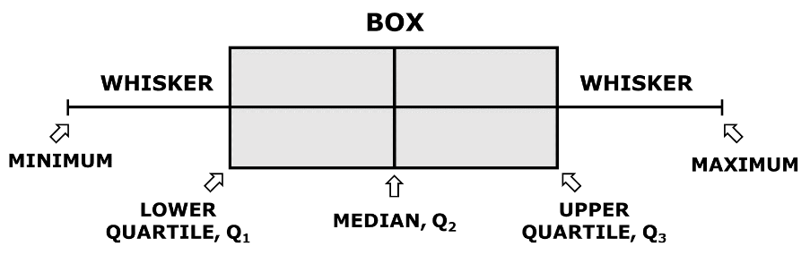
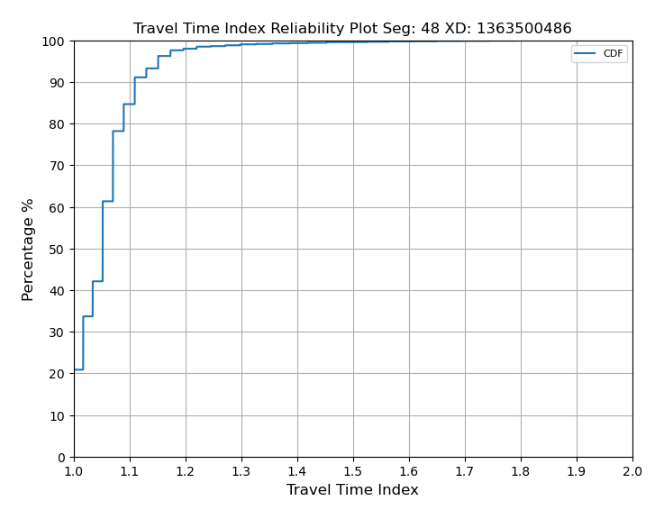

# Automobile Travel Time Reliability {#Chapter3Reliability}

## Introduction {#ReliabilityIntro}

Prior to the HCM 6th Edition, predicting travel time reliability (TTR) would typically involve microsimulation with extensive new data collection and calibration of the simulation model. With the HCM Chapters 11 (Freeway Facilities) and 17 (Urban Streets) methodologies, it is now possible to predict the reliability effects of infrastructure investments without developing a microsimulation model.

The HCM covers various performance measures that can be obtained from the distribution of travel times along a facility and in some cases, the vehicular volumes matching travel time observations. Some of the measures discussed in the HCM are:

- 95th percentile travel time index (also known as Planning Time Index or PTI): the ratio of 95th percentile travel time to free-flow travel time.
- 50th percentile travel time index (TTI): the ratio of median (50th percentile) travel time to free-flow travel time.
- Level of Travel Time Reliability or LOTTR (80th percentile travel time divided by 50th percentile travel time)
- Reliability rating: how often the facility performs satisfactorily. Often defined as the fraction of facility VMT operating below a TTI of 1.33
- Failure and on-time measures (%)
- Misery Index: average of the worse 5% TTI’s
- Semi-Standard Deviation– standard deviation from TTI=1
- Standard Deviation
- %VMT at TTI>2

Figure \@ref(fig:HCMTTRDistribution) illustrates how these measures may be obtained from a distribution of travel times. 

```{r HCMTTRDistribution, echo=FALSE, fig.cap='Derivation of Time-Based Reliability Performance Measures from the Travel Time Distribution (Source: HCM Exhibit 11-3)',out.width="50%", fig.align='center'}
knitr::include_graphics("./Images/Reliability/HCMTTRdist.jpg")
```

In addition to the guidance on measuring past reliability performance, the HCM provides methods to evaluate changes in reliability that may result from changes to the facility (e.g., the addition of a lane). The HCM method is heavily reliant on generating hundreds of analysis scenarios with differing demand, weather, work zones, and incident conditions. The core HCM procedures are then applied to those scenarios to obtain distributions of various performance measures, including those described above. HCM Exhibit 11-7 _Freeway Reliability Methodology Framework_ provides an overview of this approach, which is conceptually similar to that of arterials.

For agencies with limited data, the HCM provides defaults that can serve as a starting point for predicting reliability.

- HCM Exhibit 11-20 has default capacity adjustment factors by weather condition
- HCM Exhibit 11-21 has default speed adjustment factors by weather condition
- Volume 4 Technical Reference Library contains default weather data for 101 US metropolitan areas based on 2001-2010 records
- HCM Chapter 25 has default day-of-week and month-of-year demand factors that can be applied to model seasonal traffic variation.

## Approach for Rural Highways

The HCM Chapter 11 methodology is well established and supported for freeway facilities. The arterial reliability methodology (HCM Chapter 17) is also covered in the HCM, although the tools and data to predict reliability on arterials are not as readily available as for freeways. There is currently no equivalent methodology for rural highways.

Travel time reliability on rural highways is generally much different than on urban arterials and freeways. In congested urban settings, travel times tend to be highly variable over time—both over the course of a day and over the course of a year due to seasonality, adverse weather, and similar. Roadways operating at or close to capacity are more susceptible to disruptions that can significantly increase travel time. But few rural highways operate at or close to capacity during an average day. Instead, travel time reliability on rural highways is highly dependent on the origins and destinations served by the rural highway, natural disasters on or around the corridor, and disruptions such as crashes or work zones on parallel facilities. Furthermore, due to the lower volumes and sparser sensor coverage on rural highways, a predictive reliability methodology that requires a large number of data inputs is not likely to see much usage among agencies operating rural highways.

Because of these fundamental differences, the travel time reliability performance measures typically associated with urban travel are less relevant to rural highways. In addition, the differences noted in [Chapter 1](#Chapter1Intro) regarding the higher variability in horizontal and vertical alignment, intersection traffic control, and lane configuration throughout a rural highway contribute to the need for a different methodology for assessing travel time reliability on rural highways. 

Whereas the freeway and arterial reliability methods rely heavily on scenario generation and batch application of HCM methodologies, the rural highway methodology described in this chapter is more concerned with historical reliability performance and with applying LOS methods in a way that captures the full experience of a traveler traversing the often varied segments of a rural highway. The approaches outlined in [Chapter 2](#Chapter2LOS) and this chapter can be applied with data that is generally available to rural transportation agencies. By combining the [Chapter 2](#Chapter2LOS) methods to evaluate LOS and available capacity with the methods of this chapter to compute and visualize historical reliability performance, it is possible to identify seasonal patterns or spatial hot-spots that might result in poor reliability performance in future years.

The remainder of this chapter covers data sources and analysis and visualization techniques that may be used in understanding travel time reliability for rural highways.

## Data Examined {#ReliabilityData}

Historical reliability analyses are usually based on vehicular probe data, obtained from cell phone location-based services (LBS), and to a lesser degree connected vehicles and fleets. These devices "ping" their approximate locations at regular intervals, enabling the estimation of travel times and speeds along roadways. Although there are errors associated with the reported positions and timestamps, the high penetration rate of cell phones can produce large sample sizes that can accurately track average speeds and travel times. This is especially true for freeways and principal arterials, but lower-volume rural and residential roadways might not have enough samples to confidently estimate speeds and travel times. Most probe data are aggregated and sold by commercial vendors like HERE, INRIX, and TomTom. In support of the MAP-21 performance reporting requirements, the Federal Highway Administration provides its [National Performance Management Research Data Set](https://ops.fhwa.dot.gov/publications/fhwahop20028/index.htm) (NPMRDS) free of charge to transportation agencies.

Higher-resolution probe vehicle data were examined for its potential to be used for travel time reliability assessments along rural highways. Unlike traditional probe data sources reporting on traffic message channels (TMCs) spanning from one major intersection to the next, the higher-resolution probe data sources report on segments up to one kilometer (0.62 miles) in length. Furthermore, the temporal resolution of the data is higher as well, with data points every minute as opposed to every five or fifteen minutes.

The data used for analysis was obtained from the INRIX XD Monitoring program. INRIX XD data is very similar to INRIX TMC data, with a key difference being that it uses smaller spatial segments for data reporting. The underlying XD Monitoring program provides real-time insight into traffic speeds, travel times, and the location of incidents and back-ups for every major road type and class from highways, ramps and interchanges to arterials, city streets and other secondary roads. INRIX XD data are currently available through [RITIS](https://www.ritis.org) in about 16 states, with varying route coverage within each state. It is expected that this coverage, both within state and across states, will continue to increase.

The analysis of the sample data from several sample corridors presented in Part 3 of the document (see Chapter \@ref(CaseStudyIntro)) suggested that the higher-resolution probe data can improve travel time reliability analyses, especially when recurring congestion, queues, and queue spillbacks are primary contributors to reliability issues. With the traditional probe data sources, it is not often possible to observe queue spillback on rural highways, as the TMCs usually span several miles and the congested travel times (and resulting speeds) get averaged out with those at free-flow segments.

The data also supported more detailed understanding of non-recurring congestion due to adverse weather events (i.e., snowstorms) and holiday travel (i.e., Thanksgiving) on the sample corridors. Although higher spatial resolution is not as important for weather events and holidays, it would be valuable in understanding the impact of other types of non-recurring congestion—such as flooding, landslides, and other events limited to short segments of roadway.

Another key advantage of the higher resolution is that the data can pinpoint delays at intersections. On rural highways, most intersections do not impose delay on the highway (major street) travelers, but rather on side street traffic only. However, there are isolated intersections—including roundabouts, all-way stops, and traffic signals—that do result in delays to highway travelers. The higher-resolution probe data can be used to quickly understand the location and magnitude of those intersection delays without requiring additional data sources (e.g., GIS layers, traffic volumes, signal timings, etc.) or field visits.

## Segmentation {#ReliabilitySegmentation}

Segmentation (see Section \@ref(Segmentation)) is also a critical step when developing summaries of reliability data. Unlike in the [Chapter 2](#Chapter2LOS) analyses, segmentation will not change the method that is used to analyze the data, but it is important to consider as it will impact the outcome of the analysis. For example, if an exceedingly long segment is analyzed, it is likely that travel times on the segment will be reliable, as subsegments with poor reliability are typically washed out by much longer subsegments that are reliable. In addition, a very long segment spanning many TMCs will have fewer times when all TMCs have enough samples to report accurate travel times or speeds.

Best practices for segmenting facilities include those listed in the \@ref(Segmentation) section, such as considering area context, posted speed limit, or changes in cross section. Fundamentally, the segmentation selected should be intuitive to travelers. This might be achieved by using segment starting and ending points that are also popular starting and ending points for trips (e.g., towns, major cross-streets, major attractions, etc.). In general, segments up to ten miles long can be readily analyzed and their results conveyed to users in an intuitive manner.

## Data Overview {#ReliabilityDataOverview}

The data contains the following fields.

-	XD Segment Identifier
-	Timestamp (options for 5 mins, 15 mins, and 60 mins aggregations)
-	Speed
-	Historical Average Speed
-	Reference Speed
-	Travel Time (in seconds or minutes)
-	Confidence score
	- 10-Speeds showing the reference speed due to lack of real-time data
	- 20-Speeds showing the historical average speed due to lack of real-time data
	- 30-Speeds showing real-time data
-	C-Value (only when confidence score is 30)
	-	0-100, denotes whether probe data is representing actual roadway conditions 

## Evaluation Methodologies {#ReliabilityMethods}

The case study facilities were evaluated using five data analysis and visualization techniques that convert the INRIX XD speed and travel time data into charts and graphics for analysis and interpretation:

- **Speed heatmaps** provide an overview of the overall facility and can be used to quickly identify recurring bottlenecks. Combined with local knowledge about facility geometry and information on weather, construction, activities, events, etc. speed heatmaps can help paint a picture on facility reliability and potential patterns of recurring and non-recurring congestion. The speed heatmaps developed for the case study facilities consist of time of day on the y-axis and date on the x-axis. They thus create a visual representation of the 24-hour speed performance (y-axis) across the entire period of analysis (x-axis), with each cell of the heatmap representing an individual INRIX XD speed observation. On these visualizations, speeds are aggregated to the hour and are visualized by a color scale from green (fast) to red (slow).
- **Speed difference heatmaps** normalize the heatmap patterns using a reference speed for each segment—in this case the 85th percentile speed from the data as an approximation of free-flow speed. This technique is particularly appropriate on long rural highways with a wide range of speed limits. The speed difference heatmaps more clearly highlight recurring and non-recurring congestion patterns across segments, and avoid potential visual bias introduced when traversing different speed limits and geometry-induced speed reductions along the corridor.
- **Box-and-whisker speed plots** help in identifying and narrowing down periods with poor reliability in the overall analysis period. It also complements inferences made using other visualizing metrics.
- **Speed confidence band plots** highlight the reliability of speeds at different hours using a years' worth of data. They are a more easily interpreted visualization by removing the date dimension in the reliability data and showing reliability patterns by time-of-day only. The speed confidence band plots are especially useful when combined with a speed difference heatmap. In this combination, the speed confidence band plot can be used to infer which segment and which time periods experience unreliable travel; the speed difference heatmap can then be used to infer what date ranges contribute to the unreliability.
- **Travel time index plots** show the cumulative distribution of travel times along the segment, normalized by the free-flow travel time—which was estimated from the data as the 15th percentile travel time. The travel time index (TTI) metric is commonly used in congestion and reliability reporting and is defined in the [FHWA Travel Time Reliability guidance](https://ops.fhwa.dot.gov/perf_measurement/reliability_measures/index.htm). Due to its simple line representation, a TTI plot can be an effective tool to convey before-after comparisons.

Python snippets to load, analyze, and visualize probe data using these five techniques are included in their respective sections. A complete Python script can be obtained from [this](https://github.com/NCHRP-08-135/Resources/tree/main/Reliability) link. 

## Assessing Reliability {#ReliabilityHowTo}

This section provides specific guidance and scripts that may be used to produce the reliability visualizations in the [Evaluation Methodologies](#ReliabilityMethods) section. As shown below, the Python Pandas and Matplotlib libraries can be used to efficiently process and visualize probe data (in this case the INRIX XD data described above).

### Load the data

First, the probe data and metadata files must be obtained. For the case studies presented here, INRIX XD data was obtained through RITIS. Once on hand, the files can be loaded onto a Pandas dataframe using the code below.

```python
# Import Libraries
import numpy as np
import pandas as pd
pd.plotting.deregister_matplotlib_converters()
from matplotlib.cm import ScalarMappable
import matplotlib.colors as mc  # For the legend
import matplotlib.pyplot as plt
import matplotlib
matplotlib.use('Agg')

# Specify inputs
data_file = #Path to data CSV
id_file = #Path to TMC identification CSV
id_list = #List of TMC IDs to process, for example: [450198212, 450198213, 450198214]

#Method to load data into a Pandas dataframe
def read_input_file(id_file, data_file, id_list):
    df = pd.read_csv(data_file, low_memory=False)
    id_df = pd.read_csv(id_file, low_memory=False)
    df = df[df["xd_id"].isin(id_list)]
    df["measurement_tstamp"] = pd.to_datetime(df["measurement_tstamp"])
    df["day"] = df["measurement_tstamp"].dt.day
    df["hour"] = df["measurement_tstamp"].dt.hour
    df["date"] = df["measurement_tstamp"].dt.date
    df["time"] = df["measurement_tstamp"].dt.time
    df["month"] = pd.DatetimeIndex(df["measurement_tstamp"]).month
    df["dayofweek"] = df["measurement_tstamp"].dt.dayofweek + 1
    return id_df, df

```

### Aggregate the data

The INRIX XD data comes at a high temporal resolution (one minute), which is beneficial for fine-grained analyses of individual incidents or special events, but can be cumbersome to display in visualizations covering one year of data or more. As such, the data is first aggregated to a suitable resolution for the analysis being conducted. In this case, an hourly resolution was considered adequate for these reliability analyses.

In addition to aggregating across time, the code below adds several calculated columns that simplify visualization of the data in later stages of the process. These include speed differences (from 50th, 85th, and 95th percentile speeds) and travel time indices (relative to 15th and 50th percentile travel times).

```python

def percentile(n):
    def percentile_(x):
        return np.percentile(x, n)
    percentile_.__name__ = 'percentile_%s' % n
    return percentile_

def data_agg(id_df, df, idx, col, pivot):
    df_perc = df.groupby(["xd_id"]).agg({"speed": [percentile(5), percentile(15), "median", percentile(85), percentile(95)],
                                         "travel_time_seconds": [percentile(15), percentile(5)]})
    df_perc.columns = df_perc.columns.map('|'.join).str.strip('|')
    df_perc.reset_index(inplace=True)
    df_perc = df_perc.rename(columns={'speed|percentile_5': 'speed_5th', 'speed|percentile_15': 'speed_15th',
                                      'speed|median': 'speed_median', 'speed|percentile_85': 'speed_85th',
                                      'speed|percentile_95': 'speed_95th',
                                      'travel_time_seconds|percentile_5': 'travel_time_seconds_5th',
                                      'travel_time_seconds|percentile_15': 'travel_time_seconds_15th'})

    df_grouped = df.merge(df_perc, how="left", on="xd_id")
    df_grouped["speed_diff_median"] = df_grouped['speed_median'] - df_grouped["speed"]
    df_grouped["speed_diff_85"] = df_grouped['speed_85th'] - df_grouped["speed"]
    df_grouped["speed_diff_95"] = df_grouped['speed_95th'] - df_grouped["speed"]
    df_grouped["tti_15"] = df_grouped["travel_time_seconds"] / df_grouped["travel_time_seconds_15th"]
    df_grouped["tti_5"] = df_grouped["travel_time_seconds"] / df_grouped["travel_time_seconds_5th"]
    df_grouped["speedi_85"] = df_grouped['speed'] / df_grouped["speed_85th"]
    df_grouped["speedi_95"] = df_grouped['speed'] / df_grouped["speed_95th"]
    df_grouped_2 = df_grouped.groupby(["xd_id", idx, col]).agg({"speed": ["mean"], "speed_diff_median": ["mean"],
                                                              "speed_diff_85": ["mean"], "speed_diff_95": ["mean"],
                                                              "tti_5": ["mean"], "tti_15": ["mean"],
                                                              "speedi_85": ["mean"], "speedi_95": ["mean"]})
    df_grouped_2.columns = df_grouped_2.columns.map('|'.join).str.strip('|')
    df_grouped_2.reset_index(inplace=True)
    df_grouped_2 = df_grouped_2.rename(columns={"xd_id": "xd", 'speed|mean': 'speed',
                                            'speed_diff_median|mean': 'speed_diff_median',
                                            'speed_diff_85|mean': 'speed_diff_85',
                                            'speed_diff_95|mean': 'speed_diff_95', 'tti_5|mean': 'tti_5',
                                            'tti_15|mean': 'tti_15', "speedi_85|mean": "speedi_85",
                                            "speedi_95|mean": "speedi_95"})

    df_grouped_2 = df_grouped_2.merge(id_df, how="left", on="xd")
    # df_grouped_2["delay_spm_85"] = 3600 * ((df_grouped_2["miles"] / df_grouped_2["speed"]) -
    #                                   (df_grouped_2["miles"] / df_grouped_2['speed_diff_85']))
    # print(df_grouped_2[["speed", "speed_85th", "delay_spm"]].describe())

    if pivot:
        print(pd.pivot_table(df_grouped_2, index=[idx], columns=[col], values='speed').reset_index())
        return df_grouped, df_grouped_2
    else:
        return df_grouped, df_grouped_2
```

### Heatmaps

The two types of reliability heatmaps described above (i.e., speed and speed difference) can be generated with a single Python function. The _value_ parameter can be set to either "speed" or "speed_diff_85" to instruct the function to use the appropriate column to generate a speed or a speed difference heatmap, respectively.

As is the case with the other visualizations presented below, the Matplotlib library offers several options to customize the chart's area, title, legend, and more.

```python

def create_heatmap(df_grouped, xd_id_list, output,  min_lim, max_lim, cmap, value, xticks, cmap_label):
    print("Creating Heatmaps ...")
    for i in range(0, segments):

        ip_df_plot = df_grouped[df_grouped["xd"] == xd_id_list[i]].reset_index()
        print("XD ID:", xd_id_list[i])

        table = pd.pivot_table(ip_df_plot, index=['hour'], columns=['date'], values=value)
        time = table.to_numpy()
        xgrid = np.arange(len(ip_df_plot["date"].unique().tolist()) + 1)
        ygrid = np.arange(len(ip_df_plot["hour"].unique().tolist()) + 1)

        c_map = plt.cm.get_cmap(cmap)
        fig, ax = plt.subplots(figsize=(15, 7.5))
        ax.pcolormesh(xgrid, ygrid, time, cmap=c_map, vmin=min_lim, vmax=max_lim)

        ax.yaxis.set_ticks([i for i in range(len(ip_df_plot["hour"].unique().tolist()))])
        ax.set_yticklabels(ip_df_plot["hour"].unique().tolist())
        ax.set_ylabel("Hour")

        ax.xaxis.set_ticks([i for i in range(len(ip_df_plot["date"].unique().tolist()))][::xticks])
        xlabels = ip_df_plot["date"].unique().tolist()
        ax.set_xticklabels(xlabels[::xticks], rotation=90)
        ax.set_xlabel("Date")

        fig.subplots_adjust(bottom=0.15)
        norm = mc.Normalize(min_lim, max_lim)
        cb = fig.colorbar(
            ScalarMappable(norm=norm, cmap=c_map),
        )
        cb.set_label(cmap_label, size=12)

        title = "EB Seg: " + str(i+1) + ", " + str(ip_df_plot["road-name"][0]) + " ," + str(ip_df_plot["county"][0]) + \
                " COUNTY, " + str(ip_df_plot["state"][0]) + ", " + str(ip_df_plot["zip"][0]) + " - XD Id: " + \
                str(ip_df_plot["xd"][0]) + ", LEN: " + str(round(ip_df_plot["miles"][0], 2))+" miles"

        print(title)
        plt.title(title)
        plt.savefig(output + value + "_" + str(i+1)+".png", bbox_inches='tight', pad_inches=0.25)
        plt.show()
        plt.close()

create_heatmap(df_agg_dt_hr, xd_id, op_path, min_lim=10, max_lim=60, cmap="RdYlGn", value="speed", xticks=3,
                   cmap_label="Speed (mi/h)")

create_heatmap(df_agg_dt_hr, xd_id, op_path, min_lim=0, max_lim=15, cmap="cool", value="speed_diff_85", xticks=3,
                   cmap_label="85th %ile Speed - Measured Speed (mi/h)")
```

The resulting heatmaps can be seen below as Figure \@ref(fig:SpeedHeatmapOH42) (speed) and Figure \@ref(fig:SpeedDiffHeatmapOH42) (speed difference).

```{r SpeedHeatmapOH42, echo=FALSE, fig.cap='Speed Heatmap Plot Example',out.width="50%", fig.align='center'}
knitr::include_graphics("./Images/Reliability/speed_48.png")
```

```{r SpeedDiffHeatmapOH42, echo=FALSE, fig.cap='Speed Difference Heatmap Plot Example',out.width="50%", fig.align='center'}
knitr::include_graphics("./Images/Reliability/speed_diff_85_48.png")
```

### Box-and-Whisker Plots

Box-and-whisker plots display the minimum value, maximum value and three in-between percentiles, usually the 25th, 50th, and 75th percentiles as shown in Figure \@ref(fig:BoxWhisker). For purposes of reliability analysis, the 15th and 85th percentile were considered more suitable as a representation of congested and free-flow speeds, respectively.

```{r BoxWhisker, echo=FALSE, fig.cap='Box-and-Whisker Plot Interpretation',fig.width=3, fig.align='center'}

```

The following code can be used to create weekly box-and-whisker plots to display the spread in travel times. The 'lower_df' and 'upper_df' parameters can be modified to display the desired lower and upper percentile bounds. In this case, the 15th and 85th percentile travel times are used.

```python
def create_box_whisker_weekly(df, xd_id_list, output, lower_df, upper_df, name):
    xaxis = "start_date"
    df_perc = df.groupby(["xd_id", xaxis]).agg({"speed": [percentile(lower_df), percentile(upper_df), "median"]})
    df_perc.columns = df_perc.columns.map('|'.join).str.strip('|')
    df_perc.reset_index(inplace=True)
    df_perc = df_perc.rename(columns={'speed|percentile_' + str(lower_df): 'speed_' + str(lower_df) + 'th',
                                      'speed|percentile_' + str(upper_df): 'speed_' + str(upper_df) + 'th',
                                      'speed|median': 'speed_median'})

    colors = ['#e6194B', '#3cb44b', '#ffe119', '#4363d8', '#f58231', '#911eb4', '#42d4f4', '#f032e6', '#bfef45', '#fabed4', '#469990', '#dcbeff']
    df_perc["start_date"] = pd.to_datetime(df_perc["start_date"])
    df_perc["start_date_month"] = df_perc["start_date"].dt.month

    print("Creating " + name + " Box-Whiskers Plot ...")
    for i in range(0, segments):  # segments instead of 1
        df_print = df_perc[df_perc["xd_id"] == xd_id_list[i]]
        df_print.reset_index(inplace=True)

        box_colors = []
        for k in range(len(df_print["start_date_month"])):
            # print()
            box_colors.append(colors[df_print["start_date_month"][k]-1])

        # bins = np.linspace(1, len(df_print), num=len(df_print))
        fig = plt.figure(figsize=(6, 12))
        ax = fig.add_subplot(111)
        box_data = []
        for j in range(len(df_print)):
            temp_box_data = []
            temp_box_data.append(df_print['speed_' + str(lower_df) + 'th'][j])
            temp_box_data.append(df_print["speed_median"][j])
            temp_box_data.append(df_print['speed_' + str(upper_df) + 'th'][j])
            box_data.append(temp_box_data)

        bp = ax.boxplot(box_data, vert=0, patch_artist=True)
        for patch, color in zip(bp['boxes'], box_colors):
            patch.set_facecolor(color)

        for median in bp['medians']:
            median.set(color='black',
                       linewidth=1.5)

        for whisker in bp['whiskers']:
            whisker.set(color='black',
                       linewidth=1.5)

        plt.legend(loc="best", fontsize=8)
        plt.ylabel("Date", fontsize=12)
        plt.xlabel("Speed (mi/h)", fontsize=12)
        plt.title(name + " Box-Whisker Plot Seg: " + str(i + 1) + " XD: " + str(xd_id_list[i]))
        plt.grid()
        plt.xlim(0, 80)
        ytics = df_print[xaxis].astype(str)
        ax.set_yticklabels(ytics)
        ax.get_yaxis().tick_left()
        ax.legend(["15th|---Median---|85th %ile"])
        plt.savefig(output + name + "_" + str(lower_df) + "_" + str(upper_df) + "_" + str(i + 1) + ".png",
                    bbox_inches='tight', pad_inches=0.25)
					

create_box_whisker_weekly(ip_df, xd_id, op_path, 15, 85, "Speed_bw")
```

An example of the box-and-whisker plot for a segment of Ohio US 42 is shown below in Figure \@ref(fig:BoxWhiskerOH42).

```{r BoxWhiskerOH42, echo=FALSE, fig.cap='Box-and-Whisker Plot Example',fig.width=3, fig.align='center'}
knitr::include_graphics("./Images/Reliability/Speed_bw_15_85_48.png")
```

### Speed Confidence Band Plots

Speed confidence bands can be configured to use different bounds depending on the goal of the analysis. For example, in a scenario where a reasonable best and worst case scenario are sought, using a low percentile (e.g., 5th) and a high percentile (e.g., 95th) achives the objective by covering 9 out of every 10 values in the data. In analyses that aim to describe typical conditions, a narrower band can be used (e.g., 15th through 85th percentiles). The code below supports these different use cases by entering different (integer) values in the _lower_df_ and _upper_df function parameters.

```python

def create_confidence_band_hourly(df, xd_id_list, output, lower_df, upper_df, name):
    xaxis = "hour"
    df_perc = df.groupby(["xd_id", xaxis]).agg({"speed": [percentile(lower_df), percentile(upper_df), "median"]})
    df_perc.columns = df_perc.columns.map('|'.join).str.strip('|')
    df_perc.reset_index(inplace=True)
    df_perc = df_perc.rename(columns={'speed|percentile_' + str(lower_df): 'speed_' + str(lower_df) + 'th',
                                      'speed|percentile_' + str(upper_df): 'speed_' + str(upper_df) + 'th',
                                      'speed|median': 'speed_median'})

    print("Creating " + name + " Confidence Band Plot ...")
    bins = np.linspace(5, 23, num=19)
    for i in range(0, segments):
        df_print = df_perc[df_perc["xd_id"] == xd_id_list[i]]
        df_print.reset_index(inplace=True)
        plt.figure()
        plt.plot(df_print[xaxis], df_print['speed_' + str(lower_df) + 'th'], label=str(lower_df) + "th %ile", marker="o")
        plt.plot(df_print[xaxis], df_print["speed_median"], label="median", marker="*")
        plt.plot(df_print[xaxis], df_print['speed_' + str(upper_df) + 'th'], label=str(upper_df) + "th %ile", marker="o")
        plt.legend(loc="best", fontsize=8)
        plt.xlabel("Time of Day", fontsize=12)
        plt.ylabel("Speed (mi/h)", fontsize=12)
        plt.title(name + " Confidence Band Plot Seg: " + str(i + 1) + " XD: " + str(xd_id_list[i]))
        plt.grid()
        plt.ylim(0, 80)
        plt.xticks(df_print[xaxis], bins.astype('int64'))
        plt.fill_between(df_print[xaxis], df_print['speed_' + str(lower_df) + 'th'],
                         df_print['speed_' + str(upper_df) + 'th'], alpha=0.2)
        plt.savefig(output + name + "_" + str(lower_df) + "_" + str(upper_df) + "_" + str(i + 1) + ".png",
                    bbox_inches='tight', pad_inches=0.25)
    return df_perc

df_speedcb_15_85 = create_confidence_band_hourly(ip_df, xd_id, op_path, 15, 85, "Speed")

```

An example of the speed confidence band plot for a segment of Ohio US 42 is shown below in Figure \@ref(fig:SpeedBandOH42).

```{r SpeedBandOH42, echo=FALSE, fig.cap='Speed Confidence Band Plot Example',fig.width=3, fig.align='center'}
knitr::include_graphics("./Images/Reliability/Speed_cb_15_85_48.png")
```

### Travel Time Index Plots

A cumulative distribution function (CDF) plot of travel time indices can concisely describe how travel times or speeds are distributed across time or space. Because of the simple representation of the data (a single line), it can be particularly suitable for before-after comparisons. The code below is set to use a range of TTIs from 0.0 through 2.0 through the _bins_ variable, although that can be easily adjusted for the range of TTIs in the data being analyzed. Increasing the number of TTI bins will reduce the size of the steps, leading to more continuous-looking plots. 

```python
def create_tti(df, xd_id_list, output, tt_idx, name):
    print("Creating " + name + "Index Reliability Plot ...")
    df = df.groupby(["xd", "hour"]).agg({tt_idx: ["mean"]})
    df.columns = df.columns.map('|'.join).str.strip('|')
    df.reset_index(inplace=True)
    df = df.rename(columns={tt_idx + '|mean': tt_idx})
    df[tt_idx] = df[tt_idx].apply(lambda x: round(x, 2))

    df = df.groupby(["xd", tt_idx]). agg({tt_idx: ["count"]})
    df.columns = df.columns.map('|'.join).str.strip('|')
    df.reset_index(inplace=True)
    df = df.rename(columns={tt_idx + '|count': 'count'})
    bins = np.linspace(0, 2, num=21)
    for i in range(0, segments):
        df_print = df[df["xd"] == xd_id_list[i]]
        df_print.reset_index(inplace=True)
        count, bins_count = np.histogram(df_print[tt_idx], bins=bins)
        # print(count, bins_count)
        pdf = count / sum(count) * 100
        cdf = np.cumsum(pdf)
        # print(pdf)
        # print(cdf)

        plt.figure(figsize=(8, 6))
        plt.plot(bins_count[1:], cdf, label="CDF", marker="o")
        plt.scatter(bins_count[1:], cdf, marker="o")
        plt.legend(loc="best", fontsize=8)
        plt.xlabel(name + " Index", fontsize=12)
        plt.ylabel("Percentage %", fontsize=12)
        plt.title(name + " Index Reliability Plot Seg: " + str(i+1) + " XD: " + str(xd_id_list[i]))
        plt.grid()
        plt.ylim(0, 100)
        plt.xticks(bins_count[1:].tolist(), [round(num, 1) for num in bins[1:]])
        plt.savefig(output + tt_idx + "_CDF_" + str(i + 1) + ".png", bbox_inches='tight', pad_inches=0.25)
        # plt.close()
    return df
	
df_tti_15 = create_tti_non_agg(df_agg, xd_id, op_path, "tti_15", "Travel Time")
```

An example of the travel time index plot for a segment of Ohio US 42 is shown below in Figure \@ref(fig:TTIOH42).

```{r TTIOH42, echo=FALSE, fig.cap='Speed Confidence Band Plot Example',fig.width=3, fig.align='center'}

```
