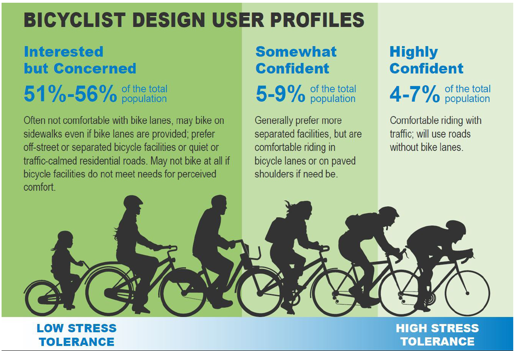

# Bicycle Operations Analysis on Rural Highways {#Chapter4Bicycle}

This chapter provides an overview of commonly used methods for assessing bicycle operations on rural highways, guidance on current methods and recommendations for enhancements to analysis methods.

The 2017 National Household Travel Survey estimated that about 16% of the U.S. population cycled on their travel day for any reason; and that people in urban households were more likely to walk or bike daily. On the other hand, recreational bicycling has grown, including long-distance bicycle travel on rural areas. 

Cyclists on rural highways usually travel on designated facilities, although if they travel with motorized vehicles, they usually travel more slowly than the prevailing traffic flow, staying as far to the right as possible, and using paved shoulders when available. Design criteria commonly use automobile travel speed and volume to establish which facility is more appropriate for cycling under given traffic conditions.  

There are multiple published methods to establish and measure the level of service for cyclists and/or to measure the experience of cyclists making use of the infrastructure available in their area (Table \@ref(tab:BicyclistExperience)). Among the methods, there are three main approaches: 

* Highway Capacity Manual Level of Service (LOS)
* Level of Traffic Stress (LTS)
* Bicycle Compatibility Index (BCI)

Table: (\#tab:BicyclistExperience) Methods to measure experience of the cyclist on rural highways


|**ID** |**Type**|**Year**|**Reference**                              |**Name**                                                |**Rural?**|**Study Area**|
|:---|:------|:-----------|:------------------------------------------|:-------------------------------------------------------|:------|----------------:|
| 1  | LOS   | 1985       | @Botma1995                                | Proposed Dutch HCM Bicycle LOS                         | No    | The Netherlands |
| 2  | LOS   | 1996       | @dixon_bicycle_1996                       | City of Gainesville Bicycle LOS                        | No    | USA             |
| 3  | LOS   | 1997       | @landis_real-time_1997                    | Proposed HCM Bicycle LOS                               | No    | USA             |
| 4  | LOS   | 2007       | @jensen_pedestrian_2007                   | Danish Bicycle LOS                                     | Yes   | Denmark         |
| 5  | LOS   | 2009       | @SanFranciscoDepartmentofPublicHealth2010 | San  Francisco BEQI                                    | No    | USA             |
| 6  | LOS   | 2010, 2016 | @hcm2010                                  | HCM Bicycle LOS                                        | Yes   | USA             |
| 7  | LOS   | 2012       | @kang_development_2012                    | South Korea HCM adaptation of Bicycle LOS              | No    | South Korea     |
| 8  | LOS   | 2014       | @foster_level_service_2015                | Bicycle LOS                                            | No    | USA             |
| 9  | LOS   | 2015       | @hbs2015                                  | German HCM Bicycle LOS                                 | No    | Germany         |
| 10 | LOS   | 2020       | @oregonDOT                                | Oregon DOT simplified Bicycle LOS                      | Yes   | USA             |
| 11 | LTS   | 1980       | @NJDOTBikeGuide                           | NJ DOT Bicycle Compatible Roadways and Bikeways        | Yes   | USA             |
| 12 | LTS   | 2007       | @NYSDOTBikeGuide                          | Highway Design Manual. Bicycle Facility Design         | No    | USA             |
| 13 | LTS   | 2012       | @mekuria_low-stress_2012                  | Low Stress Bicycling and Network Connectivity          | No    | USA             |
| 14 | LTS   | 2012       | @MnDOTBikeGuide                           | Minnesota Bicycle Facility Design Manual               | Yes   | USA             |
| 15 | LTS   | 2014       | @MontgomeryBikeGuide                      | Montgomery County Bicycle Planning Guidance            | No    | USA             |
| 16 | LTS   | 2015       | @MassDOTBikeGuide                         | Separated bicycle lane Planning And Design Guide       | Yes   | USA             |
| 17 | LTS   | 2015       | @furth_network_2016                       | Network Connectivity for Low-Stress Bicycling          | No    | USA             |
| 18 | LTS   | 2018       | @OntaAASHTOBikeGuide                      | AASHTO Guide for the development of bicycle facilities | Yes   | USA             |
| 19 | LTS   | 2019       | @schultheiss_bikeway                      | FHWA Bikeway selection guide                           | Yes   | USA             |
| 20 | LTS   | 2020       | @oregonDOT                                | Analysis Procedures Manual                             | Yes   | USA             |
| 21 | LTS   | 2021       | @WashDOTDesign                            | WSDOT Design Manual                                    | Yes   | USA             |
| 22 | LTS   | 2021       | @WashDOTActivePlan                        | WSDOT Active Transportation Plan                       | Yes   | USA             |
| 23 | LTS   | 2021       | @MaryDOTBikeGuide                         | MDOT LTS Technical Memo                                | Yes   | USA             |
| 24 | BCI   | 1998       | @Harkey1998                               | Bicycle Compatibility Index (BCI)                      | No    | USA             |
| 25 | BCI   | 2003       | @nathalie_noel_crc_2003                   | Compatibility of roads for cyclists                    | Yes   | Canada          |
| 26 | BCI   | 2003       | @jones_development_2003                   | Rural Bicycle Compatibility Index (RBCI)               | Yes   | USA             |
| 27 | BCI   | 2013       | @vale_active_2015                         | Bikeability Index                                      | No    | Canada          |
| 28 | Other | 1987       | @davis_bicycle_1987                       | Bicycle Safety index rating (BSIR)                     | No    | USA             |
| 29 | Other | 1994       | @epperson_evaluating_1994                 | Modified-roadway condition index                       | No    | USA             |
| 30 | Other | 1994       | @landis_bicycle_1994                      | Bicycle interaction hazard score                       | No    | USA             |
| 31 | Other | 2000       | @Borgman2003                              | Dutch Cyclist Union Balance Index                      | No    | The Netherlands |
| 32 | Other | 2003       | @saelens_neighborhood-based_2003          | Neighbourhood Environment Walkability Scale (NEWS)     | No    | USA             |
| 33 | Other | 2010       | @hoedl_bikeability_2010                   | Bikeability and Walkability Evaluation Table (BiWET)   | No    | Austria         |

The bicycle level of service is the method that was implemented first in the US, followed by the bicycle compatibility index. Recently, the level of traffic stress is gaining more interest by practitioners and planners due to its simplicity. An overview of the three approaches is provided in Section 1. Section 2 summarizes the conclusions of two qualitative studies to identify potential revisions to the HCM methodology and user classifications. Finally, Section 3 provides recommendations on how to use current methods to evaluate the quality of service for rural cyclists.

## Overview of Bicycle Operations Analysis Methods

### Highway Capacity Manual Level of Service Analysis Methodologies

The Highway Capacity Manual (HCM) includes bicycle level of service (LOS) analysis methodologies for the following facilities:

- Multilane highways
- Two-lane highways 
- Urban Street Segments
- Signalized Intersections
- Urban Street Facilities
- Off-street Paths

Bicycle and pedestrian operations, as counterparts to motor vehicle measures, are included in all editions of the HCM since the 1985 HCM. The concepts include delay, density, space or capacity for bicycle and pedestrian modes, and have been currently expanded to bicycle flow parameters, capacity concepts and delay. Since the 2010 HCM, measures are included that consider how well bicycle facilities operate from a bicyclist's perspective. These measures incorporate multiple factors that a roadway agency can influence, such as bicycle lane width, traffic volume, traffic speed, and pavement quality. The analysis is intended to reflect the perspective of the mainstream cyclist while cycling on a given facility. 

Bicycle level of service (BLOS) was firstly proposed by @Botma1995 in the Dutch Manual on Bicycle Infrastructure. This measure of quality was developed adapting the US-HCM concept of LOS for bicycles. After considering mean speed, density or percent of bicyclists following, the selected performance measure was hindrance; which used frequencies of events between bicyclists and other facility users to arrive at various levels of service. 

Seminal works in the US include the traveler perception model from @landis_real-time_1997. They used 150 cyclists in actual urban traffic and roadway conditions, in a looped course of 30 road segments along collectors, arterials and some local streets. Their model used the posted speed limit as surrogate for actual motorized vehicle speeds and included as significant variables trip generation intensity of the land use and frequency per mile of non-controlled vehicular access. A key finding was the importance of pavement surface conditions and striping of bicycle lanes for quality of service for bicyclists. In parallel, @allen_operational_1998 recommended the frequency of events (passings and meetings) for uninterrupted off-street bicycle facilities. Hindrance depended on bicycle traffic volume in the same and opposite direction. For on-street bicycle facilities, they suggest complementing the frequency of events with the impact of prevailing geometric and traffic conditions on the average and standard deviation of bicycle speeds. 

Subsequent works included BLOS at arterials (@jensen_pedestrian_2007; @kang_development_2012), roundabouts (@jensen_pedestrian_2007), networks (@zolnik_poisson_2007) and tools for identifying bicycle route suitability based on BLOS (@Lowry2012; @callister_tools_nodate).

This section provides a brief overview of the bicycle LOS analysis methodologies in the 7th Edition of the HCM. A more detailed overview of each methodology is contained in Part 3 of the Guidebook.

**Multilane and Two-Lane Highways**

As stated in the HCM, "the calculation of bicycle LOS on multilane and two-lane highways shares the same methodology, since multilane and two-lane highways operate in fundamentally the same manner for bicyclists and motorized vehicle drivers. Bicyclists travel much more slowly than the prevailing traffic flow and stay as far to the right as possible, including using paved shoulders when available. This similarity indicates the need for only one model." The model is applicable to bicycle operations in a shared lane, bicycle lane or paved shoulder. The quality of bicycle flow, safety, and the bicycling environment are all considerations for these types of facilities. Complete details on the bicycle LOS methodology and calculation procedures are provided in Chapter 15 of the HCM.

Bicycle levels of service for multilane and two-lane highway segments are based on a bicycle LOS (BLOS) score. The bicycle LOS model uses a traveler perception index calibrated by using a linear regression model. The BLOS model fits independent variables associated with roadway characteristics to the results of a user survey that rates the comfort of various bicycle facilities. The BLOS score is based, in order of importance, on five variables:

* Average effective width of the outside through lane,
* Motorized vehicle volumes,
* Motorized vehicle speeds,
* Heavy vehicle (truck) volumes, and
* Pavement condition.

The resulting bicycle LOS index computes a numerical LOS score, generally ranging from 0.5 to 6.5, which is stratified to produce a LOS A to F result by using Table \@ref(tab:BLOSscore).

Table: (\#tab:BLOSscore) HCM Bicycle LOS Score Thresholds for Multilane and Two-Lane Highways

|**LOS**|  **BLOS Score**    |
|:---:|:----------------------:|
| A   | BLOS Score $\leq$ 1.5       |
| B   | 1.5 < BLOS Score $\leq$ 2.5 |
| C   | 2.5 < BLOS Score $\leq$ 3.5 |
| D   | 3.5 < BLOS Score $\leq$ 4.5 |
| E   | 4.5 < BLOS Score $\leq$ 5.5 |
| F   |  BLOS Score > 5.5      |
Source: HCM Exhibit 12-31 and 15-7


Required input data to calculate BLOS include lane and shoulder width, speed limit, number of directional through lanes, pavement condition (FHWA 5-point scale), hourly motor vehicle demand, directional volume split, peak hour factor, percent of heavy vehicles and percent of segment with occupied on-highway parking. 

Higher vehicle volumes, a greater proportion of trucks, higher vehicle speeds, and poor pavement quality, all act to decrease cyclist's perceived comfort. LOS is high sensible to shoulder width and heavy vehicle percentage (modification of 2 LOS letters), and moderate sensible to lane width, pavement condition and percent of segment with occupied on-highway parking (modification of 1 LOS letter).

The methodology was developed with data collected on urban and suburban streets (@petritsch_bicycle_2007), and is limited to the range of observed values, such as width of the outside through lane between 10 and 16 ft; shoulder width between 0 and 6 ft; motorized vehicle volumes up to 36,000 annual average daily traffic; posted speed limits from 25 to 50 mi/h; heavy vehicle percentage up to 2%; and pavement condition from 2 to 5 on the Federal Highway Administration (FHWA) 5-point pavement rating scale.

**Urban Street Segments**

The bicycle urban street analysis methodology is contained in Chapter 18 (Urban Street Segments). It relates to cyclists' experiences at signalized intersections and the links between signalized intersections. The bicycle analysis methodology process is given in Exhibit 18-24. The methodology can be used to evaluate the service provided to bicyclists when sharing a lane with motorized vehicles or when traveling in an exclusive bicycle lane.

LOS criteria are based on the bicycle LOS index (HCM Exhibit 18-3), as summarized in Table \@ref(tab:BLOSscoreUrbanLink). 

Table: (\#tab:BLOSscoreUrbanLink) HCM Bicycle LOS Score Thresholds for Urban Segments (link-based)

|**LOS**|  **BLOS Score**    |
|:---:|:----------------------:|
| A   | BLOS Score $\leq$ 1.5       |
| B   | 1.5 < BLOS Score $\leq$ 2.5 |
| C   | 2.5 < BLOS Score $\leq$ 3.5 |
| D   | 3.5 < BLOS Score $\leq$ 4.5 |
| E   | 4.5 < BLOS Score $\leq$ 5.5 |
| F   |  BLOS Score > 5.5      |
Source: HCM Exhibit 18-3

Required input data to calculate BLOS include bicycle lane width, paved outside shoulder width, striped parking lane width, median type, curb presence, number of access point approaches, pavement conditions, number of midsegment through lanes, midsegment motorized vehicle flow rate, heavy vehicle percentage, proportion of on-street parking occupied, pavement condition and motorized vehicle midsegment running speed. 

As for multilane and two-lane highways, higher vehicle volumes, a greater proportion of heavy vehicles, and higher speeds decrease perceived comfort. Furthermore, the presence of parking and pavement quality also decrease the level of service. LOS is high sensible to bicycle lane width and paved outside shoulder width (modification of 2 LOS letters) and moderate sensible to outside through lane width and pavement condition (modification of 1 LOS letter). 

**Signalized Intersections**

The bicycle signalized intersection analysis methodology is contained in Chapter 19 (Signalized Intersections). The bicycle analysis methodology process is given in Exhibit 19-40. Intersection performance is evaluated separately for each intersection approach; and the bicyclists are assumed to travel in the street sharing a lane with motorized vehicles or when traveling in an exclusive bicycle lane and in the same direction as adjacent motorized vehicles. Table  \@ref(tab:BLOSscoreSignalizedIntersection) shows the Bicycle LOS Score thresholds for signalized intersections. 

Table: (\#tab:BLOSscoreSignalizedIntersection) HCM Bicycle LOS Score Thresholds for Signalized Intersections

|**LOS**|  **BLOS Score**    |
|:---:|:----------------------:|
| A   | BLOS Score $\leq$ 1.5       |
| B   | 1.5 < BLOS Score $\leq$ 2.5 |
| C   | 2.5 < BLOS Score $\leq$ 3.5 |
| D   | 3.5 < BLOS Score $\leq$ 4.5 |
| E   | 4.5 < BLOS Score $\leq$ 5.5 |
| F   |  BLOS Score > 5.5      |
Source: HCM Exhibit 19-3

The input data requires traffic characteristics, as the motorized vehicle demand flow rate, bicycle flow rate, and proportion of on-street parking occupied; geometric design data, as number of lanes, street width, and width of cross-street elements; and signal control data, with the cycle length, yellow change and red clearance, and duration of phase serving bicycles. 

Higher vehicle volumes, reduced perceived separation from motorized vehicle traffic, shorter cross-street widths, and increased on-street parking reduce the level of service. 

**All-Way Stop-Controlled (AWSC) Intersections**

There is no specific analysis procedure for bicycle mode. The procedures described to estimate motor vehicle delay can be applied to bicycles that queue with motor vehicles on AWSC approaches. Specific considerations could be applied as bicycles do not queue linearly at STOP signs or the presence of a bicycle lane may reduce bicycle delay.

**Roundabout Intersections**

No methodology specific to bicyclists has been developed to assess the performance of bicyclists at roundabouts, as limited data are available in the United States to support model calibration. A bicyclist may either navigate the roundabout in the same manner as a motorized vehicle or use sidewalks and crossings as would a pedestrian. If bicyclists are circulating in the same manner as motorized vehicles, their effect can be approximated by combining bicyclist flow rates with other vehicles by using a passenger-car-equivalent factor of 0.5 for the bicycles. If bicyclists are navigating the roundabout in the same manner as pedestrians, their effect can be analyzed by using the methodology described previously for pedestrians. 

**Urban Street Facilities**

The bicycle urban street facility analysis methodology is contained in Chapter 16 (Urban Street Facility). The bicycle analysis methodology process is given in Exhibit 16-13. The bicycle methodology aggregates the performance of the segments that make up the facility. In this regard, it considers the performance of each link and boundary intersection. The methodologies for evaluating the link and boundary (signalized) intersection are described in Chapters 18 and 19, respectively. Table \@ref(tab:BLOSscoreUrbanSegment) summarized the thresholds of Bicycle LOS Score.

Table: (\#tab:BLOSscoreUrbanSegment) HCM Bicycle LOS Score Thresholds for Urban Segments (segment-based)

|**LOS**|  **BLOS Score**    |
|:---:|:----------------------:|
| A   | BLOS Score $\leq$ 2.00     |
| B   | 2.00 < BLOS Score $\leq$ 2.75 |
| C   | 2.75 < BLOS Score $\leq$ 3.50 |
| D   | 3.50 < BLOS Score $\leq$ 4.25 |
| E   | 4.25 < BLOS Score $\leq$ 5.00 |
| F   |  BLOS Score > 5.00      |
Source: HCM Exhibit 19-3

The methodology can be used to evaluate the service provided to bicyclists when sharing a lane with motorized vehicles or when traveling in an exclusive bicycle lane.

The bicycle LOS score for the segment is computed by using Equation 18-46; which averages the bicycle LOS score for the boundary intersection and the link; and accounts for unsignalized conflicts along the link. Bicycle LOS for link is weighted using the segment running time of through bicycles, while the bicycle LOS score for the intersection uses the bicycle control delay.

### Level of Traffic Stress Analysis Methodology

The Level of Traffic Stress (LTS) analysis methodology provides a set of criteria that indicates how stressful (or uncomfortable) a given facility is for cyclists. The LTS analysis methodology relies on simple rules based on data that are available for most agencies or are easy to obtain; and it is gaining interest among practitioners and planners in the US due to its simplicity. 

The LTS methodology has its foundation on the design principles for the Dutch cycling network. The Dutch design guidelines propose infrastructure features so that the resulting cycling infrastructure enables "direct, comfortable journeys by bicycle in a safe and attractive (traffic) environment"; as the main possibility to compete with the car and increase bicycle mode share (@crow2007, @crow2016). The target user is the mainstream population, which includes cyclists for all ages and purposes; and has the cyclist as a measure for the design. Comfort, in terms of minimizing stress, anxiety and safety concerns for the target design user, is one of the five design principles for Dutch cycling networks, together with cohesion, safety, attractiveness and directness. Following this concept, LTS-based design criteria are developed according to the maximum tolerance for traffic stress that a certain type of bicyclist may have.

The Dutch cycling network is already a cycle-friendly infrastructure that is part of the "cycle culture" of the country. As result, it does not provide indications of which design features produce which level of stress to users. To fill this gap, the Mineta Transport Institute started to operationalize the LTS theory into design criteria for the US conditions (@mekuria_low-stress_2012; @furth_network_2016). For more details, visit [here](https://peterfurth.sites.northeastern.edu/level-of-traffic-stress/).

Design criteria is applied for a given set of cyclist types. Usually, four categories are considered, being 1 the lowest stress level and 4 the highest stress level. The lowest stress level (LTS1) is usually associated with child cyclists while the highest stress level (LTS4) is only acceptable for those that are highly tolerant to stress. The categories follow the classification proposed by Geller in 2006 to describe the overall cycling population of Portland, OR (@Geller2006). He distinguished four classes of cyclists: “no way, no how”, “interested but concerned”, “enthused and confident” and “strong and fearless”. The distinction deviates from actual cycling behavior and is aimed to design cycling facilities that attract potential cyclists in order to increase cycling ridership.

The LTS methodology operationalized by @furth_network_2016 considers the following descriptions:

* *LTS1: tolerable to child bicyclists*. Little attention to traffic is demanded from cyclists and the facilities are attractive for relaxing bike rides. In mixed traffic, there is low-speed differential with motor vehicles and demands only occasional interactions with them.
* *LTS2: tolerable to “interested but concerned”*. “Demands more attention than might be expected from children and presents little traffic stress”. 
* *LTS3: tolerable to “enthused and confident”*. “Offers cyclists and exclusive cycling zone requiring little negotiation with motor traffic, but in close proximity to moderately-high speed traffic”.
* *LTS4: tolerable to “strong and fearless”*. “Requires riding near to high-speed traffic, or regularly negotiating with moderate-speed traffic or making dangerous crossings”.

Design users and similar concepts lay the foundation for the FHWA Bikeway Selection Guide (@schultheiss_bikeway), AASHTO Guide for the Development of Bicycle Facilities (draft 2020, @OntaAASHTOBikeGuide), MnDOT Bikeway facility design manual (@MnDOTBikeGuide), MassDOT Separated bike lane planning and design guide (@MassDOTBikeGuide), Oregon DOT Analysis Procedures Manual (@oregonDOT), Washington State DOT Roadway Bicycle Facilities (@WashDOTDesign), or Montgomery County Bicycle Planning Guidance (@MontgomeryBikeGuide) or the Maryland DOT LTS Technical Memo (@MaryDOTBikeGuide). These references are summarized in Table \@ref(tab:BicycleUserProfiles). Figure \@ref(fig:BicycleUserProfilesFHWA) illustrates the three user types that the Bikeway Selection Guide from FHWA considers: “interested but concerned” (for LTS2), “somewhat confident” (for LTS3), and “highly confident” (for LTS4). They depend on comfort level, bicycling skill and experience, age, and trip purpose; but no specific thresholds are provided.

Table: (\#tab:BicycleUserProfiles) Bicyclist Design User References

|**Reference**|**Year**|**Criteria**|**Classes**|
|-----------|:----:|:---------------|:----------------|
| @NJDOTBikeGuide | 1980s | Experience | Children, Basic, Advanced  |
| @NYSDOTBikeGuide | 2007, 2015 | Skills, confidence, and preferences | Children, Basic, Advanced  |
| @MnDOTBikeGuide | 2012 | Attitudes towards bicycling at certain traffic environments | Children, Interested but concerned, Enthused and confident, Strong and fearless |
| @MontgomeryBikeGuide | 2014 | Attitudes towards bicycling at certain traffic environments | Most children, Most adults (Interested but concerned), All bicyclists (Enthused and confident), Experienced bicyclists (strong and fearless) |
| @MassDOTBikeGuide | 2015 | Tolerances caused by interactions with motor vehicles | Children, Interested but concerned, Casual and somewhat confident, Experienced and confident  |
| @furth_network_2016 | 2016 | Attitudes towards bicycling at certain traffic environments | Children, Interested but concerned, Enthused and confident, Strong and fearless |
| @OntaAASHTOBikeGuide | 2018 | Comfort, skill | Children, Interested but concerned, Somewhat confident, Highly confident bicyclist |
| @schultheiss_bikeway | 2019 | Comfort, skill, and age | Children, Interested but concerned, Somewhat confident, Highly confident bicyclist |
| @oregonDOT | 2020 | Attitudes towards bicycling at certain traffic environments | Children, Interested but concerned, Enthused and confident, Strong and fearless |
| @WashDOTDesign | 2021 | Attitudes towards bicycling at certain traffic environments | Children, Interested but concerned, Enthused and confident, Strong and fearless |
| @WashDOTActivePlan | 2021 | Attitudes towards bicycling at certain traffic environments | Children, Interested but concerned, Enthused and confident, Strong and fearless |
| @MaryDOTBikeGuide | 2022 | Attitudes towards bicycling at certain traffic environments | All ages and abilities, Almost everyone, Interested but concerned, Enthused and confident, Strong and fearless, Bicycle access prohibited |


```{r BicycleUserProfilesFHWA, echo=FALSE, fig.cap='Bicyclist design user profiles (FHWA, 2019)',out.width="60%", fig.align='center'}

```

@furth_network_2016 set criteria to classify urban streets by LTS, following the seminal work of @mekuria_low-stress_2012 at the Mineta Transportation Institute. Criteria for LTS2 are based on the Dutch design standards, as "the Dutch standards were proven on a population basis to be acceptable to the general traveler" (@mekuria2017improving). The Dutch "cycle culture" has achieved high proportion of bicycle use by providing a good cycle infrastructure, with equal age and gender distributions of users. Criteria for less traffic stress (LTS1) were provided by increasing the separation to motorized traffic and easier crossing, while criteria for more traffic stress (LTS 3 or 4) presented less separation to motorized traffic and/or higher speed differentials. Specifically, LTS3 criteria were targeted to "enthused and confident" cyclists that would cycle on arterials, and LTS4 criteria were mapped to cyclists that feel comfortable riding in mixed traffic at 35 mi/h or more, or next to traffic at higher speeds. Interestingly, the Maryland DOT LTS Technical Memo includes LTS5, as roadways on where cycling is not suitable and therefore it is prohibited by the roadway agency.

The criteria required easily obtainable data, such as speed limit, street width, on-street parking, bike lane blockage, number of through lanes or average daily traffic, which are available to most planners. Specific input data by facility will be summarized in the following sections.

LTS analysis methodology has been applied to evaluate bicycle network connectivity (@furth_network_2016), detours (@furth_network_2016) and propose bicycle facilities based on clearance, motorized vehicle speeds and traffic volumes (@MnDOTBikeGuide, @MontgomeryBikeGuide, @MassDOTBikeGuide,  @OntaAASHTOBikeGuide, @schultheiss_bikeway, @oregonDOT, @WashDOTDesign).

**Multilane and Two-Lane Highways**

The LTS analysis methodology has been applied to propose recommendation criteria of facility type in rural applications (@MnDOTBikeGuide, @schultheiss_bikeway, @oregonDOT, @WashDOTDesign). Segregation to main traffic and shoulder width are important considerations to accommodate rural bicyclists based on the expected traffic volume and traffic speed in the rural highway. For LTS rural applications, rural bicyclists are likely more stress tolerant than their urban counterparts. Therefore, the design-based criteria are usually developed to accommodate either somewhat confident cyclists (LTS3) or highly confident (LTS4).

The FHWA Bikeway Selection Guide (@schultheiss_bikeway) proposes shared lanes or paved shoulder to accommodate cyclists (see Figure 10 of the Guide). The stress of cyclists depends on:

* Presence of shoulder and shoulder width
* Operating speed (or posted speed limit)
* Traffic volume
* Percentage of heavy vehicles

Criteria are based on motorized vehicle speeds (25–60 mi/h) and traffic volumes (500–20,000 veh/day) (Figure \@ref(fig:BicycleShoulderWidths)). Shared lanes are preferred on highways with less than 1000 vehicles per day. Paved shoulders from 4 to 10 feet wide are preferred as volume and posted speed limit increase. It is also noted that wide shoulder or a separated pathway are preferred if the percentage of heavy vehicles is greater than 5%.

```{r BicycleShoulderWidths, echo=FALSE, fig.cap='Shoulder Widths for Rural Roadways (FHWA, 2019)',out.width="50%", fig.align='center'}
knitr::include_graphics("./Images/Bicycle/DesignCriteriaRuralFHWA.png")
```

Some State DOTs developed a similar framework. In the state of Washington, bicycle facility needs should be accounted for within the design if the state highway is identified as a bike route, intersects with an existing route, or if bicycle users are modal priority in the route. It is indicated that bicycle users are usually accommodated on the shoulder and shoulder improvements include widening to a minimum of 4 feet and maintaining the shoulder usable, either by improving road side maintenance or removing surface obstacles. If shoulder rumble strips are present, provide for at least 4 feet of usable shoulder between the rumble strip and the outside edge of shoulder. If guardrail or barrier is present, increase the dimension to 5 feet of usable shoulder. Different facility types are recommended depending on traffic volume and vehicle speeds for interested but concerned and for confident cyclists.  

@MnDOTBikeGuide proposes paved shoulder width, shared lanes, shared-use paths and wide outside lane based on traffic volume, number of lanes and vehicle speeds for rural applications (see Table 4-2). Shared lanes are recommended for very low traffic volume (500 veh per day or less) and low speed (speed limit of 40 mi/h or less); while wide outside lanes are allowed for low traffic volume (1000 veh per day or less) and speed limits below 40 mi/h. For highways with high speed limit (45 mi/h or more) and high traffic volume (10,000 veh per day or more) should consider the use of shared=use paths. Paved shoulders are preferred in other combinations of traffic volume and vehicle speeds; with increasing width (4 to 8 ft) as volume and or speed increases.  

In the case of @oregonDOT, it is indicated that rural bicyclists may tolerate higher level of stress than their urban counterparts and it uses a different nomenclature for rural (RLTS) and urban (BLTS) applications. The prefix helps to set off the environmental difference, as an urban BLTS 2 is not the same experience as a rural BLTS R2. For rural applications with posted or operating speeds less than 45 mi/h, urban applications methods can be used. For highways with posted or operating speeds equal or higher than 45 mi/h, specific criteria for RLTS R1 to RTLS R4 are provided. Criteria depend on:

* Paved shoulder width
* Daily bi-directional (combined) volumes. 

Rural Interstate highways are coded as BLTS R4; as posted speeds could be up to 70 mi/h and shoulder width equal to 10 feet.

Washington State initially considered setting LTS-based criteria for rural bicyclists. However, this approach was abandoned because the LTS methodology appeared less suited in rural contexts compared to population centers (@WashDOTActivePlan). The baseline assumption was that "the population center method would apply to users of all ages and abilities, and the rural high-speed method would apply to the subset of the population willing to travel along high-speed roadways between population centers". 

@furth_network_2016 does not propose criteria for rural applications.

**Urban Street Segments**

The LTS analysis methodology has been applied to propose recommendation criteria of facility type in urban applications (@schultheiss_bikeway). The target user in urban, urban core, suburban and rural town context is the interested but concerned group. The level of stress of bicyclists in urban areas depends on:

* Facility type (shared lane, bike boulevard, bike lane with optional buffer, separated bike lane, shared use path)
* Operating speed (or posted speed limit)
* Traffic volume

Shared lane or bike boulevard are preferred for low operating speeds (or posted speeds) and low traffic volume. As traffic volume and speed increase (up to 6000 veh per day and 30 mi/h), bike lane with buffer are preferred. For other conditions, separated bike lane or shared use path are recommended.

@WashDOTDesign, @MnDOTBikeGuide and @MontgomeryBikeGuide propose similar criteria for facility selection in urban areas. They are based on operating speed and traffic volume.

@furth_network_2016 propose LTS segment criteria based on facility type: bike lane or mixed traffic. Oregon DOT developed the criteria to be applied in Oregon based on the seminal work of @mekuria_low-stress_2012. For bike lanes, LTS criteria depend on:

* Prevailing or posted speed
* Number of lanes
* Bike lane width
* Presence of adjacent parking lane
* Bike lane blockage

For @oregonDOT, it is noted that existing bike lanes that have less than 4 feet of useable width should be considered as mixed traffic. Further, poor pavement conditions in the bike-traveled portion of the roadway should have the BLTS increased by one level. Frequent drainage grates, requiring movement into the travel lanes may, also increase the BLTS a level. The @WashDOTActivePlan adapted the @oregonDOT LTS criteria to their local conditions. Network scoring tables devepend on:

* Prevailing or posted speed
* Number of lanes
* Presence of bike lane
* If bike lane is present, bike lane width

The 20 mph speed limit threshold for roadways was included to account for roadways with unmarked centerlines. The speed limit threshold of 20 mph is intended to identify low-speed roadways that are consistent with LTS 1 conditions.

@furth_network_2016 set LTS criteria for mixed traffic based on:

* Speed limit
* Number of through lanes per direction
* Average daily traffic
* Presence of marked centerline

Only roadways with no marked centerline, AADT lower or equal to 3,000 veh/day and speed limit up to 25 mi/h were classified as LTS1 (http://www.northeastern.edu/peter.furth/wp-content/uploads/2014/05/LTS-Tables-v2-June-1.pdf). 

@oregonDOT uses the same variables and additionally distinguishes by functional class (arterial, collector, local). Local streets generally have LTS1 or LTS2, and arterials LTS3 or more. Only for arterials with prevailing speed equal or lower than 20 mi/h could be suited for LTS2. It is indicated that BLTS should be increased by one level when poor pavement conditions in the bike-traveled portion of the roadway are present. Poor pavement conditions are defined as having potholes, large cracks, heavy raveling with loose aggregate, or spalling. Gravel and other debris is common in the shoulders and may limit their use.

**Signalized Intersections**

@furth_network_2016, @oregonDOT, and @WashDOTActivePlan indicate that signalized crossings are assumed to pose no traffic stress to cyclists because the signal provides a protected way across. Therefore, LTS1 is assigned.

Engineering judgement is required to assign higher stress levels at signalized intersections; as, at certain locations, the level of traffic stress can be increased. Examples provided by Oregon DOT are locations with difficulties triggering the signal detection, intersectionw that may not have the proper striping, and push button accommodations for bicyclists, or crossing locations on where the bicyclists uses the crosswalk like a pedestrian.  

At intersection approaches, level of traffic stress could be increased with:

* Presence of right turn lane(s)
* Length of right turn lane
* Turn lane configuration (bike lane shifts vs. bike lane continues straight)

@WashDOTActivePlan does not propose LTS criteria for signalized intersections.

**Unsignalized Intersections**

Unsignalized intersection crossings can pose significant challenges for bicyclists, particularly in situations where there are multiple lanes or high speeds involved; and the intersection must be crossed in one phase. @furth_network_2016 and @oregonDOT propose level of traffic stress for unsignalized intersections depending on: 

* Width of cross street
* Speed limit of cross street
* Presence or absence of median refuge

The ODOT method for unsignalized intersection crossing without a median refuge was adapted to Washington State local conditions. The scores are generally higher, consistent with WSDOT policy. The level of traffic stress for unsignalized intersections in the @WashDOTActivePlan is based on:

* Speed limit of cross street
* Total lanes crossed (in both directions)

It is worth noting that bicycle over/underpasses should be considered as separate facilities where the crossing is safe and accessible to cyclists; and, therefore do not generate stress to cyclists. LTS 1 is assigned to overpassess and underpasses. 

**Roundabout Intersections**

Stress while crossing a roundabout differs if the crossing follows a path around the roundabout or is carried out in mixed traffic. For paths around a roundabout, @furth_network_2016 and @oregonDOT indicate that the only traffic stress arises from crossings and depends on:

* Non‐tangential or tangential entry or exit lane
* Type of entry / exit being crossed (single lane, dual lane)

If there is no adequate alternative path or sidewalk to use around the roundabout, bicyclists need to use the vehicle lane under mixed traffic conditions through the roundabout. Both @furth_network_2016 and @oregonDOT criteria are based on:

* Number of circulating lanes
* ADT (sum over all entry legs)

@WashDOTActivePlan does not propose LTS criteria for roundabouts.

<!-- # ```{r BicycleShoulderWidths, echo=FALSE, fig.cap='Shoulder Widths for Rural Roadways (FHWA, 2019)',fig.width=4, fig.align='center'} -->
<!-- # knitr::include_graphics("./Images/Bicycle/DesignCriteriaRuralFHWA.png") -->
<!-- ``` -->


### Bicycle Compatibility Index Analysis Methodology

The Bicycle Compatibility Index (BCI) was developed from the perspectives of bicyclists and incorporates “the variables that bicyclists typically use to assess how compatible a roadway segment is for bicycle travel” (@Harkey1998). It uses a 6-point scale to evaluate comfort level ratings and bicycle LOS criteria.

Initially developed for urban and suburban segments, @jones_development_2003 adapted to rural conditions in Nebraska. An online survey was used to distribute video recordings of rural highways in Nebraska under different traffic conditions (vehicle and truck traffic volume) and geometric conditions (with and without shoulder). Three groups of bicyclists were defined: experienced commuter, experienced recreational, and casual recreational. The results indicate that the overall comfort level rating depended on two variables:

* Shoulder width
* Flow rate of heavy vehicles 

Other variables, such as intersection density, observed 85th percentile speed, traffic volumes or number of lanes, were not statistically significant. 

Comfort level ratings were developed for all cyclists and by cyclist type. Experienced and casual riders provided different mean comfort level ratings, being experienced riders more comfortable than casual riders for the same conditions. 

## Bicycle Level of Service Research Recommendations {#BikeLOS}

This section is intended to provide 1) recommendations for future research needs to improve/enhance the bicycle LOS analysis methodologies for rural facilities in the HCM, and 2) point readers to appropriate bicycle analysis method(s), HCM and/or other, for common analysis scenarios. This material is based on the results of the two surveys conducted as part of this project.

Two online surveys were conducted to identify potential revisions/improvements to the HCM LOS methodology and/or the AASHTO Green Book design elements to help agencies better evaluate the impact of traffic, roadway, and control characteristics on bicyclist LOS.

* The practitioner online survey was designed to solicit input from State DOTs to identify, based on expert opinions, which elements are more sensitive to rural bicyclists’ perception on shared and exclusive bicycle lanes and how rural bicycle design users can be classified, if needed. Expert opinions from 52 individuals with experience in designing bicycle facilities and/or evaluating bicycling operational conditions were collected and analyzed (@Moreno2023). 

* The user online survey was designed to identify the drives and constraints on rural cycling, either for commuting or leisure, for different user types. The results suggested which variables are more relevant to users to cycle (or not) on rural highways. A total of 1650 individuals entered the survey, and 1032 complete responses were collected and analyzed. In the survey, 

In the first survey, practitioners were asked to: 1) select which of the bicycle operations quality assessment methodologies do they apply, 2) indicate their concerns regarding bicycle indicators and to what extent do they make use of different data sources for bicycle analyses, 3) select how sensitive they consider that rural cyclist perceptions of quality of service would be to 52 different elements, and 4) rank different according to how their importance to assess the quality of service for rural cyclist. Socio-demographic attributes, employment data, and cycling behavior were also collected.

In the second survey, users were asked to: 1) select whether to cycle or not at different rural settings varying 6 attributes, 2) rank different elements according to how important they were when riding their bike, 3) indicate how comfortable would they cycle in given urban scenarios, and 4) select which statement defined best as a cyclist. Socio-demographic attributes and cycling behavior were also collected. The elements identified by the practitioners' survey were used to design the user survey. reduce the number of elements to be presented to users.

The results of the practitioner survey were used to design the second survey. Specifically, the rural scenarios presented to users were selected based on the six most important elements to rural cyclists in assessing the quality of service that practitioners identified.

Please refer to the NCHRP 08-135 Project Final Report [@NCHRP-Project-08-135] for the complete description of the surveys, the analysis of results, and the main conclusions.

The conclusions of the surveys are limited to the designed questionnaires and the collected responses. The practitioner survey collected 52 expert opinions. The extrapolation of these results should be cautiously undertaken since the sample size was limited. The user survey targeted individuals who cycle on rural highways. Therefore, the extrapolation of these results to the overall cycling population or urban cyclists in specific geographical areas should be undertaken with caution. 

### Revisions to Highway Capacity Manual Level of Service for Rural Highways

The main conclusions of the two qualitative assessments regarding the HCM analysis methodology are:

* Bicyclists felt that the most important element for them to cycle on a rural highway was related to lateral clearance, paved shoulder width, or lane width. The presence of a shoulder had the highest impact on the odds of cycling in a given scenario. Furthermore, the strength of this effect was different by context class: rural areas without shoulders were less likely to be selected compared to rural-town areas without shoulders. This result validates the practitioner survey's conclusions, in which respondents felt that bicyclists would have different sensitivity to context class in shared lanes than in paved shoulders. Responses also expressed that shoulders are rideable when clear of debris, gravel, or obstacles and that rumble strips make it challenging to navigate the shoulder when debris is present.  

* The analyses of user responses revealed a high sensitivity to speed and automobile traffic volume. These results are consistent with the practitioner survey, previous studies, and design guidelines, which indicate that the two main criteria for selecting specific bicycle infrastructure and its width are average daily traffic and posted speed limit. Cyclists could tolerate high speed limits if automobile traffic is meager, reinforcing the importance of a combined analysis of speed and traffic volume.

* Pavement conditions and context classification (or activity-volume-related elements) were equally important for users and experts. While bicyclists ranked them with lower relative importance than clearance, speed, or traffic volume, the choice experiments revealed a significant negative impact of deteriorated pavement and rural context on the cycling odds in a given scenario. While the differences between acceptable and good pavement conditions were substantial, the differences between rural-town and suburban contexts were minor than between rural and rural-town contexts.

* There was a division of opinions about the influence of terrain and environment-related variables. A substantial number of respondents ranked the environment among the most important elements, while an equal amount of users stated that they were the least important. A general agreement was on ranking other cyclists as the least essential elements. Terrain-related elements, such as elevation, grade, or sequence of curves, ranked low. However, scenarios with higher grades presented higher odds of being cycled on. High grades could have been associated with more beautiful scenery in rolling terrain; therefore, this variable was misrepresented in the images. 

* For rural scenarios, "interested but concerned" cyclists were less likely to select to cycle than the other more confident groups. There were no apparent differences in preference between" enthused and confident" cyclists and "strong and fearless" cyclists. 

Based on these conclusions, the revisions to the HCM analysis procedure are:

* The HCM bicycle analysis procedure should be revisited for rural highways, as the perception of cyclists differs from urban segments. BLOS scores by context classification (rural, rural-town) and facility type (shared lanes, paved shoulder) should be distinct, as their sensitivity to variables differs. For that, subjective comfort levels should be collected at least based on shoulder width, speed, automobile traffic volume, presence of heavy vehicles, pavement conditions, and context classification. Other aspects include maintenance of paved shoulders, grades, or intersections. The grade should be represented with caution, as it could be misinterpreted by scenery quality. Furthermore, it is recommended to repeat rephrased questions to improve results fidelity.

* The HCM analysis procedure should account for data limitations. Sensitivity analysis of the input data could reduce the number of inputs to the most significant and, preferably, available to most agencies.

* The consideration of environmental factors on bicycle LOS should be revisited, as non-motorized users are more sensitive to weather and lighting conditions than their motorized counterparts. However, only a share of the most confident cyclists cycle under adverse environmental conditions, and weather data could be challenging to collect. 

* Different LOS thresholds could be considered for different bicycle users if bicycle user classification for operational analyses becomes relevant. The most essential characteristics for bicyclist classification have been identified, but specific criteria and thresholds still need to be defined. Furthermore, the target user for rural highways still needs to be selected.

* An HCM planning methodology for bicycle mode based on the Level of Traffic Stress could be developed based on users' perceptions. This methodology could be incorporated into the "Planning and Preliminary Engineering Applications Guide to the Highway Capacity Manual" (PPEAG) by the National Academies of Sciences. 

### Revisions to Level of Traffic Stress Analysis Methodology

The main conclusions of the two qualitative assessments regarding the LTS analysis methodology are:

* The distribution of cyclist types for rural conditions differed substantially from the overall cycling population. The largest segment was for "enthused and confident" cyclists, compared to "interested but concerned" in urban applications. It follows the criteria from FHWA, which identified "confident" cyclists as the rural target users in rural applications. Many "interested but concerned" cyclists cycled on rural highways.

* Stated cyclist type classification ("no way, no how," "interested but concerned," "enthused and confident," "strong and fearless") aligned with declared comfort levels at different urban cycling environments. Compared to the "interested but concerned" group, "enthused and confident" cyclists showed increased levels of comfort, while "strong and fearless" cyclists declared the highest comfort levels. The most critical elements were facility type and traffic volume.

* For rural scenarios, "interested but concerned" cyclists were less likely to select to cycle than the other two groups; however, there were no apparent differences between" enthused and confident" cyclists and "strong and fearless" cyclists. 

* Interactions between cyclist type and scenario elements were tested but were not statistically significant. It indicated that the effect of the elements did not depend on cyclist types but rather that more confident cyclists had, in general, a more significant likelihood of selecting to cycle in a given scenario. Only "strong and fearless" and "enthused and confident" cyclists were less challenged by terrain.

* All-year-round cyclists presented different sensitivity to which elements they considered the most important while riding, with relatively lower importance of clearance, pavement quality, environment, and terrain. 

Based on these conclusions, the revisions to the LTS analysis methodology are:

* The bicyclist classification criteria should differ for rural highways and urban environments. On one hand, rural bicyclists may be more aware and are likely to tolerate higher stress levels than urban cyclists. On the other hand, rural bicyclists may not be used to cycling in urban low-speed environments, where traffic disruptions may be more frequent and, therefore, may generate higher stress levels. More research is needed to identify their main characteristics and how they relate to rural bicycling infrastructure. 

* The target user for rural highways should be "enthused and confident." For some locations where general cyclists are expected, the target user should be "interested but concerned" as a significant share of "interested but concerned" still cycled on rural highways. 

* Further research could relate different bicycle user classifications to their comfort level in different environments. A combination of stated cyclist type and seasonal variation may better capture bicyclists' attitudes and comfort levels on rural highways. 

* The LTS analysis methodology should be revisited for rural highways. LTS criteria should account for clearance and traffic volume and include the effect of speed, pavement quality, and terrain. Sensitivity to elements was equal across all groups, and the more confident groups had, in general, a more significant likelihood of selecting to cycle in a given scenario. More research is required to validate LTS-based design criteria with user comfort perception.   


## Guidance on Current Methods for Rural Highways

### Adaptation to Rural Conditions

The HCM methodology for multilane and two-lane highways was adopted from the methodology for arterials. Given the unique challenges faced by rural cyclists, such as limited infrastructure and higher speeds on rural roads, the HCM analysis methodology provides a first assessment of their safety and accessibility needs. However, it should be further adapted to rural conditions. 

The effect of segregating bicycle and automobile flow may become more critical. Further, some elements may not apply to rural conditions (such as on-street parking), and rural corridors may be composed of several sections in rural and/or rural town contexts, where traffic operations are affected by increased width from new general purpose. Additionally, the HCM method does not distinguish between bicyclists riding in bicycle lanes or sharing the road with motorized vehicles. For that, the current HCM analysis procedure should be used with caution.

The LTS analysis methodology distinguishes between bicycle lanes and mixed-use. While this methodology has proven useful in evaluating the stress levels experienced by cyclists in urban environments, its effectiveness in rural settings has yet to be fully explored. Only Oregon DOT has provided an adaptation of LTS-based criteria for rural settings based on simple input data available for most agencies.  

Nevertheless, the LTS analysis methodology must still be validated with user perceptions. Notable exceptions were the work of Ferenchak et al. (2020), who indicated that the LTS score correlates well with biking allowance for children, and the work of Dill and McNeil (2016), who collected the percentage of respondents who were comfortable or very comfortable at different urban cycling infrastructure scenarios, with unclear trends by cyclist type. Further, how to determine cyclists' comfort level in rural settings still needs to be determined. 

On the other hand, future research should also consider the overall suitability of a roadway for cycling. Not all facility types are suitable for cycling, and the managing roadway agency can prohibit bicycle access. 

### Data Requirements

Analysis methodologies should account for data limitations. Data availability was the highest concern for practitioners regarding bicycle indicators, followed by insufficient staff to estimate the indicators and expensive input data. 

Complex traveler perception methods, such as the HCM or BCI, require specific data that may only be available for some agencies or companies. The HCM analysis procedure is highly sensitive to heavy vehicle volume and moderately sensitive to pavement quality and shoulder width. These two parameters may be complicated to obtain for large networks. 

Specifically, the HCM method is the one that requires more input data, with ten different attributes compared to the two attributes required in the LTS analysis methodology from Oregon DOT (paved shoulder width and daily bi-directional volume) or the four attributes in the HCM simplified analysis methodology from Oregon DOT (number of through traffic lanes per direction, bike lane or paved shoulder present, posted speed limit, and unsignalized conflicts).

Sensitivity analysis of the input data could be performed to reduce the number of inputs to the most significant and, preferably, readily available to most agencies. 

### Applications

The recommendation of using one method over another depends on the application. High-level applications, such as regional transport planning or transportation system plans, may not require a specific analysis of the facility but rather an overview of which users it would serve to identify critical locations where the bicycle network should be improved. For such applications, the LTS analysis procedure is preferred. The HCM analysis procedure should not be used, as data availability would be limited.

Simplicity, transparency, and easiness of application are the main advantages of the LTS analysis methodology. Nevertheless, the methodology must be more sensitive to infrastructure countermeasures (e.g., increased bike lane width or improved pavement quality) or traffic conditions (e.g., reduced percentage of heavy vehicles). Furthermore, it needs to be clarified how to define bicyclist types for rural conditions and who may be the target users. 

For more specific applications with an increased project complexity and detail level, the HCM analysis procedure is preferred. This method is sensitive to more variables; therefore, specific countermeasures' impact is covered (e.g., increasing bicycle lane width). The LTS analysis methodology could also be used, although the results may be less sensitive to improvements beyond changes to facility type, automobile running speed, or automobile traffic volume.
