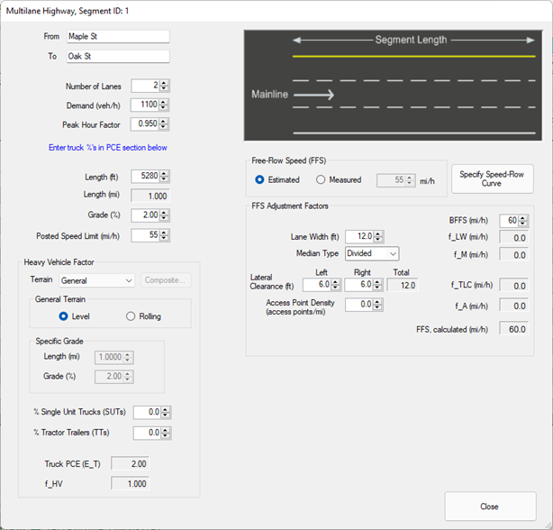
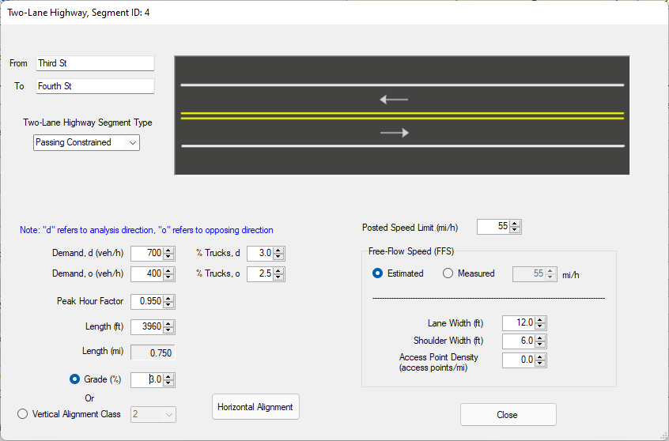
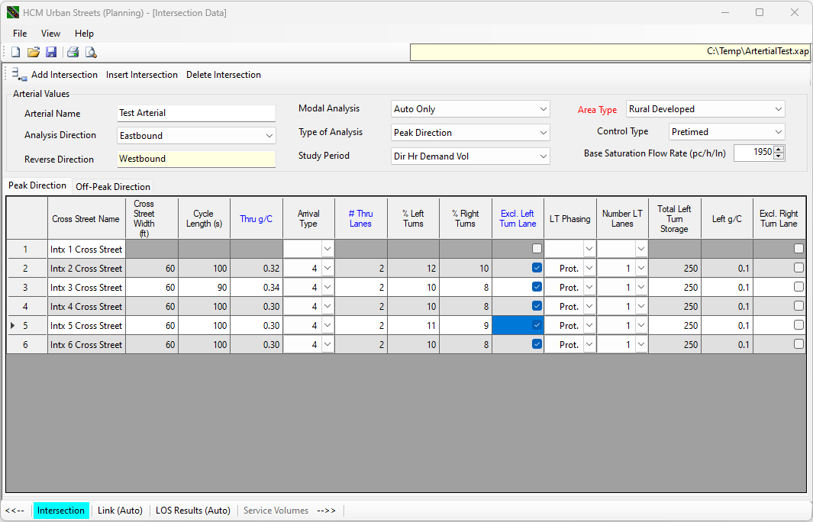
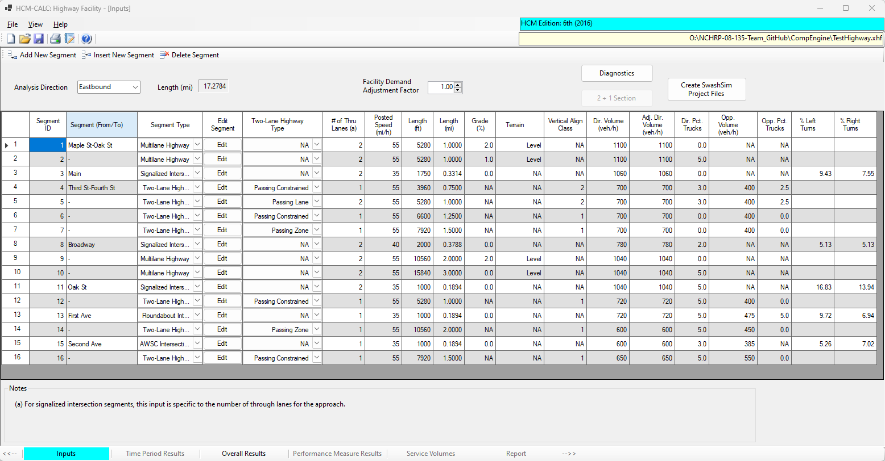
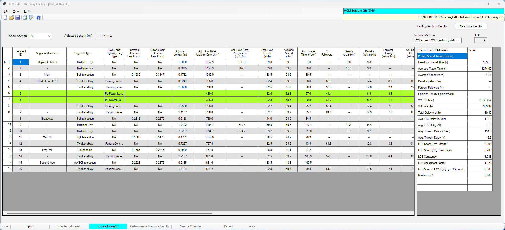
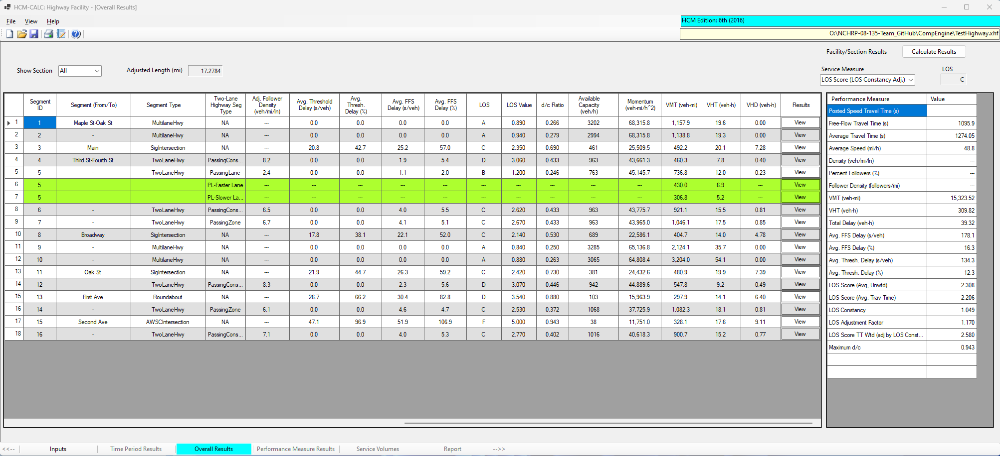

# Computational Engine Overview {#CompEngine}

<!-- Instructions for downloading and installing the software are at https://github.com/swash17/HCM-CALC -->

The computational engine includes calculations for the following roadway components, as well as the overall facility calculations for various combinations of these components:  
- Multilane highway segments  
- Two-lane highway segments  
- Signalized intersections  
- Roundabout intersections  
- All-way stop-controlled intersections  
- Urban Street (with signalized or uncontrolled intersections, AWSC and roundabouts in progress)

When you start the program (HCMCalc.exe), you will be presented with the following screen.

```{r StartScreen, echo=FALSE, fig.cap='HCM-CALC Startup Screen',out.width="60%", fig.align='center'}
knitr::include_graphics("./Images/CompEngine/StartupScreen.png")
```

Select the 'Highway Facility' module on the right side of the screen. Either press 'enter' or double-click on the entry with the left mouse button. The following screen will be displayed.

```{r NewFacility, echo=FALSE, fig.cap='New Facility Screen',out.width="80%", fig.align='center'}
knitr::include_graphics("./Images/CompEngine/NewFacilityScreen.png")
```

Note that the 'Inputs' tab, lower left part of the screen, will be highlighted.

To create your facility, use the 'Add New Segment', 'Insert New Segment', and/or 'Delete Segment' buttons in the toolbar near the top of the screen. When pressing 'Add New Segment' or 'Insert New Segment', the following screen will be displayed.

```{r AddNewSegment, echo=FALSE, fig.cap='Add New Segment Screen',out.width="30%", fig.align='center'}
knitr::include_graphics("./Images/CompEngine/AddNewSegment.png")
```

Select the desired segment type and press 'OK'. The input data screen for the corresponding segment type will be displayed. Those screens are as follows.

```{r MLhwyInputs, echo=FALSE, fig.cap='Multilane Highway Segment Inputs Screen',out.width="60%", fig.align='center'}

```

```{r TwoLaneHwyInputsPassCons, echo=FALSE, fig.cap='Two-Lane Highway Passing Constrained Segment Inputs Screen',out.width="60%", fig.align='center'}

```

```{r TwoLaneHwyInputsPassZone, echo=FALSE, fig.cap='Two-Lane Highway Passing Zone Segment Inputs Screen',out.width="60%", fig.align='center'}
knitr::include_graphics("./Images/CompEngine/TwoLaneHwyInputsPassZone.png")
```

```{r TwoLaneHwyInputsPassLane, echo=FALSE, fig.cap='Two-Lane Highway Passing Lane Segment Inputs Screen',out.width="60%", fig.align='center'}
knitr::include_graphics("./Images/CompEngine/TwoLaneHwyInputsPassLane.png")
```

```{r SignalIntxInputs, echo=FALSE, fig.cap='Signalized Intersection Inputs Screen',out.width="60%", fig.align='center'}
knitr::include_graphics("./Images/CompEngine/IntxInputsSignal.png")
```

```{r IntxInputsRoundabout, echo=FALSE, fig.cap='Roundabout Intersection Inputs Screen',out.width="60%", fig.align='center'}
knitr::include_graphics("./Images/CompEngine/IntxInputsRoundabout.png")
```

```{r IntxInputsAWSC, echo=FALSE, fig.cap='AWSC Intersection Inputs Screen',out.width="60%", fig.align='center'}
knitr::include_graphics("./Images/CompEngine/IntxInputsAWSC.png")
```

The arterial data is specified in a module that currently runs separately from HCM-CALC. Some screen shots from this module are shown in the following figures. The resulting file saved from this program will have an 'xap' extension.

```{r UrbanStreets1, echo=FALSE, fig.cap='Urban Street Inputs Screen (1)',out.width="60%", fig.align='center'}

```

```{r UrbanStreets2, echo=FALSE, fig.cap='Urban Street Inputs Screen (2)',out.width="60%", fig.align='center'}
knitr::include_graphics("./Images/CompEngine/UrbanStreets2.png")
```

To include the arterial within the highway facility, add a new 'Arterial' segment. The corresponding inputs screen is shown in the following figure.

```{r ArterialSegment, echo=FALSE, fig.cap='Arterial Segment Inputs Screen',out.width="60%", fig.align='center'}
knitr::include_graphics("./Images/CompEngine/ArterialSegment.png")
```

Within this screen, specify the desired arterial file (*.xap) by pressing the 'Select Arterial Data File'.

When using the 'Add New Segment' button, the new segment will inserted be after all currently included segments. To insert a segment elsewhere among the existing segments, select the row where you would like the new segment inserted by clicking on the row number (far left column of table) with the left mouse button. Then press the 'Insert New Segment' button. Upon closing the segment data entry screen, the new segment will be inserted at that row. The segment that was previously at that row will be shifted downward, along with any other successive segments.

If you need to delete a segment, select the row for the segment you would like to remove, again by clicking on the row number at the far left column of table with the left mouse button. Then press the 'Delete Segment' button. That segment will be removed and all successive segments will be shifted upward one row. 

As you create segments for your facility, some of the common inputs will be displayed on the main segment input data screen. For example, the input screen for the Test Highway discussed in Appendixes A and B is as follows.

```{r MainInputs, echo=FALSE, fig.cap='Facility with 16 Segments',out.width="80%", fig.align='center'}

```

After you have specified all the segments for your rural highway facility, and the corresponding input data, click on the 'Overall Results' tab in the lower toolbar. This action will run the calculations and display the results on the following screen (shown in two separate screen shots).  

```{r FacilityOutputs1, echo=FALSE, fig.cap='Facility Outputs Screen (1)',out.width="80%", fig.align='center'}

```

```{r FacilityOutputs2, echo=FALSE, fig.cap='Facility Outputs Screen (2)',out.width="80%", fig.align='center'}

```

The segment-specific results are shown in the table on the left side of the screen. The overall facility results are shown in the table on the right side of the screen. 

Also note that it is possible to view output results to a specific section of the highway. Sections are identified by contiguous segments of the same type and can be selected from a drop-down list input in the upper-left part of the output data summary screen. An example of a two-lane highway sections (segments 4-7) is shown in the following screen.

```{r FacilityOutputsTwoLaneOnly, echo=FALSE, fig.cap='Two-Lane Highway Section Outputs Screen',out.width="80%", fig.align='center'}
knitr::include_graphics("./Images/CompEngine/FacilityOutputsTwoLaneOnly.png")
```

Typically, the applicable service measure for that type of roadway, follower density in this case, and the corresponding LOS will be displayed in the upper-right part of the screen.
