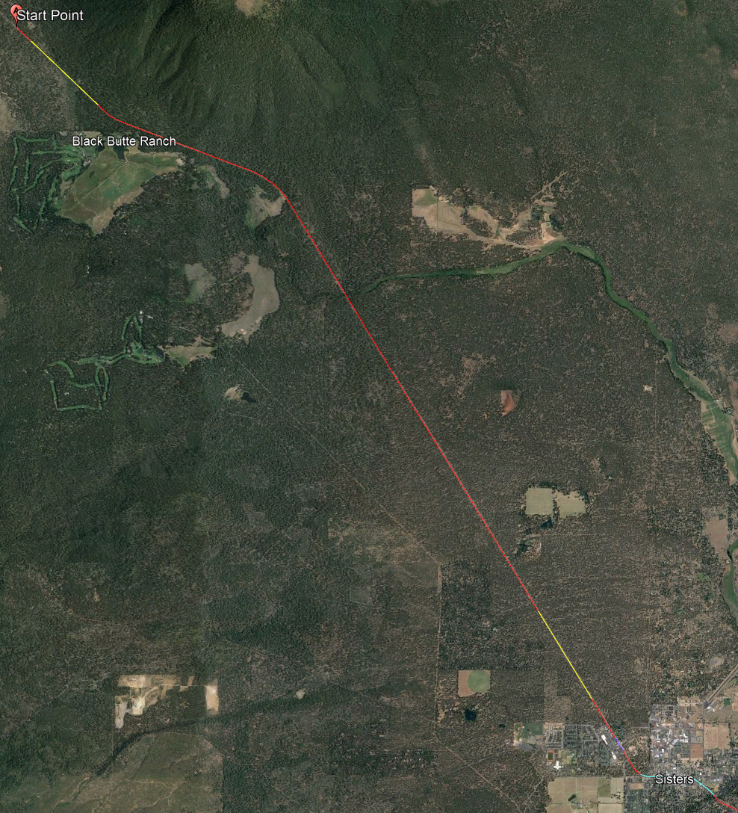
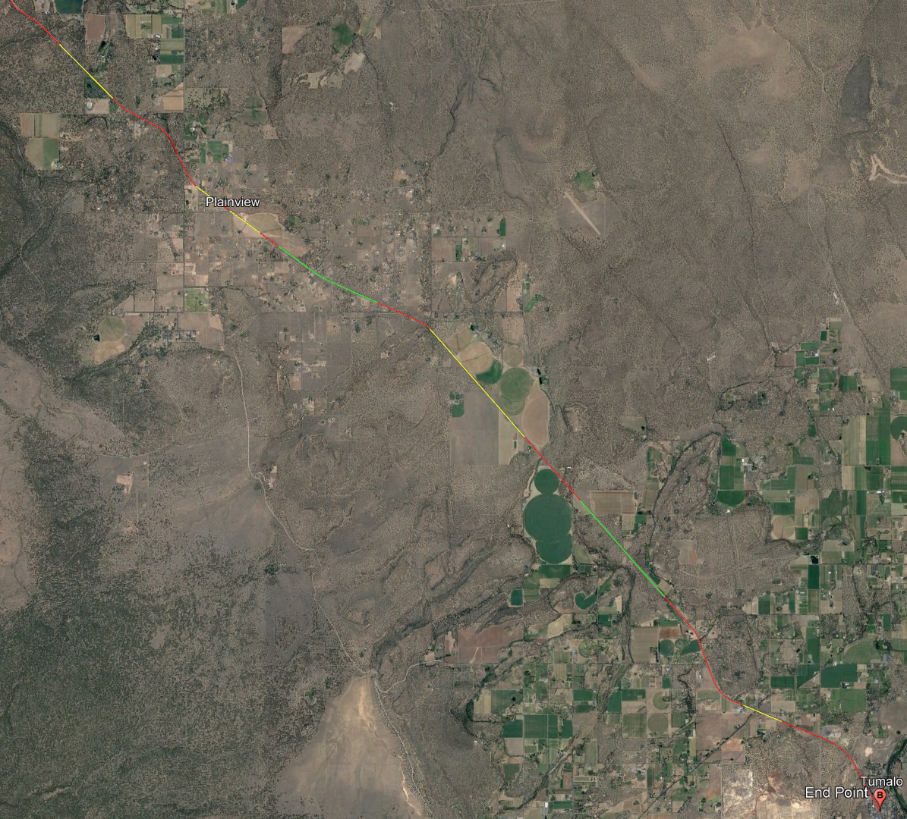
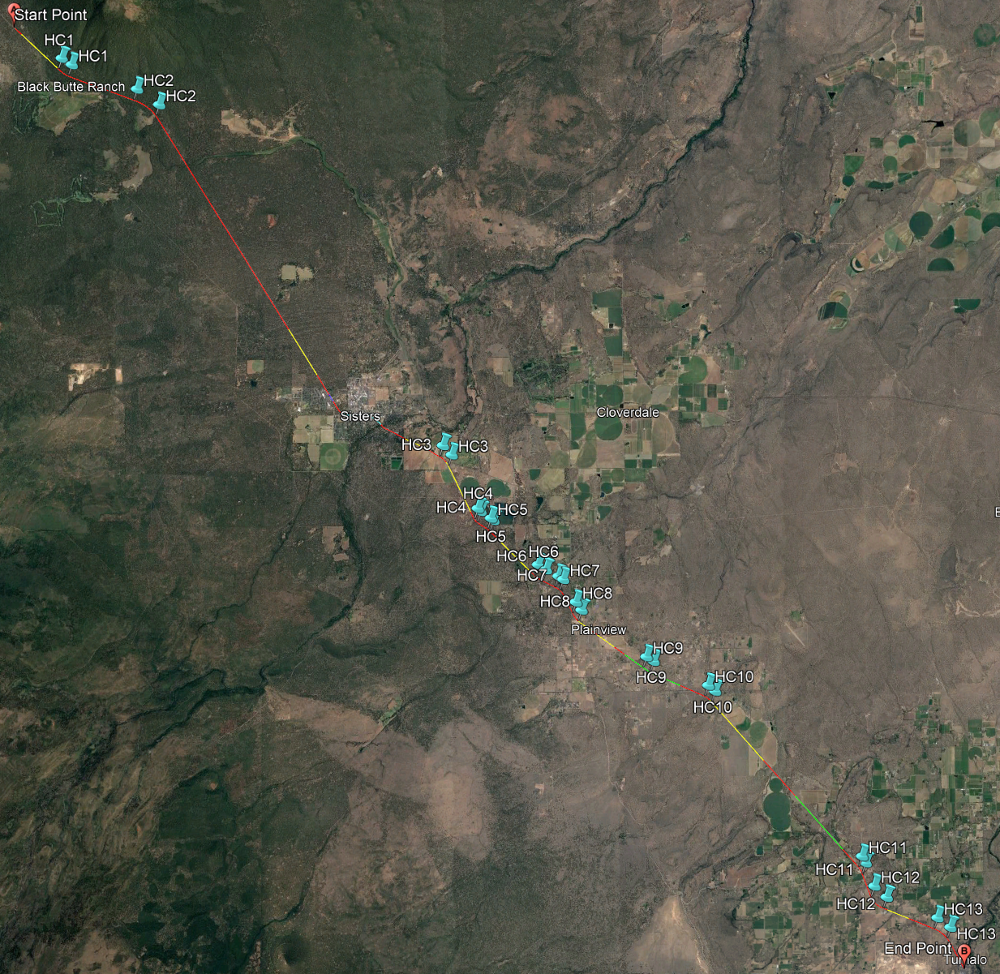
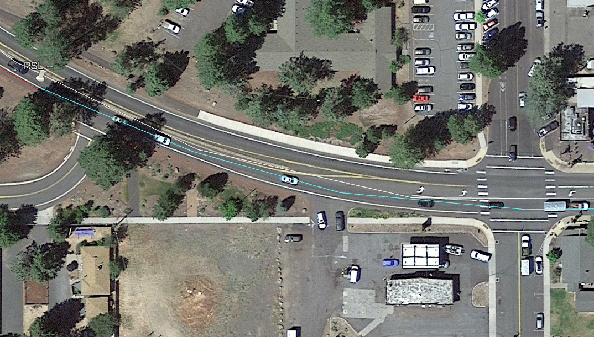
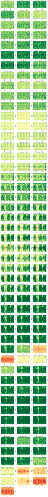
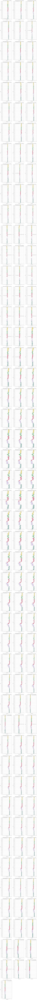

# Case Study: Oregon US-20 {#CaseStudyOR20}

## Route Description

This section of rural highway is an approximately 26-mile section of US-20 in central Oregon. The route generally extends from the Jefferson County line to Cline Falls Hwy/OB Riley Rd in Tumalo (44.399010616037145, -121.68160872108665; 44.12954543870768, -121.32386641302361). The route is shown in Figure \@ref(fig:US20RouteMap), as well as the [linked online map](https://www.openstreetmap.org/directions?engine=fossgis_osrm_car&route=44.4164%2C-121.6997%3B44.1296%2C-121.3238#map=11/44.2735/-121.5119).

```{r US20RouteMap, echo=FALSE, fig.cap='Oregon US-20 Study Route Boundaries. Source: Map data from [©OpenStreetMap](https://www.openstreetmap.org/copyright)',out.width="50%", fig.align='center'}
knitr::include_graphics("./Images/CaseStudyUS20/US-20.png")
```

This route serves as a connection between western Oregon cities such as Salem and Eugene and the western-central city of Bend, Oregon.  This route serves heavy recreational and truck traffic as all traffic to central Oregon from the central and southern Willamette Valley travels through this area. The facility runs through the small town of Sisters, Oregon (Deschutes county). There are several hotels, lodges, shopping complexes and tourist attractions located along the route. On a regional level Sisters, Oregon is a popular tourist destination and provides access to several national parks, hiking, and other outdoor sporting activities. The Mt. Bachelor resort is in the nearby Bend area.


## Level of service

### Segmentation {-}

This route consists of sections of two-lane highway, with passing constrained, passing zone, and passing lane segments, as well as an arterial street section that passes through the small city of Sisters, Oregon. The arterial section includes several two-way stop-controlled intersections (control only on the minor street). Just prior to the downtown area of Sisters, the route also includes a roundabout intersection. The analysis direction is the southeast direction of travel.

The first step in the segmentation process was to identify segments based on cross section and passing configuration (for two-lane highways). This is shown in Figure \@ref(fig:US20SegmentationFullRoute), with the color coding as defined in [KML Files].

```{r US20SegmentationFullRoute, echo=FALSE, fig.cap='Oregon US-20 Full Route, with segmentation shown for cross section and passing designation. Source: Map data ©2022 Google',fig.width=6, fig.align='center'}
knitr::include_graphics("./Images/CaseStudyUS20/US20_Full.png")
```

More zoomed images for the north, central, and south portions of the route are shown in Figures \@ref(fig:US20SegmentationRouteNorth), \@ref(fig:US20SegmentationRouteCentral), and \@ref(fig:US20SegmentationRouteSouth).

```{r US20SegmentationRouteNorth, echo=FALSE, fig.cap='Oregon US-20 Segmentation, North Portion of Route. Source: Map data ©2022 Google',out.width="75%", fig.align='center'}

```

```{r US20SegmentationRouteCentral, echo=FALSE, fig.cap='Oregon US-20 Segmentation, Central Portion of Route. Source: Map data ©2022 Google',out.width="75%", fig.align='center'}
knitr::include_graphics("./Images/CaseStudyUS20/US20_Central.png")
```

```{r US20SegmentationRouteSouth, echo=FALSE, fig.cap='Oregon US-20 Segmentation, South Portion of Route. Source: Map data ©2022 Google',out.width="75%", fig.align='center'}

```

Locations with horizontal curves along the route are readily seen on the map, but are also explicitly shown in Figure \@ref(fig:US20SegmentationHorizCurves).

Only horizontal curve 4 meets the segmentation criterion of only explicitly considering horizontal curves with a classification of 3 or higher. This curve has a superelevation of 0, central angle of 31.3 degrees, radius of 716 ft, and a length of approximately 390 ft, yielding a classification of 3. This curve is included within segment 17 (the final segmentation is shown below in Table \@ref(tab:SegmentationUS20).

```{r US20SegmentationHorizCurves, echo=FALSE, fig.cap='Oregon US-20 Segmentation, including Horizontal Curves. Source: Map data ©2022 Google',out.width="75%", fig.align='center'}

```

The vertical alignment along this route is quite varying. Consequently, Figure \@ref(fig:US20SegmentationGrades) only shows the grades that meet the segmentation criterion of vertical class 2 or higher.


```{r US20SegmentationGrades, echo=FALSE, fig.cap='Oregon US-20 Segmentation, including Significant Grades. Source: Map data ©2022 Google',out.width="75%", fig.align='center'}
knitr::include_graphics("./Images/CaseStudyUS20/US20_Grades.png")
```

Regarding the vertical alignment, the following decisions were made:  
* Grades 1 and 2, in segment 3, were similar and thus combined into a single grade, which was of class 3.
* There is a grade that starts in the second half of the segment preceding the second passing lane segment (#27). This grade is not considered in segment 26. The grade levels off in the last fourth of the passing lane segment. The passing lane is not split based upon grade and instead grade #4 is applied to the full length of the passing lane.


#### Segmentation through town of Sisters, OR {-}

The stretch of roadway through the town of Sisters consists of the following segment types (starting in the northwest portion of the town):

**#**|**Hwy Seg Type**|**Two-Lane Seg Type**|**# Dir Lanes**|**Length (ft)**|**Posted Speed (mi/h)**
:-----:|:-----:|:-----:|:-----:|:-----:|:-----:|
1|TwoLaneHwy|PassingConstrained|1|2177|35
2|Roundabout|---|1|797|35
3|TwoLaneHwy|PassingConstrained|1|1495|35
4|Arterial|---|1|3989|20
5|TwoLaneHwy|PassingConstrained|1|1460|35


**Segment 1**

The start of this segment is at the point where the posted speed limit reduces from 45 to 35 mi/h. The end of the segment is approximately where the approach leg to the roundabout intersection starts. The roadway characteristics for this segment are as follows:

- 1 lane
- 2177 ft long
- First half is undivided, marked as passing prohibited in oncoming lane; second half is divided with a median
- Shoulder for bicycle lane, no curb and gutter
- Posted speed limit is 35 mi/h

This segment is analyzed as a two-lane highway passing constrained segment.

**Segment 2**

This segment consists of a roundabout intersection and its connecting approach and departure legs, all of which include a single lane. It is 797 ft in length (440 upstream, 357 downstream, from center of roundabout). The posted speed limit is 35 mi/h.

**Segment 3**

The start of this segment is approximately at the point where the roundabout departure leg ends. The end of the segment is where the posted speed limit reduces from 35 to 20 mi/h. The roadway characteristics for this segment are as follows:

- 1 lane
- 1495 ft long
- Undivided, marked as passing prohibited in oncoming lane
- Shoulder for bicycle lane, no curb and gutter
- Posted speed limit is 35 mi/h

This segment is analyzed as a two-lane highway passing constrained segment. 

Segments 1-3 are shown in Figure \@ref(fig:SistersORUS20Northwest)

```{r SistersORUS20Northwest, echo=FALSE, fig.cap='Segments 1-3 through Sisters, OR. Source: Map data ©2022 Google',out.width="75%", fig.align='center'}
knitr::include_graphics("./Images/CaseStudyUS20/US20_SistersNorthWest.png")
```

**Segment 4**

The start of this segment is at the point where the posted speed limit reduces from 35 to 20 mi/h. The end of the segment is where the posted speed limit increases from 20 to 35 mi/h. The general roadway characteristics for this segment are as follows:

- 1 lane
- Approximately 4000 ft long
- Undivided
- No passing allowed in the oncoming direction
- Several two-way stop-controlled (TWSC) intersections
- Some portions include a bicycle lane
- Some portions include on-street parallel parking
- Some portions include curb and gutter
- Posted speed limit is 20 mi/h

This section of roadway is analyzed as an 'urban street' segment. Additional details on the segments within the urban street (hereafter referred to as 'subsegments') are as follows:

- Subsegment 1: from the point where 20 mi/h posted speed limit starts to Pine St  
  - Includes bicycle lane 
  - The eastbound approach to Pine St includes a left-turn bay  
- Subsegment 2: from Pine St to Larch St  
  - Includes curb and gutter
  - This stretch of roadway includes 100% curbside parallel parking
  - Includes the TWSC intersections of Oak St, Elm St, Fir St, and Spruce St
  - The eastbound approach to Larch St does not include a left-turn bay
- Subsegment 3: from Larch St to Locust St  
  - Includes curb and gutter
  - Includes bicycle lane
  - The eastbound approach to Locust St includes a left-turn bay
- Subsegment 4: from Locust St to the point where the 20 mi/h posted speed limit ends (just southeast of E Jefferson Ave)
  - Includes bicycle lane


These respective subsegments are shown in Figures \@ref(fig:SistersORUS20CentralSeg1) through \@ref(fig:SistersORUS20CentralSeg4).

```{r SistersORUS20CentralSeg1, echo=FALSE, fig.cap='US-20 urban street segmentation, subsegment 1. Source: Map data ©2022 Google',out.width="75%", fig.align='center'}

```

```{r SistersORUS20CentralSeg2, echo=FALSE, fig.cap='US-20 urban street segmentation, subsegment 2. Source: Map data ©2022 Google',out.width="75%", fig.align='center'}
knitr::include_graphics("./Images/CaseStudyUS20/US20_SistersCentralSeg2.png")
```

```{r SistersORUS20CentralSeg3, echo=FALSE, fig.cap='US-20 urban street segmentation, subsegment 3. Source: Map data ©2022 Google',out.width="75%", fig.align='center'}
knitr::include_graphics("./Images/CaseStudyUS20/US20_SistersCentralSeg3.png")
```

```{r SistersORUS20CentralSeg4, echo=FALSE, fig.cap='US-20 urban street segmentation, subsegment 4. Source: Map data ©2022 Google',out.width="75%", fig.align='center'}
knitr::include_graphics("./Images/CaseStudyUS20/US20_SistersCentralSeg4.png")
```

**Segment 5**

The start of this segment is at the point where the posted speed limit increases from 20 to 35 mi/h. The end of the segment is where the posted speed limit increases from 35 to 45 mi/h. The roadway characteristics for this segment are as follows: 

- 1 lane
- 1460 ft long
- Undivided, marked as passing prohibited in oncoming lane
- Paved shoulder, no bicycle lane
- No curb and gutter
- Posted speed limit is 35 mi/h

This segment is analyzed as a two-lane highway passing constrained segment.

```{r SistersORUS20East, echo=FALSE, fig.cap='Segment 5 through Sisters, OR. Source: Map data ©2022 Google',out.width="75%", fig.align='center'}
knitr::include_graphics("./Images/CaseStudyUS20/US20_SistersEast.png")
```


The final segmentation is shown in Table \@ref(tab:SegmentationUS20). The total length is 25.66 mi.

```{r SegmentationUS20, echo=FALSE}

Filename <- "./DataTables/CaseStudyOR20Table2.csv"
HighwayData <- read.csv(file = Filename, header = TRUE)

ColumnLabels <- c("Seg ID","From/To","Hwy Seg Type","Two-Lane Seg Type","# Dir Lanes","Length (ft)","Length (mi)","Terrain","Vertical Align Class","Posted Speed (mi/h)")

knitr::kable(
  HighwayData,
  col.names = ColumnLabels,
  booktabs = TRUE,
  caption = 'Final Segmentation for Oregon US-20 Study Route') %>%
  row_spec(0, angle = TableColumnHeaderTextAngle) %>%
  kable_styling(latex_options = "scale_down") %>%
  scroll_box(width = "100%", box_css = "border: 0px;")
```


#### Influence area and adjusted length calculations {-}

The upstream and downstream influence area must be calculated for the roundabout intersection. Based on these values, adjusted segment lengths must be calculated for the roundabout segment and the upstream/downstream segments connected to the roundabout.

Roundabout (Segment #9)

Upstream influence area, per Eq. \@ref(eq:InfluenceAreaEq3)  
$402.15 + 10.21 \times ApprAvgSpeed - 15.27 \times AvgCircSpeedMiHr$  
$402.15 + 10.21 \times 37.7 - 15.27 \times 15 = 558.0$ ft

Downstream influence area, per Eq. \@ref(eq:InfluenceAreaEq4)  
$-313.80 + 32.73 \times ExitSpeedMiHr - 27.01 \times CirculatingSpeedMiHr$  
$-313.80 + 32.73 \times 37.54 - 27.01 \times 15 = 515.0$ ft

Adjusted Segment Length: 558.0 + 515.0 = 1073.0 ft (0.2032 mi)

The input upstream and downstream distances (440, 357) affect the adjusted lengths of the upstream and downstream connecting segments, as follows:

Upstream Segment (#8)

Input length: 2177 ft (0.4123 mi)
Adj. length: 2177 + (440-558) = 2059 ft (0.3900 mi)

Downstream Segment (#10)

Input length: 1495 ft (0.2831 mi)
Adj. length: 1495 + (357 - 515.0) = 1337.0 ft (0.2532 mi)

The urban street segment is not bounded by intersections that require the major through movement to stop or yield; thus, influence area calculations are unnecessary for this segment.


### Traffic Data {-}

Traffic data were obtained from the Oregon Department of Transportation (ODOT) [Transportation Data Management System](https://ordot.public.ms2soft.com/tcds).

https://www.oregon.gov/odot/Data/Pages/Traffic-Counting.aspx


There are 10 sensor locations along the route limits for the LOS analysis that are currently used or have been used to collect data within the last several years. These locations are summarized in Table \@ref(tab:US20Sensors). Note that sensors are listed in order of western most to eastern most location along the route.


```{r US20Sensors, echo=FALSE}

Filename <- "./DataTables/CaseStudyOR20Table3.csv"
HighwayData <- read.csv(file = Filename, header = TRUE)

ColumnLabels <- c("Location ID","Milepost","Location Description","Approx. Location","Sensor Type","Measurements Taken")

knitr::kable(
  HighwayData,
  col.names = ColumnLabels,
  booktabs = TRUE,
  caption = 'US-20 Sensor Locations') %>%
  row_spec(0, angle = 0) %>%
  kable_styling(latex_options = "scale_down") %>%
  scroll_box(width = "100%", box_css = "border: 0px;")
```

Note: The first milepost in the study area is milepost 91, and continues through milepost 99, which is the last milepost before reaching the roundabout and downtown Sisters. The milepost than resets to 0 at the intersection of US-20 and SR-126, just SE of Sisters. The end of the study area is just after milepost 14. 


Table \@ref(tab:OregonUS20TrafficAADT) summarizes the most recently available values for annual average daily traffic (AADT), percentage of traffic volume occurring in the peak hour of the day (*K*), and percentage of traffic volume traveling in the peak direction of the peak hour (*D*). The values shown in this table are for the most recent years for which actual field measurements were taken, not values estimated from growth projections. The *K* values for some of the sensors are unusually high (> 15%); however, they are not used for any subsequent volume calculations in this analysis.

Table: (\#tab:OregonUS20TrafficAADT) US-20 Sensor Data -- *K*, *D*, AADT

**Location ID**   |**Year**|**K (%)**|**D (%)**|**AADT (veh/day)**
:----------------:|:------:|:-------:|:-------:|-------:
1510              |2019    |18       |59       |7,164
09014, 1511, 10277|2019    |19       |59       |7,860
45996             |NA      |NA       |NA       |NA
1512              |2019    |18       |59       |8,169
1445              |2019    |13       |52       |10,053
1446              |2019    |13       |52       |10,958
1447              |2019    |12       |52       |13,414
1513              |2019    |13       |54       |8,812
09015, 4754, 10278|2019    |13       |54       |11,310
1515              |2019    |13       |54       |13,629


The PM peak hour volumes generally occurred between the hours of 4-6 PM, with the highest hour typically being 4-5 PM. Again, the values shown are generally based on the most recent field measurements. If multiple measurements were taken during a given year, common dates across detectors were selected if possible. For example, if one sensor had counts taken during May and September of a given year and another sensor had counts taken during just May of the same year, the counts for May would be selected for both sensors. Furthermore, if multiple days of data were available in the same month of the same year, the same day of the week would be chosen across the sensors if possible.

The PHF values range from approximately 0.84-0.92. Because specific traffic peaking times will likely vary over a route of this length, as well as to not over complicate the process of 'conserving' vehicles throughout the full length of the route when setting traffic demand values, a single PHF value is used. For this analysis, an approximate mid-range value of 0.89 is used. Consequently, this value effectively increases the demand flow rate for analysis purposes by 12%. The original PM peak hour volumes and corresponding values as adjusted by the PHF (rounded to the nearest 50 veh) are shown in Table \@ref(tab:OregonUS20TrafficHourlyVolumes). The PHF values are then set to a value of 1.0 in the input data settings.

For some of the sensor counts, only 2-way values were provided. In these cases, the directional distribution value from Table \@ref(tab:OregonUS20TrafficAADT) was used to calculate the analysis and opposing direction traffic volumes. The only volume counts available for sensor 45996 were for the Labor Day period in 2019 (Thur 8/29, Fri 8/30, Sun 9/1, Mon 9/2). These daily volumes were almost double the average daily volumes. Thus, for this analysis example, these sensor volumes were not considered and are omitted from the table.

Table: (\#tab:OregonUS20TrafficHourlyVolumes) US-20 Sensor Data -- Eastbound PM Peak Hourly Volumes

**Location ID**|**Count Date**|**Dir. Adjusted Hourly Volume (veh/h)**|**Opp. Adjusted Hourly Volume (veh/h)**
:--------------:|:-----:|:-----:|:-----:|
1510              |Tues 5/21/2019|350|250
09014, 1511, 10277|Tues 5/21/2019|400|250
1512              |Tues 5/21/2019|600|400
1445              |Tues 5/21/2019|550|500
1446              |Tues 5/21/2019|600|550
1447              |Tues 5/21/2019|750|700
1513              |Mon  9/20/2021|600|500
09015, 4754, 10278|Tues 5/21/2019|600|500
1515              |Tues 4/27/2021|900|750


With a total of nine sensor locations spatially distributed across 25 miles of highway, determining locations to affect volume changes along the route is a very approximate process. To inform this process, satellite photography of the route and its surrounding area was reviewed. More major intersecting roadways--indicated by number of lanes, turning movement accommodation from the major roadway, and/or density of land use accessed by intersecting road within immediate area--were typically chosen as the locations to implement the volume changes.

The assignment of volumes (rounded to nearest 50 vehicles) to segments, and locations where volume changes are implemented are as follows:

- Sensor 1510 is located within Segment 1. Its volume of 350 veh/h is applied to Segments 1-3. Opposing direction volume is 250 veh/h.
- Sensor 09014 is located within Segment 4. There is a net volume increase of 50 veh/h at this sensor. This net volume change of +50 is implemented by assuming a net volume change of +50 veh/h at the intersection with Hawks Beard Rd (start of Segment 4, access to Black Butte Ranch resort area). Its volume of 400 veh/h is applied to Segments 4-9. Opposing direction volume is 250 veh/h.
- Sensor 1512 is located within Segment 10. There is a net volume increase of 200 veh/h at this sensor. This net volume change of +200 is implemented by assuming a net volume change of +200 veh/h at the roundabout intersection with W Barclay Dr (Segment 9). Some of this net volume change may also occur at the intersection with Railway Rd, upstream of the roundabout, but implementing a segment break at this intersection would create a create a very short segment between Railway Rd and the roundabout.
- Sensor 1445 is located within Segment 10. Sensors 1512 and 1445 are located within the same segment. There is net volume change of -50 veh/h between these two detectors, which likely occurs the intersection with W Hood Ave. However, as was the case upstream of the roundabout, implementing a segment break at this intersection would create a very short segment between the roundabout and W Hood Ave. The higher volume for Sensor 1512, the more conservative value, is retained for this segment.
  - Analysis direction volume in Segment 10 is 600 veh/h. Opposing direction volume is 400 veh/h.
- Sensors 1446 is located within Segment 11 (arterial). There is no net change in the analysis direction volume at this sensor. There is a change in the opposing direction volume; however, this volume is not utilized in the arterial analysis.
  - Analysis direction volume in Segment 11 is 600 veh/h.
- Sensor 1447 is also located within Segment 11 (arterial). There is a net volume increase of 150 veh/h at this sensor. This net volume change of +150 is implemented by assuming a net volume change of +50 veh/h at the intersection with Locust St (start of Subsegment4 within the arterial segment).
- Sensor 1513 is located within Segment 13. There is a net volume decrease of 150 veh/h at this sensor. This net volume change of -150 is implemented by assuming a net volume change of -150 veh/h at the intersection with SR-126/McKenzie Hwy. This intersection is located shortly downstream of where Segment 12 starts, and to again avoid very short segments, this volume change is implemented at the start of Segment 12. While this traffic volume is based on a count from 2021 (2019 values were not available), the analysis and opposing direction volumes are very similar to those calculated with the 2019 AADT, *K*, and *D* values. 
  - Analysis direction volume in Segment 12 is 600 veh/h. Opposing direction volume is 500 veh/h.
  - Analysis direction volume in Segment 13 is 600 veh/h. Opposing direction volume is 500 veh/h.
- Sensor 09015 is located within Segment 26. There is no net change in the analysis or opposing direction volumes at this sensor. All of the intersecting roads along US-20 from Segments 14-26 are very minor.
  - Analysis direction volume in Segments 14-26 is 600 veh/h. Opposing direction volume in Segments 14-26 is 500 veh/h.
- Sensor 1515 is located within Segment 33. There is a net volume increase of 300 veh/h at this sensor. This net volume change of +300 is implemented by assuming a net volume change of +300 veh/h at the intersection with 7th St in Tumalo. While this traffic volume is based on a count from 2021 (2019 values were not available), the analysis and opposing direction volumes are very similar to those calculated with the 2019 AADT, *K*, and *D* values.
  - Analysis direction volume in Segments 27-32 is 600 veh/h. Opposing direction volume in Segments 27-32 is 500 veh/h.
  - Analysis direction volume in Segment 33 is 900 veh/h. Opposing direction volume is 750 veh/h.


Vehicle classification data are available from only two sensor locations (09014, 09015), and for a very limited number of dates. The truck percentages for the hour of 4:00-5:00 PM for the southeast-bound direction, rounded to the nearest integer value, and the segments to which they are applied, are given in Table \@ref(tab:OregonUS20TruckPercentages). These percentages are also applied for the opposing direction. The 'breakpoint' in applicable segments corresponds to the northern section of the route through the city of Sisters and then the reminder of the route between Sisters and the city of Tumalo.

Table: (\#tab:OregonUS20TruckPercentages) US-20 Sensor Data -- PM Peak Hour Truck Percentages

**Location ID:**|**Date**|**Small Truck %**|**Large Truck %**|**Total Truck %**|**Applicable Segment(s)**
:-----:|:-----:|:-----:|:-----:|:-----:|:-----:
09014|10/29/2018|3|4|7|1-11
09015|7/25/2018|3|3|6|12-33


### Additional Data Inputs for Intersections {-}

**Signalized Intersections**

No signalized intersections are present along this route.

**Two-Way Stop Controlled (TWSC) Intersections**

These locations are typically used as segment break points to allow for a change in traffic volume. However, because it assumed that the major through movement does not incur delay due to any turning vehicles, no specific intersection analysis is required at these locations. For locations where intersection geometry upgrades are necessary because of delay due to turning movements, the reader is referred to some recommended studies listed in [Appendix A](#AppendixA).

Along the arterial 10% left and right turns where there is an exclusive left turn bay (Pine St and Locust St).
5% left and right turns where there is no exclusive left turn bay (Larch St)
The intersection with E Jefferson Ave does not include a leg on the northeast side of US-20. Thus, there are 0% left turns. 5% right turns is assumed. 

**All-Way Stop Controlled (AWSC) Intersections**

No AWSC intersections are present along this route.

**Roundabout Intersections**

There is one roundabout intersection along the route, in the city of Sisters. The following is assumed about turning movement volumes at this intersection:

- 20% total turns (10% left, 10% right) at intersections with major roads


### Results {-}

The segment LOS results are shown in Tables \@ref(tab:OregonUS20LOSresults1) and \@ref(tab:OregonUS20LOSresults2).

```{r OregonUS20LOSresults1, echo=FALSE}

Filename <- "./DataTables/CaseStudyOR20Table7.csv"
HighwayData <- read.csv(file = Filename, header = TRUE)

ColumnLabels <- c("Seg ID","Hwy Seg Type","Two-Lane Seg Type","# Dir Lanes","Length (mi)","Eff. Len. Upstream (mi)","Eff. Len. Downstream (mi)","Adj. Length (mi)","Posted Speed (mi/h)","Dir Volume (veh/h)","Opp Volume (veh/h)","PHF","Dir Truck%","Analysis Flow Rate (veh/h/ln)","Analysis Flow Rate (pc/h/ln)","Vertical Align Class","FFS (mi/h)","Free-Flow Trav Time (s)","Avg Speed (mi/h)","Avg Travel Time (s)")

knitr::kable(
  HighwayData,
  col.names = ColumnLabels,
  booktabs = TRUE,
  caption = 'US-20 Segment LOS Analysis Results, Part 1') %>%
  row_spec(0, angle = TableColumnHeaderTextAngle) %>%
  kable_styling(latex_options = "scale_down") %>%
  scroll_box(width = "100%", box_css = "border: 0px;")
```


```{r OregonUS20LOSresults2, echo=FALSE}

Filename <- "./DataTables/CaseStudyOR20Table8.csv"
HighwayData2 <- read.csv(file = Filename, header = TRUE)

ColumnLabels2 <- c("Seg ID","% Followers","Density (pc/mi/ln)","Density (veh/mi/ln)","Follower Density (veh/mi/ln)","Adj. Follower Density (veh/mi/ln)","Avg. Thresh. Delay (s/veh)","Avg. Thresh. Delay (%)","Avg. FFS Delay (s/veh)","Avg. FFS Delay (%)","LOS","LOS Value","Demand/Capacity","Available Capacity (veh/h)","Momentum (vol x speed)","VMT","VHT","VHD")

knitr::kable(
  HighwayData2,
  col.names = ColumnLabels2,
  booktabs = TRUE,
  caption = 'US-20 Segment LOS Analysis Results, Part 2') %>%
  row_spec(0, angle = TableColumnHeaderTextAngle) %>%
  kable_styling(latex_options = "scale_down") %>%
  scroll_box(width = "100%", box_css = "border: 0px;")
```


The facility LOS results are shown in Table \@ref(tab:OregonUS20FacilityResults)

Table: (\#tab:OregonUS20FacilityResults) US-20 Facility Analysis Results

**Performance Measure**|**Value**
:-----|:-----:
Free Flow Travel Time (s)|1564.9
Avg. Travel Time (s)|1641.09
Avg. Speed (mi/h)|56.29
VMT (veh-mi)|13372.87
VHT (veh-h)|238.628
Delay (veh-h)|11.062
Avg. FFS Delay (s/veh)|76.17
Avg. FFS Delay (%)|4.9
Avg. Threshold Delay (s/veh)|6.03
Avg. Threshold Delay (%)|0.4
LOS Score (Weighted-Travel Time)|1.831
LOS Constancy|0.606
LOS Adjustment Factor|1.081
LOS Score (Weighted-Travel Time and Adjusted)|1.98
Maximum d/c|0.529


**Discussion**

The overall facility LOS, based on a score of 1.98, is B. This is very close to the score threshold of 2.0 for LOS C. The facility average speed of 56 mi/h and FFS and threshold delays of 5% and <1%, respectively, indicate very good operations overall.

Individual segment LOS values are mostly B and C. The two-lane highway passing zone segments are mostly LOS B. Average speeds along the two-lane highway segments outside of the rural developed areas (Sisters and Tumalo) are high (58-62 mi/h). Both two-lane highway passing lane segments are LOS A.

Volume to capacity ratios generally range from 0.2-0.35. The maximum $d/c$ of 0.529 occurs in last two-lane highway (passing constrained) segment in Tumalo, as a result of the significant demand volume increase in this area. The roundabout intersection in Sisters has a $d/c$ of 0.4 and a control delay of approximately 8 s/veh for the major street through movement, corresponding to an LOS of A (0-10 s/veh = LOS A).

The average speed along the arterial through Sisters is 30.6 mi/h. This is well above the posted speed limit--it is the correct value per the urban streets methodology, but this kind of result is a noted criticism of the HCM methodology. Since the intersections along the arterial segment through Sisters are all TWSC intersections, a $d/c$ value is not reported. This is because the effects of the intersections are modeled as access points along the links (i.e., subsegments) and not modeled directly with the TWSC methodology, where delays due to left turns, for those intersections without separate left-turn bays, may be more accurately modeled.

Local observations of the operations, particularly at the TWSC intersections, should be made to determine the most appropriate way to analyze this stretch of roadway through Sisters.

According to the guidelines in the [Hot Spot Identification](#HotSpots) section, no segments within the facility would be considered hot spots. For much higher demand volume scenarios, such as Labor Day weekend, there are several two-lane highway segments that would likely reach LOS E or F. The arterial segment through Sisters may also become a hot spot under this demand volume condition, especially if left-turn movement volumes are moderate or higher. Under these conditions, it may be necessary to restrict left turns from US-20 through Sisters, where no separate left turn bay is provided. For a more permanent traffic growth situation, it may be necessary to consider converting the TWSC intersections to an alternate intersection form, such as a roundabout. See the Ohio US-42 Case Study (3) for an example of testing different demand volume conditions on the route.


## Reliability

::: {#Note .ThreshValue .message style="color: orange;"}
It should be noted that in the US-20 (Oregon) sample data, the vendor’s sample size was not sufficient to produce one minute-resolution data. Although the data file reports for each minute of the day, the travel time column remains constant for long stretches of time, indicating that data for those minutes is being imputed with historical data or modeled sources.
:::

The reliability analysis focused on a 6-mile stretch of US-20 in the rural town of Sisters, Oregon (see Figure \@ref(fig:US20ReliabilitySection1)). For the analysis, the facility was divided into 10 segments with each segment measuring approximately 0.6 miles in length.

https://www.google.com/maps/dir/44.331102,-121.589774/44.2699705,-121.5119487/@44.3009858,-121.5863162,14221m/am=t/data=!3m2!1e3!4b1

```{r US20ReliabilitySection1, echo=FALSE, fig.cap='Reliability Analysis Section, Through Sisters, Oregon, along US-20. Source: Map data ©2022 Google',out.width="75%", fig.align='center'}
knitr::include_graphics("./Images/CaseStudyUS20/Reliability/US20ReliabilitySection1.jpg")
```

The facility was evaluated using five data analysis and visualization techniques that convert the raw speed and travel time data into charts and graphics for analysis and interpretation. These methods are described in Section \@ref(ReliabilityMethods)).


### Speed Heatmaps {-}

Speed heatmaps are shown in Figure \@ref(fig:SpeedsHeatMapUS20). 

```{r SpeedsHeatMapUS20, echo=FALSE, fig.cap='Speed Heatmaps',out.width="95%", fig.align='center'}

if (knitr::is_html_output() == TRUE){
  knitr::include_graphics("./Images/CaseStudyUS20/Reliability/Speed.png")
} else if (knitr::is_latex_output() == TRUE){
  
}

```

Figure \@ref(fig:SpeedsHeatMapUS20) (eastbound speed from April 2021 through October 2021) shows generally high speeds (green) and consistent speeds (uniform color) outside of Sisters. The segments in downtown Sisters show slower speeds (colors moving to yellow and red) suggesting a lower speed limit, and particular slow speeds in the roundabout segments. These slowdows can be categorized as recurring congestion, with every day showing similar slow downs during the same hours of the day. The only clear evidence of non-recurring congestion in Figure \@ref(fig:SpeedsHeatMapUS20) is a few isolated red (slow) speeds, as for example in the late May 2021 time frame (potentially Memorial Day traffic). 

Nonrecurring congestion is more evident in the days spanning from Christmas to New Year's Day. This week shows notably lower speeds throughout the entire analysis corridor. The speed profile alone does not provide an obvious reason for why these speeds are slower during that particular month or two, but it is likely due to higher-than-usual demand for recreation during those days. Other causes of non-recurring congestion include work zones, but it is unlikely to have construction in the mountains of Oregon in December and January. Non-recurring congestion due to incidents or special events would be unlikely to last more than a day or two. As such, the general pattern on the speed heat map allows us to infer that the US-20 corridor was likely experiencing a seasonal spike in demand that increased its travel times.

### Speed Difference Heatmaps {-}

Speed difference heatmaps shown in Figure \@ref(fig:SpeedDiffUS20). The speed difference heatmap normalizes the display relative to the estimated free-flow speed for the segment (using the 85th percentile speed) making it much easier to visually infer periods of recurring and non-recurring congestion. In addition to the previously noted recurring congestion in the downtown area of Sisters and the non-recurring congestion in the December/January timeframe, the speed difference heat map shows periods of apparent unreliable travel during nighttime conditions. There is a potential bias here with low sample sizes on rural segments. For example, the low speeds could be due to a single (slow moving) truck being the only source of probe data, which then translates into a slow recorded speed. However, low sample size is expected to be less than an issue when a segment shows congestion for multiple time periods, which may then more likely be attributable to an incident, special event traffic, or severe weather event.

```{r SpeedDiffUS20, echo=FALSE, fig.cap='Speed Difference Heatmaps',out.width="95%", fig.align='center'}

if (knitr::is_html_output() == TRUE){
  knitr::include_graphics("./Images/CaseStudyUS20/Reliability/SpeedDiff.png")
} else if (knitr::is_latex_output() == TRUE){
  knitr::include_graphics("./Images/CaseStudyUS20/Reliability/SpeedDiffSmall.png")
}

```

### Box-and-Whisker Speed Plots {-}

In the box-and-whisker weekly speed plots shown in Figure \@ref(fig:BoxWhiskerWeeklyAvgUS20), speed (mi/h) is shown on the x-axis and time (in weeks) is shown on y-axis. The chart uses box-and-whisker plots to provide a summary of the weekly speeds for the analysis period. 

```{r BoxWhiskerWeeklyAvgUS20, echo=FALSE, fig.cap='Box-and-Whisker Weekly Speed Averages Plot',out.width="95%", fig.align='center'}

if (knitr::is_html_output() == TRUE){
  knitr::include_graphics("./Images/CaseStudyUS20/Reliability/BoxWhiskerWeeklyAvg.png")
} else if (knitr::is_latex_output() == TRUE){
  
}
```

### Speed Confidence Band {-}

The speed confidence plots are shown in Figure \@ref(fig:SpeedConfidenceBandsUS20). The speed confidence bands highlight the reliability in speeds for different hours of the day. A ‘tight’ speed band with 15th, 50th, and 85th percentile speeds all closely together suggests a very reliable speed performance for that segment in the given time period. A wider speed band with 15th and 85th percentile further away from the median suggest less reliable performance. A speed band that generally drops in speed (but remains tight) suggests that the facility is “reliably congested”. This is evident in downtown Sisters, which shows the speed band dropping as the downtown area becomes congested, but the travel is never unreliable (it is consistently slow).

```{r SpeedConfidenceBandsUS20, echo=FALSE, fig.cap='Speed Confidence Bands',out.width="95%", fig.align='center'}

if (knitr::is_html_output() == TRUE){
  knitr::include_graphics("./Images/CaseStudyUS20/Reliability/SpeedConfidenceBands.png")
} else if (knitr::is_latex_output() == TRUE){
  knitr::include_graphics("./Images/CaseStudyUS20/Reliability/SpeedConfidenceBandsSmall.png")
}
```

All segments (except in downtown Sisters) display reliable speed confidence throughout the day during the April 2021 to October 2021 period between 11 AM to 5 PM. The speed band misses the date/calendar dimension, but clearly points to speed variability in the highlighted 11 AM to 6 PM time frame. From here, the analyst can investigate the speed difference plot to see that congestion is most evident from roughly May through October (i.e., the high-tourism summer months), but less during the winter months.

### Travel Time Index {-}

The TTI plots are shown in Figure \@ref(fig:TravelTimeIndexUS20). The general shape of the cumulative TTI distribution allows inference on the variability of travel times along the segment. A generally steep TTI distribution suggests a generally reliable segment, while a more spread-out or flat distribution suggests a less reliable segment.

```{r TravelTimeIndexUS20, echo=FALSE, fig.cap='Travel Time Index (TTI) Plots',out.width="95%", fig.align='center'}

if (knitr::is_html_output() == TRUE){
  knitr::include_graphics("./Images/CaseStudyUS20/Reliability/TTI.png")
} else if (knitr::is_latex_output() == TRUE){
  knitr::include_graphics("./Images/CaseStudyUS20/Reliability/TTISmall.png")
}
```

### Summary {-}

This case study presented a data-driven approach to explore travel time reliability on a rural highway in Oregon (i.e., US-20) as it traverses the small town of Sisters, popular recreational destinations, and rural areas. Five different visualization techniques were used to derive insights from higher-resolution vehicular probe data from INRIX XD.

This case study clearly shows how increased demand during holidays can affect the travel time reliability measures. In this case, popular recreational destinations saw a spike in demand during the Christmas and New Year's Day holiday week(s), leading to higher travel times and degraded reliability over the analysis time period.
