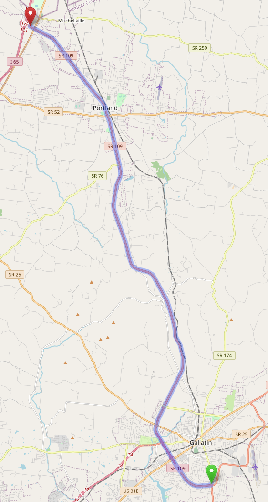
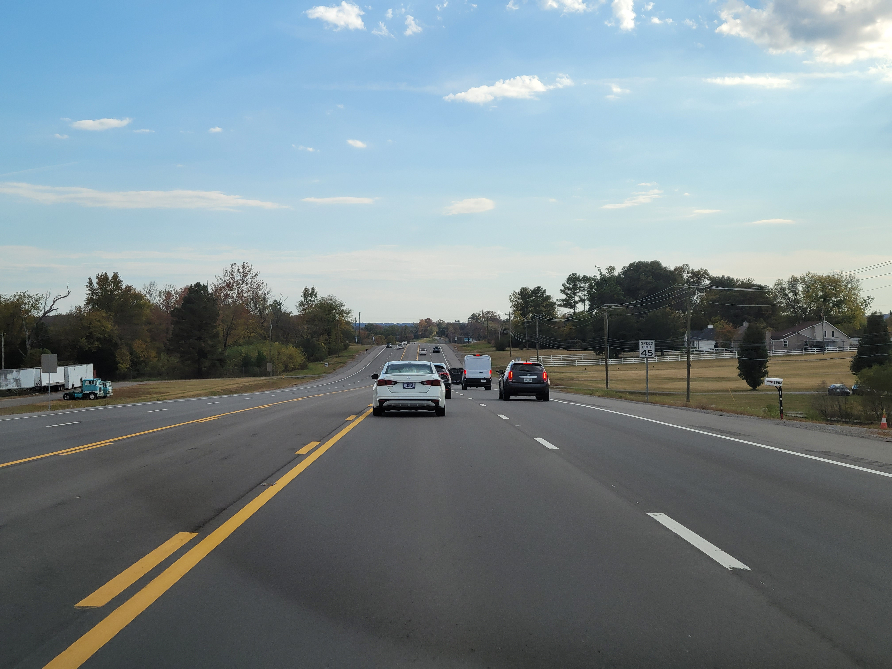
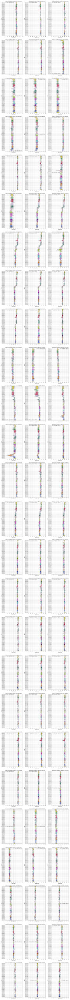
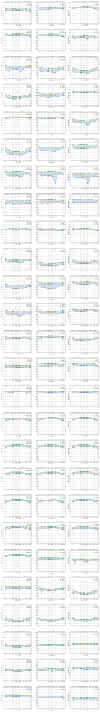
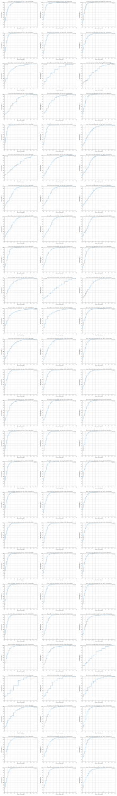

# Case Study: Tennessee SR-109 {#CaseStudyTN109}

## Route Description

SR-109 is a rural highway approximately 30 miles east of Nashville, TN. It runs primarily north-south between I-65 (at the north, 36.63005995380142, -86.57224654711138) and I-840 (at the south, 36.13174756486397, -86.40076816231978). The route is shown in Figure \@ref(fig:TN109RouteMap), as well as the [linked online map](https://www.openstreetmap.org/directions?engine=fossgis_osrm_car&route=36.1310%2C-86.3998%3B36.6287%2C-86.5706#map=11/36.3804/-86.4847). It is approximately 40 miles in length. More background information about this route can be found in a report that documents an access management study for this corridor [@SR109AccessStudy].

```{r TN109RouteMap, echo=FALSE, fig.cap='Tennessee SR-109 Study Route Boundaries. Source: Map data from [©OpenStreetMap](https://www.openstreetmap.org/copyright)',out.width="40%", fig.align='center'}
knitr::include_graphics("./Images/CaseStudyTN109/TN-109.png")
```


## Level of service

The level of service analysis focuses on the section of SR-109 between I-65 and the southern end of the city of [Gallatin](https://www.google.com/maps/place/36%C2%B023'18.3%22N+86%C2%B026'47.4%22W/@36.3884329,-86.4490612,17z/data=!3m1!4b1!4m4!3m3!8m2!3d36.3884286!4d-86.4464863?entry=ttu). This section is approximately 22 miles in length. The selected route is mostly contained within Sumner country. The northern terminus of the selected route, where it intersects with I-65, is just across the border of Robertson county. The southern portion of SR-109, not included in this analysis, is contained within Wilson county. The route is shown in Figure \@ref(fig:TN109RouteMapLOS), as well as the [linked online map](https://www.openstreetmap.org/directions?engine=fossgis_osrm_car&route=36.3644%2C-86.4401%3B36.6287%2C-86.5706#map=12/36.5008/-86.4773).


```{r TN109RouteMapLOS, echo=FALSE, fig.cap='Tennessee SR-109 LOS Study Route Boundaries. Source: Map data from [©OpenStreetMap](https://www.openstreetmap.org/copyright)',out.width="40%", fig.align='center'}

```

### Segmentation {-}

This route consists of sections of multilane highway, two-lane highway, with passing constrained and passing zone segments, several isolated signalized intersections, an arterial section through the small town of [Portland](https://www.google.com/maps/place/36%C2%B034'54.7%22N+86%C2%B030'53.2%22W/@36.5818741,-86.5173601,17z/data=!3m1!4b1!4m4!3m3!8m2!3d36.5818698!4d-86.5147852?entry=ttu), and several interchange ramp connections.

The general geometric configuration of the roadway through this section of SR-109 is as follows (from south to north):

- multilane highway in rural developed area (city of Gallatin), S Water Ave - Scotty Parker Rd/Old Hwy 109 N, approximately 5.93 mi  
- multilane highway in rural undeveloped area, intersection with SR-52, approximately 11.38 mi  
- arterial through city of Portland, SR-52 - Morningside Dr, approximately 1.02 mi  
- two-lane highway in rural undeveloped area, Morningside Dr - Magnolia Springs Rd, approximately 2.84 mi   
- multilane highway in rural undeveloped area, Magnolia Springs Rd - I-65 on-ramp, approximately 1.04 mi

The following photos^[Photos courtesy of Scott Washburn.] illustrate the variety of geometric configurations found along this route. Note that these photos are from a vehicle traveling in the southbound direction of the route.


```{r 1, echo=FALSE, fig.cap='Tennessee SR-109, two-lane highway cross-section, north of Kirby Dr', out.width="50%", fig.align='center'}
knitr::include_graphics("./Images/CaseStudyTN109/TN-109(4).jpg")
```

```{r 2, echo=FALSE, fig.cap='Tennessee SR-109, transition from two-lane to multilane highway, at Morningside Dr',out.width="50%", fig.align='center'}
knitr::include_graphics("./Images/CaseStudyTN109/TN-109(8).jpg")
```

```{r 3, echo=FALSE, fig.cap='Tennessee SR-109, signalized intersection within city of Portland, at College St, no left-turn bays',out.width="50%", fig.align='center'}
knitr::include_graphics("./Images/CaseStudyTN109/TN-109(11)_CollegeSt.jpg")
```

```{r 4, echo=FALSE, fig.cap='Tennessee SR-109, signalized intersection within city of Portland, at Market St, no left-turn bays',out.width="50%", fig.align='center'}
knitr::include_graphics("./Images/CaseStudyTN109/TN-109(12)_EMarketSt.jpg")
```

```{r 5, echo=FALSE, fig.cap='Tennessee SR-109, multilane highway with TWLTL, curb and gutter, city of Portland, south of Village Dr',out.width="50%", fig.align='center'}
knitr::include_graphics("./Images/CaseStudyTN109/TN-109(15).jpg")
```

```{r 6, echo=FALSE, fig.cap='Tennessee SR-109, multilane highway with grass median, no curb and gutter, city of Portland, south of Academy Rd',out.width="50%", fig.align='center'}
knitr::include_graphics("./Images/CaseStudyTN109/TN-109(21).jpg")
```

```{r 7, echo=FALSE, fig.cap='Tennessee SR-109, multilane highway with ieft-turn and u-turn treatments, south of Scotty Parker Rd/Old Hwy 109 N',out.width="50%", fig.align='center'}
knitr::include_graphics("./Images/CaseStudyTN109/TN-109(26).jpg")
```

```{r 8, echo=FALSE, fig.cap='Tennessee SR-109, exit ramp at diamond interchange, W Albert Gallatin Ave',out.width="50%", fig.align='center'}
knitr::include_graphics("./Images/CaseStudyTN109/TN-109(31)_WAlbertGallatinAve.jpg")
```

```{r 9, echo=FALSE, fig.cap='Tennessee SR-109, multilane highway with ieft-turn treatment, at Wedgewood Dr',out.width="50%", fig.align='center'}
knitr::include_graphics("./Images/CaseStudyTN109/TN-109(36)_WedgewoodDr.jpg")
```

```{r 10, echo=FALSE, fig.cap='Tennessee SR-109, multilane highway with TWLTL, no curb and gutter, north of Academy Rd',out.width="50%", fig.align='center'}

```

The final segmentation is shown in Table \@ref(tab:SegmentationTN109). The total length is 22.386 mi.


```{r SegmentationTN109, echo=FALSE}

Filename <- "./DataTables/CaseStudyTN109Table1.csv"
HighwayData <- read.csv(file = Filename, header = TRUE)

ColumnLabels <- c("Seg ID","From/To","Hwy Seg Type","Two-Lane Seg Type","# Dir Lanes","Length (ft)","Length (mi)","Terrain","Vertical Align Class","Posted Speed (mi/h)")

knitr::kable(
  HighwayData,
  col.names = ColumnLabels,
  booktabs = TRUE,
  caption = 'Final Segmentation for Tennessee SR-109 Study Route') %>%
  row_spec(0, angle = TableColumnHeaderTextAngle) %>%
  kable_styling(latex_options = "scale_down") %>%
  scroll_box(width = "100%", box_css = "border: 0px;")
```


The vertical alignment generally ranges from level to rolling terrain. The changes in terrain along the route are shown in Table \@ref(tab:TerrainTN109)

Table: (\#tab:TerrainTN109) Terrain changes for Tennessee SR-109 Study Route

**Segment Range**|**Terrain**|**Approximate Starting Location**
:-----:|:-----:|:-----:
1-2| Level| Start of route
3-8| Rolling| Ryan Rd
9-11| Level| Long Hollow Pike on-ramp
12-18| Rolling| Albert Gallatin Ave
19-20| Level| Holis Chapel Rd End
21-23| Rolling| Boiling Spring Rd
24-41| Level| SR-76 intersection


The screen captures of the graphical representation of the segmentation from Google Earth are not included here, as was done for the Oregon US-20 case study. Instead, the reader is referred to the KML file, at (https://github.com/NCHRP-08-135/Resources).

**Discussion**

Although there are not many changes to the number of lanes along this route, there are a relatively high number of segments because of changes in posted speed limit, terrain, signalized intersections, locations where significant changes in traffic volume occur (such as interchanges), and several changes in passing restrictions along the two-lane highway portion of the route.

Segments 17 and 18 are relatively short, 847 ft and 1182 ft, respectively. This is to accommodate changes in demand volumes. The intersections separating these segments provide separate left-turn bays.

The intersection at Kirby Dr (36°36'13.10"N, 86°32'13.06"W) is within a stretch of two-lane highway. Starting 645 ft upstream of the stop bar, the centerline striping changes from dashed yellow to solid yellow. Likewise, the solid yellow striping continues for 755 ft downstream of the intersection area before changing to dashed yellow. These three distances, 645 ft (upstream approach), 115 ft (intersection area), 755 ft (downstream approach) are combined together to represent the signalized intersection segment. If the directly adjacent upstream and downstream distances corresponding to the dashed yellow striping were coded as separate passing constrained segments, these segments would would be assigned a negative adjusted length because the calculated upstream and downstream influence area distances would exceed these passing constrained distances.

A posted speed limit (PSL) reduction (45 to 40 mi/h) occurs in Segment 38. Normally, a new segment would be started at the point of a PSL change; however, the passing zone from this point only continues for  approximately 310 ft before changing to a passing constrained zone. Thus, this additional 310 ft of passing zone is included as part of Segment 38. From a practical perspective, drivers would treat this continuation of the passing zone beyond the PSL as part of the same stretch of passing zone upstream of the PSL change.

The arterial segment (29) ends at Morningside Dr, where two directional travel lanes transition to a single lane. At this point, a two-lane highway passing constrained segment begins. However, the arterial posted speed limit of 30 mi/h continues for approximately 590 ft after the end of the arterial segment before changing to 45 mi/h. Because this is a relatively short distance, this short stretch of passing constrained roadway at 30 mi/h is part of Segment 30, for which the remaining approximately 3040 ft of passing constrained roadway is signed for a speed limit of 45 mi/h. 


#### Segmentation through town of Portland, TN {-}

The arterial segment through the town of Portland consists of the following sub-segments:

**#**|**Cross Street Boundaries**|**# Dir Lanes**|**Length (ft)**|**Cross Street Width**|**Posted Speed (mi/h)**|**General Features**
:-----:|:------|:-----:|:-----:|:-----:|:------|
1|SR-52 - Market St|2|1065|75|30|Undivided, curb/gutter/sidewalk
2|Market St - McGlothin St|2|600|105|30|Undivided, curb/gutter/sidewalk
3|McGlothin St - College St|2|315|130|30|Undivided, no curb/gutter, continuous frontage business access
4|College St - Morningside Dr|2|3055|60|30|Undivided, no curb/gutter, continuous frontage business access


### Traffic Data {-}

Traffic data were obtained from the Tennessee Department of Transportation (TDOT) [Transportation Data Management System](https://tdot.public.ms2soft.com/tcds).

There are nine sensor locations along highway limits for the LOS analysis, as summarized in Table \@ref(tab:TN109Sensors). Note that detectors are listed in order of northern most to southern most location along the route.

Table: (\#tab:TN109Sensors) SR-109 Sensor Locations

**Location ID**|**Location Description**|**Approx. Location**|**Sensor Type**
:-----:|:-----:|:-----:|:-----:
83000133|SR109 North Portland|36.60000902671167, -86.53358761270735|Axle/Tube
83000189|SR109 Portland|36.579966780040124, -86.51573967563627|Axle/Tube
83000018|SR109 Portland|36.564557580338835, -86.51077679030027|ATR Class
83000268|SR109 SR-109|36.52242136573732, -86.5098920651874|Axle/Tube
83000267|SR109 SR-109|36.47830136284571, -86.4773957598811|Axle/Tube
83000197|SR109 Gallatin|36.412250456982775, -86.47193224334912|Axle/Tube
83000196|SR109 Gallatin|36.393181597974774, -86.47892312861133|Axle/Tube
83000195|SR109 Gallatin|36.38150742324095, -86.47010146756689|Axle/Tube
83000194|SR109 Gallatin|36.36778239584337, -86.45912407493229|Axle/Tube

Table \@ref(tab:TN109TrafficAADT) summarizes the most recently available values for annual average daily traffic (AADT), percentage of traffic volume occurring in the peak hour of the day (*K*), and percentage of traffic volume traveling in the peak direction of the peak hour (*D*). The values shown in this table are for the most recent years for which actual field measurements were taken, not values estimated from growth projections.


Table: (\#tab:TN109TrafficAADT) SR-109 Sensor Data -- *K*, *D*, AADT

**Location ID:**|**Year**|**K (%)**|**D (%)**|**AADT (veh/day)**
:-----:|:-----:|:-----:|:-----:|:-----:
83000133|2022|8|65|15,415
83000189|2022|8|54|19,423
83000018|2022|9|50|15,956
83000268|2020|10|57|10,990
83000267|2021|9|57|14,719
83000197|2022|9|58|19,048
83000196|2022|9|57|25,048
83000195|2022|9|58|34,979
83000194|2021|8|63|25,734


The PM peak hour volumes generally occurred between the hours of 4-6 PM, with the highest hour typically being 5-6 PM. Again, the values shown are generally based on the most recent field measurements. If multiple measurements were taken during a given year, common dates across detectors were selected if possible. For example, if one sensor had counts taken during May and September of a given year and another sensor had counts taken during just May of the same year, the counts for May would be selected for both sensors. Furthermore, if multiple days of data were available in the same month of the same year, the same day of the week would be chosen across the sensors if possible.

The PHF values range from approximately 0.87-0.96. Because specific traffic peaking times will likely vary over a route of this length, as well as to not over complicate the process of 'conserving' vehicles throughout the full length of the route when setting traffic demand values, a single PHF value is used. For this analysis, an approximate mid-range value of 0.91 is used. Consequently, this value effectively increases the demand flow rate for analysis purposes by 10%. The original PM peak hour volumes and corresponding values as adjusted by the PHF (rounded to the nearest 50 veh) are shown in Table \@ref(tab:TN109TrafficHourlyVolumes). The PHF values are then set to a value of 1.0 in the input data settings.


Table: (\#tab:TN109TrafficHourlyVolumes) SR-109 Sensor Data -- Northbound PM Peak Hourly Volumes

**Location ID:**|**Count Date**|**Hourly Volume (veh/h)**|**Adjusted Hourly Volume (veh/h)**|
:-----:|:-----:|:-----:|:-----:
83000133|Mon 5/23/2022|652*|700|
83000189|Wed 6/8/2022|826|950|
83000018|Thu 6/9/2022|779|850|
83000268|Thu 5/14/2020|677|750|
83000267|Thu 5/6/2021|906|1,000|
83000197|Wed 5/4/2022|1,142|1,250|
83000196|Wed 5/4/2022|1,429|1,550|
83000195|Wed 5/4/2022|1,887|2,050|
83000194|Wed 5/19/2021|909|1,000|

* Data not available, so value imputed based on AADT relationship to adjacent detector


With a total of nine sensor locations spatially distributed across 22 miles of highway, determining locations to affect volume changes along the route is a very approximate process. To inform this process, satellite photography of the route and its surrounding area was reviewed. More major intersecting roadways--indicated by number of lanes, turning movement accommodation from the major roadway, and/or density of land use accessed by intersecting road within immediate area--were typically chosen as the locations to implement the volume changes.

For two-lane highway segments, the opposing direction volume is needed. Based on Detector 83000133 (in Segment 34), the one sensor within the two-lane highway portion of the route, the *D* factor value of 65% was used to set the opposing direction volume for the PM peak hour; that is, opposing direction volume = peak direction volume / 0.65 -  peak direction volume (rounded to the nearest 50 veh).

The assignment of volumes (rounded to nearest 50 vehicles) to segments, and locations where volume changes are implemented are as follows:

- Sensor 83000194 is located within Segment 2. Its volume of 1000 veh/h is applied to Segments 1-5.
- Sensor 83000195 is located within Segment 7. There is a net volume increase of 1050 veh/h at this sensor. This net volume change of +1000 is implemented by assigning an exit volume of -250 at the Nashville Pike interchange (start of Segment 6) and an entrance volume of +1300 at the Nashville Pike interchange (start of Segment 7).
  - Volume in Segment 6 is 750 veh/h.
  - Volume in Segment 7 is 2050 veh/h.
- Sensor 83000196 is located within Segment 9. There is a net volume decrease of 500 veh/h at this sensor. This net volume change of -500 is implemented by assigning an exit volume of -900 at the Long Hollow Pike interchange (start of Segment 8) and an entrance volume of +400 at the Long Hollow Pike interchange (start of Segment 9).
  - Volume in Segment 8 is 1150 veh/h.
  - Volume in Segment 9 is 1550 veh/h.
- Sensor 83000197 is located within Segment 13. There is a net volume decrease of 300 veh/h at this sensor. This net volume change of -300 is implemented by assuming a net volume change of -100 veh/h at the intersection with Red River Rd (Segment 10), assigning an exit volume of -300 at the Albert Gallatin Ave interchange (start of Segment 12) and an entrance volume of +100 at the Albert Gallatin Ave interchange (start of Segment 13).
  - Volume in Segment 10 is 1450 veh/h.
  - Volume in Segment 11 is 1450 veh/h.
  - Volume in Segment 12 is 1150 veh/h.
  - Volume in Segment 13 is 1250 veh/h.
- Sensor 83000267 is located within Segment 16. There is a net volume decrease of 250 veh/h at this sensor. This net volume change of -250 is implemented by assuming a net volume change of -150 veh/h at the intersection with Old Hwy 109 N/Scotty Parker Rd (start of Segment 15) and a net volume change of -100 veh/h at the intersection with S Tunnel Rd (start of Segment 16).
  - Volume in Segment 14 is 1250 veh/h.
  - Volume in Segment 15 is 1100 veh/h.
  - Volume in Segment 16 is 1000 veh/h.
- Sensor 83000268 is located within Segment 21. There is a net volume decrease of 250 veh/h at this sensor. This net volume change of -250 is implemented by assuming a net volume change of -150 veh/h at the intersection with Roberts Rd (start of Segment 20) and a net volume change of -100 veh/h at the intersection with Boiling Springs Rd (start of Segment 21).
  - Volume in Segment 17 is 1000 veh/h.
  - Volume in Segment 18 is 1000 veh/h.
  - Volume in Segment 19 is 850 veh/h.
  - Volume in Segment 20 is 850 veh/h.
  - Volume in Segment 21 is 750 veh/h.
- Sensor 83000018 is located within Segment 27. There is a net volume increase of 100 veh/h at this sensor. This net volume change of +100 is implemented by assuming a net volume change of +100 veh/h at the intersection with SR-76 intersection (Segment 24).
  - Volume in Segment 22 is 750 veh/h.
  - Volume in Segment 23 is 750 veh/h.
  - Volume in Segment 24 is 750 veh/h.
  - Volume in Segment 25 is 850 veh/h.
  - Volume in Segment 26 is 850 veh/h.
  - Volume in Segment 27 is 850 veh/h.
- Sensor 83000189 is located within Segment 29. There is a net volume increase of 100 veh/h at this sensor. This net volume change of +100 is implemented by assuming a net volume change of +100 veh/h at the intersection with SR-52 intersection (Segment 28).
  - Volume in Segment 28 is 850 veh/h.
  - Volume in Segment 29 is 950 veh/h.
- Sensor 83000133 is located within Segment 31. There is a net volume decrease of 250 veh/h at this sensor. This net volume change of -250 is implemented by assuming a net volume change of -250 veh/h at the intersection with Freedom Dr (within arterial segment, Segment 29)
  - Volume in Segment 30 is 700 veh/h. Opposing direction volume is 400 veh/h.
  - Volume in Segment 31 is 700 veh/h. Opposing direction volume is 400 veh/h.
 
- Volume in Segments 32-41 is 700 veh/h. For segments 33-38, opposing direction volume is 400 veh/h.


Vehicle classification data are available from five sensor locations (83000133, 83000018, 83000267, 83000196, 83000195). The truck percentages for the hour of 5:00-6:00 PM for the northbound direction, rounded to the nearest integer value, and the segments to which they are applied, are given in Table \@ref(tab:TN109TruckPercentages).

Table: (\#tab:TN109TruckPercentages) SR-109 Sensor Data -- PM Peak Hour Truck Percentages

**Location ID:**|**Date**|**Small Truck %**|**Large Truck %**|**Total Truck %**|**Applicable Segment(s)**
:-----:|:-----:|:-----:|:-----:|:-----:|:-----:
83000195|4/22/2020|2|6|8|1-8
83000196|4/16/2020|1|3|4|9-14
83000267|6/9/2022|1|5|6|15-23
83000018|6/9/2022|1|13|14|24-28
83000133|5/20/2019|2|7|9|29-41

Note that for all but the multilane highway segment type, only the total truck percentage is used in the corresponding segment analysis methodology calculations. For multilane highways, the separate percentages for small and large trucks are used when performing an analysis for a segment with a specific grade (i.e., explicit consideration of grade percentage and length of grade). For a segment that using the 'general terrain' classification (i.e., level, rolling), just the total truck percentage is utilized.


::: {#Note .ThreshValue .message style="color: orange;"}
The Albert Gallatin Ave interchange may not have been open at the time of these volume counts. Satellite photo shows construction vehicles on connecting road. This interchange probably changed turning volumes at Red River Rd (to the south) and Old Hwy 109 N/Scotty Parker Rd (to the north)
:::

### Additional Data Inputs for Intersections {-}

**Signalized Intersections**

The following is assumed about turning movement volumes from SR-109 onto cross streets:

- 10% total (5% left, 5% right) at intersections with minor roads
- 20% total (10% left, 10% right) at intersections with major roads
- If the intersection is not at a location where a net volume difference is implemented (according to information above), then it is assumed that a volume equal to the volume turning from the major roadway enters the major roadway from the cross street.

The route includes isolated signalized intersections at the following cross streets:  

- Hancock St
- Red River Rd
- SR-76/Fountainhead Rd
- Longview Rd
- SR-52
- Kirby Dr (essentially 3-leg)
- Highway 31W

All of these intersections include two through lanes and a left turn bay for the major street approaches. The major street approaches at the intersections with Hancock St, SR-52, and Highway 31W also include a right turn bay.

The intersection with Kirby Dr. is, for practical purposes, a 3-leg intersection. The eastbound leg just serves as an access to a very small business; thus, the traffic volume into and out of this leg of the intersection is negligible for analysis purposes.

The route includes several intersections that are included within the arterial segment (29), which runs through the town of Portland. These intersections are located at the following cross streets: 

- Market St
- McGlothin St
- College St (3-leg)

All of these intersections include two through lanes for the major street approaches. However, none of them include left or right turn bays.

Specific signal timing data were not available, so the following assumptions were made.

Isolated Intersections:

- Cycle length: 90 seconds
- Effective green/cycle length ratio: 0.44
- Arrival type: 3 (random arrivals)

Arterial intersections (no turn bays)

- Cycle length: 60 seconds
- Effective green/cycle length ratio: 0.48 (higher than for isolated intersections because of lack of exclusive left turn phasing)
- Arrival type: 4 (favorable progression)

**Two-Way Stop Controlled (TWSC) Intersections**

These locations are typically used as segment break points to allow for a change in traffic volume. However, because it assumed that the major through movement does not incur delay due to any turning vehicles, no specific intersection analysis is required at these locations. For locations where intersection geometry upgrades are necessary because of delay due to turning movements, the reader is referred to some recommended studies listed in [Appendix A](#AppendixA).

**All-Way Stop Controlled (AWSC) Intersections**

No AWSC intersections are present along this route.

**Roundabout Intersections**

No roundabout intersections are present along this route.

### Results {-}

For multilane highway segments, the base free-flow speed (BFFS) was set per the HCM guidance; that is BFFS = Posted Speed Limit (PSL) + 5, for posted speeds <= 45 mi/h and BFFS = PSL + 7 for posted speeds > 45 mi/h.

The segment LOS results are shown in Tables \@ref(tab:TN109LOSresults1) and \@ref(tab:TN109LOSresults2).

```{r TN109LOSresults1, echo=FALSE}

Filename <- "./DataTables/CaseStudyTN109Table8.csv"
HighwayData <- read.csv(file = Filename, header = TRUE)

ColumnLabels <- c("Seg ID","Hwy Seg Type","Two-Lane Seg Type","# Dir Lanes","Length (mi)","Eff. Len. Upstream (mi)","Eff. Len. Downstream (mi)","Adj. Length (mi)","Posted Speed (mi/h)","Dir Volume (veh/h)","Opp Volume (veh/h)","PHF","Dir Truck%","Analysis Flow Rate (veh/h/ln)","Analysis Flow Rate (pc/h/ln)","Vertical Align Class","FFS (mi/h)","Free-Flow Trav Time (s)","Avg Speed (mi/h)","Avg Travel Time (s)")

knitr::kable(
  HighwayData,
  col.names = ColumnLabels,
  booktabs = TRUE,
  caption = 'SR-109 Segment LOS Analysis Results, Part 1') %>%
  row_spec(0, angle = TableColumnHeaderTextAngle) %>%
  kable_styling(latex_options = "scale_down") %>%
  scroll_box(width = "100%", box_css = "border: 0px;")
```


```{r TN109LOSresults2, echo=FALSE}

Filename <- "./DataTables/CaseStudyTN109Table9.csv"
HighwayData2 <- read.csv(file = Filename, header = TRUE)

ColumnLabels2 <- c("Seg ID","% Followers","Density (pc/mi/ln)","Density (veh/mi/ln)","Follower Density (veh/mi/ln)","Adj. Follower Density (veh/mi/ln)","Avg. Thresh. Delay (s/veh)","Avg. Thresh. Delay (%)","Avg. FFS Delay (s/veh)","Avg. FFS Delay (%)","LOS","LOS Value","Demand/Capacity","Available Capacity (veh/h)","Momentum (vol x speed)","VMT","VHT","VHD")

knitr::kable(
  HighwayData2,
  col.names = ColumnLabels2,
  booktabs = TRUE,
  caption = 'SR-109 Segment LOS Analysis Results, Part 2') %>%
  row_spec(0, angle = TableColumnHeaderTextAngle) %>%
  kable_styling(latex_options = "scale_down") %>%
  scroll_box(width = "100%", box_css = "border: 0px;")
```


Table \@ref(tab:TN109ArterialResults) provides the results for the individual subsegments within the arterial segment, again specific to the major street through movement.

Table: (\#tab:TN109ArterialResults) SR-109 Arterial Segment (29) LOS Analysis Results

**#**|**Cross Street Boundaries**|**Analysis Flow Rate (veh/h)**|**Adj. Sat. Flow Rate (veh/h)**|**v/c**|**Control Delay (s/veh)**|**Average Speed (mi/h)**|
:-----:|:------|:-----:|:-----:|:-----:|:------:|
1|SR-52 - Market St|950|2433|0.814|11.9|21.6
2|Market St - McGlothin St|2433|0.814|11.9|16.5
3|McGlothin St - College St|2433|0.814|11.9|11.8
4|College St - Morningside Dr|NA|0.814|--|38.4


The facility LOS results are shown in Table \@ref(tab:TN109FacilityResults)

Table: (\#tab:TN109FacilityResults) SR-109 Facility Analysis Results

**Performance Measure**|**Value**
:-----|:-----:
Free Flow Travel Time (s)|1511.1
Avg. Travel Time (s)|1745.66
Avg. Speed (mi/h)|46.17
VMT (veh-mi)|21488.24
VHT (veh-h)|454.152
Delay (veh-h)|56.833
Avg. FFS Delay (s/veh)|234.59
Avg. FFS Delay (%)|15.5
Avg. Threshold Delay (s/veh)|186.05
Avg. Threshold Delay (%)|12.3
LOS Score (Weighted-Travel Time)|1.478
LOS Constancy|0.601
LOS Adjustment Factor|1.08
LOS Score (Weighted-Travel Time and Adjusted)|1.596
Maximum d/c|0.95

**Discussion**

The overall facility LOS, based on a score of 1.596, is B. FFS and threshold delays, 15.5% and 12.3%, are relatively low. The several large signalized intersections and slow speed through the city of Portland are the primary contributors to an average speed of just 46 mi/h along this route.

Density values for the multilane highway segments generally range approximately from 7-12 veh/mi/ln, with LOS values of A and B. Volume to capacity ratios range approximately from 0.2-0.5. Density and follower density values for the two-lane highway segments are approximately 14 veh/mi/ln and 10 followers/mi/ln, with LOS values of C. Volume to capacity ratios are approximately 0.4.

The highest v/c ratios along the route generally occur at signalized intersection locations. The isolated signalized intersection results are extracted from the previous tables (\@ref(tab:TN109LOSresults1) and \@ref(tab:TN109LOSresults2)) and summarized as follows.

**Seg ID**|**Control Delay (s/veh)**|**LOS**|**v/c**
|:-------------|:-----:|:-----:|:-----:
Segment 4 (Hancock St)|21.1| C| 0.600
Segment 10 (Red River Rd.)|30.0| C| 0.870 
Segment 24 (SR-76)|19.5| B | 0.510
Segment 26 (Longview Dr)|22.3 | C| 0.550
Segment 28 (SR-52)|20.6 | C| 0.570
Segment 32 (Kirby Dr)|29.3| C| 0.850
Segment 40 (Hwy 31 W)|18.6| B| 0.450

Additionally, the signalized intersections that are part of the arterial segment that runs through the town of Portland have delays of approximately 12 s/veh and $v/c$ ratios of approximately 0.8 (also shown in Table \@ref(tab:TN109ArterialResults)). The $v/c$ ratios are relatively high for these intersections because of the lack of exclusive left-turn bays and phasing. However, the control delay values are still relatively low due to the low traffic volumes. It should also be noted that the average speed for McGlothin St-College St is very low, despite relatively low control delay, due to the short link length (315 ft). The average speed for the entire arterial of 25.2 mi/h (LOS B), however, is still very reasonable for a section of roadway with a posted speed limit of 30 mi/h.

It also needs to be noted that this route has some characteristics that currently are not explicitly considered in the HCM urban streets analysis methodology. For example, much of this section is without curb and gutter and has essentially continuous frontage of business access. While the through traffic volumes are currently relatively low and the local businesses do not appear to be high traffic generators, should one or both of the traffic demand characteristics increase significantly, the lack of access management along this section of roadway could lead to some operational complications.

Furthermore, if there is any considerable growth in traffic demand in this area, the signalized intersections in the city of Portland will likely need to be upgraded to include left turn bays.


## Reliability

The reliability analysis examines a 4-mile stretch of SR-109 in the rural town of Gallatin, Tennessee (see Figure \@ref(fig:TN109ReliabilitySection1)). For the analysis, the facility was divided into 9 segments with each segment measuring approximately 0.3-0.6 miles in length.

https://www.google.com/maps/dir/36.3636023,-86.4408041/36.4036951,-86.4771867/@36.3885173,-86.4682693,2516m/data=!3m1!1e3!4m2!4m1!3e0

```{r TN109ReliabilitySection1, echo=FALSE, fig.cap='Reliability Analysis Section, Through Gallatin, TN, along SR-109. Source: Map data ©2022 Google',fig.width=6, fig.align='center'}
knitr::include_graphics("./Images/CaseStudyTN109/Reliability/TN109ReliabilitySection1.png")
```

The facility was evaluated using five data analysis and visualization techniques that convert the raw speed and travel time data into charts and graphics for analysis and interpretation. These methods are described in Section \@ref(ReliabilityMethods)).


### Speed Heatmaps {-}

Speed heatmaps are shown in Figure \@ref(fig:SpeedsHeatMapTN109). 

```{r SpeedsHeatMapTN109, echo=FALSE, fig.cap='Speed Heatmaps',out.width="95%", fig.align='center'}

if (knitr::is_html_output() == TRUE){
  knitr::include_graphics("./Images/CaseStudyTN109/Reliability/Speed.png")
} else if (knitr::is_latex_output() == TRUE){
  knitr::include_graphics("./Images/CaseStudyTN109/Reliability/SpeedSmall.png")
}
```

### Speed Difference Heatmaps {-}

Speed difference heatmaps shown in Figure \@ref(fig:SpeedDiffTN109).

```{r SpeedDiffTN109, echo=FALSE, fig.cap='Speed Difference Heatmaps',out.width="95%", fig.align='center'}

if (knitr::is_html_output() == TRUE){
  knitr::include_graphics("./Images/CaseStudyTN109/Reliability/SpeedDiff.png")
} else if (knitr::is_latex_output() == TRUE){
  knitr::include_graphics("./Images/CaseStudyTN109/Reliability/SpeedDiffSmall.png")
}
```

### Box-and-Whisker Speed Plots {-}

In the box-and-whisker weekly speed plots shown in Figure \@ref(fig:BoxWhiskerWeeklyAvgTN109), speed (mi/h) is shown on the x-axis and time (in weeks) is shown on y-axis. The chart uses box-and-whisker plots to provide a summary of the weekly speeds for the analysis period. 

```{r BoxWhiskerWeeklyAvgTN109, echo=FALSE, fig.cap='Box-and-Whisker Weekly Speed Averages Plot',out.width="95%", fig.align='center'}

if (knitr::is_html_output() == TRUE){
  knitr::include_graphics("./Images/CaseStudyTN109/Reliability/BoxWhiskerWeeklyAvg.png")
} else if (knitr::is_latex_output() == TRUE){
  
}
```

### Speed Confidence Band {-}

The speed confidence plots are shown in Figure \@ref(fig:SpeedConfidenceBandsTN109).

```{r SpeedConfidenceBandsTN109, echo=FALSE, fig.cap='Speed Confidence Bands',out.width="95%", fig.align='center'}

if (knitr::is_html_output() == TRUE){
  knitr::include_graphics("./Images/CaseStudyTN109/Reliability/SpeedConfidenceBands.png")
} else if (knitr::is_latex_output() == TRUE){
  
}
```

### Travel Time Index {-}

The TTI plots are shown in Figure \@ref(fig:TravelTimeIndexTN109).

```{r TravelTimeIndexTN109, echo=FALSE, fig.cap='Travel Time Index (TTI) Plots',out.width="95%", fig.align='center'}

if (knitr::is_html_output() == TRUE){
  knitr::include_graphics("./Images/CaseStudyTN109/Reliability/TTI.png")
} else if (knitr::is_latex_output() == TRUE){
  
}
```

### Summary {-}

This case study presented a data-driven approach to explore travel time reliability on a rural highway in Tennessee (i.e., SR-109) as it traverses the small town of Gallatin, three grade-separated interchanges, and rural areas. Five different visualization techniques were used to derive insights from higher-resolution vehicular probe data from INRIX XD. Segments outside Gallatin generally maintain free-flow speeds in the range of 50-60 mi/h. The interchanges are associated with some of the sharpest slowdowns, particularly in the PM peak period. 

Over the course of the analysis year (October 2021-March 2022), this corridor did not experience a major disruption such as a natural disaster or a spike in demand. Seasonal slowdowns were noted over the winter months, from December 2021 through March 2022. These contributed to higher variability in travel times, as evidenced by the higher travel time indices.
