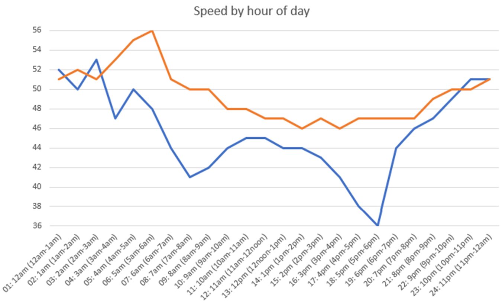
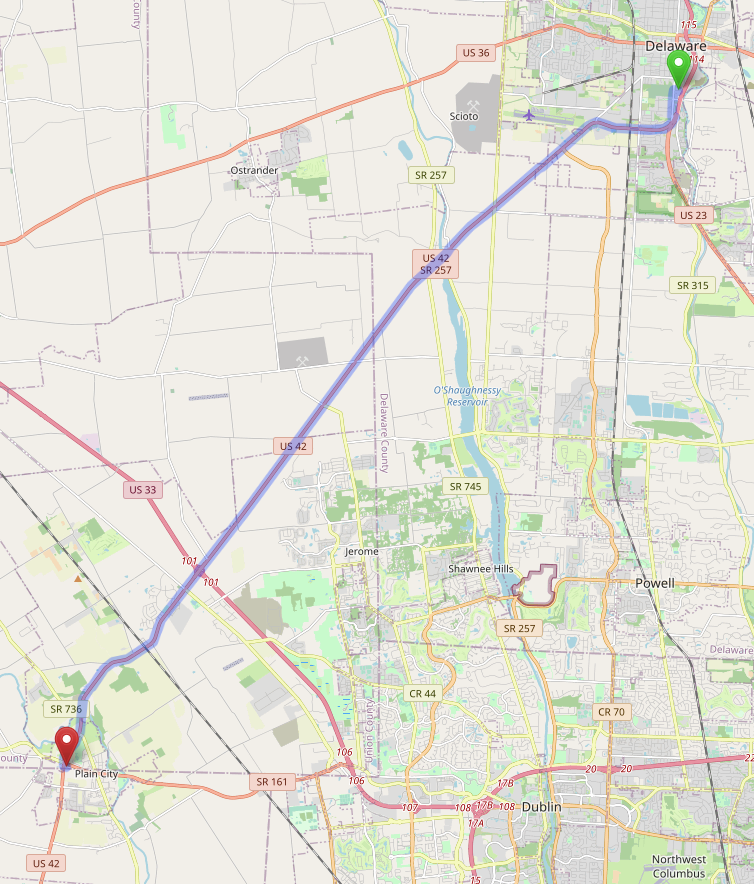
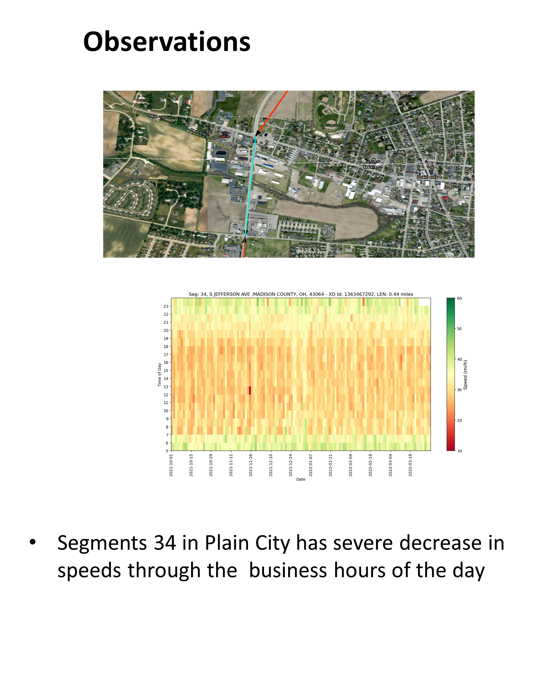
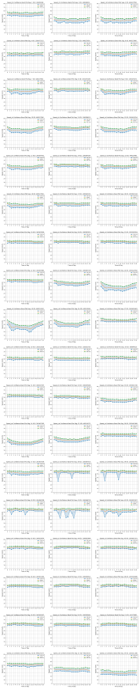

# Case Study: Ohio US-42 {#CaseStudyOH42}

## Route Description

The stretch of US-42 examined for level of service and/or reliability connects the cities of [Delaware](https://www.google.com/maps/place/40%C2%B017'54.6%22N+83%C2%B004'00.5%22W/@40.2985073,-83.0693663,17z/data=!3m1!4b1!4m4!3m3!8m2!3d40.2985032!4d-83.0667914?entry=ttu) and [London](https://www.google.com/maps/place/39%C2%B053'11.8%22N+83%C2%B026'52.1%22W/@39.8866002,-83.4503831,17z/data=!3m1!4b1!4m4!3m3!8m2!3d39.8865961!4d-83.4478082?entry=ttu). The route is shown in Figure \@ref(fig:US42RouteMap), as well as the [linked online map](https://www.openstreetmap.org/directions?engine=fossgis_osrm_car&route=40.2870%2C-83.0672%3B39.9082%2C-83.4341#map=11/40.0962/-83.2506). It is approximately 35 miles in length.

```{r US42RouteMap, echo=FALSE, fig.cap='Ohio US-42 Route Boundaries. Source: Map data from [©OpenStreetMap](https://www.openstreetmap.org/copyright)',out.width="60%", fig.align='center'}
knitr::include_graphics("./Images/CaseStudyUS42/US-42a.png")
```

This route serves a significant percentage of a variety of trip purposes--commuter, recreational, freight, and traffic bypassing the Columbus area. A general snapshot of daily traffic demands along this route, measured near the [Scioto River bridge crossing](https://www.google.com/maps/place/40%C2%B014'39.5%22N+83%C2%B008'49.5%22W/@40.2443174,-83.1496494,17z/data=!3m1!4b1!4m4!3m3!8m2!3d40.2443133!4d-83.1470745?entry=ttu), is shown in Figure \@ref(fig:US42DailyTraffic). The blue line corresponds to weekday traffic and the orange line corresponds to weekend traffic. The weekday traffic exhibits a bi-modal pattern for the morning and evening peak hours, demonstrating the influence of commuter traffic. A snapshot of the daily travel speeds at this location is shown in Figure \@ref(fig:US42DailySpeed). Again, the bi-modal peaking (inverse of demand) of speeds is seen for the weekday traffic.

```{r US42DailyTraffic, echo=FALSE, fig.cap='Ohio US-42 Route Daily Traffic Demands',out.width="60%", fig.align='center'}
knitr::include_graphics("./Images/CaseStudyUS42/DailyTraffic.png")
```

```{r US42DailySpeed, echo=FALSE, fig.cap='Ohio US-42 Route Daily Travel Speeds',out.width="60%", fig.align='center'}

```

## Level of service

The level of service analysis focuses on the section of US-42 that runs from [Delaware](https://www.google.com/maps/place/40%C2%B017'54.6%22N+83%C2%B004'00.5%22W/@40.2985073,-83.0693663,17z/data=!3m1!4b1!4m4!3m3!8m2!3d40.2985032!4d-83.0667914?entry=ttu) to [Plain City](https://www.google.com/maps/place/40%C2%B006'27.1%22N+83%C2%B016'01.1%22W/@40.1075232,-83.269553,17z/data=!3m1!4b1!4m4!3m3!8m2!3d40.1075191!4d-83.2669781?entry=ttu), in the southwest direction of travel. This section of highway is approximately 17 miles in length. The route is shown in Figure \@ref(fig:US42RouteMap2), as well as the [linked online map](https://www.openstreetmap.org/directions?engine=fossgis_osrm_car&route=40.2870%2C-83.0672%3B40.1097%2C-83.2776#map=12/40.2079/-83.1341).

```{r US42RouteMap2, echo=FALSE, fig.cap='Ohio US-42 Study Route Boundaries. Source: Map data from [©OpenStreetMap](https://www.openstreetmap.org/copyright)',out.width="60%", fig.align='center'}

```

### Segmentation {-}

This route consists of sections of two-lane highway, with passing constrained and passing zone segments, and 11 signalized intersections. The signalized intersections are isolated, except for two of the intersections that are part of an interchange connection to US-33. 

```{r OhioUS42throughInterchange, echo=FALSE, fig.cap='US-42. Source: Map data ©2022 Google',out.width="40%", fig.align='center'}
knitr::include_graphics("./Images/CaseStudyUS42/OhioUS42throughInterchange.png")
```

The supporting information for the segmentation process is included in the KML file "Ohio-US-42W.kml" (see the project resources archive (https://github.com/NCHRP-08-135/Resources)).

There was no significant horizontal or vertical curvature along this route; thus, these elements did not factor into the segmentation process. The segmentation, therefore, was a function of passing markings, posted speed limits, and intersection locations.

With respect to the intersection locations, this route includes many examples of the situation discussed in Section \@IntxInfluenceArea in which the adjusted length for segments immediately upstream or downstream of the intersection have a negative value.

More specifically, for intersection locations along this route, there is always a distance of at least a few hundred feet upstream and downstream marked for no passing. For intersection locations where the no-passing restriction connects directly to an extended distance of no-passing; that is, a length of roadway that would be classified as a passing constrained segment, the intersection segment boundaries should set according to the geometric area guidelines provided in Chapter 2. When a relatively short distance of passing constrained connects to a passing zone segment, either upstream or downstream, that passing constrained distance should be used as the geometric area distance for the intersection.

The intersection locations where short upstream and/or downstream distances of passing constrained were included as part of the intersection segment are as follows:

- London Rd (downstream)
- S Section Line Rd (upstream and downstream)
- Riverside Dr/Klondike Rd (downstream)
- Dublin Rd (downstream)

Other unique route configuration issues and the resulting segmentation are as follows:

- The combination of the downstream influence area for the signalized intersection at Riverside Dr/Klondike Rd and the upstream influence area for the signalized intersection at Dublin Rd results in a very short length of road (< 50 ft) in between the influence area distances. Thus, these two signalized intersections are set up as consecutive segments and the total distance between is split between the two intersections. 
- Between the signalized intersections at Dublin Rd and Watkins Rd are 1.46 miles of passing allowed, 647 ft of no passing, 800 ft of passing allowed, and 325 ft of no passing. The 800 feet of roadway marked as passing allowed is too short to be very effective as a passing zone, especially because it is in close proximity to a downstream signalized intersection (Watkins Rd). The upstream influence area of the Watkins Rd intersection segment will also extend into the passing zone. Thus, these three stretches of roadway (647 ft, 800 ft, and 325 ft) are combined and included as part of the Watkins Rd signalized intersection segment.
- The signalized intersections at the [US-33 interchange](https://www.google.com/maps/place/40%C2%B009'40.0%22N+83%C2%B013'53.9%22W/@40.1611002,-83.2338141,17z/data=!3m1!4b1!4m5!3m4!1s0x0:0xa36325f6064e0f72!8m2!3d40.1611002!4d-83.2316254) and the signalized intersection at Industrial Pkwy to the southwest are spaced relatively closely and have overlapping influence areas. Thus, they are set up as consecutive signalized intersection segments.
- Just south of the signalized intersection at industrial parkway is a passing zone of only 850 ft. Again, this distance is too short to be very effective as a passing zone. Thus, this stretch of roadway is combined with the connecting upstream and downstream stretches of passing constrained roadway to make a single passing constrained segment.
- Just south of the signalized intersection at W Main St is a passing zone of only 711 ft. This stretch of roadway is combined with the connecting upstream and downstream stretches of passing constrained roadway to make a single passing constrained segment between the signalized intersections at W Main St and West Ave.


The final segmentation is shown in Table \@ref(tab:SegmentationUS42). The total length is 17.426 mi.


```{r SegmentationUS42, echo=FALSE}

Filename <- "./DataTables/CaseStudyOH42Table1.csv"
HighwayData <- read.csv(file = Filename, header = TRUE)

ColumnLabels <- c("Seg ID","From/To","Hwy Seg Type","Two-Lane Seg Type","# Dir Lanes","Length (ft)","Length (mi)","Terrain","Vertical Align Class","Posted Speed (mi/h)")

knitr::kable(
  HighwayData,
  col.names = ColumnLabels,
  booktabs = TRUE,
  caption = 'Final Segmentation for Tennessee SR-109 Study Route') %>%
  row_spec(0, angle = TableColumnHeaderTextAngle) %>%
  kable_styling(latex_options = "scale_down") %>%
  scroll_box(width = "100%", box_css = "border: 0px;")
```


### Traffic Data {-}

Traffic data were obtained from the Ohio Department of Transportation (ODOT) [Transportation Data Management System](https://odot.public.ms2soft.com/tcds).

There are 11 sensor locations along the route limits for the LOS analysis, as summarized in Table \@ref(tab:US42Sensors). Note that sensors are listed in order of northern most to southern most location along the route.

Table: (\#tab:US42Sensors) US-42 Sensor Locations

**Location ID**|**Approx. Location**|**Sensor Type**|**Measurements Taken**
:-----:|:-----:|:-----:
4621|40°16'41.42"N, 83° 4'11.34"W|Tube Class|Volume, Speed, Classification
4421|40°16'29.02"N, 83° 6'8.96"W|Tube Class|Volume, Speed, Classification
4321|40°14'46.40"N, 83° 8'41.25"W|Tube Class|Volume, Speed, Classification
11321|40°14'33.23"N, 83° 8'56.74"W|Tube Class|Volume, Speed, Classification
4221|40°14'19.14"N, 83° 9'17.13"W|Tube Class|Volume, Speed, Classification
17980|40°11'31.98"N, 83°12'3.32"W|Permanent|Volume, Speed, Classification, Weigh-in-Motion
5780|40°10'8.12"N, 83°13'24.84"W|Tube Class|Volume, Speed, Classification
5680|40° 9'7.16"N, 83°14'26.64"W|Tube Class|Volume, Speed, Classification
15180|40° 7'18.00"N, 83°16'19.71"W|Tube Class|Volume, Speed, Classification
14780|40° 6'51.24"N, 83°16'35.08"W|Tube Class|Volume, Speed, Classification
5380|40° 6'33.67"N, 83°16'41.66"W|Tube Class|Volume, Speed, Classification


Table \@ref(tab:OhioUS42TrafficAADT) summarizes the most recently available values for annual average daily traffic (AADT), percentage of traffic volume occurring in the peak hour of the day (*K*), and percentage of traffic volume traveling in the peak direction of the peak hour (*D*). The values shown in this table are for the most recent years for which actual field measurements were taken, not values estimated from growth projections.

Table: (\#tab:OhioUS42TrafficAADT) US-42 Sensor Traffic Count Data Summary

**Location ID**|**Year**|**K (%)**|**D (%)**|**AADT (veh/day)**
:------|:-----:|:-----:|:-----:|------:
4621|2020|9|64|13,280
4421|2021|9|55|11,666
4321|2021|10|57|11,924
11321|2021|10|52|11,490
4221|2021|10|58|10,071
17980|2021|10|60|10,443
5780|2021|10|56|12,549
5680|2021|9|55|8,656
15180|2021|10|52|9,814
14780|2021|10|54|8,174
5380|2021|10|56|11,558


The PM peak hour volumes generally occurred between the hours of 4-6 PM, with the highest hour typically being 5-6 PM. Again, the values shown are generally based on the most recent field measurements. If multiple measurements were taken during a given year, common dates across detectors were selected if possible. For example, if one sensor had counts taken during May and September of a given year and another sensor had counts taken during just May of the same year, the counts for May would be selected for both sensors. Furthermore, if multiple days of data were available in the same month of the same year, the same day of the week would be chosen across the sensors if possible.

The PHF values range from approximately 0.80-0.94. Because specific traffic peaking times will likely vary over a route of this length, as well as to not over complicate the process of 'conserving' vehicles throughout the full length of the route when setting traffic demand values, a single PHF value is used. For this analysis, an approximate mid-range value of 0.88 is used. Consequently, this value effectively increases the demand flow rate for analysis purposes by 14%. The original PM peak hour analysis direction volumes and corresponding values as adjusted by the PHF (rounded to the nearest 50 veh) are shown in Table \@ref(tab:US42TrafficHourlyVolumes). The PHF values are then set to a value of 1.0 in the input data settings.

For two-lane highway segments, the opposing direction volume is needed. The *D* factor value for each of the detectors, as shown in Table \@ref(tab:OhioUS42TrafficAADT), and the adjusted analysis direction hourly volumes were used to set the opposing direction volume for the PM peak hour (rounded to the nearest 50 veh). These values are also shown in Table \@ref(tab:US42TrafficHourlyVolumes).


Table: (\#tab:US42TrafficHourlyVolumes) SR-109 Sensor Data -- Southbound PM Peak Directional (Dir) and Opposing (Opp) Hourly Volumes

**Location ID:**|**Count Date**|**Dir. Hourly Volume (veh/h)**|**Dir. Adjusted Hourly Volume (veh/h)**|**Opp. Adjusted Hourly Volume (veh/h)**
:------|:-----:|:-----:|:-----:|
4621 |Thur 8/25/2021|449|500|300
4421 |Wed 8/11/2021 |413|450|400
4321 |Thur 8/12/2021|490|550|400
11321|Thur 8/12/2021|547|600|550
4221 |Thur 8/12/2021|412|450|350
17980|Wed 8/11/2021 |379|450|300
5780 |Wed 10/27/2021|473|550|400
5680 |Thur 7/8/2021 |400|450|350
15180|Thur 7/8/2021 |518|600|550
14780|Thur 7/8/2021 |390|450|400
5380 |Thur 7/8/2021 |641|750|550

* Opposing direction volume = peak direction volume / D (decimal) -  peak direction volume

With a total of 11 sensor locations spatially distributed across 35 miles of highway, determining locations to affect volume changes along the route is a very approximate process. To inform this process, satellite photography of the route and its surrounding area was reviewed. More major intersecting roadways--indicated by number of lanes, turning movement accommodation from the major roadway, and/or density of land use accessed by intersecting road within immediate area--were typically chosen as the locations to implement the volume changes.


The assignment of volumes to segments, and locations where volume changes are implemented are as follows:

- Sensor 4621 is located within Segment 1. Its volume of 500 veh/h is applied to Segment 1. Opposing direction volume is 300 veh/h.
- Sensor 4421 is located within Segment 4. There is a net volume decrease of 50 veh/h at this sensor. This net volume change of -50 is implemented by assuming a net volume change of -50 veh/h at the intersection with London Rd (Segment 2).
  - Analysis direction volume in Segment 2 is 500 veh/h. Opposing direction volume is 300 veh/h.
  - Analysis direction volume in Segment 3 is 450 veh/h. Opposing direction volume is 350 veh/h.
  - Analysis direction volume in Segment 4 is 450 veh/h. Opposing direction volume is 350 veh/h.
- Sensor 4321 is located within Segment 10. There is a net volume increase of 100 veh/h at this sensor. This net volume change of +100 is implemented by assuming a net volume change of +50 veh/h at the intersection with Sawmill Pkwy (Segment 5) and a net volume change of +50 veh/h at the intersection with S Section Line Rd (Segment 8).
  - Analysis direction volume in Segment 5 is 450 veh/h. Opposing direction volume is 350 veh/h.
  - Analysis direction volume in Segment 6 is 500 veh/h. Opposing direction volume is 400 veh/h.
  - Analysis direction volume in Segment 7 is 500 veh/h. Opposing direction volume is 400 veh/h.
  - Analysis direction volume in Segment 8 is 500 veh/h. Opposing direction volume is 400 veh/h.
  - Analysis direction volume in Segment 9 is 550 veh/h. Opposing direction volume is 400 veh/h.
  - Analysis direction volume in Segment 10 is 550 veh/h. Opposing direction volume is 400 veh/h.
- Sensor 11321 is located within Segment 10. There is a net volume increase of 50 veh/h at this sensor. This net volume change of +50 is implemented by assuming a net volume change of +50 veh/h at the intersection with Riverside Dr/Klondike Rd (Segment 10). Note that the volume of 550 given previously for Segment 10 is the volume entering the intersection of Riverside Dr/Klondike Rd. The volume given below for segment 10 is the volume exiting the intersection.
  - Analysis direction volume in Segment 10 is 600 veh/h. Opposing direction volume is 550 veh/h.
- Sensor 4221 is located within Segment 11. There is a net volume decrease of 150 veh/h at this sensor. This net volume change of -150 is implemented by assuming a net volume change of -150 veh/h at the intersection with Dublin Rd (Segment 11).
  - Analysis direction volume in Segment 11 is 450 veh/h. Opposing direction volume is 350 veh/h.
- Sensor 17980 is located within Segment 16. There is no net change in volume at this sensor.
  - Analysis direction volume in Segments 12-16 is 450 veh/h. Opposing direction volume is 300 veh/h.
- Sensor 5780 is located within Segment 18. There is a net volume increase of 100 veh/h at this sensor. This net volume change of +100 is implemented by assuming a net volume change of +100 veh/h at the unsignalized intersection with with CR-17/Wells Rd that connects to Segment 17.
  - Analysis direction volume in Segment 17 is 550 veh/h. Opposing direction volume is 450 veh/h.
  - Analysis direction volume in Segment 18 is 550 veh/h. Opposing direction volume is 450 veh/h.
- Sensor 5680 is located within Segment 23. There is a net volume decrease of 100 veh/h at this sensor. This net volume change of -100 is implemented by assuming a net volume change of +50 veh/h at the intersection with US-33W (Segment 20) and a net volume change of -150 veh/h at the intersection with US-33E (Segment 21). Ramp volume data at the US-33 interchange indicates higher volumes for the NB off-ramp and SB on-ramp than for the NB on-ramp and SB off-ramp. Thus, the increase in volume at the US-33W intersection (NB off-ramp) and decrease in volume at the US-33E intersection (SB on-ramp).
  - Analysis direction volume in Segment 19 is 550 veh/h. Opposing direction volume is 450 veh/h.
  - Analysis direction volume in Segment 20 is 600 veh/h. Opposing direction volume is 500 veh/h.
  - Analysis direction volume in Segment 21 is 600 veh/h. Opposing direction volume is 500 veh/h.
  - Analysis direction volume in Segment 22 is 450 veh/h. Opposing direction volume is 350 veh/h.
  - For the analysis direction volume in Segment 23, see the following section.
- Sensor 15180 is located within Segment 26. There is a net volume increase of 150 veh/h at this sensor. The volume change happens downstream of the signalized intersection at Industrial Parkway. However, there are just a few minor intersecting roadways with this segment; thus, it was decided to implement the volume change at the signalized intersection with Industrial Pkwy and not split Segment 23 into multiple segments at the minor intersections.
  - Analysis direction volume in Segment 23 is 600 veh/h. Opposing direction volume is 550 veh/h.
  - Analysis direction volume in Segment 24 is 600 veh/h. Opposing direction volume is 550 veh/h.
  - Analysis direction volume in Segment 25 is 600 veh/h. Opposing direction volume is 550 veh/h.
- Sensor 14780 is located within Segment 26. There is a net volume decrease of 150 veh/h at this sensor. However, this detector is in the same segment as the previous detector and there are just a couple of very minor intersecting roadways between the two detectors. In this case, it was decided to assume the same volume at this detector as the upstream detector in the same segment.
  - Analysis direction volume in Segment 26 is 600 veh/h. Opposing direction volume is 550 veh/h.
- Sensor 5380 is located within Segment 28. There is a net volume increase of 150 veh/h at this sensor. This net volume change of +150 is implemented by assuming a net volume change of +150 veh/h at the intersection with W Main St (Segment 27)
  - Analysis direction volume in Segment 27 is 600 veh/h. Opposing direction volume is 550 veh/h.
  - Analysis direction volume in Segment 28 is 750 veh/h. Opposing direction volume is 600 veh/h.
  
- Analysis direction volume in Segment 29 is 750 veh/h. Opposing direction volume is 600 veh/h.


Vehicle classification data are available from all sensor locations. However, for sensor 17980 the vehicle are binned into three length categories. For this sensor location, the average of the upstream and downstream sensor truck percentage values are used. The truck percentages for the hour of 5:00-6:00 PM for the southwest-bound direction, rounded to the nearest integer value, and the segments to which they are applied, are given in Table \@ref(tab:US42TruckPercentages).

Table: (\#tab:US42TruckPercentages) US-42 Sensor Data -- PM Peak Hour Truck Percentages

**Location ID:**|**Date**|**Small Truck %**|**Large Truck %**|**Total Truck %**|**Applicable Segment(s)**
:------|:-----:|:-----:|:-----:|:-----:|:-----:
4621|8/25/2021|2|8|10|1-2
4421|8/11/2021|4|6|10|3-8
4321|8/12/2021|5|6|11|9-10
11321|8/12/2021|4|5|9|11
4221|8/12/2021|6|7|13|12-14
17980|NA|7|8|15|15-16
5780|10/27/21|8|8|16|17-22
5680|7/8/2021|4|3|7|23-27
15180|7/8/2021|5|2|7|Not applied (see volume discussion above)
14780|7/8/2021|6|2|8|Not applied (see volume discussion above)
5380|7/8/2021|4|2|6|28-29

Note that for all but the multilane highway segment type, only the total truck percentage is used in the corresponding segment analysis methodology calculations. For multilane highways, the separate percentages for small and large trucks are used when performing an analysis for a segment with a specific grade (i.e., explicit consideration of grade percentage and length of grade). For a segment that using the 'general terrain' classification (i.e., level, rolling), just the total truck percentage is utilized.


### Additional Data Inputs for Intersections {-}

**Signalized Intersections**

The intersection approach geometric configurations, for the analysis direction, are summarized in Table \@ref(tab:US42SignalApproachGeometry)

Table: (\#tab:US42SignalApproachGeometry) US-42 Signalized Intersections, Approach Geometry for Analysis Direction

**Intersection**|**Num Through Lanes**|**Left Turn Bay?**|**Right Turn Bay?**|**Major/Minor**|
:------|:-----:|:-----:|:-----:|:-----:|
London Rd|1|Yes|Yes|Major
Sawmill Pkwy|1|Yes|Yes|Major
S Section Line Rd|1|Yes|No|Minor
Riverside Dr/Klondike Rd|1|Yes|No|Minor
Dublin Rd|1|Yes|No|Minor
Watkins Rd|1|No|No|Minor
US-33W|2|No^|No|Major
US-33E|2^^|Yes|No^|Major
Industrial Pkwy|1|No|No|Minor
W Main St|1|Yes|Yes|Major
West Ave|1|Yes|No|Minor

^ LT movement not allowed at US-33W because the NB approach is an interchange off-ramp; RT movement not allowed at US-33E because the SB approach is an interchange off-ramp  
^^ About 300 ft downstream of the stop bar, the two through lanes merge into a single lane


Specific signal timing data were not available, so the following assumptions were made.

- Cycle length: 90 seconds (major); 60 seconds (minor)
- Effective green/cycle length ratio: 0.44 (major); 0.48 (minor)
- Arrival type: 4 (favorable progression) for intersection at US-33E interchange; 3 (random arrivals) for all others
- If a left turn bay is present, assume protected left-turn phasing

The following is assumed about turning movement volumes from US-42 onto cross streets:

- Minor intersections: 10% total (5% left, 5% right)
- Major intersections: 20% total (10% left, 10% right)
- If the intersection is not at a location where a net volume difference is implemented (according to information above), then it is assumed that a volume equal to the volume turning from the major roadway enters the major roadway from the cross street.


### Results {-}

The segment LOS results are shown in Tables \@ref(tab:OhioUS42LOSresults1) and \@ref(tab:OhioUS42LOSresults2).


```{r OhioUS42LOSresults1, echo=FALSE}

Filename <- "./DataTables/CaseStudyTN109Table8.csv"
HighwayData <- read.csv(file = Filename, header = TRUE)

ColumnLabels <- c("Seg ID","Hwy Seg Type","Two-Lane Seg Type","# Dir Lanes","Length (mi)","Eff. Len. Upstream (mi)","Eff. Len. Downstream (mi)","Adj. Length (mi)","Posted Speed (mi/h)","Dir Volume (veh/h)","Opp Volume (veh/h)","PHF","Dir Truck%","Analysis Flow Rate (veh/h/ln)","Analysis Flow Rate (pc/h/ln)","Vertical Align Class","FFS (mi/h)","Free-Flow Trav Time (s)","Avg Speed (mi/h)","Avg Travel Time (s)")

knitr::kable(
  HighwayData,
  col.names = ColumnLabels,
  booktabs = TRUE,
  caption = 'US-42 Segment LOS Analysis Results, Part 1') %>%
  row_spec(0, angle = TableColumnHeaderTextAngle) %>%
  kable_styling(latex_options = "scale_down") %>%
  scroll_box(width = "100%", box_css = "border: 0px;")
```


```{r OhioUS42LOSresults2, echo=FALSE}

Filename <- "./DataTables/CaseStudyTN109Table9.csv"
HighwayData2 <- read.csv(file = Filename, header = TRUE)

ColumnLabels2 <- c("Seg ID","% Followers","Density (pc/mi/ln)","Density (veh/mi/ln)","Follower Density (veh/mi/ln)","Adj. Follower Density (veh/mi/ln)","Avg. Thresh. Delay (s/veh)","Avg. Thresh. Delay (%)","Avg. FFS Delay (s/veh)","Avg. FFS Delay (%)","LOS","LOS Value","Demand/Capacity","Available Capacity (veh/h)","Momentum (vol x speed)","VMT","VHT","VHD")

knitr::kable(
  HighwayData2,
  col.names = ColumnLabels2,
  booktabs = TRUE,
  caption = 'US-42 Segment LOS Analysis Results, Part 2') %>%
  row_spec(0, angle = TableColumnHeaderTextAngle) %>%
  kable_styling(latex_options = "scale_down") %>%
  scroll_box(width = "100%", box_css = "border: 0px;")
```


The facility LOS results are shown in Table \@ref(tab:OhioUS42FacilityResults)

Table: (\#tab:OhioUS42FacilityResults) US-42 Facility Analysis Results

**Performance Measure**|**Value**
:-----|:-----:
Free Flow Travel Time (s)|1057.3
Avg. Travel Time (s)|1290.37
Avg. Speed (mi/h)|48.62
VMT (veh-mi)|8856.25
VHT (veh-h)|183.529
Delay (veh-h)|33.456
Avg. FFS Delay (s/veh)|233.1
Avg. FFS Delay (%)|22.0
Avg. Threshold Delay (s/veh)|170.65
Avg. Threshold Delay (%)|16.1
LOS Score (Weighted-Travel Time)|2.043
LOS Constancy|0.389
LOS Adjustment Factor|1.038
LOS Score (Weighted-Travel Time and Adjusted)|2.12
Maximum d/c|0.85


**Discussion**

The overall facility LOS, based on a score of 2.12, is C. The relatively low LOS Constancy value of 0.39 indicates that segment levels of service were largely consistent across the facility. Individual segment LOS values are mostly B and C. The two-lane highway passing zone segments are mostly LOS B. The two-lane highway passing constrained segments are mostly LOS C.

The facility average speed of 49 mi/h and free-flow speed delay of 22% are indicative of a small to medium impact of control delay experienced at the signalized intersections. This control delay ranges from approximately 13 to 26 s/veh across the 11 signalized intersections, which corresponds to LOS B and C (10-20 s/veh = LOS B, 20-35 s/veh = LOS C).

The intersection $d/c$ ratios mostly range from 0.4-0.6. The $d/c$ ratios of the last two intersections at W Main St and West Ave are in the 0.7-0.8 range because of the volume increase that comes from the US-33 interchange upstream. There are no significant bottleneck locations along this route for these 'typical' demand volume conditions.

According to the guidelines in the [Hot Spot Identification](#HotSpots) section, just the signalized intersection at West Ave is identified as a 'hot spot'. This is due to a threshold delay of 167%. The control delay for this intersection (the major street through movement in the southwest-bound direction) is 24 seconds, which is still moderate, and corresponds to LOS C. This intersection has the maximum $d/c$ value for the facility, at 0.85. The high threshold delay percentage, however, is largely due to the very short segment length. This intersection is the last segment of the facility, and as such, uses the downstream geometric distance, rather than the influence distance. This yields a segment length of just 0.133 mi (430 ft upstream distance (influence area) + 272 ft downstream distance (geometric area). For intersections where the influence areas both upstream and downstream comprise the segment length, the adjusted segment lengths will typically range from 0.4-0.6 mi. Thus, in this instance, the LOS and $d/c$ values are better indicators of whether this particular segment should be considered a hot spot.

Generally, operational conditions along this route for these demand volume conditions are good.

Two additional LOS analysis were performed, with increased demand volumes, to determine how the operational performance characteristics would change for the current highway configuration under the increased volume demands. The additional two demand volume conditions tested were 25% and 50% higher than the 'typical' demand volumes. Key facility performance metrics for the three demand volume scenarios are shown in Table \@ref(tab:OhioUS42MultipleVolumeFacilityResults).

Table: (\#tab:OhioUS42MultipleVolumeFacilityResults) US-42 Facility Analysis Results for Three Demand Volume Scenarios

**Facility Results**|**Typical**|**+25%**|**+50%**
:------|:-----:|:-----:|:-----:
Avg. Speed (mi/h)|48.6|45.4|39.2
Avg. FFS Delay (%)|22.0|30.8|51.3
Avg. Threshold Delay (%)|16.1|24.5|44.5
LOS Score|2.12|2.75|3.53
LOS|C|C|D


For the 25% demand volume increase scenario, segment LOS values are still mostly B and C, except for the two-lane highway segments in the latter part of the facility, where the LOS is D for segments 23-26 and LOS E for segment 28. With the 25% increase in volume, the speed reductions along the two-lane highway segments are minor, on the order of 0.5 mi/h. However, the percentage follower values increase approximately 6-7% across the segments. This generally results in a one letter grade reduction in LOS for the two-lane highway segments relative to the 'typical' volume conditions. The other intersection $d/c$ ratios range from 0.7-0.9, up from the range of 0.4-0.6 for the 'typical' demand volume scenario. Generally, operating conditions across the entire route would be considered reasonable. However, some improvement to passing opportunities in the southern portion of the route and minor upgrades to the signalized intersection geometries at the southern end of the route would provide LOS C or better for all segments within the facility.

For the 50% demand volume increase scenario, segment LOS values are mostly C and D. Many of the two-lane highway passing constrained segments are LOS D. To accommodate any higher demand volumes, some of these segments should be considered for upgrading, such as improving sight distance to be able to convert to a passing zone, or possibly consider a passing lane. The intersections at West Ave and W Main St are over capacity ($d/c$ = 1.27 and 1.07, respectively) and thus have LOS values of F. The intersection with Riverside Dr/Klondike Rd is very close to capacity ($d/c$ = 0.99). Several other intersection $d/c$ ratios are in 0.8-0.9 range. Thus, there are several intersection hot spots under this demand volume scenario, and would need to be considered for geometric upgrades to improve the facility LOS to C or better. 


## Reliability

The reliability analysis examines a 30-mile stretch of US-42 between the cities of Delaware and London in Ohio (see Figures \@ref(fig:US42reliabilityBounds) and \@ref(fig:Figure2)). For the analysis, the facility is divided into 54 segments with each segment measuring approximately between 0.3-0.9 miles in length. The facility runs through the small towns of New California and Plain City, Ohio. On a regional level, US-42 lies to the northwest of Columbus, OH.

https://www.google.com/maps/dir/40.28783,-83.06482/39.95476,+-83.37657/@40.1094087,-83.0789141,60731m/data=!3m1!1e3!4m7!4m6!1m0!1m3!2m2!1d-83.37657!2d39.95476!3e0

```{r US42reliabilityBounds, echo=FALSE, fig.cap='30-Mile OH-42 facility in Ohio. Source: Map data ©2022 Google',out.width="60%", fig.align='center'}
knitr::include_graphics("./Images/CaseStudyUS42/Reliability/US-42a.png")
```

```{r Figure2, echo=FALSE, fig.cap='Ohio US-42 route for reliability analysis. Source: Map data ©2022 Google',out.width="75%", fig.align='center'}
knitr::include_graphics("./Images/CaseStudyUS42/Reliability/Figure2.png")
```

The facility was evaluated using five data analysis and visualization techniques that convert the raw speed and travel time data into charts and graphics for analysis and interpretation. These methods are described in Section \@ref(ReliabilityMethods)).

### Speed Heatmaps {-}

Speed heatmaps of the entire corridor in the southbound direction (southbound speeds from October 2021 through March 2022) are shown in Figure \@ref(fig:SpeedsHeatMapUS42). Segments 1-24 show generally high (green) and consistent speeds (uniform color) in most of the segments. Segments 2 and 3 are around 35 mi/h as they are within the city limits of Delaware. Slowdowns can be seen in segments 23 and 24 and continue into segments 25 and 26. The majority of segments 25-48 also show high speeds except for a few segments (e.g., segments 25, 26, and 34). Segment 54 shows extreme slowdowns throughout the day and throughout the analysis period.

```{r SpeedsHeatMapUS42, echo=FALSE, fig.cap='Speed Heatmaps Segments 1-54',out.width="95%", fig.align='center'}

if (knitr::is_html_output() == TRUE){
  knitr::include_graphics("./Images/CaseStudyUS42/Reliability/Speed.png")
} else if (knitr::is_latex_output() == TRUE){
  knitr::include_graphics("./Images/CaseStudyUS42/Reliability/SpeedSmall.png")
}
```

Segments 24 and 25 in New California exhibit decreases in speed during the AM and PM peak hours and slightly after. Segment 24 is connected to ramp terminals which could be a reason for slowdowns. Figure \@ref(fig:Segments24-25) illustrates these segments.

```{r Segments24-25, echo=FALSE, fig.cap='Segments 24-25 exhibiting significant speed slowdowns',out.width="95%", fig.align='center'}
knitr::include_graphics("./Images/CaseStudyUS42/Reliability/Segments24-25.png")
```

Segment 34, which lies inside the village of Plain City, shows congestion throughout the period during daytime hours; there are a few commercial dwellings which could be a reason for the congestion experienced during daytime hours. Figure \@ref(fig:Segments34) shows the location of this segment within Plain City's commercial district.

```{r Segments34, echo=FALSE, fig.cap='Segment 34 exhibiting significant congestion',out.width="95%", fig.align='center'}

```

Segments 38 to 42 (see Figure \@ref(fig:Segments38to42)) shows consistent slowdowns during the AM and PM peak hours and additionally segment 41 displays slowdowns during the midday peak as well. These five segments run through farmlands and there is no apparent reason for the slowdowns, serving as a reminder that probe speed data can have noise in it.

```{r Segments38to42, echo=FALSE, fig.cap='Segments exhibiting significant speed slowdowns',out.width="95%", fig.align='center'}
knitr::include_graphics("./Images/CaseStudyUS42/Reliability/Segments38to42.png")
```

Segment 54 (see Figure \@ref(fig:Segment54)), an overpass above I-70 with both the ends of the segment connected to I-70 ramp terminals, exhibits regular slowdowns.

```{r Segment54, echo=FALSE, fig.cap='Segments exhibiting significant speed slowdowns',out.width="95%", fig.align='center'}
knitr::include_graphics("./Images/CaseStudyUS42/Reliability/Segment54.png")
```

### Speed Difference Heatmaps {-}

One of the obvious challenges in the speed heatmap graphics above is that segments with lower speed limits appear as more congested even when motorists are traveling near the speed limit. To overcome this visual bias, the team developed the speed difference heatmap graphic to normalize the speed by a reference speed for each individual segment. After several iterations, the team arrived at a reference speed of the 85th percentile speed of the individual segments, measured across all observations in the analysis period (i.e., October 2021 through March 2022). The 85th percentile speed is estimated to generally approximate the free-flow speed along a given segment. Thinking in terms of a 24-hour period, the 85th percentile speed corresponds roughly to the fourth-highest hourly speed; not the fastest, but still generally representative of free-flow time periods at night and early mornings. The team did not choose the highest speed (100th percentile speed), as that observation can be subject to outliers and can misrepresent performance on the facility if measured during periods of low sample size (i.e., few if any probe vehicles generating the probe data).

The speed difference heatmap consists of time-of-day on the y-axis and date on the x-axis, same as the speed heatmaps. The speed difference is calculated as the difference between the measured speed in any given time interval and the 85th percentile speed of the segment. The difference is then aggregated to the hour and denoted by the color scale. The team deliberately chose a different color scale from light blue (low speed difference, meaning speed is close to the reference or free-flow speed) to purple (high speed difference, meaning speed is much lower than the reference speed). Speed difference heatmaps of the entire corridor are shown in Figure \@ref(fig:SpeedDiffUS42).

In the regular speed heatmaps shown in Figure \@ref(fig:SpeedsHeatMapUS42), segments 2 and 3 show considerable slowdowns when compared to other segments, which at first glance might suggest congestion. But in the \@ref(fig:SpeedDiffUS42) speed difference heatmap, segments 2 and 3 do not show high variations from the speed limit—highlighting the advantage of normalizing the speeds by segment. This is also the case with segment 54. Alternatively, actual congestion in segments 24, 25, 34, and 38-42 in Figure \@ref(fig:SpeedsHeatMapUS42) are clearly reinforced by the speed difference charts.

In summary, the speed difference heatmap normalizes the charts relative to the estimated free-flow speed for the segment, making it much easier to visually infer periods of recurring and non-recurring congestion. In addition, the speed difference heat map shows periods of apparent unreliable travel during nighttime conditions. There is a potential bias here with low sample sizes on rural segments. For example, the low speeds could be due to a single (slow moving) truck being the only source of probe data, which then translates into a slow recorded speed. However, low sample size is expected to be less than an issue when a segment shows congestion for multiple time periods, which may then more likely be attributable to an incident, special event traffic, or severe weather event.

```{r SpeedDiffUS42, echo=FALSE, fig.cap='Speed Difference Heatmaps Segments 1-54',out.width="95%", fig.align='center'}

if (knitr::is_html_output() == TRUE){
  knitr::include_graphics("./Images/CaseStudyUS42/Reliability/SpeedDiff.png")
} else if (knitr::is_latex_output() == TRUE){
  knitr::include_graphics("./Images/CaseStudyUS42/Reliability/SpeedDiffSmall.png")
}
```

### Box-and-Whisker Speed Plots {-}

In the box-and-whisker weekly speed plots shown in Figure \@ref(fig:BoxWhiskerWeeklyAvgUS42), speed (mi/h) is shown on the x-axis and time (in weeks) is shown on y-axis. The chart uses box-and-whisker plots to provide a summary of the weekly speeds for the analysis period. 

```{r BoxWhiskerWeeklyAvgUS42, echo=FALSE, fig.cap='Box-and-Whisker Weekly Speed Averages Plot',out.width="95%", fig.align='center'}

if (knitr::is_html_output() == TRUE){
  knitr::include_graphics("./Images/CaseStudyUS42/Reliability/BoxWhiskerWeeklyAvg.png")
} else if (knitr::is_latex_output() == TRUE){
  knitr::include_graphics("./Images/CaseStudyUS42/Reliability/BoxWhiskerWeeklyAvgSmall.png")
}
```

As with any box-and-whisker plot, the speed values are less variable if the box is shorter and more variable if the box is wider. Using box-and-whisker charts, weekly speed drops or spikes can be identified and further investigated using other visualizing techniques discussed in other sections. For ease of understanding, each month’s data is color coded, which makes it easier to visually group and understand the data.

As mentioned in the previous section, a considerable speed difference was noted across the corridor on January 19, 2022. This is very notable in the box-and-whisker plot for the week of January 17, 2022, where the plot is wider compared to the other adjacent weeks throughout the corridor. Also, considerable speed variations were seen in the week of March 28, 2022, in segments 41 and 51. Previously mentioned segments (e.g., 24 and 25) also show high variability in speeds throughout the analysis period.

### Speed Confidence Band {-}

In the speed confidence band plots, time-of-day is shown on the x-axis and speed (mi/h) is shown on the y-axis. The speed band graphic visualizes three different speed metrics for each segment for each hour of the day: the 15th percentile, 50th percentile (median), and 85th percentile speeds. The underlying dataset is the entire observation period from October 2021 through March 2022. The speed confidence plots of the entire corridor are shown in Figure \@ref(fig:SpeedConfidenceBandsUS42).

```{r SpeedConfidenceBandsUS42, echo=FALSE, fig.cap='Speed Confidence Bands',out.width="95%", fig.align='center'}

if (knitr::is_html_output() == TRUE){
  knitr::include_graphics("./Images/CaseStudyUS42/Reliability/SpeedConfidenceBands.png")
} else if (knitr::is_latex_output() == TRUE){
  
}
```

The speed confidence bands highlight the reliability in speeds for different hours of the day. A ‘tight’ speed band with 15th, 50th, and 85th percentile speeds all closely together suggests a very reliable speed performance for that segment in the given analysis period. A wider speed band with 15th and 85th percentile further away from the median suggest less reliable performance. A speed band that generally drops in speed (but remains tight) suggests that the facility is “reliably congested”. This is evident in Segment 34, which shows the speed band dropping as the segment becomes congested, but the travel is never unreliable (i.e., it is consistently slow). Previously highlighted segments like 24-25 and 38-42 show high variability in speed during the AM and PM peak hours, hence highlighting its unreliability during peak hours.

### Travel Time Index {-}

A travel time index (TTI) plot is a cumulative plot of the distribution of normalized travel times over the analysis period with cumulative percentage on the y-axis and TTI on the x-axis. The TTI is calculated by dividing the actual travel time for a time period by the travel time at free flow speed. A TTI of 1.0 means travel occurred at the free-flow speed, while a TTI of 2.0 means travel occurred at one half of the free flow speed. 

As is typical, the 85th percentile speed was considered a suitable estimate for free flow speed. In terms of travel time, this is equivalent to the 15th percentile. Therefore, travel time index is calculated using Eq. \@ref(eq:TTIeq).

\begin{equation}
TTI = \frac{t_i}{t_{FFS}}
(\#eq:TTIeq)
\end{equation}

Where:  
$TTI =$ Travel Time Index  
$t_{i}=$ Segment travel time at the instant *i*, s  
$t_{FFS}=$ Segment travel time at free flow speed (15th percentile), s


The TTI plots for the entire corridor are shown in Figure \@ref(fig:TravelTimeIndexUS42). The general shape of the cumulative TTI distribution allows inference on the variability of travel times along the segment. A generally steep TTI distribution (e.g., segment 19) suggests a reliable segment, while a more spread-out or flat distribution (e.g., segment 24 or 25) suggests a less reliable segment. Because a cumulative TTI chart can provide so much information with a single line, it is well suited to before-after comparisons. For example, a TTI chart can be used to show the effect of adding truck passing lanes to a two-lane highway on its travel time reliability.

It is evident that segments 24, 25, 26, 34 and 54 have high travel time variations. This observation is consistent with the earlier charts and discussions.

```{r TravelTimeIndexUS42, echo=FALSE, fig.cap='Travel Time Index (TTI) Plots',out.width="95%", fig.align='center'}

if (knitr::is_html_output() == TRUE){
  knitr::include_graphics("./Images/CaseStudyUS42/Reliability/TTI.png")
} else if (knitr::is_latex_output() == TRUE){
  knitr::include_graphics("./Images/CaseStudyUS42/Reliability/TTISmall.png")
}
```

### Summary {-}

This case study presented a data-driven approach to explore travel time reliability on a rural highway in Ohio (i.e., US 42) as it traverses the small town of Plain City, a railroad crossing, an interstate freeway, and rural areas. Five different visualization techniques were used to derive insights from higher-resolution vehicular probe data from INRIX XD. Segments outside Plain City generally maintain free-flow speeds in the range of 50-60 mi/h. Through Plain City, daytime speeds are typically in the 35-45 mi/h range, with even lower speeds in the town's commercial district. The freeway interchange is also associated with slowdowns, particularly in the AM and PM peak periods.

In summary, the case study characterizes the diversity of long rural corridors and points to familiar "spot sources" of delay and unreliability—typically related to pockets of dense land use as well as intersecting facilities. Over the course of the analysis year (October 2021-March 2022), this corridor did not experience a major disruption such as a natural disaster or a spike in demand.
