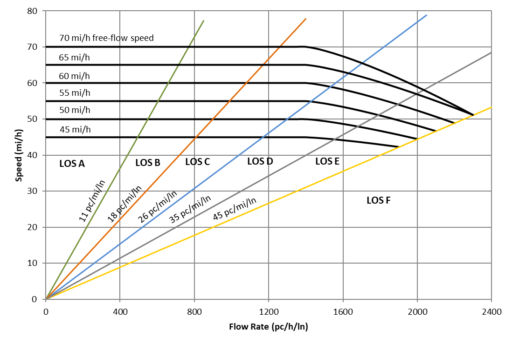
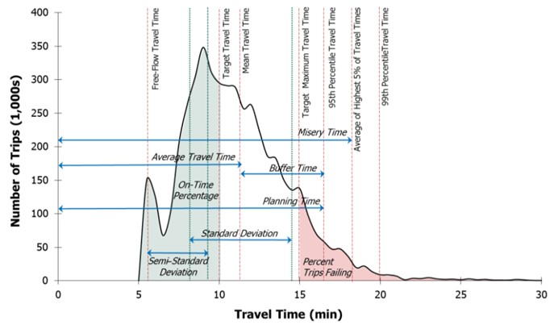

--- 
title: ""
subtitle: ""
author: ""
date: "`r Sys.Date()`"
site: bookdown::bookdown_site
output: bookdown::gitbook
documentclass: book
geometry: "left=2.5cm,right=2.5cm,top=2.5cm,bottom=2.5cm"
bibliography: [RefsOther.bib, RefsMitigation.bib, RefsBicycle.bib, packages.bib]
biblio-style: apalike
link-citations: yes
github-repo:
description: "This document provides guidance on applying the Highway Capacity Manual and probe vehicle data analysis methodologies to rural highways. Rural highways are comprised of contiguous segments of multilane highway, two-lane highways, intersections (signalized, roundabout, stop control), and arterials through rural towns."
version: 1.0
---

```{r setup, include=FALSE}
knitr::opts_chunk$set(echo = TRUE)
if("kableExtra" %in% rownames(installed.packages()) == FALSE) {install.packages("kableExtra")} 
library(kableExtra)

TableColumnHeaderTextAngle = 0
if (knitr::is_latex_output() == TRUE){
  TableColumnHeaderTextAngle = 90
}
```


<!-- Inline comment example -->
<!-- Multiline
     comment
     example -->

<!-- If outputing to PDF, comment the material between the dashed lines. This information is included in the PDFtemplate.tex file -->

<!-- ----------------------------------- -->

# {-}

:::: {.graybox data-latex=""}
::: {.center data-latex=""}
<h2 style="text-align: center;"><b>Guidebook for Quality of Service and Reliability Analyses of Rural Highways</h2>
:::
::::

<p></p>

<p style="text-align: center;"><b>Scott S. Washburn</b></br>University of Florida</p>

<p style="text-align: center;"><b>Ahmed Al-kaisy, Sajid Raza</b></br>Montana State University</p>

<p style="text-align: center;"><b>Ana Tsui Moreno</b></br>Technical University of Munich</p>

<p style="text-align: center;"><b>Bastian Schroeder, Jorge Barrios</b></br>Kittelson & Associates, Inc.</p>

<p></p>
<p></p>

<p style="text-align: center;"><b>CRP Staff</b></br>David Jared, Senior Program Officer</p>

**NCHRP Project 08-135 Panel**

**Name**|**Role**|**Organization**|
:-----:|:-----:|:-----:|
Michael Iacono|Chair|Minnesota DOT
Mei Chen|Member|University of Kentucky
Daniel Cook|Member|HDR
Marlene Vivian Delgadillo Canizares|Member|Georgia DOT
Philip Demosthenes|Member|Philip B. Demosthenes, LLC
Jeremy Jewkes|Member|Washington State DOT
Camden Palvino|Member|Delaware Valley Regional Planning Commission
Eugene Russell|Member|Kansas State University
Taylor Sisson|Member|Vermont Agency of Transportation
Chung Tran|FHWA Liaison|FHWA

**Acknowledgements**

The research team would like to thank the following individuals for their contributions to the successful completion of this project.

Brian Dunn, Oregon Department of Transportation (retired)  
Jessie Jones, Arkansas Department of Transportation  
Ryan Kenis, University of Florida graduate student  
Emily Dang, University of Florida undergraduate student  
Jonathan Crosby, University of Florida undergraduate student  
Santiago Linares-Ramirez, Technical University of Munich graduate student  
Yangqian Cai, Technical University of Munich graduate student
Azhagan Avr, Transportation Data Analyst, Kittelson & Associates, Inc.  
Dr. Nagui Rouphail, Kittelson & Associates, Inc.
Dr. Rick Dowling, Kittelson & Associates, Inc.

**Acronyms**

AASHTO - American Association of State Highway and Transportation Officials  
HCM - Highway Capacity Manual  
FHWA - Federal Highway Administration  
HCQSC - Highway Capacity and Quality and Service Committee  
NCHRP - National Cooperative Highway Research Program  
TRB - Transportation Research Board  
USDOT - United States Department of Transportation  

<!-- ----------------------------------- -->


```{r include=FALSE}
# automatically create a bib database for R packages
knitr::write_bib(c(.packages(), 'bookdown', 'knitr', 'rmarkdown'), 'packages.bib')
```


```{r eval=FALSE, include=FALSE}
install.packages("bookdown")
# or the development version
# devtools::install_github("rstudio/bookdown")
```


<!--chapter:end:index.Rmd-->

# (PART) Foundations {-}

# Introduction {#Chapter1Intro}

Rural highways account for a very significant portion of the national highway system and serve many vital mobility purposes, such as:

- connectivity between major urban areas,
- access to rural recreational areas (e.g., mountains, lakes, oceans),
- access to special events held in rural areas (e.g., concerts, regional festivals),
- evacuation route for extreme events (e.g., natural disasters), and
- diversion of traffic from another disrupted route.

Despite the importance of rural highways, infrastructure funding to improve operations is often more limited for them versus heavily-congested urban roadways. Thus, to ensure effective investment of such funding, it is essential for highway agencies to be able to identify locations of poor operations and consider appropriate mitigation measures. For this to be possible, an agency needs traffic analysis methods that allow them to examine short sections of highway (e.g., a passing zone, signalized intersection) not just individually, but also within the context of an extended length (many miles) of highway. 

Rural highways, which often span distances of 20-60 miles between urban areas, may consist of segments with a variety of cross-section elements (two-lane highway, multilane highway, passing lane sections) as well as intersections with different traffic controls (signal control, stop control, roundabouts with yield control). A sample of these component roadway configurations is shown in Figure \@ref(fig:RuralHwy3). These component roadway types are described in detail in [Chapter 2](#Chapter2LOS). These highways are usually more varied in horizontal and vertical alignment than urban roadways. The Highway Capacity Manual (HCM) [@HCM7], the standard reference for traffic analysis methodologies, contains analysis methods for all of the individual segments or intersections that may comprise a rural highway; however, it does not include a method, or guidance, for connecting the individual roadway segments into a connected, cohesive, facility-level analysis. It is important to continue to extend the capabilities of the HCM analysis methodologies, particularly at the facility-level, so that roadway design and traffic engineers have the analysis tools they need for performing accurate and comprehensive facility evaluations. Furthermore, analysis at the facility level is consistent with the fact that drivers typically evaluate the quality of their trip over its entire length, not just in separate segments.

## Purpose of Guidebook

This guidebook is intended to assist transportation agencies charged with monitoring, maintaining, and improving rural highways of regional or statewide importance. More specifically, it is intended to assist with the evaluation of rural highways in three areas:

- Motorized vehicle traffic operations per HCM analysis methods,
- Motorized vehicle traffic operations per probe vehicle data analysis methods, and
- Overview of alternative analysis methods, to the HCM, for bicycles and recommendations for future bicycle operations research needs.

With the heterogeneity of cross-section (i.e., roadway segment type) composition over such distances and the disparate HCM service measures (density, follower density, delay) across these segment types, the process for performing a HCM facility analysis across the variety of contiguous segments contained within a rural highway facility is not necessarily straightforward. This guidebook proposes an analysis framework for assessing the level of service (LOS) of automobiles on a long rural highway facility (20+ miles). In addition to level of service, several other facility-level performance measures are presented along with discussion about the analysis context in which such measures are useful for evaluating overall traffic operations along the route.

While simulation is always an option for analyzing a stretch of rural highways, the level of effort would be high for typical rural highway distances considered for analysis. In some situations, simulation may be warranted, but the methodology described in this Guidebook would still be a good first step and may even be completely sufficient. This methodology would also be much more efficient for performing 'what-if' scenario testing, where relative differences in results are the primary concern.

Reliability analyses on freeways and arterials are typically based on HCM guidance on scenario generation and predictive reliability. However, because of the typically limited data availability on rural highways, the reliability analysis in this report is focused on historical probe vehicle data and meant to be used in conjunction with the HCM automobile LOS methodology.

Demand for cycling in urban areas and on rural highways is on the increase; yet is not clear which analysis procedures are best suited to cover large rural highway facilities or statewide analyses. This guidebook summarizes existing HCM analysis methods used for the bicycle mode, as well as two popular alternatives, Level of Stress and Bicycle Compatibility Index. In addition, it proposes recommendations for future bicycle operations research needs based on two qualitative surveys.

This Guidebook is intended to serve as a companion to the HCM.

## Guidebook Scope and Limitations

The facility-level analysis is important in assessing current conditions along important corridors for people and goods movement. The analysis methodology is also useful for evaluating facility performance for situations where significant changes in traffic demand and/or capacity may occur, such as in the following scenarios:

- Evaluation of a rural highway route to handle potential evacuation traffic demand (e.g., forest fire, hurricane)
- Evaluation of a rural highway route to handle potential diversion traffic demand due to an alternative route being closed or restricted due to construction, an incident (e.g., truck rollover) or a natural disaster (e.g., landslide/avalanche, flooding)
- Evaluation of a rural highway route to handle short-term spikes in traffic demand due to recreational activities (e.g., weekend ski season, Labor Day weekend beach travel, concert/festival)
- Evaluation of a rural highway route to handle short-term spikes in traffic demand and/or heavy vehicles due to season-specific activities (e.g., crop harvesting in farming regions)
- Evaluation of a rural highway route to handle a large increase in traffic demand as projected to occur as part of construction of a large generator for the purpose of regional economic development (e.g., tribal casino, Amazon distribution warehouse).

The parameters of the scope for this project generally required that the developed LOS evaluation methodology make use of the existing analysis methodologies within the Highway Capacity Manual. However, to facilitate the development of a facility-level evaluation methodology, it was necessary to develop a few new computational procedures, largely for the purpose of connecting/stitching together component pieces of highway into a single facility for evaluation purposes. Furthermore, some planning-level simplifications, such as the classification of terrain and the treatment of signal progression along an arterial, were implemented. Such simplifications were included to 1) reduce the segmentation process effort and/or 2) reduce the complexity of the calculation process where the return on such precision is minimized for the relatively long lengths of rural highway.

This Guidebook also introduces a method for evaluating rural highway operations with the use of probe vehicle data. Over the last decade, the spatial and temporal coverage of probe vehicle data available from third-party vendors has improved immensely. Many state agencies now pay for subscriptions to providers of such data and are making use of the data to supplement their traditional data sources (e.g., fixed-point sensors) for assessing and managing traffic operations on their roadways.

These data generally consist of average travel times/speeds and correspond to a sample of the vehicles traveling along a given roadway segment; thus, an important limitation of this data source is that it does not include flow rate. To obtain flow rates, agencies may supplement the probe vehicle data with fixed-point sensors or by conducting field data collection using portable sensors on a regular basis. Another limitation of probe data is that their accuracy drops in low traffic conditions, such as late night or early morning, when fewer samples are available.

The spatial resolution of the probe data might also pose a challenge, particularly when analyzing very short segments. Probe data are typically reported for predefined segments of roadway--often referred to as traffic message channels (TMC). The TMCs' length usually ranges from approximately 0.6-2 miles, and the TMC boundaries do not necessarily match those used for other traffic analysis purposes, such as for segments as defined by the HCM. The temporal resolution of the measurements ranges from approximately 1-5 minutes. Currently, the quantity and quality of probe vehicle data are much greater for urban areas than for rural areas. This gap, however, will continue to narrow with time.

The automobile level of service methodology presented in this Guidebook is not intended to handle oversaturated traffic flow conditions. For multilane and two-lane highway segments, the HCM analysis methodologies do not include any mechanism to deal with traffic demand exceeding capacity. In some instances, short periods of demand exceeding capacity can be accounted for in the intersection analysis methodologies. The HCM should be consulted for further information on this topic. 

## Guidebook Organization

This guidebook is organized into three parts. 

***Part I***

The first part is focused on analysis methodology descriptions and consists of the following chapters:

- Chapter 1 - Introduction: This chapter provides an overview of the guidebook’s purpose, scope, and limitations. It also discusses the format of the guidebook and how the user community can contribute to the content. Further, the chapter provides a brief summary of the research behind this Guidebook.
- Chapter 2 - Rural Highway Level of Service for Automobiles: This chapter provides the methodology used to assess traffic operational quality and level of service for the automobile mode on rural highways.
- Chapter 3 - Automobile Travel Time Reliability: This chapter describes methods for quantifying travel time reliability, from a historical perspective, based on probe vehicle travel speed measurements.
- Chapter 4 - Bicycle Operations Analysis on Rural Highways: This chapter provides an overview of commonly used methods for assessing bicycle operations, recommendations for which methods are most appropriate for certain bicycle analysis situations, and recommendations for enhancements to the commonly used analysis methods.

***Part II***

The second part provides an overview of the component Highway Capacity Manual (HCM) analysis methodologies that are incorporated in the rural highway analysis methodology for automobiles. This chapter does not replicate the full content of the relevant HCM analysis methodologies, but rather summarizes the chapters and sections that are utilized within the rural highway analysis methodology. This material will be updated as necessary to reflect updates to the HCM.

***Part III***

The third part is focused on case studies using real-world routes to demonstrate the analysis methodologies in the Guidebook. This material is contained in a separate part of the document to facilitate the inclusion of additional case studies more easily in the future.

## Guidebook Format

This Guidebook was developed using Bookdown [@R-bookdown]. It is a robust and dynamic format that combines the advantages of HyperText Markup Language (HTML) and GitHub (https://github.com/). This publishing model has become possible due to relatively recent digital technology developments and is becoming increasingly popular.

This electronic format offers advantages over a printed format (e.g., search capabilities, ability to quickly move from location to another with hyperlinks), and furthermore, the HTML implementation provides advantages over a PDF electronic format. For example, the HTML format is not constrained to a linear presentation of the material, nor is it restricted to a conventional printed page size. Note that because content (text, figures, tables, etc.) is presented in a continuous format for a given table of contents entry (e.g., Chapter 1), page numbering is not applicable. 

Hosting the Guidebook on GitHub will facilitate more interaction with the user community (errata updates, potential additions, etc.) and the ability to revise the document quickly and easily. The Bookdown implementation does also provide the capability to create a PDF document. More information about Bookdown can be found at https://pkgs.rstudio.com/bookdown/ and https://github.com/rstudio/bookdown.

When updates to the Guidebook are made, the user can view a record of such updates through GitHub 'Actions' (include URL)

### Navigating the document

Several features are provided in the Guidebook to facilitate navigating the document. These features are primarily contained within the toolbar at the top of the page and the sidebar panel on the left side of the page.

***Top Toolbar***

The "hamburger" menu icon toggles the display of the sidebar (table of contents). The hourglass icon toggles a search textbook, which will appear in the upper-left corner of the page. This will locate the search term throughout the entire Guidebook. The standard CTRL+F function can be used to search for text within the active page; for example, a chapter or appendix page. The letter 'A' icon provides options for adjusting font size and style and changing the color theme.

Edit icon: This opens up the source for the page on Github. It is not currently active.

Download icon: This provides options for downloading a PDF or EPub version of the Guidebook. It is not currently active.

Information icon: Shows keyboard shortcuts that can be used to navigate the document.

***Sidebar***

The sidebar contains the table of contents.

From https://bookdown.org/yihui/bookdown/html.html
"The first- and second-level headings appear in the current chapter’s sidebar, which sticks to the top of the page as you scroll down. When a section is navigated to, third-level subheadings like “A subsection” will auto-expand."

If an item in the table of contents is truncated because the text is too wide, you can hover the cursor over it to see a tooltip showing the full text.

By default, only first- and second-level headings are displayed. If you click on a second-level heading with the cursor, it will expand and display any third-level headings if they are present. Clicking the second-level heading again will hide the third-level headings.

### How to provide feedback on this document {#ProvidingFeedback}

The preferred mechanism for submitting feedback is to submit an 'Issue' to the Guidebook source material site. From the [Issues Page](https://github.com/NCHRP-08-135/Guidebook/issues), press the 'New issue' button. This method does require that you have a GitHub account. If you do not have one, you can create one for free at [GitHub Signup](https://github.com/signup).

Alternatively, if you do not wish to create a GitHub account or are unable to, you can send an Email to [Dr. Scott Washburn](mailto:swash@ce.ufl.edu) and/or [Dr. Ana Moreno](mailto:ana.moreno@tum.de) to report the issue. 

With either method of providing feedback, please be as specific, yet concise, as possible in your description/discussion.


## Supporting Resources and Tools {#SupportingResources}

Several complimentary resources are provided with this Guidebook.

*LOS calculation software and case study input files*
The level of service calculation methodology described in this Guidebook is available in the software tool HCM-CALC. This program can be downloaded from https://github.com/swash17/HCM-CALC. [The Computational Engine chapter](#CompEngine) also provides an overview of the software tool. Input data files for the case studies for the HCM-CALC software are also available.

*Scripting code/tools for 'reliability' calculations/output*
Scripts, written in Python programming code^[https://www.python.org/about/], to process probe vehicle data and produce a variety of visualizations are provided. More information is provided in [Chapter 3](#Chapter3Reliability).

*KML files for case studies*  
For each of the case studies, supporting information for the segmentation process is included in a KML file^[A Keyhole Markup Language (KML) file contains geographic and supporting data for use with geographic software visualization tools. More information can be found at https://en.wikipedia.org/wiki/Keyhole_Markup_Language]. Detailed information about the KML files is provided in the introduction to [Part 3: Case Studies](#CaseStudyIntro). 


More information about these resources is contained in the [Introduction to Case Studies chapter](#CaseStudyIntro).

This guidebook was developed through NCHRP Project 08-135: Reliability and Quality of Service Evaluation Methods for Rural Highways. A final report was also produced for this project @NCHRP-Project-08-135. That report contains additional details about the development of the material contained in this Guidebook.


```{r RuralHwy1, echo=FALSE,out.width="40%", fig.show="hold"}
knitr::include_graphics("./Images/MultilaneHwy.jpg")
knitr::include_graphics("./Images/TwoLanePassingLaneFL40.png")
```

```{r RuralHwy2, echo=FALSE,out.width="40%", fig.show="hold"}
knitr::include_graphics("./Images/TwoLanePassZone.jpg")

```

```{r RuralHwy3, echo=FALSE, fig.cap='A Sample of Rural Highway Component Roadway Configurations', out.width="40%", fig.show="hold"}
knitr::include_graphics("./Images/RuralHwySignal.jpg")
knitr::include_graphics("./Images/RuralHwyUnsignal.jpg")
```

<!--chapter:end:01-Introduction.Rmd-->

# Rural Highway Level of Service for Automobiles {#Chapter2LOS}

## Introduction {#LOSIntro}

This chapter describes the methodology to perform a traffic operations and level of service analysis, for the automobile mode on rural highways. This analysis methodology relies on the existing analysis methodologies in the Highway Capacity Manual (HCM). Specifically, it utilizes analysis methods for the following roadway types, all of which may be contained within a rural highway route:

- Multilane Highways
- Two-lane Highways
- Urban Streets
- Signalized Intersections
- All-way Stop Control (AWSC) Intersections
- Roundabout Intersections

Part 2 of the Guidebook provides an overview of these analysis methods. Chapters 6-12 of this section of the Guidebook are not intended to duplicate in full the analysis methodology material provided in the HCM, but rather to provide a concise summary of the applicable equations, exhibits, and nomenclature for each analysis methodology utilized in the rural highway LOS methodology. 

Because of the relatively long distances involved in a rural highway analysis and the corresponding volume of calculations, it is necessary to implement some simplifying assumptions into the analysis methodology. If the HCM contains alternative calculation procedures, such as those intended for planning and preliminary engineering applications, they are utilized in this methodology as appropriate. There are a few additional situations for which analysis simplifications are proposed for this methodology that are not currently addressed by the HCM. These simplifications are discussed further in this chapter and are clearly identified in the material in [Part 2](#HCMmethodsIntro).

It should be noted that the analysis methodology is direction specific. That is, results are specific to a single direction. For some roadway configurations, information about other directions of travel (traffic, roadway, control) may be needed to determine the operational quality for the analysis direction of travel. For example, for a two-lane highway passing zone, it is necessary to know the traffic volume in the opposing direction. Likewise, for intersections, such as roundabouts and all-way stop controlled, traffic operations on a given approach are affected by traffic demands and lane configurations on other approaches.

The remainder of this chapter describes:

- the process used to divide a rural highway into its component segments
- the calculation of segment and facility performance measures and LOS
- alternative performance measures that can be used to assess facility operational quality

## Facility Segmentation {#Segmentation}

A critical step in a facility-level analysis framework is facility segmentation; that is, dividing the facility in question into its basic components of segments and junctions. First, a description of the applicable roadway types for a rural highway analysis is provided.

***Multilane Highway Segments***

HCM Page 12-4: "*Multilane highways generally have four to six lanes (in both directions) and posted speed limits between 40 and 55 mi/h. In some states, speed limits of 60 or 65 mi/h or higher are used on some multilane highways. These highways may be undivided (with only a centerline separating the directions of flow) or divided (with a physical median separating the directions of flow), or may have a two-way left-turn lane (TWLTL). They are typically located in suburban areas, leading into city centers, and along high-volume rural corridors, connecting two cities or activity centers that generate a substantial number of daily trips.*"

HCM Page 12-5: "*Uninterrupted flow on multilane highways is similar to that on basic freeway segments. However, there are several important differences. Because side frictions are present in varying degrees from uncontrolled driveways and intersections, as well as from opposing flows on undivided cross-sections, speeds on multilane highways tend to be lower than those on similar basic freeway segments. The basic geometry of multilane highways also tends to be more constrained than that of basic freeway segments, consistent with lower speed expectations. Finally, isolated signalized intersections can exist along multilane highways. The overall result is that speeds and capacities on multilane highways are lower than those on basic freeway segments with similar cross-sections.*"

***Two-Lane Highway Segments***

HCM Page 15-1: "*Two-lane highways have one lane for the use of traffic in each direction. The single lane in each direction may be supplemented with passing lanes, truck climbing lanes, turnouts, or pullouts. Two-lane highways with a continuous middle lane used for alternating passing lanes, referred to as a “2+1” configuration, is also addressed in Appendix A of this chapter.*"

"*The principal characteristic that distinguishes the analysis of motor vehicle traffic on two-lane highways from other uninterrupted-flow facilities is that passing maneuvers take place in the opposing lane of traffic. Passing maneuvers are limited by the availability of gaps in the opposing traffic stream and by the availability of sufficient sight distance for a driver to discern the approach of an opposing vehicle safely. As demand flows and geometric restrictions increase, opportunities to pass decrease. This creates platoons within the traffic stream, with trailing vehicles subject to additional delay because of the inability to pass the lead vehicles. Consequently, operating quality on two-lane highways can become “unacceptable” at relatively low volume-to-capacity ratios and/or high average travel speeds. For this reason, few two-lane highways ever operate at flow rates approaching capacity; in most cases, poor operating quality leads to improvements or reconstruction long before demand reaches capacity.*"

***Urban Streets***

HCM Page 16-6: "*For the purpose of analysis, the urban street is separated into individual elements that are physically adjacent and operate as a single entity for the purpose of serving travelers. Two elements are commonly found on an urban street system: points and links. A point represents the boundary between links and is usually represented by an intersection or ramp terminal. A link represents a length of roadway between two points. A link and its boundary intersections are referred to as a segment. An urban street facility is a length of roadway that is composed of contiguous urban street segments and is typically functionally classified as an urban arterial or collector street.*"

Thus, an urban street facility is the combination of contiguous urban street segments, and an urban street segment is the combination of a roadway link that connects to an intersection at its downstream boundary. Although the HCM uses the term 'urban street' to describe what is often referred to as an arterial, the corresponding analysis methodology may be applicable to sections of roadway in a rural setting. For the purposes of a rural highway analysis, a section of roadway that should be analyzed as an urban street facility is referred to as an 'arterial segment'.

***AWSC Intersections***

HCM Page 21-1: "*All-way STOP-controlled (AWSC)intersections are characterized by having all approaches controlled by STOP signs without any street having priority.*" 

***Roundabout Intersections***

HCM Page 22-1: "*Roundabouts are intersections with a generally circular shape, characterized by yield on entry and circulation around a central island (counterclockwise in the United States).*"

***Signalized Intersections***

A signalized intersection uses an electronic controller (signal controller) to communicate the right-of-way to vehicles on the approaches. This communication is implemented through a collection of light-emitting devices and lenses that are housed in cases of various configurations (referred to as signal heads) whose purpose is to display red, yellow, and green full circles and/or arrows. The signal controller may also make use of vehicle detection devices on one or more approaches to potentially factor into the utilized display patterns and durations. 


The process of partitioning a facility into its component segments considers the following factors:  

- cross-section – number of lanes 
- passing accommodations for two-lane highways – passing lanes, passing in the oncoming lane; because the analysis is direction specific, it is only the centerline marking applicable to the traffic stream moving in the analysis direction that is considered
- posted speed limit
- geometric alignment – grades and horizontal curves
- Intersections and their influence area – the distance upstream and downstream from the intersection where traffic operation is strongly influenced by intersection control (signalized, stop, or roundabout)
- Area context (rural versus rural town)

### Cross Section {#CrossSection}

For different segment types, the process is relatively straightforward. For example, the start (or end) of passing lane sections or multilane highway sections roughly coincide at the location of lane addition (or lane drop).

#### Two-lane highway passing lane segment versus multilane highway segment

In most situations, it should be clear to the analyst whether a section of highway with two directional lanes should be analyzed with the multilane highway analysis methodology or two-lane highway passing lane segment analysis methodology. However, the HCM does not provide explicit guidance on this issue. This section provides such guidance for selecting the appropriate analysis methodology as well as situations in which both analysis methodologies may provide similar LOS results.

A two-lane highway passing segment, referred to hereafter as a passing lane segment, is typically a short length (3 miles or less) of roadway with two directional lanes that is preceded and succeeded by relatively longer stretches of two-lane highway (1-lane per direction). Two-lane highway passing lane segments are intended to break up platoons of vehicles that have formed upstream due to extended stretches of two-lane highway with limited or no passing opportunities. Operations within the passing lane segment are typically marked by many lane changes at or near the beginning of the passing lane segment--slower or faster vehicles moving to the added lane, depending on signage--and many lane changes at or near the end of the passing lane segment due to the lane drop.

The two-lane highway passing lane segment analysis methodology is not intended for application to stretches of two-lane roadway (one direction) in the following situations/configurations:

- an intersection is at the point of transition from one lane to two lanes (same direction) for the highway
- a single lane stretch of highway that expands to two lanes (same direction) due to a lane addition from an interchange on-ramp or similar

To understand why it is important to apply the appropriate analysis methodology, a brief review of the key analysis components is first provided. Figure \@ref(fig:HCMMLHwySpeedFlowCurves) shows speed-flow curves for a multilane highway segment. Figure \@ref(fig:PassingLaneExample) shows an example speed-flow curve for a passing lane segment. There is a general similarity in the shape of the curves between the two segment types, as should be expected due to the multilane configuration of both segment types.


```{r HCMMLHwySpeedFlowCurves, echo=FALSE, fig.cap='Multilane Highway Segment Speed-Flow Curves Plot',out.width="55%", fig.align='center'}

```

```{r PassingLaneExample, echo=FALSE, fig.cap='Passing Lane Segment Speed-Flow Curve Plot',out.width="45%", fig.align='center'}

```

Note: Upper curve (blue) is for vertical class 1, 5% HV, lower curve (orange) is for vertical class 5, HV% = 15%, BFFS = 55 mi/h, segment length = 1.5 mi


It should be noted that the flow rate units for the multilane highway speed-flow plot are pc/h; whereas the flow rate units for the passing lane segment are veh/h. The two-lane highway analysis methodology does not utilize the passenger car equivalence (PCE) concept. Increasing truck percentage in the traffic stream does not change the shape of the multilane highway speed-flow curve, rather, it just increases the analysis flow rate along the same curve (further to the right along the x axis). Because of limited passing opportunities along two-lane highways, heavy vehicles in the traffic stream can result in very significant speed reductions for the entire traffic stream, especially on upgrades. Thus, it is necessary to be able to change the shape of the speed-flow curve, such as shown with the lower curve in Figure \@ref(fig:PassingLaneExample). With this approach, the percentage of heavy vehicles is used directly, rather indirectly through the PCE concept. For more information about this topic, please see [@NCHRP-Project-17-65]. Additionally, the multilane highway performance measure results are considered to be 'segment-wide', whereas passing lane segment results apply to the midpoint of the segment.

Other significant differences in the analysis methodology are with respect to segment length and grade, as follows:

- Segment length
  - Multilane highway segment: Length is only a factor for the multilane highway analysis when there is a specific grade (i.e., not level or rolling general terrain);
  - Passing lane segment: Length is a factor for two-lane highway analysis, regardless of grade, up to the maximum practical length
- Segment grade
  - Multilane highway segment: Grades $\ge$ 6% give the same results due to the limits of the PCE values in HCM Exhibits 12-26 - 12-28
  - Passing lane segment: Grade incline and length translated to appropriate vertical alignment class (1-5)

An analysis of the differences in LOS results between multilane highway segments and passing lane segments is provided in the NCHRP 08-135 Project Final Report [@NCHRP-Project-08-135].

Based on these results, the following conclusions and guidance are provided:

**Multilane Highway Segment**

- The LOS results are generally insensitive to grade for 0% heavy vehicles.
- For level terrain, LOS will always be 'A' or very close, as the max flow rate that could enter a passing lane segment is around 1800 veh/h (900 veh/h/ln).
- For a specific grade analysis, the LOS results for grades of 6% and higher will be same because 6% is highest grade for which PCE values are provided.
- For a specific grade analysis, the LOS results will be the same for segment lengths of 1.5 miles for grades $\le$ 3.5% or 1.0 miles for grades $\ge$ 4.5%, due to the limits of the PCE values in HCM Exhibits 12-26 - 12-28.

**Passing Lane Segment**

- The LOS results will be the same for lengths of 3 miles and greater, as a function of the segment length limits in HCM Exhibit 15-10. This generally reflects the diminishing returns in platoon dispersion for passing lane segment lengths greater than 3 mi in length.

For the following conditions, the same LOS results can be expected from both the multilane highway and passing segment analysis methodologies. Note that these conditions are specific to resulting LOS values, not necessarily any specific performance measure results, such as average speed.

- Segment lengths $\ge$ 1.5 miles and flow rates $\le$ 300 veh/h.
- Segment lengths $\ge$ 2.5 miles and flow rates $\le$ 600 veh/h.

For other conditions, it is important to choose the appropriate analysis methodology.

### Passing Accommodations for Two-Lane Highways
The pavement centerline markings are used to delineate passing restricted sections and passing zones. Such pavement markings may also be accompanied by 'DO NOT PASS' and/or 'NO PASSING ZONE' signage. Such signs are designated in the Manual on Uniform Traffic Control Devices (@MUTCD2009) as 'R4-1' and 'W14-3', respectively.

### Posted Speed Limit Changes
Generally, a segment should have a consistent posted speed limit (PSL) across its length. If the length of roadway to which a specific PSL is applied is short, it may be reasonable to include this length of roadway with another segment. Such a scenario is described in the example in [Case Study 1: Oregon US-20].

### Geometric Alignment Considerations
Vertical and horizontal alignment along a rural highway route can be quite variable and introducing a new segment for each change in grade and/or horizontal curvature will likely result in a large number of segments for a route of 20 miles or more. For this analysis methodology it is proposed to only introduce segmentation changes for geometry that will likely result in significant speed reductions for heavy vehicles. Consequently, the following segmentation guidelines with respect to geometric alignment are proposed to account for such speed impacts on heavy vehicles:

- Two-lane highway segments
  - Only consider vertical curves that are class 2 or higher (per the HCM two-lane highway methodology)
  - Combine contiguous segments with the same vertical alignment classification
  - Only consider horizontal curves that are class 3 or higher (per the HCM two-lane highway methodology)
  - Combine contiguous segments with the same horizontal alignment classification

- Multilane highway segments
  - Current ‘level’ and ‘rolling’ terrain guidelines will apply; for steeper/longer grades, only the specific grade approach will be applied—the ‘mixed flow’ model will not be applied because of its complexity; when there are consecutive grades that should be analyzed with the specific grade approach, the following guidance applies: if the individual grades are less than or equal to 0.5 miles, they are combined into a single segment and the highest grade percentage is applied over the entire length. If a grade is longer than 0.5 miles, it is treated it as an individual segment.

### Intersections and their Influence Area {#IntxInfluenceArea}

Intersections that require the major street through movement to stop or yield should be treated as individual segments. A series of intersections may also be part of an urban street, also referred to as an arterial, segment. This distinction is discussed in the next section. Common intersection forms that apply stop or yield control to the major street through movement include signalized, roundabout, and all-way stop-controlled (AWSC) intersections. Intersection forms that do not apply control to the major street through movement, such as two-way stop-controlled (TWSC), restricted crossing U-turn (RCUT), and median U-turn (MUT) intersections should not be treated as separate segments. They could serve as a break-point between segments if the geometry changes from upstream to downstream of the intersection or if the turning movement volumes at the intersection result in a significant major street through movement volume difference from upstream to downstream of the intersection. Only a volume change of more than 5% is considered significant for the purposes of this analysis methodology. This same guidance applies to points along that highway that connect to an interchange (off-ramp and/or on-ramp connection).

The geometric characteristics of the roadway immediately upstream and downstream of an intersection often change to accommodate features such as turn bays. These geometric changes are often manifested through tapering to lanes upstream and/or drop lanes downstream. In the initial setup of the facility, the length of the intersection segment should correspond to the distance between where the geometric characteristics start and end to accommodate the intersection area. This distance is referred to as the 'geometric area'. By default, the methodology assumes a value of 660 ft for both the upstream and downstream geometric area distances, for a total length of 1320 ft (0.25 mi). The analyst can override these values as desired. While the geometric area essentially defines the physical spatial extent of the intersection, the traffic analysis methodology is dependent upon the operational influence area of the intersection.

On interrupted-flow facilities such as urban street networks and non-freeway rural facilities, the need for the major street through movement to slow down or stop at signalized, roundabout, or AWSC intersections impacts traffic operations along the connecting highway segments. In practice, intersections are represented as point locations in a link-node network configuration; however, its operational effects extend for some distance on the connecting upstream (entry) and downstream (exit) approaches, thus affecting the operational performance of highway segments in the proximity of intersections. Specifically, vehicles may need to stop or slow down as they approach the intersection and then accelerate to the downstream segment running speed as they exit the intersection. Understanding the spatial extent of intersection impacts on connecting approaches is important for an accurate evaluation of operational performance along facilities consisting of multiple segments and junctions. For facility-level analysis, the quality-of-service assessment should not only include the physical intersection area, but also the lengths along all approaches that are affected by the intersection, commonly known as the “influence area” or "effective length." An illustration of the influence area concept is shown in Figure \@ref(fig:InfluenceArea).  

```{r InfluenceArea, echo=FALSE, fig.cap='Illustration of Intersection Influence Areas',out.width="80%", fig.align='center'}

```

Equations to calculate the upstream and downstream influence area (IA) for roadway approaches that are signal, roundabout, and stop controlled are as given by Eqs. \@ref(eq:InfluenceAreaEq1) - \@ref(eq:InfluenceAreaEq6). Again, the influence area calculations are direction specific.

\begin{equation}
\textit{IA-Signal}_{US} = -923.89 + 35.92 \times UpstreamAvgSpeed + \\ 1.23 \times PctHV - 374.05 \times I_{ML}
(\#eq:InfluenceAreaEq1)
\end{equation}

Where:  
$\textit{IA-Signal}_{US} =$ Influence area upstream of signalized intersection, ft  
$UpstreamAvgSpeed =$ Mean speed of traffic approaching intersection, mi/h  
$PctHV =$ Percentage of heavy vehicles in traffic stream approaching intersection, %  
$I_{ML} =$ Indicator variable for directional number of through lanes on approach to intersection (0 = one lane, 1 = multiple lanes)

\begin{equation}
\textit{IA-Signal}_{DS} = -1929.64 + 60.25 \times DownstreamAvgSpeed + \\ 7.23 \times PctHV - 154.15 \times I_{ML}
(\#eq:InfluenceAreaEq2)
\end{equation}

Where:  
$\textit{IA-Signal}_{DS} =$ Influence area downstream of signalized intersection, ft  
$DownstreamAvgSpeed =$ Mean speed of traffic downstream of intersection influence area, mi/h 
Other variables as previously defined

\begin{equation}
\textit{IA-Roundabout}_{US} = 402.15 + 10.21 \times UpstreamAvgSpeed - \\ 15.27 \times AvgCircSpeed
(\#eq:InfluenceAreaEq3)
\end{equation}

Where:  
$\textit{IA-Roundabout}_{US} =$ Influence area upstream of roundabout intersection, ft  
$AvgCircSpeed =$ Average speed of traffic within roundabout circular roadway, mi/h  
Other variables as previously defined

\begin{equation}
\textit{IA-Roundabout}_{DS} = -313.80 + 32.73 \times DownstreamAvgSpeed - \\ 27.01 \times AvgCircSpeed
(\#eq:InfluenceAreaEq4)
\end{equation}

Where:  
$\textit{IA-Roundabout}_{DS} =$ Influence area downstream of roundabout intersection, ft  
Other variables as previously defined

\begin{equation}
\textit{IA-StopControl}_{US} = -1147.62 + 38.82 \times UpstreamAvgSpeed
(\#eq:InfluenceAreaEq5)
\end{equation}

Where:  
$\textit{IA-StopControl}_{US} =$ Influence area upstream of stop control intersection approach, ft  
Other variables as previously defined

\begin{equation}
\textit{IA-StopControl}_{DS} = -1067.63 + 44.38 \times DownstreamAvgSpeed
(\#eq:InfluenceAreaEq6)
\end{equation}

Details on the development of these equations can be found in the NCHRP 08-135 Project Final Report [@NCHRP-Project-08-135]. However, it should be noted here that these equations were developed based on data from roadways with posted speed limits of 45 mi/h and higher. Consequently, Eqs. \@ref(eq:InfluenceAreaEq1) - \@ref(eq:InfluenceAreaEq6) may yield unreasonable results for roadways with lower posted speed limits. Both the upstream and downstream influence distances are compared against practical minimum influence distances, namely, practical stopping distance for the upstream influence area and practical acceleration distance for the downstream influence area. In both cases, for simplicity, the reference speed is the posted speed limit.

The calculated upstream influence area value should be compared to braking distance, per Eq. \@ref(eq:BrakingDistance), and the maximum value used.

\begin{equation}
BrakingDistance = \frac{V_{Init}^2}{2a}
(\#eq:BrakingDistance)
\end{equation}

Where:  
$BrakingDistance =$ distance for vehicle to decelerate from speed $V_{Init}$ to a stop, in feet  
$V_{Init} =$ initial speed, in ft/s; posted speed limit is recommended value  
$a =$ deceleration rate, 10.0 ft/s/s, based on Institute of Transportation Engineers (ITE) recommendations for slowing on an approach to a signalized intersection (@ITEtrafengr)

Likewise, the calculated downstream influence area value should be compared to practical acceleration distance, per Eq. \@ref(eq:AccelDistance), and the maximum value used. Note that this formula is simplified, by assuming level grade.

\begin{equation}
AccelDistance = 0.1655 \times {V_{Final}^{2.0917}}
(\#eq:AccelDistance)
\end{equation}

Where:  
$AccelDistance =$ distance for vehicle to accelerate from a stop to speed $V_{Final}$, in feet  
$V_{Final} =$ final speed, in ft/s; posted speed limit is recommended value


The adjusted length of an intersection segment is calculated by adding the difference between the upstream/downstream influence areas to the upstream/downstream geometric areas. This difference (delta) calculation is given by Eq. \@ref(eq:InfluenceAreaDeltaEq).

\begin{equation}
\Delta = InfluenceArea - GeometricArea (\#eq:InfluenceAreaDeltaEq)
\end{equation}


Note that if the upstream/downstream geometric area distance is greater than the upstream/downstream influence area distance, the delta value will be negative. While there are multiple distance calculations associated with this process, the intersection area is represented by a single segment within the facility with a length equal to the length resulting from this calculation process. 

There are two configurations for which an upstream or downstream influence area will not be calculated.

- Two closely-spaced intersections: This configuration applies to a situation where two intersections are relatively close to one another, such as for interchange ramp terminal intersections. In this situation, the two intersections would be represented in the facility as two consecutive intersection segments; that is, there would not be a two-lane or multilane highway segment in between the intersections). In a closely-spaced intersection configuration, the short distance between the upstream and downstream intersections largely controls acceleration and deceleration behavior. The guidelines for calculating the influence areas are as follows:
  - Upstream intersection: Calculate upstream influence area per Eq. \@ref(eq:InfluenceAreaEq1), \@ref(eq:InfluenceAreaEq3), or \@ref(eq:InfluenceAreaEq5). Set the downstream influence area to the downstream physical length.
  - Downstream intersection: Set the upstream influence area to the upstream physical length. Calculate downstream influence area per Eq. \@ref(eq:InfluenceAreaEq2), \@ref(eq:InfluenceAreaEq4), or \@ref(eq:InfluenceAreaEq6).
- Urban street: The traffic flow operations between the upstream and downstream bounding intersections are directly accounted for by the Urban Street Facility analysis methodology. The guidelines for calculating the influence areas are as follows:
  - First intersection of urban street: Calculate upstream influence area per Eq. \@ref(eq:InfluenceAreaEq1), \@ref(eq:InfluenceAreaEq3), or \@ref(eq:InfluenceAreaEq5). The downstream influence area is not calculated.
  - Last intersection of urban street: Calculate downstream influence area per Eq. \@ref(eq:InfluenceAreaEq2), \@ref(eq:InfluenceAreaEq4), or \@ref(eq:InfluenceAreaEq6). The upstream influence area is not calculated. 

It is also possible that the calculated adjusted length for a connecting upstream and/or downstream segment to an intersection segment may result in a negative value. This is likely to happen when such connecting segments are relatively short, on the order of a couple of hundred feet or less. In such a case, the connecting segment(s) with a negative adjusted length should be merged with the intersection segment. 

Examples of the segmentation process are provided in the case studies.


### Classification of Urban Street {#UrbanStreetClassification}

Rural highways often include short lengths of roadway (a few miles or less) that run through one or more small towns along the route. The first question to answer is whether such a stretch of roadway should be included in the rural highway facility analysis. In making this determination, the first consideration is to assess the context classification of the developed area that connects to a rural highway, per AASHTO’s *A Policy on Geometric Design of Highways and Streets* [@GreenBook7], hereafter referred to as the “Green Book”. 

The Green Book provides the following context classifications (from Section 1.5: Context Classification for Geometric Design):

* Rural
* Rural Town
* Suburban
* Urban
* Urban Core

Regarding the definitions for these context classifications, the Green Book states (p. 1-17):

- These contexts are defined based on development density (existence of structures and structure types), land uses (primarily residential, commercial, industrial, and/or agricultural), and building setbacks (distance of structures to adjacent roadways). These five contexts were initially presented in NCHRP Report 855, *An Expanded Functional Classification System for Highways and Streets* [@NCHRPRep855] , which has prepared a guide for classifying contexts and applying the context classes in design.

Additionally, the Green Book states (p. 1-17):

- It is intended that the context for a road or street be identified through a simple review of the character of development in the field or using an aerial photograph, without the need for quantitative analysis. The primary factors that define the context classes—development density, land uses, and building setbacks—are easy to identify by observing the landscape adjacent to an existing or planned facility. Other factors including topography, soil type, land value, population density, and building square footage are related to context classification; however, data on these other factors are more quantitative and more difficult to acquire, so the context classification system does not rely on them.

In terms of considering whether to include a stretch of roadway through a town as part of the rural highway facility, only roadways that would be classified as ‘rural town’ should be included. Roadways that fit in the suburban, urban, or urban core context should be excluded from the rural highway facility analysis methodology. In rural town areas, the highway passing through the town is generally the only major roadway in the town and a large percentage of traffic on the roadway is pass-through traffic. While the above discussion from the Green Book emphasizes a qualitative-based determination of the context, it should be noted that highways that fit within the rural town context are usually in towns with a population of 5000 or less. This population value is the threshold used in the FHWA classification for an urban versus a rural area.

If the stretch of roadway through a developed area is consistent with the rural town context, and therefore should be included in the rural highway facility analysis, then the next determination is which analysis methodology, or methodologies, to apply to the stretch of roadway through the town. For example, for a stretch of roadway that includes a series of intersections with control on the major street (signalized, yield, stop), the operational characteristics of the roadway may make it most suitable for analysis with the ‘Urban Street Facilities’ analysis methodology (HCM Chapter 16). Otherwise, it may be more appropriate to treat the roadway section as a combination of uninterrupted flow segments (multilane or two-lane highway) and isolated intersections (with influence areas). This determination is generally a function of the following factors:  

* Posted speed limit
* Roadway and roadside design
* Progression quality between signalized intersections if present

#### Posted Speed Limit

The HCM Urban Street Facilities analysis methodology is designed for roadways that travel through urbanized or semi-urbanized environments, 

The HCM Urban Street Facilities analysis methodology is designed for roadways that travel through urbanized or semi-urbanized environments, and consequently, it can consider many of the conditions that are present in those environments— signal coordination, frequent intersections, median restrictions, presence of curbs, and roadside activity such as on-street parking. In some situations, however, the roadway characteristics may be similar to basic two-lane or multilane highways segments, but with low posted speed limits through the urbanized area (e.g., a small town). In these situations, it may be reasonable to apply the two-lane or multilane highway analysis methodology rather than the Urban Street Facilities analysis methodology.

The text of HCM Chapter 15 (Two-Lane Highways) mentions that two-lane highways have posted speed limits of 35 mi/h and higher (p. 15-11), and free-flow speeds ranging from 40-75 mi/h (p. 15-19). The methodology does not explicitly state that it should not be applied to roadways with low posted speeds (20-30 mi/h); however, the development of the methodology did not explicitly consider data from such roadways. 

As an example, Figure \@ref(fig:HCMTwoLaneSpeedFlowPlots) shows speed-flow curves for a two-lane highway segment with the following characteristics.

* Segment type: Passing constrained
* Segment length: 1 mi
* Vertical alignment class: 1
* Base free-flow speed: 25 mi/h
* Percent heavy vehicles: 0 (blue), 5 (orange), 10 (red), 15 (green)

```{r HCMTwoLaneSpeedFlowPlots, echo=FALSE, fig.cap='HCM Two-Lane Highway Speed-Flow Plots for Low Posted Speed',out.width="30%", fig.align='center'}

```

HCM Exhibit 18-12, shown in Figure \@ref(fig:HCMExhibit18-12), illustrates the general trend of the speed-flow relationship for an urban street. The lower trend line approximately corresponds to a posted limit of 25 mi/h. 

```{r HCMExhibit18-12, echo=FALSE, fig.cap='HCM Exhibit 18-12',out.width="30%", fig.align='center'}
knitr::include_graphics("./Images/LOS/HCMExhibit18-12.png")
```

There is enough similarity between the two-lane highway and urban street facility speed-flow curves that it is reasonable to apply the two-lane highway analysis methodology to low posted speed roadways that do not include roadside characteristics that would necessitate application of the urban street facility methodology, as discussed in the following section.

Despite a similarity in speed-flow relationship between two-lane highway segments and urban streets--when there is little to no roadside activity and no intersections that impose control on the major through movement--the service measures are different. Follower density is used to assess LOS for two-lane highway segments, whereas average speed is used to assess LOS for urban streets. Thus, this service measure aspect should also be considered in choosing between the two approaches. In other words, the context of the roadway within the surrounding land uses may need to be the determining factor in this decision.

The HCM multilane highway analysis methodology is intended for application to roadways with a posted speed limit of 40 mi/h and higher. Furthermore, the analysis methodology calculations are not designed to accommodate roadways with free-flow speeds less than 45 mi/h. Thus, for multilane roadways with posted speed limits less than 40 mi/h, the urban street facility methodology should be applied.   

#### Roadway and Roadside Design

There are certain roadway configurations where a section of roadway would classify it as an ‘urban street’ for analysis purposes:

* On-street parking
* Mid-block delay sources such as bus stops
* Frequent driveway access points with significant entering/exiting turning volumes
* Mid-block pedestrian crossings

These conditions can be accommodated with the urban street analysis methodology, but not with the multilane or two-lane highway analysis methodologies.

#### Progression Quality Between Signalized Intersections

If the roadway section does not include two or more signalized intersections, then progression quality is not relevant. In that case, the earlier guidance should be consulted.

If the roadway consists of a series of signalized intersections, signal coordination is employed, and other traffic and roadway characteristics are conducive to maintaining favorable signal progression, the urban streets analysis methodology should be employed. Favorable signal progression implies that the proportion of vehicles arriving on the green signal indication (PVG) is higher than the effective green-to-cycle length ($g/C$) ratio. A PVG value approximately equal to the $g/C$ ratio is expected for random vehicle arrivals.

If the signalized intersections along the roadway are spaced at 3/4 of a mile or greater, they should be considered isolated, in which case random arrivals can be assumed. Otherwise, signal progression should be taken into account. Refer to the NCHRP 08-135 final report [@NCHRP-Project-08-135] for more detail on the development of this recommendation.

When applying an urban street facility analysis to a stretch of rural highway, it is recommended that the planning-level analysis methodology be applied. This methodology is described in Section 5 of Chapter 30 of the HCM. The primary difference between the planning- and operational-level methodologies is the simplification of the process to account for signal progression quality on signal delay. Instead of the more complex platoon dispersion model, the planning-level analysis makes use of the simplified progression adjustment factor (PF). This process is shown in the case study for the Tennessee TN-109 route.

### Practical Minimum Segment Length {#SegMinLength}

During the segmentation process, overlap in changes to terrain, posted speed limit, number of lanes, and/or passing markings, can often lead to some relatively short segments along the route. Intersection segments will usually be relatively short, but the use of short multilane or two-lane highway segments is not reasonable for a rural highway analysis.

For two-lane highway segments, see Exhibit 15-10 (Minimum and Maximum Segment Lengths for Use in Computing Segment Speeds and Percent Followers).

For multilane highway segments:  

* length is not a factor for general terrain (level or rolling) segments  
* for specific grades, using Exhibits 12-26 - 12-28, the minimum length category is 0.125 mi (use for distance between 0 - 0.125 mi)

From a practical perspective, segments less than 0.25 mi in length should be combined with either the upstream or downstream connecting segment. This, of course, is not a strict rule, as there may still be valid reasons for including a segment shorter than this length. 

## Segment and Facility LOS Calculation {#FacilityLOS}

The rural highway analysis methodology retains the current service measures identified in the HCM, specific to each segment type, for segment LOS determination, as follows:

- density for multilane highways
- follower density for two-lane highways
- control delay for intersections (signalized, stop control, roundabout)
- average speed for urban streets

Thus, segment LOS is determined per the existing HCM methods, as described in [Part 3](#HCMmethodsIntro) of the Guidebook.

Due to the lack of a common service measure across rural highway segment types, the facility LOS determination cannot be accomplished by using an aggregation method of the segment service measure values. Instead, the primary facility LOS determination is accomplished through an aggregation of the segment-level LOS values. As previously mentioned, the rural highway analysis is direction specific; that is, results are specific to a single direction, not both directions combined.

The facility-level LOS is estimated using the following four steps.

1. Apply the guidance developed in this project to perform facility segmentation, i.e., partitioning the facility into its distinct segments.
2. Apply the current HCM LOS methodologies for the different facility segments, estimating the performance measure and the corresponding LOS for each segment.
3. Convert each segment LOS ranking to a numeric value, using a continuous scale, based on the specific service measure numeric scale.
4. Aggregate the segment LOS numerical values, weighted by travel time, into an overall facility-level LOS numerical value. Convert the facility LOS numerical value to the corresponding letter ranking.

A discussion of these steps follows.  

**Step 1: Facility segmentation**  
Segment the rural facility according to the procedures documented in the previous section. \@ref(Segmentation)  

**Step 2: Apply LOS procedures for facility segments**  
The LOS is estimated for all facility segments using the respective HCM procedures. The respective service measure value as well as the LOS are determined in this step.

It should be noted that this Guidebook does not make specific recommendations regarding the collection or determination of traffic demand volumes and associated parameters (e.g., PHF). Procedures and methods for obtaining traffic data and determining specific values for analysis purposes vary widely across agencies. Thus, this aspect of Step 2 is left solely to agency discretion. It is recognized, however, that it may be necessary or reasonable to implement some simplifying approximations for this process, given the accuracy/precision compromises made in other areas of the analysis methodology to make it tractable for such long roadway routes.

**Step 3: Convert each segment service measure value to LOS numeric value**  
Because of disparate service measures across facility segments (density, follower density, control delay, travel speed), and the range of uncertainty involved with the step-function nature of LOS, we propose a modification to the LOS value for the purpose of aggregating into a facility value.

This modification consists of treating the LOS as a continuous variable, with the exact value determined using the segment-specific service measure. To address the different ranges assigned for various levels of service, these ranges are normalized to represent a 1.0 increment each on the LOS scale. Figures \@ref(fig:LOSscalesMultilaneHwy)-\@ref(fig:LOSscalesUrbanStreet) show how the service measure LOS scale is converted to a continuous LOS numeric value for the different types of facility segments. For example, in Figure \@ref(fig:LOSscalesMultilaneHwy), the lower ‘Density’ scale corresponds to the HCM LOS density thresholds used for multilane highways. The upper scale is the LOS continuous scale used in this methodology to evaluate the quality of service.  In this case, the density range for any level of service (e.g., 18 to 26 for LOS C) corresponds to a 1.0 increment between 2.0 and 3.0 on the LOS upper scale. Intermediate values are calculated using linear interpolation. So, if the density on a multilane highway is 20 pc/mi/lane, then it corresponds to 2.25 on the continuous LOS scale, as calculated via Eq. \@ref(eq:LOSsegmentNumericValue).

\begin{equation}
LOS_{segment} = 2 + (3-2) \times (20-18)/(26-18) = 2.25 (\#eq:LOSsegmentNumericValue)
\end{equation}

This approach provides the ability to perform a quantitative aggregation of the LOS values across segment types that do not have a consistent service measure into a facility LOS value. More background on the development of this approach is contained in the NCHRP 08-135 final report [@NCHRP-Project-08-135].

```{r LOSscalesMultilaneHwy, echo=FALSE, fig.cap='LOS service measure value conversion to continuous LOS numeric value for multilane highway segment',out.width="35%", fig.align='center'}

```

```{r LOSscalesTwoLaneHwy, echo=FALSE, fig.cap='LOS service measure value conversion to continuous LOS numeric value for two-lane highway segment',out.width="35%", fig.align='center'}
knitr::include_graphics("./Images/LOS/LOSscalesTwoLaneHwy.jpg")
```

```{r LOSscalesSignal, echo=FALSE, fig.cap='LOS service measure value conversion to continuous LOS numeric value for signalized intersection',out.width="35%", fig.align='center'}

```

```{r LOSscalesUnsignalizedIntx, echo=FALSE, fig.cap='LOS service measure value conversion to continuous LOS numeric value for unsignalized intersection',out.width="35%", fig.align='center'}
knitr::include_graphics("./Images/LOS/LOSscalesUnsignalizedIntx.jpg")
```

```{r LOSscalesUrbanStreet, echo=FALSE, fig.cap='LOS service measure value conversion to continuous LOS numeric value for urban street (using 40 mi/h base free-flow speed as one example)',out.width="35%", fig.align='center'}

```

Figure \@ref(fig:LOSconversion) illustrates the continuous LOS function for two-lane highway segments using the follower density service measure. Functions for the other segment types are developed in a similar manner. The LOS numeric value, referred to hereafter as LOS score, for a two-lane highway segment with a follower density of 6 followers/mi/ln would be 2.5, for example.

```{r LOSconversion, echo=FALSE, fig.cap='LOS score versus service measure value for two-lane highway segments',out.width="35%", fig.align='center'}
knitr::include_graphics("./Images/LOS/LOSconversion.jpg")
```


**Step 4: Calculate the facility-level LOS**  
The results from step 3 are used in estimating the quality of service on the rural facility using a composite LOS for the rural corridor in question. 

The segment LOS scores, weighted by travel time, are averaged to arrive at the facility LOS. Weighting by travel time is more realistic with driver perceptions than using a straight arithmetic average of segment LOS scores, or even weighting by segment length. The calculation for the facility LOS is given by Eqs. \@ref(eq:LOSfacilityCalc2) and \@ref(eq:PropTravelTime).

\begin{equation}
LOS_{Fac} = \sum_{i=1}^{n}LOSscore_{i} \times PropTravelTime_{i} (\#eq:LOSfacilityCalc2)
\end{equation}

where,  
$LOS_{Fac}=$ Facility LOS score  
$LOSscore_{i}=$ Numeric LOS score for segment $i$  
$n=$ Number of segments in the facility  
$PropTravelTime_{i}=$ Proportion of travel time for segment $i$ relative to the total travel time for the facility, calculated as follows
 
\begin{equation}
PropTravelTime_{i} = \frac{TravelTime_{i}}{TotalTravelTime} (\#eq:PropTravelTime)
\end{equation}

It is also proposed that the facility LOS should be sensitive to the consistency, or lack thereof, of LOS from one segment to another along the length of the facility. For example, a facility that consists of multiple segments all operating at LOS C except for one or two segments operating at LOS B or D, is considered to be preferable from the quality-of-service perspective than the same facility with the same composite LOS but with frequent changes in segment levels of service. A proposed measure to capture the fluctuation in segment-level LOS both in frequency and magnitude is the LOS constancy, defined by Eq. \@ref(eq:LOSconstancy). 

\begin{equation}
LOS Constancy = \frac{\sum_{i=2}^{n}|LOSvalue_{i} - LOSvalue_{i-1}|}{n-1} (\#eq:LOSconstancy)
\end{equation}

where,  
$LOS Constancy$	= Consistency of LOS while traversing successive facility segments  
$LOSvalue_{i}$ 	= Level of service for segment $i$  
$LOSvalue_{i-1}$ = Level of service for segment $i-1$ (upstream of segment $i$)  


The lower the LOS Constancy value, the less overall variability in LOS values across the facility segments. Thus, generally, lower values are indicative of a more desirable operational condition. While the standard deviation (or variance) captures the variability in LOS, the LOS constancy captures not only the variability in LOS, but also the frequency of the change. This is explained in the following hypothetical example using the values in Tables \@ref(tab:LOSConstancy1) and \@ref(tab:LOSConstancy2). To simplify the example, LOS was expressed as a discrete variable (using a continuous variable will provide a more precise estimation). 

Table: (\#tab:LOSConstancy1) LOS Constancy Example Calculation 1

**Segment**|**LOS (Letter)**|**LOS (Value)**|**LOS Change**
:-----:|:-----:|:-----:|:-----:
1 |B|1|---
2 |B|1|0
3 |B|1|0
4 |C|2|1
5 |C|2|0
6 |C|2|0
7 |C|2|0
8 |C|2|0
9 |C|2|0
10|C|2|0
11|D|3|1
12|D|3|0
13|D|3|0
14|D|3|0

Standard Deviation = 0.73, LOS Constancy = 0.154

Table: (\#tab:LOSConstancy2) LOS Constancy Example Calculation 2

**Segment**|**LOS (Letter)**|**LOS (Value)**|**LOS Change**
:-----:|:-----:|:-----:|:-----:
1 |C|2|---
2 |C|2|0
3 |B|1|-1
4 |C|2|1
5 |B|1|-1
6 |D|3|2
7 |C|2|-1
8 |D|3|1
9 |C|2|-1
10|B|1|-1
11|C|2|1
12|D|3|1
13|C|2|-1
14|D|3|1

Standard Deviation = 0.73, LOS Constancy = 1.0

This aspect of the facility-level quality of service is incorporated in the analysis by adjusting the composite facility-level LOS using an adjustment factor, in the form of multiplier, to account for LOS Constancy along the facility.  This adjustment factor is determined using a scale (1.0 to 1.2) and is a function of the consistency of segment LOS values as motorists traverse the facility in a given direction. This multiplier adjustment factor ($\alpha$) is set according to Table \@ref(tab:LOSConstancyAdj) and is also illustrated in Figure \@ref(fig:LOSconstancyAdj).  

Table: (\#tab:LOSConstancyAdj) LOS Constancy Adjustment Value

**Adjustment Factor Value  ($\alpha$)**|**LOS Constancy Value**|
:-----|-----:|
| $\alpha$ = 1.0 | LOS Constancy $\leq$ 0.2
| $\alpha$ = 0.96 + 0.2 $\times$ LOS Constancy Value | 0.2 < LOS Constancy < 1.0 
| $\alpha$ = 1.2 | LOS Constancy $\geq$ 1.0  


```{r LOSconstancyAdj, echo=FALSE, fig.cap='LOS adjustment factor (alpha)',out.width="50%", fig.align='center'}
knitr::include_graphics("./Images/LOS/LOSconstancyAdj.png")
```


## Hot Spot Identification {#HotSpots}

The facility LOS designation as obtained from the above-described segment LOS aggregation may be useful for reporting to the traveling public. It essentially provides an indication of the "average" driving conditions across the full length of the rural highway route. A single facility LOS value, however, is likely of limited value to the transportation agency if not used in conjunction with other information about segment-specific performance. Specifically, depending on the length and composition (segment and intersection types) of the facility, it is possible for some poor segment levels of service to not be readily apparent from an overall facility LOS value. Thus, it is also important for the analyst to be aware of any specific ‘hot spots’—that is, any segment that is likely experiencing very poor operational conditions. Travelers are also probably more likely to dwell on the choke/high friction points along the route than the locations where traffic was moving well. Thus, it is recommended that hot spot locations be reported along with the overall facility LOS. There is not necessarily one ideal indicator for a ‘hot spot’; therefore, multiple checks are proposed, as follows:

- LOS of E or F – the LOS assignment reflects the performance measure to which travelers most closely base their perceptions of the operational conditions. Any segment with an LOS rating worse than D is indicative of conditions that would be perceived by travelers as very poor.
- Demand-to-capacity ($d/c$) ratio – the perception of operating conditions by travelers based on $d/c$ ratio varies by segment type. For example, on two-lane highways, high levels of percent followers can occur at moderate $d/c$ levels, whereas conditions may be perceived as very reasonable at intersections with relatively high $d/c$ levels. That being said, any segment that is approaching a $d/c$ ratio of 1.0 is certainly susceptible to very adverse operational conditions due to unexpected spikes in traffic demand. Any segment with a $d/c$ > 0.95 should be reported.
- Threshold delay – Identify any segments where the threshold delay is greater than 25% for non-intersection segments and 150% for intersection segments. In other words, the experienced travel time is 25% and 150% more than the travel time that would occur at the posted speed limit, for non-intersection segments and intersection segments, respectively. The much higher percentage threshold for intersection segments is because even modest levels of control delay, over the short segment lengths, can result in threshold delay percentages of 75-100%.

Where 'hot-spots' are identified, it is appropriate to analyze the individual segment(s) with a full operations-level analysis methodology.


## Additional Performance Measures for Facility Evaluation

While the LOS evaluation methodology described above may be appropriate for describing the general quality of service for the given conditions, it is acknowledged that transportation agencies may need to consider additional performance measures for a rural highway given the multiple regional mobility purposes such a highway may serve.

The analysis methodology, and correspondingly the computational engine, provides numerous performance measures at the segment and/or facility level, as listed in Table \@ref(tab:PerformanceMeasures). 

Table: (\#tab:PerformanceMeasures) Additional Analysis Methodology Performance Measures

**Segment Level [1]**                 | **Facility Level**
|:------------------------------------|:-----------------------------
Average Speed (mi/h)                  | Average Speed (mi/h)
Average Travel Time (min/veh)         | Average Travel Time (min/veh)
Average Threshold Delay (s/veh) [2]   | Average Threshold Delay (s/veh) [2]
Average Threshold Delay (%)           | Average Threshold Delay (%)
Average FFS Delay (s/veh) [3]         | Average FFS Delay (s) [2]
Average FFS Delay (%)                 | Average FFS Delay (%) [3]
Vehicle Miles Traveled (VMT) (veh-mi) | Vehicle Miles Traveled (VMT) (veh-mi)
Vehicle Hours Traveled (VHT) (veh-h)  | Vehicle Hours Traveled (VHT) (veh-h)
Vehicle Hours of Delay (VHD) (veh-h)  | Vehicle Hours of Delay (VHD) (veh-h)
Density (pc/mi/ln) – MH               | Maximum d/c Ratio
Density (veh/mi/ln) – MH, TH          | Momentum (veh-mi/h^2) 
Percent Followers (%) – TH            |
Follower Density (followers/mi) – TH  |
Demand/Capacity (d/c) Ratio           | 
Available Capacity (veh/h)            | 
Momentum (veh-mi/h^2)                 | 


[1] Performance measures that are applicable to only certain segment types are designated accordingly: Multilane Highway - MH, Two-Lane Highway - TH, Arterial - Art, Intersection – Intx  
[2] The reference speed (i.e., threshold) is the posted speed limit. Thus, delay is only considered to accrue when the average speed is less than the posted speed limit.  
[3] For intersection segments, the free-flow speed is set to 110% of the posted speed limit (the HCM does not address FFS for intersections because they currently are treated as points, not segments, and delay at a point is not a function of FFS). For intersection segments, this value is equivalent to control delay.

It is not the intent of this methodology to prescribe how agencies should evaluate the performance of the highway, or its sufficiency to meet desired performance objectives. Rather, the intent is to provide a wide variety of performance measures such that it will be possible to characterize many different aspects of facility performance. An agency can then choose from the available performance measures as appropriate for their specific evaluation needs. Some potential examples are discussed in the remainder of this section.

### Emergency Traffic Demand Surge

Suppose an agency may be concerned with assessing a highway’s ability to serve as an evacuation route, such as for a hurricane or wildfire event (for example, Figure \@ref(fig:LakeTahoeEvacuation)). In this situation, where there is expected to be a very large increase in traffic demand over a very short period of time, the total traffic carrying capacity of the roadway may be the primary concern. In this type of analysis, the agency can identify the traffic demand levels that result in segment d/c ratios of 1.0, or alternatively, available capacity values of zero. This can be useful in assessing the ability of an individual highway, or several highways in a region, to meet the potential evacuation demand under different disaster planning scenarios. It can also be useful for identifying specific potential bottleneck points that should be prioritized for capacity improvements and/or combined with roadway sections in the opposing direction if possible.

Going a step further, it may be useful to consider a measure that considers both traffic volume and the average speed of the traffic. Such a measure is the product of volume and speed, referred to here as ‘momentum’ (units of veh-mi/h^2). Flow rate indicates the number of vehicles moved per hour, but generally speaking, and especially for evacuation scenarios, the faster that volume is moving, the better. The momentum measure will clearly highlight differences in segment types, where capacity flow rates can be significantly different (a multilane highway segment versus a two-lane highway segment) and speeds for a given flow rate, including capacity, are also different.

```{r LakeTahoeEvacuation, echo=FALSE, fig.cap='Traffic from fire evacuation from South Lake Tahoe, Calif., on Monday (8/30/21).',out.width="50%", fig.align='center'}
knitr::include_graphics("./Images/LOS/LakeTahoeEvacuation.jpg")
```
© Josh Edelson/Agence France-Presse — Getty Images  
Taken from (<a href="https://www.nytimes.com/2021/08/31/us/lake-tahoe-nevada-fire.html" class="uri">https://www.nytimes.com/2021/08/31/us/lake-tahoe-nevada-fire.html</a>)

### Short-Term Traffic Demand Increase 

This scenario primarily consists of significant increases in traffic demand, over days or weeks, due to traffic diversion from a significant route in the region. This temporary disruption to the significant route may be due to a full or partial closure (e.g., natural disaster, construction). For example, a section of I-70 in Colorado was temporarily shut down due to a mudslide during the summer of 2021 (Figure \@ref(fig:ColoradoLandslide)). This resulted in a large volume of traffic being diverted to connecting rural highways in the region (https://landline.media/natural-disasters-causing-highway-closures-across-nation-including-i-70-in-colorado).

```{r ColoradoLandslide, echo=FALSE, fig.cap='Closure of I-70 in Colorado due to mudslide.',out.width="50%", fig.align='center'}
knitr::include_graphics("./Images/LOS/ColoradoI-70landslide.png")
```
Source: Colorado Department of Transportation  
Taken from (<a href="https://www.nbcnews.com/news/us-news/mudslide-scenic-colorado-highway-tests-limits-aging-infrastructure-era-climate-n1278771" class="uri">https://www.nbcnews.com/news/us-news/mudslide-scenic-colorado-highway-tests-limits-aging-infrastructure-era-climate-n1278771</a>)

Another example is the incapacitation of Coquihalla Highway, in the Vancouver, British Columbia area, due to flooding in November 2021 (see Figure \@ref(fig:VancouverFlooding)). Traffic diversion from this route to other highways in the region will significantly adversely impact mobility in the region (https://www.todayinbc.com/news/coquihalla-highway-will-take-months-to-rebuild-from-mud-and-rockslide-damage). 

```{r VancouverFlooding, echo=FALSE, fig.cap='Coquihalla Highway, near Vancouver, British Columbia, damage from flooding.',out.width="50%", fig.align='center'}

```
Source: Newspaper clipping, from The Globe and Mail (<a href="https://www.theglobeandmail.com/" class="uri">https://www.theglobeandmail.com/</a>), provided by Dr. Fred Hall (former HCQSC member)

Another example is the collapse of a section of Highway 1 in California in January 2021 due to heavy rains (See Figure \@ref(fig:BigSurRoadFailure)).

```{r BigSurRoadFailure, echo=FALSE, fig.cap='Collapse of section of Highway 1, near Big Sur, California.',out.width="50%", fig.align='center'}
knitr::include_graphics("./Images/LOS/BigSurRoadFailure.png")
```
Source: https://www.nytimes.com/2021/01/30/us/highway-one-mudslide.html

Available capacity will likely be useful to an agency to evaluate the ability of alternative highway routes to handle the expected diverted traffic volume. Percent followers for two-lane highways may also be useful in assessing the possibility for risky passing behavior due to increased traffic demand. Percent delay may be a useful indicator of the expected level of traveler dissatisfaction with the roadway closure situation.

### Seasonal Traffic Demand Increase

During periods of heavy recreational/tourism traffic, such as weekends or holidays, a significant concern for an agency may be two-lane highway locations with average speeds significantly lower than the posted speed limit or with high follower percentages, which may lead to risky passing maneuvers. Threshold delay may also be relevant to this situation, as traveler dissatisfaction may not manifest itself until travel speeds drop below the posted speed limit.

### Long-Term Traffic Demand Increase

This scenario is applicable to the assessment of a large increase in traffic demand as projected to occur as part of construction of a large generator for the purpose of regional economic development (e.g., tribal casino, Amazon distribution warehouse). In this case, available capacity and maximum d/c are key measures to identify maximum traffic loading levels along the route and potential locations for needed infrastructure improvement to meet the project traffic demands.

### Use of Probe-Vehicle Measured Travel Times/Speeds

For the highway level of service analysis discussed in section \@ref(FacilityLOS), the most significant input variable is traffic demand volume. The spatial and temporal measurement of demand volumes for rural highways is typically much coarser than in urban areas. Permanent/Continuous traffic detection stations (sometimes referred to as automatic traffic recorders, ATRs) may be present just every 20-30 miles. Temporary/portable measurement stations may be more frequent, but often only record measurements once or twice a year. This makes the task of determining input volumes for all segments along the highway facility to perform the facility LOS analysis more difficult than roadway facilities in urban areas with vastly more data collection infrastructure. Given this challenge, and the increasing prevalence of probe vehicle data, an agency may desire to use probe-vehicle measured travel times/speed to assess segment and/or facility LOS.

Probe vehicle data (sometimes also referred to as floating car data) refers to information collected from vehicles within the traffic stream that are equipped with specific on-board electronics and communication devices. These vehicles act as probes that continuously gather data about their geospatial position, speed, and/or other relevant traffic information at regular time intervals as they travel along road networks. These data are then transmitted to a central location where it is compiled into relevant databases and used for different applications. Unlike sensors that are installed in or next to a roadway at specific locations within the network, probe vehicle data can be collected anywhere, not just where sensors are installed.  However, one obvious limitation of probe vehicle data is that the data only relies on a sample of vehicles in the overall traffic stream, and therefore the assumption that probe data represent the characteristics of the traffic stream may involve some approximation.

A method to assess facility operating conditions based upon probe-vehicle data is provided here. This method should be considered a supplemental or secondary method, not an equivalent alternative method to the LOS evaluation method of section \@ref(FacilityLOS), for the following reasons:

- Probe vehicle data do not provide a direct measurement of flow rates. Further, the commercial probe vehicle data providers usually do not even report the sample size for their speed/travel time measurements.  
- Segment distances for which probe vehicle data are provided (i.e., traffic message channels) usually do match with HCM-defined segment boundaries.  
- Travel speed, while an indicator of performance, is only used as a service measure (i.e., LOS performance measure) for arterial streets. Travel speed is not a particularly good measure of traveler satisfaction for many roadway types, especially two-lane highways, where high levels of platooning can often be maintained with only small reductions in speed.  

Conceptually, this method is simply based on a travel time ratio, or index, across the length of the facility. The numerator for this ratio is the actual travel time. The denominator is the travel time based on the free-flow speed. Alternatively, an agency may feel it is more appropriate to measure actual travel time relative to the travel time at the posted speed limit. The calculation of the facility travel time index (TTI) must be based on an aggregation of travel time ratios at the segment level because a highway facility is likely to include several different posted speed limits. If free-flow speed is used as the reference speed, it is still influenced by posted speed limit. The resulting facility TTI value is a segment-length weighted average of the segment TTI values.

It is recommended that TTI values be categorized into one of three general traffic flow characterizations, as follows:

* Uncongested, TTI > 0.8333
* Mildly Congested, 0.667 < TTI $\leq$ 0.833
* Heavily Congested, TTI $\leq$ 0.667

These categories and thresholds are based on the values in @FDOTSourceBook (see Chapter 5). These threshold values also correspond to the LOS B and D proportion of FFS thresholds used for Class III two-lane highways in the previous HCM two-lane highway analysis methodology. The HCM Class III thresholds were based on research by @WashburnFDOT2005.

<!--chapter:end:02-LevelOfService.Rmd-->

# Automobile Travel Time Reliability {#Chapter3Reliability}

## Introduction {#ReliabilityIntro}

Prior to the HCM 6th Edition, predicting travel time reliability (TTR) would typically involve microsimulation with extensive new data collection and calibration of the simulation model. With the HCM Chapters 11 (Freeway Facilities) and 17 (Urban Streets) methodologies, it is now possible to predict the reliability effects of infrastructure investments without developing a microsimulation model.

The HCM covers various performance measures that can be obtained from the distribution of travel times along a facility and in some cases, the vehicular volumes matching travel time observations. Some of the measures discussed in the HCM are:

- 95th percentile travel time index (also known as Planning Time Index or PTI): the ratio of 95th percentile travel time to free-flow travel time.
- 50th percentile travel time index (TTI): the ratio of median (50th percentile) travel time to free-flow travel time.
- Level of Travel Time Reliability or LOTTR (80th percentile travel time divided by 50th percentile travel time)
- Reliability rating: how often the facility performs satisfactorily. Often defined as the fraction of facility VMT operating below a TTI of 1.33
- Failure and on-time measures (%)
- Misery Index: average of the worse 5% TTI’s
- Semi-Standard Deviation– standard deviation from TTI=1
- Standard Deviation
- %VMT at TTI>2

Figure \@ref(fig:HCMTTRDistribution) illustrates how these measures may be obtained from a distribution of travel times. 

```{r HCMTTRDistribution, echo=FALSE, fig.cap='Derivation of Time-Based Reliability Performance Measures from the Travel Time Distribution (Source: HCM Exhibit 11-3)',out.width="50%", fig.align='center'}

```

In addition to the guidance on measuring past reliability performance, the HCM provides methods to evaluate changes in reliability that may result from changes to the facility (e.g., the addition of a lane). The HCM method is heavily reliant on generating hundreds of analysis scenarios with differing demand, weather, work zones, and incident conditions. The core HCM procedures are then applied to those scenarios to obtain distributions of various performance measures, including those described above. HCM Exhibit 11-7 _Freeway Reliability Methodology Framework_ provides an overview of this approach, which is conceptually similar to that of arterials.

For agencies with limited data, the HCM provides defaults that can serve as a starting point for predicting reliability.

- HCM Exhibit 11-20 has default capacity adjustment factors by weather condition
- HCM Exhibit 11-21 has default speed adjustment factors by weather condition
- Volume 4 Technical Reference Library contains default weather data for 101 US metropolitan areas based on 2001-2010 records
- HCM Chapter 25 has default day-of-week and month-of-year demand factors that can be applied to model seasonal traffic variation.

## Approach for Rural Highways

The HCM Chapter 11 methodology is well established and supported for freeway facilities. The arterial reliability methodology (HCM Chapter 17) is also covered in the HCM, although the tools and data to predict reliability on arterials are not as readily available as for freeways. There is currently no equivalent methodology for rural highways.

Travel time reliability on rural highways is generally much different than on urban arterials and freeways. In congested urban settings, travel times tend to be highly variable over time—both over the course of a day and over the course of a year due to seasonality, adverse weather, and similar. Roadways operating at or close to capacity are more susceptible to disruptions that can significantly increase travel time. But few rural highways operate at or close to capacity during an average day. Instead, travel time reliability on rural highways is highly dependent on the origins and destinations served by the rural highway, natural disasters on or around the corridor, and disruptions such as crashes or work zones on parallel facilities. Furthermore, due to the lower volumes and sparser sensor coverage on rural highways, a predictive reliability methodology that requires a large number of data inputs is not likely to see much usage among agencies operating rural highways.

Because of these fundamental differences, the travel time reliability performance measures typically associated with urban travel are less relevant to rural highways. In addition, the differences noted in [Chapter 1](#Chapter1Intro) regarding the higher variability in horizontal and vertical alignment, intersection traffic control, and lane configuration throughout a rural highway contribute to the need for a different methodology for assessing travel time reliability on rural highways. 

Whereas the freeway and arterial reliability methods rely heavily on scenario generation and batch application of HCM methodologies, the rural highway methodology described in this chapter is more concerned with historical reliability performance and with applying LOS methods in a way that captures the full experience of a traveler traversing the often varied segments of a rural highway. The approaches outlined in [Chapter 2](#Chapter2LOS) and this chapter can be applied with data that is generally available to rural transportation agencies. By combining the [Chapter 2](#Chapter2LOS) methods to evaluate LOS and available capacity with the methods of this chapter to compute and visualize historical reliability performance, it is possible to identify seasonal patterns or spatial hot-spots that might result in poor reliability performance in future years.

The remainder of this chapter covers data sources and analysis and visualization techniques that may be used in understanding travel time reliability for rural highways.

## Data Examined {#ReliabilityData}

Historical reliability analyses are usually based on vehicular probe data, obtained from cell phone location-based services (LBS), and to a lesser degree connected vehicles and fleets. These devices "ping" their approximate locations at regular intervals, enabling the estimation of travel times and speeds along roadways. Although there are errors associated with the reported positions and timestamps, the high penetration rate of cell phones can produce large sample sizes that can accurately track average speeds and travel times. This is especially true for freeways and principal arterials, but lower-volume rural and residential roadways might not have enough samples to confidently estimate speeds and travel times. Most probe data are aggregated and sold by commercial vendors like HERE, INRIX, and TomTom. In support of the MAP-21 performance reporting requirements, the Federal Highway Administration provides its [National Performance Management Research Data Set](https://ops.fhwa.dot.gov/publications/fhwahop20028/index.htm) (NPMRDS) free of charge to transportation agencies.

Higher-resolution probe vehicle data were examined for its potential to be used for travel time reliability assessments along rural highways. Unlike traditional probe data sources reporting on traffic message channels (TMCs) spanning from one major intersection to the next, the higher-resolution probe data sources report on segments up to one kilometer (0.62 miles) in length. Furthermore, the temporal resolution of the data is higher as well, with data points every minute as opposed to every five or fifteen minutes.

The data used for analysis was obtained from the INRIX XD Monitoring program. INRIX XD data is very similar to INRIX TMC data, with a key difference being that it uses smaller spatial segments for data reporting. The underlying XD Monitoring program provides real-time insight into traffic speeds, travel times, and the location of incidents and back-ups for every major road type and class from highways, ramps and interchanges to arterials, city streets and other secondary roads. INRIX XD data are currently available through [RITIS](https://www.ritis.org) in about 16 states, with varying route coverage within each state. It is expected that this coverage, both within state and across states, will continue to increase.

The analysis of the sample data from several sample corridors presented in Part 3 of the document (see Chapter \@ref(CaseStudyIntro)) suggested that the higher-resolution probe data can improve travel time reliability analyses, especially when recurring congestion, queues, and queue spillbacks are primary contributors to reliability issues. With the traditional probe data sources, it is not often possible to observe queue spillback on rural highways, as the TMCs usually span several miles and the congested travel times (and resulting speeds) get averaged out with those at free-flow segments.

The data also supported more detailed understanding of non-recurring congestion due to adverse weather events (i.e., snowstorms) and holiday travel (i.e., Thanksgiving) on the sample corridors. Although higher spatial resolution is not as important for weather events and holidays, it would be valuable in understanding the impact of other types of non-recurring congestion—such as flooding, landslides, and other events limited to short segments of roadway.

Another key advantage of the higher resolution is that the data can pinpoint delays at intersections. On rural highways, most intersections do not impose delay on the highway (major street) travelers, but rather on side street traffic only. However, there are isolated intersections—including roundabouts, all-way stops, and traffic signals—that do result in delays to highway travelers. The higher-resolution probe data can be used to quickly understand the location and magnitude of those intersection delays without requiring additional data sources (e.g., GIS layers, traffic volumes, signal timings, etc.) or field visits.

## Segmentation {#ReliabilitySegmentation}

Segmentation (see Section \@ref(Segmentation)) is also a critical step when developing summaries of reliability data. Unlike in the [Chapter 2](#Chapter2LOS) analyses, segmentation will not change the method that is used to analyze the data, but it is important to consider as it will impact the outcome of the analysis. For example, if an exceedingly long segment is analyzed, it is likely that travel times on the segment will be reliable, as subsegments with poor reliability are typically washed out by much longer subsegments that are reliable. In addition, a very long segment spanning many TMCs will have fewer times when all TMCs have enough samples to report accurate travel times or speeds.

Best practices for segmenting facilities include those listed in the \@ref(Segmentation) section, such as considering area context, posted speed limit, or changes in cross section. Fundamentally, the segmentation selected should be intuitive to travelers. This might be achieved by using segment starting and ending points that are also popular starting and ending points for trips (e.g., towns, major cross-streets, major attractions, etc.). In general, segments up to ten miles long can be readily analyzed and their results conveyed to users in an intuitive manner.

## Data Overview {#ReliabilityDataOverview}

The data contains the following fields.

-	XD Segment Identifier
-	Timestamp (options for 5 mins, 15 mins, and 60 mins aggregations)
-	Speed
-	Historical Average Speed
-	Reference Speed
-	Travel Time (in seconds or minutes)
-	Confidence score
	- 10-Speeds showing the reference speed due to lack of real-time data
	- 20-Speeds showing the historical average speed due to lack of real-time data
	- 30-Speeds showing real-time data
-	C-Value (only when confidence score is 30)
	-	0-100, denotes whether probe data is representing actual roadway conditions 

## Evaluation Methodologies {#ReliabilityMethods}

The case study facilities were evaluated using five data analysis and visualization techniques that convert the INRIX XD speed and travel time data into charts and graphics for analysis and interpretation:

- **Speed heatmaps** provide an overview of the overall facility and can be used to quickly identify recurring bottlenecks. Combined with local knowledge about facility geometry and information on weather, construction, activities, events, etc. speed heatmaps can help paint a picture on facility reliability and potential patterns of recurring and non-recurring congestion. The speed heatmaps developed for the case study facilities consist of time of day on the y-axis and date on the x-axis. They thus create a visual representation of the 24-hour speed performance (y-axis) across the entire period of analysis (x-axis), with each cell of the heatmap representing an individual INRIX XD speed observation. On these visualizations, speeds are aggregated to the hour and are visualized by a color scale from green (fast) to red (slow).
- **Speed difference heatmaps** normalize the heatmap patterns using a reference speed for each segment—in this case the 85th percentile speed from the data as an approximation of free-flow speed. This technique is particularly appropriate on long rural highways with a wide range of speed limits. The speed difference heatmaps more clearly highlight recurring and non-recurring congestion patterns across segments, and avoid potential visual bias introduced when traversing different speed limits and geometry-induced speed reductions along the corridor.
- **Box-and-whisker speed plots** help in identifying and narrowing down periods with poor reliability in the overall analysis period. It also complements inferences made using other visualizing metrics.
- **Speed confidence band plots** highlight the reliability of speeds at different hours using a years' worth of data. They are a more easily interpreted visualization by removing the date dimension in the reliability data and showing reliability patterns by time-of-day only. The speed confidence band plots are especially useful when combined with a speed difference heatmap. In this combination, the speed confidence band plot can be used to infer which segment and which time periods experience unreliable travel; the speed difference heatmap can then be used to infer what date ranges contribute to the unreliability.
- **Travel time index plots** show the cumulative distribution of travel times along the segment, normalized by the free-flow travel time—which was estimated from the data as the 15th percentile travel time. The travel time index (TTI) metric is commonly used in congestion and reliability reporting and is defined in the [FHWA Travel Time Reliability guidance](https://ops.fhwa.dot.gov/perf_measurement/reliability_measures/index.htm). Due to its simple line representation, a TTI plot can be an effective tool to convey before-after comparisons.

Python snippets to load, analyze, and visualize probe data using these five techniques are included in their respective sections. A complete Python script can be obtained from [this](https://github.com/NCHRP-08-135/Resources/tree/main/Reliability) link. 

## Assessing Reliability {#ReliabilityHowTo}

This section provides specific guidance and scripts that may be used to produce the reliability visualizations in the [Evaluation Methodologies](#ReliabilityMethods) section. As shown below, the Python Pandas and Matplotlib libraries can be used to efficiently process and visualize probe data (in this case the INRIX XD data described above).

### Load the data

First, the probe data and metadata files must be obtained. For the case studies presented here, INRIX XD data was obtained through RITIS. Once on hand, the files can be loaded onto a Pandas dataframe using the code below.

```python
# Import Libraries
import numpy as np
import pandas as pd
pd.plotting.deregister_matplotlib_converters()
from matplotlib.cm import ScalarMappable
import matplotlib.colors as mc  # For the legend
import matplotlib.pyplot as plt
import matplotlib
matplotlib.use('Agg')

# Specify inputs
data_file = #Path to data CSV
id_file = #Path to TMC identification CSV
id_list = #List of TMC IDs to process, for example: [450198212, 450198213, 450198214]

#Method to load data into a Pandas dataframe
def read_input_file(id_file, data_file, id_list):
    df = pd.read_csv(data_file, low_memory=False)
    id_df = pd.read_csv(id_file, low_memory=False)
    df = df[df["xd_id"].isin(id_list)]
    df["measurement_tstamp"] = pd.to_datetime(df["measurement_tstamp"])
    df["day"] = df["measurement_tstamp"].dt.day
    df["hour"] = df["measurement_tstamp"].dt.hour
    df["date"] = df["measurement_tstamp"].dt.date
    df["time"] = df["measurement_tstamp"].dt.time
    df["month"] = pd.DatetimeIndex(df["measurement_tstamp"]).month
    df["dayofweek"] = df["measurement_tstamp"].dt.dayofweek + 1
    return id_df, df

```

### Aggregate the data

The INRIX XD data comes at a high temporal resolution (one minute), which is beneficial for fine-grained analyses of individual incidents or special events, but can be cumbersome to display in visualizations covering one year of data or more. As such, the data is first aggregated to a suitable resolution for the analysis being conducted. In this case, an hourly resolution was considered adequate for these reliability analyses.

In addition to aggregating across time, the code below adds several calculated columns that simplify visualization of the data in later stages of the process. These include speed differences (from 50th, 85th, and 95th percentile speeds) and travel time indices (relative to 15th and 50th percentile travel times).

```python

def percentile(n):
    def percentile_(x):
        return np.percentile(x, n)
    percentile_.__name__ = 'percentile_%s' % n
    return percentile_

def data_agg(id_df, df, idx, col, pivot):
    df_perc = df.groupby(["xd_id"]).agg({"speed": [percentile(5), percentile(15), "median", percentile(85), percentile(95)],
                                         "travel_time_seconds": [percentile(15), percentile(5)]})
    df_perc.columns = df_perc.columns.map('|'.join).str.strip('|')
    df_perc.reset_index(inplace=True)
    df_perc = df_perc.rename(columns={'speed|percentile_5': 'speed_5th', 'speed|percentile_15': 'speed_15th',
                                      'speed|median': 'speed_median', 'speed|percentile_85': 'speed_85th',
                                      'speed|percentile_95': 'speed_95th',
                                      'travel_time_seconds|percentile_5': 'travel_time_seconds_5th',
                                      'travel_time_seconds|percentile_15': 'travel_time_seconds_15th'})

    df_grouped = df.merge(df_perc, how="left", on="xd_id")
    df_grouped["speed_diff_median"] = df_grouped['speed_median'] - df_grouped["speed"]
    df_grouped["speed_diff_85"] = df_grouped['speed_85th'] - df_grouped["speed"]
    df_grouped["speed_diff_95"] = df_grouped['speed_95th'] - df_grouped["speed"]
    df_grouped["tti_15"] = df_grouped["travel_time_seconds"] / df_grouped["travel_time_seconds_15th"]
    df_grouped["tti_5"] = df_grouped["travel_time_seconds"] / df_grouped["travel_time_seconds_5th"]
    df_grouped["speedi_85"] = df_grouped['speed'] / df_grouped["speed_85th"]
    df_grouped["speedi_95"] = df_grouped['speed'] / df_grouped["speed_95th"]
    df_grouped_2 = df_grouped.groupby(["xd_id", idx, col]).agg({"speed": ["mean"], "speed_diff_median": ["mean"],
                                                              "speed_diff_85": ["mean"], "speed_diff_95": ["mean"],
                                                              "tti_5": ["mean"], "tti_15": ["mean"],
                                                              "speedi_85": ["mean"], "speedi_95": ["mean"]})
    df_grouped_2.columns = df_grouped_2.columns.map('|'.join).str.strip('|')
    df_grouped_2.reset_index(inplace=True)
    df_grouped_2 = df_grouped_2.rename(columns={"xd_id": "xd", 'speed|mean': 'speed',
                                            'speed_diff_median|mean': 'speed_diff_median',
                                            'speed_diff_85|mean': 'speed_diff_85',
                                            'speed_diff_95|mean': 'speed_diff_95', 'tti_5|mean': 'tti_5',
                                            'tti_15|mean': 'tti_15', "speedi_85|mean": "speedi_85",
                                            "speedi_95|mean": "speedi_95"})

    df_grouped_2 = df_grouped_2.merge(id_df, how="left", on="xd")
    # df_grouped_2["delay_spm_85"] = 3600 * ((df_grouped_2["miles"] / df_grouped_2["speed"]) -
    #                                   (df_grouped_2["miles"] / df_grouped_2['speed_diff_85']))
    # print(df_grouped_2[["speed", "speed_85th", "delay_spm"]].describe())

    if pivot:
        print(pd.pivot_table(df_grouped_2, index=[idx], columns=[col], values='speed').reset_index())
        return df_grouped, df_grouped_2
    else:
        return df_grouped, df_grouped_2
```

### Heatmaps

The two types of reliability heatmaps described above (i.e., speed and speed difference) can be generated with a single Python function. The _value_ parameter can be set to either "speed" or "speed_diff_85" to instruct the function to use the appropriate column to generate a speed or a speed difference heatmap, respectively.

As is the case with the other visualizations presented below, the Matplotlib library offers several options to customize the chart's area, title, legend, and more.

```python

def create_heatmap(df_grouped, xd_id_list, output,  min_lim, max_lim, cmap, value, xticks, cmap_label):
    print("Creating Heatmaps ...")
    for i in range(0, segments):

        ip_df_plot = df_grouped[df_grouped["xd"] == xd_id_list[i]].reset_index()
        print("XD ID:", xd_id_list[i])

        table = pd.pivot_table(ip_df_plot, index=['hour'], columns=['date'], values=value)
        time = table.to_numpy()
        xgrid = np.arange(len(ip_df_plot["date"].unique().tolist()) + 1)
        ygrid = np.arange(len(ip_df_plot["hour"].unique().tolist()) + 1)

        c_map = plt.cm.get_cmap(cmap)
        fig, ax = plt.subplots(figsize=(15, 7.5))
        ax.pcolormesh(xgrid, ygrid, time, cmap=c_map, vmin=min_lim, vmax=max_lim)

        ax.yaxis.set_ticks([i for i in range(len(ip_df_plot["hour"].unique().tolist()))])
        ax.set_yticklabels(ip_df_plot["hour"].unique().tolist())
        ax.set_ylabel("Hour")

        ax.xaxis.set_ticks([i for i in range(len(ip_df_plot["date"].unique().tolist()))][::xticks])
        xlabels = ip_df_plot["date"].unique().tolist()
        ax.set_xticklabels(xlabels[::xticks], rotation=90)
        ax.set_xlabel("Date")

        fig.subplots_adjust(bottom=0.15)
        norm = mc.Normalize(min_lim, max_lim)
        cb = fig.colorbar(
            ScalarMappable(norm=norm, cmap=c_map),
        )
        cb.set_label(cmap_label, size=12)

        title = "EB Seg: " + str(i+1) + ", " + str(ip_df_plot["road-name"][0]) + " ," + str(ip_df_plot["county"][0]) + \
                " COUNTY, " + str(ip_df_plot["state"][0]) + ", " + str(ip_df_plot["zip"][0]) + " - XD Id: " + \
                str(ip_df_plot["xd"][0]) + ", LEN: " + str(round(ip_df_plot["miles"][0], 2))+" miles"

        print(title)
        plt.title(title)
        plt.savefig(output + value + "_" + str(i+1)+".png", bbox_inches='tight', pad_inches=0.25)
        plt.show()
        plt.close()

create_heatmap(df_agg_dt_hr, xd_id, op_path, min_lim=10, max_lim=60, cmap="RdYlGn", value="speed", xticks=3,
                   cmap_label="Speed (mi/h)")

create_heatmap(df_agg_dt_hr, xd_id, op_path, min_lim=0, max_lim=15, cmap="cool", value="speed_diff_85", xticks=3,
                   cmap_label="85th %ile Speed - Measured Speed (mi/h)")
```

The resulting heatmaps can be seen below as Figure \@ref(fig:SpeedHeatmapOH42) (speed) and Figure \@ref(fig:SpeedDiffHeatmapOH42) (speed difference).

```{r SpeedHeatmapOH42, echo=FALSE, fig.cap='Speed Heatmap Plot Example',out.width="50%", fig.align='center'}
knitr::include_graphics("./Images/Reliability/speed_48.png")
```

```{r SpeedDiffHeatmapOH42, echo=FALSE, fig.cap='Speed Difference Heatmap Plot Example',out.width="50%", fig.align='center'}
knitr::include_graphics("./Images/Reliability/speed_diff_85_48.png")
```

### Box-and-Whisker Plots

Box-and-whisker plots display the minimum value, maximum value and three in-between percentiles, usually the 25th, 50th, and 75th percentiles as shown in Figure \@ref(fig:BoxWhisker). For purposes of reliability analysis, the 15th and 85th percentile were considered more suitable as a representation of congested and free-flow speeds, respectively.

```{r BoxWhisker, echo=FALSE, fig.cap='Box-and-Whisker Plot Interpretation',fig.width=3, fig.align='center'}
knitr::include_graphics("./Images/Reliability/BoxWhisker.png")
```

The following code can be used to create weekly box-and-whisker plots to display the spread in travel times. The 'lower_df' and 'upper_df' parameters can be modified to display the desired lower and upper percentile bounds. In this case, the 15th and 85th percentile travel times are used.

```python
def create_box_whisker_weekly(df, xd_id_list, output, lower_df, upper_df, name):
    xaxis = "start_date"
    df_perc = df.groupby(["xd_id", xaxis]).agg({"speed": [percentile(lower_df), percentile(upper_df), "median"]})
    df_perc.columns = df_perc.columns.map('|'.join).str.strip('|')
    df_perc.reset_index(inplace=True)
    df_perc = df_perc.rename(columns={'speed|percentile_' + str(lower_df): 'speed_' + str(lower_df) + 'th',
                                      'speed|percentile_' + str(upper_df): 'speed_' + str(upper_df) + 'th',
                                      'speed|median': 'speed_median'})

    colors = ['#e6194B', '#3cb44b', '#ffe119', '#4363d8', '#f58231', '#911eb4', '#42d4f4', '#f032e6', '#bfef45', '#fabed4', '#469990', '#dcbeff']
    df_perc["start_date"] = pd.to_datetime(df_perc["start_date"])
    df_perc["start_date_month"] = df_perc["start_date"].dt.month

    print("Creating " + name + " Box-Whiskers Plot ...")
    for i in range(0, segments):  # segments instead of 1
        df_print = df_perc[df_perc["xd_id"] == xd_id_list[i]]
        df_print.reset_index(inplace=True)

        box_colors = []
        for k in range(len(df_print["start_date_month"])):
            # print()
            box_colors.append(colors[df_print["start_date_month"][k]-1])

        # bins = np.linspace(1, len(df_print), num=len(df_print))
        fig = plt.figure(figsize=(6, 12))
        ax = fig.add_subplot(111)
        box_data = []
        for j in range(len(df_print)):
            temp_box_data = []
            temp_box_data.append(df_print['speed_' + str(lower_df) + 'th'][j])
            temp_box_data.append(df_print["speed_median"][j])
            temp_box_data.append(df_print['speed_' + str(upper_df) + 'th'][j])
            box_data.append(temp_box_data)

        bp = ax.boxplot(box_data, vert=0, patch_artist=True)
        for patch, color in zip(bp['boxes'], box_colors):
            patch.set_facecolor(color)

        for median in bp['medians']:
            median.set(color='black',
                       linewidth=1.5)

        for whisker in bp['whiskers']:
            whisker.set(color='black',
                       linewidth=1.5)

        plt.legend(loc="best", fontsize=8)
        plt.ylabel("Date", fontsize=12)
        plt.xlabel("Speed (mi/h)", fontsize=12)
        plt.title(name + " Box-Whisker Plot Seg: " + str(i + 1) + " XD: " + str(xd_id_list[i]))
        plt.grid()
        plt.xlim(0, 80)
        ytics = df_print[xaxis].astype(str)
        ax.set_yticklabels(ytics)
        ax.get_yaxis().tick_left()
        ax.legend(["15th|---Median---|85th %ile"])
        plt.savefig(output + name + "_" + str(lower_df) + "_" + str(upper_df) + "_" + str(i + 1) + ".png",
                    bbox_inches='tight', pad_inches=0.25)
					

create_box_whisker_weekly(ip_df, xd_id, op_path, 15, 85, "Speed_bw")
```

An example of the box-and-whisker plot for a segment of Ohio US 42 is shown below in Figure \@ref(fig:BoxWhiskerOH42).

```{r BoxWhiskerOH42, echo=FALSE, fig.cap='Box-and-Whisker Plot Example',fig.width=3, fig.align='center'}

```

### Speed Confidence Band Plots

Speed confidence bands can be configured to use different bounds depending on the goal of the analysis. For example, in a scenario where a reasonable best and worst case scenario are sought, using a low percentile (e.g., 5th) and a high percentile (e.g., 95th) achives the objective by covering 9 out of every 10 values in the data. In analyses that aim to describe typical conditions, a narrower band can be used (e.g., 15th through 85th percentiles). The code below supports these different use cases by entering different (integer) values in the _lower_df_ and _upper_df function parameters.

```python

def create_confidence_band_hourly(df, xd_id_list, output, lower_df, upper_df, name):
    xaxis = "hour"
    df_perc = df.groupby(["xd_id", xaxis]).agg({"speed": [percentile(lower_df), percentile(upper_df), "median"]})
    df_perc.columns = df_perc.columns.map('|'.join).str.strip('|')
    df_perc.reset_index(inplace=True)
    df_perc = df_perc.rename(columns={'speed|percentile_' + str(lower_df): 'speed_' + str(lower_df) + 'th',
                                      'speed|percentile_' + str(upper_df): 'speed_' + str(upper_df) + 'th',
                                      'speed|median': 'speed_median'})

    print("Creating " + name + " Confidence Band Plot ...")
    bins = np.linspace(5, 23, num=19)
    for i in range(0, segments):
        df_print = df_perc[df_perc["xd_id"] == xd_id_list[i]]
        df_print.reset_index(inplace=True)
        plt.figure()
        plt.plot(df_print[xaxis], df_print['speed_' + str(lower_df) + 'th'], label=str(lower_df) + "th %ile", marker="o")
        plt.plot(df_print[xaxis], df_print["speed_median"], label="median", marker="*")
        plt.plot(df_print[xaxis], df_print['speed_' + str(upper_df) + 'th'], label=str(upper_df) + "th %ile", marker="o")
        plt.legend(loc="best", fontsize=8)
        plt.xlabel("Time of Day", fontsize=12)
        plt.ylabel("Speed (mi/h)", fontsize=12)
        plt.title(name + " Confidence Band Plot Seg: " + str(i + 1) + " XD: " + str(xd_id_list[i]))
        plt.grid()
        plt.ylim(0, 80)
        plt.xticks(df_print[xaxis], bins.astype('int64'))
        plt.fill_between(df_print[xaxis], df_print['speed_' + str(lower_df) + 'th'],
                         df_print['speed_' + str(upper_df) + 'th'], alpha=0.2)
        plt.savefig(output + name + "_" + str(lower_df) + "_" + str(upper_df) + "_" + str(i + 1) + ".png",
                    bbox_inches='tight', pad_inches=0.25)
    return df_perc

df_speedcb_15_85 = create_confidence_band_hourly(ip_df, xd_id, op_path, 15, 85, "Speed")

```

An example of the speed confidence band plot for a segment of Ohio US 42 is shown below in Figure \@ref(fig:SpeedBandOH42).

```{r SpeedBandOH42, echo=FALSE, fig.cap='Speed Confidence Band Plot Example',fig.width=3, fig.align='center'}
knitr::include_graphics("./Images/Reliability/Speed_cb_15_85_48.png")
```

### Travel Time Index Plots

A cumulative distribution function (CDF) plot of travel time indices can concisely describe how travel times or speeds are distributed across time or space. Because of the simple representation of the data (a single line), it can be particularly suitable for before-after comparisons. The code below is set to use a range of TTIs from 0.0 through 2.0 through the _bins_ variable, although that can be easily adjusted for the range of TTIs in the data being analyzed. Increasing the number of TTI bins will reduce the size of the steps, leading to more continuous-looking plots. 

```python
def create_tti(df, xd_id_list, output, tt_idx, name):
    print("Creating " + name + "Index Reliability Plot ...")
    df = df.groupby(["xd", "hour"]).agg({tt_idx: ["mean"]})
    df.columns = df.columns.map('|'.join).str.strip('|')
    df.reset_index(inplace=True)
    df = df.rename(columns={tt_idx + '|mean': tt_idx})
    df[tt_idx] = df[tt_idx].apply(lambda x: round(x, 2))

    df = df.groupby(["xd", tt_idx]). agg({tt_idx: ["count"]})
    df.columns = df.columns.map('|'.join).str.strip('|')
    df.reset_index(inplace=True)
    df = df.rename(columns={tt_idx + '|count': 'count'})
    bins = np.linspace(0, 2, num=21)
    for i in range(0, segments):
        df_print = df[df["xd"] == xd_id_list[i]]
        df_print.reset_index(inplace=True)
        count, bins_count = np.histogram(df_print[tt_idx], bins=bins)
        # print(count, bins_count)
        pdf = count / sum(count) * 100
        cdf = np.cumsum(pdf)
        # print(pdf)
        # print(cdf)

        plt.figure(figsize=(8, 6))
        plt.plot(bins_count[1:], cdf, label="CDF", marker="o")
        plt.scatter(bins_count[1:], cdf, marker="o")
        plt.legend(loc="best", fontsize=8)
        plt.xlabel(name + " Index", fontsize=12)
        plt.ylabel("Percentage %", fontsize=12)
        plt.title(name + " Index Reliability Plot Seg: " + str(i+1) + " XD: " + str(xd_id_list[i]))
        plt.grid()
        plt.ylim(0, 100)
        plt.xticks(bins_count[1:].tolist(), [round(num, 1) for num in bins[1:]])
        plt.savefig(output + tt_idx + "_CDF_" + str(i + 1) + ".png", bbox_inches='tight', pad_inches=0.25)
        # plt.close()
    return df
	
df_tti_15 = create_tti_non_agg(df_agg, xd_id, op_path, "tti_15", "Travel Time")
```

An example of the travel time index plot for a segment of Ohio US 42 is shown below in Figure \@ref(fig:TTIOH42).

```{r TTIOH42, echo=FALSE, fig.cap='Speed Confidence Band Plot Example',fig.width=3, fig.align='center'}
knitr::include_graphics("./Images/Reliability/tti_15_CDF_48.png")
```

<!--chapter:end:03-Reliability.Rmd-->

# Bicycle Operations Analysis on Rural Highways {#Chapter4Bicycle}

This chapter provides an overview of commonly used methods for assessing bicycle operations on rural highways, guidance on current methods and recommendations for enhancements to analysis methods.

The 2017 National Household Travel Survey estimated that about 16% of the U.S. population cycled on their travel day for any reason; and that people in urban households were more likely to walk or bike daily. On the other hand, recreational bicycling has grown, including long-distance bicycle travel on rural areas. 

Cyclists on rural highways usually travel on designated facilities, although if they travel with motorized vehicles, they usually travel more slowly than the prevailing traffic flow, staying as far to the right as possible, and using paved shoulders when available. Design criteria commonly use automobile travel speed and volume to establish which facility is more appropriate for cycling under given traffic conditions.  

There are multiple published methods to establish and measure the level of service for cyclists and/or to measure the experience of cyclists making use of the infrastructure available in their area (Table \@ref(tab:BicyclistExperience)). Among the methods, there are three main approaches: 

* Highway Capacity Manual Level of Service (LOS)
* Level of Traffic Stress (LTS)
* Bicycle Compatibility Index (BCI)

Table: (\#tab:BicyclistExperience) Methods to measure experience of the cyclist on rural highways


|**ID** |**Type**|**Year**|**Reference**                              |**Name**                                                |**Rural?**|**Study Area**|
|:---|:------|:-----------|:------------------------------------------|:-------------------------------------------------------|:------|----------------:|
| 1  | LOS   | 1985       | @Botma1995                                | Proposed Dutch HCM Bicycle LOS                         | No    | The Netherlands |
| 2  | LOS   | 1996       | @dixon_bicycle_1996                       | City of Gainesville Bicycle LOS                        | No    | USA             |
| 3  | LOS   | 1997       | @landis_real-time_1997                    | Proposed HCM Bicycle LOS                               | No    | USA             |
| 4  | LOS   | 2007       | @jensen_pedestrian_2007                   | Danish Bicycle LOS                                     | Yes   | Denmark         |
| 5  | LOS   | 2009       | @SanFranciscoDepartmentofPublicHealth2010 | San  Francisco BEQI                                    | No    | USA             |
| 6  | LOS   | 2010, 2016 | @hcm2010                                  | HCM Bicycle LOS                                        | Yes   | USA             |
| 7  | LOS   | 2012       | @kang_development_2012                    | South Korea HCM adaptation of Bicycle LOS              | No    | South Korea     |
| 8  | LOS   | 2014       | @foster_level_service_2015                | Bicycle LOS                                            | No    | USA             |
| 9  | LOS   | 2015       | @hbs2015                                  | German HCM Bicycle LOS                                 | No    | Germany         |
| 10 | LOS   | 2020       | @oregonDOT                                | Oregon DOT simplified Bicycle LOS                      | Yes   | USA             |
| 11 | LTS   | 1980       | @NJDOTBikeGuide                           | NJ DOT Bicycle Compatible Roadways and Bikeways        | Yes   | USA             |
| 12 | LTS   | 2007       | @NYSDOTBikeGuide                          | Highway Design Manual. Bicycle Facility Design         | No    | USA             |
| 13 | LTS   | 2012       | @mekuria_low-stress_2012                  | Low Stress Bicycling and Network Connectivity          | No    | USA             |
| 14 | LTS   | 2012       | @MnDOTBikeGuide                           | Minnesota Bicycle Facility Design Manual               | Yes   | USA             |
| 15 | LTS   | 2014       | @MontgomeryBikeGuide                      | Montgomery County Bicycle Planning Guidance            | No    | USA             |
| 16 | LTS   | 2015       | @MassDOTBikeGuide                         | Separated bicycle lane Planning And Design Guide       | Yes   | USA             |
| 17 | LTS   | 2015       | @furth_network_2016                       | Network Connectivity for Low-Stress Bicycling          | No    | USA             |
| 18 | LTS   | 2018       | @OntaAASHTOBikeGuide                      | AASHTO Guide for the development of bicycle facilities | Yes   | USA             |
| 19 | LTS   | 2019       | @schultheiss_bikeway                      | FHWA Bikeway selection guide                           | Yes   | USA             |
| 20 | LTS   | 2020       | @oregonDOT                                | Analysis Procedures Manual                             | Yes   | USA             |
| 21 | LTS   | 2021       | @WashDOTDesign                            | WSDOT Design Manual                                    | Yes   | USA             |
| 22 | LTS   | 2021       | @WashDOTActivePlan                        | WSDOT Active Transportation Plan                       | Yes   | USA             |
| 23 | LTS   | 2021       | @MaryDOTBikeGuide                         | MDOT LTS Technical Memo                                | Yes   | USA             |
| 24 | BCI   | 1998       | @Harkey1998                               | Bicycle Compatibility Index (BCI)                      | No    | USA             |
| 25 | BCI   | 2003       | @nathalie_noel_crc_2003                   | Compatibility of roads for cyclists                    | Yes   | Canada          |
| 26 | BCI   | 2003       | @jones_development_2003                   | Rural Bicycle Compatibility Index (RBCI)               | Yes   | USA             |
| 27 | BCI   | 2013       | @vale_active_2015                         | Bikeability Index                                      | No    | Canada          |
| 28 | Other | 1987       | @davis_bicycle_1987                       | Bicycle Safety index rating (BSIR)                     | No    | USA             |
| 29 | Other | 1994       | @epperson_evaluating_1994                 | Modified-roadway condition index                       | No    | USA             |
| 30 | Other | 1994       | @landis_bicycle_1994                      | Bicycle interaction hazard score                       | No    | USA             |
| 31 | Other | 2000       | @Borgman2003                              | Dutch Cyclist Union Balance Index                      | No    | The Netherlands |
| 32 | Other | 2003       | @saelens_neighborhood-based_2003          | Neighbourhood Environment Walkability Scale (NEWS)     | No    | USA             |
| 33 | Other | 2010       | @hoedl_bikeability_2010                   | Bikeability and Walkability Evaluation Table (BiWET)   | No    | Austria         |

The bicycle level of service is the method that was implemented first in the US, followed by the bicycle compatibility index. Recently, the level of traffic stress is gaining more interest by practitioners and planners due to its simplicity. An overview of the three approaches is provided in Section 1. Section 2 summarizes the conclusions of two qualitative studies to identify potential revisions to the HCM methodology and user classifications. Finally, Section 3 provides recommendations on how to use current methods to evaluate the quality of service for rural cyclists.

## Overview of Bicycle Operations Analysis Methods

### Highway Capacity Manual Level of Service Analysis Methodologies

The Highway Capacity Manual (HCM) includes bicycle level of service (LOS) analysis methodologies for the following facilities:

- Multilane highways
- Two-lane highways 
- Urban Street Segments
- Signalized Intersections
- Urban Street Facilities
- Off-street Paths

Bicycle and pedestrian operations, as counterparts to motor vehicle measures, are included in all editions of the HCM since the 1985 HCM. The concepts include delay, density, space or capacity for bicycle and pedestrian modes, and have been currently expanded to bicycle flow parameters, capacity concepts and delay. Since the 2010 HCM, measures are included that consider how well bicycle facilities operate from a bicyclist's perspective. These measures incorporate multiple factors that a roadway agency can influence, such as bicycle lane width, traffic volume, traffic speed, and pavement quality. The analysis is intended to reflect the perspective of the mainstream cyclist while cycling on a given facility. 

Bicycle level of service (BLOS) was firstly proposed by @Botma1995 in the Dutch Manual on Bicycle Infrastructure. This measure of quality was developed adapting the US-HCM concept of LOS for bicycles. After considering mean speed, density or percent of bicyclists following, the selected performance measure was hindrance; which used frequencies of events between bicyclists and other facility users to arrive at various levels of service. 

Seminal works in the US include the traveler perception model from @landis_real-time_1997. They used 150 cyclists in actual urban traffic and roadway conditions, in a looped course of 30 road segments along collectors, arterials and some local streets. Their model used the posted speed limit as surrogate for actual motorized vehicle speeds and included as significant variables trip generation intensity of the land use and frequency per mile of non-controlled vehicular access. A key finding was the importance of pavement surface conditions and striping of bicycle lanes for quality of service for bicyclists. In parallel, @allen_operational_1998 recommended the frequency of events (passings and meetings) for uninterrupted off-street bicycle facilities. Hindrance depended on bicycle traffic volume in the same and opposite direction. For on-street bicycle facilities, they suggest complementing the frequency of events with the impact of prevailing geometric and traffic conditions on the average and standard deviation of bicycle speeds. 

Subsequent works included BLOS at arterials (@jensen_pedestrian_2007; @kang_development_2012), roundabouts (@jensen_pedestrian_2007), networks (@zolnik_poisson_2007) and tools for identifying bicycle route suitability based on BLOS (@Lowry2012; @callister_tools_nodate).

This section provides a brief overview of the bicycle LOS analysis methodologies in the 7th Edition of the HCM. A more detailed overview of each methodology is contained in Part 3 of the Guidebook.

**Multilane and Two-Lane Highways**

As stated in the HCM, "the calculation of bicycle LOS on multilane and two-lane highways shares the same methodology, since multilane and two-lane highways operate in fundamentally the same manner for bicyclists and motorized vehicle drivers. Bicyclists travel much more slowly than the prevailing traffic flow and stay as far to the right as possible, including using paved shoulders when available. This similarity indicates the need for only one model." The model is applicable to bicycle operations in a shared lane, bicycle lane or paved shoulder. The quality of bicycle flow, safety, and the bicycling environment are all considerations for these types of facilities. Complete details on the bicycle LOS methodology and calculation procedures are provided in Chapter 15 of the HCM.

Bicycle levels of service for multilane and two-lane highway segments are based on a bicycle LOS (BLOS) score. The bicycle LOS model uses a traveler perception index calibrated by using a linear regression model. The BLOS model fits independent variables associated with roadway characteristics to the results of a user survey that rates the comfort of various bicycle facilities. The BLOS score is based, in order of importance, on five variables:

* Average effective width of the outside through lane,
* Motorized vehicle volumes,
* Motorized vehicle speeds,
* Heavy vehicle (truck) volumes, and
* Pavement condition.

The resulting bicycle LOS index computes a numerical LOS score, generally ranging from 0.5 to 6.5, which is stratified to produce a LOS A to F result by using Table \@ref(tab:BLOSscore).

Table: (\#tab:BLOSscore) HCM Bicycle LOS Score Thresholds for Multilane and Two-Lane Highways

|**LOS**|  **BLOS Score**    |
|:---:|:----------------------:|
| A   | BLOS Score $\leq$ 1.5       |
| B   | 1.5 < BLOS Score $\leq$ 2.5 |
| C   | 2.5 < BLOS Score $\leq$ 3.5 |
| D   | 3.5 < BLOS Score $\leq$ 4.5 |
| E   | 4.5 < BLOS Score $\leq$ 5.5 |
| F   |  BLOS Score > 5.5      |
Source: HCM Exhibit 12-31 and 15-7


Required input data to calculate BLOS include lane and shoulder width, speed limit, number of directional through lanes, pavement condition (FHWA 5-point scale), hourly motor vehicle demand, directional volume split, peak hour factor, percent of heavy vehicles and percent of segment with occupied on-highway parking. 

Higher vehicle volumes, a greater proportion of trucks, higher vehicle speeds, and poor pavement quality, all act to decrease cyclist's perceived comfort. LOS is high sensible to shoulder width and heavy vehicle percentage (modification of 2 LOS letters), and moderate sensible to lane width, pavement condition and percent of segment with occupied on-highway parking (modification of 1 LOS letter).

The methodology was developed with data collected on urban and suburban streets (@petritsch_bicycle_2007), and is limited to the range of observed values, such as width of the outside through lane between 10 and 16 ft; shoulder width between 0 and 6 ft; motorized vehicle volumes up to 36,000 annual average daily traffic; posted speed limits from 25 to 50 mi/h; heavy vehicle percentage up to 2%; and pavement condition from 2 to 5 on the Federal Highway Administration (FHWA) 5-point pavement rating scale.

**Urban Street Segments**

The bicycle urban street analysis methodology is contained in Chapter 18 (Urban Street Segments). It relates to cyclists' experiences at signalized intersections and the links between signalized intersections. The bicycle analysis methodology process is given in Exhibit 18-24. The methodology can be used to evaluate the service provided to bicyclists when sharing a lane with motorized vehicles or when traveling in an exclusive bicycle lane.

LOS criteria are based on the bicycle LOS index (HCM Exhibit 18-3), as summarized in Table \@ref(tab:BLOSscoreUrbanLink). 

Table: (\#tab:BLOSscoreUrbanLink) HCM Bicycle LOS Score Thresholds for Urban Segments (link-based)

|**LOS**|  **BLOS Score**    |
|:---:|:----------------------:|
| A   | BLOS Score $\leq$ 1.5       |
| B   | 1.5 < BLOS Score $\leq$ 2.5 |
| C   | 2.5 < BLOS Score $\leq$ 3.5 |
| D   | 3.5 < BLOS Score $\leq$ 4.5 |
| E   | 4.5 < BLOS Score $\leq$ 5.5 |
| F   |  BLOS Score > 5.5      |
Source: HCM Exhibit 18-3

Required input data to calculate BLOS include bicycle lane width, paved outside shoulder width, striped parking lane width, median type, curb presence, number of access point approaches, pavement conditions, number of midsegment through lanes, midsegment motorized vehicle flow rate, heavy vehicle percentage, proportion of on-street parking occupied, pavement condition and motorized vehicle midsegment running speed. 

As for multilane and two-lane highways, higher vehicle volumes, a greater proportion of heavy vehicles, and higher speeds decrease perceived comfort. Furthermore, the presence of parking and pavement quality also decrease the level of service. LOS is high sensible to bicycle lane width and paved outside shoulder width (modification of 2 LOS letters) and moderate sensible to outside through lane width and pavement condition (modification of 1 LOS letter). 

**Signalized Intersections**

The bicycle signalized intersection analysis methodology is contained in Chapter 19 (Signalized Intersections). The bicycle analysis methodology process is given in Exhibit 19-40. Intersection performance is evaluated separately for each intersection approach; and the bicyclists are assumed to travel in the street sharing a lane with motorized vehicles or when traveling in an exclusive bicycle lane and in the same direction as adjacent motorized vehicles. Table  \@ref(tab:BLOSscoreSignalizedIntersection) shows the Bicycle LOS Score thresholds for signalized intersections. 

Table: (\#tab:BLOSscoreSignalizedIntersection) HCM Bicycle LOS Score Thresholds for Signalized Intersections

|**LOS**|  **BLOS Score**    |
|:---:|:----------------------:|
| A   | BLOS Score $\leq$ 1.5       |
| B   | 1.5 < BLOS Score $\leq$ 2.5 |
| C   | 2.5 < BLOS Score $\leq$ 3.5 |
| D   | 3.5 < BLOS Score $\leq$ 4.5 |
| E   | 4.5 < BLOS Score $\leq$ 5.5 |
| F   |  BLOS Score > 5.5      |
Source: HCM Exhibit 19-3

The input data requires traffic characteristics, as the motorized vehicle demand flow rate, bicycle flow rate, and proportion of on-street parking occupied; geometric design data, as number of lanes, street width, and width of cross-street elements; and signal control data, with the cycle length, yellow change and red clearance, and duration of phase serving bicycles. 

Higher vehicle volumes, reduced perceived separation from motorized vehicle traffic, shorter cross-street widths, and increased on-street parking reduce the level of service. 

**All-Way Stop-Controlled (AWSC) Intersections**

There is no specific analysis procedure for bicycle mode. The procedures described to estimate motor vehicle delay can be applied to bicycles that queue with motor vehicles on AWSC approaches. Specific considerations could be applied as bicycles do not queue linearly at STOP signs or the presence of a bicycle lane may reduce bicycle delay.

**Roundabout Intersections**

No methodology specific to bicyclists has been developed to assess the performance of bicyclists at roundabouts, as limited data are available in the United States to support model calibration. A bicyclist may either navigate the roundabout in the same manner as a motorized vehicle or use sidewalks and crossings as would a pedestrian. If bicyclists are circulating in the same manner as motorized vehicles, their effect can be approximated by combining bicyclist flow rates with other vehicles by using a passenger-car-equivalent factor of 0.5 for the bicycles. If bicyclists are navigating the roundabout in the same manner as pedestrians, their effect can be analyzed by using the methodology described previously for pedestrians. 

**Urban Street Facilities**

The bicycle urban street facility analysis methodology is contained in Chapter 16 (Urban Street Facility). The bicycle analysis methodology process is given in Exhibit 16-13. The bicycle methodology aggregates the performance of the segments that make up the facility. In this regard, it considers the performance of each link and boundary intersection. The methodologies for evaluating the link and boundary (signalized) intersection are described in Chapters 18 and 19, respectively. Table \@ref(tab:BLOSscoreUrbanSegment) summarized the thresholds of Bicycle LOS Score.

Table: (\#tab:BLOSscoreUrbanSegment) HCM Bicycle LOS Score Thresholds for Urban Segments (segment-based)

|**LOS**|  **BLOS Score**    |
|:---:|:----------------------:|
| A   | BLOS Score $\leq$ 2.00     |
| B   | 2.00 < BLOS Score $\leq$ 2.75 |
| C   | 2.75 < BLOS Score $\leq$ 3.50 |
| D   | 3.50 < BLOS Score $\leq$ 4.25 |
| E   | 4.25 < BLOS Score $\leq$ 5.00 |
| F   |  BLOS Score > 5.00      |
Source: HCM Exhibit 19-3

The methodology can be used to evaluate the service provided to bicyclists when sharing a lane with motorized vehicles or when traveling in an exclusive bicycle lane.

The bicycle LOS score for the segment is computed by using Equation 18-46; which averages the bicycle LOS score for the boundary intersection and the link; and accounts for unsignalized conflicts along the link. Bicycle LOS for link is weighted using the segment running time of through bicycles, while the bicycle LOS score for the intersection uses the bicycle control delay.

### Level of Traffic Stress Analysis Methodology

The Level of Traffic Stress (LTS) analysis methodology provides a set of criteria that indicates how stressful (or uncomfortable) a given facility is for cyclists. The LTS analysis methodology relies on simple rules based on data that are available for most agencies or are easy to obtain; and it is gaining interest among practitioners and planners in the US due to its simplicity. 

The LTS methodology has its foundation on the design principles for the Dutch cycling network. The Dutch design guidelines propose infrastructure features so that the resulting cycling infrastructure enables "direct, comfortable journeys by bicycle in a safe and attractive (traffic) environment"; as the main possibility to compete with the car and increase bicycle mode share (@crow2007, @crow2016). The target user is the mainstream population, which includes cyclists for all ages and purposes; and has the cyclist as a measure for the design. Comfort, in terms of minimizing stress, anxiety and safety concerns for the target design user, is one of the five design principles for Dutch cycling networks, together with cohesion, safety, attractiveness and directness. Following this concept, LTS-based design criteria are developed according to the maximum tolerance for traffic stress that a certain type of bicyclist may have.

The Dutch cycling network is already a cycle-friendly infrastructure that is part of the "cycle culture" of the country. As result, it does not provide indications of which design features produce which level of stress to users. To fill this gap, the Mineta Transport Institute started to operationalize the LTS theory into design criteria for the US conditions (@mekuria_low-stress_2012; @furth_network_2016). For more details, visit [here](https://peterfurth.sites.northeastern.edu/level-of-traffic-stress/).

Design criteria is applied for a given set of cyclist types. Usually, four categories are considered, being 1 the lowest stress level and 4 the highest stress level. The lowest stress level (LTS1) is usually associated with child cyclists while the highest stress level (LTS4) is only acceptable for those that are highly tolerant to stress. The categories follow the classification proposed by Geller in 2006 to describe the overall cycling population of Portland, OR (@Geller2006). He distinguished four classes of cyclists: “no way, no how”, “interested but concerned”, “enthused and confident” and “strong and fearless”. The distinction deviates from actual cycling behavior and is aimed to design cycling facilities that attract potential cyclists in order to increase cycling ridership.

The LTS methodology operationalized by @furth_network_2016 considers the following descriptions:

* *LTS1: tolerable to child bicyclists*. Little attention to traffic is demanded from cyclists and the facilities are attractive for relaxing bike rides. In mixed traffic, there is low-speed differential with motor vehicles and demands only occasional interactions with them.
* *LTS2: tolerable to “interested but concerned”*. “Demands more attention than might be expected from children and presents little traffic stress”. 
* *LTS3: tolerable to “enthused and confident”*. “Offers cyclists and exclusive cycling zone requiring little negotiation with motor traffic, but in close proximity to moderately-high speed traffic”.
* *LTS4: tolerable to “strong and fearless”*. “Requires riding near to high-speed traffic, or regularly negotiating with moderate-speed traffic or making dangerous crossings”.

Design users and similar concepts lay the foundation for the FHWA Bikeway Selection Guide (@schultheiss_bikeway), AASHTO Guide for the Development of Bicycle Facilities (draft 2020, @OntaAASHTOBikeGuide), MnDOT Bikeway facility design manual (@MnDOTBikeGuide), MassDOT Separated bike lane planning and design guide (@MassDOTBikeGuide), Oregon DOT Analysis Procedures Manual (@oregonDOT), Washington State DOT Roadway Bicycle Facilities (@WashDOTDesign), or Montgomery County Bicycle Planning Guidance (@MontgomeryBikeGuide) or the Maryland DOT LTS Technical Memo (@MaryDOTBikeGuide). These references are summarized in Table \@ref(tab:BicycleUserProfiles). Figure \@ref(fig:BicycleUserProfilesFHWA) illustrates the three user types that the Bikeway Selection Guide from FHWA considers: “interested but concerned” (for LTS2), “somewhat confident” (for LTS3), and “highly confident” (for LTS4). They depend on comfort level, bicycling skill and experience, age, and trip purpose; but no specific thresholds are provided.

Table: (\#tab:BicycleUserProfiles) Bicyclist Design User References

|**Reference**|**Year**|**Criteria**|**Classes**|
|-----------|:----:|:---------------|:----------------|
| @NJDOTBikeGuide | 1980s | Experience | Children, Basic, Advanced  |
| @NYSDOTBikeGuide | 2007, 2015 | Skills, confidence, and preferences | Children, Basic, Advanced  |
| @MnDOTBikeGuide | 2012 | Attitudes towards bicycling at certain traffic environments | Children, Interested but concerned, Enthused and confident, Strong and fearless |
| @MontgomeryBikeGuide | 2014 | Attitudes towards bicycling at certain traffic environments | Most children, Most adults (Interested but concerned), All bicyclists (Enthused and confident), Experienced bicyclists (strong and fearless) |
| @MassDOTBikeGuide | 2015 | Tolerances caused by interactions with motor vehicles | Children, Interested but concerned, Casual and somewhat confident, Experienced and confident  |
| @furth_network_2016 | 2016 | Attitudes towards bicycling at certain traffic environments | Children, Interested but concerned, Enthused and confident, Strong and fearless |
| @OntaAASHTOBikeGuide | 2018 | Comfort, skill | Children, Interested but concerned, Somewhat confident, Highly confident bicyclist |
| @schultheiss_bikeway | 2019 | Comfort, skill, and age | Children, Interested but concerned, Somewhat confident, Highly confident bicyclist |
| @oregonDOT | 2020 | Attitudes towards bicycling at certain traffic environments | Children, Interested but concerned, Enthused and confident, Strong and fearless |
| @WashDOTDesign | 2021 | Attitudes towards bicycling at certain traffic environments | Children, Interested but concerned, Enthused and confident, Strong and fearless |
| @WashDOTActivePlan | 2021 | Attitudes towards bicycling at certain traffic environments | Children, Interested but concerned, Enthused and confident, Strong and fearless |
| @MaryDOTBikeGuide | 2022 | Attitudes towards bicycling at certain traffic environments | All ages and abilities, Almost everyone, Interested but concerned, Enthused and confident, Strong and fearless, Bicycle access prohibited |


```{r BicycleUserProfilesFHWA, echo=FALSE, fig.cap='Bicyclist design user profiles (FHWA, 2019)',out.width="60%", fig.align='center'}
knitr::include_graphics("./Images/Bicycle/UserProfilesFHWA.png")
```

@furth_network_2016 set criteria to classify urban streets by LTS, following the seminal work of @mekuria_low-stress_2012 at the Mineta Transportation Institute. Criteria for LTS2 are based on the Dutch design standards, as "the Dutch standards were proven on a population basis to be acceptable to the general traveler" (@mekuria2017improving). The Dutch "cycle culture" has achieved high proportion of bicycle use by providing a good cycle infrastructure, with equal age and gender distributions of users. Criteria for less traffic stress (LTS1) were provided by increasing the separation to motorized traffic and easier crossing, while criteria for more traffic stress (LTS 3 or 4) presented less separation to motorized traffic and/or higher speed differentials. Specifically, LTS3 criteria were targeted to "enthused and confident" cyclists that would cycle on arterials, and LTS4 criteria were mapped to cyclists that feel comfortable riding in mixed traffic at 35 mi/h or more, or next to traffic at higher speeds. Interestingly, the Maryland DOT LTS Technical Memo includes LTS5, as roadways on where cycling is not suitable and therefore it is prohibited by the roadway agency.

The criteria required easily obtainable data, such as speed limit, street width, on-street parking, bike lane blockage, number of through lanes or average daily traffic, which are available to most planners. Specific input data by facility will be summarized in the following sections.

LTS analysis methodology has been applied to evaluate bicycle network connectivity (@furth_network_2016), detours (@furth_network_2016) and propose bicycle facilities based on clearance, motorized vehicle speeds and traffic volumes (@MnDOTBikeGuide, @MontgomeryBikeGuide, @MassDOTBikeGuide,  @OntaAASHTOBikeGuide, @schultheiss_bikeway, @oregonDOT, @WashDOTDesign).

**Multilane and Two-Lane Highways**

The LTS analysis methodology has been applied to propose recommendation criteria of facility type in rural applications (@MnDOTBikeGuide, @schultheiss_bikeway, @oregonDOT, @WashDOTDesign). Segregation to main traffic and shoulder width are important considerations to accommodate rural bicyclists based on the expected traffic volume and traffic speed in the rural highway. For LTS rural applications, rural bicyclists are likely more stress tolerant than their urban counterparts. Therefore, the design-based criteria are usually developed to accommodate either somewhat confident cyclists (LTS3) or highly confident (LTS4).

The FHWA Bikeway Selection Guide (@schultheiss_bikeway) proposes shared lanes or paved shoulder to accommodate cyclists (see Figure 10 of the Guide). The stress of cyclists depends on:

* Presence of shoulder and shoulder width
* Operating speed (or posted speed limit)
* Traffic volume
* Percentage of heavy vehicles

Criteria are based on motorized vehicle speeds (25–60 mi/h) and traffic volumes (500–20,000 veh/day) (Figure \@ref(fig:BicycleShoulderWidths)). Shared lanes are preferred on highways with less than 1000 vehicles per day. Paved shoulders from 4 to 10 feet wide are preferred as volume and posted speed limit increase. It is also noted that wide shoulder or a separated pathway are preferred if the percentage of heavy vehicles is greater than 5%.

```{r BicycleShoulderWidths, echo=FALSE, fig.cap='Shoulder Widths for Rural Roadways (FHWA, 2019)',out.width="50%", fig.align='center'}
knitr::include_graphics("./Images/Bicycle/DesignCriteriaRuralFHWA.png")
```

Some State DOTs developed a similar framework. In the state of Washington, bicycle facility needs should be accounted for within the design if the state highway is identified as a bike route, intersects with an existing route, or if bicycle users are modal priority in the route. It is indicated that bicycle users are usually accommodated on the shoulder and shoulder improvements include widening to a minimum of 4 feet and maintaining the shoulder usable, either by improving road side maintenance or removing surface obstacles. If shoulder rumble strips are present, provide for at least 4 feet of usable shoulder between the rumble strip and the outside edge of shoulder. If guardrail or barrier is present, increase the dimension to 5 feet of usable shoulder. Different facility types are recommended depending on traffic volume and vehicle speeds for interested but concerned and for confident cyclists.  

@MnDOTBikeGuide proposes paved shoulder width, shared lanes, shared-use paths and wide outside lane based on traffic volume, number of lanes and vehicle speeds for rural applications (see Table 4-2). Shared lanes are recommended for very low traffic volume (500 veh per day or less) and low speed (speed limit of 40 mi/h or less); while wide outside lanes are allowed for low traffic volume (1000 veh per day or less) and speed limits below 40 mi/h. For highways with high speed limit (45 mi/h or more) and high traffic volume (10,000 veh per day or more) should consider the use of shared=use paths. Paved shoulders are preferred in other combinations of traffic volume and vehicle speeds; with increasing width (4 to 8 ft) as volume and or speed increases.  

In the case of @oregonDOT, it is indicated that rural bicyclists may tolerate higher level of stress than their urban counterparts and it uses a different nomenclature for rural (RLTS) and urban (BLTS) applications. The prefix helps to set off the environmental difference, as an urban BLTS 2 is not the same experience as a rural BLTS R2. For rural applications with posted or operating speeds less than 45 mi/h, urban applications methods can be used. For highways with posted or operating speeds equal or higher than 45 mi/h, specific criteria for RLTS R1 to RTLS R4 are provided. Criteria depend on:

* Paved shoulder width
* Daily bi-directional (combined) volumes. 

Rural Interstate highways are coded as BLTS R4; as posted speeds could be up to 70 mi/h and shoulder width equal to 10 feet.

Washington State initially considered setting LTS-based criteria for rural bicyclists. However, this approach was abandoned because the LTS methodology appeared less suited in rural contexts compared to population centers (@WashDOTActivePlan). The baseline assumption was that "the population center method would apply to users of all ages and abilities, and the rural high-speed method would apply to the subset of the population willing to travel along high-speed roadways between population centers". 

@furth_network_2016 does not propose criteria for rural applications.

**Urban Street Segments**

The LTS analysis methodology has been applied to propose recommendation criteria of facility type in urban applications (@schultheiss_bikeway). The target user in urban, urban core, suburban and rural town context is the interested but concerned group. The level of stress of bicyclists in urban areas depends on:

* Facility type (shared lane, bike boulevard, bike lane with optional buffer, separated bike lane, shared use path)
* Operating speed (or posted speed limit)
* Traffic volume

Shared lane or bike boulevard are preferred for low operating speeds (or posted speeds) and low traffic volume. As traffic volume and speed increase (up to 6000 veh per day and 30 mi/h), bike lane with buffer are preferred. For other conditions, separated bike lane or shared use path are recommended.

@WashDOTDesign, @MnDOTBikeGuide and @MontgomeryBikeGuide propose similar criteria for facility selection in urban areas. They are based on operating speed and traffic volume.

@furth_network_2016 propose LTS segment criteria based on facility type: bike lane or mixed traffic. Oregon DOT developed the criteria to be applied in Oregon based on the seminal work of @mekuria_low-stress_2012. For bike lanes, LTS criteria depend on:

* Prevailing or posted speed
* Number of lanes
* Bike lane width
* Presence of adjacent parking lane
* Bike lane blockage

For @oregonDOT, it is noted that existing bike lanes that have less than 4 feet of useable width should be considered as mixed traffic. Further, poor pavement conditions in the bike-traveled portion of the roadway should have the BLTS increased by one level. Frequent drainage grates, requiring movement into the travel lanes may, also increase the BLTS a level. The @WashDOTActivePlan adapted the @oregonDOT LTS criteria to their local conditions. Network scoring tables devepend on:

* Prevailing or posted speed
* Number of lanes
* Presence of bike lane
* If bike lane is present, bike lane width

The 20 mph speed limit threshold for roadways was included to account for roadways with unmarked centerlines. The speed limit threshold of 20 mph is intended to identify low-speed roadways that are consistent with LTS 1 conditions.

@furth_network_2016 set LTS criteria for mixed traffic based on:

* Speed limit
* Number of through lanes per direction
* Average daily traffic
* Presence of marked centerline

Only roadways with no marked centerline, AADT lower or equal to 3,000 veh/day and speed limit up to 25 mi/h were classified as LTS1 (http://www.northeastern.edu/peter.furth/wp-content/uploads/2014/05/LTS-Tables-v2-June-1.pdf). 

@oregonDOT uses the same variables and additionally distinguishes by functional class (arterial, collector, local). Local streets generally have LTS1 or LTS2, and arterials LTS3 or more. Only for arterials with prevailing speed equal or lower than 20 mi/h could be suited for LTS2. It is indicated that BLTS should be increased by one level when poor pavement conditions in the bike-traveled portion of the roadway are present. Poor pavement conditions are defined as having potholes, large cracks, heavy raveling with loose aggregate, or spalling. Gravel and other debris is common in the shoulders and may limit their use.

**Signalized Intersections**

@furth_network_2016, @oregonDOT, and @WashDOTActivePlan indicate that signalized crossings are assumed to pose no traffic stress to cyclists because the signal provides a protected way across. Therefore, LTS1 is assigned.

Engineering judgement is required to assign higher stress levels at signalized intersections; as, at certain locations, the level of traffic stress can be increased. Examples provided by Oregon DOT are locations with difficulties triggering the signal detection, intersectionw that may not have the proper striping, and push button accommodations for bicyclists, or crossing locations on where the bicyclists uses the crosswalk like a pedestrian.  

At intersection approaches, level of traffic stress could be increased with:

* Presence of right turn lane(s)
* Length of right turn lane
* Turn lane configuration (bike lane shifts vs. bike lane continues straight)

@WashDOTActivePlan does not propose LTS criteria for signalized intersections.

**Unsignalized Intersections**

Unsignalized intersection crossings can pose significant challenges for bicyclists, particularly in situations where there are multiple lanes or high speeds involved; and the intersection must be crossed in one phase. @furth_network_2016 and @oregonDOT propose level of traffic stress for unsignalized intersections depending on: 

* Width of cross street
* Speed limit of cross street
* Presence or absence of median refuge

The ODOT method for unsignalized intersection crossing without a median refuge was adapted to Washington State local conditions. The scores are generally higher, consistent with WSDOT policy. The level of traffic stress for unsignalized intersections in the @WashDOTActivePlan is based on:

* Speed limit of cross street
* Total lanes crossed (in both directions)

It is worth noting that bicycle over/underpasses should be considered as separate facilities where the crossing is safe and accessible to cyclists; and, therefore do not generate stress to cyclists. LTS 1 is assigned to overpassess and underpasses. 

**Roundabout Intersections**

Stress while crossing a roundabout differs if the crossing follows a path around the roundabout or is carried out in mixed traffic. For paths around a roundabout, @furth_network_2016 and @oregonDOT indicate that the only traffic stress arises from crossings and depends on:

* Non‐tangential or tangential entry or exit lane
* Type of entry / exit being crossed (single lane, dual lane)

If there is no adequate alternative path or sidewalk to use around the roundabout, bicyclists need to use the vehicle lane under mixed traffic conditions through the roundabout. Both @furth_network_2016 and @oregonDOT criteria are based on:

* Number of circulating lanes
* ADT (sum over all entry legs)

@WashDOTActivePlan does not propose LTS criteria for roundabouts.

<!-- # ```{r BicycleShoulderWidths, echo=FALSE, fig.cap='Shoulder Widths for Rural Roadways (FHWA, 2019)',fig.width=4, fig.align='center'} -->
<!-- # knitr::include_graphics("./Images/Bicycle/DesignCriteriaRuralFHWA.png") -->
<!-- ``` -->


### Bicycle Compatibility Index Analysis Methodology

The Bicycle Compatibility Index (BCI) was developed from the perspectives of bicyclists and incorporates “the variables that bicyclists typically use to assess how compatible a roadway segment is for bicycle travel” (@Harkey1998). It uses a 6-point scale to evaluate comfort level ratings and bicycle LOS criteria.

Initially developed for urban and suburban segments, @jones_development_2003 adapted to rural conditions in Nebraska. An online survey was used to distribute video recordings of rural highways in Nebraska under different traffic conditions (vehicle and truck traffic volume) and geometric conditions (with and without shoulder). Three groups of bicyclists were defined: experienced commuter, experienced recreational, and casual recreational. The results indicate that the overall comfort level rating depended on two variables:

* Shoulder width
* Flow rate of heavy vehicles 

Other variables, such as intersection density, observed 85th percentile speed, traffic volumes or number of lanes, were not statistically significant. 

Comfort level ratings were developed for all cyclists and by cyclist type. Experienced and casual riders provided different mean comfort level ratings, being experienced riders more comfortable than casual riders for the same conditions. 

## Bicycle Level of Service Research Recommendations {#BikeLOS}

This section is intended to provide 1) recommendations for future research needs to improve/enhance the bicycle LOS analysis methodologies for rural facilities in the HCM, and 2) point readers to appropriate bicycle analysis method(s), HCM and/or other, for common analysis scenarios. This material is based on the results of the two surveys conducted as part of this project.

Two online surveys were conducted to identify potential revisions/improvements to the HCM LOS methodology and/or the AASHTO Green Book design elements to help agencies better evaluate the impact of traffic, roadway, and control characteristics on bicyclist LOS.

* The practitioner online survey was designed to solicit input from State DOTs to identify, based on expert opinions, which elements are more sensitive to rural bicyclists’ perception on shared and exclusive bicycle lanes and how rural bicycle design users can be classified, if needed. Expert opinions from 52 individuals with experience in designing bicycle facilities and/or evaluating bicycling operational conditions were collected and analyzed (@Moreno2023). 

* The user online survey was designed to identify the drives and constraints on rural cycling, either for commuting or leisure, for different user types. The results suggested which variables are more relevant to users to cycle (or not) on rural highways. A total of 1650 individuals entered the survey, and 1032 complete responses were collected and analyzed. In the survey, 

In the first survey, practitioners were asked to: 1) select which of the bicycle operations quality assessment methodologies do they apply, 2) indicate their concerns regarding bicycle indicators and to what extent do they make use of different data sources for bicycle analyses, 3) select how sensitive they consider that rural cyclist perceptions of quality of service would be to 52 different elements, and 4) rank different according to how their importance to assess the quality of service for rural cyclist. Socio-demographic attributes, employment data, and cycling behavior were also collected.

In the second survey, users were asked to: 1) select whether to cycle or not at different rural settings varying 6 attributes, 2) rank different elements according to how important they were when riding their bike, 3) indicate how comfortable would they cycle in given urban scenarios, and 4) select which statement defined best as a cyclist. Socio-demographic attributes and cycling behavior were also collected. The elements identified by the practitioners' survey were used to design the user survey. reduce the number of elements to be presented to users.

The results of the practitioner survey were used to design the second survey. Specifically, the rural scenarios presented to users were selected based on the six most important elements to rural cyclists in assessing the quality of service that practitioners identified.

Please refer to the NCHRP 08-135 Project Final Report [@NCHRP-Project-08-135] for the complete description of the surveys, the analysis of results, and the main conclusions.

The conclusions of the surveys are limited to the designed questionnaires and the collected responses. The practitioner survey collected 52 expert opinions. The extrapolation of these results should be cautiously undertaken since the sample size was limited. The user survey targeted individuals who cycle on rural highways. Therefore, the extrapolation of these results to the overall cycling population or urban cyclists in specific geographical areas should be undertaken with caution. 

### Revisions to Highway Capacity Manual Level of Service for Rural Highways

The main conclusions of the two qualitative assessments regarding the HCM analysis methodology are:

* Bicyclists felt that the most important element for them to cycle on a rural highway was related to lateral clearance, paved shoulder width, or lane width. The presence of a shoulder had the highest impact on the odds of cycling in a given scenario. Furthermore, the strength of this effect was different by context class: rural areas without shoulders were less likely to be selected compared to rural-town areas without shoulders. This result validates the practitioner survey's conclusions, in which respondents felt that bicyclists would have different sensitivity to context class in shared lanes than in paved shoulders. Responses also expressed that shoulders are rideable when clear of debris, gravel, or obstacles and that rumble strips make it challenging to navigate the shoulder when debris is present.  

* The analyses of user responses revealed a high sensitivity to speed and automobile traffic volume. These results are consistent with the practitioner survey, previous studies, and design guidelines, which indicate that the two main criteria for selecting specific bicycle infrastructure and its width are average daily traffic and posted speed limit. Cyclists could tolerate high speed limits if automobile traffic is meager, reinforcing the importance of a combined analysis of speed and traffic volume.

* Pavement conditions and context classification (or activity-volume-related elements) were equally important for users and experts. While bicyclists ranked them with lower relative importance than clearance, speed, or traffic volume, the choice experiments revealed a significant negative impact of deteriorated pavement and rural context on the cycling odds in a given scenario. While the differences between acceptable and good pavement conditions were substantial, the differences between rural-town and suburban contexts were minor than between rural and rural-town contexts.

* There was a division of opinions about the influence of terrain and environment-related variables. A substantial number of respondents ranked the environment among the most important elements, while an equal amount of users stated that they were the least important. A general agreement was on ranking other cyclists as the least essential elements. Terrain-related elements, such as elevation, grade, or sequence of curves, ranked low. However, scenarios with higher grades presented higher odds of being cycled on. High grades could have been associated with more beautiful scenery in rolling terrain; therefore, this variable was misrepresented in the images. 

* For rural scenarios, "interested but concerned" cyclists were less likely to select to cycle than the other more confident groups. There were no apparent differences in preference between" enthused and confident" cyclists and "strong and fearless" cyclists. 

Based on these conclusions, the revisions to the HCM analysis procedure are:

* The HCM bicycle analysis procedure should be revisited for rural highways, as the perception of cyclists differs from urban segments. BLOS scores by context classification (rural, rural-town) and facility type (shared lanes, paved shoulder) should be distinct, as their sensitivity to variables differs. For that, subjective comfort levels should be collected at least based on shoulder width, speed, automobile traffic volume, presence of heavy vehicles, pavement conditions, and context classification. Other aspects include maintenance of paved shoulders, grades, or intersections. The grade should be represented with caution, as it could be misinterpreted by scenery quality. Furthermore, it is recommended to repeat rephrased questions to improve results fidelity.

* The HCM analysis procedure should account for data limitations. Sensitivity analysis of the input data could reduce the number of inputs to the most significant and, preferably, available to most agencies.

* The consideration of environmental factors on bicycle LOS should be revisited, as non-motorized users are more sensitive to weather and lighting conditions than their motorized counterparts. However, only a share of the most confident cyclists cycle under adverse environmental conditions, and weather data could be challenging to collect. 

* Different LOS thresholds could be considered for different bicycle users if bicycle user classification for operational analyses becomes relevant. The most essential characteristics for bicyclist classification have been identified, but specific criteria and thresholds still need to be defined. Furthermore, the target user for rural highways still needs to be selected.

* An HCM planning methodology for bicycle mode based on the Level of Traffic Stress could be developed based on users' perceptions. This methodology could be incorporated into the "Planning and Preliminary Engineering Applications Guide to the Highway Capacity Manual" (PPEAG) by the National Academies of Sciences. 

### Revisions to Level of Traffic Stress Analysis Methodology

The main conclusions of the two qualitative assessments regarding the LTS analysis methodology are:

* The distribution of cyclist types for rural conditions differed substantially from the overall cycling population. The largest segment was for "enthused and confident" cyclists, compared to "interested but concerned" in urban applications. It follows the criteria from FHWA, which identified "confident" cyclists as the rural target users in rural applications. Many "interested but concerned" cyclists cycled on rural highways.

* Stated cyclist type classification ("no way, no how," "interested but concerned," "enthused and confident," "strong and fearless") aligned with declared comfort levels at different urban cycling environments. Compared to the "interested but concerned" group, "enthused and confident" cyclists showed increased levels of comfort, while "strong and fearless" cyclists declared the highest comfort levels. The most critical elements were facility type and traffic volume.

* For rural scenarios, "interested but concerned" cyclists were less likely to select to cycle than the other two groups; however, there were no apparent differences between" enthused and confident" cyclists and "strong and fearless" cyclists. 

* Interactions between cyclist type and scenario elements were tested but were not statistically significant. It indicated that the effect of the elements did not depend on cyclist types but rather that more confident cyclists had, in general, a more significant likelihood of selecting to cycle in a given scenario. Only "strong and fearless" and "enthused and confident" cyclists were less challenged by terrain.

* All-year-round cyclists presented different sensitivity to which elements they considered the most important while riding, with relatively lower importance of clearance, pavement quality, environment, and terrain. 

Based on these conclusions, the revisions to the LTS analysis methodology are:

* The bicyclist classification criteria should differ for rural highways and urban environments. On one hand, rural bicyclists may be more aware and are likely to tolerate higher stress levels than urban cyclists. On the other hand, rural bicyclists may not be used to cycling in urban low-speed environments, where traffic disruptions may be more frequent and, therefore, may generate higher stress levels. More research is needed to identify their main characteristics and how they relate to rural bicycling infrastructure. 

* The target user for rural highways should be "enthused and confident." For some locations where general cyclists are expected, the target user should be "interested but concerned" as a significant share of "interested but concerned" still cycled on rural highways. 

* Further research could relate different bicycle user classifications to their comfort level in different environments. A combination of stated cyclist type and seasonal variation may better capture bicyclists' attitudes and comfort levels on rural highways. 

* The LTS analysis methodology should be revisited for rural highways. LTS criteria should account for clearance and traffic volume and include the effect of speed, pavement quality, and terrain. Sensitivity to elements was equal across all groups, and the more confident groups had, in general, a more significant likelihood of selecting to cycle in a given scenario. More research is required to validate LTS-based design criteria with user comfort perception.   


## Guidance on Current Methods for Rural Highways

### Adaptation to Rural Conditions

The HCM methodology for multilane and two-lane highways was adopted from the methodology for arterials. Given the unique challenges faced by rural cyclists, such as limited infrastructure and higher speeds on rural roads, the HCM analysis methodology provides a first assessment of their safety and accessibility needs. However, it should be further adapted to rural conditions. 

The effect of segregating bicycle and automobile flow may become more critical. Further, some elements may not apply to rural conditions (such as on-street parking), and rural corridors may be composed of several sections in rural and/or rural town contexts, where traffic operations are affected by increased width from new general purpose. Additionally, the HCM method does not distinguish between bicyclists riding in bicycle lanes or sharing the road with motorized vehicles. For that, the current HCM analysis procedure should be used with caution.

The LTS analysis methodology distinguishes between bicycle lanes and mixed-use. While this methodology has proven useful in evaluating the stress levels experienced by cyclists in urban environments, its effectiveness in rural settings has yet to be fully explored. Only Oregon DOT has provided an adaptation of LTS-based criteria for rural settings based on simple input data available for most agencies.  

Nevertheless, the LTS analysis methodology must still be validated with user perceptions. Notable exceptions were the work of Ferenchak et al. (2020), who indicated that the LTS score correlates well with biking allowance for children, and the work of Dill and McNeil (2016), who collected the percentage of respondents who were comfortable or very comfortable at different urban cycling infrastructure scenarios, with unclear trends by cyclist type. Further, how to determine cyclists' comfort level in rural settings still needs to be determined. 

On the other hand, future research should also consider the overall suitability of a roadway for cycling. Not all facility types are suitable for cycling, and the managing roadway agency can prohibit bicycle access. 

### Data Requirements

Analysis methodologies should account for data limitations. Data availability was the highest concern for practitioners regarding bicycle indicators, followed by insufficient staff to estimate the indicators and expensive input data. 

Complex traveler perception methods, such as the HCM or BCI, require specific data that may only be available for some agencies or companies. The HCM analysis procedure is highly sensitive to heavy vehicle volume and moderately sensitive to pavement quality and shoulder width. These two parameters may be complicated to obtain for large networks. 

Specifically, the HCM method is the one that requires more input data, with ten different attributes compared to the two attributes required in the LTS analysis methodology from Oregon DOT (paved shoulder width and daily bi-directional volume) or the four attributes in the HCM simplified analysis methodology from Oregon DOT (number of through traffic lanes per direction, bike lane or paved shoulder present, posted speed limit, and unsignalized conflicts).

Sensitivity analysis of the input data could be performed to reduce the number of inputs to the most significant and, preferably, readily available to most agencies. 

### Applications

The recommendation of using one method over another depends on the application. High-level applications, such as regional transport planning or transportation system plans, may not require a specific analysis of the facility but rather an overview of which users it would serve to identify critical locations where the bicycle network should be improved. For such applications, the LTS analysis procedure is preferred. The HCM analysis procedure should not be used, as data availability would be limited.

Simplicity, transparency, and easiness of application are the main advantages of the LTS analysis methodology. Nevertheless, the methodology must be more sensitive to infrastructure countermeasures (e.g., increased bike lane width or improved pavement quality) or traffic conditions (e.g., reduced percentage of heavy vehicles). Furthermore, it needs to be clarified how to define bicyclist types for rural conditions and who may be the target users. 

For more specific applications with an increased project complexity and detail level, the HCM analysis procedure is preferred. This method is sensitive to more variables; therefore, specific countermeasures' impact is covered (e.g., increasing bicycle lane width). The LTS analysis methodology could also be used, although the results may be less sensitive to improvements beyond changes to facility type, automobile running speed, or automobile traffic volume.

<!--chapter:end:04-BicycleRecommendations.Rmd-->

# (PART) HCM Calculations {-} 

# HCM Automobile LOS Methodologies {#HCMmethodsIntro}

## Introduction

This part of the Guidebook provides an overview of the existing Highway Capacity Manual (HCM) analysis methods that are utilized in the rural highway level of service methodology for automobiles. Those analysis methodologies are:

- [Multilane Highways](#HCMmultilaneHwy)
- [Two-lane Highways](#HCMtwolaneHwy)
- [Signalized Intersections](#HCMsignal)
- [Roundabout Intersections](#HCMroundabout)
- [All-way Stop Control (AWSC) Intersections](#HCMawsc)
- [Urban Streets](#HCMurbanStreet)

This part also contains a consolidated overview of the applicable analysis methodologies within the HCM for [bicycle operations on rural highways](#HCMbicycle).

This part of the Guidebook is not intended to duplicate in full the analysis methodology material provided in the HCM, but rather to provide a concise summary of the applicable equations and exhibits for each analysis methodology utilized in the rural highway LOS methodology. The specific equation and exhibit numbers utilized in the respective methodology are presented in the general order in which they are applied. All equation variable definitions are included in a nomenclature section at the end of each methodology chapter.

In addition, any simplifying assumptions and/or revision from the HCM methodologies are described in the corresponding methodology sections. The methodology simplifications or revisions are identified in a shaded box, for example:

:::: {.graybox data-latex=""}
::: {.center data-latex=""}
**Methodology Simplification**
:::
This step is simplified by... 
::::

\

:::: {.graybox data-latex=""}
::: {.center data-latex=""}
**Methodology Revision**
:::
This methodology is revised by... 
::::

\
Note that the analysis methodology is direction specific. That is, results are specific to a single direction. For some roadway configurations, information about other directions of travel (traffic, roadway, control) may be needed to determine the operational quality for the analysis direction of travel. For example, for a two-lane highway passing zone, it is necessary to know the traffic volume in the opposing direction. Likewise, for intersections, such as roundabouts and all-way stop controlled, traffic operations on a given approach are affected by traffic demands and lane configurations on other approaches.

<!--chapter:end:05-HCMmethods-Intro.Rmd-->

# Multilane Highway Segment Analysis Methodology {#HCMmultilaneHwy}

The core multilane highway analysis methodology is contained in Chapter 12 (Basic Freeway and Multilane Highway Segments). While this chapter also covers basic freeway segments, such segments are not included in the rural highway analysis methodology. 

The motorized vehicle analysis methodology process is given in Exhibit 12-19 (p. 12-26). The specific equation and exhibit numbers utilized in the methodology (multilane highway only), in the general order in which they are applied, are as follows.

## Equations and Exhibits

**Step 1: Input Data** 

- No applicable equations or exhibits

**Step 2: Estimate and Adjust Free-Flow Speed**

The following equations apply only to free-flow speed (FFS) estimation. There are no applicable equations or exhibits for measured FFS, as this is a direct user input.

- Equation 12-3: FFS estimation; Uses results from Eq. 12-4 and Exhibits 12-20, 12-22, 12-23, 12-24

$$FFS = BFFS - f_{LW} - f_{TLC} - f_{M} - f_{A} \tag{HCM Eq. 12-3}$$

  - Exhibit 12-20: Adjustment to FFS for Average Lane Width
  
| **Lane width (ft)** |	**Reduction in free-flow speed, $f_{LW}$ (mi/h)** |
| :-: | :-: |
| 12 | 0.0 |
| 11 | 1.9 |
| 10 | 6.6 |
  
  - Equation 12-4: Total lateral clearance for use with Exhibit 12-22
  
$$TLC = LC_R + LC_L \tag{HCM Eq. 12-4}$$

The maximum value for $LC_R$ and $LC_L$ is 6 ft. Thus, the maximum value for $TLC$ is 12 ft.
  
  - Exhibit 12-22: Adjustment to FFS for Lateral Clearance

**Total lateral clearance (ft)**| **Reduction in free-flow speed, $f_{TLC}$ (mi/h), Four-lane highways** | **Total lateral clearance (ft)**| **Reduction in free-flow speed, $f_{TLC}$ (mi/h), Six-lane highways**
:-----:|:-----:|:-----:|:-----:
12| 0.0| 12 | 0.0 |
10| 0.4| 10 | 0.4 |
8 | 0.9| 8 | 0.9 |
6 | 1.3| 6 | 1.3 |
4 | 1.8| 4 | 1.7 |
2 | 3.6| 2 | 2.8 |
0 | 5.4| 0 | 3.9 |

  - Exhibit 12-23: Adjustment to FFS for Median Type
  
**Median type** | **Reduction in free-flow speed, $f_M$ (mi/h)**
:-----:|:-----:
Undivided highways |1.6
Divided highways (including TWLTLs)	| 0

  - Exhibit 12-24: Adjustment to FFS for Access Point Density
  
**Access points/mile** | **Reduction in free-flow speed, $f_A$ (mi/h)**
:-----:|:-----:
0|0.0
10|2.5
20|5.0
30|7.5
$\ge$ 40|10.0
  
**Step 3: Estimate and Adjust Capacity**

- Equation 12-7: Capacity estimation; Uses result from Eq. 12-3

$$c = \text{Min}\left\lbrack 1900 + 20\left({FF}S_{adj} - 45 \right),2300 \right\rbrack {~~~~~ 45 \leq {FFS} \leq 70} \tag{HCM Eq. 12-7}$$

**Step 4: Adjust Demand Volume**

- Equation 12-9: Analysis flow rate estimation; Uses results from Eq. 4-2, Eq. 12-10, and Exhibits 12-25 - 12-28

$$v_{p} = \frac{V}{{PHF} \times N \times f_{HV}} \tag{HCM Eq. 12-9}$$

  - Equation 4-2: Peak hour factor (PHF); In HCM Chapter 4 (Traffic Operations and Capacity Concepts)
  
$$PHF = \frac{V}{V_{15} \times 4} \tag{HCM Eq. 4-2}$$
  
  - Equation 12-10: Heavy-vehicle adjustment factor
  
$$f_{HV} = \frac{1}{1 + P_{T}\left(E_{T} - 1 \right)} \tag{HCM Eq. 12-10}$$

:::: {.graybox data-latex=""}
::: {.center data-latex=""}
**Methodology Simplification**
:::
Current ‘level’ and ‘rolling’ terrain guidelines will apply; for steeper/longer grades, only the specific grade approach will be applied-the ‘mixed flow’ model will not be applied because of its complexity; when there are consecutive grades that should be analyzed with the specific grade approach, the following guidance applies: if the individual grades are less than or equal to 0.5 miles, they are combined into a single segment and the highest grade percentage is applied over the entire length. If a grade is longer than 0.5 miles, it is treated as an individual segment. 
::::

  
  - Exhibit 12-25: Passenger Car Equivalents (PCEs) for General Terrain Segments

**General Terrain**

| Terrain | *E<sub>T</sub>* |
| :-:     | :-: |
| Level   | 2.0 | 
| Rolling | 3.0 |

**Specific Grades**

When the analysis segment consists of terrain that cannot be considered as an extended general segment (i.e., level, rolling), Exhibits 12-26, 12-27, and 12-28 can be used to determine PCE values for specific upgrades and/or downgrades. Note that 'SUT' and 'TT' in these exhibits refers to 'single-unit trucks' and 'tractor-trailers', respectively.  

\newpage
**Exhibit 12-26** Passenger Car Equivalents (*E~T~*) for Heavy Vehicles\
(30% SUTs/70% TTs) on Specific Grades

|    |    | Percentage of Heavy Vehicles |  |  |  |  |  |
|:-----|:-----|:-----|:-----|:-----|:-----|:-----|:-----|:-----

**Grade (%)**|**Length (mi)**|**2**|**4**|**5**|**6**|**8**|**10**|**15**|**20**|**$\geq$ 25**
:-----:|:-----:|:-----:|:-----:|:-----:|:-----:|:-----:|:-----:|:-----:|:-----:|:-----:
$\leq$ 0|$\leq$ 0.125|2.62|2.37|2.3|2.24|2.17|2.12|2.04|1.99|1.97
| |0.375|2.62|2.37|2.3|2.24|2.17|2.12|2.04|1.99|1.97
| |0.625|2.62|2.37|2.3|2.24|2.17|2.12|2.04|1.99|1.97
| |0.875|2.62|2.37|2.3|2.24|2.17|2.12|2.04|1.99|1.97
| |1.25|2.62|2.37|2.3|2.24|2.17|2.12|2.04|1.99|1.97
| |$\geq$ 1.5|2.62|2.37|2.3|2.24|2.17|2.12|2.04|1.99|1.97
2 |$\leq$ 0.125|2.62|2.37|2.3|2.24|2.17|2.12|2.04|1.99|1.97
| |0.375|3.76|2.96|2.78|2.65|2.48|2.38|2.22|2.14|2.09
| |0.625|4.47|3.33|3.08|2.91|2.68|2.54|2.34|2.23|2.17
| |0.875|4.8|3.5|3.22|3.03|2.77|2.61|2.39|2.28|2.21
| |1.25|5|3.6|3.3|3.09|2.83|2.66|2.42|2.3|2.23
| |$\geq$ 1.5|5.04|3.62|3.32|3.11|2.84|2.67|2.43|2.31|2.23
2.5|$\leq$ 0.125|2.62|2.37|2.3|2.24|2.17|2.12|2.04|1.99|1.97
| |0.375|4.11|3.14|2.93|2.78|2.58|2.46|2.28|2.19|2.13
| |0.625|5.04|3.62|3.32|3.11|2.84|2.67|2.43|2.31|2.23
| |0.875|5.48|3.85|3.51|3.27|2.96|2.77|2.5|2.36|2.28
| |1.25|5.73|3.98|3.61|3.36|3.03|2.83|2.54|2.4|2.31
| |$\geq$ 1.5|5.8|4.02|3.64|3.38|3.05|2.84|2.55|2.41|2.32
3.5|$\leq$ 0.125|2.62|2.37|2.3|2.24|2.17|2.12|2.04|1.99|1.97
| |0.375|4.88|3.54|3.25|3.05|2.8|2.63|2.41|2.29|2.22
| |0.625|6.34|4.3|3.87|3.58|3.2|2.97|2.64|2.48|2.38
| |0.875|7.03|4.66|4.16|3.83|3.39|3.12|2.76|2.57|2.46
| |1.25|7.44|4.87|4.33|3.97|3.5|3.22|2.82|2.62|2.5
| |$\geq$ 1.5|7.53|4.92|4.38|4.01|3.53|3.24|2.84|2.63|2.51
4.5|$\leq$ 0.125|2.62|2.37|2.3|2.24|2.17|2.12|2.04|1.99|1.97
| |0.375|5.8|4.02|3.64|3.38|3.05|2.84|2.55|2.41|2.32
| |0.625|7.9|5.11|4.53|4.14|3.63|3.32|2.9|2.68|2.55
| |0.875|8.91|5.64|4.96|4.5|3.92|3.56|3.07|2.82|2.67
| |$\geq$ 1.0|9.19|5.78|5.08|4.6|3.99|3.62|3.11|2.85|2.7
5.5|$\leq$ 0.125|2.62|2.37|2.3|2.24|2.17|2.12|2.04|1.99|1.97
| |0.375|6.87|4.58|4.1|3.77|3.35|3.09|2.73|2.55|2.44
| |0.625|9.78|6.09|5.33|4.82|4.16|3.76|3.21|2.93|2.77
| |0.875|11.2|6.83|5.94|5.33|4.56|4.09|3.45|3.12|2.93
| |$\geq$ 1.0|11.6|7.04|6.11|5.47|4.67|4.18|3.51|3.17|2.97
≥ 6|$\leq$ 0.125|2.62|2.37|2.3|2.24|2.17|2.12|2.04|1.99|1.97
| |0.375|7.48|4.9|4.36|3.99|3.52|3.23|2.83|2.63|2.51
| |0.625|10.87|6.66|5.79|5.21|4.46|4.01|3.39|3.08|2.89
| |0.875|12.54|7.54|6.51|5.81|4.94|4.4|3.67|3.3|3.08
| |$\geq$ 1.0|13.02|7.78|6.71|5.99|5.07|4.51|3.75|3.37|3.14

\newpage
**Exhibit 12-27** Passenger Car Equivalents (*E~T~*) for Heavy Vehicles\
(50% SUTs/50% TTs) on Specific Grades

**Grade (%)**|**Length (mi)**|**2**|**4**|**5**|**6**|**8**|**10**|**15**|**20**|**$\geq$ 25**
:-----:|:-----:|:-----:|:-----:|:-----:|:-----:|:-----:|:-----:|:-----:|:-----:|:-----:
$\leq$ 0|$\leq$ 0.125|2.67|2.38|2.31|2.25|2.16|2.11|2.02|1.97|1.93
| |0.375|2.67|2.38|2.31|2.25|2.16|2.11|2.02|1.97|1.93
| |0.625|2.67|2.38|2.31|2.25|2.16|2.11|2.02|1.97|1.93
| |0.875|2.67|2.38|2.31|2.25|2.16|2.11|2.02|1.97|1.93
| |1.25|2.67|2.38|2.31|2.25|2.16|2.11|2.02|1.97|1.93
| |$\geq$ 1.5|2.67|2.38|2.31|2.25|2.16|2.11|2.02|1.97|1.93
2|$\leq$ 0.125|2.67|2.38|2.31|2.25|2.16|2.11|2.02|1.97|1.93
| |0.375|3.76|2.95|2.77|2.64|2.47|2.36|2.2|2.11|2.06
| |0.625|4.32|3.24|3.01|2.84|2.63|2.49|2.29|2.19|2.12
| |0.875|4.57|3.37|3.11|2.93|2.7|2.55|2.33|2.22|2.15
| |1.25|4.71|3.45|3.17|2.99|2.74|2.58|2.36|2.24|2.17
| |$\geq$ 1.5|4.74|3.47|3.19|3|2.75|2.59|2.36|2.24|2.17
2.5|$\leq$ 0.125|2.67|2.38|2.31|2.25|2.16|2.11|2.02|1.97|1.93
| |0.375|4.1|3.13|2.92|2.77|2.57|2.44|2.26|2.16|2.1
| |0.625|4.84|3.52|3.23|3.03|2.77|2.61|2.38|2.26|2.18
| |0.875|5.17|3.69|3.37|3.15|2.87|2.69|2.43|2.3|2.22
| |1.25|5.36|3.79|3.45|3.22|2.92|2.73|2.47|2.33|2.24
| |$\geq$ 1.5|5.4|3.81|3.47|3.24|2.93|2.74|2.47|2.33|2.25
3.5|$\leq$ 0.125|2.67|2.38|2.31|2.25|2.16|2.11|2.02|1.97|1.93
| |0.375|4.89|3.54|3.25|3.05|2.79|2.62|2.39|2.26|2.19
| |0.625|6.05|4.15|3.75|3.47|3.11|2.89|2.58|2.42|2.32
| |0.875|6.58|4.43|3.97|3.66|3.26|3.01|2.67|2.49|2.39
| |1.25|6.88|4.58|4.1|3.77|3.35|3.09|2.72|2.53|2.42
| |$\geq$ 1.5|6.95|4.62|4.13|3.8|3.37|3.1|2.73|2.54|2.43
4.5|$\leq$ 0.125|2.67|2.38|2.31|2.25|2.16|2.11|2.02|1.97|1.93
| |0.375|5.83|4.03|3.65|3.39|3.05|2.84|2.55|2.39|2.3
| |0.625|7.53|4.92|4.38|4.01|3.53|3.24|2.83|2.62|2.5
| |0.875|8.32|5.34|4.72|4.29|3.75|3.42|2.97|2.73|2.59
| |$\geq$ 1.0|8.53|5.45|4.81|4.37|3.81|3.47|3|2.76|2.62
5.5|$\leq$ 0.125|2.67|2.38|2.31|2.25|2.16|2.11|2.02|1.97|1.93
| |0.375|6.97|4.63|4.14|3.81|3.38|3.11|2.74|2.55|2.43
| |0.625|9.37|5.89|5.16|4.68|4.05|3.67|3.14|2.88|2.72
| |0.875|10.49|6.48|5.65|5.09|4.37|3.93|3.34|3.03|2.85
| |$\geq$ 1.0|10.8|6.64|5.78|5.2|4.46|4.01|3.39|3.08|2.89
$\geq$ 6|$\leq$ 0.125|2.67|2.38|2.31|2.25|2.16|2.11|2.02|1.97|1.93
| |0.375|7.64|4.98|4.43|4.05|3.56|3.26|2.85|2.64|2.51
| |0.625|10.45|6.45|5.63|5.07|4.36|3.92|3.33|3.03|2.85
| |0.875|11.78|7.16|6.2|5.56|4.74|4.24|3.56|3.22|3.01
| |$\geq$ 1.0|12.15|7.35|6.36|5.69|4.85|4.33|3.62|3.27|3.05 

\newpage
**Exhibit 12-28** Passenger Car Equivalents (*E~T~*) for Heavy Vehicles\
(70% SUTs/30% TTs) on Specific Grades

**Grade (%)**|**Length (mi)**|**2**|**4**|**5**|**6**|**8**|**10**|**15**|**20**|**$\geq$ 25**
:-----:|:-----:|:-----:|:-----:|:-----:|:-----:|:-----:|:-----:|:-----:|:-----:|:-----:
$\leq$ 0|$\leq$ 0.125|2.39|2.18|2.12|2.07|2.01|1.96|1.89|1.85|1.83
| |0.375|2.39|2.18|2.12|2.07|2.01|1.96|1.89|1.85|1.83
| |0.625|2.39|2.18|2.12|2.07|2.01|1.96|1.89|1.85|1.83
| |0.875|2.39|2.18|2.12|2.07|2.01|1.96|1.89|1.85|1.83
| |1.25|2.39|2.18|2.12|2.07|2.01|1.96|1.89|1.85|1.83
| |$\geq$ 1.5|2.39|2.18|2.12|2.07|2.01|1.96|1.89|1.85|1.83
2|$\leq$ 0.125|2.67|2.32|2.23|2.17|2.08|2.03|1.94|1.89|1.86
| |0.375|3.63|2.82|2.64|2.52|2.35|2.25|2.1|2.02|1.97
| |0.625|4.12|3.08|2.85|2.69|2.49|2.36|2.18|2.08|2.02
| |0.875|4.37|3.21|2.96|2.78|2.56|2.42|2.22|2.11|2.05
| |1.25|4.53|3.29|3.02|2.84|2.6|2.45|2.24|2.13|2.07
| |$\geq$ 1.5|4.58|3.31|3.04|2.86|2.61|2.46|2.25|2.14|2.07
2.5|$\leq$ 0.125|2.75|2.36|2.27|2.2|2.11|2.04|1.95|1.9|1.87
| |0.375|4.01|3.02|2.8|2.65|2.46|2.33|2.16|2.06|2.01
| |0.625|4.66|3.35|3.08|2.88|2.64|2.48|2.26|2.15|2.08
| |0.875|4.99|3.52|3.21|3|2.73|2.56|2.32|2.19|2.12
| |1.25|5.2|3.64|3.3|3.08|2.79|2.6|2.35|2.22|2.14
| |$\geq$ 1.5|5.26|3.67|3.33|3.1|2.8|2.62|2.36|2.23|2.15
3.5|$\leq$ 0.125|2.93|2.45|2.34|2.26|2.16|2.09|1.98|1.92|1.89
| |0.375|4.86|3.46|3.16|2.96|2.69|2.53|2.3|2.18|2.1
| |0.625|5.88|3.99|3.59|3.32|2.98|2.76|2.46|2.31|2.22
| |0.875|6.4|4.26|3.81|3.51|3.12|2.88|2.55|2.38|2.28
| |1.25|6.74|4.43|3.96|3.63|3.21|2.96|2.6|2.42|2.32
| |$\geq$ 1.5|6.83|4.48|3.99|3.66|3.24|2.98|2.62|2.44|2.33
4.5|$\leq$ 0.125|3.13|2.56|2.43|2.34|2.21|2.13|2.01|1.95|1.91
| |0.375|5.88|3.99|3.59|3.32|2.98|2.76|2.46|2.31|2.22
| |0.625|7.35|4.75|4.22|3.85|3.39|3.1|2.71|2.51|2.39
| |0.875|8.11|5.15|4.54|4.13|3.6|3.27|2.83|2.61|2.47
| |≥ 1.0|8.33|5.27|4.63|4.21|3.66|3.33|2.87|2.64|2.5
5.5|$\leq$ 0.125|3.37|2.69|2.53|2.42|2.28|2.19|2.05|1.98|1.94
| |0.375|7.09|4.62|4.11|3.76|3.31|3.04|2.66|2.47|2.36
| |0.625|9.13|5.68|4.97|4.49|3.88|3.51|3|2.74|2.59
| |0.875|10.21|6.24|5.43|4.88|4.18|3.76|3.18|2.89|2.71
| |$\geq$ 1.0|10.52|6.41|5.57|5|4.27|3.83|3.24|2.93|2.75
$\geq$ 6|$\leq$ 0.125|3.51|2.76|2.59|2.47|2.32|2.22|2.08|2|1.95
| |0.375|7.78|4.98|4.4|4.01|3.51|3.2|2.78|2.56|2.44
| |0.625|10.17|6.23|5.42|4.87|4.17|3.75|3.18|2.88|2.71
| |0.875|11.43|6.88|5.95|5.32|4.53|4.04|3.39|3.06|2.86
| |$\geq$ 1.0|11.81|7.08|6.11|5.46|4.64|4.13|3.45|3.11|2.9
  

**Step 5: Estimate Speed and Density**

- Equation 12-1: Average speed estimation

$$S=\left\{\begin{array}{l l}
FFS & {\text {if }v_p \leq {BP}} \\
FFS - \frac{\big({FFS} - \frac{c}{D_{c}} \big)\big(v_{p} - {BP}\big)^{2.0}}{\left(c - BP \right)^{1.31}} & {\text {if } BP < v_p \leq c}
\end{array}\right. \tag{HCM Eq. 12-1}$$

  - Exhibit 12-6: Parameter Values Used in Equation 12-1

**Parameter**|**Definition and Units**|**Value/Calculation**
|:-----|:-----|:-----
$FFS$ |Base segment free-flow speed (mi/h)| Measured OR predicted using Equation 12-3
$FFS_{adj}$ |Adjusted free-flow speed (mi/h) | No adjustments
$SAF$ |Speed adjustment factor (decimal) | 1.00
$c$ |Base segment capacity (pc/h/ln) | $c$ = 1,900 + 20($FFS$–45), c $\leq$ 2,300, 45 $\leq FFS \leq$ 70
$c_{adj}$ |Adjusted segment capacity (pc/h/ln) | No adjustments
$CAF$ |Capacity adjustment factor (decimal) | 1.00
$D_c$ |Density at capacity (pc/mi/ln) | 45
$BP$ |Breakpoint (pc/h/ln) | 1,400
$a$|Exponent calibration parameter (decimal) | 1.31

  
- Equation 12-11: Density estimation

$$D = \frac{v_{p}}{S} \tag{HCM Eq. 12-11}$$

**Step 6: Determine LOS**

- Exhibit 12-15: Level of Service (LOS) Criteria

**Level of Service**|**Density (pc/mi/ln)**
:-----:|:-----
A |$\leq$ 11
B |> 11-18
C |> 18-26
D |> 26-35
E |> 35-45
F |> 45 or Demand exceeds capacity


## Nomenclature

$BFFS$ = base FFS for the segment (mi/h)  
$BP$ = Linear to curvilinear flow rate breakpoint value (1400 pc/h/ln)  
$c$ =	capacity (pc/h/ln)  
$D$ = density (pc/mi/ln)  
$D_c$	=	Density at capacity (45 pc/mi/ln)  
$E_{T}$ = passenger car equivalent of one heavy vehicle in the traffic stream (PCEs)  
$f_{A}$ = adjustment for access point density, from Exhibit 12-24 (mi/h)  
$f_{HV}$ = adjustment factor for presence of heavy vehicles (decimal)  
$f_{LW}$ = adjustment for lane width (mi/h)  
$f_{M}$ = adjustment for median type (mi/h)  
$f_{TLC}$ = adjustment for total lateral clearance (mi/h)  
$FFS$ = free-flow speed of the segment (mi/h)  
$FFS_{adj}$ = adjusted free flow speed (mi/h)  
$LC_{L}$ = left-side lateral clearance (ft)  
$LC_{R}$ = right-side lateral clearance (ft)  
$N$ = number of lanes in analysis direction (ln)  
$P_{T}$ = proportion of SUTs and TTs in traffic stream (decimal)  
$PHF$ = peak hour factor (decimal)  
$S$ = space mean speed of the traffic stream (mi/h)  
$SAF$ = free flow speed adjustment factor  
$TLC$ = total lateral clearance (ft)  
$V$ = demand volume under prevailing conditions (veh/h)  
$V_{15}$ = volume during the peak 15 min of the analysis hour (veh/15 min)   
$v_p$	= 15-min passenger car equivalent flow rate (pc/h/ln)  

<!--chapter:end:06-HCMmethods-MultilaneHwy.Rmd-->

# Two-Lane Highway Segment Analysis Methodology {#HCMtwolaneHwy}

The core two-lane highway analysis methodology is contained in Chapter 15 (Two-Lane Highways). The motorized vehicle analysis methodology process is given in Exhibit 15-9 (p. 15-16). The specific equation and exhibit numbers utilized in the methodology, in the general order in which they are applied, are as follows.

## Equations and Exhibits

**Step 1: Identify Facility Study Boundaries and Corresponding Segmentation**

- Exhibit 15-10: Minimum and Maximum Segment Lengths for Use in Computing Segment Speeds and Percent Followers

**Vertical Class**|**Passing Constrained: Minimum - Maximum (mi)**|**Passing Zone: Minimum - Maximum (mi)**|**Passing Lane: Minimum - Maximum (mi)**| 
:-----:|:-----:|:-----:|:-----:|
1| 0.25 - 3.0| 0.25 - 2.0| 0.5 - 3.0|
2| 0.25 - 3.0| 0.25 - 2.0| 0.5 - 3.0|
3| 0.25 - 1.1| 0.25 - 1.1| 0.5 - 1.1|
4| 0.5 - 3.0| 0.5	- 2.0| 0.5 - 3.0|
5| 0.5 - 3.0| 0.5	- 2.0| 0.5 - 3.0|

**Step 2: Determine Demand Flow Rates, Capacity, and d/c Ratio**

- Equation 15-1: Analysis flow rate estimation; Uses results from Eq. 4-2

$$v_{d} = \frac{V_{d}}{PHF} \tag{HCM Eq. 15-1}$$

  - Equation 4-2: Peak hour factor (PHF); In HCM Chapter 4 (Traffic Operations and Capacity Concepts)
  
$$PHF = \frac{V}{V_{15} \times 4} \tag{HCM Eq. 4-2}$$

**Step 3: Determine Vertical Alignment Classification**

- Exhibit 15-11: Classifications for Vertical Alignment

|**Segment Length (mi)**| |**Segment**|**Grade**|**(%)**|
|:---:|:---:|:---:|:---:|:---:|:---:|:---:|:---:|:---:|:---:|:---:|
| |$\leq$ 1|>1 $\leq$ 2|>2 $\leq$ 3|>3 $\leq$ 4|>4 $\leq$ 5|>5 $\leq$ 6|>6 $\leq$ 7|>7 $\leq$ 8|>8 $\leq$ 9|>9|
$\leq$ 0.1|1 (1)|1 (1)|1 (1)|1 (1)|1 (1)|1 (1)|1 (1)|2 (1)|2 (2)|2 (2)
>0.1 $\leq$ 0.2|1 (1)|1 (1)|1 (1)|1 (1)|2 (1)|2 (2)|2 (2)|3 (2)|3 (3)|3 (3)
>0.2 $\leq$ 0.3|1 (1)|1 (1)|1 (1)|2 (1)|2 (2)|3 (2)|3 (3)|4 (3)|4 (4)|5 (5)
>0.3 $\leq$ 0.4|1 (1)|1 (1)|2 (1)|2 (2)|3 (2)|3 (3)|4 (4)|5 (4)|5 (5)|5 (5)
>0.4 $\leq$ 0.5|1 (1)|1 (1)|2 (1)|2 (2)|3 (3)|4 (3)|5 (4)|5 (5)|5 (5)|5 (5)
>0.5 $\leq$ 0.6|1 (1)|1 (1)|2 (1)|3 (2)|3 (3)|4 (4)|5 (5)|5 (5)|5 (5)|5 (5)
>0.6 $\leq$ 0.7|1 (1)|1 (1)|2 (1)|3 (2)|4 (3)|4 (4)|5 (5)|5 (5)|5 (5)|5 (5)
>0.7 $\leq$ 0.8|1 (1)|1 (1)|2 (1)|3 (3)|4 (4)|5 (4)|5 (5)|5 (5)|5 (5)|5 (5)
>0.8 $\leq$ 0.9|1 (1)|1 (1)|2 (1)|3 (3)|4 (4)|5 (5)|5 (5)|5 (5)|5 (5)|5 (5)
>0.9 $\leq$ 1.0|1 (1)|1 (1)|2 (2)|3 (3)|4 (4)|5 (5)|5 (5)|5 (5)|5 (5)|5 (5)
>1.0 $\leq$ 1.1|1 (1)|1 (1)|2 (2)|3 (3)|4 (4)|5 (5)|5 (5)|5 (5)|5 (5)|5 (5)
>1.1|1 (1)|1 (1)|2 (2)|4 (4)|4 (4)|5 (5)|5 (5)|5 (5)|5 (5)|5 (5)

**Step 4: Determine the Free-Flow Speed**

- Equation 15-3: Free-flow speed (FFS) estimation; Uses results from Eqs. 15-2, 15-4, 15-5, 15-6 and Exhibit 15-12

$$FFS = BFFS-a(HV\%)-f_{ls}-f_A \tag{HCM Eq. 15-3}$$

  - Equation 15-2: Base free-flow speed (BFFS) estimation
  
$$BFFS = 1.14 \times S_{\text{p}} \tag{HCM Eq. 15-2}$$
  
  - Equation 15-4: Coefficient estimation for heavy vehicle percentage (HV%) parameter in Eq. 15-3
  
$$a = \text{max} \bigg\lbrack 0.0333,\ a_{0} + a_{1} \times BFFS + a_{2}\times L + \text{max}(0,\ a_{3} + a_{4} \times BFFS + a_{5}\times L) \times \frac{ {v_{0}}}{1,000}\bigg] \tag{HCM Eq. 15-4}$$
  
  - Exhibit 15-12: Coefficient Values for Eq. 15-4
  
**Vertical Class**|**$a_0$**|**$a_1$**|**$a_2$**|**$a_3$**|**$a_4$**|**$a_5$**
:-----:|:-----:|:-----:|:-----:|:-----:|:-----:|:-----:
1|0.00000|0.00000|0.00000|0.00000|0.00000|0.00000
2|-0.45036|0.00814|0.01543|0.01358|0.00000|0.00000
3|-0.29591|0.00743|0.00000|0.01246|0.00000|0.00000
4|-0.40902|0.00975|0.00767|-0.18363|0.00423|0.00000
5|-0.38360|0.01074|0.01945|-0.69848|0.01069|0.12700
  
  - Equation 15-5: Adjustment for lane and shoulder width
  
$$f_{LS} = 0.6 \times (12 - LW) + 0.7 \times (6 - SW) \tag{HCM Eq. 15-5}$$
  
  - Equation 15-6: Adjustment for access points

$$f_{A} = \text{min}\left( \frac{ {APD}}{4},10 \right) \tag{HCM Eq. 15-6}$$

**Step 5: Estimate the Average Speed**

- Equation 15-7: Average speed estimation; Uses results from Eqs. 15-8 - 15-16 and Exhibits 15-13 - 15-22

$$S=\left\{\begin{array}{l l}
FFS&{v_{d} \leq {100}} \\
FFS - m \bigg(\frac{v_{d}}{1,000}-0.1 \bigg)^{p} & {v_{d} > 100}\end{array}\right. \tag{HCM Eq. 15-7}$$

  - Equation 15-8: Slope coefficient (*m*) for Eq. 15-7
  
$$m = \text{max}\left\lbrack b_{5},b_{0} + b_{1} \times FFS + b_{2} \times \sqrt{\frac{v_{o}}{1,000}} + \text{max}\left( 0,b_{3} \right) \times \sqrt{L} + \text{max}\left( 0,b_{4} \right) \times \sqrt{HV\%} \right\rbrack \tag{HCM Eq. 15-8}$$
  
  - Exhibit 15-13: Coefficient Values for Eq. 15-8 for Passing Zone and Passing Constrained Segments

**Vertical Class**|**$b_0$**|**$b_1$**|**$b_2$**|**$b_3$**|**$b_4$**|**$b_5$**
:-----:|:-----:|:-----:|:-----:|:-----:|:-----:|:-----:
1|0.0558|0.0542|0.3278|0.1029|0|0
2|5.728|-0.0809|0.7404|Equation 15-9|Equation 15-10|3.1155
3|9.3079|-0.1706|1.1292|Equation 15-9|Equation 15-10|3.1155
4|9.0115|-0.1994|1.8252|Equation 15-9|Equation 15-10|3.2685
5|23.9144|-0.6925|1.9473|Equation 15-9|Equation 15-10|3.5115

  - Exhibit 15-14: Coefficient Values for Eq. 15-8 for Passing Lane Segments
  
**Vertical Class**|**$b_0$**|**$b_1$**|**$b_2$**|**$b_3$**|**$b_4$**|**$b_5$**
:-----:|:-----:|:-----:|:-----:|:-----:|:-----:|:-----:
1|-1.1379|0.0941|0|Equation 15-9|Equation 15-10|0
2|-2.0688|0.1053|0|Equation 15-9|Equation 15-10|0
3|-0.5074|0.0935|0|0|Equation 15-10|0
4|8.0354|-0.0860|0|Equation 15-9|Equation 15-10|4.19
5|7.2991|-0.3535|0|Equation 15-9|Equation 15-10|4.87

  - Equation 15-9: Segment length coefficient ($b_3$) for Eq. 15-8
  
$$b_{3} = c_{0} + c_{1} \times \sqrt{L} + c_{2} \times FFS + c_{3} \times (FFS \times \sqrt{L}) \tag{HCM Eq. 15-9}$$
  
  - Exhibit 15-15: Coefficient Values for Eq. 15-9 for Passing Zone and Passing Constrained Segments
  
**Vertical Class**|**$c_0$**|**$c_1$**|**$c_2$**|**$c_3$**
:-----:|:-----:|:-----:|:-----:|:-----:
1|0.1029|0|0|0
2|-13.8036|0|0.2446|0
3|-11.9703|0|0.2542|0
4|-12.5113|0|0.2656|0
5|-14.8961|0|0.437|0

  - Exhibit 15-16: Coefficient Values for Eq. 15-9 for Passing Lane Segments
  
**Vertical Class**|**$c_0$**|**$c_1$**|**$c_2$**|**$c_3$**
:-----:|:-----:|:-----:|:-----:|:-----:
1|0|0.2667|0|0
2|0|0.4479|0|0
3|0|0|0|0
4|-27.1244|11.5196|0.4681|-0.1873
5|-45.3391|17.3749|1.0587|-0.3729

  - Equation 15-10: Heavy vehicle percentage coefficient ($b_4$) for Eq. 15-8
  
$$b_{4} = d_{0} + d_{1} \times \sqrt{HV\%} + d_{2} \times FFS + d_{3} \times (FFS \times \sqrt{HV\%}) \tag{HCM Eq. 15-10}$$
  
  - Exhibit 15-17: Coefficient Values for Eq. 15-10 for Passing Zone and Passing Constrained Segments
  
**Vertical Class**|**$d_0$**|**$d_1$**|**$d_2$**|**$d_3$**
:-----:|:-----:|:-----:|:-----:|:-----:
1|0|0|0|0
2|-1.7765|0|0.0392|0
3|-3.5550|0|0.0826|0
4|-5.7775|0|0.1373|0
5|-18.2910|2.3875|0.4494|-0.0520

  - Exhibit 15-18: Coefficient Values for Eq. 15-10 for Passing Lane Segments
  
**Vertical Class**|**$d_0$**|**$d_1$**|**$d_2$**|**$d_3$**
:-----:|:-----:|:-----:|:-----:|:-----:
1|0|0.1252|0|0
2|0|0.1631|0|0
3|0|-0.2201|0|0.0072
4|0|-0.7506|0|0.0193
5|3.8457|-0.9112|0|0.017

  - Equation 15-11: Power coefficient (*p*) for Eq. 15-7
  
$$p = \text{max}\left\lbrack f_{8},f_{0} + f_{1} \times FFS + f_{2} \times L + f_{3} \times \frac{v_{o}}{1,000} + f_{4} \times \sqrt{\frac{v_{o}}{1,000}} \\ + f_{5} \times HV\% + f_{6} \times \sqrt{HV\%} + f_{7} \times (L \times HV\%) \right\rbrack \tag{HCM Eq. 15-11}$$
  
  - Exhibit 15-19: Coefficient Values for Eq. 15-11 for Passing Zone and Passing Constrained Segments
  
**Vertical Class**|**$f_0$**|**$f_1$**|**$f_2$**|**$f_3$**|**$f_4$**|**$f_5$**|**$f_6$**|**$f_7$**|**$f_8$**
:-----:|:-----:|:-----:|:-----:|:-----:|:-----:|:-----:|:-----:|:-----:|:-----:
1|0.67576|0|0|0.1206|−0.35919|0|0|0|0
2|0.34524|0.00591|0.02031|0.14911|-0.43784|−0.00296|0.02956|0|0.41622
3|0.17291|0.00917|0.05698|0.27734|-0.61893|−0.00918|0.09184|0|0.41622
4|0.67689|0.00534|-0.13037|0.25699|-0.68465|−0.00709|0.07087|0|0.3395
5|1.13262|0|-0.26367|0.18811|-0.64304|-0.00867|0.08675|0|0.3059

  - Exhibit 15-20: Coefficient Values for Eq. 15-11 for Passing Lane Segments
  
**Vertical Class**|**$f_0$**|**$f_1$**|**$f_2$**|**$f_3$**|**$f_4$**|**$f_5$**|**$f_6$**|**$f_7$**|**$f_8$**
:-----:|:-----:|:-----:|:-----:|:-----:|:-----:|:-----:|:-----:|:-----:|:-----:
1|0.91793|-0.00557|0.36862|0|0|0.00611|0|-0.00419|0
2|0.65105|0|0.34931|0|0|0.00722|0|-0.00391|0
3|0.40117|0|0.68633|0|0|0.0235|0|-0.02088|0
4|1.13282|-0.00798|0.35425|0|0|0.01521|0|-0.00987|0
5|1.12077|-0.00550|0.25431|0|0|0.01269|0|-0.01053|0

The remainder of the calculations in step 5 apply only if the segment contains horizontal curvature. Exhibit 15-21 provides a flowchart of the calculation procedure to adjust segment average speed for horizontal curvature. In lieu of presenting the flowchart here, the steps to the flowchart are described in the text as follows.

For all horizontal curves within the segment:

  - Determine the alignment classification using Exhibit 15-22
  - Exhibit 15-22: Horizontal Alignment Classifications
    
**Radius (ft)**|**Superelevation (%)**|
:-----:|:-----:|:-----:|:-----:|:-----:|:-----:|:-----:|:-----:|:-----:|:-----:|:-----:|:-----:
| |<1|$\geq$ 1 <2|$\geq$ 2 <3|$\geq$ 3 <4|$\geq$ 4 <5|$\geq$ 5 <6|$\geq$ 6 <7|$\geq$ 7 <8|$\geq$ 8 <9|$\geq$ 9 <10|$\geq$ 10
<300|5|5|5|5|5|5|5|5|5|5|5
300-449|4|4|4|4|4|4|4|4|4|4|4
450-599|4|3|3|3|3|3|3|3|3|3|3
600-749|3|3|3|3|3|3|2|2|2|2|2
750-899|2|2|2|2|2|2|2|2|2|2|2
900-1,049|2|2|2|2|2|2|2|2|1|1|1
1,050-1,199|2|2|2|2|1|1|1|1|1|1|1
1,200-1,349|2|2|1|1|1|1|1|1|1|1|1
1,350-1,499|1|1|1|1|1|1|1|1|1|1|—
1,500-1,649|1|1|1|1|1|1|1|1|—|—|—
1,650-1,799|1|1|1|1|1|1|—|—|—|—|—
1,800-1,949|1|1|1|1|1|—|—|—|—|—|—
1,950-2,099|1|1|1|1|—|—|—|—|—|—|—
2,100-2,249|1|1|1|—|—|—|—|—|—|—|—
2,250-2,399|1|1|—|—|—|—|—|—|—|—|—
2,400-2,549|1|—|—|—|—|—|—|—|—|—|—
≥2550|—|—|—|—|—|—|—|—|—|—|—

 - Calculate the horizontal curve base free-flow speed (BFFS) using Equation 15-14; Uses result from Exhibit 15-22

$${BFFS}_{{HCi}} = \text{min}\left( {BFFS}_{T},44.32 + 0.3728 \times {BFFS}_{T} - 6.868 \times {HorizClass}_{i} \right) \tag{HCM Eq. 15-14}$$

 - Calculate the horizontal curve free-flow speed (FFS) using Equation 15-13; Uses result from Eq. 15-14
    
$${FFS}_{HCi} = {BFFS}_{HCi} - 0.0255 \times HV\% \tag{HCM Eq. 15-13}$$

 - Calculate the *m* coefficient for Equation 15-12, using Equation 15-15
    
$$m = \text{max}\left( 0.277, - 25.8993 - 0.7756 \times {FFS}_{HCi} + 10.6294 \times \sqrt{{FFS}_{HCi}} + 2.4766 \times {HorizClass}_{i} \\ - 9.8238 \times \sqrt{{HorizClass}_{i}} \right) \tag{HCM Eq. 15-15}$$

  - Calculate the average speed on horizontal curve subsegment using Equation 15-12; Uses results from Eq. 15-13, 15-15
  
$$S_{{HCi}} = \text{min}\left( S,{FFS}_{{HCi}} - m \times \sqrt{\frac{v_{d}}{1,000} - 0.1} \right) \tag{HCM Eq. 15-12}$$
  - Set the horizontal curve average speed to the minimum value between the horizontal curve average speed and a comparable tangent segment.
    
  - Once the above calculations have been performed for all horizontal curve subsegments within the segment, calculate the adjusted average speed for the segment using Equation 15-16.

$$S = \frac{\sum_{i} \left({SubsegSpeed}_{i} \times{SubsegLength}_{i} \right)}{L} \tag{HCM Eq. 15-16}$$

**Step 6: Estimate the Percent Followers**

- Equation 15-17: Percent followers estimation; Uses results from Eqs. 15-22, 15-23

$$PF = 100 \times \left\lbrack 1 - e^{\left( m\  \times \left\{ \ \frac{v_{d}}{1,000} \right\}^{p} \right)} \right\rbrack \tag{HCM Eq. 15-17}$$

  - Equation 15-18: Percent followers at capacity flow rate for passing zone and passing constrained segments; Uses results from Exhibit 15-24
  
$${PF}_{cap} = b_{0} + b_{1}(L) + b_{2}\left(\sqrt{L} \right) + b_{3}\left({FFS} \right) \\+ b_{4}\left( \sqrt{FFS} \right) + b_{5}(HV\%) + \ b_{6}\left( FFS \times \frac{v_{o}}{1,000} \right) + b_{7}\left( \sqrt{\frac{v_{0}}{1,000}} \right) \tag{HCM Eq. 15-18}$$
  
  - Exhibit 15-24: Coefficient Values for Eq. 15-18
  
**Vertical Class**|**$b_0$**|**$b_1$**|**$b_2$**|**$b_3$**|**$b_4$**|**$b_5$**|**$b_6$**|**$b_7$**
:-----:|:-----:|:-----:|:-----:|:-----:|:-----:|:-----:|:-----:|:-----:
1|37.6808|3.05089|-7.90866|-0.94321|13.64266|-0.00050|-0.05500|7.13758
2|58.21104|5.73387|-13.66293|-0.66126|9.08575|-0.00950|-0.03602|7.14619
3|113.20439|10.01778|-18.90000|0.46542|-6.75338|-0.03000|-0.05800|10.03239
4|58.29978|-0.53611|7.35076|-0.27046|4.4985|-0.01100|-0.02968|8.89680
5|3.32968|-0.84377|7.08952|-1.32089|19.98477|-0.01250|-0.02960|9.99453

  - Equation 15-19: Percent followers at capacity flow rate for passing lane segments; Uses results from Exhibit 15-25
  
$${PF}_{cap} = b_{0} + b_{1}(L) + b_{2}\left(\sqrt{L} \right) + b_{3}\left({FFS} \right) + b_{4}\left( \sqrt{FFS} \right) + b_{5}(HV\%) + \ b_{6}(\sqrt{HV\%}) + b_{7}(FFS \times HV\%) \tag{HCM Eq. 15-19}$$
  
  - Exhibit 15-25: Coefficient Values for Eq. 15-19
  
**Vertical Class**|**$b_0$**|**$b_1$**|**$b_2$**|**$b_3$**|**$b_4$**|**$b_5$**|**$b_6$**|**$b_7$**
:-----:|:-----:|:-----:|:-----:|:-----:|:-----:|:-----:|:-----:|:-----:
1|61.73075|6.73922|-23.68853|-0.84126|11.44533|-1.05124|1.5039|0.00491
2|12.30096|9.57465|-30.79427|-1.79448|25.76436|-0.66350|1.26039|-0.00323
3|206.07369|-4.29885|0|1.96483|-30.32556|-0.75812|1.06453|-0.00839
4|263.13428|5.38749|-19.04859|2.73018|-42.76919|-1.31277|-0.32242|0.01412
5|126.95629|5.95754|-19.22229|0.43238|-7.35636|-1.03017|-2.66026|0.01389

  - Equation 15-20: Percent followers at 25% of capacity flow rate for passing zone and passing constrained segments; Uses results from Exhibit 15-26
  
$${PF}_{25cap} = c_{0} + c_{1}(L) + c_{2}\left( \sqrt{L} \right) + c_{3}\left({FFS} \right) + c_{4}\left( \sqrt{\text{FFS}} \right) + c_{5}(HV\%) + c_{6}\left( FFS \times \frac{v_{o}}{1,000} \right) + c_{7}\left( \sqrt{\frac{v_{0}}{1,000}} \right) \tag{HCM Eq. 15-20}$$
  
  - Exhibit 15-26: Coefficient Values for Eq. 15-20
  
**Vertical Class**|**$c_0$**|**$c_1$**|**$c_2$**|**$c_3$**|**$c_4$**|**$c_5$**|**$c_6$**|**$c_7$**
:-----:|:-----:|:-----:|:-----:|:-----:|:-----:|:-----:|:-----:|:-----:
1|18.01780|10.00000|-21.60000|-0.97853|12.05214|-0.00750|-0.06700|11.60405
2|47.83887|12.80000|-28.20000|-0.61758|5.8|-0.04550|-0.03344|11.35573
3|125.40000|19.50000|-34.90000|0.90672|-16.10000|-0.11000|-0.06200|14.71136
4|103.13534|14.68459|-23.72704|0.664436|-11.95763|-0.10000|0.00172|14.70067
5|89|19.02642|-34.54240|0.29792|-6.62528|-0.16000|0.00480|17.56611

  - Equation 15-21: Percent followers at 25% of capacity flow rate for passing lane segments; Uses results from Exhibit 15-27
  
$${PF}_{25cap} = c_{0} + c_{1}(L) + c_{2}\left( \sqrt{L} \right) + c_{3}\left({FFS} \right) + c_{4}\left( \sqrt{\text{FFS}} \right) + c_{5}(HV\%) + c_{6}(\sqrt{HV\%}) + c_{7}({FFS} \times {HV\%}) \tag{HCM Eq. 15-21}$$
  
  - Exhibit 15-27: Coefficient Values for Eq. 15-21
  
**Vertical Class**|**$c_0$**|**$c_1$**|**$c_2$**|**$c_3$**|**$c_4$**|**$c_5$**|**$c_6$**|**$c_7$**
:-----:|:-----:|:-----:|:-----:|:-----:|:-----:|:-----:|:-----:|:-----:
1|80.37105|14.44997|-46.41831|-0.23367|0.84914|-0.56747|0.89427|0.00119
2|18.37886|14.71856|-47.78892|-1.43373|18.3204|-0.13226|0.77217|-0.00778
3|239.9893|15.90683|-46.87525|2.73582|-42.88130|-0.53746|0.76271|-0.00428
4|223.68435|10.26908|-35.60830|2.31877|-38.30034|-0.60275|-0.67758|0.00117
5|137.37633|11.00106|-38.89043|0.78501|-14.88672|-0.72576|-2.49546|0.00872

  - Equation 15-22: Slope coefficient (*m*) for Eq. 15-17; Uses results from Exhibit 15-28
  
$$m = d_{1}\left( \frac{0 - \text{ln}\left\lbrack 1 - \frac{{PF}_{25cap}}{100} \right\rbrack}{0.25\left\lbrack \frac{{cap}}{1,000} \right\rbrack} \right) + d_{2}\left( \frac{0 - \text{ln}\left\lbrack 1 - \frac{{PF}_{\text{cap}}}{100} \right\rbrack}{\left\lbrack \frac{{cap}}{1,000} \right\rbrack} \right) \tag{HCM Eq. 15-22}$$
  
  - Exhibit 15-28: Coefficient Values for Eq. 15-22
  
**Segment Type**|**$d_1$**|**$d_2$**
:-----:|:-----:|:-----:
Passing Zone and Passing Constrained|-0.29764|-0.71917
Passing Lane|-0.15808|-0.83732

  - Equation 15-23: Power coefficient (*p*) for Eq. 15-17; Uses results from Exhibit 15-29
  
$$p = e_{0} + e_{1}\left( \frac{0 - \text{ln}\left\lbrack 1 - \frac{{PF}_{25cap}}{100} \right\rbrack}{0.25\left\lbrack \frac{cap}{1,000} \right\rbrack} \right) + e_{2}\left( \frac{0 - \text{ln}\left\lbrack 1 - \frac{{PF}_{{cap}}}{100} \right\rbrack}{\left\lbrack \frac{cap}{1,000} \right\rbrack} \right) + \ e_{3}\sqrt{\frac{0 - \text{ln}\left( 1 - \frac{{PF}_{25cap}}{100} \right)}{0.25\left\lbrack \frac{cap}{1,000} \right\rbrack}} \\ + e_{4}\sqrt{\frac{0 - \text{ln}\left( 1 - \frac{{PF}_{cap}}{100} \right)}{\left\lbrack \frac{{cap}}{1,000} \right\rbrack}} \tag{HCM Eq. 15-23}$$
  
  - Exhibit 15-29: Coefficient Values for Eq. 15-23
  
**Segment Type**|**$e_0$**|**$e_1$**|**$e_2$**|**$e_3$**|**$e_4$**
:-----:|:-----:|:-----:|:-----:|:-----:|:-----:
Passing Zone and Passing Constrained|0.81165|0.3792|-0.49524|-2.11289|2.41146
Passing Lane|-1.63246|1.6496|-4.45823|-4.89119|10.33057

**Step 7: Calculate Additional Performance Measure Values for a Passing Lane Segment**

- Equation 15-24: Estimate number of heavy vehicles entering the passing lane segment

$$NumHV = {v}_d \times \frac{{HV\%}}{100} \tag{HCM Eq. 15-24}$$

- Equation 15-25: Estimate proportion of the demand flow in the faster lane (i.e., the lane used by passing vehicles); Uses result from Eq. 15-24

$$PropFlowRate_{FL} = 0.92183 - 0.05022 \times \ln(v_{d})-0.00030 \times NumHV \tag{HCM Eq. 15-25}$$

- Equation 15-26: Estimate demand flow rate in the faster lane; Uses result from Eq. 15-25

$$FlowRate_{FL} = v_{d} \times PropFlowRate_{FL} \tag{HCM Eq. 15-26}$$

- Equation 15-27: Estimate demand flow rate in the slower lane (i.e., the lane used by non-passing vehicles); Uses result from Eq. 15-25

$$FlowRate_{SL} = v_{d} \times (1- PropFlowRate_{FL}) \tag{HCM Eq. 15-27}$$

- Equation 15-28: Estimate percentage of heavy vehicles in the faster lane

$$HV\%_{FL} = HV\% \times HVPropMultiplier_{FL} \tag{HCM Eq. 15-28}$$

- Equation 15-29: Estimate number of heavy vehicles in the slower lane; Uses result from Eq. 15-28

$$NumHV_{SL} = NumHV - \bigg(FlowRate_{FL} \times \frac{{HV\%_{FL}}}{100}\bigg) \tag{HCM Eq. 15-29}$$

- Equation 15-30: Estimate percentage of heavy vehicles in the slower lane; Uses result from Eq. 15-29

$$HV\%_{SL} = \frac{{NumHV_{SL}}}{FlowRate_{SL}} \times {100} \tag{HCM Eq. 15-30}$$

- Equation 15-31: Estimate average speed lane differential adjustment

$$AvgSpeedDiffAdj = 2.750 + 0.00056 \times v_{d} + 3.8521 \times \frac{HV\%}{100} \tag{HCM Eq. 15-31}$$

- Equation 15-32: Estimate average speed in the faster lane at the midpoint of the passing lane segment; Uses result from Eq. 15-31

$$S_{PLmid\_FL} = S_{init\_FL} + \frac{AvgSpeedDiffAdj}{2} \tag{HCM Eq. 15-32}$$

- Equation 15-33: Estimate average speed in the slower lane at the midpoint of the passing lane segment; Uses result from Eq. 15-31

$$S_{PLmid\_SL} = S_{init\_SL} - \frac{AvgSpeedDiffAdj}{2} \tag{HCM Eq. 15-33}$$

**Step 8: Calculate Follower Density**

- Equation 15-34: Follower density estimation for passing lane segment midpoint

$$FD_{PLmid} = \frac{ \left(\frac{PF_{PLmid\_FL}}{100} \times \frac{FlowRate_{FL}}{S_{PLmid\_FL}}\right) + \left(\frac{PF_{PLmid\_SL}}{100} \times \frac{FlowRate_{SL}}{S_{PLmid\_SL}}\right)}{2} \tag{HCM Eq. 15-34}$$

- Equation 15-35: Follower density estimation for passing zone and passing constrained segments

$$FD = \frac {PF}{100} \times \frac{v_{d}}{S} \tag{HCM Eq. 15-35}$$

**Step 9: Determine Potential Adjustment to Follower Density**

- Equation 15-36: Estimate percentage improvement to percent followers on a segment downstream of a passing lane segment

$$\%Improve_{PF} = \text{max}(0,27 - 8.75 \times \ln[\text{max}(0.1,DownstreamDistance)] \\ +0.1 \times \text{max}[0,PF-30] + 3.5 \times \ln[\text{max}(0.3,PassLaneLength)] - 0.01 \times FlowRate) \tag{HCM Eq. 15-36}$$

- Equation 15-37: Estimate percentage improvement to the average speed on a segment downstream of a passing lane segment

$$\%Improve_{s} = \text{max}(0,3 - 0.8 \times DownstreamDistance +0.1 \\ \times \text{max}[0,PF-30] + 0.75 \times PassLaneLength - 0.005 \times FlowRate) \tag{HCM Eq. 15-37}$$

- Equation 15-38: Adjusted follower density on a segment downstream of a passing lane segment; Uses results from Eqs. 15-36 and 15-37

$$FD_{adj} = \frac{PF}{100} \times \left(1 - \frac {\%Improve_{PF}}{100}\right) \times \frac {FlowRate}{{S} \times \left(1 + \frac {\%Improve_{S}}{100}\right)} \tag{HCM Eq. 15-38}$$

**Step 10: Determine LOS**

- Exhibit 15-6: Motorized Vehicle LOS Criteria for Two-Lane Highways

Follower Density (followers/mi/ln)

**LOS**|**Posted Speed Limit $\geq$ 50 mi/h**|**Posted Speed Limit < 50 mi/h**
:-----:|:-----:|:-----:
A|$\leq$ 2.0|$\leq$ 2.5
B|> 2.0 - 4.0|> 2.5 - 5.0
C|> 4.0 - 8.0|> 5.0 - 10.0
D|> 8.0 - 12.0|> 10.0 - 15.0
E|> 12.0|> 15.0

**Step 11: Facility Analysis**

This step is not included in the rural highway facility analysis


## Nomenclature

$a_{0}-a_{5}$ =	coefficient values from Exhibit 15-12  
$APD$ = access-point density (access points/mi)  
$b_{0}-b_{5}$	=	coefficients for speed-flow slope model, from Exhibit 15-13 for Passing Zone and Passing Constrained segments, and from Exhibit 15-14 for Passing Lane segments  
$b_{0}-b_{7}$ = coefficient values for Equation 15-18, from Exhibit 15-24  
$b_{0}-b_{7}$ = coefficient values for Equation 15-19, from Exhibit 15-25  
$b_{3}$	=	segment length coefficient for speed-flow slope model (decimal)  
$b_{4}$	=	heavy vehicle percentage coefficient for speed-flow slope model (decimal)  
$BFFS$ = base free-flow speed (mi/h)   
$BFFS_{HCi}$ = base free-flow speed on horizontal curve subsegment *i* in the analysis direction (mi/h), from Equation 15-14  
$BFFS_{T}$ = base free-flow speed on preceding tangent subsegment in the analysis direction (mi/h)  
$c_{0}-c_{3}$	= coefficients for the b3 segment length coefficient model, from Exhibit 15-15 for Passing Zone and Passing Constrained segments, and from Exhibit 15-16 for Passing Lane segments  
$c_{0}-c_{7}$ = coefficient values for Equation 15-20, from Exhibit 15-26  
$c_{0}-c_{7}$ = coefficient values for Equation 15-21, from Exhibit 15-27  
$d_{0}-d_{3}$	= coefficients for the b4 heavy vehicle percentage coefficient model, from Exhibit 15-17 for Passing Zone and Passing Constrained segments, and from Exhibit 15-18 for Passing Lane segments  
$d_{1}-d_{2}$ = coefficient values for Equation 15-22, from Exhibit 15-28  
$DownstreamDistance$ = distance downstream from the start of the passing lane segment (mi)  
$e_{0}-e_{4}$ = coefficient values for Equation 15-23, from Exhibit 15-29  
$f_{0}-f_{8}$ =	coefficients for the power coefficient model, from Exhibit 15-19 for Passing Zone and Passing Constrained segments, and from Exhibit 15-20 for Passing Lane segments  
$f_{A}$ = adjustment for access point density, from Equation 15-6 (mi/h)  
$f_{LS}$ = adjustment for lane and shoulder width (mi/h), from Equation 15-5  
$FD_{adj}$ = adjusted follower density on a segment downstream of a passing lane segment (followers/mi)  
$FD_{F}$ = average follower density for the facility in the analysis direction (followers/mi)  
$FD_{i}$ = follower density, or adjusted follower density, for segment *i* in the analysis direction (followers/mi)  
$FFS$ = free-flow speed in the analysis direction (mi/h)  
$FFS_{HCi}$ =	free-flow speed on horizontal curve subsegment *i* in the analysis direction (mi/h), from Equation 15-13  
$FlowRate$ = demand flow rate (veh/h)  
$FlowRate_{FL}$	=	demand flow rate in the faster lane (veh/h)  
$FlowRate_{SL}$	=	demand flow rate in the slower lane (i.e., the lane used by non-passing vehicles) (veh/h)  
$HorizClass_{i}$ = horizontal classification for subsegment *i*  
$HV\%$ = percentage of heavy vehicles in the analysis direction (%)  
$HV\%_{FL}$	=	percentage of heavy vehicles in the faster lane (%)  
$HV\%_{SL}$ = percentage of heavy vehicles in the faster lane (%)  
$HVPropMultiplier_{FL}$	=	0.4  
$\%Improve_{PF}$ = % improvement to percent followers on a segment downstream of a passing lane segment  
$\%Improve_{S}$	= % improvement to the average speed on a segment downstream of a passing lane segment  
$L$	=	segment length (mi), subject to minima and maxima given in Step 1  
$L_{i}$	=	actual segment length for segment *i* (mi)  
$LW$ = lane width (ft), constrained to minimum and maximum values of 9 ft and 12 ft, respectively  
$m$	=	slope coefficient (decimal)  
$NumHV$ = number of heavy vehicles entering the passing lane segment (veh)  
$NumHV_{SL}$ = number of heavy vehicles in the slower lane (veh)  
$p$	=	power coefficient (decimal)  
$PassLaneLength$ = length of passing lane segment (mi)  
$PF$ = percent followers in the analysis direction (%)  
$PF_{cap}$ = percent followers at capacity flow rate in the analysis direction (%)  
$PF_{PLmid\_FL}$ = percent followers in the faster lane at the midpoint of the passing lane segment (%)  
$PF_{PLmid\_SL}$ = percent followers in the slower lane at the midpoint of the passing lane segment (%)  
$PF_{25cap}$ = percent followers of 25% of the capacity flow rate in the analysis direction (%)  
$PHF$ = peak hour factor (decimal)  
$PropFlowRate_{FL}$	=	proportion of the demand flow in the faster lane (i.e., the lane used by passing vehicles) (decimal)  
$S$ = average speed in the analysis direction (mi/h), with consideration of horizontal curvature  
$S_{HCi}$ =	average speed on horizontal curve subsegment *i* in the analysis direction (mi/h)  
$S_{init\_FL}$ =	initial average speed in the faster lane (mi/h)  
$S_{init\_SL}$	=	initial average speed in the slower lane (mi/h)  
$S_{pl}$ = posted speed limit (mi/h)  
$S_{PLmid-FL}$ = average speed in the faster lane at the midpoint of the passing lane segment (mi/h)  
$S_{PLmid-SL}$ = average speed in the slower lane at the midpoint of the passing lane segment (mi/h)  
$SubsegLength_{i}$ = length of subsegment (horizontal curve or tangent) *i* (mi/h)  
$SubsegSpeed_{i}$ =	speed of subsegment (horizontal curve or tangent) *i* (mi/h)  
$SW$ = shoulder width (ft), constrained to minimum and maximum values of 0 ft and 6 ft, respectively  
$V_{15}$ = volume during the peak 15 min of the analysis hour (veh/15 min)   
$v_{d}$ =	flow rate in the analysis direction (veh/h)  
$v_{o}$ = demand flow rate in opposing direction (veh/h); $v_{o}$ = 1,500 in Passing Constrained segments and $v_{o}$ = 0 in Passing Lane segments

<!--chapter:end:07-HCMmethods-TwoLaneHwy.Rmd-->

# Signalized Intersection Analysis Methodology {#HCMsignal}

The core signalized intersection analysis methodology is contained in Chapter 19 (Signalized Intersections). The motorized vehicle analysis methodology process is given in Exhibit 19-18 (p. 19-42). The methodology applied for the analysis of signalized intersections within the context of a rural highway analysis makes use of elements from both the operations-level and planning-level analysis methodologies. The planning-level elements are contained in Chapter 31 (Signalized Intersections: Supplemental). The specific equation and exhibit numbers utilized in the methodology, in the general order in which they are applied, are as follows.

## Equations and Exhibits

**Step 1: Determine Movement Groups and Lane Groups**

- Exhibit 19-19: Typical Movement Groups and Lane Groups

Exhibit 19-19 shows typical movement and lane group designations for a varying number of approach lanes. It, however, is not an exhaustive list. Follow the guidance as provided in the HCM text under this step. Apply engineering judgement as necessary. The analysis is based on the through movement in the analysis direction.

**Step 2: Determine Movement Group Flow Rate**

Follow the guidance as provided in the HCM text under this step. Apply engineering judgement as necessary.

**Step 3: Determine Lane Group Flow Rate**

Follow the guidance as provided in the HCM text under this step. Apply engineering judgement as necessary. 

**Step 4: Determine Adjusted Saturation Flow Rate**

- Equation 19-8: Estimate adjusted saturation flow rate; Uses results from Eq. 19-9 - 19-14 and Exhibit 19-20

$$s = s_{o} f_{w} f_{HVg} f_{p} f_{bb} f_{a} f_{LU} f_{LT} f_{RT} f_{Lpb} f_{Rpb} f_{wz} f_{ms} f_{sp} \tag{HCM Eq. 19-8}$$

:::: {.graybox data-latex=""}
::: {.center data-latex=""}
**Methodology Simplification**
:::
For intersections located along rural highways, the following factors are not considered. Thus, the corresponding adjustment factor value for each variable is assumed to be 1.0.

$f_{a}$ = adjustment factor for area type (adjustment usually only applied to intersections in central business districts)
$f_{bb}$ = adjustment factor for bus blockage (Equation 19-12)  
$f_{Lpb}$ = pedestrian adjustment factor for left-turn groups (procedure in HCM Chapter 31)  
$f_{Rpb}$ = pedestrian–bicycle adjustment factor for right-turn groups (procedure in HCM Chapter 31)  
$f_{wz}$ = adjustment factor for work zone presence at the intersection (procedure in HCM Chapter 31)  
$f_{ms}$ = adjustment factor for downstream lane blockage (procedure in HCM Chapter 30)  
$f_{sp}$ = adjustment factor for sustained spillback (procedure in HCM Chapter 29)  

Consequently, Eq. 19-8 simplifies to $s = s_{o} f_{w} f_{HVg} f_{p} f_{LU} f_{LT} f_{RT}$
::::

  - Base saturation flow rate: Per Exhibit 19-11, a value of 1750 pc/h/ln is used (applies to areas with a population less than 250,000)
  - Exhibit 19-20: Lane Width Adjustment Factor
  
**Average Lane Width (ft) **|**Adjustment Factor $f_w$**
:-----:|:-----:
< 10.0 |0.96
≥ 10.0-12.9 |1.00
> 12.9 |1.04

Note: Factors apply to average lane widths of 8.0 ft or more

:::: {.graybox data-latex=""}
::: {.center data-latex=""}
**Methodology Simplification**
:::
The adjustment for heavy vehicles uses the inverse of Eq. 31-158 in lieu of Eqs. 19-9 and 19-20. With this simplification, the roadway grade is also not considered in the impact of heavy vehicles on saturation flow rate.
::::

  - Adjustment for Heavy Vehicles
    - First calculate the heavy vehicle equivalency factor using Equation 31-158. For planning, $E_T$, the equivalent number of through cars for each heavy vehicle, is assumed to be 2.0.
  
$$E_{HV} = 1+0.01 P_{HV} (E_T-1) \tag{HCM Eq. 31-158}$$
In the full planning approach, this value is applied directly to adjust the demand volume. However, in this approach, the inverse of this value is applied as an adjustment to the base saturation flow rate, as follows.

$$f_{HV} = \frac{1}{E_{HV}}$$
$f_{HV}$ is used for $f_{HVg}$ in Eq. 19-8.

:::: {.graybox data-latex=""}
::: {.center data-latex=""}
**Methodology Simplification**
:::
Exhibit 31-35 is used in lieu of Equation 19-11 (adjustment factor for parking)
::::

  - Exhibit 31-35: Equivalency Factor for Parking Activity (Planning-Level Analysis); The $f_{p}$ value is calculated as the inverse of the value selected from Exhibit 31-25
  
**On-Street Parking Presence**|**No. of Lanes in Lane Group**|**Equivalency Factor for Parking Activity $E_p$**
:-----:|:-----:|:-----:
No|All|1.0
Yes|1|1.2
Yes|2|1.1
Yes|3|1.05
  
  - Adjustment for area type: A value of 1.0 is used, for non-Central Business District (CBD) areas
  
:::: {.graybox data-latex=""}
::: {.center data-latex=""}
**Methodology Simplification**
:::
Exhibit 19-15 is used in lieu of Equation 19-7 (adjustment factor for lane utilization)
::::

  - Exhibit 19-15: Default Lane Utilization Adjustment Factors
  
**Movement Group**|**No. of Lanes in Movement Group (ln)**|**Traffic in Most Heavily Traveled Lane (%)**|**Lane Utilization Adjustment Factor $f_{LU}$**
:-----:|:-----:|:-----:|:-----:
Exclusive through    |1|100.0|1.000
Exclusive through    |2|52.5 |0.952
Exclusive through    |3|36.7 |0.908
Exclusive left turn  |1|100.0|1.000
Exclusive left turn  |2|51.5 |0.971
Exclusive right turn |1|100.0|1.000
Exclusive right turn |2|56.5 |0.88


  - Equation 19-13: Adjustment for right turns
    - The equivalent number of through cars for a protected right-turning vehicle ($E_{R}$) is set to a value of 1.18 for protected right-turning vehicles; If the right-turn movement is permitted or shares a lane with another movement, the $E_{R}$ value is selected from Exhibit 31-34. In the latter case, it is assumed that pedestrian activity at rural intersections is low; thus, $E_R$ = 1.2. 
    
$$f_{RT} = \frac{1}{E_{R}} \tag{HCM Eq. 19-13}$$

  - Exhibit 31-34: Planning-Level Analysis--Equivalency Factor for Right Turns
  
**Level of Pedestrian Activity**|**Pedestrian Volume (p/h)**|**Equivalency Factor for Right Turns $E_RT$**
:----------|:-----:|:-----:
None or low|0-199|1.2
Moderate   |200-399|1.3
High       |400-799|1.5
Extreme    |$\geq$ 800|2.1
 
  - Equation 19-14: Adjustment for left turns
    - The equivalent number of through cars for a protected left-turning vehicle ($E_{L}$) is set to a value of 1.05 for protected left-turning vehicles; If the left-turn movement is permitted or shares a lane with another movement, the $E_{L}$ value is selected from Exhibit 31-33
    
$$f_{LT} = \frac{1}{E_{L}} \tag{HCM Eq. 19-14}$$

  - Exhibit 31-33: Planning-Level Analysis--Equivalency Factor for Left Turns

**Left-Turn Operation**|**Total Opposing Volume $V_o$ (veh/h)^**|**Equivalency Factor for Left Turns $E_LT$**
|:-----------------------------|:-------|:-----:
|Protected—with left-turn phase|Any|1.05
|Protected—split phasing       |Any|1.05
|Permitted—no left-turn phase  |< 200|1.1
|                              |200–599|2.0
|                              |600–799|3.0
|                              |800–999|4.0
|                              |$\geq$ 1,000|5.0

^ Includes the sum of through and right-turn volumes on the opposing approach, regardless of whether the right-turn volume is served in an exclusive right-turn lane

**Step 5: Determine Proportion Arriving During Green**

:::: {.graybox data-latex=""}
::: {.center data-latex=""}
**Methodology Simplification**
:::
For isolated intersections as well as intersections that are part of a coordinated system (the latter is discussed further under the Urban Street Facilities section), the arrival type is used as a simplification for estimating the proportion of vehicle arrivals on green. Thus, an analyst-selected arrival type is used to obtain a platoon ratio, $R_{p}$, value, from Exhibit 19-13 (Relationship between arrival type and progression quality). This platoon ratio is used with the $g/C$ ratio in Equation 19-15 to estimate the proportion of vehicle arrivals on green.
::::

Exhibit 19-13: Relationship Between Arrival Type and Progression Quality

**Platoon Ratio**|**Arrival Type**|**Progression Quality**
:-----:|:-----:|:-----:
0.33|1|Very poor
0.67|2|Unfavorable
1.00|3|Random arrivals
1.33|4|Favorable
1.67|5|Highly favorable
2.00|6|Exceptionally favorable

The platoon ratio ($R_{p}$) and effective green-to-cycle length ratio ($g/C$) are used with equation 19-15 to calculate the proportion of vehicle arrivals on green ($P$ or $PVG$).

 - Equation 19-15: Proportion Arriving During Green
 
$$P = R_{p}(g/C) \tag{HCM Eq. 19-15}$$

**Step 6: Determine Signal Phase Duration**

:::: {.graybox data-latex=""}
::: {.center data-latex=""}
**Methodology Simplification**
:::
Pre-timed signal control is assumed. If the signal is actuated, use field-measured average green times for the analysis period of interest.
::::

The effective green time (*g*) for the major roadway through movement, in the analysis direction, and signal cycle length (*C*) need to be input directly by the analyst. Thus, the yellow and all-red times should be reflected in the effective green time input as appropriate. If signal timing data are not readily available, refer to HCM equations 31-67 - 31-69 (from Chapter 31, Signalized Intersections: Supplemental) to estimate green times and cycle length.

**Step 7: Determine Capacity and Volume-to-Capacity Ratio**

- Equation 19-16: Estimate lane group capacity; This equation is applied to the lane group serving the major roadway through movement, for the analysis direction.

$$c = {N}{s} \frac{g}{C} \tag{HCM Eq. 19-16}$$

- Equation 19-17: Estimate volume-to-capacity ratio; This equation is applied to the lane group serving the major roadway through movement, for the analysis direction; Uses result from Eq. 19-16 

$$X = \frac{v}{c} \tag{HCM Eq. 19-17}$$

**Step 8: Determine Delay**

:::: {.graybox data-latex=""}
::: {.center data-latex=""}
**Methodology Simplification**
:::
Because it is highly unlikely for signalized intersections along rural highways to experience sustained oversaturated conditions, the $d_3$ term (initial queue delay) in Eq. 19-18 below is assumed to be zero.
::::

- Equation 19-18: Estimate control delay; This equation is applied to the lane group serving the major roadway through movement, for the analysis direction.

$$d = d_{1} + d_{2} + d_{3} \tag{HCM Eq. 19-18}$$

- Equation 19-19: Estimate uniform delay; Uses result from Eq. 19-20

$$d_{1} = {P}{F} \frac{0.5 {C}(1-g/C)^2} {1- [\text{min}(1,X) g/C]} \tag{HCM Eq. 19-19}$$

- Equation 19-20: Estimate progression adjustment factor; Uses result from Eq. 19-21

$${P}{F} = \frac{1-P}{1- g/C} \times \frac{1-y}{1-\text{min}(1,X){P}} \times \left[ 1 + y \frac {1-{P} C/g} {1-g/C} \right] \tag{HCM Eq. 19-20}$$

- Equation 19-21: Estimate flow ratio

$$y = \text{min}(1,X) g/C \tag{HCM Eq. 19-21}$$

- Equation 19-26: Estimate incremental delay; Uses results from Eq. 19-27

$$d_{2} = 900T \left[ (X_{A}-1) + \sqrt{(X_{A}-1)^2 + \frac{8kIX_{A}}{c_{A}T}} \right] \tag{HCM Eq. 19-26}$$

  - Equation 19-27: Estimate average volume-to-capacity ratio; No initial queue is assumed, thus result will be same as that calculated with equation 19-17
  
$$X_{A} = v/c_{A} \tag{HCM Eq. 19-27}$$
  
  - The incremental delay factor (*k*) used in this equation is set to 0.5, for pretimed control
  - The upstream filtering adjustment factor (*I*) used in this equation is set to 1.0, for isolated intersection

**Step 9: Determine Level of Service**

- Exhibit 19-8: LOS Criteria (Motorized Vehicle Mode); The LOS is determined for the major roadway through movement, for the analysis direction.

**Control Delay (s/veh)**|**LOS**
:-----:|:-----:
$\leq$ 10 |A 
> 10-20 |B 
> 20-35 |C 
> 35-55 |D 
> 55-80 |E 
> 80 |F 

If the $v/c$ > 1.0, the LOS is F.


## Nomenclature

$C$ = cycle length (s)  
$c$ = capacity (veh/h)  
$c_{A}$ = average lane-group capacity (veh/h)  
$d$ = control delay (s/veh)   
$d_{1}$ = uniform delay (s/veh)  
$d_{2}$ = incremental delay (s/veh)  
$d_{3}$ = initial queue delay (s/veh)  
$d_{i}$ = control delay for approach *i* (s/veh)  
$d_{intersection}$ = control delay for the entire intersection (s/veh)  
$E_{HV}$ = equivalency factor for heavy vehicles  
$E_{L}$ = equivalent number of through cars for a protected left-turning vehicle (= 1.05)  
$E_{R}$ = equivalent number of through cars for a protected right-turning vehicle (= 1.18)  
$f_{a}$ = adjustment factor for area type  
$f_{bb}$ = adjustment factor for blocking effect of local buses that stop within intersection area  
$f_{HV}$ = adjustment factor for heavy vehicles   
$f_{HVg}$ = adjustment factor for heavy vehicles and grade  
$f_{Lpb}$ = pedestrian adjustment factor for left-turn groups  
$f_{LT}$ = adjustment factor for left-turn vehicle presence in a lane group  
$f_{LU}$ = adjustment factor for lane utilization  
$f_{ms}$ = adjustment factor for downstream lane blockage  
$f_{p}$ = adjustment factor for existence of a parking lane and parking activity adjacent to lane group  
$f_{Rpb}$ = pedestrian-bicycle adjustment factor for right-turn groups  
$f_{RT}$ = adjustment factor for right-turn vehicle presence in a lane group  
$f_{sp}$ = adjustment factor for sustained spillback  
$f_{w}$ = adjustment factor for lane width  
$f_{wz}$ = adjustment factor for work zone presence at the intersection  
$g$ = effective green time (s)  
$I$ = upstream filtering adjustment factor, standalone $I$ = 1.0; for urban streets *I* is calculated per HCM Equation 19-6, $I = 1.0 - 0.91X_{u}^{2.68} \geq 0.090$  
$k$ = incremental delay factor  
$N$ = number of lanes in lane group (ln)  
$N_{b}$ = bus stopping rate on the subject approach (buses/h)  
$P$ = proportion of vehicles arriving during the green indication (decimal)  
$P_{g}$ = approach grade for the corresponding movement group (%)  
$P_{HV}$ = percentage of heavy vehicles in the corresponding movement group (%)  
$PF$ = progression adjustment factor  
$R_{p}$ = platoon ratio   
$s$ = adjusted saturation flow rate (veh/h/ln)  
$s_{o}$ = base saturation flow rate (pc/h/ln)  
$T$ = analysis period (h) (T=0.25 h for 15-min analysis)  
$v$ = demand flow rate (veh/h)  
$X$ = volume-to-capacity ratio  
$X_{A}$ = average volume-to-capacity ratio  
$X_{u}$ = weighted volume-to-capacity ratio for all upstream movements contributing to the volume in the subject movement group  
$y$ = flow ratio  

<!--chapter:end:08-HCMmethods-Signal.Rmd-->

# Roundabout Intersection Analysis Methodology {#HCMroundabout}

:::: {.graybox data-latex=""}
::: {.center data-latex=""}
**Methodology Limitations**
:::
For the roundabout intersection calculations, the planning-level analysis methodology from *NCHRP Report 825: Planning and Preliminary Engineering Applications Guide to the Highway Capacity Manual* [@NCHRPRep825] was implemented. The simplifications to the full operational analysis methodology include the following:

-	one lane on each approach and within the roundabout (this is the predominant configuration in rural highway situations),
-	pedestrian crossings are not considered, and
-	right-turn by-pass lanes are not considered.
::::

## Equations and Exhibits
  
**Step 1: Convert Movement Demand Volumes to Flow Rates**

- Equation 22-8: Demand flow rate for movement *i*

$$v_{i} = \frac{V_{i}}{PHF} \tag{HCM Eq. 22-8}$$

**Step 2: Adjust Flow Rates for Heavy Vehicles**

- Equation 22-9: Passenger car equivalent demand flow rate for movement *i*; Uses results from Eq. 22-10 and Exhibit 22-11

$$v_{i,pce} = \frac{v_{i}}{f_{HV}} \tag{HCM Eq. 22-9}$$

  - Exhibit 22-11: Passenger Car Equivalencies
  
**Vehicle Type **|**Passenger Car Equivalent (PCE), $E_T$**
:-----:|:-----:
Passenger car |1
Heavy vehicle |2
  
  - Equation 22-10: Heavy vehicle adjustment factor
  
$$f_{HV} = \frac{1}{1 + P_{T}(E_{T} - 1)} \tag{HCM Eq. 22-10}$$

**Step 3: Determine Circulating and Exiting Flow Rates**

The circulating flow rate ($v_c$) that opposes traffic entering the roundabout from a given leg is comprised of the following movements (assuming a four-leg roundabout):

- the U turn movement of the leg immediately to the right of the subject leg
- the U turn and left turn movements of the leg opposite of the subject leg
- the U turn, left turn, and through movements of the leg immediately to the left of the subject leg

For example, the calculation of the circulating flow rate opposing the northbound entry leg is given by Equation 22-11 (uses results from Eq. 22-9)

$v_{c,NB,pce} = v_{WBU,pce} + v_{SBL,pce} + v_{SBU,pce} + v_{EBT,pce} + v_{EBL,pce} + v_{EBU,pce}$

The exiting flow rate ($v_{ex}$) for a given leg is comprised of the following movements (assuming a four-leg roundabout):

- the U turn movement of the subject leg
- the left turn movement of the leg immediately to the right of the subject leg
- the through movement of the leg opposite of the subject leg
- the right turn movement of the leg immediately to the left of the subject leg

For example, the calculation of the exiting flow rate for the southbound exit leg is given by Equation 22-12 (uses results from Eq. 22-9). Note that if a bypass lane is present on the immediate upstream entry (e.g., eastbound entry leg for a southbound exit leg), the right-turning flow using the bypass lane is deducted from the exiting flow.

$v_{ex,SB,pce} = v_{NBU,pce} + v_{WBL,pce} + v_{SBT,pce} + v_{EBR,pce} - v_{EBR,pce,bypass}$

**Step 4: Determine Entry Flow Rates by Lane**

- Exhibit 22-14: Assumed (de facto) Lane Assignments
- Exhibit 22-15: Volume Assignments for Two-Lane Entries

**Step 5: Determine the Capacity of Each Entry Lane and Bypass Lane as Appropriate in Passenger Car Equivalents**

- Exhibit 22-16: Capacity Equations for Entry Lanes

This exhibit identifies the capacity equation to use for different combinations of number of entry lanes (1 or 2) and number of circulating lanes (1 or 2). Due to the simplification of this analysis methodology for rural highways, that is, only considering roundabouts with single lane entries (with no bypass lane) and single circulating lanes, only Eq. 22-1 is applicable.

$$c_{e,pce} = 1380e^{(-1.02 \times 10^{-3})v_{c,pce}} \tag{HCM Eq. 22-1}$$

- Exhibit 22-17: Capacity Equations for Bypass Lanes

Again, because bypass lanes are not considered in the rural highway methodology, this calculation is skipped.

**Step 6: Determine Pedestrian Impedance to Vehicles**

:::: {.graybox data-latex=""}
::: {.center data-latex=""}
**Methodology Limitation**
:::
This step is not implemented.

- Exhibit 22-18: Model of Entry Capacity Adjustment Factor for Pedestrians Crossing a One-Lane Entry (Assuming Pedestrian Priority) 
- Exhibit 22-19: Illustration of Entry Capacity Adjustment Factor for Pedestrians Crossing a One-Lane Entry (Assuming Pedestrian Priority) 
- Exhibit 22-20: Model of Entry Capacity Adjustment Factor for Pedestrians Crossing a Two-Lane Entry (Assuming Pedestrian Priority) 
- Exhibit 22-21: Illustration of Entry Capacity Adjustment Factor for Pedestrians Crossing a Two-Lane Entry (Assuming Pedestrian Priority) 
::::
  
**Step 7: Convert Lane Flow Rates and Capacities into Vehicles per Hour**

- Equation 22-13: Convert lane *i* flow rate from units of pc/h to veh/h; Uses results from Eq. 22-9 and Eq. 22-15

$$v_{i} = v_{i,PCE}\times f_{HV,e} \tag{HCM Eq. 22-13}$$

- Equation 22-14: Calculate lane *i* capacity, in units of veh/h; Uses results from Eq. 22-15

$$c_{i} = c_{i,PCE}\times f_{HV,e} \times f_{ped} \tag{HCM Eq. 22-14}$$

- Equation 22-15: Heavy vehicle adjustment factor for the entry lane; Uses results from Eq. 22-9

:::: {.graybox data-latex=""}
::: {.center data-latex=""}
**Methodology Limitation**
:::
This equation is not implemented because the percentage of heavy vehicles is only specified for the approach lane, not for each individual movement within the approach lane. Thus, $f_{hv,e}$ is equal to $f_{hv}$ calculated in Step 2.
::::


**Step 8: Compute Volume-to-Capacity Ratio for Each Lane**

- Equation 22-16: Calculation of the volume-to-capacity ratio for lane *i*

$$x_{i} = \frac{v_{i}}{c_{i}} \tag{HCM Eq. 22-16}$$

**Step 9: Compute the Average Control Delay for Each Lane** 

- Equation 22-17: Calculation of the control delay for lane *i*

$$d_i = \frac{3600}{c}+900T\left[x-1+\sqrt{(x-1)^2+\frac{(\frac{3600}{c})x}{450T}}\right]+5 \times \text{min}[x,1] \tag{HCM Eq. 22-17}$$

**Step 10: Determine LOS for Each Lane on Each Approach**

The LOS for each approach, limited to a single lane per approach, is determined from Exhibit 22-8 based on the corresponding values of control delay. 

**Step 11: Compute the Average Control Delay and Determine LOS for Each Approach and the Roundabout As a Whole**

- Equation 22-18: Calculation of the control delay for approach

Because the analysis is limited to single-lane approaches, the approach delay value is equal to the lane delay value from Step 9.

- Equation 22-19: Calculation of the control delay for intersection

$$d_{intersection} = \frac{\sum d_{i}v_{i}}{\sum v_{i}} \tag{HCM Eq. 22-19}$$
- Exhibit 22-8: LOS Criteria (Motorized Vehicle Mode); The LOS is determined for the major roadway through movement, for the analysis direction.

**Control Delay (s/veh)**|**LOS**| |
:---:|:---:|:---
0–10 |A | |
>10–15 |B | | 
>15–25 |C | |
>25–35 |D | |
>35–50 |E | |
>50 |F | |

If the $v/c$ > 1.0, the LOS is F.

**Step 12: Compute 95th Percentile Queues for Each Lane**

:::: {.graybox data-latex=""}
::: {.center data-latex=""}
**Methodology Limitation**
:::
This step is not implemented.

- Equation 22-20: Calculation of the 95th percentile queue
::::


## Nomenclature

$c$ =	capacity (pc/h/ln)  
$c_{e,pce}$ = lane capacity, adjusted for heavy vehicles (pc/h)  
$c_{i}$ = capacity for lane *i* (veh/h)  
$c_{i,PCE}$ = capacity for lane *i* (pc/h)  
$d_{i}$ = control delay for lane *i* (s/veh)  
$E_{T}$ = passenger car equivalent of one heavy vehicle in the traffic stream (PCEs)  
$f_{HV}$ = heavy-vehicle adjustment factor  
$f_{HV,e}$ = heavy-vehicle adjustment factor for the entry lane  
$f_{HV,i}$ = heavy-vehicle adjustment factor for movement *i*  
$f_{ped}$ = pedestrian impedance factor  
$PHF$ = peak hour factor (decimal)  
$P_{T}$ = proportion of SUTs and TTs in traffic stream (decimal)  
$T$ = analysis period (h) (T=0.25 h for 15-min analysis)  
$v_{c,NB,pce}$ = circulating flow rate for the northbound direction (pc/h)  
$v_{c,pce}$ = conflicting flow rate (pc/h)  
$v_{e,i,pce}$ = entry flow rate for movement *i* (pc/h)  
$v_{ex,i,pce}$ = exit flow rate for movement *i* (pc/h)  
$v_{i}$ =	demand flow rate in direction *i* (veh/h)  
$v_{i,PCE}$ = demand flow rate for movement *i* (pc/h)  
$V_{i}$ =	demand volume for direction *i* (veh/h)  
$x$ = volume-to-capacity ratio of the subject lane  

The following notations are used, individually or in combination, to designate vehicle movements and lanes at the roundabout:

* pce - passenger car equivalent

**Direction**

* NB - Northbound
* EB - Eastbound
* SB - Southbound
* WB - Westbound

**Movement**

* T - Through
* L - Left turn
* R - Right turn
* U - U turn


For example, the circulating flow rate for the northbound approach, in units of passenger cars, would be notated as $v_{c,NB,pce}$. The volume for the southbound left turn movement would be notated as 
$v_{SBL}$.

<!--chapter:end:09-HCMmethods-Roundabout.Rmd-->

# All-Way Stop-Controlled Intersection Analysis Methodology {#HCMawsc}

:::: {.graybox data-latex=""}
::: {.center data-latex=""}
**Methodology Limitations**
:::
The simplifications to the full operational analysis methodology include the following:

-	one lane on each approach (this is the predominant configuration in rural highway situations), and
-	pedestrian crossings are not considered.

::::

## Equations and Exhibits

**Step 1: Convert Movement Demand Volumes to Flow Rates**

- Equation 21-12: Demand Flow Rate for Movement

$$v_{i} = \frac{V_{i}}{PHF} \tag{HCM Eq. 21-12}$$

**Step 2: Determine Lane Flow Rates**

With only single-lane approaches considered in this methodology, this step is skipped. 

**Step 3: Determining Geometry Group for Each Approach**

- Exhibit 21-11: Geometry Groups

This exhibit identifies the geometry group for each approach, as a function of the intersection configuration (four leg or T) and the number of lanes on the subject, opposing, and conflicting approaches. The possible geometry group classifications are 1, 2, 3a, 4a, 3b, 4b, 5, and 6. Intersection approaches with a single lane are classified as geometry group '1'.

**Step 4: Determine Saturation Headway Adjustments**

- Equation 21-13: Saturation Headway Adjustment; Uses results from Exhibit 21-12

$$h_{adj} = h_{LT,adj}P_{LT}+h_{RT,adj}P_{RT}+h_{HV,adj}P_{HV} \tag{HCM Eq. 21-13}$$

- Exhibit 21-12: Saturation Headway Adjustments by Geometry Group

Values for $h_{LT,adj}$, $h_{RT,adj}$, and $h_{HV,adj}$ are obtained from Exhibit 21-12. The values for geometry group 1 are as follows:

- $h_{LT,adj} = 0.2$  
- $h_{RT,adj} = -0.6$  
- $h_{HV,adj} = 1.7$

**Step 5: Determine Initial Departure Headway**

The process of determining departure headways (and thus service times) for each of the lanes on each of the approaches is iterative. For the first iteration, an initial departure headway of 3.2 s should be assumed. For subsequent iterations, the calculated values of departure headway from the previous iteration should be used if the calculation has not converged (see Step 11). 

**Step 6: Calculate Initial Degree of Utilization**

- Equation 21-14: Degree of Utilization

$$x=\frac{vh_{d}}{3600} \tag{HCM Eq. 21-14}$$

**Step 7: Compute Probability States**

- Equation 21-15: Probability State; Uses results from Exhibit 21-13 and Exhibit 21-14

$$P(i)=\prod_{j}P(a_{j}) \tag{HCM Eq. 21-15}$$

- Exhibit 21-13: Probability of $a_j$ (Two Lane Approaches)

**$a_j$**|**$V_j$**|**$P(a_j)$**
:-----:|:-----:|:-----:
1|0|0
0|0|1
1|> 0 |$x_j$
0|> 0 |1 – $x_j$

- Exhibit 21-14: Probability of Degree-of-Conflict Case: Multilane AWSC Intersections (Two-Lane Approaches, by Lane)

The full exhibit contains 64 combinations of vehicle presence on three approach legs, with two lanes per approach, that can conflict with traffic on a subject approach. Since this method considers only single-lane approaches, just 8 degree of conflict (DOC) cases are applicable. These cases are shown below.

**$i$**|**DOC Case**|**Number of Vehicles**|**Opposing Approach**|**Conflicting Left Approach**|**Conflicting Right Approach**|
:-----:|:-----:|:-----:|:-----:|:-----:|:-----:
1|1|0|0|0|0|
2|2|1|1|0|0|
5|3|1|0|1|0|
7|3|1|0|0|1|
13|4|2|0|1|1|
16|4|2|1|1|0|
21|4|2|1|0|1|
45|5|3|1|1|1|

**Step 8: Compute Probability Adjustment Factors**

- Equation 21-16: Probability of Degree-of-Conflict C1; Uses results from Eq. 21-15 and Exhibit 21-14

$$P(C_{1})=P(1) \tag{HCM Eq. 21-16}$$

- Equation 21-17: Probability of Degree-of-Conflict C2; Uses results from Eq. 21-15 and Exhibit 21-14

$$P(C_{2})=\sum^{4}_{i=2}P(i) \tag{HCM Eq. 21-17}$$

- Equation 21-18: Probability of Degree-of-Conflict C3; Uses results from Eq. 21-15 and Exhibit 21-14

$$P(C_{3})=\sum^{10}_{i=5}P(i) \tag{HCM Eq. 21-18}$$

- Equation 21-19: Probability of Degree-of-Conflict C4; Uses results from Eq. 21-15 and Exhibit 21-14

$$P(C_{4})=\sum^{37}_{i=11}P(i) \tag{HCM Eq. 21-19}$$

- Equation 21-20: Probability of Degree-of-Conflict C5; Uses results from Eq. 21-15 and Exhibit 21-14

$$P(C_{5})=\sum^{64}_{i=38}P(i) \tag{HCM Eq. 21-20}$$

- Equation 21-21: Probability Adjustment Factor 1; Uses results from Eq. 21-16, 21-17, 21-18, 21-19, and 21-20

$$AdjP(1)=\alpha[P(C_{2})+2P(C_{3})+3P(C_{4})+4P(C_{5})]/1 \tag{HCM Eq. 21-21}$$

- Equation 21-22: Probability Adjustment Factor 2-4; Uses results from Eq. 21-16, 21-17, 21-18, 21-19, and 21-20

$$AdjP(2) \text{ through } AdjP(4)=\alpha[P(C_{3})+2P(C_{4})+3P(C_{5})-P(C_{2})]/3 \tag{HCM Eq. 21-22}$$

- Equation 21-23: Probability Adjustment Factor 5-10; Uses results from Eq. 21-16, 21-17, 21-18, 21-19, and 21-20

$$AdjP(5) \text{ through } AdjP(10)=\alpha[P(C_{4})+2P(C_{5})-3P(C_{3})]/6 \tag{HCM Eq. 21-23}$$

- Equation 21-24: Probability Adjustment Factor 11-37; Uses results from Eq. 21-16, 21-17, 21-18, 21-19, and 21-20

$$AdjP(11) \text{ through } AdjP(37)=\alpha[P(C_{5})-6P(C_{4})]/27 \tag{HCM Eq. 21-24}$$

- Equation 21-25: Probability Adjustment Factor 38-64; Uses results from Eq. 21-16, 21-17, 21-18, 21-19, and 21-20

$$AdjP(38) \text{ through } AdjP(64)=-\alpha[10P(C_{5})]/27 \tag{HCM Eq. 21-25}$$

- Equation 21-26: Adjusted Probability; Uses results from Eq. 21-16, 21-17, 21-18, 21-19, 21-20, 21-21, 21-22, 21-23, 21-24, and 21-25

$$P^{'}(i)=P(i)+AdjP(i) \tag{HCM Eq. 21-26}$$

**Step 9: Compute Saturation Headways** 

- Equation 21-27: Saturation Headway; Uses results from Exhibit 21-15 and Eq. 21-13

$$h_{si}=h_{base}+h_{adj} \tag{HCM Eq. 21-27}$$

- Exhibit 21-15: Saturation Headway Values by Case and Geometry Group 

Values for $h_{base}$ are obtained from Exhibit 21-15. The values for geometry group 1 are as follows:

**Case**|**Base Headway (s)**|
:-----:|:-----:|
1| 3.9
2| 4.7
3| 5.8
4| 7.0
5| 9.6

**Step 10: Compute Departure Headways**

- Equation 21-28: Departure Headway; Uses results from Eq. 21-26 and 21-27

$$h_{d}=\sum^{64}_{i=1}P^{'}(i)h_{si} \tag{HCM Eq. 21-28}$$

**Step 11: Check for Convergence**

The calculated values of $h_d$ are checked against the initial values assumed for $h_d$. If the values change by more than 0.1 s (or a more precise measure of convergence), Steps 5 through 10 are repeated until the values of departure headway for each lane do not change significantly.

**Step 12: Compute Capacity**

This is an iterative procedure. Check the HCM for more information.

**Step 13: Compute Service Times**

- Equation 21-29: Service Time; Uses results from Eq. 21-28

$$t_{s}= h_{d}-m \tag{HCM Eq. 21-29}$$

**Step 14: Compute Control Delay and Determine LOS for Each Lane**

- Equation 21-30: Calculation of the control delay; Uses results from Eq. 21-14, 21-28, 21-29

$$d=t_{s}+900T\left[(x-1)+\sqrt{(x-1)^2+\frac{h_{d}x}{450T}}\right]+5 \tag{HCM Eq. 21-30}$$

**Step 15: Compute Control Delay and Determine LOS for Each Approach and the Intersection**

- Equation 21-31: Control Delay for an Approach; Uses results from Eq. 21-30 and 21-12

$$d_{a} = \frac{\sum d_{i}v_{i}}{\sum v_{i}} \tag{HCM Eq. 21-31}$$

- Equation 21-32: Control Delay for the Intersection; Uses results from Eq. 21-30 and 21-12

$$d_{intersection} = \frac{\sum d_{a}v_{a}}{\sum v_{a}} \tag{HCM Eq. 21-32}$$

- Exhibit 21-8: LOS Criteria (Motorized Vehicle Mode); The LOS is determined for the major roadway through movement, for the analysis direction.

**Control Delay (s/veh)**|**LOS**
:-----:|:-----:
0–10 |A 
>10–15 |B 
>15–25 |C 
>25–35 |D 
>35–50 |E 
>50 |F 

If the $v/c$ > 1.0, the LOS is F.

**Step 16: Compute Queue Lengths**

:::: {.graybox data-latex=""}
::: {.center data-latex=""}
**Methodology Limitation**
:::
This step is not implemented.

- Equation 21-33: 95th Percentile Queue; Uses results from Eq. 21-14 and 21-28
::::


## Nomenclature

$\alpha$ = 0.01 (or 0.00 if correlation among saturation headways is not taken into account)  
$a_{j}$ = 1 (indicating a vehicle present in the lane) or 0 (indicating no vehicle present in the lane) (values of $a_{j}$ for each lane in each combination *i* are listed in Exhibit 21-14)  
$AdjP(1)$ = probability adjustment factor 1  
$AdjP(2)throughAdjP(4)$ = probability adjustment factor 2 through 4  
$AdjP(5)throughAdjP(10)$ = probability adjustment factor 5 through 10  
$AdjP(11)throughAdjP(37)$ = probability adjustment factor 11 through 37  
$AdjP(38)throughAdjP(64)$ = probability adjustment factor 38 through 464  
$d_a$ = control delay for the approach (s/veh)  
$d_{intersection}$ = control delay for the intersection (s/veh)  
$h_{adj}$ = headway adjustment (s)  
$h_{base}$ = base saturation headway (s)  
$h_{d}$ = departure headway (s)  
$h_{LT,adj}$ = headway adjustment for left turns (see Exhibit 21-12) (s)  
$h_{RT,adj}$ = headway adjustment for right turns (see Exhibit 21-12) (s)  
$h_{HV,adj}$ = headway adjustment for heavy vehicles (see Exhibit 21-12) (s)  
$h_{si}$ = saturation headway (s)  
$j$ = O1 (opposing approach, Lane 1), O2 (opposing approach, Lane 2), CL1 (conflicting left approach, Lane 1), CL2 (conflicting left approach, Lane 2), CR1 (conflicting right approach, Lane 1), and CR2 (conflicting right approach, Lane 2) for a two-lane, two-way AWSC intersection  
$m$ = move-up time (2.0 s for Geometry Groups 1 through 4; 2.3 s for Geometry Groups 5 and 6)  
$P(a_{j})$ = probability of $a_{j}$, computed on the basis of Exhibit 21-13, where $V_{j}$ is the lane flow rate  
$P(C_{1})$ = probability of degree-of-conflict case 1  
$P(C_{2})$ = probability of degree-of-conflict case 2  
$P(C_{3})$ = probability of degree-of-conflict case 3  
$P(C_{4})$ = probability of degree-of-conflict case 4  
$P(C_{5})$ = probability of degree-of-conflict case 5  
$P_{HV}$ =  proportion of heavy vehicles in the lane  
$P(i)$ = probability state for combination *i*  
$P'(i)$ = adjusted probability for combination *i*  
$P_{LT}$ = proportion of left-turning vehicles in the lane  
$P_{RT}$ = proportion of right-turning vehicles in the lane  
$PHF$ = peak hour factor (decimal)  
$t_{s}$ = service time (s)  
$v_{a}$ =	demand flow rate for approach *a* (veh/h)  
$v_{i}$ =	demand flow rate for movement *i* or lane *i* (veh/h)  
$V_{i}$ =	demand volume for movement *i* (veh/h)  
$x$ = degree of utilization  

<!--chapter:end:10-HCMmethods-AWStopControl.Rmd-->

# Urban Street Facility Analysis Methodology {#HCMurbanStreet}

The urban street analysis methodology is contained in Chapters 16 (Urban Street Facilities) and 18 (Urban Street Segments). Chapter 16 (Urban Street Facilities) describes the aggregation of urban street segments into an urban street facility. Chapter 18 (Urban Street Segments) describes the calculation of link performance, namely running time, and the aggregation of link running time with downstream intersection control delay to arrive at a segment average travel time and average speed. Intersection control delay values are obtained from the methodologies described in the individual intersection sections of Part 3 of this document.

## Equations and Exhibits

:::: {.graybox data-latex=""}
::: {.center data-latex=""}
**Methodology Revision**
:::
The Urban Streets analysis methodology contains a model, generally termed the 'platoon dispersion model', to estimate traffic flow progression through a series of closely-spaced signalized intersections that are coordinated. This model estimates a departure flow profile from an upstream intersection, the traffic flow progression along the link, and then the arrival flow profile at the downstream intersection. The departure flow profile and resultant arrival flow profile is a function of signal phasing and timing settings and link traffic and roadway characteristics. Ultimately, the arrival flow profile is used to adjust the signalized intersection control delay value, relative to a random traffic arrival pattern.

This platoon dispersion model is input data intensive and computationally intensive. Thus, for an urban street analysis within the context of a rural highway analysis, it is not recommended as the preferred analysis alternative. Instead, it is recommended that the planning-level analysis methodology for urban streets be applied. The primary difference between the planning- and operational-level methodologies is the simplification of the process to account for signal progression quality on signal delay. Instead of the more complex platoon dispersion model, the planning-level analysis makes use of the simplified progression adjustment factor (PF). This is discussed further in the [signalized intersection methodology section](#HCMsignal).
::::


The planning-level analysis methodology is described in Section 5 of Chapter 30 (Urban Street Segments: Supplemental) of the HCM. The motorized vehicle analysis methodology process is given in Exhibit 30-8 (p. 30-31). The specific equation and exhibit numbers utilized in the methodology, in the general order in which they are applied, are as follows. This section focuses on the calculation of running speeds along the arterial links in between intersections. The delay calculations for the arterial intersections are covered in their respective methodology sections.


**Step 1: Determine Traffic Demand Adjustments**

This step generally involves adjusting traffic demand volumes to reflect capacity constraints, volume balancing, origin-destination distributions, and spillback occurrence.

See HCM Chapter 18, Section 3 for more information about this step.  

**Step 2: Determine Running Time**

- Equation 18-3: Estimate base free-flow speed (BFFS); Uses value from Exhibit 18-11

$$S_{fo} = {S_{calib}} + {S_{0}} + {f_{CS}} + {f_{A}} + {f_{pk}} \tag{HCM Eq. 18-3}$$

- Exhibit 18-11: BFFS Adjustment Factors for Eq. 18-3

The values contained in Exhibit 18-11 were generated from the equations shown in the notes section beneath the table. Those equations are shown here.

Speed constant: $S_0 = 25.6 + 0.47S_{pl}$  
Adjustment for cross section: $f_{cs} = 1.5 p_{rm} - 0.47 p_{curb} - 3.7 p_{curb} p_{rm}$  
Adjustment for access points: $f_A = -0.078 D_a/N_{th}$  

$D_a = 5,280 (N_{ap,s} + N_{ap,o})/(L - W_i)$ 

:::: {.graybox data-latex=""}
::: {.center data-latex=""}
**Methodology Simplification**
:::
To simplify the data collection process, the access point density, $D_a$, can be determined from Exhibit 18-7 (the Suburban/Rural section) rather than counting the number of access points.
::::


- Exhibit 18-7: Default Access Point Density (points/mi) by Speed Limit (mi/h)

**Area Type**|**Median Type**|**25**|**30**|**35**|**40**|**45**|**50**|**55**
:-----:|:-----:|:-----:|:-----:|:-----:|:-----:|:-----:|:-----:|:-----:
Urban |Restrictive |62|50|41|35|30|26|22
Urban |Other |73|61|52|46|41|37|33
Suburban or rural|Restrictive |40|27|19|12|7|3|0
Suburban or rural|Other |51|38|30|23|18|14|11

$N_{ap,s}$ and $N_{ap,o}$ are determined from Exhibit 18-7.

Adjustment for on-street parking: $f_{pk} = -3.0 \times \text{proportion of link length with on-street parking available on the right-hand side (decimal)}$ 


The variable definitions for these equations are shown [here.](#Exhibit18-11equations)

- Equation 18-4: Estimate signal spacing adjustment factor; Uses result from Eq. 18-3

$$f_{L} = 1.02 - 4.7 \frac{S_{fo}-19.5}{\text{max}(L_{s},400)} \leq 1.0 \tag{HCM Eq. 18-4}$$

- Equation 18-5: Estimate free-flow speed (FFS); Uses result from Eq. 18-4

$$ S_{f} = S_{fo} f_{L} \geq S_{pl} \tag{HCM Eq. 18-5}$$

- Equation 18-6: Estimate proximity adjustment factor; Uses result from Eq. 18-5

$$f_{v} = \frac{2}{1 + \bigg(1- \frac{v_{m}}{52.8 {N_{th} {S_{f}}}}\bigg)^{0.21}} \tag{HCM Eq. 18-6}$$

- Equation 18-7: Estimate segment running time; Uses results from Eqs. 18-6 and 18-8 and Exhibit 18-13 (see discussion below about this exhibit)

$$t_{R} = \frac{6.0 - l_{1}}{0.0025L}{f_{x}} + \frac{3,600L}{5,280 S_{f}}{f_{v}} + \sum^{N_{ap}}_{i=1}{d_{ap,i}}+{d_{other}} \tag{HCM Eq. 18-7}$$

The $d_{other}$ term is intended to account for a variety of factors that are currently not explicitly accounted for in the analysis methodology. For example, this term can be used to include the effects of mid-segment delay due to on-street parking maneuvers (different from the term used in FFS estimation to account for additional speed friction from the presence of on-street parking) or pedestrian crosswalk activity, or impacts from bicycle activity.  

- Equation 18-8: Control-type adjustment factor

$$f_{x}= \left\{\begin{array}{l l l}
1.00 & {\text{(signalized or STOP-controlled through movement)}} \\
0.00 & {\text {(uncontrolled through movement)}} \\
\text{min}\left[\frac{v_{th}}{c_{th}},1.00  \right] & {\text {(YIELD-controlled through movement)}}
\end{array}\right. \tag{HCM Eq. 18-8}$$

:::: {.graybox data-latex=""}
::: {.center data-latex=""}
**Methodology Simplification**
:::
Equation 18-7 includes a term to account for the delay imposed on through traffic by vehicles turning into access points. A very detailed procedure for estimating the delay due to turning vehicles is provided in Chapter 30, Section 4. The default is to use the values provided in Exhibit 18-13--approximate values considered appropriate for planning and preliminary engineering applications.
::::


- Exhibit 18-13: Through Vehicle Delay (s/veh/point) by Number of Through Lanes

**Midsegment Volume (veh/h/ln)**|**1 Lane**|**2 Lanes**|**3 Lanes**
:-----:|:-----:|:-----:|:-----:
200|0.04|0.04|0.05
300|0.08|0.08|0.09
400|0.12|0.15|0.15
500|0.18|0.25|0.15
600|0.27|0.41|0.15
700|0.39|0.72|0.15


**Step 3: Determine the Proportion Arriving During Green**

If the intersection is unsignalized, this step is skipped. If the intersection is signalized, the simplification discussed at the beginning of this page is applied. This calculation is described in Step 8 of the signalized intersection analysis methodology.

**Step 4: Determine Signal Phase Duration**

If the intersection is unsignalized, this step is skipped. If the intersection is signalized, see Step 6 of the signalized intersection analysis methodology.

**Step 5: Determine Through Delay**

Calculated per corresponding intersection analysis methodology.

**Step 6: Determine Through Stop Rate**

This step is not implemented.

**Step 7: Determine Travel Speed**

- Equation 18-15: Estimate travel speed for the subject direction of travel along the segment; Uses results from Eq. 18-7 and through delay value from Step 5

$$S_{T,seg} = \frac{3,600L}{5,280(t_R+d_t)} \tag{HCM Eq. 18-15}$$

**Step 8: Determine Spatial Stop Rate**

This step is not implemented.

**Step 9: Determine Level of Service**

- Exhibit 18-1: LOS Criteria (Motorized Vehicle Mode); The LOS is determined for the major roadway through movement, for the analysis direction.

| | **Travel Speed Threshold by Base Free-Flow Speed (mi/h)**| 
:-------:|:-----:|

**LOS**|**55**|**50**|**45**|**40**|**35**|**30**|**25**
:-----:|:-----:|:-----:|:-----:|:-----:|:-----:|:-----:|:-----:
A |>44 |>40 |>36 |>32 |>28 |>24 |>20 
B |>37 |>34 |>30 |>27 |>23 |>20 |>17
C |>28 |>25 |>23 |>20 |>18 |>15 |>13
D |>22 |>20 |>18 |>16 |>14 |>12 |>10
E |>17 |>15 |>14 |>12 |>11 |>9 |>8
F |$\leq$ 17 |$\leq$ 15 |$\leq$ 14 |$\leq$ 12 |$\leq$ 11 |$\leq$ 9 |$\leq$ 8

If the $v/c$ > 1.0, the LOS is F.

## Nomenclature

[Exhibit 18-11 Equations]{#Exhibit18-11equations}

$p_{rm}$ = proportion of link length with restrictive median (decimal)  
$p_{curb}$ = proportion of segment with curb on the right-hand side (decimal)  
$D_a$ = access point density on segment (points/mi)  
$N_{th}$ = number of through lanes on the segment in the subject direction of travel (ln)  
$N_{ap,s}$ = number of access point approaches on the right side in the subject direction of travel (points)  
$N_{ap,o}$ = number of access point approaches on the right side in the opposing direction of travel (points)  
$L$ = segment length (ft)  
$W_i$ = width of signalized intersection (ft)

Some of the above variables may also be used with other equations in the methodology

$c_{th}$ = through-movement capacity (veh/h)  
$d_{ap,i}$ = delay due to left and right turns from  the street into access point intersection *i* (s/veh)    
$d_{other}$ = delay due to other sources along the segment (e.g., curb parking or pedestrians) (s/veh)  
$d_t$ = through delay (s/veh)  
$f_{A}$ = adjustment for access points (mi/h)  
$f_{CS}$ = adjustment for cross section (mi/h)  
$f_{L}$ = signal spacing adjustment factor  
$f_{pk}$ = adjustment for on-street parking (mi/h)  
$f_{v}$ = proximity adjustment factor  
$f_{x}$ = control-type adjustment factor  
$l_{1}$ = start-up lost time = 2.0 if signalized, 2.5 if STOP or YIELD controlled (s)   
$L_{s}$ = distance between adjacent signalized intersections (ft)  
$N_{ap}$ = number of influential access point approaches along the segment = $N_{ap,s} + p_{ap,lt} N_{ap,o}$ (points)  
$N_{th}$ = number of through lanes on the segment in the subject direction of travel (ln)  
$p_{ap,lt}$ = proportion of $N_{ap,o}$ that can be accessed by a left turn from the subject direction of travel  
$S_{0}$ = speed constant (mi/h)  
$S_{calib}$ = base free-flow speed calibration factor (mi/h)  
$S_{f}$ = free-flow speed (mi/h)  
$S_{fo}$ = base free-flow speed (mi/h)  
$S_{pl}$ = posted speed limit (mi/h)  
$S_{T,seg}$ = travel speed of through vehicles for the segment (mi/h)  
$t_{R}$ = segment running time (s)  
$v_{m}$ = midsegment demand flow rate (veh/h)  
$v_{th}$ = through-demand flow rate (veh/h)  

<!--chapter:end:11-HCMmethods-UrbanStreets.Rmd-->

# Bicycle LOS Methodologies {#HCMbicycle}

This chapter contains a consolidated overview of the applicable analysis methodologies within the Highway Capacity Manual (HCM) for bicycle operations on rural highways.

#### Multilane and Two-Lane Highways {-}

The calculation of bicycle LOS on multilane and two-lane highways shares the same methodology. Full details on the bicycle LOS methodology and calculation procedures are provided in HCM Chapter 15 (Two-Lane Highways). The bicycle analysis methodology process is given in Exhibit 15-31. 

The specific equation and exhibit numbers utilized in the methodology, in the general order in which they are applied, are as follows.

**Step 1: Gather Input Data**

- Exhibit 15-31: Required input data and default values when neither site-specific data nor local default values are available.

The following data, and applicable ranges, are required:  

- Width of the outside through lane: 10 to 16 ft,  
- Shoulder width: 0 to 6 ft,  
- Motorized vehicle volumes: up to 36,000 annual average daily traffic (AADT),  
- Number of directional through lanes (for multilane),  
- Posted speed: 25 to 50 mi/h,  
- Heavy-vehicle percentage: 0% to 2%, and  
- Pavement condition: 2 to 5 on the Federal Highway Administration (FHWA) 5-point pavement rating scale

**Step 2: Calculate the Directional Flow Rate in the Outside Lane**
- Equation 15-40: Directional demand flow rate in the outside lane 

**Step 3: Calculate the Effective Width**

Uses Eq. 15-41, 15-42, 15-43 or 15-44 depending on paved shoulder width and hourly directional volume  

- Equation 15-41: If paved shoulder width is greater than or equal to 8 ft  
- Equation 15-42: If paved shoulder width is greater than or equal to 4 ft and less than 8 ft  
- Equation 15-43: If paved shoulder width is less than 4 ft. Uses Eq. 15-44 or 15-45 to determine effective width as a function of traffic volume  
- Equation 15-44: If hourly directional volume is greater than 150 veh/h  
- Equation 15-44: Otherwise  

**Step 4: Calculate the Effective Speed Factor**
- Equation 15-46: Effective Speed Factor 

**Step 5: Determine the LOS**
- Equation 15-47: Bicycle Level of Service Score (BLOS)
- Exhibit 15-7: Bicycle LOS criteria for two-lane highways [\@ref(tab:BLOSscore2)]

Table: (\#tab:BLOSscore2) HCM Bicycle LOS Score Thresholds for Multilane and Two-Lane Highways

|**LOS**|  **BLOS Score**    |
|:---:|:----------------------:|
| A   | BLOS Score $\leq$ 1.5       |
| B   | 1.5 < BLOS Score $\leq$ 2.5 |
| C   | 2.5 < BLOS Score $\leq$ 3.5 |
| D   | 3.5 < BLOS Score $\leq$ 4.5 |
| E   | 4.5 < BLOS Score $\leq$ 5.5 |
| F   |  BLOS Score > 5.5      |
Source: HCM Exhibit 12-31 and 15-7

#### Urban Street Segments {-}

The bicycle signalized intersection analysis methodology is contained in Chapter 18 (Urban Street Segments). The bicycle analysis methodology process is given in Exhibit 18-24. The methodology can be used to evaluate the service provided to bicyclists when sharing a lane with motorized vehicles or when traveling in an exclusive bicycle lane.

The specific equation and exhibit numbers utilized in the methodology, in the general order in which they are applied, are as follows.

**Step 1: Determine Bicycle Running Speed**
Based on field measurement of midsegment bicycle speed on representative streets in the vicinity of the subject street. A default value of 15 mi/h could be used in absence of data.

**Step 2: Determine Bicycle Delay at Intersection**
If the boundary intersection is two-way STOP controlled (where the subject approach is uncontrolled), the delay is equal to 0.0 s/bicycle. If the boundary intersection is signalized, the delay is computed by using the motorized vehicle methodology described in Chapter 19.

**Step 3: Determine Bicycle Travel Speed**

- Equation 18-40: travel speed of through bicycles along the segment

**Step 4: Determine Bicycle LOS Score for Intersection**
If the boundary intersection is two-way STOP controlled (where the subject approach is uncontrolled), the score is equal to 0.0. If the boundary intersection is signalized, the score is computed by using the bicycle methodology described in Chapter 19.

**Step 5: Determine Bicycle LOS Score for Link**

- Equation 18-41: bicycle LOS score for link. Uses Eq. 18-42, 18-43 and 18-44  
- Equation 18-42: cross-section adjustment factor. Uses Exhibit 18-25  
- Exhibit 18-25: Variables for Bicycle LOS Score for Link  
- Equation 18-43: motorized vehicle volume adjustment factor. Uses Exhibit 18-25  
- Equation 18-44: motorized vehicle speed adjustment factor. Uses Exhibit 18-25  
- Equation 18-45: pavement condition adjustment factor  

**Step 6: Determine Link LOS**

- Exhibit 18-3: Variables for Bicycle LOS criteria for link

**Step 7: Determine Bicycle LOS Score for Segment**

- Equation 18-46: bicycle LOS score for segment. Uses Eq. 18-47  
- Equation 18-47: unsignalized conflicts factor  

**Step 8: Determine Segment LOS**

- Exhibit 18-3: Variables for Bicycle LOS criteria for segment


#### Signalized Intersections {-}

The bicycle signalized intersection analysis methodology is contained in Chapter 19 (Signalized Intersections). The bicycle analysis methodology process is given in Exhibit 19-40. The methodology can be used to evaluate the service provided to bicyclists when sharing a lane with motorized vehicles or when traveling in an exclusive bicycle lane.

The specific equation and exhibit numbers utilized in the methodology, in the general order in which they are applied, are as follows.

**Step 1: Determine Bicycle Delay**
Bicycle delay can be calculated only for intersection approaches that have an on-street bicycle lane or a shoulder that can be used by bicyclists as a bicycle lane. Bicyclists who share a lane with motorized vehicle traffic will incur the same delay as the motorized vehicles.

- Equation 19-107: Bicycle delay. Uses result from Eq. 19-106.
- Equation 19-106: Capacity of the bicycle lane.

**Step 2: Determine Bicycle LOS Score for Intersection**

- Equation 19-108: bicycle LOS score for intersection. Uses results from Eq. 19-109, 19-110 and 19-111.  
- Equation 19-109: cross-section adjustment factor  
- Equation 19-110: motorized vehicle volume  adjustment factor  
- Equation 19-111: total width of the outside through lane, bicycle lane, and paved shoulder   

**Step 3: Determine LOS**

- Exhibit 19-9: Bicycle LOS criteria for signalized intersections


#### All-Way Stop-Controlled Intersections {-}

There is no specific analysis procedure for bicycle mode. The procedures described to estimate motor vehicle delay can be applied to bicycles that queue with motor vehicles on AWSC approaches. Specific considerations could be applied as bicycles do not queue linearly at STOP signs or the presence of a bicycle lane may reduce bicycle delay.

#### Roundabout Intersections {-}

No methodology specific to bicyclists has been developed to assess the performance of bicyclists at roundabouts, as limited data are available in the United States to support model calibration. A bicyclist may either navigate the roundabout in the same manner as a motorized vehicle or use sidewalks and crossings as would a pedestrian. If bicyclists are circulating in the same manner as motorized vehicles, their effect can be approximated by combining bicyclist flow rates with other vehicles by using a passenger-car-equivalent factor of 0.5 for the bicycles. If bicyclists are navigating the roundabout in the same manner as pedestrians, their effect can be analyzed by using the methodology described previously for pedestrians. 

#### Urban Street Facilities {-}

The bicycle urban street facility analysis methodology is contained in Chapter 16 (Urban Street Facility). The bicycle analysis methodology process is given in Exhibit 16-13. The bicycle methodology aggregates the performance of the segments that make up the facility. In this regard, it considers the performance of each link and boundary intersection. The methodologies for evaluating the link and boundary intersection are described in Chapters 18 and 19, respectively.

The methodology can be used to evaluate the service provided to bicyclists when sharing a lane with motorized vehicles or when traveling in an exclusive bicycle lane.

The specific equation and exhibit numbers utilized in the methodology, in the general order in which they are applied, are as follows.

**Step 1: Determine Bicycle Travel Speed**

- Equation 16-9: Travel speed of through bicycles for the facility 

**Step 2: Determine Bicycle LOS Score**

- Equation 16-10: Bicycle LOS score for the facility. Uses Eq. 16-11  
- Equation 16-11: Travel-time-weighted average bicycle LOS score for segment *i*

**Step 3: Determine Bicycle LOS**

- Exhibit 16-5: Bicycle LOS criteria for urban street facilities

<!--chapter:end:12-HCMmethods-Bicycle.Rmd-->

# Rural Highway Example Calculations {#ExampleCalcs}

This appendix presents the calculation results for a hypothetical rural highway facility, one which contains all of the component segment types except for an arterial.

The HCM-CALC file, 'TestHighway.xhf', for this example can be found at https://github.com/NCHRP-08-135/Resources/HCMCalcFiles.

The facility segmentation and corresponding input data are summarized in Table \@ref(tab:ExampleFacilitySummary).


```{r ExampleFacilitySummary, echo=FALSE}

Filename <- "./DataTables/ExampleCalcsTable1.csv"
HighwayData <- read.csv(file = Filename, header = TRUE)
# "# Horiz Curves"
ColumnLabels <- c("Seg ID","From/To","Hwy Seg Type","Two-Lane Seg Type","# Dir Lanes","Length (ft)","Length (mi)","Grade (%)","Terrain","Vertical Align Class","Posted Speed (mi/h)","Dir Volume (veh/h)","Dir Truck%","Opp Volume (veh/h)","Opp Truck%","PHF")

knitr::kable(
  HighwayData,
  col.names = ColumnLabels,
  booktabs = TRUE,
  caption = 'Example Rural Highway segmentation and Input Data') %>%
  row_spec(0, angle = TableColumnHeaderTextAngle) %>%
  kable_styling(latex_options = "scale_down") %>%
  scroll_box(width = "100%", box_css = "border: 0px;") %>%
  landscape()
```


```{r, echo=FALSE}
# Load calculation files into memory

source("./HCMCalcs/HCM-Functions-MLHwy.R")
source("./HCMCalcs/HCM-Functions-Signal.R")
source("./HCMCalcs/HCM-Functions-TwoLaneHwy.R")
source("./HCMCalcs/HCM-Functions-Roundabout.R")
source("./HCMCalcs/HCM-Functions-AWSC.R")
source("./HCMCalcs/InfluenceAreaCalculations.R")
```

```{r InitVars}
NumSegments <- 16
SegResultsDataList <- list()
SegInputDataList <- list()
InfluenceAreaUpStream <- vector()
InfluenceAreaDownStream <- vector()
InfluenceAreaList <- list()
InfluenceAreaTotalList <- list()
AdjustedLength <- vector()
FeetInMiles <- 5280
SecondsPerHour <- 3600
```

## Segment Input Data

```{r SegmentInputData}
#Segment 1: Multilane Highway
SegInputDataList[[1]] <- list("SegmentType" = "MultilaneHwy", "SegmentLengthMi" = 1.0, "SegmentLengthFt" = 5280, "DirVolume" = 1100, "OppVolume" = 0, "LeftTurnVolume" = 0, "RightTurnVolume" = 0, "NBVolume" = 0, "SBVolume" = 0, "PeakHourFactor" = 0.95, "PercentHeavyVehicles" = 0, "HVPropMultiplierFL" = 0, "Terrain" = "Level", "NumberofLanes" = 2, "PostedSpeedLimit" = 55, "LaneWidth" = 12, "ShoulderWidth" = 6, "RightSideLateralClearance" = 6, "LeftSideLateralClearance" = 6, "MedianType" = "Divided", "AccessPointDensity" = 4, "VertAlignmentClass" = 0, "BaseSatFlowRate" = 0, "CycleLengthSec" = 0, "EffectiveGreenTime" = 0, "ArrivalType" = 0, "VehicleType" = 0, "BaseSatHeadway" = 0, "Convergence" = 0, "ConvergenceCriteria" = 0, "DepartureHeadwayLast" = 0, "MoveUpTime14" = 0)

#Segment 2: Multilane Highway
SegInputDataList[[2]] <- list("SegmentType" = "MultilaneHwy", "SegmentLengthMi" = 1.0, "SegmentLengthFt" = 5280, "DirVolume" = 1100, "OppVolume" = 0, "LeftTurnVolume" = 0, "RightTurnVolume" = 0, "NBVolume" = 0, "SBVolume" = 0, "PeakHourFactor" = 0.95, "PercentHeavyVehicles" = 5.0, "HVPropMultiplierFL" = 0, "Terrain" = "Level", "NumberofLanes" = 2, "PostedSpeedLimit" = 55, "LaneWidth" = 12, "ShoulderWidth" = 0, "RightSideLateralClearance" = 6, "LeftSideLateralClearance" = 6, "MedianType" = "Divided", "AccessPointDensity" = 4, "VertAlignmentClass" = 0, "BaseSatFlowRate" = 0, "CycleLengthSec" = 0, "EffectiveGreenTime" = 0, "ArrivalType" = 0, "VehicleType" = 0, "BaseSatHeadway" = 0, "Convergence" = 0, "ConvergenceCriteria" = 0, "DepartureHeadwayLast" = 0, "MoveUpTime14" = 0)

#For intersections, "DirVolume" is the through movement volume

#Segment 3: Signalized Intersection
SegInputDataList[[3]] <- list("SegmentType" = "SignalizedInt", "SegmentLengthMi" = 0.3314, "SegmentLengthFt" = 1750, "DirVolume" = 960, "OppVolume" = 0, "LeftTurnVolume" = 100, "RightTurnVolume" = 80, "NBVolume" = 0, "SBVolume" = 0, "PeakHourFactor" = 1.0, "PercentHeavyVehicles" = 0, "HVPropMultiplierFL" = 0, "Terrain" = 0, "NumberofLanes" = 2, "PostedSpeedLimit" = 35, "LaneWidth" = 12, "ShoulderWidth" = 0, "RightSideLateralClearance" = 0, "LeftSideLateralClearance" = 0, "MedianType" = 0, "AccessPointDensity" = 0, "VertAlignmentClass" = 0, "BaseSatFlowRate" = 1900, "CycleLengthSec" = 120, "EffectiveGreenTime" = 48, "ArrivalType" = 4, "VehicleType" = 0, "BaseSatHeadway" = 0, "Convergence" = 0, "ConvergenceCriteria" = 0, "DepartureHeadwayLast" = 0, "MoveUpTime14" = 0, "GeometricUpstreamDistFt" = 750, "GeometricDownstreamDistFt" = 1000)

#Segment 4: Two-Lane Highway, Passing Constrained
SegInputDataList[[4]] <- list("SegmentType" = "NPZ", "SegmentLengthMi" = 0.6538787, "SegmentLengthFt" = 3960, "DirVolume" = 700, "OppVolume" = 1500, "LeftTurnVolume" = 0, "RightTurnVolume" = 0, "NBVolume" = 0, "SBVolume" = 0, "PeakHourFactor" = 0.95, "PercentHeavyVehicles" = 3, "HVPropMultiplierFL" = 0, "Terrain" = 0, "NumberofLanes" = 1, "PostedSpeedLimit" = 55, "LaneWidth" = 12, "ShoulderWidth" = 6, "RightSideLateralClearance" = 6, "LeftSideLateralClearance" = 6, "MedianType" = "Divided", "AccessPointDensity" = 0, "VertAlignmentClass" = 2, "BaseSatFlowRate" = 0, "CycleLengthSec" = 0, "EffectiveGreenTime" = 0, "ArrivalType" = 0, "VehicleType" = 0, "BaseSatHeadway" = 0, "Convergence" = 0, "ConvergenceCriteria" = 0, "DepartureHeadwayLast" = 0, "MoveUpTime14" = 0)

#Segment 5: Two-Lane Highway, Passing Lane
SegInputDataList[[5]] <- list("SegmentType" = "PL", "SegmentLengthMi" = 1, "SegmentLengthFt" = 5280, "DirVolume" = 700, "OppVolume" = 0, "LeftTurnVolume" = 0, "RightTurnVolume" = 0, "NBVolume" = 0, "SBVolume" = 0, "PeakHourFactor" = 0.95, "PercentHeavyVehicles" = 3, "HVPropMultiplierFL" = 0.4, "Terrain" = 0, "NumberofLanes" = 2, "PostedSpeedLimit" = 55, "LaneWidth" = 12, "ShoulderWidth" = 6, "RightSideLateralClearance" = 0, "LeftSideLateralClearance" = 0, "MedianType" = 0, "AccessPointDensity" = 0, "VertAlignmentClass" = 2, "BaseSatFlowRate" = 0, "CycleLengthSec" = 0, "EffectiveGreenTime" = 0, "ArrivalType" = 0, "VehicleType" = 0, "BaseSatHeadway" = 0, "Convergence" = 0, "ConvergenceCriteria" = 0, "DepartureHeadwayLast" = 0, "MoveUpTime14" = 0)

#Segment 6: Two-Lane Highway, Passing Constrained
SegInputDataList[[6]] <- list("SegmentType" = "NPZ", "SegmentLengthMi" = 1.25, "SegmentLengthFt" = 6600, "DirVolume" = 700, "OppVolume" = 1500, "LeftTurnVolume" = 0, "RightTurnVolume" = 0, "NBVolume" = 0, "SBVolume" = 0, "PeakHourFactor" = 0.95, "PercentHeavyVehicles" = 0, "HVPropMultiplierFL" = 0, "Terrain" = 0, "NumberofLanes" = 1, "PostedSpeedLimit" = 55, "LaneWidth" = 12, "ShoulderWidth" = 6, "RightSideLateralClearance" = 0, "LeftSideLateralClearance" = 0, "MedianType" = 0, "AccessPointDensity" = 0, "VertAlignmentClass" = 1, "BaseSatFlowRate" = 0, "CycleLengthSec" = 0, "EffectiveGreenTime" = 0, "ArrivalType" = 0, "VehicleType" = 0, "BaseSatHeadway" = 0, "Convergence" = 0, "ConvergenceCriteria" = 0, "DepartureHeadwayLast" = 0, "MoveUpTime14" = 0)

#Segment 7: Two-Lane Highway, Passing Zone
SegInputDataList[[7]] <- list("SegmentType" = "PZ", "SegmentLengthMi" = 1.4906, "SegmentLengthFt" = 7920, "DirVolume" = 700, "OppVolume" = 400, "LeftTurnVolume" = 0, "RightTurnVolume" = 0, "NBVolume" = 0, "SBVolume" = 0, "PeakHourFactor" = 0.95, "PercentHeavyVehicles" = 0, "HVPropMultiplierFL" = 0, "Terrain" = 0, "NumberofLanes" = 1, "PostedSpeedLimit" = 55, "LaneWidth" = 12, "ShoulderWidth" = 6, "RightSideLateralClearance" = 0, "LeftSideLateralClearance" = 0, "MedianType" = 0, "AccessPointDensity" = 0, "VertAlignmentClass" = 1, "BaseSatFlowRate" = 0, "CycleLengthSec" = 0, "EffectiveGreenTime" = 0, "ArrivalType" = 0, "VehicleType" = 0, "BaseSatHeadway" = 0, "Convergence" = 0, "ConvergenceCriteria" = 0, "DepartureHeadwayLast" = 0, "MoveUpTime14" = 0)

#Segment 8: Signalized Intersection
SegInputDataList[[8]] <- list("SegmentType" = "SignalizedInt", "SegmentLengthMi" = 0.3788, "SegmentLengthFt" = 2000, "DirVolume" = 740, "OppVolume" = 0, "LeftTurnVolume" = 40, "RightTurnVolume" = 40, "NBVolume" = 0, "SBVolume" = 0, "PeakHourFactor" = 1.0, "PercentHeavyVehicles" = 2, "HVPropMultiplierFL" = 0, "Terrain" = 0, "NumberofLanes" = 2, "PostedSpeedLimit" = 40, "LaneWidth" = 12, "ShoulderWidth" = 0, "RightSideLateralClearance" = 0, "LeftSideLateralClearance" = 0, "MedianType" = 0, "AccessPointDensity" = 0, "VertAlignmentClass" = 0, "BaseSatFlowRate" = 1900, "CycleLengthSec" = 120, "EffectiveGreenTime" = 48, "ArrivalType" = 4, "VehicleType" = 0, "BaseSatHeadway" = 0, "Convergence" = 0, "ConvergenceCriteria" = 0, "DepartureHeadwayLast" = 0, "MoveUpTime14" = 0, "GeometricUpstreamDistFt" = 800, "GeometricDownstreamDistFt" = 1200)

#Segment 9: Multilane Highway
SegInputDataList[[9]] <- list("SegmentType" = "MultilaneHwy", "SegmentLengthMi" = 2, "SegmentLengthFt" = 10560, "DirVolume" = 1040, "OppVolume" = 0, "LeftTurnVolume" = 0, "RightTurnVolume" = 0, "NBVolume" = 0, "SBVolume" = 0, "PeakHourFactor" = 0.95, "PercentHeavyVehicles" = 0, "HVPropMultiplierFL" = 0, "Terrain" = "Level", "NumberofLanes" = 2, "PostedSpeedLimit" = 55, "LaneWidth" = 12, "ShoulderWidth" = 6, "RightSideLateralClearance" = 6, "LeftSideLateralClearance" = 6, "MedianType" = "Divided", "AccessPointDensity" = 2, "VertAlignmentClass" = 0, "BaseSatFlowRate" = 0, "CycleLengthSec" = 0, "EffectiveGreenTime" = 0, "ArrivalType" = 0, "VehicleType" = 0, "BaseSatHeadway" = 0, "Convergence" = 0, "ConvergenceCriteria" = 0, "DepartureHeadwayLast" = 0, "MoveUpTime14" = 0)

#Segment 10: Multilane Highway
SegInputDataList[[10]] <- list("SegmentType" = "MultilaneHwy", "SegmentLengthMi" = 3, "SegmentLengthFt" = 15840, "DirVolume" = 1040, "OppVolume" = 0, "LeftTurnVolume" = 0, "RightTurnVolume" = 0, "NBVolume" = 0, "SBVolume" = 0, "PeakHourFactor" = 0.95, "PercentHeavyVehicles" = 5.0, "HVPropMultiplierFL" = 0, "Terrain" = "Level", "NumberofLanes" = 2, "PostedSpeedLimit" = 55, "LaneWidth" = 12, "ShoulderWidth" = 6, "RightSideLateralClearance" = 6, "LeftSideLateralClearance" = 6, "MedianType" = "Divided", "AccessPointDensity" = 3, "VertAlignmentClass" = 0, "BaseSatFlowRate" = 0, "CycleLengthSec" = 0, "EffectiveGreenTime" = 0, "ArrivalType" = 0, "VehicleType" = 0, "BaseSatHeadway" = 0, "Convergence" = 0, "ConvergenceCriteria" = 0, "DepartureHeadwayLast" = 0, "MoveUpTime14" = 0)

#Segment 11: Signalized Intersection
SegInputDataList[[11]] <- list("SegmentType" = "SignalizedInt", "SegmentLengthMi" = 0.1894, "SegmentLengthFt" = 1000, "DirVolume" = 865, "OppVolume" = 0, "LeftTurnVolume" = 175, "RightTurnVolume" = 145, "NBVolume" = 0, "SBVolume" = 0, "PeakHourFactor" = 1.0, "PercentHeavyVehicles" = 5, "HVPropMultiplierFL" = 0, "Terrain" = 0, "NumberofLanes" = 2, "PostedSpeedLimit" = 35, "LaneWidth" = 12, "ShoulderWidth" = 0, "RightSideLateralClearance" = 0, "LeftSideLateralClearance" = 0, "MedianType" = 0, "AccessPointDensity" = 0, "VertAlignmentClass" = 0, "BaseSatFlowRate" = 1900, "CycleLengthSec" = 120, "EffectiveGreenTime" = 48, "ArrivalType" = 4, "VehicleType" = 0, "BaseSatHeadway" = 0, "Convergence" = 0, "ConvergenceCriteria" = 0, "DepartureHeadwayLast" = 0, "MoveUpTime14" = 0, "GeometricUpstreamDistFt" = 450, "GeometricDownstreamDistFt" = 550)

#Segment 12: Two-Lane Highway, Passing Constrained
SegInputDataList[[12]] <- list("SegmentType" = "NPZ", "SegmentLengthMi" = 0.7631, "SegmentLengthFt" = 5280, "DirVolume" = 720, "OppVolume" = 1500, "LeftTurnVolume" = 0, "RightTurnVolume" = 0, "NBVolume" = 0, "SBVolume" = 0, "PeakHourFactor" = 0.95, "PercentHeavyVehicles" = 5, "HVPropMultiplierFL" = 0, "Terrain" = 0, "NumberofLanes" = 1, "PostedSpeedLimit" = 55, "LaneWidth" = 12, "ShoulderWidth" = 6, "RightSideLateralClearance" = 0, "LeftSideLateralClearance" = 0, "MedianType" = 0, "AccessPointDensity" = 0, "VertAlignmentClass" = 1, "BaseSatFlowRate" = 0, "CycleLengthSec" = 0, "EffectiveGreenTime" = 0, "ArrivalType" = 0, "VehicleType" = 0, "BaseSatHeadway" = 0, "Convergence" = 0, "ConvergenceCriteria" = 0, "DepartureHeadwayLast" = 0, "MoveUpTime14" = 0)

#Segment 13: Roundabout Intersection
SegInputDataList[[13]] <- list("SegmentType" = "Roundabout", "SegmentLengthMi" = 0.1894, "SegmentLengthFt" = 1000, "DirVolume" = c(70, 600, 50), "OppVolume" = c(50, 350, 75), "LeftTurnVolume" = 0, "RightTurnVolume" = 0, "NBVolume" = c(50, 350, 75), "SBVolume" = c(50, 275, 175), "PeakHourFactor" = 0.95, "PercentHeavyVehicles" = 0.05, "HVPropMultiplierFL" = 0.4, "Terrain" = 0, "NumberofLanes" = 1, "PostedSpeedLimit" = 35, "LaneWidth" = 12, "ShoulderWidth" = 0, "RightSideLateralClearance" = 0, "LeftSideLateralClearance" = 0, "MedianType" = 0, "AccessPointDensity" = 0, "VertAlignmentClass" = 0, "BaseSatFlowRate" = 0, "CycleLengthSec" = 0, "EffectiveGreenTime" = 0, "ArrivalType" = 0, "VehicleType" = "Heavy Vehicle", "BaseSatHeadway" = 0, "Convergence" = 0, "ConvergenceCriteria" = 0, "DepartureHeadwayLast" = 0, "MoveUpTime14" = 0, "GeometricUpstreamDistFt" = 500, "GeometricDownstreamDistFt" = 500)

#Segment 14: Two-Lane Highway, Passing Zone
SegInputDataList[[14]] <- list("SegmentType" = "PZ", "SegmentLengthMi" = 1.7137, "SegmentLengthFt" = 10560, "DirVolume" = 600, "OppVolume" = 450, "LeftTurnVolume" = 0, "RightTurnVolume" = 0, "NBVolume" = 0, "SBVolume" = 0, "PeakHourFactor" = 0.95, "PercentHeavyVehicles" = 5, "HVPropMultiplierFL" = 0, "Terrain" = 0, "NumberofLanes" = 2, "PostedSpeedLimit" = 55, "LaneWidth" = 12, "ShoulderWidth" = 6, "RightSideLateralClearance" = 0, "LeftSideLateralClearance" = 0, "MedianType" = 0, "AccessPointDensity" = 0, "VertAlignmentClass" = 1, "BaseSatFlowRate" = 0, "CycleLengthSec" = 0, "EffectiveGreenTime" = 0, "ArrivalType" = 0, "VehicleType" = 0, "BaseSatHeadway" = 0, "Convergence" = 0, "ConvergenceCriteria" = 0, "DepartureHeadwayLast" = 0, "MoveUpTime14" = 0)

#Segment 15: All-Way-Stop-Controlled Intersection
SegInputDataList[[15]] <- list("SegmentType" = "AWSC", "SegmentLengthMi" = 0.1894, "SegmentLengthFt" = 1000, "DirVolume" = c(60, 500, 40), "OppVolume" = c(40, 300, 45), "LeftTurnVolume" = 0, "RightTurnVolume" = 0, "NBVolume" = c(35, 75, 25), "SBVolume" = c(30, 60, 20), "PeakHourFactor" = 0.95, "PercentHeavyVehicles" = c(0.03, 0.02, 0.03, 0.02), "HVPropMultiplierFL" = 0.4, "Terrain" = 0, "NumberofLanes" = 1, "PostedSpeedLimit" = 35, "LaneWidth" = 12, "ShoulderWidth" = 0, "RightSideLateralClearance" = 0, "LeftSideLateralClearance" = 0, "MedianType" = 0, "AccessPointDensity" = 0, "VertAlignmentClass" = 0, "BaseSatFlowRate" = 0, "CycleLengthSec" = 0, "EffectiveGreenTime" = 0, "ArrivalType" = 0, "VehicleType" = "Heavy Vehicle", "BaseSatHeadway" = c(3.9, 4.7, 5.8, 7.0, 9.6), "Convergence" = FALSE, "ConvergenceCriteria" = 0.01, "DepartureHeadwayLast" = c(3.2, 3.2, 3.2, 3.2), "MoveUpTime14" = 2, "GeometricUpstreamDistFt" = 400, "GeometricDownstreamDistFt" = 600)

#Segment 16: Two-Lane Highway, Passing Constrained
SegInputDataList[[16]] <- list("SegmentType" = "NPZ", "SegmentLengthMi" = 1.2970, "SegmentLengthFt" = 7920, "DirVolume" = 650, "OppVolume" = 1500, "LeftTurnVolume" = 0, "RightTurnVolume" = 0, "NBVolume" = 0, "SBVolume" = 0, "PeakHourFactor" = 0.95, "PercentHeavyVehicles" = 5, "HVPropMultiplierFL" = 0, "Terrain" = 0, "NumberofLanes" = 1, "PostedSpeedLimit" = 55, "LaneWidth" = 12, "ShoulderWidth" = 6, "RightSideLateralClearance" = 0, "LeftSideLateralClearance" = 0, "MedianType" = 0, "AccessPointDensity" = 0, "VertAlignmentClass" = 1, "BaseSatFlowRate" = 0, "CycleLengthSec" = 0, "EffectiveGreenTime" = 0, "ArrivalType" = 0, "VehicleType" = 0, "BaseSatHeadway" = 0, "Convergence" = 0, "ConvergenceCriteria" = 0, "DepartureHeadwayLast" = 0, "MoveUpTime14" = 0)
```


## Segment LOS Calculations
### First iteration uses input segment lengths

**Segment 1: Multilane Highway**

```{r MHSeg1Calcs}
ReturnedResults <- vector(length = 3)
ReturnedResults <- MLMainFcn(SegInputDataList[[1]]$PostedSpeedLimit, SegInputDataList[[1]]$LaneWidth, SegInputDataList[[1]]$RightSideLateralClearance , SegInputDataList[[1]]$LeftSideLateralClearance, SegInputDataList[[1]]$NumberofLanes, SegInputDataList[[1]]$MedianType, SegInputDataList[[1]]$AccessPointDensity, SegInputDataList[[1]]$Terrain, SegInputDataList[[1]]$PercentHeavyVehicles, SegInputDataList[[1]]$DirVolume, SegInputDataList[[1]]$PeakHourFactor)

SegResultsDataList[[1]] <- list("Segment Free Flow Speed (mi/h)" = ReturnedResults[1], "Segment Average Travel Speed (mi/h)" = ReturnedResults[2], "Segment Posted Speed Limit (mi/h)" = SegInputDataList[[1]]$PostedSpeedLimit, "Segment Length (mi)" = SegInputDataList[[1]]$SegmentLengthFt/FeetInMiles, "Segment Percent HV" = SegInputDataList[[1]]$PercentHeavyVehicles, "Number of Lanes" = SegInputDataList[[1]]$NumberofLanes, "LOSNumber" = ReturnedResults[3])
```

**Segment 2: Multilane Highway**

```{r MHSeg2Calcs}
ReturnedResults <- vector(length = 3)
ReturnedResults <- MLMainFcn(SegInputDataList[[2]]$PostedSpeedLimit, SegInputDataList[[2]]$LaneWidth, SegInputDataList[[2]]$RightSideLateralClearance , SegInputDataList[[2]]$LeftSideLateralClearance, SegInputDataList[[2]]$NumberofLanes, SegInputDataList[[2]]$MedianType, SegInputDataList[[2]]$AccessPointDensity, SegInputDataList[[2]]$Terrain, SegInputDataList[[2]]$PercentHeavyVehicles, SegInputDataList[[2]]$DirVolume, SegInputDataList[[2]]$PeakHourFactor)

SegResultsDataList[[2]] <- list("Segment Free Flow Speed (mi/h)" = ReturnedResults[1], "Segment Average Travel Speed (mi/h)" = ReturnedResults[2], "Segment Posted Speed Limit (mi/h)" = SegInputDataList[[2]]$PostedSpeedLimit, "Segment Length (mi)" = SegInputDataList[[2]]$SegmentLengthFt/FeetInMiles, "Segment Percent HV" = SegInputDataList[[2]]$PercentHeavyVehicles, "Number of Lanes" = SegInputDataList[[2]]$NumberofLanes,"LOSNumber" = ReturnedResults[3])
```

**Segment 3: Signalized Intersection**

```{r SignalSeg3Calcs}
ReturnedResults <- vector(length=2)
ReturnedResults <- SignalMainFcn(SegInputDataList[[3]]$LeftTurnVolume, SegInputDataList[[3]]$DirVolume, SegInputDataList[[3]]$RightTurnVolume, SegInputDataList[[3]]$PeakHourFactor, SegInputDataList[[3]]$PercentHeavyVehicles, SegInputDataList[[3]]$BaseSatFlowRate, SegInputDataList[[3]]$NumberofLanes, SegInputDataList[[3]]$EffectiveGreenTime, SegInputDataList[[3]]$CycleLengthSec, SegInputDataList[[3]]$ArrivalType)

SegResultsDataList[[3]] <- list("Segment Free Flow Speed (mi/h)" = SegInputDataList[[3]]$PostedSpeedLimit*1.1, "Segment Average Travel Speed (mi/h)" = SegInputDataList[[3]]$SegmentLengthFt/(ReturnedResults[1]+(SegInputDataList[[3]]$SegmentLengthFt/SegInputDataList[[3]]$PostedSpeedLimit*1.1)), "Segment Posted Speed Limit (mi/h)" = SegInputDataList[[3]]$PostedSpeedLimit, "Segment Length (mi)" = SegInputDataList[[3]]$SegmentLengthFt/FeetInMiles, "Segment Percent HV" = SegInputDataList[[3]]$PercentHeavyVehicles, "Number of Lanes" = SegInputDataList[[3]]$NumberofLanes, "LOSNumber" = ReturnedResults[2])
```

**Segment 4: Two-Lane Highway, Passing Constrained**

```{r TwoLaneSeg4Calcs}
IsPassingLaneUpStream <- FALSE
UpstreamSegResults <- as.numeric(ReturnedResults)

ReturnedResults <- vector(length = 7)
ReturnedResults <- TwoLaneMainFcn(SegInputDataList[[4]]$SegmentType, SegInputDataList[[4]]$DirVolume, SegInputDataList[[4]]$OppVolume, SegInputDataList[[4]]$PeakHourFactor, SegInputDataList[[4]]$PercentHeavyVehicles, SegInputDataList[[4]]$PostedSpeedLimit, SegInputDataList[[4]]$SegmentLengthMi, SegInputDataList[[4]]$AccessPointDensity, SegInputDataList[[4]]$LaneWidth, SegInputDataList[[4]]$ShoulderWidth, SegInputDataList[[4]]$VertAlignmentClass, UpstreamSegResults, IsPassingLaneUpStream, 0, 0, 0)

SegResultsDataList[[4]] <- list("Segment Free Flow Speed (mi/h)" = ReturnedResults[1], "Segment Average Travel Speed (mi/h)" = ReturnedResults[2], "Segment Posted Speed Limit (mi/h)" = SegInputDataList[[4]]$PostedSpeedLimit, "Segment Length (mi)" = SegInputDataList[[4]]$SegmentLengthFt/FeetInMiles, "Segment Percent HV" = SegInputDataList[[4]]$PercentHeavyVehicles, "Number of Lanes" = SegInputDataList[[4]]$NumberofLanes, "LOSNumber" = ReturnedResults[6])
```

**Segment 5: Two-Lane Highway, Passing Lane**

```{r TwoLaneSeg5Calcs}
UpstreamSegResults <- as.numeric(ReturnedResults)
EffectiveLengthPL <- PassingLaneEffectiveLengthFcn(UpstreamSegResults[6], UpstreamSegResults[2], UpstreamSegResults[3], UpstreamSegResults[4], SegInputDataList[[5]]$SegmentLengthMi) 

ReturnedResults <- vector(length = 7)
ReturnedResults <- TwoLaneMainFcn(SegInputDataList[[5]]$SegmentType, SegInputDataList[[5]]$DirVolume, SegInputDataList[[5]]$OppVolume, SegInputDataList[[5]]$PeakHourFactor, SegInputDataList[[5]]$PercentHeavyVehicles, SegInputDataList[[5]]$PostedSpeedLimit, SegInputDataList[[5]]$SegmentLengthMi, SegInputDataList[[5]]$AccessPointDensity, SegInputDataList[[5]]$LaneWidth, SegInputDataList[[5]]$ShoulderWidth, SegInputDataList[[5]]$VertAlignmentClass, UpstreamSegResults, FALSE, 0, 0, 0)

SegResultsDataList[[5]] <- list("Segment Free Flow Speed (mi/h)" = ReturnedResults[1], "Segment Average Travel Speed (mi/h)" = ReturnedResults[2], "Segment Posted Speed Limit (mi/h)" = SegInputDataList[[5]]$PostedSpeedLimit, "Segment Length (mi)" = SegInputDataList[[5]]$SegmentLengthFt/FeetInMiles, "Segment Percent HV" = SegInputDataList[[5]]$PercentHeavyVehicles, "Number of Lanes" = SegInputDataList[[5]]$NumberofLanes, "LOSNumber" = ReturnedResults[6])
```

**Segment 6: Two-Lane Highway, Passing Constrained**

```{r TwoLaneSeg6Calcs}
ReturnedResults <- vector(length = 7)
ReturnedResults <- TwoLaneMainFcn(SegInputDataList[[6]]$SegmentType, SegInputDataList[[6]]$DirVolume, SegInputDataList[[6]]$OppVolume, SegInputDataList[[6]]$PeakHourFactor, SegInputDataList[[6]]$PercentHeavyVehicles, SegInputDataList[[6]]$PostedSpeedLimit, SegInputDataList[[6]]$SegmentLengthMi, SegInputDataList[[5]]$AccessPointDensity, SegInputDataList[[6]]$LaneWidth, SegInputDataList[[6]]$ShoulderWidth, SegInputDataList[[6]]$VertAlignmentClass, UpstreamSegResults, TRUE, SegInputDataList[[5]]$SegmentLengthMi, SegInputDataList[[5]]$SegmentLengthMi+SegInputDataList[[6]]$SegmentLengthMi, EffectiveLengthPL)

SegResultsDataList[[6]] <- list("Segment Free Flow Speed (mi/h)" = ReturnedResults[1], "Segment Average Travel Speed (mi/h)" = ReturnedResults[2], "Segment Posted Speed Limit (mi/h)" = SegInputDataList[[6]]$PostedSpeedLimit, "Segment Length (mi)" = SegInputDataList[[6]]$SegmentLengthFt/FeetInMiles, "Segment Percent HV" = SegInputDataList[[6]]$PercentHeavyVehicles, "Number of Lanes" = SegInputDataList[[6]]$NumberofLanes, "LOSNumber" = ReturnedResults[6])
```

**Segment 7: Two-Lane Highway, Passing Zone**

```{r TwoLaneSeg7Calcs}
ReturnedResults <- vector(length = 7)
ReturnedResults <- TwoLaneMainFcn(SegInputDataList[[7]]$SegmentType, SegInputDataList[[7]]$DirVolume, SegInputDataList[[7]]$OppVolume, SegInputDataList[[7]]$PeakHourFactor, SegInputDataList[[7]]$PercentHeavyVehicles, SegInputDataList[[7]]$PostedSpeedLimit, SegInputDataList[[7]]$SegmentLengthMi, SegInputDataList[[5]]$AccessPointDensity, SegInputDataList[[7]]$LaneWidth, SegInputDataList[[7]]$ShoulderWidth, SegInputDataList[[7]]$VertAlignmentClass, UpstreamSegResults, TRUE, SegInputDataList[[5]]$SegmentLengthMi, SegInputDataList[[5]]$SegmentLengthMi+SegInputDataList[[6]]$SegmentLengthMi+SegInputDataList[[7]]$SegmentLengthMi, EffectiveLengthPL)

SegResultsDataList[[7]] <- list("Segment Free Flow Speed (mi/h)" = ReturnedResults[1], "Segment Average Travel Speed (mi/h)" = ReturnedResults[2], "Segment Posted Speed Limit (mi/h)" = SegInputDataList[[7]]$PostedSpeedLimit, "Segment Length (mi)" = SegInputDataList[[7]]$SegmentLengthFt/FeetInMiles, "Segment Percent HV" = SegInputDataList[[7]]$PercentHeavyVehicles, "Number of Lanes" = SegInputDataList[[7]]$NumberofLanes, "LOSNumber" = ReturnedResults[6])
```

**Segment 8: Signalized Intersection**

```{r SignalSeg8Calcs}
ReturnedResults <- vector(length=2)
ReturnedResults <- SignalMainFcn(SegInputDataList[[8]]$LeftTurnVolume, SegInputDataList[[8]]$DirVolume, SegInputDataList[[8]]$RightTurnVolume, SegInputDataList[[8]]$PeakHourFactor, SegInputDataList[[8]]$PercentHeavyVehicles, SegInputDataList[[8]]$BaseSatFlowRate, SegInputDataList[[8]]$NumberofLanes, SegInputDataList[[8]]$EffectiveGreenTime, SegInputDataList[[8]]$CycleLengthSec, SegInputDataList[[8]]$ArrivalType)

SegResultsDataList[[8]] <- list("Segment Free Flow Speed (mi/h)" = SegInputDataList[[8]]$PostedSpeedLimit*1.1, "Segment Average Travel Speed (mi/h)" = SegInputDataList[[8]]$SegmentLengthFt/(ReturnedResults[1]+(SegInputDataList[[8]]$SegmentLengthFt/SegInputDataList[[8]]$PostedSpeedLimit*1.1)), "Segment Posted Speed Limit (mi/h)" = SegInputDataList[[8]]$PostedSpeedLimit, "Segment Length (mi)" = SegInputDataList[[8]]$SegmentLengthFt/FeetInMiles, "Segment Percent HV" = SegInputDataList[[8]]$PercentHeavyVehicles, "Number of Lanes" = SegInputDataList[[8]]$NumberofLanes, "LOSNumber" = ReturnedResults[2], "AvgSpeedCalc" = (ReturnedResults[1]+(SegInputDataList[[8]]$SegmentLengthFt/SegInputDataList[[8]]$PostedSpeedLimit*1.1)))
```

**Segment 9: Multilane Highway**

```{r MHSeg9Calcs}
ReturnedResults <- vector(length = 3)
ReturnedResults <- MLMainFcn(SegInputDataList[[9]]$PostedSpeedLimit, SegInputDataList[[9]]$LaneWidth, SegInputDataList[[9]]$RightSideLateralClearance, SegInputDataList[[9]]$LeftSideLateralClearance, SegInputDataList[[9]]$NumberofLanes, SegInputDataList[[9]]$MedianType, SegInputDataList[[9]]$AccessPointDensity, SegInputDataList[[9]]$Terrain, SegInputDataList[[9]]$PercentHeavyVehicles, SegInputDataList[[9]]$DirVolume, SegInputDataList[[9]]$PeakHourFactor)

SegResultsDataList[[9]] <- list("Segment Free Flow Speed (mi/h)" = ReturnedResults[1], "Segment Average Travel Speed (mi/h)" = ReturnedResults[2], "Segment Posted Speed Limit (mi/h)" = SegInputDataList[[9]]$PostedSpeedLimit, "Segment Length (mi)" = SegInputDataList[[9]]$SegmentLengthFt/FeetInMiles, "Segment Percent HV" = SegInputDataList[[9]]$PercentHeavyVehicles, "Number of Lanes" = SegInputDataList[[9]]$NumberofLanes, "LOSNumber" = ReturnedResults[3])
```

**Segment 10: Multilane Highway**

```{r MHSeg10Calcs}
ReturnedResults <- vector(length = 3)
ReturnedResults <- MLMainFcn(SegInputDataList[[10]]$PostedSpeedLimit, SegInputDataList[[10]]$LaneWidth, SegInputDataList[[10]]$RightSideLateralClearance , SegInputDataList[[10]]$LeftSideLateralClearance, SegInputDataList[[10]]$NumberofLanes, SegInputDataList[[10]]$MedianType, SegInputDataList[[10]]$AccessPointDensity, SegInputDataList[[10]]$Terrain, SegInputDataList[[10]]$PercentHeavyVehicles, SegInputDataList[[10]]$DirVolume, SegInputDataList[[10]]$PeakHourFactor)

SegResultsDataList[[10]] <- list("Segment Free Flow Speed (mi/h)" = ReturnedResults[1], "Segment Average Travel Speed (mi/h)" = ReturnedResults[2], "Segment Posted Speed Limit (mi/h)" = SegInputDataList[[10]]$PostedSpeedLimit, "Segment Length (mi)" = SegInputDataList[[10]]$SegmentLengthFt/FeetInMiles, "Segment Percent HV" = SegInputDataList[[10]]$PercentHeavyVehicles, "Number of Lanes" = SegInputDataList[[10]]$NumberofLanes, "LOSNumber" = ReturnedResults[3])
```

**Segment 11: Signalized Intersection**

```{r SignalSeg11Calcs}
ReturnedResults <- vector(length=2)
ReturnedResults <- SignalMainFcn(SegInputDataList[[11]]$LeftTurnVolume, SegInputDataList[[11]]$DirVolume, SegInputDataList[[11]]$RightTurnVolume, SegInputDataList[[11]]$PeakHourFactor, SegInputDataList[[11]]$PercentHeavyVehicles, SegInputDataList[[11]]$BaseSatFlowRate, SegInputDataList[[11]]$NumberofLanes, SegInputDataList[[11]]$EffectiveGreenTime, SegInputDataList[[11]]$CycleLengthSec, SegInputDataList[[11]]$ArrivalType)

SegResultsDataList[[11]] <- list("Segment Free Flow Speed (mi/h)" = SegInputDataList[[11]]$PostedSpeedLimit*1.1, "Segment Average Travel Speed (mi/h)" = SegInputDataList[[11]]$SegmentLengthFt/(ReturnedResults[1]+(SegInputDataList[[11]]$SegmentLengthFt/SegInputDataList[[11]]$PostedSpeedLimit*1.1)), "Segment Posted Speed Limit (mi/h)" = SegInputDataList[[11]]$PostedSpeedLimit, "Segment Length (mi)" = SegInputDataList[[11]]$SegmentLengthFt/FeetInMiles, "Segment Percent HV" = SegInputDataList[[11]]$PercentHeavyVehicles, "Number of Lanes" = SegInputDataList[[11]]$NumberofLanes, "LOSNumber" = ReturnedResults[2], "AvgSpeedCalc" = (ReturnedResults[1]+(SegInputDataList[[11]]$SegmentLengthFt/SegInputDataList[[11]]$PostedSpeedLimit*1.1)))
```

**Segment 12: Two-Lane Highway, Passing Constrained**

```{r TwoLaneSeg12Calcs}
ReturnedResults <- vector(length = 7)
ReturnedResults <- TwoLaneMainFcn(SegInputDataList[[12]]$SegmentType, SegInputDataList[[12]]$DirVolume, SegInputDataList[[12]]$OppVolume, SegInputDataList[[12]]$PeakHourFactor, SegInputDataList[[12]]$PercentHeavyVehicles, SegInputDataList[[12]]$PostedSpeedLimit, SegInputDataList[[12]]$SegmentLengthMi, SegInputDataList[[12]]$AccessPointDensity, SegInputDataList[[12]]$LaneWidth, SegInputDataList[[12]]$ShoulderWidth, SegInputDataList[[12]]$VertAlignmentClass, UpstreamSegResults, IsPassingLaneUpStream, 0, 0, 0)

SegResultsDataList[[12]] <- list("Segment Free Flow Speed (mi/h)" = ReturnedResults[1], "Segment Average Travel Speed (mi/h)" = ReturnedResults[2], "Segment Posted Speed Limit (mi/h)" = SegInputDataList[[12]]$PostedSpeedLimit, "Segment Length (mi)" = SegInputDataList[[12]]$SegmentLengthFt/FeetInMiles, "Segment Percent HV" = SegInputDataList[[12]]$PercentHeavyVehicles, "Number of Lanes" = SegInputDataList[[12]]$NumberofLanes, "LOSNumber" = ReturnedResults[6])
```

**Segment 13: Roundabout Intersection**

```{r RoundaboutSeg13Calcs}
ReturnedResults <- vector(length = 2)
ReturnedResults <- RoundaboutMainFcn(SegInputDataList[[13]]$VehicleType, SegInputDataList[[13]]$PercentHeavyVehicles, SegInputDataList[[13]]$PeakHourFactor, SegInputDataList[[13]]$DirVolume[2], SegInputDataList[[13]]$DirVolume[1], SegInputDataList[[13]]$DirVolume[3], SegInputDataList[[13]]$NBVolume[2], SegInputDataList[[13]]$NBVolume[1], SegInputDataList[[13]]$NBVolume[3], SegInputDataList[[13]]$OppVolume[2], SegInputDataList[[13]]$OppVolume[1], SegInputDataList[[13]]$OppVolume[3], SegInputDataList[[13]]$SBVolume[2], SegInputDataList[[13]]$SBVolume[1], SegInputDataList[[13]]$SBVolume[3])

SegResultsDataList[[13]] <- list("Segment Free Flow Speed (mi/h)" = SegInputDataList[[13]]$PostedSpeedLimit*1.1, "Segment Average Travel Speed (mi/h)" = SegInputDataList[[13]]$SegmentLengthFt/(ReturnedResults[1]+(SegInputDataList[[13]]$SegmentLengthFt/SegInputDataList[[13]]$PostedSpeedLimit*1.1)), "Segment Posted Speed Limit (mi/h)" = SegInputDataList[[13]]$PostedSpeedLimit, "Segment Length (mi)" = SegInputDataList[[13]]$SegmentLengthFt/FeetInMiles, "Segment Percent HV" = SegInputDataList[[13]]$PercentHeavyVehicles, "Number of Lanes" = SegInputDataList[[13]]$NumberofLanes, "LOSNumber" = ReturnedResults[2], "AvgSpeedCalc" = (ReturnedResults[1]+(SegInputDataList[[13]]$SegmentLengthFt/SegInputDataList[[13]]$PostedSpeedLimit*1.1)))
```

**Segment 14: Two-Lane Highway, Passing Zone**

```{r TwoLaneSeg14Calcs}
ReturnedResults <- vector(length = 7)
ReturnedResults <- TwoLaneMainFcn(SegInputDataList[[14]]$SegmentType, SegInputDataList[[14]]$DirVolume, SegInputDataList[[14]]$OppVolume, SegInputDataList[[14]]$PeakHourFactor, SegInputDataList[[14]]$PercentHeavyVehicles, SegInputDataList[[14]]$PostedSpeedLimit, SegInputDataList[[14]]$SegmentLengthMi, SegInputDataList[[14]]$AccessPointDensity, SegInputDataList[[14]]$LaneWidth, SegInputDataList[[14]]$ShoulderWidth, SegInputDataList[[14]]$VertAlignmentClass, UpstreamSegResults, IsPassingLaneUpStream, 0, 0, 0)

SegResultsDataList[[14]] <- list("Segment Free Flow Speed (mi/h)" = ReturnedResults[1], "Segment Average Travel Speed (mi/h)" = ReturnedResults[2], "Segment Posted Speed Limit (mi/h)" = SegInputDataList[[14]]$PostedSpeedLimit, "Segment Length (mi)" = SegInputDataList[[14]]$SegmentLengthFt/FeetInMiles, "Segment Percent HV" = SegInputDataList[[14]]$PercentHeavyVehicles, "Number of Lanes" = SegInputDataList[[14]]$NumberofLanes, "LOSNumber" = ReturnedResults[6])
```

**Segment 15: All-Way-Stop-Controlled Intersection**

```{r AWSCSeg15Calcs}
ReturnedResults <- vector(length = 2)
ReturnedResults <- AWSCMainFunction(SegInputDataList[[15]]$PeakHourFactor, SegInputDataList[[15]]$DirVolume[2], SegInputDataList[[15]]$DirVolume[1], SegInputDataList[[15]]$DirVolume[3], SegInputDataList[[15]]$NBVolume[2], SegInputDataList[[15]]$NBVolume[1], SegInputDataList[[15]]$NBVolume[3], SegInputDataList[[15]]$OppVolume[2], SegInputDataList[[15]]$OppVolume[1], SegInputDataList[[15]]$OppVolume[3], SegInputDataList[[15]]$SBVolume[2], SegInputDataList[[15]]$SBVolume[1], SegInputDataList[[15]]$SBVolume[3], SegInputDataList[[15]]$BaseSatHeadway, SegInputDataList[[15]]$Convergence, SegInputDataList[[15]]$ConvergenceCriteria, SegInputDataList[[15]]$DepartureHeadwayLast, SegInputDataList[[15]]$PercentHeavyVehicles[1], SegInputDataList[[15]]$PercentHeavyVehicles[2], SegInputDataList[[15]]$PercentHeavyVehicles[3], SegInputDataList[[15]]$PercentHeavyVehicles[4], SegInputDataList[[15]]$MoveUpTime14)

SegResultsDataList[[15]] <- list("Segment Free Flow Speed (mi/h)" = SegInputDataList[[15]]$PostedSpeedLimit*1.1, "Segment Average Travel Speed (mi/h)" = SegInputDataList[[15]]$SegmentLengthFt/(ReturnedResults[1]+(SegInputDataList[[15]]$SegmentLengthFt/SegInputDataList[[15]]$PostedSpeedLimit*1.1)), "Segment Posted Speed Limit (mi/h)" = SegInputDataList[[15]]$PostedSpeedLimit, "Segment Length (mi)" = SegInputDataList[[15]]$SegmentLengthFt/FeetInMiles, "Segment Percent HV" = SegInputDataList[[15]]$PercentHeavyVehicles, "Number of Lanes" = SegInputDataList[[15]]$NumberofLanes, "LOSNumber" = ReturnedResults[2], "AvgSpeedCalc" = SegInputDataList[[15]]$SegmentLengthFt/(ReturnedResults[1]+(SegInputDataList[[15]]$SegmentLengthFt/(SegInputDataList[[15]]$PostedSpeedLimit*1.1))))
```

**Segment 16: Two-Lane Highway, Passing Constrained**

```{r TwoLaneSeg16Calcs}
ReturnedResults <- vector(length = 7)
ReturnedResults <- TwoLaneMainFcn(SegInputDataList[[16]]$SegmentType, SegInputDataList[[16]]$DirVolume, SegInputDataList[[16]]$OppVolume, SegInputDataList[[16]]$PeakHourFactor, SegInputDataList[[16]]$PercentHeavyVehicles, SegInputDataList[[16]]$PostedSpeedLimit, SegInputDataList[[16]]$SegmentLengthMi, SegInputDataList[[16]]$AccessPointDensity, SegInputDataList[[16]]$LaneWidth, SegInputDataList[[16]]$ShoulderWidth, SegInputDataList[[16]]$VertAlignmentClass, UpstreamSegResults, IsPassingLaneUpStream, 0, 0, 0)

SegResultsDataList[[16]] <- list("Segment Free Flow Speed (mi/h)" = ReturnedResults[1], "Segment Average Travel Speed (mi/h)" = ReturnedResults[2], "Segment Posted Speed Limit (mi/h)" = SegInputDataList[[16]]$PostedSpeedLimit, "Segment Length (mi)" = SegInputDataList[[16]]$SegmentLengthFt/FeetInMiles, "Segment Percent HV" = SegInputDataList[[16]]$PercentHeavyVehicles, "Number of Lanes" = SegInputDataList[[16]]$NumberofLanes, "LOSNumber" = ReturnedResults[6])
```
## Influence Area Calculations
```{r InfluenceAreaCalcs}
InfluenceAreaUpStream[3] <- InfAreaSignalUSFcn(SegResultsDataList[[2]]$`Segment Average Travel Speed (mi/h)`, SegResultsDataList[[3]]$`Segment Percent HV`, SegResultsDataList[[2]]$`Number of Lanes`)
InfluenceAreaDownStream[3] <- InfAreaSignalDSFcn(SegResultsDataList[[4]]$`Segment Average Travel Speed (mi/h)`, SegResultsDataList[[3]]$`Segment Percent HV`, SegResultsDataList[[4]]$`Number of Lanes`)
InfluenceAreaUpStream[8] <- InfAreaSignalUSFcn(SegResultsDataList[[7]]$`Segment Average Travel Speed (mi/h)`, SegResultsDataList[[8]]$`Segment Percent HV`, SegResultsDataList[[7]]$`Number of Lanes`)
InfluenceAreaDownStream[8] <- InfAreaSignalDSFcn(SegResultsDataList[[9]]$`Segment Average Travel Speed (mi/h)`, SegResultsDataList[[8]]$`Segment Percent HV`, SegResultsDataList[[9]]$`Number of Lanes`)
InfluenceAreaUpStream[11] <- InfAreaSignalUSFcn(SegResultsDataList[[10]]$`Segment Average Travel Speed (mi/h)`, SegResultsDataList[[11]]$`Segment Percent HV`, SegResultsDataList[[10]]$`Number of Lanes`)
InfluenceAreaDownStream[11] <- InfAreaSignalDSFcn(SegResultsDataList[[12]]$`Segment Average Travel Speed (mi/h)`, SegResultsDataList[[11]]$`Segment Percent HV`, SegResultsDataList[[12]]$`Number of Lanes`)
InfluenceAreaUpStream[13] <- InfAreaRoundaboutUSFcn(SegResultsDataList[[12]]$`Segment Average Travel Speed (mi/h)`)
InfluenceAreaDownStream[13] <- InfAreaRoundaboutDSFcn(SegResultsDataList[[14]]$`Segment Average Travel Speed (mi/h)`)
InfluenceAreaUpStream[15] <- InfAreaAWSCUSFcn(SegResultsDataList[[14]]$`Segment Average Travel Speed (mi/h)`)
InfluenceAreaDownStream[15] <- InfAreaAWSCDSFcn(SegResultsDataList[[16]]$`Segment Average Travel Speed (mi/h)`)

InfluenceAreaList[[1]] <- list("Segment3UpStreamInfluenceArea" = InfluenceAreaUpStream[3]/FeetInMiles, "Segment3DownStreamInfluenceArea" = InfluenceAreaDownStream[3]/FeetInMiles) 
InfluenceAreaTotalList[[1]] <- list("Segment3 Influence Area (mi)" = DifferenceInAreaFcn(InfluenceAreaList[[1]]$Segment3UpStreamInfluenceArea,InfluenceAreaList[[1]]$Segment3DownStreamInfluenceArea))

InfluenceAreaList[[2]] <- list("Segment8UpstreamInfluenceArea" = InfluenceAreaUpStream[8]/FeetInMiles, "Segment8DownStreamInfluenceArea" = InfluenceAreaDownStream[8]/FeetInMiles) 
InfluenceAreaTotalList[[2]] <- list("Segment 8 Influence Area (mi)" = DifferenceInAreaFcn(InfluenceAreaList[[2]]$Segment8UpstreamInfluenceArea,InfluenceAreaList[[2]]$Segment8DownStreamInfluenceArea))

InfluenceAreaList[[3]] <- list("Segment11UpstreamInfluenceArea" = InfluenceAreaUpStream[11]/FeetInMiles, "Segment11DownStreamInfluenceArea" = InfluenceAreaDownStream[11]/FeetInMiles)
InfluenceAreaTotalList[[3]] <- list("Segment 11 Influence Area (mi)" = DifferenceInAreaFcn(InfluenceAreaList[[3]]$Segment11UpstreamInfluenceArea,InfluenceAreaList[[3]]$Segment11DownStreamInfluenceArea))

InfluenceAreaList[[4]] <- list("Segment13UpstreamInfluenceArea" = InfluenceAreaUpStream[13]/FeetInMiles, "Segment13DownStreamInfluenceArea" = InfluenceAreaDownStream[13]/FeetInMiles)
InfluenceAreaTotalList[[4]] <- list("Segment 13 Influence Area (mi)" = DifferenceInAreaFcn(InfluenceAreaList[[4]]$Segment13UpstreamInfluenceArea,InfluenceAreaList[[4]]$Segment13DownStreamInfluenceArea))

InfluenceAreaList[[5]] <- list("Segment15UpstreamInfluenceArea" = InfluenceAreaUpStream[15]/FeetInMiles, "Segment15DownStreamInfluenceArea" = InfluenceAreaDownStream[15]/FeetInMiles)
InfluenceAreaTotalList[[5]] <- list("Segment 15 Influence Area (mi)" = DifferenceInAreaFcn(InfluenceAreaList[[5]]$Segment15UpstreamInfluenceArea,InfluenceAreaList[[5]]$Segment15DownStreamInfluenceArea))
```

## Adjusted Segment Length Calculations
```{r AdjustedSegmentLength}
AdjustedLength[1] <- SegInputDataList[[1]]$SegmentLengthMi
AdjustedLength[2] <- ((SegInputDataList[[2]]$SegmentLengthFt)-(InfluenceAreaUpStream[3]-SegInputDataList[[3]]$GeometricUpstreamDistFt))/FeetInMiles
AdjustedLength[3] <- IntAdjustedLengthFcn(InfluenceAreaUpStream[3], InfluenceAreaDownStream[3])
AdjustedLength[4] <- ((SegInputDataList[[4]]$SegmentLengthFt)-(InfluenceAreaDownStream[3]-SegInputDataList[[3]]$GeometricDownstreamDistFt))/FeetInMiles
AdjustedLength[5] <- SegInputDataList[[5]]$SegmentLengthMi
AdjustedLength[6] <- SegInputDataList[[6]]$SegmentLengthMi
AdjustedLength[7] <- ((SegInputDataList[[7]]$SegmentLengthFt)-(InfluenceAreaUpStream[8]-SegInputDataList[[8]]$GeometricUpstreamDistFt))/FeetInMiles
AdjustedLength[8] <- IntAdjustedLengthFcn(InfluenceAreaUpStream[8], InfluenceAreaDownStream[8])
AdjustedLength[9] <- ((SegInputDataList[[9]]$SegmentLengthFt)-(InfluenceAreaDownStream[8]-SegInputDataList[[8]]$GeometricDownstreamDistFt))/FeetInMiles
AdjustedLength[10] <- ((SegInputDataList[[10]]$SegmentLengthFt)- (InfluenceAreaUpStream[11]-SegInputDataList[[11]]$GeometricUpstreamDistFt))/FeetInMiles
AdjustedLength[11] <- IntAdjustedLengthFcn(InfluenceAreaUpStream[11], InfluenceAreaDownStream[11])
AdjustedLength[12] <- ((SegInputDataList[[12]]$SegmentLengthFt) - (InfluenceAreaDownStream[11]-SegInputDataList[[11]]$GeometricDownstreamDistFt) - (InfluenceAreaUpStream[13] - SegInputDataList[[13]]$GeometricUpstreamDistFt))/FeetInMiles
AdjustedLength[13] <- IntAdjustedLengthFcn(InfluenceAreaUpStream[13], InfluenceAreaDownStream[13])
AdjustedLength[14] <- ((SegInputDataList[[14]]$SegmentLengthFt) - (InfluenceAreaDownStream[13] - SegInputDataList[[13]]$GeometricDownstreamDistFt) - (InfluenceAreaUpStream[15] - SegInputDataList[[15]]$GeometricUpstreamDistFt))/FeetInMiles
AdjustedLength[15] <- IntAdjustedLengthFcn(InfluenceAreaUpStream[15], InfluenceAreaDownStream[15])
AdjustedLength[16] <- ((SegInputDataList[[16]]$SegmentLengthFt)-(InfluenceAreaDownStream[15] - SegInputDataList[[15]]$GeometricDownstreamDistFt))/FeetInMiles
```

```{r, echo=FALSE}
SegResultsDataList <- list()
```

## Segment LOS Calculations
### Second iteration uses adjusted segment lengths

**Segment 1: Multilane Highway**

```{r MHSeg1Calcs2}
ReturnedResults <- vector(length = 3)
ReturnedResults <- MLMainFcn(SegInputDataList[[1]]$PostedSpeedLimit, SegInputDataList[[1]]$LaneWidth, SegInputDataList[[1]]$RightSideLateralClearance , SegInputDataList[[1]]$LeftSideLateralClearance, SegInputDataList[[1]]$NumberofLanes, SegInputDataList[[1]]$MedianType, SegInputDataList[[1]]$AccessPointDensity, SegInputDataList[[1]]$Terrain, SegInputDataList[[1]]$PercentHeavyVehicles, SegInputDataList[[1]]$DirVolume, SegInputDataList[[1]]$PeakHourFactor)

SegResultsDataList[[1]] <- list("Segment Free Flow Speed (mi/h)" = ReturnedResults[1], "Segment Average Travel Speed (mi/h)" = ReturnedResults[2], "Segment Posted Speed Limit (mi/h)" = SegInputDataList[[1]]$PostedSpeedLimit, "Segment Length (mi)" = SegInputDataList[[1]]$SegmentLengthFt/FeetInMiles, "Segment Percent HV" = SegInputDataList[[1]]$PercentHeavyVehicles, "Number of Lanes" = SegInputDataList[[1]]$NumberofLanes, "LOSNumber" = ReturnedResults[3])
```

**Segment 2: Multilane Highway**

```{r MHSeg2Calcs2}
ReturnedResults <- vector(length = 3)
ReturnedResults <- MLMainFcn(SegInputDataList[[2]]$PostedSpeedLimit, SegInputDataList[[2]]$LaneWidth, SegInputDataList[[2]]$RightSideLateralClearance , SegInputDataList[[2]]$LeftSideLateralClearance, SegInputDataList[[2]]$NumberofLanes, SegInputDataList[[2]]$MedianType, SegInputDataList[[2]]$AccessPointDensity, SegInputDataList[[2]]$Terrain, SegInputDataList[[2]]$PercentHeavyVehicles, SegInputDataList[[2]]$DirVolume, SegInputDataList[[2]]$PeakHourFactor)

SegResultsDataList[[2]] <- list("Segment Free Flow Speed (mi/h)" = ReturnedResults[1], "Segment Average Travel Speed (mi/h)" = ReturnedResults[2], "Segment Posted Speed Limit (mi/h)" = SegInputDataList[[2]]$PostedSpeedLimit, "Segment Length (mi)" = SegInputDataList[[2]]$SegmentLengthFt/FeetInMiles, "Segment Percent HV" = SegInputDataList[[2]]$PercentHeavyVehicles, "Number of Lanes" = SegInputDataList[[2]]$NumberofLanes,"LOSNumber" = ReturnedResults[3])
```

**Segment 3: Signalized Intersection**

```{r SignalSeg3Calcs2}
ReturnedResults <- vector(length=2)
ReturnedResults <- SignalMainFcn(SegInputDataList[[3]]$LeftTurnVolume, SegInputDataList[[3]]$DirVolume, SegInputDataList[[3]]$RightTurnVolume, SegInputDataList[[3]]$PeakHourFactor, SegInputDataList[[3]]$PercentHeavyVehicles, SegInputDataList[[3]]$BaseSatFlowRate, SegInputDataList[[3]]$NumberofLanes, SegInputDataList[[3]]$EffectiveGreenTime, SegInputDataList[[3]]$CycleLengthSec, SegInputDataList[[3]]$ArrivalType)

SegResultsDataList[[3]] <- list("Segment Free Flow Speed (mi/h)" = SegInputDataList[[3]]$PostedSpeedLimit*1.1, "Segment Average Travel Speed (mi/h)" = AdjustedLength[3]/((ReturnedResults[1]/SecondsPerHour)+(AdjustedLength[3]/(SegInputDataList[[3]]$PostedSpeedLimit*1.1))), "Segment Posted Speed Limit (mi/h)" = SegInputDataList[[3]]$PostedSpeedLimit, "Segment Length (mi)" = SegInputDataList[[3]]$SegmentLengthFt/FeetInMiles, "Segment Percent HV" = SegInputDataList[[3]]$PercentHeavyVehicles, "Number of Lanes" = SegInputDataList[[3]]$NumberofLanes, "LOSNumber" = ReturnedResults[2])
```

**Segment 4: Two-Lane Highway, Passing Constrained**

```{r TwoLaneSeg4Calcs2}
IsPassingLaneUpStream <- FALSE
UpstreamSegResults <- as.numeric(ReturnedResults)

ReturnedResults <- vector(length = 7)
ReturnedResults <- TwoLaneMainFcn(SegInputDataList[[4]]$SegmentType, SegInputDataList[[4]]$DirVolume, SegInputDataList[[4]]$OppVolume, SegInputDataList[[4]]$PeakHourFactor, SegInputDataList[[4]]$PercentHeavyVehicles, SegInputDataList[[4]]$PostedSpeedLimit, SegInputDataList[[4]]$SegmentLengthMi, SegInputDataList[[4]]$AccessPointDensity, SegInputDataList[[4]]$LaneWidth, SegInputDataList[[4]]$ShoulderWidth, SegInputDataList[[4]]$VertAlignmentClass, UpstreamSegResults, IsPassingLaneUpStream, 0, 0, 0)

SegResultsDataList[[4]] <- list("Segment Free Flow Speed (mi/h)" = ReturnedResults[1], "Segment Average Travel Speed (mi/h)" = ReturnedResults[2], "Segment Posted Speed Limit (mi/h)" = SegInputDataList[[4]]$PostedSpeedLimit, "Segment Length (mi)" = SegInputDataList[[4]]$SegmentLengthFt/FeetInMiles, "Segment Percent HV" = SegInputDataList[[4]]$PercentHeavyVehicles, "Number of Lanes" = SegInputDataList[[4]]$NumberofLanes, "LOSNumber" = ReturnedResults[6])
```

**Segment 5: Two-Lane Highway, Passing Lane**

```{r TwoLaneSeg5Calcs2}
UpstreamSegResults <- as.numeric(ReturnedResults)
EffectiveLengthPL <- PassingLaneEffectiveLengthFcn(UpstreamSegResults[6], UpstreamSegResults[2], UpstreamSegResults[3], UpstreamSegResults[4], SegInputDataList[[5]]$SegmentLengthMi) 
#cat("Effective Length =", format(round(EffectiveLengthPL, 1), nsmall=1), "\n")

ReturnedResults <- vector(length = 7)
ReturnedResults <- TwoLaneMainFcn(SegInputDataList[[5]]$SegmentType, SegInputDataList[[5]]$DirVolume, SegInputDataList[[5]]$OppVolume, SegInputDataList[[5]]$PeakHourFactor, SegInputDataList[[5]]$PercentHeavyVehicles, SegInputDataList[[5]]$PostedSpeedLimit, SegInputDataList[[5]]$SegmentLengthMi, SegInputDataList[[5]]$AccessPointDensity, SegInputDataList[[5]]$LaneWidth, SegInputDataList[[5]]$ShoulderWidth, SegInputDataList[[5]]$VertAlignmentClass, UpstreamSegResults, FALSE, 0, 0, 0)

SegResultsDataList[[5]] <- list("Segment Free Flow Speed (mi/h)" = ReturnedResults[1], "Segment Average Travel Speed (mi/h)" = ReturnedResults[2], "Segment Posted Speed Limit (mi/h)" = SegInputDataList[[5]]$PostedSpeedLimit, "Segment Length (mi)" = SegInputDataList[[5]]$SegmentLengthFt/FeetInMiles, "Segment Percent HV" = SegInputDataList[[5]]$PercentHeavyVehicles, "Number of Lanes" = SegInputDataList[[5]]$NumberofLanes, "LOSNumber" = ReturnedResults[6])
```

**Segment 6: Two-Lane Highway, Passing Constrained**

```{r TwoLaneSeg6Calcs2}
ReturnedResults <- vector(length = 7)
ReturnedResults <- TwoLaneMainFcn(SegInputDataList[[6]]$SegmentType, SegInputDataList[[6]]$DirVolume, SegInputDataList[[6]]$OppVolume, SegInputDataList[[6]]$PeakHourFactor, SegInputDataList[[6]]$PercentHeavyVehicles, SegInputDataList[[6]]$PostedSpeedLimit, SegInputDataList[[6]]$SegmentLengthMi, SegInputDataList[[5]]$AccessPointDensity, SegInputDataList[[6]]$LaneWidth, SegInputDataList[[6]]$ShoulderWidth, SegInputDataList[[6]]$VertAlignmentClass, UpstreamSegResults, TRUE, SegInputDataList[[5]]$SegmentLengthMi, SegInputDataList[[5]]$SegmentLengthMi+SegInputDataList[[6]]$SegmentLengthMi, EffectiveLengthPL)

SegResultsDataList[[6]] <- list("Segment Free Flow Speed (mi/h)" = ReturnedResults[1], "Segment Average Travel Speed (mi/h)" = ReturnedResults[2], "Segment Posted Speed Limit (mi/h)" = SegInputDataList[[6]]$PostedSpeedLimit, "Segment Length (mi)" = SegInputDataList[[6]]$SegmentLengthFt/FeetInMiles, "Segment Percent HV" = SegInputDataList[[6]]$PercentHeavyVehicles, "Number of Lanes" = SegInputDataList[[6]]$NumberofLanes, "LOSNumber" = ReturnedResults[6])
```

**Segment 7: Two-Lane Highway, Passing Zone**

```{r TwoLaneSeg7Calcs2}
ReturnedResults <- vector(length = 7)
ReturnedResults <- TwoLaneMainFcn(SegInputDataList[[7]]$SegmentType, SegInputDataList[[7]]$DirVolume, SegInputDataList[[7]]$OppVolume, SegInputDataList[[7]]$PeakHourFactor, SegInputDataList[[7]]$PercentHeavyVehicles, SegInputDataList[[7]]$PostedSpeedLimit, SegInputDataList[[7]]$SegmentLengthMi, SegInputDataList[[5]]$AccessPointDensity, SegInputDataList[[7]]$LaneWidth, SegInputDataList[[7]]$ShoulderWidth, SegInputDataList[[7]]$VertAlignmentClass, UpstreamSegResults, TRUE, SegInputDataList[[5]]$SegmentLengthMi, SegInputDataList[[5]]$SegmentLengthMi+SegInputDataList[[6]]$SegmentLengthMi+SegInputDataList[[7]]$SegmentLengthMi, EffectiveLengthPL)

SegResultsDataList[[7]] <- list("Segment Free Flow Speed (mi/h)" = ReturnedResults[1], "Segment Average Travel Speed (mi/h)" = ReturnedResults[2], "Segment Posted Speed Limit (mi/h)" = SegInputDataList[[7]]$PostedSpeedLimit, "Segment Length (mi)" = SegInputDataList[[7]]$SegmentLengthFt/FeetInMiles, "Segment Percent HV" = SegInputDataList[[7]]$PercentHeavyVehicles, "Number of Lanes" = SegInputDataList[[7]]$NumberofLanes, "LOSNumber" = ReturnedResults[6])
```

**Segment 8: Signalized Intersection**

```{r SignalSeg8Calcs2}
ReturnedResults <- vector(length=2)
ReturnedResults <- SignalMainFcn(SegInputDataList[[8]]$LeftTurnVolume, SegInputDataList[[8]]$DirVolume, SegInputDataList[[8]]$RightTurnVolume, SegInputDataList[[8]]$PeakHourFactor, SegInputDataList[[8]]$PercentHeavyVehicles, SegInputDataList[[8]]$BaseSatFlowRate, SegInputDataList[[8]]$NumberofLanes, SegInputDataList[[8]]$EffectiveGreenTime, SegInputDataList[[8]]$CycleLengthSec, SegInputDataList[[8]]$ArrivalType)

SegResultsDataList[[8]] <- list("Segment Free Flow Speed (mi/h)" = SegInputDataList[[8]]$PostedSpeedLimit*1.1, "Segment Average Travel Speed (mi/h)" = AdjustedLength[8]/((ReturnedResults[1]/SecondsPerHour)+(AdjustedLength[8]/(SegInputDataList[[8]]$PostedSpeedLimit*1.1))), "Segment Posted Speed Limit (mi/h)" = SegInputDataList[[8]]$PostedSpeedLimit, "Segment Length (mi)" = SegInputDataList[[8]]$SegmentLengthFt/FeetInMiles, "Segment Percent HV" = SegInputDataList[[8]]$PercentHeavyVehicles, "Number of Lanes" = SegInputDataList[[8]]$NumberofLanes, "LOSNumber" = ReturnedResults[2])
```

**Segment 9: Multilane Highway**

```{r MHSeg9Calcs2}
ReturnedResults <- vector(length = 3)
ReturnedResults <- MLMainFcn(SegInputDataList[[9]]$PostedSpeedLimit, SegInputDataList[[9]]$LaneWidth, SegInputDataList[[9]]$RightSideLateralClearance , SegInputDataList[[9]]$LeftSideLateralClearance, SegInputDataList[[9]]$NumberofLanes, SegInputDataList[[9]]$MedianType, SegInputDataList[[9]]$AccessPointDensity, SegInputDataList[[9]]$Terrain, SegInputDataList[[9]]$PercentHeavyVehicles, SegInputDataList[[9]]$DirVolume, SegInputDataList[[9]]$PeakHourFactor)

SegResultsDataList[[9]] <- list("Segment Free Flow Speed (mi/h)" = ReturnedResults[1], "Segment Average Travel Speed (mi/h)" = ReturnedResults[2], "Segment Posted Speed Limit (mi/h)" = SegInputDataList[[9]]$PostedSpeedLimit, "Segment Length (mi)" = SegInputDataList[[9]]$SegmentLengthFt/FeetInMiles, "Segment Percent HV" = SegInputDataList[[9]]$PercentHeavyVehicles, "Number of Lanes" = SegInputDataList[[9]]$NumberofLanes, "LOSNumber" = ReturnedResults[3])
```

**Segment 10: Multilane Highway**

```{r MHSeg10Calcs2}
ReturnedResults <- vector(length = 3)
ReturnedResults <- MLMainFcn(SegInputDataList[[10]]$PostedSpeedLimit, SegInputDataList[[10]]$LaneWidth, SegInputDataList[[10]]$RightSideLateralClearance , SegInputDataList[[10]]$LeftSideLateralClearance, SegInputDataList[[10]]$NumberofLanes, SegInputDataList[[10]]$MedianType, SegInputDataList[[10]]$AccessPointDensity, SegInputDataList[[10]]$Terrain, SegInputDataList[[10]]$PercentHeavyVehicles, SegInputDataList[[10]]$DirVolume, SegInputDataList[[10]]$PeakHourFactor)

SegResultsDataList[[10]] <- list("Segment Free Flow Speed (mi/h)" = ReturnedResults[1], "Segment Average Travel Speed (mi/h)" = ReturnedResults[2], "Segment Posted Speed Limit (mi/h)" = SegInputDataList[[10]]$PostedSpeedLimit, "Segment Length (mi)" = SegInputDataList[[10]]$SegmentLengthFt/FeetInMiles, "Segment Percent HV" = SegInputDataList[[10]]$PercentHeavyVehicles, "Number of Lanes" = SegInputDataList[[10]]$NumberofLanes, "LOSNumber" = ReturnedResults[3])
```

**Segment 11: Signalized Intersection**

```{r SignalSeg11Calcs2}
ReturnedResults <- vector(length=2)
ReturnedResults <- SignalMainFcn(SegInputDataList[[11]]$LeftTurnVolume, SegInputDataList[[11]]$DirVolume, SegInputDataList[[11]]$RightTurnVolume, SegInputDataList[[11]]$PeakHourFactor, SegInputDataList[[11]]$PercentHeavyVehicles, SegInputDataList[[11]]$BaseSatFlowRate, SegInputDataList[[11]]$NumberofLanes, SegInputDataList[[11]]$EffectiveGreenTime, SegInputDataList[[11]]$CycleLengthSec, SegInputDataList[[11]]$ArrivalType)

SegResultsDataList[[11]] <- list("Segment Free Flow Speed (mi/h)" = SegInputDataList[[11]]$PostedSpeedLimit*1.1, "Segment Average Travel Speed (mi/h)" = AdjustedLength[11]/((ReturnedResults[1]/SecondsPerHour)+(AdjustedLength[11]/(SegInputDataList[[11]]$PostedSpeedLimit*1.1))), "Segment Posted Speed Limit (mi/h)" = SegInputDataList[[11]]$PostedSpeedLimit, "Segment Length (mi)" = SegInputDataList[[11]]$SegmentLengthFt/FeetInMiles, "Segment Percent HV" = SegInputDataList[[11]]$PercentHeavyVehicles, "Number of Lanes" = SegInputDataList[[11]]$NumberofLanes, "LOSNumber" = ReturnedResults[2])
```

**Segment 12: Two-Lane Highway, Passing Constrained**

```{r TwoLaneSeg12Calcs2}
ReturnedResults <- vector(length = 7)
ReturnedResults <- TwoLaneMainFcn(SegInputDataList[[12]]$SegmentType, SegInputDataList[[12]]$DirVolume, SegInputDataList[[12]]$OppVolume, SegInputDataList[[12]]$PeakHourFactor, SegInputDataList[[12]]$PercentHeavyVehicles, SegInputDataList[[12]]$PostedSpeedLimit, SegInputDataList[[12]]$SegmentLengthMi, SegInputDataList[[12]]$AccessPointDensity, SegInputDataList[[12]]$LaneWidth, SegInputDataList[[12]]$ShoulderWidth, SegInputDataList[[12]]$VertAlignmentClass, UpstreamSegResults, IsPassingLaneUpStream, 0, 0, 0)

SegResultsDataList[[12]] <- list("Segment Free Flow Speed (mi/h)" = ReturnedResults[1], "Segment Average Travel Speed (mi/h)" = ReturnedResults[2], "Segment Posted Speed Limit (mi/h)" = SegInputDataList[[12]]$PostedSpeedLimit, "Segment Length (mi)" = SegInputDataList[[12]]$SegmentLengthFt/FeetInMiles, "Segment Percent HV" = SegInputDataList[[12]]$PercentHeavyVehicles, "Number of Lanes" = SegInputDataList[[12]]$NumberofLanes, "LOSNumber" = ReturnedResults[6])
```

**Segment 13: Roundabout Intersection**

```{r RoundaboutSeg13Calcs2}
ReturnedResults <- vector(length = 2)
ReturnedResults <- RoundaboutMainFcn(SegInputDataList[[13]]$VehicleType, SegInputDataList[[13]]$PercentHeavyVehicles, SegInputDataList[[13]]$PeakHourFactor, SegInputDataList[[13]]$DirVolume[2], SegInputDataList[[13]]$DirVolume[1], SegInputDataList[[13]]$DirVolume[3], SegInputDataList[[13]]$NBVolume[2], SegInputDataList[[13]]$NBVolume[1], SegInputDataList[[13]]$NBVolume[3], SegInputDataList[[13]]$OppVolume[2], SegInputDataList[[13]]$OppVolume[1], SegInputDataList[[13]]$OppVolume[3], SegInputDataList[[13]]$SBVolume[2], SegInputDataList[[13]]$SBVolume[1], SegInputDataList[[13]]$SBVolume[3])

SegResultsDataList[[13]] <- list("Segment Free Flow Speed (mi/h)" = SegInputDataList[[13]]$PostedSpeedLimit*1.1, "Segment Average Travel Speed (mi/h)" = AdjustedLength[13]/((ReturnedResults[1]/SecondsPerHour)+(AdjustedLength[13]/(SegInputDataList[[13]]$PostedSpeedLimit*1.1))), "Segment Posted Speed Limit (mi/h)" = SegInputDataList[[13]]$PostedSpeedLimit, "Segment Length (mi)" = SegInputDataList[[13]]$SegmentLengthFt/FeetInMiles, "Segment Percent HV" = SegInputDataList[[13]]$PercentHeavyVehicles, "Number of Lanes" = SegInputDataList[[13]]$NumberofLanes, "LOSNumber" = ReturnedResults[2])
```

**Segment 14: Two-Lane Highway, Passing Zone**

```{r TwoLaneSeg14Calcs2}
ReturnedResults <- vector(length = 7)
ReturnedResults <- TwoLaneMainFcn(SegInputDataList[[14]]$SegmentType, SegInputDataList[[14]]$DirVolume, SegInputDataList[[14]]$OppVolume, SegInputDataList[[14]]$PeakHourFactor, SegInputDataList[[14]]$PercentHeavyVehicles, SegInputDataList[[14]]$PostedSpeedLimit, SegInputDataList[[14]]$SegmentLengthMi, SegInputDataList[[14]]$AccessPointDensity, SegInputDataList[[14]]$LaneWidth, SegInputDataList[[14]]$ShoulderWidth, SegInputDataList[[14]]$VertAlignmentClass, UpstreamSegResults, IsPassingLaneUpStream, 0, 0, 0)

SegResultsDataList[[14]] <- list("Segment Free Flow Speed (mi/h)" = ReturnedResults[1], "Segment Average Travel Speed (mi/h)" = ReturnedResults[2], "Segment Posted Speed Limit (mi/h)" = SegInputDataList[[14]]$PostedSpeedLimit, "Segment Length (mi)" = SegInputDataList[[14]]$SegmentLengthFt/FeetInMiles, "Segment Percent HV" = SegInputDataList[[14]]$PercentHeavyVehicles, "Number of Lanes" = SegInputDataList[[14]]$NumberofLanes, "LOSNumber" = ReturnedResults[6])
```

**Segment 15: All-Way-Stop-Controlled Intersection**

```{r AWSCSeg15Calcs2}
ReturnedResults <- vector(length = 2)
ReturnedResults <- AWSCMainFunction(SegInputDataList[[15]]$PeakHourFactor, SegInputDataList[[15]]$DirVolume[2], SegInputDataList[[15]]$DirVolume[1], SegInputDataList[[15]]$DirVolume[3], SegInputDataList[[15]]$NBVolume[2], SegInputDataList[[15]]$NBVolume[1], SegInputDataList[[15]]$NBVolume[3], SegInputDataList[[15]]$OppVolume[2], SegInputDataList[[15]]$OppVolume[1], SegInputDataList[[15]]$OppVolume[3], SegInputDataList[[15]]$SBVolume[2], SegInputDataList[[15]]$SBVolume[1], SegInputDataList[[15]]$SBVolume[3], SegInputDataList[[15]]$BaseSatHeadway, SegInputDataList[[15]]$Convergence, SegInputDataList[[15]]$ConvergenceCriteria, SegInputDataList[[15]]$DepartureHeadwayLast, SegInputDataList[[15]]$PercentHeavyVehicles[1], SegInputDataList[[15]]$PercentHeavyVehicles[2], SegInputDataList[[15]]$PercentHeavyVehicles[3], SegInputDataList[[15]]$PercentHeavyVehicles[4], SegInputDataList[[15]]$MoveUpTime14)

SegResultsDataList[[15]] <- list("Segment Free Flow Speed (mi/h)" = SegInputDataList[[15]]$PostedSpeedLimit*1.1, "Segment Average Travel Speed (mi/h)" = AdjustedLength[15]/((ReturnedResults[1]/SecondsPerHour)+(AdjustedLength[15]/(SegInputDataList[[15]]$PostedSpeedLimit*1.1))), "Segment Posted Speed Limit (mi/h)" = SegInputDataList[[15]]$PostedSpeedLimit, "Segment Length (mi)" = SegInputDataList[[15]]$SegmentLengthFt/FeetInMiles, "Segment Percent HV" = SegInputDataList[[15]]$PercentHeavyVehicles, "Number of Lanes" = SegInputDataList[[15]]$NumberofLanes, "LOSNumber" = ReturnedResults[2])
```

**Segment 16: Two-Lane Highway, Passing Constrained**

```{r TwoLaneSeg16Calcs2}
ReturnedResults <- vector(length = 7)
ReturnedResults <- TwoLaneMainFcn(SegInputDataList[[16]]$SegmentType, SegInputDataList[[16]]$DirVolume, SegInputDataList[[16]]$OppVolume, SegInputDataList[[16]]$PeakHourFactor, SegInputDataList[[16]]$PercentHeavyVehicles, SegInputDataList[[16]]$PostedSpeedLimit, SegInputDataList[[16]]$SegmentLengthMi, SegInputDataList[[16]]$AccessPointDensity, SegInputDataList[[16]]$LaneWidth, SegInputDataList[[16]]$ShoulderWidth, SegInputDataList[[16]]$VertAlignmentClass, UpstreamSegResults, IsPassingLaneUpStream, 0, 0, 0)

SegResultsDataList[[16]] <- list("Segment Free Flow Speed (mi/h)" = ReturnedResults[1], "Segment Average Travel Speed (mi/h)" = ReturnedResults[2], "Segment Posted Speed Limit (mi/h)" = SegInputDataList[[16]]$PostedSpeedLimit, "Segment Length (mi)" = SegInputDataList[[16]]$SegmentLengthFt/FeetInMiles, "Segment Percent HV" = SegInputDataList[[16]]$PercentHeavyVehicles, "Number of Lanes" = SegInputDataList[[16]]$NumberofLanes, "LOSNumber" = ReturnedResults[6])
```

## Facility Calculations

### Posted Speed Travel Time (s) 
$$TT_{PSL} = \frac{Length}{S_{PSL}}$$

```{r PostedTravelTime}
PostedTravelTimeSec <- vector()
PostedTotalTravTime <- 0
for(i in 1:NumSegments){
  PostedTravelTimeSec[i] <- AdjustedLength[i]/SegResultsDataList[[i]]$`Segment Posted Speed Limit (mi/h)` * SecondsPerHour
  PostedTotalTravTime <- PostedTotalTravTime+PostedTravelTimeSec[i]
}
cat("Posted speed travel time (s) =", format(round(PostedTotalTravTime, 1), nsmall=1))
```

### Free-Flow Travel Time (s)
$$TT_{FFS} = \frac{Length}{S_{FFS}}$$

```{r FFTravelTime}
FFTravelTimeSec <- vector()
TotalFFTravTime <- 0
for(i in 1:NumSegments){
  FFTravelTimeSec[i] <- AdjustedLength[i]/SegResultsDataList[[i]]$`Segment Free Flow Speed (mi/h)` * SecondsPerHour
  TotalFFTravTime <- TotalFFTravTime+FFTravelTimeSec[i]
}
cat("Free-flow travel time (s) =", format(round(TotalFFTravTime, 1), nsmall=1))
```

### Average Travel Time (s)
$$TT_{Avg} = \frac{Length}{S_{Avg}}$$

```{r AvgTravelTime}
AvgTravelTimeSec <- vector()
TotalAvgTravTime <- 0
for(i in 1:NumSegments){
  AvgTravelTimeSec[i] <- (AdjustedLength[i])/SegResultsDataList[[i]]$`Segment Average Travel Speed (mi/h)` * SecondsPerHour
  TotalAvgTravTime <- TotalAvgTravTime+AvgTravelTimeSec[i]
}
cat("Average travel time (s) =", format(round(TotalAvgTravTime, 1), nsmall=1))
```

### Travel Time Segment Weights
```{r TravelTimeWeight}
TravelTimeWeight <- vector()
WeightingSum <- 0
for(i in 1:NumSegments){
  TravelTimeWeight[i] <- AvgTravelTimeSec[i]/TotalAvgTravTime
  WeightingSum <- WeightingSum+TravelTimeWeight[i]
}
print(TravelTimeWeight)
cat("WeightingSum =", format(round(WeightingSum, 2), nsmall=2))
```

### Adjusted Demand Volumes
```{r AdjustedDemandVols}
DirDemandVol <- 0
DirDemandVolAdj <- vector()
for(i in 1:NumSegments){
  if(i==13 || i==15){ #Roundabout and AWSC intersections include L/T/R volumes in array
    DirDemandVol <- SegInputDataList[[i]]$DirVolume[1] + SegInputDataList[[i]]$DirVolume[2] + SegInputDataList[[i]]$DirVolume[3]
    DirDemandVolAdj[i] <- DirDemandVol/SegInputDataList[[i]]$PeakHourFactor
  } else{
    DirDemandVol <- SegInputDataList[[i]]$DirVolume+SegInputDataList[[i]]$LeftTurnVolume+SegInputDataList[[i]]$RightTurnVolume
    DirDemandVolAdj[i] <- DirDemandVol/SegInputDataList[[i]]$PeakHourFactor
  }
}
```

### Vehicle Hours Traveled (veh-h)
$$VHT = \sum_{i=1}^{n} (TT_{Avg_i} \times V)$$

```{r VHT}
VehilceHoursTraveled <- vector()
TotalVHT <- 0
for(i in 1:NumSegments){
  VehilceHoursTraveled[i] <- (AvgTravelTimeSec[i]/SecondsPerHour)*DirDemandVolAdj[i]
  TotalVHT <- TotalVHT+VehilceHoursTraveled[i]
  #print(VehilceHoursTraveled[i])
}
cat("Vehicle hours traveled (veh-h) =", format(round(TotalVHT, 1), nsmall=1))
```

### Total Delay (veh-h)
$$VHD = \sum_{i=1}^{n}((TT_{Avg}-TT_{FFS}) \times V)$$

```{r VHD}
VehilceHoursDelayed <- vector()
TotalVHD <- 0
for(i in 1:NumSegments){
  VehilceHoursDelayed[i] <- (AvgTravelTimeSec[i]-FFTravelTimeSec[i])*DirDemandVolAdj[i]/SecondsPerHour
  TotalVHD <- TotalVHD+VehilceHoursDelayed[i]
}
cat("Vehicle hours delayed (veh-h) =", format(round(TotalVHD, 1), nsmall=1))
```

### Vehicle Miles Traveled (veh-mi)
$$VMT = \sum_{i=1}^{n}(V_i \times Length_i)$$

```{r VMT}
VehicleMilesTraveled <- vector()
TotalVMT <- 0
for(i in 1:NumSegments){
  VehicleMilesTraveled[i] <- DirDemandVolAdj[i]*AdjustedLength[i]
  TotalVMT <- TotalVMT+VehicleMilesTraveled[i]
}
cat("Vehicle miles traveled (veh-mi) =", format(round(TotalVMT, 1), nsmall=1))
```

### Space Mean Speed (mi/h)
$$S_{Avg} = \frac{VMT}{VHT}$$

```{r AvgSpeed}
SpaceMeanSpeed <- TotalVMT/TotalVHT
cat("Average speed (mi/h) =", format(round(SpaceMeanSpeed, 1), nsmall=1))
```

### FFS Delay (s/veh)
$$Delay_{FFS} = TT_{Avg}-TT_{FFS}$$

```{r FFSDelay}
AvgFFSDelay <- vector()
TotalFFSDelay <- 0
for (i in 1:NumSegments){
  AvgFFSDelay[i] <- AvgTravelTimeSec[i]-FFTravelTimeSec[i]
  TotalFFSDelay <- TotalFFSDelay+AvgFFSDelay[i]
}
cat("Average FFS delay (s/veh) =", format(round(TotalFFSDelay, 1), nsmall=1))
```

### Threshold Delay (s/veh)
$$Delay_{Threshold} = TT_{Avg}-TT_{PSL}$$

```{r AvgThreshDelay}
AvgThreshDelay <- vector()
TotalThreshDelay <- 0
for (i in 1:NumSegments){
  AvgThreshDelay[i] <- max(AvgTravelTimeSec[i]-PostedTravelTimeSec[i],0)
  TotalThreshDelay <- TotalThreshDelay+AvgThreshDelay[i]
}
cat("Average threshold delay (s/veh) =", format(round(TotalThreshDelay, 1), nsmall=1))
```

```{r FacilityCalcs}
SegLOSWeighted <- vector()
FacilityLOSScore <- 0
for(i in 1:16){
  SegLOSWeighted[i] <- SegResultsDataList[[i]]$LOSNumber*TravelTimeWeight[i]
  FacilityLOSScore <- FacilityLOSScore+SegLOSWeighted[i]
}
cat("LOS Score, weighted by travel time =", format(round(FacilityLOSScore, 3), nsmall=3))
```

### LOS Constancy
```{r LOSconstancy}
LOSconst <- 0
CumulativeLOSscoreDiff <- 0
PrevLOSscore <- SegResultsDataList[[1]]$LOSNumber
for (i in 2:NumSegments){
  CumulativeLOSscoreDiff <- CumulativeLOSscoreDiff + abs(SegResultsDataList[[i]]$LOSNumber-PrevLOSscore)
  PrevLOSscore <- SegResultsDataList[[i]]$LOSNumber
}
LOSconst <- CumulativeLOSscoreDiff/(NumSegments-1)
cat("LOS Constancy =", format(round(LOSconst, 3), nsmall=3))
```

### LOS Adjustment Factor
```{r LOSAdjFact}

LOSadjFact <- 0
if(LOSconst<=0.2){
  LOSadjFact <- 1.0
}else if(LOSconst>=1.2){
  LOSadjFact <- 1.2
}else{
  LOSadjFact <- 0.96+0.2*LOSconst
}
cat("LOS Adjustment Factor =", format(round(LOSadjFact, 3), nsmall=3))
```

### Final LOS Score
```{r LOSfinal}
cat("LOS Score Adjusted =", format(round(FacilityLOSScore*LOSadjFact, 3), nsmall=3))
```

**Variable Definitions**

$Length$ = segment length (mi)\
$S_{PSL}$ = posted speed limit (mi/h)\
$S_{FFS}$ = free flow speed (mi/h)\
$S_{Avg}$ = average speed (mi/h)\
$TT_{PSL}$ = posted speed limit travel time (s)\
$TT_{FFS}$ = free flow travel time (s)\
$TT_{Avg}$ = average travel time (s)\
$V$ = traffic demand volume (veh/h)\
$VHT$ = vehicle hours traveled (veh-h)\
$VHD$ = vehicle hours delayed (veh-h)\
$VMT$ = vehicle miles traveled (veh-mi)\
$Delay_{FFS}$ = free flow speed delay (s/veh)\
$Delay_{Threshold}$ = threshold delay (s/veh)\

<!--chapter:end:13-HighwayExampleLOSCalcs.Rmd-->

# Computational Engine Overview {#CompEngine}

<!-- Instructions for downloading and installing the software are at https://github.com/swash17/HCM-CALC -->

The computational engine includes calculations for the following roadway components, as well as the overall facility calculations for various combinations of these components:  
- Multilane highway segments  
- Two-lane highway segments  
- Signalized intersections  
- Roundabout intersections  
- All-way stop-controlled intersections  
- Urban Street (with signalized or uncontrolled intersections, AWSC and roundabouts in progress)

When you start the program (HCMCalc.exe), you will be presented with the following screen.

```{r StartScreen, echo=FALSE, fig.cap='HCM-CALC Startup Screen',out.width="60%", fig.align='center'}

```

Select the 'Highway Facility' module on the right side of the screen. Either press 'enter' or double-click on the entry with the left mouse button. The following screen will be displayed.

```{r NewFacility, echo=FALSE, fig.cap='New Facility Screen',out.width="80%", fig.align='center'}
knitr::include_graphics("./Images/CompEngine/NewFacilityScreen.png")
```

Note that the 'Inputs' tab, lower left part of the screen, will be highlighted.

To create your facility, use the 'Add New Segment', 'Insert New Segment', and/or 'Delete Segment' buttons in the toolbar near the top of the screen. When pressing 'Add New Segment' or 'Insert New Segment', the following screen will be displayed.

```{r AddNewSegment, echo=FALSE, fig.cap='Add New Segment Screen',out.width="30%", fig.align='center'}
knitr::include_graphics("./Images/CompEngine/AddNewSegment.png")
```

Select the desired segment type and press 'OK'. The input data screen for the corresponding segment type will be displayed. Those screens are as follows.

```{r MLhwyInputs, echo=FALSE, fig.cap='Multilane Highway Segment Inputs Screen',out.width="60%", fig.align='center'}
knitr::include_graphics("./Images/CompEngine/MLhwyInputs.png")
```

```{r TwoLaneHwyInputsPassCons, echo=FALSE, fig.cap='Two-Lane Highway Passing Constrained Segment Inputs Screen',out.width="60%", fig.align='center'}
knitr::include_graphics("./Images/CompEngine/TwoLaneHwyInputsPassCons.png")
```

```{r TwoLaneHwyInputsPassZone, echo=FALSE, fig.cap='Two-Lane Highway Passing Zone Segment Inputs Screen',out.width="60%", fig.align='center'}

```

```{r TwoLaneHwyInputsPassLane, echo=FALSE, fig.cap='Two-Lane Highway Passing Lane Segment Inputs Screen',out.width="60%", fig.align='center'}
knitr::include_graphics("./Images/CompEngine/TwoLaneHwyInputsPassLane.png")
```

```{r SignalIntxInputs, echo=FALSE, fig.cap='Signalized Intersection Inputs Screen',out.width="60%", fig.align='center'}
knitr::include_graphics("./Images/CompEngine/IntxInputsSignal.png")
```

```{r IntxInputsRoundabout, echo=FALSE, fig.cap='Roundabout Intersection Inputs Screen',out.width="60%", fig.align='center'}
knitr::include_graphics("./Images/CompEngine/IntxInputsRoundabout.png")
```

```{r IntxInputsAWSC, echo=FALSE, fig.cap='AWSC Intersection Inputs Screen',out.width="60%", fig.align='center'}
knitr::include_graphics("./Images/CompEngine/IntxInputsAWSC.png")
```

The arterial data is specified in a module that currently runs separately from HCM-CALC. Some screen shots from this module are shown in the following figures. The resulting file saved from this program will have an 'xap' extension.

```{r UrbanStreets1, echo=FALSE, fig.cap='Urban Street Inputs Screen (1)',out.width="60%", fig.align='center'}
knitr::include_graphics("./Images/CompEngine/UrbanStreets1.png")
```

```{r UrbanStreets2, echo=FALSE, fig.cap='Urban Street Inputs Screen (2)',out.width="60%", fig.align='center'}

```

To include the arterial within the highway facility, add a new 'Arterial' segment. The corresponding inputs screen is shown in the following figure.

```{r ArterialSegment, echo=FALSE, fig.cap='Arterial Segment Inputs Screen',out.width="60%", fig.align='center'}

```

Within this screen, specify the desired arterial file (*.xap) by pressing the 'Select Arterial Data File'.

When using the 'Add New Segment' button, the new segment will inserted be after all currently included segments. To insert a segment elsewhere among the existing segments, select the row where you would like the new segment inserted by clicking on the row number (far left column of table) with the left mouse button. Then press the 'Insert New Segment' button. Upon closing the segment data entry screen, the new segment will be inserted at that row. The segment that was previously at that row will be shifted downward, along with any other successive segments.

If you need to delete a segment, select the row for the segment you would like to remove, again by clicking on the row number at the far left column of table with the left mouse button. Then press the 'Delete Segment' button. That segment will be removed and all successive segments will be shifted upward one row. 

As you create segments for your facility, some of the common inputs will be displayed on the main segment input data screen. For example, the input screen for the Test Highway discussed in Appendixes A and B is as follows.

```{r MainInputs, echo=FALSE, fig.cap='Facility with 16 Segments',out.width="80%", fig.align='center'}
knitr::include_graphics("./Images/CompEngine/MainInputs.png")
```

After you have specified all the segments for your rural highway facility, and the corresponding input data, click on the 'Overall Results' tab in the lower toolbar. This action will run the calculations and display the results on the following screen (shown in two separate screen shots).  

```{r FacilityOutputs1, echo=FALSE, fig.cap='Facility Outputs Screen (1)',out.width="80%", fig.align='center'}
knitr::include_graphics("./Images/CompEngine/FacilityOutputs1.png")
```

```{r FacilityOutputs2, echo=FALSE, fig.cap='Facility Outputs Screen (2)',out.width="80%", fig.align='center'}
knitr::include_graphics("./Images/CompEngine/FacilityOutputs2.png")
```

The segment-specific results are shown in the table on the left side of the screen. The overall facility results are shown in the table on the right side of the screen. 

Also note that it is possible to view output results to a specific section of the highway. Sections are identified by contiguous segments of the same type and can be selected from a drop-down list input in the upper-left part of the output data summary screen. An example of a two-lane highway sections (segments 4-7) is shown in the following screen.

```{r FacilityOutputsTwoLaneOnly, echo=FALSE, fig.cap='Two-Lane Highway Section Outputs Screen',out.width="80%", fig.align='center'}
knitr::include_graphics("./Images/CompEngine/FacilityOutputsTwoLaneOnly.png")
```

Typically, the applicable service measure for that type of roadway, follower density in this case, and the corresponding LOS will be displayed in the upper-right part of the screen.

<!--chapter:end:14-ComputationalEngine.Rmd-->

# (PART) Case Studies {-}

# Case Studies Introduction {#CaseStudyIntro}

This part of the Guidebook presents several case studies for the purpose of demonstrating the application of the analysis methods presented in Part 1 of the Guidebook. The case studies include rural highway routes from several locations around the United States and consist of a variety of configurations. The case studies include the following:

***US-20 in Oregon***

This section of rural highway is an approximately 26-mile section of US-20 in central Oregon. The route generally extends from the Jefferson County line to Cline Falls Hwy/OB Riley Rd in Tumalo (44.399010616037145, -121.68160872108665; 44.12954543870768, -121.32386641302361). The route is shown in Figure \@ref(fig:IntroUS20RouteMap), as well as the [linked online map](https://www.openstreetmap.org/directions?engine=fossgis_osrm_car&route=44.4164%2C-121.6997%3B44.1296%2C-121.3238#map=11/44.2735/-121.5119).

```{r IntroUS20RouteMap, echo=FALSE, fig.cap='Oregon US-20 Study Route Boundaries. Source: Map data from [©OpenStreetMap](https://www.openstreetmap.org/copyright)',out.width="35%", fig.align='center'}
knitr::include_graphics("./Images/CaseStudyUS20/US-20.png")
```

This route serves as a connection between western Oregon cities such as Salem and Eugene and the western-central city of Bend, Oregon. This route serves heavy recreational and truck traffic as all traffic to central Oregon from the central and southern Willamette Valley travels through this area. The facility runs through the small town of Sisters, Oregon (Deschutes county). There are several hotels, lodges, shopping complexes and tourist attractions located along the route. On a regional level Sisters, Oregon is a popular tourist destination and provides access to several national parks, hiking, and other outdoor sporting activities. The Mt. Bachelor resort is in the nearby Bend area.

This route consists of sections of two-lane highway, with passing constrained, passing zone, and passing lane segments, as well as an arterial street section that passes through the small city of Sisters, Oregon. The arterial section includes several two-way stop-controlled intersections (control only on the minor street). Just prior to the downtown area of Sisters, the route also includes a roundabout intersection.

***SR-109 in Tennessee***

SR-109 is a rural highway approximately 30 miles east of Nashville, TN. It runs primarily north-south between I-65 (at the north, 36.63005995380142, -86.57224654711138) and I-840 (at the south, 36.13174756486397, -86.40076816231978). The route is shown in Figure \@ref(fig:IntroTN109RouteMap), as well as the [linked online map](https://www.openstreetmap.org/directions?engine=fossgis_osrm_car&route=36.1310%2C-86.3998%3B36.6287%2C-86.5706#map=11/36.3804/-86.4847). It is approximately 40 miles in length. More background information about this route can be found in a report that documents an access management study for this corridor [@SR109AccessStudy].

```{r IntroTN109RouteMap, echo=FALSE, fig.cap='Tennesse SR-109 Study Route Boundaries. Source: Map data from [©OpenStreetMap](https://www.openstreetmap.org/copyright)',out.width="35%", fig.align='center'}
knitr::include_graphics("./Images/CaseStudyTN109/TN-109.png")
```

This route consists of sections of multilane highway, two-lane highway, with passing constrained and passing zone segments, several isolated signalized intersections, an arterial section through the small town of [Portland](https://www.google.com/maps/place/36%C2%B034'54.7%22N+86%C2%B030'53.2%22W/@36.5818741,-86.5173601,17z/data=!3m1!4b1!4m4!3m3!8m2!3d36.5818698!4d-86.5147852?entry=ttu), and several interchange ramp connections.

***US-42 in Ohio***

The stretch of US-42 examined for level of service and/or reliability connects the cities of [Delaware](https://www.google.com/maps/place/40%C2%B017'54.6%22N+83%C2%B004'00.5%22W/@40.2985073,-83.0693663,17z/data=!3m1!4b1!4m4!3m3!8m2!3d40.2985032!4d-83.0667914?entry=ttu) and [London](https://www.google.com/maps/place/39%C2%B053'11.8%22N+83%C2%B026'52.1%22W/@39.8866002,-83.4503831,17z/data=!3m1!4b1!4m4!3m3!8m2!3d39.8865961!4d-83.4478082?entry=ttu). This route serves a significant percentage of a variety of trip purposes--commuter, recreational, freight, and traffic bypassing the Columbus area. The route is shown in Figure \@ref(fig:IntroUS42RouteMap), as well as the [linked online map](https://www.openstreetmap.org/directions?engine=fossgis_osrm_car&route=40.2870%2C-83.0672%3B39.9082%2C-83.4341#map=11/40.0962/-83.2506). It is approximately 35 miles in length.

```{r IntroUS42RouteMap, echo=FALSE, fig.cap='Ohio US-42 Route Boundaries. Source: Map data from [©OpenStreetMap](https://www.openstreetmap.org/copyright)',out.width="35%", fig.align='center'}

```

This route consists of sections of two-lane highway, with passing constrained and passing zone segments, and numerous signalized intersections.

***US-287 in Montana***

This route extends from 1.0 mile south of the small rural town of [Townsend](https://www.google.com/maps/place/46%C2%B017'36.9%22N+111%C2%B030'15.2%22W/@46.293643,-111.5045169,19z/data=!4m4!3m3!8m2!3d46.2935846!4d-111.5042084?entry=ttu) to the center of [East Helena, Montana](https://www.google.com/maps/place/46%C2%B035'25.4%22N+111%C2%B056'15.9%22W/@46.5917945,-111.9566068,13.5z/data=!4m4!3m3!8m2!3d46.5903932!4d-111.9377508?entry=ttu). US-287 serves as an important connection between Helena and I-90. This section of US-287 is approximately 30 miles in length.

The route is shown in Figure \@ref(fig:IntroUS287RouteMap), as well as the [linked online map](https://www.google.com/maps/dir/46.293584644800966,+-111.50420836367195/46.59039324407053,+-111.93775081845547/@46.4923603,-111.8630877,10.75z/data=!4m10!4m9!1m3!2m2!1d-111.5042084!2d46.2935846!1m3!2m2!1d-111.9377508!2d46.5903932!3e0?hl=en&authuser=0).

```{r IntroUS287RouteMap, echo=FALSE, fig.cap='Montanta US-287 Study Route Boundaries. Source: Map data from [©OpenStreetMap](https://www.openstreetmap.org/copyright)',out.width="35%", fig.align='center'}

```

This route is mainly comprised of a two-lane highway segments--passing constrained, passing zones, and two stretches of passing lanes. Unlike the other case study routes, this route contains an All-Way Stop-Control (AWSC) intersection, in the town of Townsend.

## Supporting Material

### KML Files {-}

For each of the case studies, supporting information for the segmentation process is included in a KML file^[A Keyhole Markup Language (KML) file contains geographic and supporting data for use with geographic software visualization tools. More information can be found at https://en.wikipedia.org/wiki/Keyhole_Markup_Language]. This type of file can be opened in several different software programs, but for best results, it is recommended to use Google Earth^[https://www.google.com/earth/versions/]. The KML files are included in the project resources archive (https://github.com/NCHRP-08-135-Team/Data). Because satellite imagery is updated regularly and changes to the subject routes may have been made since the time of this study, it is recommended to use the ['time slider'](https://support.google.com/earth/answer/148094?hl=en&sjid=5311301203438362685-NA) feature to set the displayed imagery to a date no later than December 2022.

**Files**

A separate KML file is provided for each case study. The file names are:

- Oregon-US-20-SEB.kml
- Tenn-SR-109-NB.kml
- Ohio-US-42-SWB.kml
- Montana-US-287-NB.kml

The files can be downloaded from https://github.com/NCHRP-08-135/Resources/KMLfiles  

**Contents**

After opening a KML file in Google Earth, a table of contents will be displayed in the sidebar, within the 'Places' panel. If the sidebar is not visible, it can displayed by checking 'Sidebar' under the 'View' menu. 

In this sidebar, a table of contents will be displayed for the file under the 'Temporary Places' entry.

An overview of the content of each KML file is provided here.

Each KML file generally includes the following data items:

- Start Point: The start point for the route for the analysis direction. Indicated with a red pin with an 'A' on it.
- End Point: The end point for the route for the analysis direction. Indicated with a red pin with an 'B' on it.
- Intersection Locations: A pin marks the location of any intersection where there is a control for the major street through movement.
- Interchange Locations: A pin marks the location where an interchange on-ramp or off-ramp connects to the highway.
- Traffic Sensor Locations: A pin marks the location of a traffic stream measurement location.
- Mile Marker Locations: A pin marks the location of a specific milepost value.
- Grades: A pair of pins mark start and end points of any significant grade--generally a grade more significant than the HCM definition for rolling terrain.
- Horizontal Curves: Pins mark the start and end points of any horizontal curves that have more than just a gradual rate of curvature.
- Posted Speed Limits: A pin marks the location of a change in the posted speed limit or the speed limit at the start of the route. 
- Segment Type: A path element (linear or curvilinear line) marks the length of the individual segment, per the HCM segment type definitions. These paths are color-coded as follows:  
  - *Orange:* Multilane highway
  - *Red:* Two-lane highway, passing not permitted in opposing direction  
  - *Yellow:* Two-lane highway, can pass using the opposing lane  
  - *Green:* Two-lane highway with designated passing lane  
  - *Cyan:* Arterial (also referred to as an urban street) 
  - *Blue:* Isolated intersection (signalized, roundabout, stop-controlled)

A KML file may also include the following:

Elevation vs. Distance Plot:
- Right-click on the entry titled "Total Path (Elevation Profile)"
- Select 'Show Elevation Profile' from the drop-down menu
- A graph will appear on the bottom half of the screen plotting the elevation vs the distance along the path.
 
Inrix XD Traffic Message Channel (TMC) Data:
- The *Inrix TMCs* subfolder shows the locations of the start and end points of each Inrix XD TMC segments.

These data items are set up as separate layers; thus, each one can be displayed individually or in any combination with one another in the mapping software.


### Computational Engine Input Files {-}

All of the level of service calculations described in this report are available in a software tool, HCM-CALC. This tool can be downloaded, at no cost, from https://github.com/swash17/HCM-CALC. Instructions for installing the software are also at this site.

An overview of how to use the software for running a rural highway analysis is contained [here](#CompEngine).

The HCM-CALC input data files provided for the case studies are:

- Oregon-US-20.xhf, Oregon-US-20-Arterial.xap
- Tenn-SR-109.xhf, Tenn-SR-109-Arterial.xap
- Ohio-US-42.xhf, Ohio-US-42 +25% Vol.xhf, Ohio-US-42 +50% Vol.xhf
- MT-US-287.xhf

The files can be downloaded from https://github.com/NCHRP-08-135/Resources/HCM-CALCfiles


### Probe Vehicle Data Analysis Scripting Code {-}

The files can be downloaded from https://github.com/NCHRP-08-135/Resources/Reliability  

<!--chapter:end:15-CaseStudy-Introduction.Rmd-->

# Case Study: Oregon US-20 {#CaseStudyOR20}

## Route Description

This section of rural highway is an approximately 26-mile section of US-20 in central Oregon. The route generally extends from the Jefferson County line to Cline Falls Hwy/OB Riley Rd in Tumalo (44.399010616037145, -121.68160872108665; 44.12954543870768, -121.32386641302361). The route is shown in Figure \@ref(fig:US20RouteMap), as well as the [linked online map](https://www.openstreetmap.org/directions?engine=fossgis_osrm_car&route=44.4164%2C-121.6997%3B44.1296%2C-121.3238#map=11/44.2735/-121.5119).

```{r US20RouteMap, echo=FALSE, fig.cap='Oregon US-20 Study Route Boundaries. Source: Map data from [©OpenStreetMap](https://www.openstreetmap.org/copyright)',out.width="50%", fig.align='center'}
knitr::include_graphics("./Images/CaseStudyUS20/US-20.png")
```

This route serves as a connection between western Oregon cities such as Salem and Eugene and the western-central city of Bend, Oregon.  This route serves heavy recreational and truck traffic as all traffic to central Oregon from the central and southern Willamette Valley travels through this area. The facility runs through the small town of Sisters, Oregon (Deschutes county). There are several hotels, lodges, shopping complexes and tourist attractions located along the route. On a regional level Sisters, Oregon is a popular tourist destination and provides access to several national parks, hiking, and other outdoor sporting activities. The Mt. Bachelor resort is in the nearby Bend area.


## Level of service

### Segmentation {-}

This route consists of sections of two-lane highway, with passing constrained, passing zone, and passing lane segments, as well as an arterial street section that passes through the small city of Sisters, Oregon. The arterial section includes several two-way stop-controlled intersections (control only on the minor street). Just prior to the downtown area of Sisters, the route also includes a roundabout intersection. The analysis direction is the southeast direction of travel.

The first step in the segmentation process was to identify segments based on cross section and passing configuration (for two-lane highways). This is shown in Figure \@ref(fig:US20SegmentationFullRoute), with the color coding as defined in [KML Files].

```{r US20SegmentationFullRoute, echo=FALSE, fig.cap='Oregon US-20 Full Route, with segmentation shown for cross section and passing designation. Source: Map data ©2022 Google',fig.width=6, fig.align='center'}
knitr::include_graphics("./Images/CaseStudyUS20/US20_Full.png")
```

More zoomed images for the north, central, and south portions of the route are shown in Figures \@ref(fig:US20SegmentationRouteNorth), \@ref(fig:US20SegmentationRouteCentral), and \@ref(fig:US20SegmentationRouteSouth).

```{r US20SegmentationRouteNorth, echo=FALSE, fig.cap='Oregon US-20 Segmentation, North Portion of Route. Source: Map data ©2022 Google',out.width="75%", fig.align='center'}
knitr::include_graphics("./Images/CaseStudyUS20/US20_North.png")
```

```{r US20SegmentationRouteCentral, echo=FALSE, fig.cap='Oregon US-20 Segmentation, Central Portion of Route. Source: Map data ©2022 Google',out.width="75%", fig.align='center'}
knitr::include_graphics("./Images/CaseStudyUS20/US20_Central.png")
```

```{r US20SegmentationRouteSouth, echo=FALSE, fig.cap='Oregon US-20 Segmentation, South Portion of Route. Source: Map data ©2022 Google',out.width="75%", fig.align='center'}
knitr::include_graphics("./Images/CaseStudyUS20/US20_South.png")
```

Locations with horizontal curves along the route are readily seen on the map, but are also explicitly shown in Figure \@ref(fig:US20SegmentationHorizCurves).

Only horizontal curve 4 meets the segmentation criterion of only explicitly considering horizontal curves with a classification of 3 or higher. This curve has a superelevation of 0, central angle of 31.3 degrees, radius of 716 ft, and a length of approximately 390 ft, yielding a classification of 3. This curve is included within segment 17 (the final segmentation is shown below in Table \@ref(tab:SegmentationUS20).

```{r US20SegmentationHorizCurves, echo=FALSE, fig.cap='Oregon US-20 Segmentation, including Horizontal Curves. Source: Map data ©2022 Google',out.width="75%", fig.align='center'}
knitr::include_graphics("./Images/CaseStudyUS20/US20_HorizCurves.png")
```

The vertical alignment along this route is quite varying. Consequently, Figure \@ref(fig:US20SegmentationGrades) only shows the grades that meet the segmentation criterion of vertical class 2 or higher.


```{r US20SegmentationGrades, echo=FALSE, fig.cap='Oregon US-20 Segmentation, including Significant Grades. Source: Map data ©2022 Google',out.width="75%", fig.align='center'}
knitr::include_graphics("./Images/CaseStudyUS20/US20_Grades.png")
```

Regarding the vertical alignment, the following decisions were made:  
* Grades 1 and 2, in segment 3, were similar and thus combined into a single grade, which was of class 3.
* There is a grade that starts in the second half of the segment preceding the second passing lane segment (#27). This grade is not considered in segment 26. The grade levels off in the last fourth of the passing lane segment. The passing lane is not split based upon grade and instead grade #4 is applied to the full length of the passing lane.


#### Segmentation through town of Sisters, OR {-}

The stretch of roadway through the town of Sisters consists of the following segment types (starting in the northwest portion of the town):

**#**|**Hwy Seg Type**|**Two-Lane Seg Type**|**# Dir Lanes**|**Length (ft)**|**Posted Speed (mi/h)**
:-----:|:-----:|:-----:|:-----:|:-----:|:-----:|
1|TwoLaneHwy|PassingConstrained|1|2177|35
2|Roundabout|---|1|797|35
3|TwoLaneHwy|PassingConstrained|1|1495|35
4|Arterial|---|1|3989|20
5|TwoLaneHwy|PassingConstrained|1|1460|35


**Segment 1**

The start of this segment is at the point where the posted speed limit reduces from 45 to 35 mi/h. The end of the segment is approximately where the approach leg to the roundabout intersection starts. The roadway characteristics for this segment are as follows:

- 1 lane
- 2177 ft long
- First half is undivided, marked as passing prohibited in oncoming lane; second half is divided with a median
- Shoulder for bicycle lane, no curb and gutter
- Posted speed limit is 35 mi/h

This segment is analyzed as a two-lane highway passing constrained segment.

**Segment 2**

This segment consists of a roundabout intersection and its connecting approach and departure legs, all of which include a single lane. It is 797 ft in length (440 upstream, 357 downstream, from center of roundabout). The posted speed limit is 35 mi/h.

**Segment 3**

The start of this segment is approximately at the point where the roundabout departure leg ends. The end of the segment is where the posted speed limit reduces from 35 to 20 mi/h. The roadway characteristics for this segment are as follows:

- 1 lane
- 1495 ft long
- Undivided, marked as passing prohibited in oncoming lane
- Shoulder for bicycle lane, no curb and gutter
- Posted speed limit is 35 mi/h

This segment is analyzed as a two-lane highway passing constrained segment. 

Segments 1-3 are shown in Figure \@ref(fig:SistersORUS20Northwest)

```{r SistersORUS20Northwest, echo=FALSE, fig.cap='Segments 1-3 through Sisters, OR. Source: Map data ©2022 Google',out.width="75%", fig.align='center'}
knitr::include_graphics("./Images/CaseStudyUS20/US20_SistersNorthWest.png")
```

**Segment 4**

The start of this segment is at the point where the posted speed limit reduces from 35 to 20 mi/h. The end of the segment is where the posted speed limit increases from 20 to 35 mi/h. The general roadway characteristics for this segment are as follows:

- 1 lane
- Approximately 4000 ft long
- Undivided
- No passing allowed in the oncoming direction
- Several two-way stop-controlled (TWSC) intersections
- Some portions include a bicycle lane
- Some portions include on-street parallel parking
- Some portions include curb and gutter
- Posted speed limit is 20 mi/h

This section of roadway is analyzed as an 'urban street' segment. Additional details on the segments within the urban street (hereafter referred to as 'subsegments') are as follows:

- Subsegment 1: from the point where 20 mi/h posted speed limit starts to Pine St  
  - Includes bicycle lane 
  - The eastbound approach to Pine St includes a left-turn bay  
- Subsegment 2: from Pine St to Larch St  
  - Includes curb and gutter
  - This stretch of roadway includes 100% curbside parallel parking
  - Includes the TWSC intersections of Oak St, Elm St, Fir St, and Spruce St
  - The eastbound approach to Larch St does not include a left-turn bay
- Subsegment 3: from Larch St to Locust St  
  - Includes curb and gutter
  - Includes bicycle lane
  - The eastbound approach to Locust St includes a left-turn bay
- Subsegment 4: from Locust St to the point where the 20 mi/h posted speed limit ends (just southeast of E Jefferson Ave)
  - Includes bicycle lane


These respective subsegments are shown in Figures \@ref(fig:SistersORUS20CentralSeg1) through \@ref(fig:SistersORUS20CentralSeg4).

```{r SistersORUS20CentralSeg1, echo=FALSE, fig.cap='US-20 urban street segmentation, subsegment 1. Source: Map data ©2022 Google',out.width="75%", fig.align='center'}
knitr::include_graphics("./Images/CaseStudyUS20/US20_SistersCentralSeg1.png")
```

```{r SistersORUS20CentralSeg2, echo=FALSE, fig.cap='US-20 urban street segmentation, subsegment 2. Source: Map data ©2022 Google',out.width="75%", fig.align='center'}
knitr::include_graphics("./Images/CaseStudyUS20/US20_SistersCentralSeg2.png")
```

```{r SistersORUS20CentralSeg3, echo=FALSE, fig.cap='US-20 urban street segmentation, subsegment 3. Source: Map data ©2022 Google',out.width="75%", fig.align='center'}

```

```{r SistersORUS20CentralSeg4, echo=FALSE, fig.cap='US-20 urban street segmentation, subsegment 4. Source: Map data ©2022 Google',out.width="75%", fig.align='center'}
knitr::include_graphics("./Images/CaseStudyUS20/US20_SistersCentralSeg4.png")
```

**Segment 5**

The start of this segment is at the point where the posted speed limit increases from 20 to 35 mi/h. The end of the segment is where the posted speed limit increases from 35 to 45 mi/h. The roadway characteristics for this segment are as follows: 

- 1 lane
- 1460 ft long
- Undivided, marked as passing prohibited in oncoming lane
- Paved shoulder, no bicycle lane
- No curb and gutter
- Posted speed limit is 35 mi/h

This segment is analyzed as a two-lane highway passing constrained segment.

```{r SistersORUS20East, echo=FALSE, fig.cap='Segment 5 through Sisters, OR. Source: Map data ©2022 Google',out.width="75%", fig.align='center'}

```


The final segmentation is shown in Table \@ref(tab:SegmentationUS20). The total length is 25.66 mi.

```{r SegmentationUS20, echo=FALSE}

Filename <- "./DataTables/CaseStudyOR20Table2.csv"
HighwayData <- read.csv(file = Filename, header = TRUE)

ColumnLabels <- c("Seg ID","From/To","Hwy Seg Type","Two-Lane Seg Type","# Dir Lanes","Length (ft)","Length (mi)","Terrain","Vertical Align Class","Posted Speed (mi/h)")

knitr::kable(
  HighwayData,
  col.names = ColumnLabels,
  booktabs = TRUE,
  caption = 'Final Segmentation for Oregon US-20 Study Route') %>%
  row_spec(0, angle = TableColumnHeaderTextAngle) %>%
  kable_styling(latex_options = "scale_down") %>%
  scroll_box(width = "100%", box_css = "border: 0px;")
```


#### Influence area and adjusted length calculations {-}

The upstream and downstream influence area must be calculated for the roundabout intersection. Based on these values, adjusted segment lengths must be calculated for the roundabout segment and the upstream/downstream segments connected to the roundabout.

Roundabout (Segment #9)

Upstream influence area, per Eq. \@ref(eq:InfluenceAreaEq3)  
$402.15 + 10.21 \times ApprAvgSpeed - 15.27 \times AvgCircSpeedMiHr$  
$402.15 + 10.21 \times 37.7 - 15.27 \times 15 = 558.0$ ft

Downstream influence area, per Eq. \@ref(eq:InfluenceAreaEq4)  
$-313.80 + 32.73 \times ExitSpeedMiHr - 27.01 \times CirculatingSpeedMiHr$  
$-313.80 + 32.73 \times 37.54 - 27.01 \times 15 = 515.0$ ft

Adjusted Segment Length: 558.0 + 515.0 = 1073.0 ft (0.2032 mi)

The input upstream and downstream distances (440, 357) affect the adjusted lengths of the upstream and downstream connecting segments, as follows:

Upstream Segment (#8)

Input length: 2177 ft (0.4123 mi)
Adj. length: 2177 + (440-558) = 2059 ft (0.3900 mi)

Downstream Segment (#10)

Input length: 1495 ft (0.2831 mi)
Adj. length: 1495 + (357 - 515.0) = 1337.0 ft (0.2532 mi)

The urban street segment is not bounded by intersections that require the major through movement to stop or yield; thus, influence area calculations are unnecessary for this segment.


### Traffic Data {-}

Traffic data were obtained from the Oregon Department of Transportation (ODOT) [Transportation Data Management System](https://ordot.public.ms2soft.com/tcds).

https://www.oregon.gov/odot/Data/Pages/Traffic-Counting.aspx


There are 10 sensor locations along the route limits for the LOS analysis that are currently used or have been used to collect data within the last several years. These locations are summarized in Table \@ref(tab:US20Sensors). Note that sensors are listed in order of western most to eastern most location along the route.


```{r US20Sensors, echo=FALSE}

Filename <- "./DataTables/CaseStudyOR20Table3.csv"
HighwayData <- read.csv(file = Filename, header = TRUE)

ColumnLabels <- c("Location ID","Milepost","Location Description","Approx. Location","Sensor Type","Measurements Taken")

knitr::kable(
  HighwayData,
  col.names = ColumnLabels,
  booktabs = TRUE,
  caption = 'US-20 Sensor Locations') %>%
  row_spec(0, angle = 0) %>%
  kable_styling(latex_options = "scale_down") %>%
  scroll_box(width = "100%", box_css = "border: 0px;")
```

Note: The first milepost in the study area is milepost 91, and continues through milepost 99, which is the last milepost before reaching the roundabout and downtown Sisters. The milepost than resets to 0 at the intersection of US-20 and SR-126, just SE of Sisters. The end of the study area is just after milepost 14. 


Table \@ref(tab:OregonUS20TrafficAADT) summarizes the most recently available values for annual average daily traffic (AADT), percentage of traffic volume occurring in the peak hour of the day (*K*), and percentage of traffic volume traveling in the peak direction of the peak hour (*D*). The values shown in this table are for the most recent years for which actual field measurements were taken, not values estimated from growth projections. The *K* values for some of the sensors are unusually high (> 15%); however, they are not used for any subsequent volume calculations in this analysis.

Table: (\#tab:OregonUS20TrafficAADT) US-20 Sensor Data -- *K*, *D*, AADT

**Location ID**   |**Year**|**K (%)**|**D (%)**|**AADT (veh/day)**
:----------------:|:------:|:-------:|:-------:|-------:
1510              |2019    |18       |59       |7,164
09014, 1511, 10277|2019    |19       |59       |7,860
45996             |NA      |NA       |NA       |NA
1512              |2019    |18       |59       |8,169
1445              |2019    |13       |52       |10,053
1446              |2019    |13       |52       |10,958
1447              |2019    |12       |52       |13,414
1513              |2019    |13       |54       |8,812
09015, 4754, 10278|2019    |13       |54       |11,310
1515              |2019    |13       |54       |13,629


The PM peak hour volumes generally occurred between the hours of 4-6 PM, with the highest hour typically being 4-5 PM. Again, the values shown are generally based on the most recent field measurements. If multiple measurements were taken during a given year, common dates across detectors were selected if possible. For example, if one sensor had counts taken during May and September of a given year and another sensor had counts taken during just May of the same year, the counts for May would be selected for both sensors. Furthermore, if multiple days of data were available in the same month of the same year, the same day of the week would be chosen across the sensors if possible.

The PHF values range from approximately 0.84-0.92. Because specific traffic peaking times will likely vary over a route of this length, as well as to not over complicate the process of 'conserving' vehicles throughout the full length of the route when setting traffic demand values, a single PHF value is used. For this analysis, an approximate mid-range value of 0.89 is used. Consequently, this value effectively increases the demand flow rate for analysis purposes by 12%. The original PM peak hour volumes and corresponding values as adjusted by the PHF (rounded to the nearest 50 veh) are shown in Table \@ref(tab:OregonUS20TrafficHourlyVolumes). The PHF values are then set to a value of 1.0 in the input data settings.

For some of the sensor counts, only 2-way values were provided. In these cases, the directional distribution value from Table \@ref(tab:OregonUS20TrafficAADT) was used to calculate the analysis and opposing direction traffic volumes. The only volume counts available for sensor 45996 were for the Labor Day period in 2019 (Thur 8/29, Fri 8/30, Sun 9/1, Mon 9/2). These daily volumes were almost double the average daily volumes. Thus, for this analysis example, these sensor volumes were not considered and are omitted from the table.

Table: (\#tab:OregonUS20TrafficHourlyVolumes) US-20 Sensor Data -- Eastbound PM Peak Hourly Volumes

**Location ID**|**Count Date**|**Dir. Adjusted Hourly Volume (veh/h)**|**Opp. Adjusted Hourly Volume (veh/h)**
:--------------:|:-----:|:-----:|:-----:|
1510              |Tues 5/21/2019|350|250
09014, 1511, 10277|Tues 5/21/2019|400|250
1512              |Tues 5/21/2019|600|400
1445              |Tues 5/21/2019|550|500
1446              |Tues 5/21/2019|600|550
1447              |Tues 5/21/2019|750|700
1513              |Mon  9/20/2021|600|500
09015, 4754, 10278|Tues 5/21/2019|600|500
1515              |Tues 4/27/2021|900|750


With a total of nine sensor locations spatially distributed across 25 miles of highway, determining locations to affect volume changes along the route is a very approximate process. To inform this process, satellite photography of the route and its surrounding area was reviewed. More major intersecting roadways--indicated by number of lanes, turning movement accommodation from the major roadway, and/or density of land use accessed by intersecting road within immediate area--were typically chosen as the locations to implement the volume changes.

The assignment of volumes (rounded to nearest 50 vehicles) to segments, and locations where volume changes are implemented are as follows:

- Sensor 1510 is located within Segment 1. Its volume of 350 veh/h is applied to Segments 1-3. Opposing direction volume is 250 veh/h.
- Sensor 09014 is located within Segment 4. There is a net volume increase of 50 veh/h at this sensor. This net volume change of +50 is implemented by assuming a net volume change of +50 veh/h at the intersection with Hawks Beard Rd (start of Segment 4, access to Black Butte Ranch resort area). Its volume of 400 veh/h is applied to Segments 4-9. Opposing direction volume is 250 veh/h.
- Sensor 1512 is located within Segment 10. There is a net volume increase of 200 veh/h at this sensor. This net volume change of +200 is implemented by assuming a net volume change of +200 veh/h at the roundabout intersection with W Barclay Dr (Segment 9). Some of this net volume change may also occur at the intersection with Railway Rd, upstream of the roundabout, but implementing a segment break at this intersection would create a create a very short segment between Railway Rd and the roundabout.
- Sensor 1445 is located within Segment 10. Sensors 1512 and 1445 are located within the same segment. There is net volume change of -50 veh/h between these two detectors, which likely occurs the intersection with W Hood Ave. However, as was the case upstream of the roundabout, implementing a segment break at this intersection would create a very short segment between the roundabout and W Hood Ave. The higher volume for Sensor 1512, the more conservative value, is retained for this segment.
  - Analysis direction volume in Segment 10 is 600 veh/h. Opposing direction volume is 400 veh/h.
- Sensors 1446 is located within Segment 11 (arterial). There is no net change in the analysis direction volume at this sensor. There is a change in the opposing direction volume; however, this volume is not utilized in the arterial analysis.
  - Analysis direction volume in Segment 11 is 600 veh/h.
- Sensor 1447 is also located within Segment 11 (arterial). There is a net volume increase of 150 veh/h at this sensor. This net volume change of +150 is implemented by assuming a net volume change of +50 veh/h at the intersection with Locust St (start of Subsegment4 within the arterial segment).
- Sensor 1513 is located within Segment 13. There is a net volume decrease of 150 veh/h at this sensor. This net volume change of -150 is implemented by assuming a net volume change of -150 veh/h at the intersection with SR-126/McKenzie Hwy. This intersection is located shortly downstream of where Segment 12 starts, and to again avoid very short segments, this volume change is implemented at the start of Segment 12. While this traffic volume is based on a count from 2021 (2019 values were not available), the analysis and opposing direction volumes are very similar to those calculated with the 2019 AADT, *K*, and *D* values. 
  - Analysis direction volume in Segment 12 is 600 veh/h. Opposing direction volume is 500 veh/h.
  - Analysis direction volume in Segment 13 is 600 veh/h. Opposing direction volume is 500 veh/h.
- Sensor 09015 is located within Segment 26. There is no net change in the analysis or opposing direction volumes at this sensor. All of the intersecting roads along US-20 from Segments 14-26 are very minor.
  - Analysis direction volume in Segments 14-26 is 600 veh/h. Opposing direction volume in Segments 14-26 is 500 veh/h.
- Sensor 1515 is located within Segment 33. There is a net volume increase of 300 veh/h at this sensor. This net volume change of +300 is implemented by assuming a net volume change of +300 veh/h at the intersection with 7th St in Tumalo. While this traffic volume is based on a count from 2021 (2019 values were not available), the analysis and opposing direction volumes are very similar to those calculated with the 2019 AADT, *K*, and *D* values.
  - Analysis direction volume in Segments 27-32 is 600 veh/h. Opposing direction volume in Segments 27-32 is 500 veh/h.
  - Analysis direction volume in Segment 33 is 900 veh/h. Opposing direction volume is 750 veh/h.


Vehicle classification data are available from only two sensor locations (09014, 09015), and for a very limited number of dates. The truck percentages for the hour of 4:00-5:00 PM for the southeast-bound direction, rounded to the nearest integer value, and the segments to which they are applied, are given in Table \@ref(tab:OregonUS20TruckPercentages). These percentages are also applied for the opposing direction. The 'breakpoint' in applicable segments corresponds to the northern section of the route through the city of Sisters and then the reminder of the route between Sisters and the city of Tumalo.

Table: (\#tab:OregonUS20TruckPercentages) US-20 Sensor Data -- PM Peak Hour Truck Percentages

**Location ID:**|**Date**|**Small Truck %**|**Large Truck %**|**Total Truck %**|**Applicable Segment(s)**
:-----:|:-----:|:-----:|:-----:|:-----:|:-----:
09014|10/29/2018|3|4|7|1-11
09015|7/25/2018|3|3|6|12-33


### Additional Data Inputs for Intersections {-}

**Signalized Intersections**

No signalized intersections are present along this route.

**Two-Way Stop Controlled (TWSC) Intersections**

These locations are typically used as segment break points to allow for a change in traffic volume. However, because it assumed that the major through movement does not incur delay due to any turning vehicles, no specific intersection analysis is required at these locations. For locations where intersection geometry upgrades are necessary because of delay due to turning movements, the reader is referred to some recommended studies listed in [Appendix A](#AppendixA).

The following is assumed about turning movement volumes at these intersections:

- 10% left and right turns where there is an exclusive left turn bay (Pine St and Locust St)  
- 5% left and right turns where there is no exclusive left turn bay (Larch St)  
- The intersection with E Jefferson Ave does not include a leg on the northeast side of US-20. Thus, there are 0% left turns and 5% right turns is assumed. 

**All-Way Stop Controlled (AWSC) Intersections**

No AWSC intersections are present along this route.

**Roundabout Intersections**

There is one roundabout intersection along the route, in the city of Sisters. The following is assumed about turning movement volumes at this intersection:

- 20% total turns (10% left, 10% right) at intersections with major roads


### Results {-}

The segment LOS results are shown in Tables \@ref(tab:OregonUS20LOSresults1) and \@ref(tab:OregonUS20LOSresults2).

```{r OregonUS20LOSresults1, echo=FALSE}

Filename <- "./DataTables/CaseStudyOR20Table7.csv"
HighwayData <- read.csv(file = Filename, header = TRUE)

ColumnLabels <- c("Seg ID","Hwy Seg Type","Two-Lane Seg Type","# Dir Lanes","Length (mi)","Eff. Len. Upstream (mi)","Eff. Len. Downstream (mi)","Adj. Length (mi)","Posted Speed (mi/h)","Dir Volume (veh/h)","Opp Volume (veh/h)","PHF","Dir Truck%","Analysis Flow Rate (veh/h/ln)","Analysis Flow Rate (pc/h/ln)","Vertical Align Class","FFS (mi/h)","Free-Flow Trav Time (s)","Avg Speed (mi/h)","Avg Travel Time (s)")

knitr::kable(
  HighwayData,
  col.names = ColumnLabels,
  booktabs = TRUE,
  caption = 'US-20 Segment LOS Analysis Results, Part 1') %>%
  row_spec(0, angle = TableColumnHeaderTextAngle) %>%
  kable_styling(latex_options = "scale_down") %>%
  scroll_box(width = "100%", box_css = "border: 0px;")
```


```{r OregonUS20LOSresults2, echo=FALSE}

Filename <- "./DataTables/CaseStudyOR20Table8.csv"
HighwayData2 <- read.csv(file = Filename, header = TRUE)

ColumnLabels2 <- c("Seg ID","% Followers","Density (pc/mi/ln)","Density (veh/mi/ln)","Follower Density (veh/mi/ln)","Adj. Follower Density (veh/mi/ln)","Avg. Thresh. Delay (s/veh)","Avg. Thresh. Delay (%)","Avg. FFS Delay (s/veh)","Avg. FFS Delay (%)","LOS","LOS Value","Demand/Capacity","Available Capacity (veh/h)","Momentum (vol x speed)","Veh-Miles-Traveled (VMT)","Veh-Hours-Traveled (VHT)","Veh-Hours-Delayed (VHD)")

knitr::kable(
  HighwayData2,
  col.names = ColumnLabels2,
  booktabs = TRUE,
  caption = 'US-20 Segment LOS Analysis Results, Part 2') %>%
  row_spec(0, angle = TableColumnHeaderTextAngle) %>%
  kable_styling(latex_options = "scale_down") %>%
  scroll_box(width = "100%", box_css = "border: 0px;")
```


The facility LOS results are shown in Table \@ref(tab:OregonUS20FacilityResults)

Table: (\#tab:OregonUS20FacilityResults) US-20 Facility Analysis Results

**Performance Measure**|**Value**
:-----|:-----:
Free Flow Travel Time (s)|1564.9
Avg. Travel Time (s)|1641.09
Avg. Speed (mi/h)|56.29
VMT (veh-mi)|13372.87
VHT (veh-h)|238.628
Delay (veh-h)|11.062
Avg. FFS Delay (s/veh)|76.17
Avg. FFS Delay (%)|4.9
Avg. Threshold Delay (s/veh)|6.03
Avg. Threshold Delay (%)|0.4
LOS Score (Weighted-Travel Time)|1.831
LOS Constancy|0.606
LOS Adjustment Factor|1.081
LOS Score (Weighted-Travel Time and Adjusted)|1.98
Maximum d/c|0.529


**Discussion**

The overall facility LOS, based on a score of 1.98, is B. This is very close to the score threshold of 2.0 for LOS C. The facility average speed of 56 mi/h and FFS and threshold delays of 5% and <1%, respectively, indicate very good operations overall.

Individual segment LOS values are mostly B and C. The two-lane highway passing zone segments are mostly LOS B. Average speeds along the two-lane highway segments outside of the rural developed areas (Sisters and Tumalo) are high (58-62 mi/h). Both two-lane highway passing lane segments are LOS A.

Volume to capacity ratios generally range from 0.2-0.35. The maximum $d/c$ of 0.529 occurs in last two-lane highway (passing constrained) segment in Tumalo, as a result of the significant demand volume increase in this area. The roundabout intersection in Sisters has a $d/c$ of 0.4 and a control delay of approximately 8 s/veh for the major street through movement, corresponding to an LOS of A (0-10 s/veh = LOS A).

The average speed along the arterial through Sisters is 30.6 mi/h. This is well above the posted speed limit--it is the correct value per the urban streets methodology, but this kind of result is a noted criticism of the HCM methodology. Since the intersections along the arterial segment through Sisters are all TWSC intersections, a $d/c$ value is not reported. This is because the effects of the intersections are modeled as access points along the links (i.e., subsegments) and not modeled directly with the TWSC methodology, where delays due to left turns, for those intersections without separate left-turn bays, may be more accurately modeled.

Local observations of the operations, particularly at the TWSC intersections, should be made to determine the most appropriate way to analyze this stretch of roadway through Sisters.

According to the guidelines in the [Hot Spot Identification](#HotSpots) section, no segments within the facility would be considered hot spots. For much higher demand volume scenarios, such as Labor Day weekend, there are several two-lane highway segments that would likely reach LOS E or F. The arterial segment through Sisters may also become a hot spot under this demand volume condition, especially if left-turn movement volumes are moderate or higher. Under these conditions, it may be necessary to restrict left turns from US-20 through Sisters, where no separate left turn bay is provided. For a more permanent traffic growth situation, it may be necessary to consider converting the TWSC intersections to an alternate intersection form, such as a roundabout. See the [Ohio US-42 Case Study](#CaseStudyOH42) for an example of testing different demand volume conditions on the route.


## Reliability

::: {#Note .ThreshValue .message style="color: orange;"}
It should be noted that in the US-20 (Oregon) sample data, the vendor’s sample size was not sufficient to produce one-minute-resolution data. Although the data file reports for each minute of the day, the travel time column remains constant for long stretches of time, indicating that data for those minutes is being imputed with historical data or modeled sources.
:::

The reliability analysis focused on a 6-mile stretch of US-20 in the rural town of Sisters, Oregon (see Figure \@ref(fig:US20ReliabilitySection1)). For the analysis, the facility was divided into 10 segments with each segment measuring approximately 0.6 miles in length.

https://www.google.com/maps/dir/44.331102,-121.589774/44.2699705,-121.5119487/@44.3009858,-121.5863162,14221m/am=t/data=!3m2!1e3!4b1

```{r US20ReliabilitySection1, echo=FALSE, fig.cap='Reliability Analysis Section, Through Sisters, Oregon, along US-20. Source: Map data ©2022 Google',out.width="75%", fig.align='center'}
knitr::include_graphics("./Images/CaseStudyUS20/Reliability/US20ReliabilitySection1.jpg")
```

The facility was evaluated using five data analysis and visualization techniques that convert the raw speed and travel time data into charts and graphics for analysis and interpretation. These methods are described in Section \@ref(ReliabilityMethods)).


### Speed Heatmaps {-}

Speed heatmaps are shown in Figure \@ref(fig:SpeedsHeatMapUS20). 

```{r SpeedsHeatMapUS20, echo=FALSE, fig.cap='Speed Heatmaps',out.width="95%", fig.align='center'}

if (knitr::is_html_output() == TRUE){
  knitr::include_graphics("./Images/CaseStudyUS20/Reliability/Speed.png")
} else if (knitr::is_latex_output() == TRUE){
  knitr::include_graphics("./Images/CaseStudyUS20/Reliability/SpeedSmall.png")
}

```

Figure \@ref(fig:SpeedsHeatMapUS20) (eastbound speed from April 2021 through October 2021) shows generally high speeds (green) and consistent speeds (uniform color) outside of Sisters. The segments in downtown Sisters show slower speeds (colors moving to yellow and red) suggesting a lower speed limit, and particular slow speeds in the roundabout segments. These slowdows can be categorized as recurring congestion, with every day showing similar slow downs during the same hours of the day. The only clear evidence of non-recurring congestion in Figure \@ref(fig:SpeedsHeatMapUS20) is a few isolated red (slow) speeds, as for example in the late May 2021 time frame (potentially Memorial Day traffic). 

Nonrecurring congestion is more evident in the days spanning from Christmas to New Year's Day. This week shows notably lower speeds throughout the entire analysis corridor. The speed profile alone does not provide an obvious reason for why these speeds are slower during that particular month or two, but it is likely due to higher-than-usual demand for recreation during those days. Other causes of non-recurring congestion include work zones, but it is unlikely to have construction in the mountains of Oregon in December and January. Non-recurring congestion due to incidents or special events would be unlikely to last more than a day or two. As such, the general pattern on the speed heat map allows us to infer that the US-20 corridor was likely experiencing a seasonal spike in demand that increased its travel times.

### Speed Difference Heatmaps {-}

Speed difference heatmaps shown in Figure \@ref(fig:SpeedDiffUS20). The speed difference heatmap normalizes the display relative to the estimated free-flow speed for the segment (using the 85th percentile speed) making it much easier to visually infer periods of recurring and non-recurring congestion. In addition to the previously noted recurring congestion in the downtown area of Sisters and the non-recurring congestion in the December/January timeframe, the speed difference heat map shows periods of apparent unreliable travel during nighttime conditions. There is a potential bias here with low sample sizes on rural segments. For example, the low speeds could be due to a single (slow moving) truck being the only source of probe data, which then translates into a slow recorded speed. However, low sample size is expected to be less of an issue when a segment shows congestion for multiple time periods, which may then more likely be attributable to an incident, special event traffic, or severe weather event.

```{r SpeedDiffUS20, echo=FALSE, fig.cap='Speed Difference Heatmaps',out.width="95%", fig.align='center'}

if (knitr::is_html_output() == TRUE){
  knitr::include_graphics("./Images/CaseStudyUS20/Reliability/SpeedDiff.png")
} else if (knitr::is_latex_output() == TRUE){
  
}

```

### Box-and-Whisker Speed Plots {-}

In the box-and-whisker weekly speed plots shown in Figure \@ref(fig:BoxWhiskerWeeklyAvgUS20), speed (mi/h) is shown on the x-axis and time (in weeks) is shown on y-axis. The chart uses box-and-whisker plots to provide a summary of the weekly speeds for the analysis period. 

```{r BoxWhiskerWeeklyAvgUS20, echo=FALSE, fig.cap='Box-and-Whisker Weekly Speed Averages Plot',out.width="95%", fig.align='center'}

if (knitr::is_html_output() == TRUE){
  knitr::include_graphics("./Images/CaseStudyUS20/Reliability/BoxWhiskerWeeklyAvg.png")
} else if (knitr::is_latex_output() == TRUE){
  knitr::include_graphics("./Images/CaseStudyUS20/Reliability/BoxWhiskerWeeklyAvgSmall.png")
}
```

### Speed Confidence Band {-}

The speed confidence plots are shown in Figure \@ref(fig:SpeedConfidenceBandsUS20). The speed confidence bands highlight the reliability in speeds for different hours of the day. A ‘tight’ speed band with 15th, 50th, and 85th percentile speeds all closely together suggests a very reliable speed performance for that segment in the given time period. A wider speed band with 15th and 85th percentile further away from the median suggest less reliable performance. A speed band that generally drops in speed (but remains tight) suggests that the facility is “reliably congested”. This is evident in downtown Sisters, which shows the speed band dropping as the downtown area becomes congested, but the travel is never unreliable (it is consistently slow).

```{r SpeedConfidenceBandsUS20, echo=FALSE, fig.cap='Speed Confidence Bands',out.width="95%", fig.align='center'}

if (knitr::is_html_output() == TRUE){
  knitr::include_graphics("./Images/CaseStudyUS20/Reliability/SpeedConfidenceBands.png")
} else if (knitr::is_latex_output() == TRUE){
  
}
```

All segments (except in downtown Sisters) display reliable speed confidence throughout the day during the April 2021 to October 2021 period between 11 AM to 5 PM. The speed band misses the date/calendar dimension, but clearly points to speed variability in the highlighted 11 AM to 6 PM time frame. From here, the analyst can investigate the speed difference plot to see that congestion is most evident from roughly May through October (i.e., the high-tourism summer months), but less during the winter months.

### Travel Time Index {-}

The TTI plots are shown in Figure \@ref(fig:TravelTimeIndexUS20). The general shape of the cumulative TTI distribution allows inference on the variability of travel times along the segment. A generally steep TTI distribution suggests a generally reliable segment, while a more spread-out or flat distribution suggests a less reliable segment.

```{r TravelTimeIndexUS20, echo=FALSE, fig.cap='Travel Time Index (TTI) Plots',out.width="95%", fig.align='center'}

if (knitr::is_html_output() == TRUE){
  knitr::include_graphics("./Images/CaseStudyUS20/Reliability/TTI.png")
} else if (knitr::is_latex_output() == TRUE){
  
}
```

### Summary {-}

This case study presented a data-driven approach to explore travel time reliability on a rural highway in Oregon (i.e., US-20) as it traverses the small town of Sisters, popular recreational destinations, and rural areas. Five different visualization techniques were used to derive insights from higher-resolution vehicular probe data from INRIX XD.

This case study clearly shows how increased demand during holidays can affect the travel time reliability measures. In this case, popular recreational destinations saw a spike in demand during the Christmas and New Year's Day holiday week(s), leading to higher travel times and degraded reliability over the analysis time period.

<!--chapter:end:16-CaseStudy-OregonUS20.Rmd-->

# Case Study: Tennessee SR-109 {#CaseStudyTN109}

## Route Description

SR-109 is a rural highway approximately 30 miles east of Nashville, TN. It runs primarily north-south between I-65 (at the north, 36.63005995380142, -86.57224654711138) and I-840 (at the south, 36.13174756486397, -86.40076816231978). The route is shown in Figure \@ref(fig:TN109RouteMap), as well as the [linked online map](https://www.openstreetmap.org/directions?engine=fossgis_osrm_car&route=36.1310%2C-86.3998%3B36.6287%2C-86.5706#map=11/36.3804/-86.4847). It is approximately 40 miles in length. More background information about this route can be found in a report that documents an access management study for this corridor [@SR109AccessStudy].

```{r TN109RouteMap, echo=FALSE, fig.cap='Tennessee SR-109 Study Route Boundaries. Source: Map data from [©OpenStreetMap](https://www.openstreetmap.org/copyright)',out.width="40%", fig.align='center'}
knitr::include_graphics("./Images/CaseStudyTN109/TN-109.png")
```


## Level of service

The level of service analysis focuses on the section of SR-109 between I-65 and the southern end of the city of [Gallatin](https://www.google.com/maps/place/36%C2%B023'18.3%22N+86%C2%B026'47.4%22W/@36.3884329,-86.4490612,17z/data=!3m1!4b1!4m4!3m3!8m2!3d36.3884286!4d-86.4464863?entry=ttu). This section is approximately 22 miles in length. The selected route is mostly contained within Sumner country. The northern terminus of the selected route, where it intersects with I-65, is just across the border of Robertson county. The southern portion of SR-109, not included in this analysis, is contained within Wilson county. The route is shown in Figure \@ref(fig:TN109RouteMapLOS), as well as the [linked online map](https://www.openstreetmap.org/directions?engine=fossgis_osrm_car&route=36.3644%2C-86.4401%3B36.6287%2C-86.5706#map=12/36.5008/-86.4773).


```{r TN109RouteMapLOS, echo=FALSE, fig.cap='Tennessee SR-109 LOS Study Route Boundaries. Source: Map data from [©OpenStreetMap](https://www.openstreetmap.org/copyright)',out.width="40%", fig.align='center'}
knitr::include_graphics("./Images/CaseStudyTN109/TN109RouteMapLOS.png")
```

### Segmentation {-}

This route consists of sections of multilane highway, two-lane highway, with passing constrained and passing zone segments, several isolated signalized intersections, an arterial section through the small town of [Portland](https://www.google.com/maps/place/36%C2%B034'54.7%22N+86%C2%B030'53.2%22W/@36.5818741,-86.5173601,17z/data=!3m1!4b1!4m4!3m3!8m2!3d36.5818698!4d-86.5147852?entry=ttu), and several interchange ramp connections.

The general geometric configuration of the roadway through this section of SR-109 is as follows (from south to north):

- multilane highway in rural developed area (city of Gallatin), S Water Ave - Scotty Parker Rd/Old Hwy 109 N, approximately 5.93 mi  
- multilane highway in rural undeveloped area, intersection with SR-52, approximately 11.38 mi  
- arterial through city of Portland, SR-52 - Morningside Dr, approximately 1.02 mi  
- two-lane highway in rural undeveloped area, Morningside Dr - Magnolia Springs Rd, approximately 2.84 mi   
- multilane highway in rural undeveloped area, Magnolia Springs Rd - I-65 on-ramp, approximately 1.04 mi

The following photos^[Photos courtesy of Scott Washburn.] illustrate the variety of geometric configurations found along this route. Note that these photos are from a vehicle traveling in the southbound direction of the route.


```{r 1, echo=FALSE, fig.cap='Tennessee SR-109, two-lane highway cross-section, north of Kirby Dr', out.width="50%", fig.align='center'}

```

```{r 2, echo=FALSE, fig.cap='Tennessee SR-109, transition from two-lane to multilane highway, at Morningside Dr',out.width="50%", fig.align='center'}
knitr::include_graphics("./Images/CaseStudyTN109/TN-109(8).jpg")
```

```{r 3, echo=FALSE, fig.cap='Tennessee SR-109, signalized intersection within city of Portland, at College St, no left-turn bays',out.width="50%", fig.align='center'}
knitr::include_graphics("./Images/CaseStudyTN109/TN-109(11)_CollegeSt.jpg")
```

```{r 4, echo=FALSE, fig.cap='Tennessee SR-109, signalized intersection within city of Portland, at Market St, no left-turn bays',out.width="50%", fig.align='center'}
knitr::include_graphics("./Images/CaseStudyTN109/TN-109(12)_EMarketSt.jpg")
```

```{r 5, echo=FALSE, fig.cap='Tennessee SR-109, multilane highway with TWLTL, curb and gutter, city of Portland, south of Village Dr',out.width="50%", fig.align='center'}

```

```{r 6, echo=FALSE, fig.cap='Tennessee SR-109, multilane highway with grass median, no curb and gutter, city of Portland, south of Academy Rd',out.width="50%", fig.align='center'}
knitr::include_graphics("./Images/CaseStudyTN109/TN-109(21).jpg")
```

```{r 7, echo=FALSE, fig.cap='Tennessee SR-109, multilane highway with ieft-turn and u-turn treatments, south of Scotty Parker Rd/Old Hwy 109 N',out.width="50%", fig.align='center'}

```

```{r 8, echo=FALSE, fig.cap='Tennessee SR-109, exit ramp at diamond interchange, W Albert Gallatin Ave',out.width="50%", fig.align='center'}
knitr::include_graphics("./Images/CaseStudyTN109/TN-109(31)_WAlbertGallatinAve.jpg")
```

```{r 9, echo=FALSE, fig.cap='Tennessee SR-109, multilane highway with ieft-turn treatment, at Wedgewood Dr',out.width="50%", fig.align='center'}

```

```{r 10, echo=FALSE, fig.cap='Tennessee SR-109, multilane highway with TWLTL, no curb and gutter, north of Academy Rd',out.width="50%", fig.align='center'}
knitr::include_graphics("./Images/CaseStudyTN109/TN-109(71).jpg")
```

The final segmentation is shown in Table \@ref(tab:SegmentationTN109). The total length is 22.386 mi.


```{r SegmentationTN109, echo=FALSE}

Filename <- "./DataTables/CaseStudyTN109Table1.csv"
HighwayData <- read.csv(file = Filename, header = TRUE)

ColumnLabels <- c("Seg ID","From/To","Hwy Seg Type","Two-Lane Seg Type","# Dir Lanes","Length (ft)","Length (mi)","Terrain","Vertical Align Class","Posted Speed (mi/h)")

knitr::kable(
  HighwayData,
  col.names = ColumnLabels,
  booktabs = TRUE,
  caption = 'Final Segmentation for Tennessee SR-109 Study Route') %>%
  row_spec(0, angle = TableColumnHeaderTextAngle) %>%
  kable_styling(latex_options = "scale_down") %>%
  scroll_box(width = "100%", box_css = "border: 0px;")
```


The vertical alignment generally ranges from level to rolling terrain. NA = Not Applicable. The changes in terrain along the route are shown in Table \@ref(tab:TerrainTN109)

Table: (\#tab:TerrainTN109) Terrain changes for Tennessee SR-109 Study Route

**Segment Range**|**Terrain**|**Approximate Starting Location**
:-----:|:-----:|:-----:
1-2| Level| Start of route
3-8| Rolling| Ryan Rd
9-11| Level| Long Hollow Pike on-ramp
12-18| Rolling| Albert Gallatin Ave
19-20| Level| Holis Chapel Rd End
21-23| Rolling| Boiling Spring Rd
24-41| Level| SR-76 intersection


The screen captures of the graphical representation of the segmentation from Google Earth are not included here, as was done for the Oregon US-20 case study. Instead, the reader is referred to the KML file, at (https://github.com/NCHRP-08-135/Resources).

**Discussion**

Although there are not many changes to the number of lanes along this route, there are a relatively high number of segments because of changes in posted speed limit, terrain, signalized intersections, locations where significant changes in traffic volume occur (such as interchanges), and several changes in passing restrictions along the two-lane highway portion of the route.

Segments 17 and 18 are relatively short, 847 ft and 1182 ft, respectively. This is to accommodate changes in demand volumes. The intersections separating these segments provide separate left-turn bays.

The intersection at Kirby Dr (36°36'13.10"N, 86°32'13.06"W) is within a stretch of two-lane highway. Starting 645 ft upstream of the stop bar, the centerline striping changes from dashed yellow to solid yellow. Likewise, the solid yellow striping continues for 755 ft downstream of the intersection area before changing to dashed yellow. These three distances, 645 ft (upstream approach), 115 ft (intersection area), 755 ft (downstream approach) are combined together to represent the signalized intersection segment. If the directly adjacent upstream and downstream distances corresponding to the dashed yellow striping were coded as separate passing constrained segments, these segments would would be assigned a negative adjusted length because the calculated upstream and downstream influence area distances would exceed these passing constrained distances.

A posted speed limit (PSL) reduction (45 to 40 mi/h) occurs in Segment 38. Normally, a new segment would be started at the point of a PSL change; however, the passing zone from this point only continues for  approximately 310 ft before changing to a passing constrained zone. Thus, this additional 310 ft of passing zone is included as part of Segment 38. From a practical perspective, drivers would treat this continuation of the passing zone beyond the PSL as part of the same stretch of passing zone upstream of the PSL change.

The arterial segment (29) ends at Morningside Dr, where two directional travel lanes transition to a single lane. At this point, a two-lane highway passing constrained segment begins. However, the arterial posted speed limit of 30 mi/h continues for approximately 590 ft after the end of the arterial segment before changing to 45 mi/h. Because this is a relatively short distance, this short stretch of passing constrained roadway at 30 mi/h is part of Segment 30, for which the remaining approximately 3040 ft of passing constrained roadway is signed for a speed limit of 45 mi/h. 


#### Segmentation through town of Portland, TN {-}

The arterial segment through the town of Portland consists of the following sub-segments:

**#**|**Cross Street Boundaries**|**# Dir Lanes**|**Length (ft)**|**Cross Street Width**|**Posted Speed (mi/h)**|**General Features**
:-----:|:------|:-----:|:-----:|:-----:|:------|
1|SR-52 - Market St|2|1065|75|30|Undivided, curb/gutter/sidewalk
2|Market St - McGlothin St|2|600|105|30|Undivided, curb/gutter/sidewalk
3|McGlothin St - College St|2|315|130|30|Undivided, no curb/gutter, continuous frontage business access
4|College St - Morningside Dr|2|3055|60|30|Undivided, no curb/gutter, continuous frontage business access


### Traffic Data {-}

Traffic data were obtained from the Tennessee Department of Transportation (TDOT) [Transportation Data Management System](https://tdot.public.ms2soft.com/tcds).

There are nine sensor locations along highway limits for the LOS analysis, as summarized in Table \@ref(tab:TN109Sensors). Note that detectors are listed in order of northern most to southern most location along the route.

Table: (\#tab:TN109Sensors) SR-109 Sensor Locations

**Location ID**|**Location Description**|**Approx. Location**|**Sensor Type**
:-----:|:-----:|:-----:|:-----:
83000133|SR109 North Portland|36.60000902671167, -86.53358761270735|Axle/Tube
83000189|SR109 Portland|36.579966780040124, -86.51573967563627|Axle/Tube
83000018|SR109 Portland|36.564557580338835, -86.51077679030027|ATR Class
83000268|SR109 SR-109|36.52242136573732, -86.5098920651874|Axle/Tube
83000267|SR109 SR-109|36.47830136284571, -86.4773957598811|Axle/Tube
83000197|SR109 Gallatin|36.412250456982775, -86.47193224334912|Axle/Tube
83000196|SR109 Gallatin|36.393181597974774, -86.47892312861133|Axle/Tube
83000195|SR109 Gallatin|36.38150742324095, -86.47010146756689|Axle/Tube
83000194|SR109 Gallatin|36.36778239584337, -86.45912407493229|Axle/Tube

Table \@ref(tab:TN109TrafficAADT) summarizes the most recently available values for annual average daily traffic (AADT), percentage of traffic volume occurring in the peak hour of the day (*K*), and percentage of traffic volume traveling in the peak direction of the peak hour (*D*). The values shown in this table are for the most recent years for which actual field measurements were taken, not values estimated from growth projections.


Table: (\#tab:TN109TrafficAADT) SR-109 Sensor Data -- *K*, *D*, AADT

**Location ID:**|**Year**|**K (%)**|**D (%)**|**AADT (veh/day)**
:-----:|:-----:|:-----:|:-----:|:-----:
83000133|2022|8|65|15,415
83000189|2022|8|54|19,423
83000018|2022|9|50|15,956
83000268|2020|10|57|10,990
83000267|2021|9|57|14,719
83000197|2022|9|58|19,048
83000196|2022|9|57|25,048
83000195|2022|9|58|34,979
83000194|2021|8|63|25,734


The PM peak hour volumes generally occurred between the hours of 4-6 PM, with the highest hour typically being 5-6 PM. Again, the values shown are generally based on the most recent field measurements. If multiple measurements were taken during a given year, common dates across detectors were selected if possible. For example, if one sensor had counts taken during May and September of a given year and another sensor had counts taken during just May of the same year, the counts for May would be selected for both sensors. Furthermore, if multiple days of data were available in the same month of the same year, the same day of the week would be chosen across the sensors if possible.

The PHF values range from approximately 0.87-0.96. Because specific traffic peaking times will likely vary over a route of this length, as well as to not over complicate the process of 'conserving' vehicles throughout the full length of the route when setting traffic demand values, a single PHF value is used. For this analysis, an approximate mid-range value of 0.91 is used. Consequently, this value effectively increases the demand flow rate for analysis purposes by 10%. The original PM peak hour volumes and corresponding values as adjusted by the PHF (rounded to the nearest 50 veh) are shown in Table \@ref(tab:TN109TrafficHourlyVolumes). The PHF values are then set to a value of 1.0 in the input data settings.


Table: (\#tab:TN109TrafficHourlyVolumes) SR-109 Sensor Data -- Northbound PM Peak Hourly Volumes

**Location ID:**|**Count Date**|**Hourly Volume (veh/h)**|**Adjusted Hourly Volume (veh/h)**|
:-----:|:-----:|:-----:|:-----:
83000133|Mon 5/23/2022|652*|700|
83000189|Wed 6/8/2022|826|950|
83000018|Thu 6/9/2022|779|850|
83000268|Thu 5/14/2020|677|750|
83000267|Thu 5/6/2021|906|1,000|
83000197|Wed 5/4/2022|1,142|1,250|
83000196|Wed 5/4/2022|1,429|1,550|
83000195|Wed 5/4/2022|1,887|2,050|
83000194|Wed 5/19/2021|909|1,000|

* Data not available, so value imputed based on AADT relationship to adjacent detector


With a total of nine sensor locations spatially distributed across 22 miles of highway, determining locations to affect volume changes along the route is a very approximate process. To inform this process, satellite photography of the route and its surrounding area was reviewed. More major intersecting roadways--indicated by number of lanes, turning movement accommodation from the major roadway, and/or density of land use accessed by intersecting road within immediate area--were typically chosen as the locations to implement the volume changes.

For two-lane highway segments, the opposing direction volume is needed. Based on Detector 83000133 (in Segment 34), the one sensor within the two-lane highway portion of the route, the *D* factor value of 65% was used to set the opposing direction volume for the PM peak hour; that is, opposing direction volume = peak direction volume / 0.65 $-$ peak direction volume (rounded to the nearest 50 veh).

The assignment of volumes (rounded to nearest 50 vehicles) to segments, and locations where volume changes are implemented are as follows:

- Sensor 83000194 is located within Segment 2. Its volume of 1000 veh/h is applied to Segments 1-5.
- Sensor 83000195 is located within Segment 7. There is a net volume increase of 1050 veh/h at this sensor. This net volume change of +1000 is implemented by assigning an exit volume of -250 at the Nashville Pike interchange (start of Segment 6) and an entrance volume of +1300 at the Nashville Pike interchange (start of Segment 7).
  - Volume in Segment 6 is 750 veh/h.
  - Volume in Segment 7 is 2050 veh/h.
- Sensor 83000196 is located within Segment 9. There is a net volume decrease of 500 veh/h at this sensor. This net volume change of -500 is implemented by assigning an exit volume of -900 at the Long Hollow Pike interchange (start of Segment 8) and an entrance volume of +400 at the Long Hollow Pike interchange (start of Segment 9).
  - Volume in Segment 8 is 1150 veh/h.
  - Volume in Segment 9 is 1550 veh/h.
- Sensor 83000197 is located within Segment 13. There is a net volume decrease of 300 veh/h at this sensor. This net volume change of -300 is implemented by assuming a net volume change of -100 veh/h at the intersection with Red River Rd (Segment 10), assigning an exit volume of -300 at the Albert Gallatin Ave interchange (start of Segment 12) and an entrance volume of +100 at the Albert Gallatin Ave interchange (start of Segment 13).
  - Volume in Segment 10 is 1450 veh/h.
  - Volume in Segment 11 is 1450 veh/h.
  - Volume in Segment 12 is 1150 veh/h.
  - Volume in Segment 13 is 1250 veh/h.
- Sensor 83000267 is located within Segment 16. There is a net volume decrease of 250 veh/h at this sensor. This net volume change of -250 is implemented by assuming a net volume change of -150 veh/h at the intersection with Old Hwy 109 N/Scotty Parker Rd (start of Segment 15) and a net volume change of -100 veh/h at the intersection with S Tunnel Rd (start of Segment 16).
  - Volume in Segment 14 is 1250 veh/h.
  - Volume in Segment 15 is 1100 veh/h.
  - Volume in Segment 16 is 1000 veh/h.
- Sensor 83000268 is located within Segment 21. There is a net volume decrease of 250 veh/h at this sensor. This net volume change of -250 is implemented by assuming a net volume change of -150 veh/h at the intersection with Roberts Rd (start of Segment 20) and a net volume change of -100 veh/h at the intersection with Boiling Springs Rd (start of Segment 21).
  - Volume in Segment 17 is 1000 veh/h.
  - Volume in Segment 18 is 1000 veh/h.
  - Volume in Segment 19 is 850 veh/h.
  - Volume in Segment 20 is 850 veh/h.
  - Volume in Segment 21 is 750 veh/h.
- Sensor 83000018 is located within Segment 27. There is a net volume increase of 100 veh/h at this sensor. This net volume change of +100 is implemented by assuming a net volume change of +100 veh/h at the intersection with SR-76 intersection (Segment 24).
  - Volume in Segment 22 is 750 veh/h.
  - Volume in Segment 23 is 750 veh/h.
  - Volume in Segment 24 is 750 veh/h.
  - Volume in Segment 25 is 850 veh/h.
  - Volume in Segment 26 is 850 veh/h.
  - Volume in Segment 27 is 850 veh/h.
- Sensor 83000189 is located within Segment 29. There is a net volume increase of 100 veh/h at this sensor. This net volume change of +100 is implemented by assuming a net volume change of +100 veh/h at the intersection with SR-52 intersection (Segment 28).
  - Volume in Segment 28 is 850 veh/h.
  - Volume in Segment 29 is 950 veh/h.
- Sensor 83000133 is located within Segment 31. There is a net volume decrease of 250 veh/h at this sensor. This net volume change of -250 is implemented by assuming a net volume change of -250 veh/h at the intersection with Freedom Dr (within arterial segment, Segment 29)
  - Volume in Segment 30 is 700 veh/h. Opposing direction volume is 400 veh/h.
  - Volume in Segment 31 is 700 veh/h. Opposing direction volume is 400 veh/h.
 
- Volume in Segments 32-41 is 700 veh/h. For segments 33-38, opposing direction volume is 400 veh/h.


Vehicle classification data are available from five sensor locations (83000133, 83000018, 83000267, 83000196, 83000195). The truck percentages for the hour of 5:00-6:00 PM for the northbound direction, rounded to the nearest integer value, and the segments to which they are applied, are given in Table \@ref(tab:TN109TruckPercentages).

Table: (\#tab:TN109TruckPercentages) SR-109 Sensor Data -- PM Peak Hour Truck Percentages

**Location ID:**|**Date**|**Small Truck %**|**Large Truck %**|**Total Truck %**|**Applicable Segment(s)**
:-----:|:-----:|:-----:|:-----:|:-----:|:-----:
83000195|4/22/2020|2|6|8|1-8
83000196|4/16/2020|1|3|4|9-14
83000267|6/9/2022|1|5|6|15-23
83000018|6/9/2022|1|13|14|24-28
83000133|5/20/2019|2|7|9|29-41

Note that for all but the multilane highway segment type, only the total truck percentage is used in the corresponding segment analysis methodology calculations. For multilane highways, the separate percentages for small and large trucks are used when performing an analysis for a segment with a specific grade (i.e., explicit consideration of grade percentage and length of grade). For a segment that using the 'general terrain' classification (i.e., level, rolling), just the total truck percentage is utilized.


::: {#Note .ThreshValue .message style="color: orange;"}
The Albert Gallatin Ave interchange may not have been open at the time of these volume counts. Satellite photo shows construction vehicles on connecting road. This interchange probably changed turning volumes at Red River Rd (to the south) and Old Hwy 109 N/Scotty Parker Rd (to the north)
:::

### Additional Data Inputs for Intersections {-}

**Signalized Intersections**

The following is assumed about turning movement volumes from SR-109 onto cross streets:

- 10% total (5% left, 5% right) at intersections with minor roads
- 20% total (10% left, 10% right) at intersections with major roads
- If the intersection is not at a location where a net volume difference is implemented (according to information above), then it is assumed that a volume equal to the volume turning from the major roadway enters the major roadway from the cross street.

The route includes isolated signalized intersections at the following cross streets:  

- Hancock St
- Red River Rd
- SR-76/Fountainhead Rd
- Longview Rd
- SR-52
- Kirby Dr (essentially 3-leg)
- Highway 31W

All of these intersections include two through lanes and a left turn bay for the major street approaches. The major street approaches at the intersections with Hancock St, SR-52, and Highway 31W also include a right turn bay.

The intersection with Kirby Dr. is, for practical purposes, a 3-leg intersection. The eastbound leg just serves as an access to a very small business; thus, the traffic volume into and out of this leg of the intersection is negligible for analysis purposes.

The route includes several intersections that are included within the arterial segment (29), which runs through the town of Portland. These intersections are located at the following cross streets: 

- Market St
- McGlothin St
- College St (3-leg)

All of these intersections include two through lanes for the major street approaches. However, none of them include left or right turn bays.

Specific signal timing data were not available, so the following assumptions were made.

Isolated Intersections:

- Cycle length: 90 seconds
- Effective green/cycle length ratio: 0.44
- Arrival type: 3 (random arrivals)

Arterial intersections (no turn bays)

- Cycle length: 60 seconds
- Effective green/cycle length ratio: 0.48 (higher than for isolated intersections because of lack of exclusive left turn phasing)
- Arrival type: 4 (favorable progression)

**Two-Way Stop Controlled (TWSC) Intersections**

These locations are typically used as segment break points to allow for a change in traffic volume. However, because it assumed that the major through movement does not incur delay due to any turning vehicles, no specific intersection analysis is required at these locations. For locations where intersection geometry upgrades are necessary because of delay due to turning movements, the reader is referred to some recommended studies listed in [Appendix A](#AppendixA).

**All-Way Stop Controlled (AWSC) Intersections**

No AWSC intersections are present along this route.

**Roundabout Intersections**

No roundabout intersections are present along this route.

### Results {-}

For multilane highway segments, the base free-flow speed (BFFS) was set per the HCM guidance; that is BFFS = Posted Speed Limit (PSL) + 5, for posted speeds $\leq$ 45 mi/h and BFFS = PSL + 7 for posted speeds > 45 mi/h.

The segment LOS results are shown in Tables \@ref(tab:TN109LOSresults1) and \@ref(tab:TN109LOSresults2).

```{r TN109LOSresults1, echo=FALSE}

Filename <- "./DataTables/CaseStudyTN109Table8.csv"
HighwayData <- read.csv(file = Filename, header = TRUE)

ColumnLabels <- c("Seg ID","Hwy Seg Type","Two-Lane Seg Type","# Dir Lanes","Length (mi)","Eff. Len. Upstream (mi)","Eff. Len. Downstream (mi)","Adj. Length (mi)","Posted Speed (mi/h)","Dir Volume (veh/h)","Opp Volume (veh/h)","PHF","Dir Truck%","Analysis Flow Rate (veh/h/ln)","Analysis Flow Rate (pc/h/ln)","Vertical Align Class","FFS (mi/h)","Free-Flow Trav Time (s)","Avg Speed (mi/h)","Avg Travel Time (s)")

knitr::kable(
  HighwayData,
  col.names = ColumnLabels,
  booktabs = TRUE,
  caption = 'SR-109 Segment LOS Analysis Results, Part 1') %>%
  row_spec(0, angle = TableColumnHeaderTextAngle) %>%
  kable_styling(latex_options = "scale_down") %>%
  scroll_box(width = "100%", box_css = "border: 0px;")
```


```{r TN109LOSresults2, echo=FALSE}

Filename <- "./DataTables/CaseStudyTN109Table9.csv"
HighwayData2 <- read.csv(file = Filename, header = TRUE)

ColumnLabels2 <- c("Seg ID","% Followers","Density (pc/mi/ln)","Density (veh/mi/ln)","Follower Density (veh/mi/ln)","Adj. Follower Density (veh/mi/ln)","Avg. Thresh. Delay (s/veh)","Avg. Thresh. Delay (%)","Avg. FFS Delay (s/veh)","Avg. FFS Delay (%)","LOS","LOS Value","Demand/Capacity","Available Capacity (veh/h)","Momentum (vol x speed)","VMT","VHT","VHD")

knitr::kable(
  HighwayData2,
  col.names = ColumnLabels2,
  booktabs = TRUE,
  caption = 'SR-109 Segment LOS Analysis Results, Part 2') %>%
  row_spec(0, angle = TableColumnHeaderTextAngle) %>%
  kable_styling(latex_options = "scale_down") %>%
  scroll_box(width = "100%", box_css = "border: 0px;")
```


Table \@ref(tab:TN109ArterialResults) provides the results for the individual subsegments within the arterial segment, again specific to the major street through movement.

Table: (\#tab:TN109ArterialResults) SR-109 Arterial Segment (29) LOS Analysis Results

**#**|**Cross Street Boundaries**|**Analysis Flow Rate (veh/h)**|**Adj. Sat. Flow Rate (veh/h)**|**v/c**|**Control Delay (s/veh)**|**Average Speed (mi/h)**|
:-----:|:------|:-----:|:-----:|:-----:|:------:|
1|SR-52 - Market St|950|2433|0.814|11.9|21.6
2|Market St - McGlothin St|2433|0.814|11.9|16.5
3|McGlothin St - College St|2433|0.814|11.9|11.8
4|College St - Morningside Dr|NA|0.814|--|38.4


The facility LOS results are shown in Table \@ref(tab:TN109FacilityResults)

Table: (\#tab:TN109FacilityResults) SR-109 Facility Analysis Results

**Performance Measure**|**Value**
:-----|:-----:
Free Flow Travel Time (s)|1511.1
Avg. Travel Time (s)|1745.66
Avg. Speed (mi/h)|46.17
VMT (veh-mi)|21488.24
VHT (veh-h)|454.152
Delay (veh-h)|56.833
Avg. FFS Delay (s/veh)|234.59
Avg. FFS Delay (%)|15.5
Avg. Threshold Delay (s/veh)|186.05
Avg. Threshold Delay (%)|12.3
LOS Score (Weighted-Travel Time)|1.478
LOS Constancy|0.601
LOS Adjustment Factor|1.08
LOS Score (Weighted-Travel Time and Adjusted)|1.596
Maximum d/c|0.95

**Discussion**

The overall facility LOS, based on a score of 1.596, is B. FFS and threshold delays, 15.5% and 12.3%, are relatively low. The several large signalized intersections and slow speed through the city of Portland are the primary contributors to an average speed of just 46 mi/h along this route.

Density values for the multilane highway segments generally range approximately from 7-12 veh/mi/ln, with LOS values of A and B. Volume to capacity ratios range approximately from 0.2-0.5. Density and follower density values for the two-lane highway segments are approximately 14 veh/mi/ln and 10 followers/mi/ln, with LOS values of C. Volume to capacity ratios are approximately 0.4.

The highest v/c ratios along the route generally occur at signalized intersection locations. The isolated signalized intersection results are extracted from the previous tables (\@ref(tab:TN109LOSresults1) and \@ref(tab:TN109LOSresults2)) and summarized as follows.

**Seg ID**|**Control Delay (s/veh)**|**LOS**|**v/c**
|:-------------|:-----:|:-----:|:-----:
Segment 4 (Hancock St)|21.1| C| 0.600
Segment 10 (Red River Rd.)|30.0| C| 0.870 
Segment 24 (SR-76)|19.5| B | 0.510
Segment 26 (Longview Dr)|22.3 | C| 0.550
Segment 28 (SR-52)|20.6 | C| 0.570
Segment 32 (Kirby Dr)|29.3| C| 0.850
Segment 40 (Hwy 31 W)|18.6| B| 0.450

Additionally, the signalized intersections that are part of the arterial segment that runs through the town of Portland have delays of approximately 12 s/veh and $v/c$ ratios of approximately 0.8 (also shown in Table \@ref(tab:TN109ArterialResults)). The $v/c$ ratios are relatively high for these intersections because of the lack of exclusive left-turn bays and phasing. However, the control delay values are still relatively low due to the low traffic volumes. It should also be noted that the average speed for McGlothin St-College St is very low, despite relatively low control delay, due to the short link length (315 ft). The average speed for the entire arterial of 25.2 mi/h (LOS B), however, is still very reasonable for a section of roadway with a posted speed limit of 30 mi/h.

It also needs to be noted that this route has some characteristics that currently are not explicitly considered in the HCM urban streets analysis methodology. For example, much of this section is without curb and gutter and has essentially continuous frontage of business access. While the through traffic volumes are currently relatively low and the local businesses do not appear to be high traffic generators, should one or both of the traffic demand characteristics increase significantly, the lack of access management along this section of roadway could lead to some operational complications.

Furthermore, if there is any considerable growth in traffic demand in this area, the signalized intersections in the city of Portland will likely need to be upgraded to include left turn bays.


## Reliability

The reliability analysis examines a 4-mile stretch of SR-109 in the rural town of Gallatin, Tennessee (see Figure \@ref(fig:TN109ReliabilitySection1)). For the analysis, the facility was divided into 9 segments with each segment measuring approximately 0.3-0.6 miles in length.

https://www.google.com/maps/dir/36.3636023,-86.4408041/36.4036951,-86.4771867/@36.3885173,-86.4682693,2516m/data=!3m1!1e3!4m2!4m1!3e0

```{r TN109ReliabilitySection1, echo=FALSE, fig.cap='Reliability Analysis Section, Through Gallatin, TN, along SR-109. Source: Map data ©2022 Google',fig.width=6, fig.align='center'}
knitr::include_graphics("./Images/CaseStudyTN109/Reliability/TN109ReliabilitySection1.png")
```

The facility was evaluated using five data analysis and visualization techniques that convert the raw speed and travel time data into charts and graphics for analysis and interpretation. These methods are described in Section \@ref(ReliabilityMethods)).


### Speed Heatmaps {-}

Speed heatmaps are shown in Figure \@ref(fig:SpeedsHeatMapTN109). 

```{r SpeedsHeatMapTN109, echo=FALSE, fig.cap='Speed Heatmaps',out.width="95%", fig.align='center'}

if (knitr::is_html_output() == TRUE){
  knitr::include_graphics("./Images/CaseStudyTN109/Reliability/Speed.png")
} else if (knitr::is_latex_output() == TRUE){
  knitr::include_graphics("./Images/CaseStudyTN109/Reliability/SpeedSmall.png")
}
```

### Speed Difference Heatmaps {-}

Speed difference heatmaps shown in Figure \@ref(fig:SpeedDiffTN109).

```{r SpeedDiffTN109, echo=FALSE, fig.cap='Speed Difference Heatmaps',out.width="95%", fig.align='center'}

if (knitr::is_html_output() == TRUE){
  knitr::include_graphics("./Images/CaseStudyTN109/Reliability/SpeedDiff.png")
} else if (knitr::is_latex_output() == TRUE){
  
}
```

### Box-and-Whisker Speed Plots {-}

In the box-and-whisker weekly speed plots shown in Figure \@ref(fig:BoxWhiskerWeeklyAvgTN109), speed (mi/h) is shown on the x-axis and time (in weeks) is shown on y-axis. The chart uses box-and-whisker plots to provide a summary of the weekly speeds for the analysis period. 

```{r BoxWhiskerWeeklyAvgTN109, echo=FALSE, fig.cap='Box-and-Whisker Weekly Speed Averages Plot',out.width="95%", fig.align='center'}

if (knitr::is_html_output() == TRUE){
  knitr::include_graphics("./Images/CaseStudyTN109/Reliability/BoxWhiskerWeeklyAvg.png")
} else if (knitr::is_latex_output() == TRUE){
  knitr::include_graphics("./Images/CaseStudyTN109/Reliability/BoxWhiskerWeeklyAvgSmall.png")
}
```

### Speed Confidence Band {-}

The speed confidence plots are shown in Figure \@ref(fig:SpeedConfidenceBandsTN109).

```{r SpeedConfidenceBandsTN109, echo=FALSE, fig.cap='Speed Confidence Bands',out.width="95%", fig.align='center'}

if (knitr::is_html_output() == TRUE){
  knitr::include_graphics("./Images/CaseStudyTN109/Reliability/SpeedConfidenceBands.png")
} else if (knitr::is_latex_output() == TRUE){
  knitr::include_graphics("./Images/CaseStudyTN109/Reliability/SpeedConfidenceBandsSmall.png")
}
```

### Travel Time Index {-}

The TTI plots are shown in Figure \@ref(fig:TravelTimeIndexTN109).

```{r TravelTimeIndexTN109, echo=FALSE, fig.cap='Travel Time Index (TTI) Plots',out.width="95%", fig.align='center'}

if (knitr::is_html_output() == TRUE){
  knitr::include_graphics("./Images/CaseStudyTN109/Reliability/TTI.png")
} else if (knitr::is_latex_output() == TRUE){
  knitr::include_graphics("./Images/CaseStudyTN109/Reliability/TTISmall.png")
}
```

### Summary {-}

This case study presented a data-driven approach to explore travel time reliability on a rural highway in Tennessee (i.e., SR-109) as it traverses the small town of Gallatin, three grade-separated interchanges, and rural areas. Five different visualization techniques were used to derive insights from higher-resolution vehicular probe data from INRIX XD. Segments outside Gallatin generally maintain free-flow speeds in the range of 50-60 mi/h. The interchanges are associated with some of the sharpest slowdowns, particularly in the PM peak period. 

Over the course of the analysis year (October 2021-March 2022), this corridor did not experience a major disruption such as a natural disaster or a spike in demand. Seasonal slowdowns were noted over the winter months, from December 2021 through March 2022. These contributed to higher variability in travel times, as evidenced by the higher travel time indices.

<!--chapter:end:17-CaseStudy-TN109.Rmd-->

# Case Study: Ohio US-42 {#CaseStudyOH42}

## Route Description

The stretch of US-42 examined for level of service and/or reliability connects the cities of [Delaware](https://www.google.com/maps/place/40%C2%B017'54.6%22N+83%C2%B004'00.5%22W/@40.2985073,-83.0693663,17z/data=!3m1!4b1!4m4!3m3!8m2!3d40.2985032!4d-83.0667914?entry=ttu) and [London](https://www.google.com/maps/place/39%C2%B053'11.8%22N+83%C2%B026'52.1%22W/@39.8866002,-83.4503831,17z/data=!3m1!4b1!4m4!3m3!8m2!3d39.8865961!4d-83.4478082?entry=ttu). The route is shown in Figure \@ref(fig:US42RouteMap), as well as the [linked online map](https://www.openstreetmap.org/directions?engine=fossgis_osrm_car&route=40.2870%2C-83.0672%3B39.9082%2C-83.4341#map=11/40.0962/-83.2506). It is approximately 35 miles in length.

```{r US42RouteMap, echo=FALSE, fig.cap='Ohio US-42 Route Boundaries. Source: Map data from [©OpenStreetMap](https://www.openstreetmap.org/copyright)',out.width="60%", fig.align='center'}

```

This route serves a significant percentage of a variety of trip purposes--commuter, recreational, freight, and traffic bypassing the Columbus area. A general snapshot of daily traffic demands along this route, measured near the [Scioto River bridge crossing](https://www.google.com/maps/place/40%C2%B014'39.5%22N+83%C2%B008'49.5%22W/@40.2443174,-83.1496494,17z/data=!3m1!4b1!4m4!3m3!8m2!3d40.2443133!4d-83.1470745?entry=ttu), is shown in Figure \@ref(fig:US42DailyTraffic). The blue line corresponds to weekday traffic and the orange line corresponds to weekend traffic. The weekday traffic exhibits a bi-modal pattern for the morning and evening peak hours, demonstrating the influence of commuter traffic. A snapshot of the daily travel speeds at this location is shown in Figure \@ref(fig:US42DailySpeed). Again, the bi-modal peaking (inverse of demand) of speeds is seen for the weekday traffic.

```{r US42DailyTraffic, echo=FALSE, fig.cap='Ohio US-42 Route Daily Traffic Demands',out.width="60%", fig.align='center'}
knitr::include_graphics("./Images/CaseStudyUS42/DailyTraffic.png")
```

```{r US42DailySpeed, echo=FALSE, fig.cap='Ohio US-42 Route Daily Travel Speeds',out.width="60%", fig.align='center'}
knitr::include_graphics("./Images/CaseStudyUS42/DailySpeed.png")
```

## Level of service

The level of service analysis focuses on the section of US-42 that runs from [Delaware](https://www.google.com/maps/place/40%C2%B017'54.6%22N+83%C2%B004'00.5%22W/@40.2985073,-83.0693663,17z/data=!3m1!4b1!4m4!3m3!8m2!3d40.2985032!4d-83.0667914?entry=ttu) to [Plain City](https://www.google.com/maps/place/40%C2%B006'27.1%22N+83%C2%B016'01.1%22W/@40.1075232,-83.269553,17z/data=!3m1!4b1!4m4!3m3!8m2!3d40.1075191!4d-83.2669781?entry=ttu), in the southwest direction of travel. This section of highway is approximately 17 miles in length. The route is shown in Figure \@ref(fig:US42RouteMap2), as well as the [linked online map](https://www.openstreetmap.org/directions?engine=fossgis_osrm_car&route=40.2870%2C-83.0672%3B40.1097%2C-83.2776#map=12/40.2079/-83.1341).

```{r US42RouteMap2, echo=FALSE, fig.cap='Ohio US-42 Study Route Boundaries. Source: Map data from [©OpenStreetMap](https://www.openstreetmap.org/copyright)',out.width="60%", fig.align='center'}
knitr::include_graphics("./Images/CaseStudyUS42/US-42b.png")
```

### Segmentation {-}

This route consists of sections of two-lane highway, with passing constrained and passing zone segments, and 11 signalized intersections. The signalized intersections are isolated, except for two of the intersections that are part of an interchange connection to US-33. 

```{r OhioUS42throughInterchange, echo=FALSE, fig.cap='US-42. Source: Map data ©2022 Google',out.width="40%", fig.align='center'}

```

The supporting information for the segmentation process is included in the KML file "Ohio-US-42W.kml" (see the project resources archive (https://github.com/NCHRP-08-135/Resources)).

There was no significant horizontal or vertical curvature along this route; thus, these elements did not factor into the segmentation process. The segmentation, therefore, was a function of passing markings, posted speed limits, and intersection locations.

With respect to the intersection locations, this route includes many examples of the situation discussed in Section \@IntxInfluenceArea in which the adjusted length for segments immediately upstream or downstream of the intersection have a negative value.

More specifically, for intersection locations along this route, there is always a distance of at least a few hundred feet upstream and downstream marked for no passing. For intersection locations where the no-passing restriction connects directly to an extended distance of no-passing; that is, a length of roadway that would be classified as a passing constrained segment, the intersection segment boundaries should be set according to the geometric area guidelines provided in Chapter 2. When a relatively short distance of passing constrained connects to a passing zone segment, either upstream or downstream, that passing constrained distance should be used as the geometric area distance for the intersection.

The intersection locations where short upstream and/or downstream distances of passing constrained were included as part of the intersection segment are as follows:

- London Rd (downstream)
- S Section Line Rd (upstream and downstream)
- Riverside Dr/Klondike Rd (downstream)
- Dublin Rd (downstream)

Other unique route configuration issues and the resulting segmentation are as follows:

- The combination of the downstream influence area for the signalized intersection at Riverside Dr/Klondike Rd and the upstream influence area for the signalized intersection at Dublin Rd results in a very short length of road (< 50 ft) in between the influence area distances. Thus, these two signalized intersections are set up as consecutive segments and the total distance between them is split between the two intersections. 
- Between the signalized intersections at Dublin Rd and Watkins Rd are 1.46 miles of passing allowed, 647 ft of no passing, 800 ft of passing allowed, and 325 ft of no passing. The 800 feet of roadway marked as passing allowed is too short to be very effective as a passing zone, especially because it is in close proximity to a downstream signalized intersection (Watkins Rd). The upstream influence area of the Watkins Rd intersection segment will also extend into the passing zone. Thus, these three stretches of roadway (647 ft, 800 ft, and 325 ft) are combined and included as part of the Watkins Rd signalized intersection segment.
- The signalized intersections at the [US-33 interchange](https://www.google.com/maps/place/40%C2%B009'40.0%22N+83%C2%B013'53.9%22W/@40.1611002,-83.2338141,17z/data=!3m1!4b1!4m5!3m4!1s0x0:0xa36325f6064e0f72!8m2!3d40.1611002!4d-83.2316254) and the signalized intersection at Industrial Pkwy to the southwest are closely spaced and have overlapping influence areas. Thus, they are set up as consecutive signalized intersection segments.
- Just south of the signalized intersection at industrial parkway is a passing zone of only 850 ft. Again, this distance is too short to be very effective as a passing zone. Thus, this stretch of roadway is combined with the connecting upstream and downstream stretches of passing constrained roadway to make a single passing constrained segment.
- Just south of the signalized intersection at W Main St is a passing zone of only 711 ft. This stretch of roadway is combined with the connecting upstream and downstream stretches of passing constrained roadway to make a single passing constrained segment between the signalized intersections at W Main St and West Ave.


The final segmentation is shown in Table \@ref(tab:SegmentationUS42). The total length is 17.426 mi.


```{r SegmentationUS42, echo=FALSE}

Filename <- "./DataTables/CaseStudyOH42Table1.csv"
HighwayData <- read.csv(file = Filename, header = TRUE)

ColumnLabels <- c("Seg ID","From/To","Hwy Seg Type","Two-Lane Seg Type","# Dir Lanes","Length (ft)","Length (mi)","Terrain","Vertical Align Class","Posted Speed (mi/h)")

knitr::kable(
  HighwayData,
  col.names = ColumnLabels,
  booktabs = TRUE,
  caption = 'Final Segmentation for Ohio US-42 Study Route') %>%
  row_spec(0, angle = TableColumnHeaderTextAngle) %>%
  kable_styling(latex_options = "scale_down") %>%
  scroll_box(width = "100%", box_css = "border: 0px;")
```
* NA - Not Applicable

### Traffic Data {-}

Traffic data were obtained from the Ohio Department of Transportation (ODOT) [Transportation Data Management System](https://odot.public.ms2soft.com/tcds).

There are 11 sensor locations along the route limits for the LOS analysis, as summarized in Table \@ref(tab:US42Sensors). Note that sensors are listed in order of northern most to southern most location along the route.

Table: (\#tab:US42Sensors) US-42 Sensor Locations

**Location ID**|**Approx. Location**|**Sensor Type**|**Measurements Taken**
:-----:|:-----:|:-----:
4621|40°16'41.42"N, 83° 4'11.34"W|Tube Class|Volume, Speed, Classification
4421|40°16'29.02"N, 83° 6'8.96"W|Tube Class|Volume, Speed, Classification
4321|40°14'46.40"N, 83° 8'41.25"W|Tube Class|Volume, Speed, Classification
11321|40°14'33.23"N, 83° 8'56.74"W|Tube Class|Volume, Speed, Classification
4221|40°14'19.14"N, 83° 9'17.13"W|Tube Class|Volume, Speed, Classification
17980|40°11'31.98"N, 83°12'3.32"W|Permanent|Volume, Speed, Classification, Weigh-in-Motion
5780|40°10'8.12"N, 83°13'24.84"W|Tube Class|Volume, Speed, Classification
5680|40° 9'7.16"N, 83°14'26.64"W|Tube Class|Volume, Speed, Classification
15180|40° 7'18.00"N, 83°16'19.71"W|Tube Class|Volume, Speed, Classification
14780|40° 6'51.24"N, 83°16'35.08"W|Tube Class|Volume, Speed, Classification
5380|40° 6'33.67"N, 83°16'41.66"W|Tube Class|Volume, Speed, Classification


Table \@ref(tab:OhioUS42TrafficAADT) summarizes the most recently available values for annual average daily traffic (AADT), percentage of traffic volume occurring in the peak hour of the day (*K*), and percentage of traffic volume traveling in the peak direction of the peak hour (*D*). The values shown in this table are for the most recent years for which actual field measurements were taken, not values estimated from growth projections.

Table: (\#tab:OhioUS42TrafficAADT) US-42 Sensor Traffic Count Data Summary

**Location ID**|**Year**|**K (%)**|**D (%)**|**AADT (veh/day)**
:------|:-----:|:-----:|:-----:|------:
4621|2020|9|64|13,280
4421|2021|9|55|11,666
4321|2021|10|57|11,924
11321|2021|10|52|11,490
4221|2021|10|58|10,071
17980|2021|10|60|10,443
5780|2021|10|56|12,549
5680|2021|9|55|8,656
15180|2021|10|52|9,814
14780|2021|10|54|8,174
5380|2021|10|56|11,558


The PM peak hour volumes generally occurred between the hours of 4-6 PM, with the highest hour typically being 5-6 PM. Again, the values shown are generally based on the most recent field measurements. If multiple measurements were taken during a given year, common dates across detectors were selected if possible. For example, if one sensor had counts taken during May and September of a given year and another sensor had counts taken during just May of the same year, the counts for May would be selected for both sensors. Furthermore, if multiple days of data were available in the same month of the same year, the same day of the week would be chosen across the sensors if possible.

The PHF values range from approximately 0.80-0.94. Because specific traffic peaking times will likely vary over a route of this length, as well as to not over complicate the process of 'conserving' vehicles throughout the full length of the route when setting traffic demand values, a single PHF value is used. For this analysis, an approximate mid-range value of 0.88 is used. Consequently, this value effectively increases the demand flow rate for analysis purposes by 14%. The original PM peak hour analysis direction volumes and corresponding values as adjusted by the PHF (rounded to the nearest 50 veh) are shown in Table \@ref(tab:US42TrafficHourlyVolumes). The PHF values are then set to a value of 1.0 in the input data settings.

For two-lane highway segments, the opposing direction volume is needed. The *D* factor value for each of the detectors, as shown in Table \@ref(tab:OhioUS42TrafficAADT), and the adjusted analysis direction hourly volumes were used to set the opposing direction volume for the PM peak hour (rounded to the nearest 50 veh). These values are also shown in Table \@ref(tab:US42TrafficHourlyVolumes).


Table: (\#tab:US42TrafficHourlyVolumes) SR-109 Sensor Data -- Southbound PM Peak Directional (Dir) and Opposing (Opp) Hourly Volumes

**Location ID:**|**Count Date**|**Dir. Hourly Volume (veh/h)**|**Dir. Adjusted Hourly Volume (veh/h)**|**Opp. Adjusted Hourly Volume (veh/h)**
:------|:-----:|:-----:|:-----:|
4621 |Thur 8/25/2021|449|500|300
4421 |Wed 8/11/2021 |413|450|400
4321 |Thur 8/12/2021|490|550|400
11321|Thur 8/12/2021|547|600|550
4221 |Thur 8/12/2021|412|450|350
17980|Wed 8/11/2021 |379|450|300
5780 |Wed 10/27/2021|473|550|400
5680 |Thur 7/8/2021 |400|450|350
15180|Thur 7/8/2021 |518|600|550
14780|Thur 7/8/2021 |390|450|400
5380 |Thur 7/8/2021 |641|750|550

* Opposing direction volume = peak direction volume / D (decimal) -  peak direction volume

With a total of 11 sensor locations spatially distributed across 35 miles of highway, determining locations to affect volume changes along the route is a very approximate process. To inform this process, satellite photography of the route and its surrounding area was reviewed. More major intersecting roadways--indicated by number of lanes, turning movement accommodation from the major roadway, and/or density of land use accessed by intersecting road within immediate area--were typically chosen as the locations to implement the volume changes.


The assignment of volumes to segments, and locations where volume changes are implemented are as follows:

- Sensor 4621 is located within Segment 1. Its volume of 500 veh/h is applied to Segment 1. Opposing direction volume is 300 veh/h.
- Sensor 4421 is located within Segment 4. There is a net volume decrease of 50 veh/h at this sensor. This net volume change of -50 is implemented by assuming a net volume change of -50 veh/h at the intersection with London Rd (Segment 2).
  - Analysis direction volume in Segment 2 is 500 veh/h. Opposing direction volume is 300 veh/h.
  - Analysis direction volume in Segment 3 is 450 veh/h. Opposing direction volume is 350 veh/h.
  - Analysis direction volume in Segment 4 is 450 veh/h. Opposing direction volume is 350 veh/h.
- Sensor 4321 is located within Segment 10. There is a net volume increase of 100 veh/h at this sensor. This net volume change of +100 is implemented by assuming a net volume change of +50 veh/h at the intersection with Sawmill Pkwy (Segment 5) and a net volume change of +50 veh/h at the intersection with S Section Line Rd (Segment 8).
  - Analysis direction volume in Segment 5 is 450 veh/h. Opposing direction volume is 350 veh/h.
  - Analysis direction volume in Segment 6 is 500 veh/h. Opposing direction volume is 400 veh/h.
  - Analysis direction volume in Segment 7 is 500 veh/h. Opposing direction volume is 400 veh/h.
  - Analysis direction volume in Segment 8 is 500 veh/h. Opposing direction volume is 400 veh/h.
  - Analysis direction volume in Segment 9 is 550 veh/h. Opposing direction volume is 400 veh/h.
  - Analysis direction volume in Segment 10 is 550 veh/h. Opposing direction volume is 400 veh/h.
- Sensor 11321 is located within Segment 10. There is a net volume increase of 50 veh/h at this sensor. This net volume change of +50 is implemented by assuming a net volume change of +50 veh/h at the intersection with Riverside Dr/Klondike Rd (Segment 10). Note that the volume of 550 given previously for Segment 10 is the volume entering the intersection of Riverside Dr/Klondike Rd. The volume given below for segment 10 is the volume exiting the intersection.
  - Analysis direction volume in Segment 10 is 600 veh/h. Opposing direction volume is 550 veh/h.
- Sensor 4221 is located within Segment 11. There is a net volume decrease of 150 veh/h at this sensor. This net volume change of -150 is implemented by assuming a net volume change of -150 veh/h at the intersection with Dublin Rd (Segment 11).
  - Analysis direction volume in Segment 11 is 450 veh/h. Opposing direction volume is 350 veh/h.
- Sensor 17980 is located within Segment 16. There is no net change in volume at this sensor.
  - Analysis direction volume in Segments 12-16 is 450 veh/h. Opposing direction volume is 300 veh/h.
- Sensor 5780 is located within Segment 18. There is a net volume increase of 100 veh/h at this sensor. This net volume change of +100 is implemented by assuming a net volume change of +100 veh/h at the unsignalized intersection with with CR-17/Wells Rd that connects to Segment 17.
  - Analysis direction volume in Segment 17 is 550 veh/h. Opposing direction volume is 450 veh/h.
  - Analysis direction volume in Segment 18 is 550 veh/h. Opposing direction volume is 450 veh/h.
- Sensor 5680 is located within Segment 23. There is a net volume decrease of 100 veh/h at this sensor. This net volume change of -100 is implemented by assuming a net volume change of +50 veh/h at the intersection with US-33W (Segment 20) and a net volume change of -150 veh/h at the intersection with US-33E (Segment 21). Ramp volume data at the US-33 interchange indicates higher volumes for the NB off-ramp and SB on-ramp than for the NB on-ramp and SB off-ramp. Thus, the increase in volume at the US-33W intersection (NB off-ramp) and decrease in volume at the US-33E intersection (SB on-ramp).
  - Analysis direction volume in Segment 19 is 550 veh/h. Opposing direction volume is 450 veh/h.
  - Analysis direction volume in Segment 20 is 600 veh/h. Opposing direction volume is 500 veh/h.
  - Analysis direction volume in Segment 21 is 600 veh/h. Opposing direction volume is 500 veh/h.
  - Analysis direction volume in Segment 22 is 450 veh/h. Opposing direction volume is 350 veh/h.
  - For the analysis direction volume in Segment 23, see the following section.
- Sensor 15180 is located within Segment 26. There is a net volume increase of 150 veh/h at this sensor. The volume change happens downstream of the signalized intersection at Industrial Parkway. However, there are just a few minor intersecting roadways with this segment; thus, it was decided to implement the volume change at the signalized intersection with Industrial Pkwy and not split Segment 23 into multiple segments at the minor intersections.
  - Analysis direction volume in Segment 23 is 600 veh/h. Opposing direction volume is 550 veh/h.
  - Analysis direction volume in Segment 24 is 600 veh/h. Opposing direction volume is 550 veh/h.
  - Analysis direction volume in Segment 25 is 600 veh/h. Opposing direction volume is 550 veh/h.
- Sensor 14780 is located within Segment 26. There is a net volume decrease of 150 veh/h at this sensor. However, this detector is in the same segment as the previous detector and there are just a couple of very minor intersecting roadways between the two detectors. In this case, it was decided to assume the same volume at this detector as the upstream detector in the same segment.
  - Analysis direction volume in Segment 26 is 600 veh/h. Opposing direction volume is 550 veh/h.
- Sensor 5380 is located within Segment 28. There is a net volume increase of 150 veh/h at this sensor. This net volume change of +150 is implemented by assuming a net volume change of +150 veh/h at the intersection with W Main St (Segment 27)
  - Analysis direction volume in Segment 27 is 600 veh/h. Opposing direction volume is 550 veh/h.
  - Analysis direction volume in Segment 28 is 750 veh/h. Opposing direction volume is 600 veh/h.
  
- Analysis direction volume in Segment 29 is 750 veh/h. Opposing direction volume is 600 veh/h.


Vehicle classification data are available from all sensor locations. However, for sensor 17980 the vehicle data are binned into three length categories. For this sensor location, the average of the upstream and downstream sensor truck percentage values are used. The truck percentages for the hour of 5:00-6:00 PM for the southwest-bound direction, rounded to the nearest integer value, and the segments to which they are applied, are given in Table \@ref(tab:US42TruckPercentages).

Table: (\#tab:US42TruckPercentages) US-42 Sensor Data -- PM Peak Hour Truck Percentages

**Location ID:**|**Date**|**Small Truck %**|**Large Truck %**|**Total Truck %**|**Applicable Segment(s)**
:------|:-----:|:-----:|:-----:|:-----:|:-----:
4621|8/25/2021|2|8|10|1-2
4421|8/11/2021|4|6|10|3-8
4321|8/12/2021|5|6|11|9-10
11321|8/12/2021|4|5|9|11
4221|8/12/2021|6|7|13|12-14
17980|NA|7|8|15|15-16
5780|10/27/21|8|8|16|17-22
5680|7/8/2021|4|3|7|23-27
15180|7/8/2021|5|2|7|Not applied (see volume discussion above)
14780|7/8/2021|6|2|8|Not applied (see volume discussion above)
5380|7/8/2021|4|2|6|28-29

Note that for all but the multilane highway segment type, only the total truck percentage is used in the corresponding segment analysis methodology calculations. For multilane highways, the separate percentages for small and large trucks are used when performing an analysis for a segment with a specific grade (i.e., explicit consideration of grade percentage and length of grade). For a segment that using the 'general terrain' classification (i.e., level, rolling), just the total truck percentage is utilized.


### Additional Data Inputs for Intersections {-}

**Signalized Intersections**

The intersection approach geometric configurations, for the analysis direction, are summarized in Table \@ref(tab:US42SignalApproachGeometry)

Table: (\#tab:US42SignalApproachGeometry) US-42 Signalized Intersections, Approach Geometry for Analysis Direction

**Intersection**|**Num Through Lanes**|**Left Turn Bay?**|**Right Turn Bay?**|**Major/Minor**|
:------|:-----:|:-----:|:-----:|:-----:|
London Rd|1|Yes|Yes|Major
Sawmill Pkwy|1|Yes|Yes|Major
S Section Line Rd|1|Yes|No|Minor
Riverside Dr/Klondike Rd|1|Yes|No|Minor
Dublin Rd|1|Yes|No|Minor
Watkins Rd|1|No|No|Minor
US-33W|2|No^|No|Major
US-33E|2^^|Yes|No^|Major
Industrial Pkwy|1|No|No|Minor
W Main St|1|Yes|Yes|Major
West Ave|1|Yes|No|Minor

^ LT movement not allowed at US-33W because the NB approach is an interchange off-ramp; RT movement not allowed at US-33E because the SB approach is an interchange off-ramp  
^^ About 300 ft downstream of the stop bar, the two through lanes merge into a single lane


Specific signal timing data were not available, so the following assumptions were made.

- Cycle length: 90 seconds (major); 60 seconds (minor)
- Effective green/cycle length ratio: 0.44 (major); 0.48 (minor)
- Arrival type: 4 (favorable progression) for intersection at US-33E interchange; 3 (random arrivals) for all others
- If a left turn bay is present, assume protected left-turn phasing

The following is assumed about turning movement volumes from US-42 onto cross streets:

- Minor intersections: 10% total (5% left, 5% right)
- Major intersections: 20% total (10% left, 10% right)
- If the intersection is not at a location where a net volume difference is implemented (according to information above), then it is assumed that a volume equal to the volume turning from the major roadway enters the major roadway from the cross street.


### Results {-}

The segment LOS results are shown in Tables \@ref(tab:OhioUS42LOSresults1) and \@ref(tab:OhioUS42LOSresults2).


```{r OhioUS42LOSresults1, echo=FALSE}

Filename <- "./DataTables/CaseStudyTN109Table8.csv"
HighwayData <- read.csv(file = Filename, header = TRUE)

ColumnLabels <- c("Seg ID","Hwy Seg Type","Two-Lane Seg Type","# Dir Lanes","Length (mi)","Eff. Len. Upstream (mi)","Eff. Len. Downstream (mi)","Adj. Length (mi)","Posted Speed (mi/h)","Dir Volume (veh/h)","Opp Volume (veh/h)","PHF","Dir Truck%","Analysis Flow Rate (veh/h/ln)","Analysis Flow Rate (pc/h/ln)","Vertical Align Class","FFS (mi/h)","Free-Flow Trav Time (s)","Avg Speed (mi/h)","Avg Travel Time (s)")

knitr::kable(
  HighwayData,
  col.names = ColumnLabels,
  booktabs = TRUE,
  caption = 'US-42 Segment LOS Analysis Results, Part 1') %>%
  row_spec(0, angle = TableColumnHeaderTextAngle) %>%
  kable_styling(latex_options = "scale_down") %>%
  scroll_box(width = "100%", box_css = "border: 0px;")
```


```{r OhioUS42LOSresults2, echo=FALSE}

Filename <- "./DataTables/CaseStudyTN109Table9.csv"
HighwayData2 <- read.csv(file = Filename, header = TRUE)

ColumnLabels2 <- c("Seg ID","% Followers","Density (pc/mi/ln)","Density (veh/mi/ln)","Follower Density (veh/mi/ln)","Adj. Follower Density (veh/mi/ln)","Avg. Thresh. Delay (s/veh)","Avg. Thresh. Delay (%)","Avg. FFS Delay (s/veh)","Avg. FFS Delay (%)","LOS","LOS Value","Demand/Capacity","Available Capacity (veh/h)","Momentum (vol x speed)","VMT","VHT","VHD")

knitr::kable(
  HighwayData2,
  col.names = ColumnLabels2,
  booktabs = TRUE,
  caption = 'US-42 Segment LOS Analysis Results, Part 2') %>%
  row_spec(0, angle = TableColumnHeaderTextAngle) %>%
  kable_styling(latex_options = "scale_down") %>%
  scroll_box(width = "100%", box_css = "border: 0px;")
```


The facility LOS results are shown in Table \@ref(tab:OhioUS42FacilityResults)

Table: (\#tab:OhioUS42FacilityResults) US-42 Facility Analysis Results

**Performance Measure**|**Value**
:-----|:-----:
Free Flow Travel Time (s)|1057.3
Avg. Travel Time (s)|1290.37
Avg. Speed (mi/h)|48.62
VMT (veh-mi)|8856.25
VHT (veh-h)|183.529
Delay (veh-h)|33.456
Avg. FFS Delay (s/veh)|233.1
Avg. FFS Delay (%)|22.0
Avg. Threshold Delay (s/veh)|170.65
Avg. Threshold Delay (%)|16.1
LOS Score (Weighted-Travel Time)|2.043
LOS Constancy|0.389
LOS Adjustment Factor|1.038
LOS Score (Weighted-Travel Time and Adjusted)|2.12
Maximum d/c|0.85


**Discussion**

The overall facility LOS, based on a score of 2.12, is C. The relatively low LOS Constancy value of 0.39 indicates that segment levels of service were largely consistent across the facility. Individual segment LOS values are mostly B and C. The two-lane highway passing zone segments are mostly LOS B. The two-lane highway passing constrained segments are mostly LOS C.

The facility average speed of 49 mi/h and free-flow speed delay of 22% are indicative of a small to medium impact of control delay experienced at the signalized intersections. This control delay ranges from approximately 13 to 26 s/veh across the 11 signalized intersections, which corresponds to LOS B and C (10-20 s/veh = LOS B, 20-35 s/veh = LOS C).

The intersection $d/c$ ratios mostly range from 0.4-0.6. The $d/c$ ratios of the last two intersections at W Main St and West Ave are in the 0.7-0.8 range because of the volume increase that comes from the US-33 interchange upstream. There are no significant bottleneck locations along this route for these 'typical' demand volume conditions.

According to the guidelines in the [Hot Spot Identification](#HotSpots) section, just the signalized intersection at West Ave is identified as a 'hot spot'. This is due to a threshold delay of 167%. The control delay for this intersection (the major street through movement in the southwest-bound direction) is 24 seconds, which is still moderate, and corresponds to LOS C. This intersection has the maximum $d/c$ value for the facility, at 0.85. The high threshold delay percentage, however, is largely due to the very short segment length. This intersection is the last segment of the facility, and as such, uses the downstream geometric distance, rather than the influence distance. This yields a segment length of just 0.133 mi (430 ft upstream distance (influence area) + 272 ft downstream distance (geometric area). For intersections where the influence areas both upstream and downstream comprise the segment length, the adjusted segment lengths will typically range from 0.4-0.6 mi. Thus, in this instance, the LOS and $d/c$ values are better indicators of whether this particular segment should be considered a hot spot.

Generally, operational conditions along this route for these demand volume conditions are good.

Two additional LOS analysis were performed, with increased demand volumes, to determine how the operational performance characteristics would change for the current highway configuration under the increased volume demands. The additional two demand volume conditions tested were 25% and 50% higher than the 'typical' demand volumes. Key facility performance metrics for the three demand volume scenarios are shown in Table \@ref(tab:OhioUS42MultipleVolumeFacilityResults).

Table: (\#tab:OhioUS42MultipleVolumeFacilityResults) US-42 Facility Analysis Results for Three Demand Volume Scenarios

**Facility Results**|**Typical**|**+25%**|**+50%**
:------|:-----:|:-----:|:-----:
Avg. Speed (mi/h)|48.6|45.4|39.2
Avg. FFS Delay (%)|22.0|30.8|51.3
Avg. Threshold Delay (%)|16.1|24.5|44.5
LOS Score|2.12|2.75|3.53
LOS|C|C|D


For the 25% demand volume increase scenario, segment LOS values are still mostly B and C, except for the two-lane highway segments in the latter part of the facility, where the LOS is D for segments 23-26 and LOS E for segment 28. With the 25% increase in volume, the speed reductions along the two-lane highway segments are minor, on the order of 0.5 mi/h. However, the percentage follower values increase approximately 6-7% across the segments. This generally results in a one letter grade reduction in LOS for the two-lane highway segments relative to the 'typical' volume conditions. The other intersection $d/c$ ratios range from 0.7-0.9, up from the range of 0.4-0.6 for the 'typical' demand volume scenario. Generally, operating conditions across the entire route would be considered reasonable. However, some improvement to passing opportunities in the southern portion of the route and minor upgrades to the signalized intersection geometries at the southern end of the route would provide LOS C or better for all segments within the facility.

For the 50% demand volume increase scenario, segment LOS values are mostly C and D. Many of the two-lane highway passing constrained segments are LOS D. To accommodate any higher demand volumes, some of these segments should be considered for upgrading, such as improving sight distance to be able to convert to a passing zone, or possibly consider a passing lane. The intersections at West Ave and W Main St are over capacity ($d/c$ = 1.27 and 1.07, respectively) and thus have LOS values of F. The intersection with Riverside Dr/Klondike Rd is very close to capacity ($d/c$ = 0.99). Several other intersection $d/c$ ratios are in 0.8-0.9 range. Thus, there are several intersection hot spots under this demand volume scenario that would need to be considered for geometric upgrades to improve the facility LOS to C or better. 


## Reliability

The reliability analysis examines a 30-mile stretch of US-42 between the cities of Delaware and London in Ohio (see Figures \@ref(fig:US42reliabilityBounds) and \@ref(fig:Figure2)). For the analysis, the facility is divided into 54 segments with each segment measuring approximately between 0.3-0.9 miles in length. The facility runs through the small towns of New California and Plain City, Ohio. On a regional level, US-42 lies to the northwest of Columbus, OH.

https://www.google.com/maps/dir/40.28783,-83.06482/39.95476,+-83.37657/@40.1094087,-83.0789141,60731m/data=!3m1!1e3!4m7!4m6!1m0!1m3!2m2!1d-83.37657!2d39.95476!3e0

```{r US42reliabilityBounds, echo=FALSE, fig.cap='30-Mile OH-42 facility in Ohio. Source: Map data ©2022 Google',out.width="60%", fig.align='center'}

```

```{r Figure2, echo=FALSE, fig.cap='Ohio US-42 route for reliability analysis. Source: Map data ©2022 Google',out.width="75%", fig.align='center'}

```

The facility was evaluated using five data analysis and visualization techniques that convert the raw speed and travel time data into charts and graphics for analysis and interpretation. These methods are described in Section \@ref(ReliabilityMethods)).

### Speed Heatmaps {-}

Speed heatmaps of the entire corridor in the southbound direction (southbound speeds from October 2021 through March 2022) are shown in Figure \@ref(fig:SpeedsHeatMapUS42). Segments 1-24 show generally high (green) and consistent speeds (uniform color) in most of the segments. Segments 2 and 3 are around 35 mi/h as they are within the city limits of Delaware. Slowdowns can be seen in segments 23 and 24 and continue into segments 25 and 26. The majority of segments 25-48 also show high speeds except for a few segments (e.g., segments 25, 26, and 34). Segment 54 shows extreme slowdowns throughout the day and throughout the analysis period.

```{r SpeedsHeatMapUS42, echo=FALSE, fig.cap='Speed Heatmaps Segments 1-54',out.width="95%", fig.align='center'}

if (knitr::is_html_output() == TRUE){
  knitr::include_graphics("./Images/CaseStudyUS42/Reliability/Speed.png")
} else if (knitr::is_latex_output() == TRUE){
  
}
```

Segments 24 and 25 in New California exhibit decreases in speed during the AM and PM peak hours and slightly after. Segment 24 is connected to ramp terminals which could be a reason for slowdowns. Figure \@ref(fig:Segments24-25) illustrates these segments.

```{r Segments24-25, echo=FALSE, fig.cap='Segments 24-25 exhibiting significant speed slowdowns',out.width="95%", fig.align='center'}

```

Segment 34, which lies inside the village of Plain City, shows congestion throughout the period during daytime hours; there are a few commercial dwellings which could be a reason for the congestion experienced during daytime hours. Figure \@ref(fig:Segments34) shows the location of this segment within Plain City's commercial district.

```{r Segments34, echo=FALSE, fig.cap='Segment 34 exhibiting significant congestion',out.width="95%", fig.align='center'}
knitr::include_graphics("./Images/CaseStudyUS42/Reliability/Segments34.png")
```

Segments 38 to 42 (see Figure \@ref(fig:Segments38to42)) shows consistent slowdowns during the AM and PM peak hours and additionally segment 41 displays slowdowns during the midday peak as well. These five segments run through farmlands and there is no apparent reason for the slowdowns, serving as a reminder that probe speed data can have noise in it.

```{r Segments38to42, echo=FALSE, fig.cap='Segments exhibiting significant speed slowdowns',out.width="95%", fig.align='center'}
knitr::include_graphics("./Images/CaseStudyUS42/Reliability/Segments38to42.png")
```

Segment 54 (see Figure \@ref(fig:Segment54)), an overpass above I-70 with both the ends of the segment connected to I-70 ramp terminals, exhibits regular slowdowns.

```{r Segment54, echo=FALSE, fig.cap='Segments exhibiting significant speed slowdowns',out.width="95%", fig.align='center'}
knitr::include_graphics("./Images/CaseStudyUS42/Reliability/Segment54.png")
```

### Speed Difference Heatmaps {-}

One of the obvious challenges in the speed heatmap graphics above is that segments with lower speed limits appear as more congested even when motorists are traveling near the speed limit. To overcome this visual bias, the team developed the speed difference heatmap graphic to normalize the speed by a reference speed for each individual segment. After several iterations, the team arrived at a reference speed of the 85th percentile speed of the individual segments, measured across all observations in the analysis period (i.e., October 2021 through March 2022). The 85th percentile speed is estimated to generally approximate the free-flow speed along a given segment. Thinking in terms of a 24-hour period, the 85th percentile speed corresponds roughly to the fourth-highest hourly speed; not the fastest, but still generally representative of free-flow time periods at night and early mornings. The team did not choose the highest speed (100th percentile speed), as that observation can be subject to outliers and can misrepresent performance on the facility if measured during periods of low sample size (i.e., few if any probe vehicles generating the probe data).

The speed difference heatmap consists of time-of-day on the y-axis and date on the x-axis, same as the speed heatmaps. The speed difference is calculated as the difference between the measured speed in any given time interval and the 85th percentile speed of the segment. The difference is then aggregated to the hour and denoted by the color scale. The team deliberately chose a different color scale from light blue (low speed difference, meaning speed is close to the reference or free-flow speed) to purple (high speed difference, meaning speed is much lower than the reference speed). Speed difference heatmaps of the entire corridor are shown in Figure \@ref(fig:SpeedDiffUS42).

In the regular speed heatmaps shown in Figure \@ref(fig:SpeedsHeatMapUS42), segments 2 and 3 show considerable slowdowns when compared to other segments, which at first glance might suggest congestion. But in the \@ref(fig:SpeedDiffUS42) speed difference heatmap, segments 2 and 3 do not show high variations from the speed limit—highlighting the advantage of normalizing the speeds by segment. This is also the case with segment 54. Alternatively, actual congestion in segments 24, 25, 34, and 38-42 in Figure \@ref(fig:SpeedsHeatMapUS42) are clearly reinforced by the speed difference charts.

In summary, the speed difference heatmap normalizes the charts relative to the estimated free-flow speed for the segment, making it much easier to visually infer periods of recurring and non-recurring congestion. In addition, the speed difference heat map shows periods of apparent unreliable travel during nighttime conditions. There is a potential bias here with low sample sizes on rural segments. For example, the low speeds could be due to a single (slow moving) truck being the only source of probe data, which then translates into a slow recorded speed. However, low sample size is expected to be less than an issue when a segment shows congestion for multiple time periods, which may then more likely be attributable to an incident, special event traffic, or severe weather event.

```{r SpeedDiffUS42, echo=FALSE, fig.cap='Speed Difference Heatmaps Segments 1-54',out.width="95%", fig.align='center'}

if (knitr::is_html_output() == TRUE){
  knitr::include_graphics("./Images/CaseStudyUS42/Reliability/SpeedDiff.png")
} else if (knitr::is_latex_output() == TRUE){
  knitr::include_graphics("./Images/CaseStudyUS42/Reliability/SpeedDiffSmall.png")
}
```

### Box-and-Whisker Speed Plots {-}

In the box-and-whisker weekly speed plots shown in Figure \@ref(fig:BoxWhiskerWeeklyAvgUS42), speed (mi/h) is shown on the x-axis and time (in weeks) is shown on y-axis. The chart uses box-and-whisker plots to provide a summary of the weekly speeds for the analysis period. 

```{r BoxWhiskerWeeklyAvgUS42, echo=FALSE, fig.cap='Box-and-Whisker Weekly Speed Averages Plot',out.width="95%", fig.align='center'}

if (knitr::is_html_output() == TRUE){
  knitr::include_graphics("./Images/CaseStudyUS42/Reliability/BoxWhiskerWeeklyAvg.png")
} else if (knitr::is_latex_output() == TRUE){
  
}
```

As with any box-and-whisker plot, the speed values are less variable if the box is shorter and more variable if the box is wider. Using box-and-whisker charts, weekly speed drops or spikes can be identified and further investigated using other visualizing techniques discussed in other sections. For ease of understanding, each month’s data is color coded, which makes it easier to visually group and understand the data.

As mentioned in the previous section, a considerable speed difference was noted across the corridor on January 19, 2022. This is very notable in the box-and-whisker plot for the week of January 17, 2022, where the plot is wider compared to the other adjacent weeks throughout the corridor. Also, considerable speed variations were seen in the week of March 28, 2022, in segments 41 and 51. Previously mentioned segments (e.g., 24 and 25) also show high variability in speeds throughout the analysis period.

### Speed Confidence Band {-}

In the speed confidence band plots, time-of-day is shown on the x-axis and speed (mi/h) is shown on the y-axis. The speed band graphic visualizes three different speed metrics for each segment for each hour of the day: the 15th percentile, 50th percentile (median), and 85th percentile speeds. The underlying dataset is the entire observation period from October 2021 through March 2022. The speed confidence plots of the entire corridor are shown in Figure \@ref(fig:SpeedConfidenceBandsUS42).

```{r SpeedConfidenceBandsUS42, echo=FALSE, fig.cap='Speed Confidence Bands',out.width="95%", fig.align='center'}

if (knitr::is_html_output() == TRUE){
  knitr::include_graphics("./Images/CaseStudyUS42/Reliability/SpeedConfidenceBands.png")
} else if (knitr::is_latex_output() == TRUE){
  knitr::include_graphics("./Images/CaseStudyUS42/Reliability/SpeedConfidenceBandsSmall.png")
}
```

The speed confidence bands highlight the reliability in speeds for different hours of the day. A ‘tight’ speed band with 15th, 50th, and 85th percentile speeds all closely together suggests a very reliable speed performance for that segment in the given analysis period. A wider speed band with 15th and 85th percentile further away from the median suggest less reliable performance. A speed band that generally drops in speed (but remains tight) suggests that the facility is “reliably congested”. This is evident in Segment 34, which shows the speed band dropping as the segment becomes congested, but the travel is never unreliable (i.e., it is consistently slow). Previously highlighted segments like 24-25 and 38-42 show high variability in speed during the AM and PM peak hours, hence highlighting its unreliability during peak hours.

### Travel Time Index {-}

A travel time index (TTI) plot is a cumulative plot of the distribution of normalized travel times over the analysis period with cumulative percentage on the y-axis and TTI on the x-axis. The TTI is calculated by dividing the actual travel time for a time period by the travel time at free flow speed. A TTI of 1.0 means travel occurred at the free-flow speed, while a TTI of 2.0 means travel occurred at one half of the free flow speed. 

As is typical, the 85th percentile speed was considered a suitable estimate for free flow speed. In terms of travel time, this is equivalent to the 15th percentile. Therefore, travel time index is calculated using Eq. \@ref(eq:TTIeq).

\begin{equation}
TTI = \frac{t_i}{t_{FFS}}
(\#eq:TTIeq)
\end{equation}

Where:  
$TTI =$ Travel Time Index  
$t_{i}=$ Segment travel time at the instant *i*, s  
$t_{FFS}=$ Segment travel time at free flow speed (15th percentile), s


The TTI plots for the entire corridor are shown in Figure \@ref(fig:TravelTimeIndexUS42). The general shape of the cumulative TTI distribution allows inference on the variability of travel times along the segment. A generally steep TTI distribution (e.g., segment 19) suggests a reliable segment, while a more spread-out or flat distribution (e.g., segment 24 or 25) suggests a less reliable segment. Because a cumulative TTI chart can provide so much information with a single line, it is well suited to before-after comparisons. For example, a TTI chart can be used to show the effect of adding truck passing lanes to a two-lane highway on its travel time reliability.

It is evident that segments 24, 25, 26, 34 and 54 have high travel time variations. This observation is consistent with the earlier charts and discussions.

```{r TravelTimeIndexUS42, echo=FALSE, fig.cap='Travel Time Index (TTI) Plots',out.width="95%", fig.align='center'}

if (knitr::is_html_output() == TRUE){
  knitr::include_graphics("./Images/CaseStudyUS42/Reliability/TTI.png")
} else if (knitr::is_latex_output() == TRUE){
  
}
```

### Summary {-}

This case study presented a data-driven approach to explore travel time reliability on a rural highway in Ohio (i.e., US 42) as it traverses the small town of Plain City, a railroad crossing, an interstate freeway, and rural areas. Five different visualization techniques were used to derive insights from higher-resolution vehicular probe data from INRIX XD. Segments outside Plain City generally maintain free-flow speeds in the range of 50-60 mi/h. Through Plain City, daytime speeds are typically in the 35-45 mi/h range, with even lower speeds in the town's commercial district. The freeway interchange is also associated with slowdowns, particularly in the AM and PM peak periods.

In summary, the case study characterizes the diversity of long rural corridors and points to familiar "spot sources" of delay and unreliability—typically related to pockets of dense land use as well as intersecting facilities. Over the course of the analysis year (October 2021-March 2022), this corridor did not experience a major disruption such as a natural disaster or a spike in demand.

<!--chapter:end:18-CaseStudy-OhioUS42.Rmd-->

# Case Study: Montana US-287 {#CaseStudyMT287}

## Route Description

This route extends from 1.0 mile south of the small rural town of [Townsend](https://www.google.com/maps/place/46%C2%B017'36.9%22N+111%C2%B030'15.2%22W/@46.293643,-111.5045169,19z/data=!4m4!3m3!8m2!3d46.2935846!4d-111.5042084?entry=ttu) to the center of [East Helena, Montana](https://www.google.com/maps/place/46%C2%B035'25.4%22N+111%C2%B056'15.9%22W/@46.5917945,-111.9566068,13.5z/data=!4m4!3m3!8m2!3d46.5903932!4d-111.9377508?entry=ttu). US-287 serves as an important connection between Helena and I-90. This section of US-287 is approximately 30 miles in length.

The highest posted speed limit is 70 mi/h for the rural parts of the corridor (majority distance by length) and the lowest posted speed limit is 25 mi/h in the town of Townsend. The route is shown in Figure \@ref(fig:US287RouteMap), as well as the [linked online map](https://www.google.com/maps/dir/46.293584644800966,+-111.50420836367195/46.59039324407053,+-111.93775081845547/@46.4923603,-111.8630877,10.75z/data=!4m10!4m9!1m3!2m2!1d-111.5042084!2d46.2935846!1m3!2m2!1d-111.9377508!2d46.5903932!3e0?hl=en&authuser=0).

```{r US287RouteMap, echo=FALSE, fig.cap='Montanta US-287 Study Route Boundaries. Source: Map data from [©OpenStreetMap](https://www.openstreetmap.org/copyright)',out.width="60%", fig.align='center'}

```

## Level of service

### Segmentation {-}

This route is mainly comprised of a two-lane highway segments--passing constrained, passing zones, and two stretches of passing lanes. Unlike the other case study routes, this route contains an All-Way Stop-Control (AWSC) intersection, in the town of Townsend.

The facility segmentation, in the northbound direction, for this route was performed based on the change in cross-section, change in passing restrictions, and change in the posted speed limit. This resulted in a total of 38 segments including two passing lane segments, seven segments (with different speed limits) through the town of Townsend, two signal-control intersections, two multilane highway segments, and one All-Way Stop-Control (AWSC) intersection in Townsend. The remaining segments are two-lane highways (with passing or no-passing restrictions).

The final segmentation is shown in Table \@ref(tab:SegmentationUS287). The total length is 30.934 mi.


```{r SegmentationUS287, echo=FALSE}

Filename <- "./DataTables/CaseStudyMT287Table1.csv"
HighwayData <- read.csv(file = Filename, header = TRUE)

ColumnLabels <- c("Seg ID","Hwy Seg Type","Two-Lane Seg Type","# Dir Lanes","Length (ft)","Grade (%)","Vertical Align Class","# Horiz Curves","Posted Speed (mi/h)")

knitr::kable(
  HighwayData,
  col.names = ColumnLabels,
  booktabs = TRUE,
  caption = 'Final Segmentation for Montana US-287 Study Route') %>%
  row_spec(0, angle = TableColumnHeaderTextAngle) %>%
  kable_styling(latex_options = "scale_down") %>%
  scroll_box(width = "100%", box_css = "border: 0px;")
```


#### Segmentation Through the Town of Townsend, MT {-}

Townsend is a small rural town on US-287 Highway, about 32 miles southeast of Helena. The total population of Townsend is 2080 people (according to 2020 census data). The stretch of road through the town of Townsend is comprised of 8 segments as indicated in Table \@ref(tab:TownsendSegmentation) (starting at the southeast end of the town).

```{r TownsendSegmentation, echo=FALSE}

Filename <- "./DataTables/CaseStudyMT287Table2.csv"
HighwayData <- read.csv(file = Filename, header = TRUE)

ColumnLabels <- c("Seg ID","Hwy Seg Type","Two-Lane Seg Type","# Dir Lanes","Length (ft)","Grade (%)","Vertical Align Class","Posted Speed (mi/h)")

knitr::kable(
  HighwayData,
  col.names = ColumnLabels,
  booktabs = TRUE,
  caption = 'Segments through Townsend, MT (US-287)') %>%
  row_spec(0, angle = TableColumnHeaderTextAngle) %>%
  kable_styling(latex_options = "scale_down") %>%
  scroll_box(width = "100%", box_css = "border: 0px;")
```

The stretch of road through the town of Townsend is approximately 1.9 mi in length, as shown in Figure \@ref(fig:US287Townsend).

```{r US287Townsend, echo=FALSE, fig.cap='US-287 Stretch Through Townsend. Source: Map data ©2022 Google',out.width="60%", fig.align='center'}

```

The speed limits are 45, 35, and 25 mi/h entering the town and in the reverse order exiting the town. The roadway characteristics through the town are as follows:

- 1 lane in the analysis direction
- Two-way left-turn lane in the center
- AWSC intersection 
- No curb and gutter in the beginning of town, and then curb on both sides (starts at E-street)
- Sidewalk on the east-side of the roadway only
- Numerous driveways and access roads within the town limits
- 25 mi/h zone in Townsend is about 0.32 mi (1700 ft) long


***Influence area and adjusted length calculations***

For the AWSC intersection (Segment 8), the upstream and downstream influence areas are initially calculated per Eq. \@ref(eq:InfluenceAreaEq5) and Eq. \@ref(eq:InfluenceAreaEq6), respectively. However, because of the low posted speed limit in this location, the practical braking and acceleration distance equations govern (Eq. \@ref(eq:BrakingDistance) and Eq. \@ref(eq:AccelDistance)). For the signal control intersections (Segments 35 and 37), the upstream influence area is calculated per Eq. \@ref(eq:InfluenceAreaEq1) and the downstream influence area per Eq. \@ref(eq:InfluenceAreaEq2).

The resulting influence area values are:

- Segment 8, Upstream influence area = 151 ft (0.0286 mi), Downstream influence area = 125 ft (0.0237 mi)
- Segment 35, Upstream influence area = 1220 ft (0.2309 mi), Downstream influence area = 1906 ft (0.2077 mi)
- Segment 37, Upstream influence area = 643 ft (0.1218 mi), Downstream influence area = 1114 ft (0.2110 mi)


### Traffic Data {-}

Traffic data were obtained from the Montana Department of Transportation (MDOT) [Traffic Data Portal](https://www.mdt.mt.gov/publications/datastats/traffic-maps.aspx). Traffic sensor coverage of the area is shown in Figure \@ref(fig:TrafficDataSensorsMT287).


```{r TrafficDataSensorsMT287, echo=FALSE, fig.cap='Traffic Data Sensors on US-287 - Townsend Route', out.width="60%", fig.align='center'}

```

Detector data from the study route are summarized in Table \@ref(tab:TrafficDataMT287).

Table: (\#tab:TrafficDataMT287) US-287 Townsend Route Traffic Data

**Sensor No.**|**Sensor ID**|**AADT (veh/day)**|**K (%)**|**D (%)**|**Truck (%)**|**Dir. Demand (veh/h)**|**Opp. Demand (veh/h)**
:-----:|:------|:-----:|:-----:|:-----:|:-----:|:-----:|:-----:
1|04-1-011|4381|11|60|10|289|193
2|04-1-010|6863|12|60|6|494|329
3|04-1-009|7531|11|60|6|497|331
4|04-1-008|7169|11|60|6|473|315
5|04-1-002|6431|11|60|7|424|283
6|W-101|6537|12|54|7|471|314
7|A-002|7055|11|54|6|419|357
8|25-7B-002|11445|9|60|4|618|412
9|25-7B-024|14013|10|63|8|883|518
10|25-7B-019|17196|10|63|7|1083|636

The assignment of volumes to segments are as follows:

**Sensor No.**|**Corresponding Segment(s) for Volume**|
:-----:|:-----:|
1|1-2|
2|3-7|
3|8-10|
4|11-12|
5|13-16|
6|17-30|
7|31-33|
8|34-35|
9|36-37|
10|38|


### Results {-}

The segment LOS results are shown in Tables \@ref(tab:MT287LOSresults1) and \@ref(tab:MT287LOSresults2).


```{r MT287LOSresults1, echo=FALSE}

Filename <- "./DataTables/CaseStudyMT287Table5.csv"
HighwayData <- read.csv(file = Filename, header = TRUE)

ColumnLabels <- c("Seg ID","Hwy Seg Type","Two-Lane Seg Type","# Dir Lanes","Length (mi)","Eff. Len. Upstream (mi)","Eff. Len. Downstream (mi)","Adj. Length (mi)","Posted Speed (mi/h)","Dir Volume (veh/h)","Opp Volume (veh/h)","PHF","Dir Truck%","Analysis Flow Rate (veh/h/ln)","Analysis Flow Rate (pc/h/ln)","Vertical Align Class","FFS (mi/h)","Free-Flow Trav Time (s)","Avg Speed (mi/h)","Avg Travel Time (s)")

knitr::kable(
  HighwayData,
  col.names = ColumnLabels,
  booktabs = TRUE,
  caption = 'US-287 Segment LOS Analysis Results, Part 1') %>%
  row_spec(0, angle = TableColumnHeaderTextAngle) %>%
  kable_styling(latex_options = "scale_down") %>%
  scroll_box(width = "100%", box_css = "border: 0px;")
```


```{r MT287LOSresults2, echo=FALSE}

Filename <- "./DataTables/CaseStudyMT287Table6.csv"
HighwayData2 <- read.csv(file = Filename, header = TRUE)

ColumnLabels2 <- c("Seg ID","% Followers","Density (pc/mi/ln)","Density (veh/mi/ln)","Follower Density (veh/mi/ln)","Adj. Follower Density (veh/mi/ln)","Avg. Thresh. Delay (s/veh)","Avg. Thresh. Delay (%)","Avg. FFS Delay (s/veh)","Avg. FFS Delay (%)","LOS","LOS Value","Demand/Capacity","Available Capacity (veh/h)","Momentum (vol x speed)","VMT","VHT","VHD")

knitr::kable(
  HighwayData2,
  col.names = ColumnLabels2,
  booktabs = TRUE,
  caption = 'US-287 Segment LOS Analysis Results, Part 2') %>%
  row_spec(0, angle = TableColumnHeaderTextAngle) %>%
  kable_styling(latex_options = "scale_down") %>%
  scroll_box(width = "100%", box_css = "border: 0px;")
```


The facility LOS results are shown in Table \@ref(tab:MT287FacilityResults)

Table: (\#tab:MT287FacilityResults) US-287 Facility Analysis Results

**Performance Measure**|**Value**
:-----|:-----:
Free Flow Travel Time (s)|1571.8
Avg. Travel Time (s)|1693.79
Avg. Speed (mi/h)|65.75
VMT (veh-mi)|15660.32
VHT (veh-h)|244.907
Delay (veh-h)|19.839
Avg. FFS Delay (s/veh)|122.02
Avg. FFS Delay (%)|7.8
Avg. Threshold Delay (s/veh)|64.52
Avg. Threshold Delay (%)|4.1
LOS Score (Weighted-Travel Time)|1.493
LOS Constancy|0.479
LOS Adjustment Factor|1.056
LOS Score (Weighted-Travel Time and Adjusted)|1.577
Maximum d/c|0.781


**Discussion**

The overall facility LOS, based on a LOS score of 1.58, is B. This is indicative of very good operations of the overall facility. This conclusion is further corroborated by an average facility speed of 65.8 mi/h and an average free-flow speed delay of 7.8%. Further, LOS at the segment level indicates that all segments operate at LOS C or better except for three segments in the rural town of Townsend that were found to operate at LOS D. These three segments have a posted speed limit of 25 mi/h. Notably, the maximum d/c of 0.781 occurs at the AWSC intersection located within Townsend. The signal-control intersections in East Helena operate at LOS C, whereas the segments of multilane highway have densities of 8.8 veh/mi/ln and 11.3 veh/mi/ln with LOS A and B, respectively. The LOS constancy of the facility is 0.479. This relatively low value suggests minimal variability or fluctuations in the LOS from one segment to another along the facility.

<!--chapter:end:19-CaseStudy-MontanaUS287.Rmd-->

# (APPENDIX) Appendixes {-}

# Mitigation Strategies {#AppendixA}

While the analysis methodologies of the Highway Capacity Manual accommodate a wide range of geometric, traffic, and control characteristics, it generally does not provide specific warrants/guidelines for geometric and/or control characteristics revisions to implement to potentially address poor operational issues. Probably the most well-known example of this kind of guidance are the signal warrants provided in the Manual for Uniform Traffic Control Devices (MUTCD).

The purpose of this appendix is to help direct the analyst to resources that may help them determine appropriate strategies, particularly with respect to geometric and control characteristics, that will potentially result in improved operational conditions along rural highways. These resources are generally consist of published NCHRP project reports and peer-reviewed journal articles.

It is expected that the content in this appendix will be regularly updated when relevant publications become available. If you would like to make us aware of reference material that we should consider including in this section, please contact us as described in [Section 1.4.2](#ProvidingFeedback).


## General

The material listed in this section address rural highway issues more generally.

**Rural Transportation Issues: Research Roadmap [@NAP26343]**  
*Abstract: Although only 19% of the population live in rural areas, more than 70% of the U.S.'s four million miles of roadways are in rural areas. The rural transportation system also includes numerous airports; railways; inland and coastal waterways; rural and intercity buses; and bicycle, pedestrian, and multi-use paths and trails. In addition, approximately 47% of the nation\u2019s motor vehicle fatalities occur in rural areas.The TRB National Cooperative Highway Research Program's NCHRP Research Report 988: Rural Transportation Issues: Research Roadmap is designed to assist state departments of transportation and other public agencies and help inform policy-driven investment decisions.*

**America’s Rural Roads: Beautiful and Deadly**
*This report examines the extent of the safety problem on our nation’s rural roads. It discusses rural roads’ unique challenges and offers strategies to help SHSOs and their partners address behavioral highway safety issues.*  
https://www.ghsa.org/sites/default/files/2022-09/America%E2%80%99s%20Rural%20Roads%20-%20Beautiful%20and%20Deadly%20FNL.pdf


## Multilane Highways

***Accommodating turning movements***

**Criteria and Guidelines for Three-Lane Road Design and Operation [@DavisMNDOT]**  
*Abstract: A 4-3 conversion involves changing a four-lane undivided road into one with two general travel lanes separated by a two-way left turn lane. A commonly-used guideline states that a 4-3 conversion can be considering as long as the road’s average annual daily traffic (AADT) volume does not exceed 15,000 vehicles/day but opinions vary, from lowering the AADT threshold to 10,000 vehicles/day to anecdotal evidence for successful 4-3 conversions with AADTs as high as 20,000. The main objective of this project was to identify conditions where 4-3 conversions might be feasible at AADTs greater than 15,000. After reviewing the literature, we conducted simulation studies on three different roads to identify combinations of major and minor road flow where three-lane configurations provided acceptable levels of service. Eight intersections, with 16 approaches, were then selected to represent our findings. These results were presented as summary tables that practitioners could use to make initial assessments regarding 4-3 conversion feasibility.*


## Two-Lane Highways

***Passing Zones***

**Design Criteria for Minimum Passing Zone Lengths: Operational Efficiency and Safety Considerations [@Moreno2015]**  
*Abstract: Passing zones are provided to improve operational efficiency of two-lane highways where passes can be performed safely. Minimum passing zone lengths of 120 m were established in MUTCD and Green Book, although some studies indicate a potential need to increase them. However, no changes have been recommended pending further research on the safety of short passing zones. The objective of this study is to develop design and marking criteria for minimum passing zone lengths that consider traffic operational efficiency and safety. In the first part of this study, a traffic microsimulation was carried out with Aimsun software. The calibration and validation included the observation of 1,750 passing maneuvers in Spain. The results indicate that passing zones shorter than 250 m add very little to operational efficiency. In the second part of the study, a reliability analysis was applied. It quantified the probability that a passing maneuver was completed beyond the end of the passing zone (non-compliant passing maneuvers). Afterwards, the number of non-compliant passing maneuvers was calculated. Traffic flow as well as passing zone length were contributing factors. Findings from the analysis indicate that the minimum passing zone length should be increased to a minimum of 275 m, for high traffic volumes, 300 m for medium traffic volumes and 350 m for low traffic volumes. From this length, the number of non-compliant passing maneuvers decreases. The marginal increase in the minimum length of passing zones can potentially improve safety without significantly reducing the operational efficiency. The results can be directly used by practitioners to establish the minimum passing zone length based on the range of hourly volumes and the level of risk willing to assume.*

***Passing/Climbing Lanes***

The new two-lane highway analysis methodology chapter in the Highway Capacity Manual (7th edition) contains some guidance passing/climbing lanes. See Appendix A (Guidance on Optimizing Passing Lane Performance) of Chapter 15. More detail on some this content can be found in the following reference.

**Passing Lane Optimum Length on Two-Lane Highways [@Jafari2018]**  
*Abstract: An investigation into the optimum length of passing lanes on rural two-lane highways is presented in this paper. A passing lane is a short length of added lane to improve passing opportunities on two-lane two-way highways. The study utilized field data and traffic simulation in this investigation, with field data primarily used in calibrating and validating the traffic simulation program. A sensitivity analysis was conducted using traffic level and length of passing lane as the primary variables. The level of association between the reduction in platooning and study variables was examined. Study results showed that, within the range of passing lane length investigated in this study (0.5 mi to 3.0 mi), traffic performance continued to improve with the increase in passing lane length. Moreover, for the same target improvement in performance, the required passing lane length increases with the increase in traffic volume. The passing lane optimum lengths developed in this study all varied in the range between 0.80 and 2.0 miles depending on traffic volume.*

HCM Chapter 15 also contains calculations for determining the effective length of a passing lane (see Step 9 of the analysis methodology). Note that these calculations are included in the methodology described in this Guidebook.

HCM Chapter 15 also introduces some preliminary techniques for analyzing a 2+1 roadway configurations (also in Appendix) While this type of configuration is currently rare in the U.S., it has been successfully employed in many locations throughout Europe. Such a configuration can provide significant improvements to operations at a lower cost than converting to a multilane highway in some situations. 


## Intersections

A common location for operational hot-spots or slowdowns are intersections. The following references are focused on comparisons between different intersection configurations.

***Type of Control***

**Intersection Control Evaluation [Federal Highway Administration]**  
*Abstract: Intersection control evaluation (ICE) is a data–driven, performance–based framework to screen intersection alternatives and identify an optimal solution.*  
https://highways.dot.gov/safety/intersection-safety/ice


**NCHRP 17-98: Guide for Intersection Control Evaluation**  
*Abstract: A variety of intersection control evaluation processes and metrics are used by highway agencies for evaluating intersection geometry and control alternatives and identifying an optimal geometric and control solution for an intersection. These processes usually address safety, operational, multimodal, environmental, right-of-way, and cost impacts and other considerations. However, there is no widely accepted procedure or guide for evaluating new intersections or modifications to an intersection. The objective of this research was to develop a guide for intersection control evaluation. The guide includes associated processes and tools, in a format appropriate for consideration and adoption by the American Association of State Highway and Transportation Officials (AASHTO). For the purpose of this research intersections include interchanges.*  

This project was completed on 7/31/23 and publication materials are forthcoming. For the current status, see https://apps.trb.org/cmsfeed/TRBNetProjectDisplay.asp?ProjectID=4974


**Gray Areas in Isolated Intersection Control-Type Selection: Complementary Decision-Support Tool [@Bae2017]**  
*Abstract: The intersection control-type selections for future facilities can be determined by comparison of a common measure of effectiveness that is average control delay. However, rigid comparisons of such measures tend to mislead the decision-making process in practice, since there must be latent factors in quantification. To this end, this paper proposes the performance comparison framework of different transportation facility alternatives using a common quantitative measure. By considering the uncertainties in a quantification process, the proposed framework provides gray areas (i.e., intuitively visualized information, which decision-makers can use to assist in their engineering decisions). The average control delay of two-way stop control, all-way stop control, signal control types, and roundabouts were compared with contour lines of delay differences. It is found that the delay of a roundabout increases rapidly as the traffic demand increases. Hence, a signal control type has the minimum delay level in that case, despite the fact that the roundabout outperforms for most of the low-demand conditions. When the signal timing plan is optimized, this feature becomes evident. With consideration of the margin of error in the delay, a gray area on the minimum delay surface between the signal control and roundabout types enlarges in the low-demand area. The gray areas can be utilized by practitioners to decide the best intersection control type with consideration of construction and maintenance costs over delay reduction benefit.*

**Identifying the Adaptability of Different Control Types Based on Delay and Capacity for Isolated Intersection [@Danesh2023]**  
*Abstract: In urban road networks, intersections are the main bottlenecks. Selecting an appropriate intersection control type can significantly improve the performance of an isolated intersection. Therefore, this paper offers recommendations for selecting the most efficient control type among two-way stop control, signalized intersection (SIG), roundabout (RB), and signalized roundabout (SIGRB) based on capacity and delay. The procedure to calculate delay and capacity is taken from the Highway Capacity Manual 6th edition (2016), or developed separately if needed. Two flow patterns are assumed: fixed and time-varying demand. For fixed demand, the results show that SIGRB outperforms other control types both in capacity and delay at higher demand levels. It was also observed that increase in left-turn ratio increases the delay and decreases the capacity of all control types while its impact on SIGRB was the least. Considering time-varying demand, traffic volume fluctuates over the 5-h period of the analysis. It was found that using both RB and SIGRB together creates significantly less delay compared with the other options. Additionally, using RB provides less variability in delay when there is fluctuation in demand. The major finding of this research is that RB and SIGRB have potential benefits for delay in conditions of (i) high traffic volume, (ii) high left-turn ratio, and (iii) demand fluctuation. Furthermore, it is suggested that SIG should be used if the left-turn ratio is relatively low. The results of this study could help decision-makers to choose the best control type for an isolated intersection under various traffic conditions.*

**Comparison of Delays at Signal-Controlled Intersection and Roundabout [@Ištoka_Otković_Dadić_2012]**  
*Abstract: Delays belong to standard parameters used for the evaluation of any type of intersection and they are taken in the evaluation of the level of service of an intersection. Intersections with shorter delays bring about economical benefits both for the users and the community, and enable greater efficiency of a traffic system, which is becoming a significant criterion with the in-creasing motorization. The case studies carried out in Europe and worldwide reveal that roundabouts bring delay savings if compared with other intersections of the same operational level and nearly the same traffic volume. The paper shows the results of the comparison  analysis  of  the  roundabout  and  the  signal-controlled intersection in the city of Osijek, Croatia. The statistical indicators have given the basis for the evaluation of delays at the observed intersections, offering at the same time the possibility to compare the analysis conclusions on the local level with the conclusions of the case studies carried out throughout Europe and worldwide.*

**Comparing Roundabouts and Signalized Intersections Through Multiple-Model Simulation [@Zhou2022]**  
*Abstract: In modern transportation systems, more and more vehicles result in severe traffic congestion, affecting our daily life and modern logistics. Well-designed traffic infrastructures play an important role in implementing safe and efficient traffic systems. From subjective experience, roundabouts are more efficient than conventional signalized intersections because vehicles do not wait for traffic signals, decreasing which is the main reason for time-loss at signalized crossroads. This paper aims to further investigate the differences between intersections and roundabouts in the capacity of vehicle passing and other performance. Two scenarios with different traffic volumes are considered, including a large volume of traffic flow (2.44 vehicles per second) and a small volume of traffic flow (0.52 vehicles per second). In each scenario, we build six junction models including four intersections with different traffic light time and two roundabouts with different numbers of lanes. Multiple evaluation metrics (i.e., number of passing vehicles over time, mean speed of passing vehicles, mean number of halts per vehicle, mean time-loss per vehicle, and total time for all vehicles to pass) are considered to compare these models’ performance. Results illustrate that roundabouts have a higher capability of vehicle passing than intersections, especially for a large traffic volume. But roundabouts bring more halts per vehicle than signalized intersections when the traffic volume is large. When the volume of traffic flow is small, there is no significant efficiency difference between intersections and roundabouts. These results tend to be applied to future traffic junction designs to improve system efficiency.*

**Evaluating the Conversion of All-Way Stop-Controlled Intersections into Roundabouts [@Vlahos2008]**  
*Abstract: Roundabouts are becoming increasingly popular in the United States and have been considered for use at intersections facing operational or safety problems. A comparative analysis was performed on all-way stop-controlled (AWSC) intersections and roundabouts on the basis of aaSIDRA software after calibration against local conditions in Delaware and Maryland. A decision support system was developed in the form of a knowledge-based expert system on the basis of the results of the analysis to evaluate the performance of AWSC intersections and their potential success if converted into roundabouts. The results of the comparative analysis are in line with some previous researchers’ findings that AWSC intersections always perform worse than signal-controlled or roundabout type intersections under the same set of traffic conditions and geometric limitations.*

**Control-Type Selection at Isolated Intersections Based on Control Delay Under Various Demand Levels [@Han2008]**  
*Abstract: The Highway Capacity Manual (HCM 2000) displayed the figure Exhibit 10-15 for the purpose of forecasting the likely intersection control types for future facilities. Because this figure is from a source external to HCM, to verify it, this paper employs HCM methodologies for the estimation and comparison of control delay, the choice measure of effectiveness at intersections controlled by signal, all-way stop signs, and two-way stop signs. After detailed analyses of more than 5,000 cases using Highway Capacity Software, results of control delay with various control types under a wide range of demand conditions were charted for comparison with Exhibit 10-15. It is found that Exhibit 10-15 is inconsistent with the results from HCM methodologies and, perhaps, should be replaced with the figures developed in this paper. On the basis of the criterion of minimizing delay alone, it is found that if demand is unbalanced between major and minor streets and if the traffic is low on minor streets, two-way-stop control should be used; if demand is somewhat balanced and minor streets see low to medium traffic, all-way-stop control is preferred; otherwise, signal control should be favored. The paper also demonstrates that the percentage of left-turning traffic has a significant effect on decisions involving intersection control types.*

**Effects of Approach Speed at Rural High-Speed Intersections: Roundabouts Versus Two-Way-Stop Control [@Isebrands2014]**  
*Abstract: Speed can increase the risk of injury-producing crashes, especially at intersections where vehicles may be approaching and entering the intersection with high speed differentials. It is known that roundabouts force all drivers to reduce their speed in the intersection; however, speed data in advance of the roundabout approach were not available for roundabouts with high-speed approaches to verify this phenomenon. In this research, a comparative evaluation of the difference in the average approach speeds between rural roundabouts and rural two-way-stop-controlled intersections and between rural roundabouts with and without rumble strips on the intersection approaches was performed. Approach speed data proved that drivers could slow down in advance of roundabouts on rural roadways. The mean speed 100 ft from the yield line of the roundabouts was 2.5 mph lower than the mean speed 100 ft from the stop bar at stop-controlled approaches. Additionally, a comparison of roundabout approaches with and without rumble strips showed mean speeds 4.3 and 3.3 mph lower 100 and 250 ft from the yield line, respectively, for approaches with rumble strips; however, the variation in speeds increased with the introduction of rumble strips.*


***Turn/Auxillary Lanes***

There have been several NCHRP-funded projects that examined driveway and turn lane design issues for highway corridors; however, these studies are generally focused on geometric design and safety elements. Operational issues are largely discussed only in qualitative terms. A brief summary of these studies follows.

@NCHRPRep457 developed an engineering study guide for evaluating intersection improvements, as part of NCHRP Project 3-58. The objectives of the guide are “(1) to define the steps involved in an engineering study of a problem intersection and (2) to provide guidelines for using capacity analysis or simulation to determine the most effective alternative on the basis of operational considerations.” This guide provides several warrants to assist with identifying when turn lanes may be appropriate, and if so, how much storage they should provide. Warrants are also provided to assist in identifying the appropriate type of intersection (signalized, stop controlled, roundabout).

@NAP22296 examined design guidance for intersection auxiliary lanes. This work was performed under NCHRP Project 3-102. The results of this project expand on guidance provided in the AASHTO Green Book and highlights information regarding bypass lanes, channelized right-turn lanes, deceleration and taper length, design and capacity of multiple left-turn lanes, and alternative intersection designs.

@NAP22608 developed guidance for the selection and design of left-turn accommodations at unsignalized intersections, as part of NCHRP Project 3-91. The report includes 11 case studies of typical situations that illustrate the use of the guidance. 

@NAP14399 developed a design guide as a by-product of the research for NCHRP Project 15-35, “Geometric Design of Driveways.” This guide provides recommendations for the geometric design of driveways that consider standard engineering practice and accessibility needs and provide for safe and efficient travel on the affected roadway. The research included a literature review, a survey of street and highway departments, and field studies leading to an improved understanding of the state of the practice. This guide presents changes to that state of practice based on the evolving requirements for driveways.
  The report includes driveway-related terms and definitions, an examination of basic geometric controls, a summary of access spacing principles, and detailed discussions of various geometric design elements. This publication complements documents such as the AASHTO Policy on the Geometric Design of Streets and Highways and the Access Management Manual. This guide is intended for use in both the public and private sectors.

@KikuchiChakroborty examined warrant criteria for justifying a left-turn lane on a major two-lane roadway that intersects a minor roadway, in a ‘T’ configuration. Three criteria were considered: (a) probability that one or more waiting through vehicles are present on the approach; (b) delay (average delay to the "caught" through vehicles, average delay to all through vehicles, and delay savings due to the left-turn lane); and (c) degradation of the level of service. Volume combinations (through, left-turn, and opposing flow) that would justify a left-turn lane under each of the criteria are presented.


## Arterials

**Access Management Manual [@TRBAccessManagement]**  
*Abstract: TRB’s Access Management Manual,second edition, provides guidance on a coordinated approach to transportation and community design that is designed to help enhance mobility, provide greater mode choice, and improve environmental quality. The content is interdisciplinary, with guidance pertinent to various levels of government as well as to pedestrians, bicyclists, and motorized vehicles, including trucks and buses. Access management is addressed comprehensively, as a critical part of network and land use planning.*


**Evaluating the Performance of Corridors with Roundabouts [@NAP22348]**  
*Abstract: TRB's National Cooperative Highway Research Program (NCHRP) Report 772: Evaluating the Performance of Corridors with Roundabouts provides measurement and evaluation methods for comparing the performance of a corridor with a functionally interdependent series of roundabouts to a corridor with signalized intersections in order to arrive at a design solution.For the purposes of this research, a series of roundabouts is defined as at least three roundabouts that function interdependently on an arterial.*

<!--chapter:end:20-MitigationStrategies.Rmd-->

`r if (knitr::is_html_output()) '# References {-}'`

<!--chapter:end:21-References.Rmd-->

